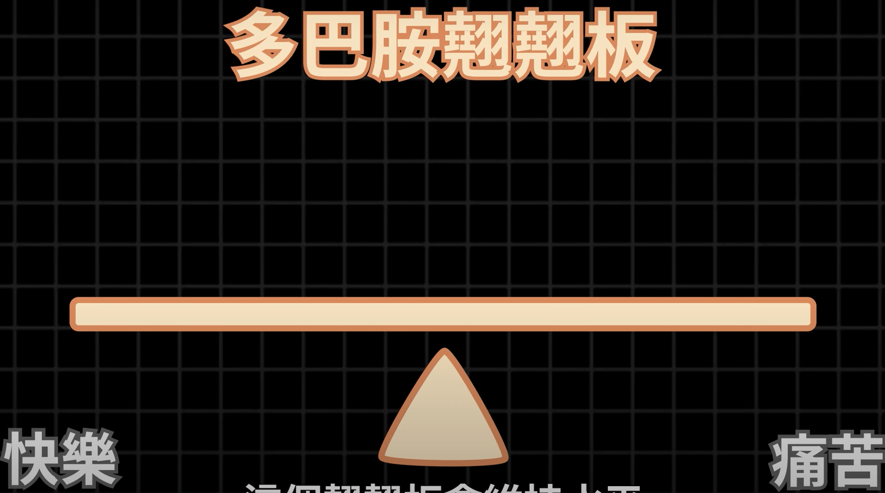
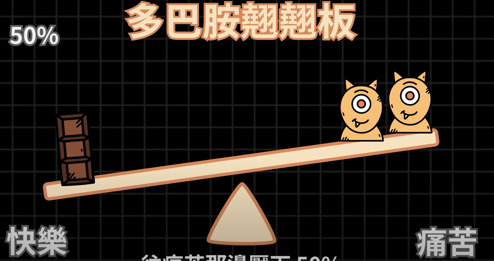
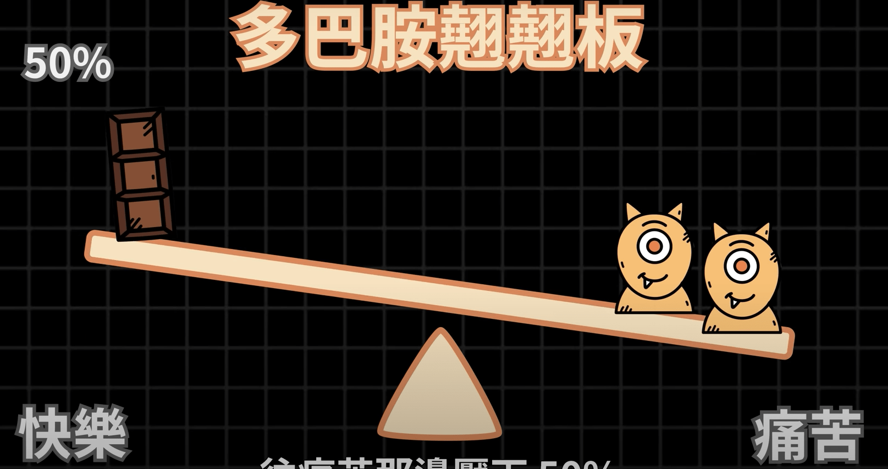
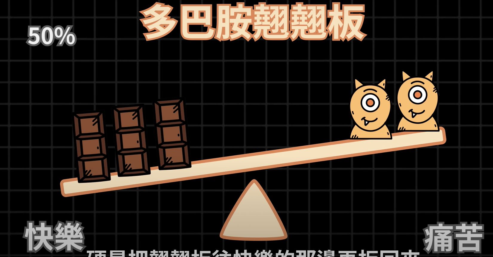

# 戒断多巴胺(平衡多巴胺)
>并非是戒断多巴胺，而是让多巴胺恢复平衡

## 多巴胺是什么？
多巴胺是一种神经调节物质，将兴奋及开心信息的传递

## 多巴胺翘翘板
科学研究发现大脑中掌管快乐和痛苦的区域是重叠的，有点类似于掌控快乐和痛苦的翘翘板

人在让自己感觉快乐事情的时候，翘翘板快乐的一方就会下沉，同时多巴胺为了保持平衡就是尝试让痛苦增加来保持多巴胺翘翘板的平衡，但是不会立马平衡，而是先往痛苦的一方下沉然后才恢复平衡

## 上瘾的原理

假设你吃了一个巧克力，那快乐一方就会下沉，然后多巴胺为了保持平衡尝试增加痛苦，但是不会立马平衡

此时你感受到了痛苦，你想消除这些痛苦，就又吃了巧克力

周而复始你就上瘾了，随着快乐增加，痛苦也在增加

## 神经耐受性
同样的刺激所带来的快乐会逐渐越来越少，而痛苦会越来越多，痛苦反应越来越快，此时感受快乐的能力下降，更容易感受到痛苦

## 如何戒断多巴胺

### 数据(Data)
统计自己的上瘾行为，记录自己上瘾的时间，频率等数据，让自己知道上瘾的程度

### 目的(Objective)
知道自己使用这些成瘾事物的目的是什么

### 问题(Problem)
知道这些成瘾事物会给你带来什么问题

### 节制(Abstinence)
通过上面三个步骤了解自己的成瘾事物，整整30天彻底戒断与成瘾事物之间的联系，戒断成瘾物质之后才能再次让多巴胺翘翘板恢复平衡，才能再次从较小的奖励中获得快乐

### 正念(Mindfulness)
当我们一感觉无聊或一点点不舒服就会想找些事情转移注意力，去找手边可以快速提升多巴胺的东西
解决方案：等一下(wait)，当有冲动去接触让自己成瘾的事物的时候，先等一下，**闭上双眼**问自己以下几个问题
1. 自己现在感受到了什么以至于想去做这件事？
2. 我去做了这件事物后会发生什么？
3. 这事情可以我的解决问题还是会让问题更严重？
4. 我能不能做点其它的事情解决我现在的问题？

### 洞见(Insight)
在成功戒断成瘾事物的一个月后，就会对成瘾事物的影响有一个新的洞见(看法)

### Next Step(下一步)
计划下一步，重新考虑要不要继续使用会让你上瘾的东西，如果要接触需要制定计划

### Experiment(实验)
实验上一步你的计划，在接触的时候做一些限制
- 如果是手机上瘾，把手机当做注意力大敌，放在很难拿到的地方
- 在浏览器上装 `StayFocusd` 插件，限制上特定网站的使用时间
