# 自己VScode相关配置及常用插件

## 颜色主题
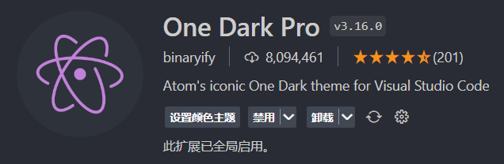
* [One Dark Pro](https://marketplace.visualstudio.com/items?itemName=zhuangtongfa.Material-theme)

## 图标主题
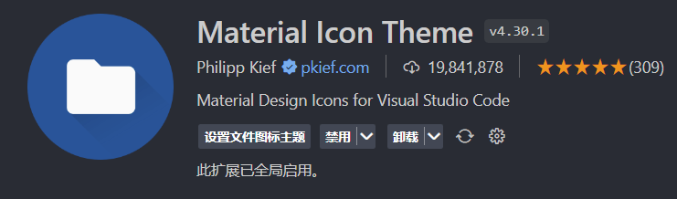
* [Material Icon Theme](https://marketplace.visualstudio.com/items?itemName=PKief.material-icon-theme)

## 语言
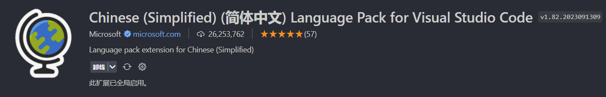
* [Simplified) (简体中文) Language Pack for Visual Studio Code](https://marketplace.visualstudio.com/items?itemName=MS-CEINTL.vscode-language-pack-zh-hans)

## Vue
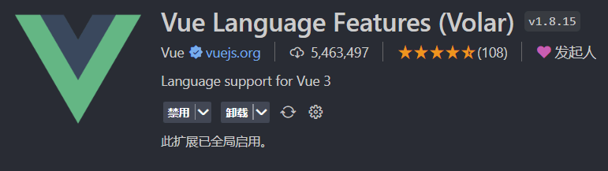
* [Vue Language Features (Volar)](https://marketplace.*visualstudio.com/items?itemName=Vue.volar)

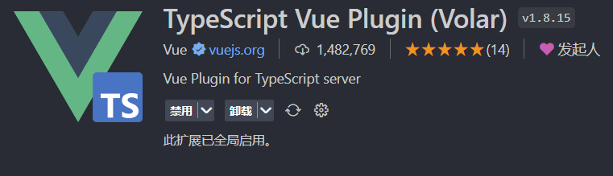
* [TypeScript Vue Plugin (Volar)](https://marketplace.visualstudio.com/items?itemName=Vue.vscode-typescript-vue-plugin)

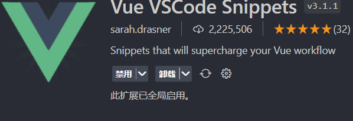
* [Vue VSCode Snippets](https://marketplace.visualstudio.com/items?itemName=sdras.vue-vscode-snippets)

## 代码格式化
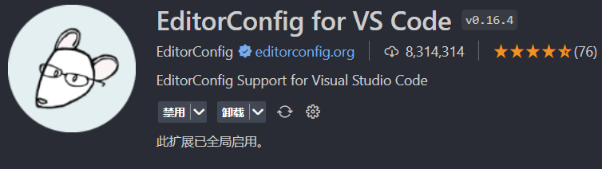
* [EditorConfig for VS Code](https://marketplace.visualstudio.com/items?itemName=EditorConfig.EditorConfig)

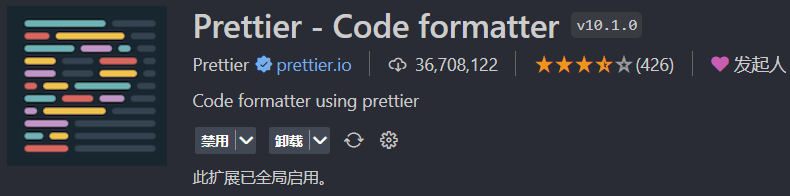
* [Prettier - Code formatter](https://marketplace.visualstudio.com/items?itemName=esbenp.prettier-vscode)

## 代码校验
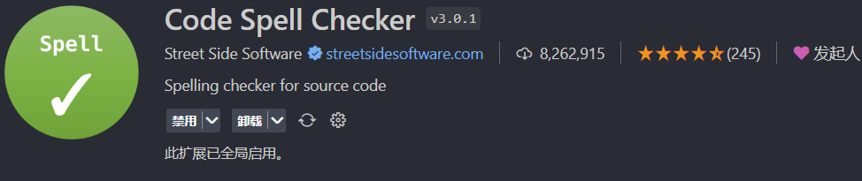
* [Code Spell Checker](https://marketplace.visualstudio.com/items?itemName=streetsidesoftware.code-spell-checker)

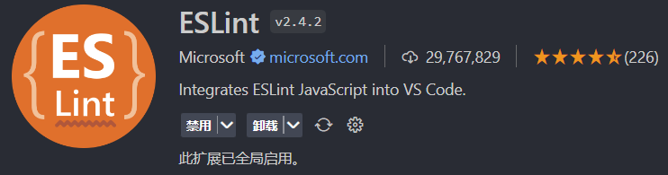
* [ESLint](https://marketplace.visualstudio.com/items?itemName=dbaeumer.vscode-eslint)

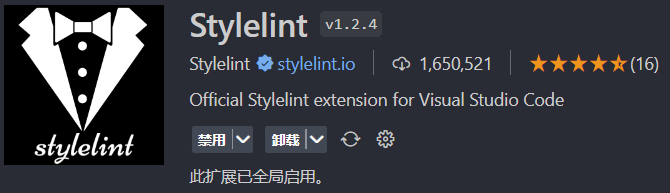
* [Stylelint](https://marketplace.visualstudio.com/items?itemName=stylelint.vscode-stylelint)

## Git
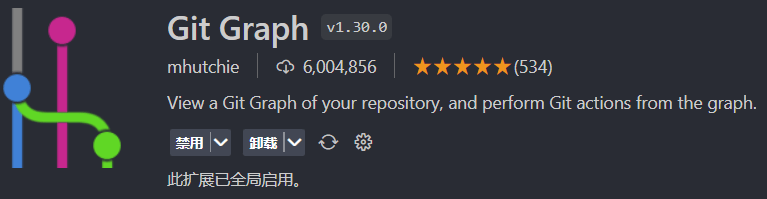
* [Git Graph](https://marketplace.visualstudio.com/items?itemName=mhutchie.git-graph)


* [git-commit-plugin](https://marketplace.visualstudio.com/items?itemName=redjue.git-commit-plugin)


* [Git History](https://marketplace.visualstudio.com/items?itemName=donjayamanne.githistory)

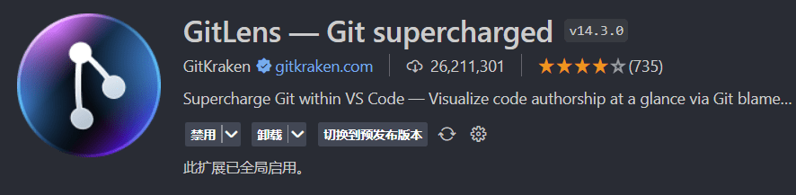
* [GitLens — Git supercharged](https://marketplace.visualstudio.com/items?itemName=eamodio.gitlens)

## SCSS
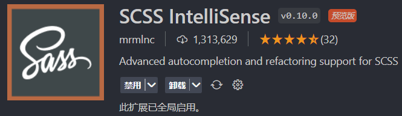
* [SCSS IntelliSense](https://marketplace.visualstudio.com/items?itemName=mrmlnc.vscode-scss
)

## npm
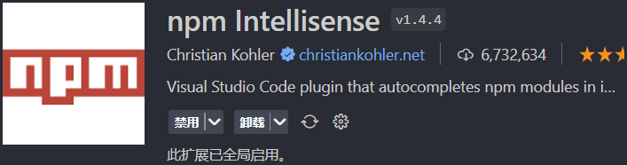
* [npm Intellisense](https://marketplace.visualstudio.com/items?itemName=christian-kohler.npm-intellisense)

## 其它
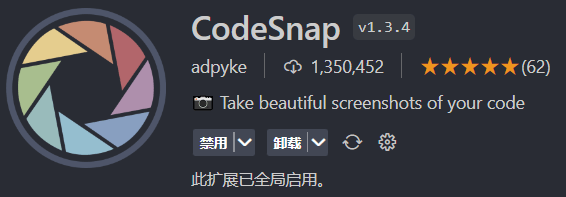
* [CodeSnap](https://marketplace.visualstudio.com/items?itemName=adpyke.codesnap)

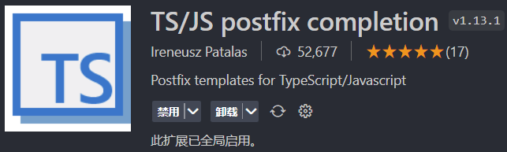
* [TS/JS postfix completion](https://marketplace.visualstudio.com/items?itemName=ipatalas.vscode-postfix-ts)

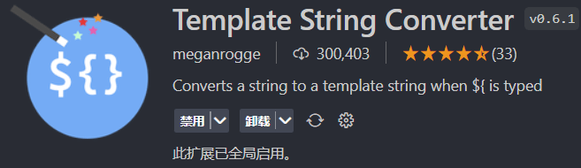
* [Template String Converter](https://marketplace.visualstudio.com/items?itemName=meganrogge.template-string-converter)

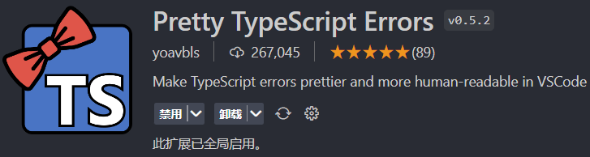
* [Pretty TypeScript Errors](https://marketplace.visualstudio.com/items?itemName=yoavbls.pretty-ts-errors)

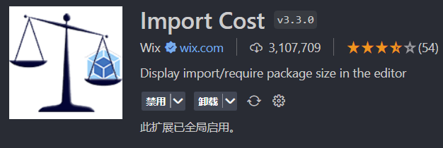
* [Import Cost](https://marketplace.visualstudio.com/items?itemName=wix.vscode-import-cost)

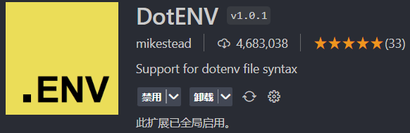
* [DotENV](https://marketplace.visualstudio.com/items?itemName=mikestead.dotenv)


* [Code Runner](https://marketplace.visualstudio.com/items?itemName=formulahendry.code-runner)


* [Live Preview](https://marketplace.visualstudio.com/items?itemName=ms-vscode.live-server)

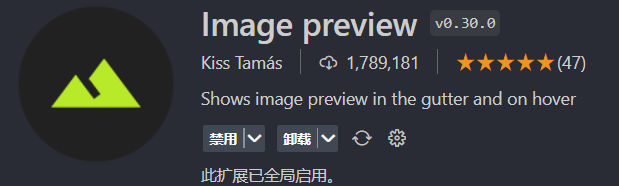
* [Image preview](https://marketplace.visualstudio.com/items?itemName=kisstkondoros.vscode-gutter-preview)

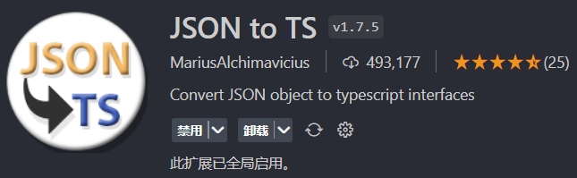
* [JSON to TS](https://marketplace.visualstudio.com/items?itemName=MariusAlchimavicius.json-to-ts)

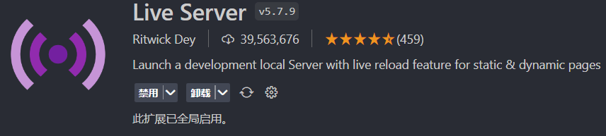
* [Live Server](https://marketplace.visualstudio.com/items?itemName=ritwickdey.LiveServer)

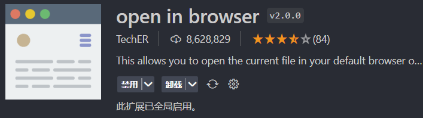
* [open in browser](https://marketplace.visualstudio.com/items?itemName=techer.open-in-browser)

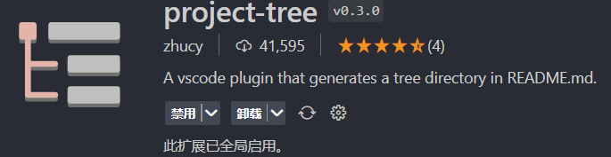
* [project-tree](https://marketplace.visualstudio.com/items?itemName=zhucy.project-tree)

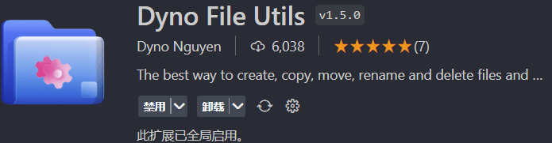
* [Dyno File Utils](https://marketplace.visualstudio.com/items?itemName=dyno-nguyen.vscode-dynofileutils)

## 设置

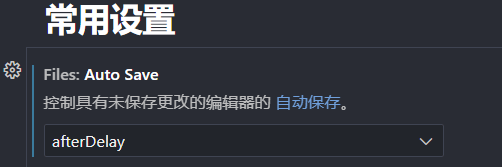
```json
 "files.autoSave": "afterDelay"
```

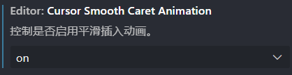
```json
"editor.cursorSmoothCaretAnimation": "on"
```

```json
"editor.mouseWheelZoom": true
```

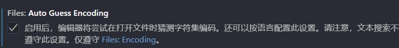
```json
"files.autoGuessEncoding": true
```

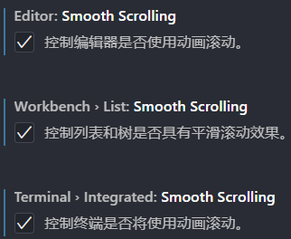
```json
"editor.smoothScrolling": true,
"workbench.list.smoothScrolling": true,
"terminal.integrated.smoothScrolling": true
```


```json
"editor.formatOnPaste": true
```


```json
"editor.formatOnType": true
```

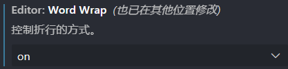
```json
"editor.wordWrap": "on"
```

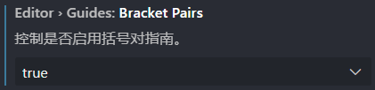
```json
"editor.guides.bracketPairs": true
```

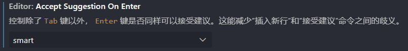
```json
"editor.acceptSuggestionOnEnter": "smart"
```
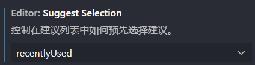
```json
"editor.suggestSelection": "recentlyUsed"
```
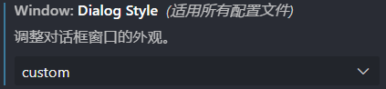
```json
"window.dialogStyle": "custom"
```
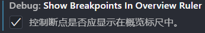
```json
"debug.showBreakpointsInOverviewRuler": true,
```
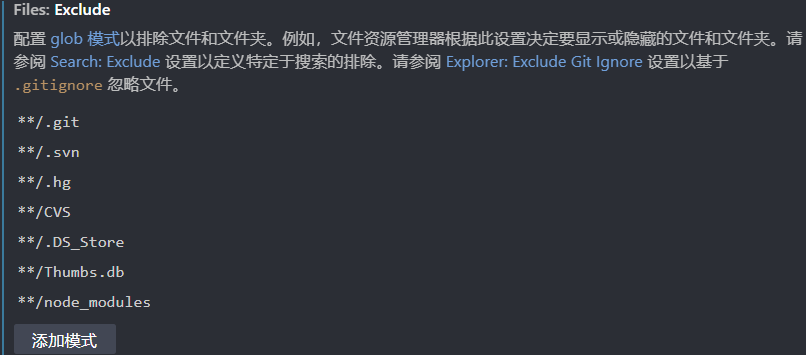
```json
"files.exclude": {
  "**/node_modules": true
}
```
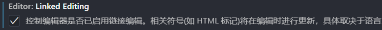
```json
"editor.linkedEditing": true
```