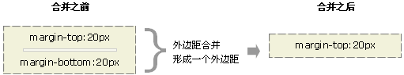
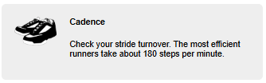
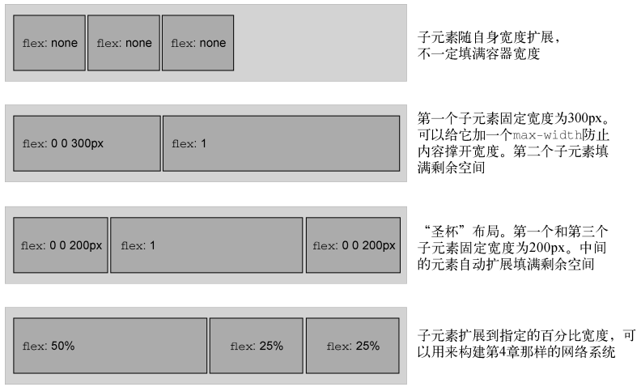
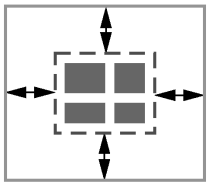
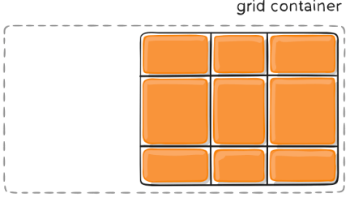

# CSS 笔记

CSS 英文全称为 **Cascading Style Sheets**，中文翻译为 “层叠样式表”


## 术语解释

**声明** 

解释：CSS 的一行，由一个属性和一个值组成

```css
color: red;
```


**声明块**

解释：包含在大括号内的一组声明。声明块前有一个**选择器**(例如下方的 `body`)

```css
body {
  color: black;
  font-family: Helvetica;
}
```


**规则集（ruleset）**

解释：由声明块和选择器组成，一个规则集也简称为一个**规则（rules）**，例如前面的整个代码就是一个规则集


**@规则（at-rules）**

解释：指用 `@` 符号开头的语法，例如：`@import` 和 `@media`


## 层叠


### 规则

当声明冲突时，会按照以下规则顺序解决冲突

1. 样式表的来源
2. 选择器优先级
3. 在源码中的顺序


### 样式表的来源

样式表有以下来源：

- **用户代理样式表（User Agent Styles）：** 浏览器的默认样式，例如：`<h1>` 标签自带加粗和字体大小以及外边距的默认样式
- **用户样式表（User Styles）：** 用户通过浏览器插件(如 `Stylus` 插件)、浏览器设置或开发者工具定义的样式，较少见
- **作者样式表（Author Styles）：** 网页的开发者（即 “作者”）编写的样式表，根据定义位置可以分为如下：
  - 外部样式表：通过 `<link>` 标签引入的外部 CSS 文件
  - 内部样式：在 HTML 内部使用 `<style>` 标签定义的样式
  - 行内样式(内联样式)：通过元素的 `style` 属性直接定义的样式


### 样式表的优先级

样式表的优先级由低到高如下：

1. 用户代理样式表
2. 用户样式表
3. 作者样式表
   1. 外部样式表
   2. 内部样式表
   3. 行内样式表(内联样式表)
   4. 外部样式表的 `!important`
   5. 内部样式表的 `!important`
   6. 行内样式(内联样式)的 `!important`

**⚠️ 注意：不推荐在行内样式中使用 `!important`，因为优先级最高，无法被覆盖修改**


### 选择器的优先级

选择器的优先级由低到高如下：

| 选择器                                                       | 优先级标记 |
| ------------------------------------------------------------ | ---------- |
| 通用选择器（`*`）和组合器（`>`、`+`、`~`）                   | `(0,0,0)`  |
| 标签选择器（`p`）                                            | `(0,0,1)`  |
| 伪类选择器（`:hover`）、属性选择器（`[type="text"]`）、类选择器（`.class`） | `(0,1,0)`  |
| ID 选择器（`#id`）                                           | `(1,0,0)`  |

同时使用多个类型的选择器会让它们的优先级标记进行个数计算，例如 `(1,2,2)` 表示选择器由 1 个 ID 选择器、2 个类选择器、2 个标签选择器组成


### 源码顺序

当两个声明的来源和选择器优先级相同，这时哪个声明最晚出现，则使用哪个声明

**⚠️ 注意： 给链接添加样式时一定要按照正确的顺序书写选择器**

**❌ 错误的顺序**

```css
a:hover {
  text-decoration: underline;
}

a:link {
  color: blue;
  text-decoration: none;
}

a:visited {
  color: purple;
}

a:active {
  color: red;
}
```


此时 `a:hover` 的样式被 `a:link` 的样式覆盖，导致鼠标悬浮链接时不显示下划线


**✔️正确的顺序**

```css
a:link {
  color: blue;
  text-decoration: none;
}

a:visited {
  color: purple;
}

a:hover {
  text-decoration: underline;
}

a:active {
  color: red;
}
```


顺序记忆口诀：“LoVe/HAte”（“爱/恨”），其中 L 表示 `link`，V 表示 `visited`，H 表示 `hover`，`A` 表示 `active`


**层叠值**

一个声明在样式表来源、选择器优先级、以及源码顺序中胜出，最终使用的值被称为 “层叠值”

元素的每个属性最多只有一个层叠值，元素上一个属性都没指定，则该属性没有层叠值

```css
p {
  margin-top: 20px; /* 外部样式 */
}

#main p {
  margin-top: 30px; /* 内部样式 */
}

p {
  margin-top: 40px; /* 内联样式 */
}
```

上述代码中，因为样式来源中内联样式的优先级最高，所以 `<p>` 元素的 `margin-top` 属性的层叠值为 `40px`


### 最佳实践

处理层叠时的建议：

1. **不使用 ID 选择器来添加样式：** 因为 ID 选择器优先级过高，需要使用其它的 ID 选择器或者 `!important` 才能覆盖
2. **不使用 `!important`：** 比 ID 选择器更难覆盖，要覆盖就需要添加 `!important`，当很多声明都添加了 `!important` 时，就又会从样式表来源、选择器优先级以及源码顺序来比较了

**⚠️ 注意：** 在特殊情况中，上述两条建议**不必死板遵守**


创建用于分发的 NPM 包的建议：

1. 不要在 JavaScript 中使用行内样式：会导致想修改属性需要使用 `!important`
2. 在包中包含一个样式表，通过 JavaScript 来给元素添加或删除类：方便用户可以编辑其中的样式


## 继承

如果一个属性没有层叠值，则可能会继承祖先元素的值，继承是顺着 DOM 树向下传递的


例如在 `<body>` 标签中添加 `font-family` 属性，则 `<body>` 标签内的所有元素都会继承这个字体

```css
body {
  font-family: sans-serif;
}
```

**⚠️ 注意： 不是所有的属性都是能被继承的**，通常只有文本相关属性（例如：`color`、`font-family`、`font-style` 等）、列表相关属性（例如：`list-style`、`list-style-image` 等）以及表格的边框属性（例如：`border-collapse` 和 `border-spacing`）等可以被继承


## 特殊值

**inherit**

`inherit` 用于继承父元素的属性值

```css
a:link {
  color: blue;
}

.footer {
  color: #666;
}

.footer a {
  /* 该属性值会继承父元素的值，此处继承的层叠值为#666 */
  color: inherit;
}
```

**⚠️ 注意：** `inherit` 可以使任何属性的值强制继承父元素的值，例如继承父元素的外边距，**但是这样很少使用**


**initial**

`initial` 用于将某个属性的值重置为初始值

```js
a:link {
  color: blue;
}

.footer a {
  /* 该属性值会重置为初始值，color的初始值通常为black */
  color: initial;
}
```

**⚠️ 注意：** 

- `width` 属性的初始值为 `auto`，但并非所有属性都支持 `auto`，**推荐使用 `initial`**

- `display` 属性的初始值为 `inline`，而**不是根据元素类型来确定 `display` 属性的初始值**


## 简写属性

简写属性可以同时给多个属性赋值，常见的简写属性有：`background`、`border`、`border-width`、`font` 等

**⚠️ 注意：** 使用简写属性时，如果省略一些值，这些值会被隐式设置为初始值（与 `initial` 类似），从而导致覆盖其它地方定义的样式，**使用时需要小心（尤其是 `font` 简写属性问题最严重）**

例如：

```css
h1 {
  font-weight: bold;
}

h1.title {
  /* 简写属性指定字体相关的值 */
  font: 32px Helvetica, Arial, sans-serif;
}
```

上述代码的 `<h1>` 标签默认加粗的效果被简写属性隐式设置的初始值所覆盖


**简写属性的顺序**

- 针对元素四边的属性，例如：`margin`、`padding` 等

  - 4 个值时：`margin: 上 右 下 左`
  - 3 个值时：`margin: 上 左右 下`，左边右边使用相同的值
  - 2 个值时：`margin: 上下 左右`，上边下边使用相同的值，左边右边使用相同的值
  - 1 个值时：`margin: 上下左右`，上边下边左边右边都使用相同的值

  **⚠️ 注意：** 大部分情况只需要指定 2 个值，针对较小的元素设置内边距，左右的内边距最好大于上下的内边距

- 涉及一个点出发的两个方向的属性，例如：`background-position`、`box-shadow` 等，这类属性通常是先指定 x 值再指定 y 值

  ```css
  /* 先指定x值，再指定y值，最后是阴影颜色 */
  box-shadow: 10px 2px #6f9090;
  ```

- 其它属性，这类简写属性不在乎值的顺序，因为浏览器知道对应的样式对应什么类型的值，例如：`border`

  ```css
  /* 以下两种顺序等价 */
  border: 1px solid black;
  border: solid 1px black;
  ```

  


## 页面设计发展史

在早期的计算机应用程序开发和印刷出版中，开发人员和出版商能够明确知道媒介的限制，例如程序的窗口大小或页面尺寸都是固定的，因此可以使用固定单位（如像素或英寸）来精确布局

早期 Web 设计采用了 “像素级完美” 的设计理念，即通过创建一个紧凑的、居中的容器（通常约 800px 宽），在限制的范围内使用固定单位进行精确布局，类似于早期应用程序和印刷出版的设计方式

但随着技术发展，出现了越来越多高清显示器，此时人们探讨是否可以安全的把网页宽度设计成 1024px 宽(而不是 800px)，之后又开始讨论 1280px 宽，但当时无法适应所有设备，尤其是小屏幕设备（如笔记本电脑、平板电脑）

直到智能手机的出现，不得不抛弃固定的网页宽度设计，开始使用**响应式**设计

**响应式：** CSS 中的响应式是指样式能够根据浏览器窗口大小有不同的 “响应”，通常会考虑任何尺寸的手机、平板设备或者电脑屏幕


## 固定单位

CSS支持多种固定单位，最常用的是 `px`（像素），不常用的单位还有：`mm`（毫米）、`cm`（厘米）、`in`（英寸）、`pt`（点，印刷术语）、`pc`（派卡，印刷术语）

**各单位之间的换算关系：** `1in = 25.4mm = 2.54cm = 6pc = 72pt = 96px`


## 相对单位

相对单位可以基于浏览器的窗口大小来等比例缩放字号，也可以根据基础字号来设置页面上任何元素的大小，**相对单位是 CSS 响应式设计中的重要组成部分**

相对单位最终计算出来的固定单位的值被称为 **“计算值”**

CSS 常见的相对单位有：`em`、`rem`、`vw`、`vh`、`%` 等


### em

基于当前元素的字号 `font-size` 来计算具体的值

```css
.padded {
  font-size: 16px;
  padding: 1em;
}
```

此时 `padding` 属性的值为 16px，计算过程：`1x16=16`


**当 `font-size` 属性使用 `em` 单位时**

```css
body {
  font-size: 16px;
}

.padded {
  font-size: 0.8em;
  padding: 1em;
}
```

这里假设 `body` 是 `.padded` 的父元素，此时 `padding` 属性的值为 12.8px，`.padded` 的 `font-size` 属性的值为 12.8px

计算过程：

1. 首先计算 `font-size` 属性的值，`.padded` **继承** `<body>` 的 `font-size` 属性的值，再与 0.8 相乘，`16 x 0.8 = 12.8`
2. 然后再计算 `padding` 属性的值，`1 x 12.8 = 12.8`


**em 换算公式**

`想要的像素大小 / 当前元素的字号大小 = em 的值`

例如：`16 / 16 = 1em`，`12.8 / 16 = 0.8em`


**字体缩小问题**

使用 `em` 指定多重嵌套元素的字号时会出现字体逐渐缩小或放大的问题

```html
<body>
  <ul>
    <li>
      Top level
      <ul>
        <li>
          Second level
          <ul>
            <li>
              Third level
              <ul>
                <li>
                  Fourth level
                  <ul>
                    <li>Fifth level</li>
                  </ul>
                </li>
              </ul>
            </li>
          </ul>
        </li>
      </ul>
    </li>
  </ul>
</body>
```

```css
body {
  font-size: 16px;
}

ul {
  font-size: 0.8em;
}
```


原因：`<li>` 会继承父级元素 `<ul>` 的 `font-size` 属性的值进行计算

计算过程：

1. `Top level` 层，字号为 12.8px，继承 `<ul>` 的 `font-size` 属性值，`<ul>` 的 `font-size` 属性值继承 `<body>` 的字号进行计算，结果为 `16x0.8=12.8`
2. `Second level` 层，字号为 10.24px，继承 `<ul>` 的 `font-size` 属性值，`<ul>` 的 `font-size` 属性值继承 ``Top level` 层 `<ul>` 的字号进行计算，结果为 `12.8x0.8=10.24`
3. `Third level` 层，字号为 8.192px，继承 `<ul>` 的 `font-size` 属性值，`<ul>` 的 `font-size` 属性值继承 `Second level` 层 `<ul>` 的字号进行计算，结果为 `10.24x0.8=8.192`

以此类推计算


该问题解决方案：

```css
body {
  font-size: 16px;
}

ul {
  font-size: 0.8em;
}

/* 除第一个ul之外的ul都默认继承父级的字号，1em不会缩小和放大字号 */
ul ul {
  font-size: 1em;
}
```


**⚠️ 注意：** 这样的解决方案通过提升选择器的优先级覆盖规则，依旧不好，可以使用 `rem`

```css
:root {
  font-size: 1em;
}

ul {
  font-size: 0.8rem;
}
```

**⚠️ 注意：建议对字号使用 `rem` 而非 `em`，`em` 用在元素的内边距、外边距及大小上很好**


### rem

`<html>` 元素是顶级（根）节点，是所有其它元素的祖先元素，**根节点可以使用一个伪类选择器（`:root`）来选中自己**，等价于 `html` 元素选择器，但是 `:root` 优先级相当于类名，比元素选择器更高

```css
/* 等价于使用 html {}，但是优先级更高 */
:root {
  font-size: 16px;
}
```


`rem` 是 root em 的缩写，与 `em` 单位类似，只不过是基于**根节点的字号**进行计算的

```css
:root {
  font-size: 1em;
}

ul {
  font-size: 0.8rem;
}
```

上述代码计算过程：

1. `<html>` 根元素的字号为 16px，根元素上的 em 是相对于浏览器的默认字号进行计算，默认字号通常是 16px，计算过程为 `16 x 1 = 16`
2. `<ul>` 元素的字号为 12.8px，基于根节点的字号进行计算，计算过程为 `16 x 0.8 = 12.8`

**⚠️ 注意：** 用户可以修改浏览器的默认字号（默认值为 16px），**但不会影响已经使用 `px` 单位或其它绝对单位的字号**，修改默认字号对部分用户很有需要，所以建议始终使用相对单位来设置字号来适配可能修改的默认字号


### 使用建议

用 `rem` 来设置字号（`font-size`）、用 `px` 来设置边框、用 `em` 来设置其它大部分属性


### 停止像素思维

经常有人将网页根元素的字号设置为 `0.625em` 或者 `62.5%`

```css
:root {
  font-size: 0.625em;
}
```

这样做是想将根元素的默认字号 16px 修改为 10px，方便后续的 `rem` 单位的换算，例如：想将 14px 转换为 `rem` 单位，就用 `14 / 10 = 1.4rem`，但是这样做有以下两个缺点：

1. 因为将页面的根元素字号设置为了 10px，导致页面中所有元素的默认继承的字号都为 10px，有点偏小，导致需要给每个元素都要设置字号，**被迫写更多的代码**
2. 这样的做法本质还是属于像素思维，过度依赖具体的像素值来进行布局和设置样式，忽略了响应式和可伸缩的布局

**正确的做法：**

1. 对于第一个缺点，**将根元素的字号保持默认或者设置为 `1em`，与浏览器默认字号保持一致**，通过计算器或者其它的 `px` 转 `rem` 的工具来进行计算，默认的 16px 字号适合页面上绝大多数元素

   ```css
   :root {
     font-size: 1em;
   }
   ```

2. 对于第二个缺点，平常开发的时候需要习惯 “模糊” 值，不要刻意在意具体是多少像素，**重点是它比默认字号要稍微大或小一点**，如果显示效果不理想，就可以调整它的值，以达到合适的显示效果


### 视口的相对单位

**视口：** 浏览器窗口中可见部分的区域，不包括浏览器的地址栏、工具栏、状态栏

有以下单位：

- `vh` 视口高度的 1/100
- `vw` 视口宽度的 1/100
- `vmin` 视口宽、高中最小一边的 1/100
- `vmax` 视口宽、高中最大一边的 1/100

视口相对单位适合用于填满整个屏幕的大图，例如给图片高度设置 `100vh`


**使用 `vw` 定义字号**

在一个元素上使用 `vw` 单位指定字号，可以在不同视口宽度下平滑的过度字号，但是**不推荐使用**

存在以下问题：

1. 在小屏幕中字号变得过小，在大屏幕上字号变得过大
2. 无法精确控制在不同设备上的表现，因为 `vw` 依赖视口的宽度
3. 在浏览器宽度调整时会导致布局频繁变化，影响体验


### 百分比

- 当元素使用百分比（`%`）设置**宽度**时，是基于元素**包含块的宽度**进行计算

- 当元素使用百分比（`%`）设置**高度**时，是基于元素**包含块的高度**进行计算


**包含块**

包含块是一个元素在计算尺寸（如宽度、高度、边距、定位时）所参考的矩形区域


**初始化包含块**

如果一个元素没有明确的包含块（如：`<html>` 和元素使用了 `position: fixed` 或 `position: absolute`，并且没有定位祖先元素），则它的包含块为初始包含块，**初始包含块的大小通常等于视口的大小**


**包含块的确定规则：**

包含块的确定取决于元素的 `position` 属性

- **静态定位 `position: static` 和相对定位 `position: relative`**
  - 包含块是最近的**块级祖先元素**的内容区域
  - 如果没有块级祖先元素，则包含块为初始包含块
- **绝对定位 `position: absolute`**
  - 包含块是最近的 **定位祖先元素（即 `position` 为 `relative`、`absolute`、`fixed` 或 `sticky` 的元素）** 的 **padding box**（内容区域 + padding）
  - 如果没有定位祖先元素，则包含块是初始包含块
- **固定定位 `position: fixed`**
  - 包含块是初始包含块
- **粘性定位 `position: sticky`**
  - 包含块是最近的 **滚动祖先元素（即 `overflow: auto` 或 `overflow: scroll` 的元素）** 的内容区域
  - 如果没有滚动祖先元素，则包含块是初始包含块


### calc()

`calc()` 函数可以对两个及以上的值进行四则运算（加、减、乘、除），括号内的值可以是不同单位的数值

```css
:root {
  font-size: calc(0.5em + 1vw);
}
```

**⚠️ 注意：加号和减号运算符两边必须要有空格**，建议在每个操作符前后都添加一个空格


### 无单位的数值和行高

部分属性支持无单位数值，例如：`z-index`、`line-height`、`font-weight` 等，任何长度单位（`px`、`em`、`rem` 等）都可以使用无单位的 `0`，无单位的 `0` 不能用于角度、时间等相关的值

`line-height` 属性的值既可以有单位，也可以没有单位，**两者主要的差异在继承方式上**

```html
<body>
  <p class="about-us">
    We have built partnerships with small farms around the world to
    hand-select beans at the peak of season. We then carefully roast in small
    batches to maximize their potential.
  </p>
</body>
```

- 值无单位的情况

  ```css
  body {
    line-height: 1.2;
  }
  
  .about-us {
    font-size: 2em; /* 值为16px*2=32px */
    /* 继承了父元素1.2声明值进行计算，此时line-height属性的值为1.2*32px=38.4px */
  }
  ```
  
  
  
- 值有单位的情况

  ```css
  body {
    line-height: 1.2em; /* 值为16px*1.2=19.2px */
  }
  
  .about-us {
    font-size: 2em; /* 值为16px*2=32px */
    /* 继承了父元素的计算值，此时line-height属性的值为19.2px */
  }
  ```
  
  

**建议：** 可以在 `<body>` 元素上设置一个**无单位数值的行高**，之后就无需修改了，如果部分元素行高需要调整可以单独覆盖


### 自定义属性（CSS 变量）

CSS Variables 全称为 **Custom Properties for Cascading Variables**，中文翻译过来就是层叠变量的自定义属性，简称自定义属性，也叫 CSS 变量

**⚠️ 注意：** 自定义属性与 Scss、Less 等 CSS 预处理器的内置变量是不同的，前者是运行在浏览器环境，可以动态变化，后者只在预处理器编译阶段运行，最终生成的是静态的 CSS 代码，无法在浏览器运行时更改


**定义一个 CSS 变量**

```css
:root {
  --main-font: Helvetica, Arial, sans-serif;
}
```

**⚠️ 注意：变量名前必须要有两个连字符 `--`**，用来和 CSS 属性区分，`--` 后面的部分可以跟字母、数字、连字符、下划线


**引用 CSS 变量**

```css
p {
  font-family: var(--main-font);
}
```

通过 `var()` 函数对变量进行引用，可以接收两个参数，第一个参数为变量名，第二个参数为备用值，当第一个参数的变量没有被定义时，会使用第二个备用值

```css
:root {
  --main-font: Helvetica, Arial, sans-serif;
}

p {
  color: var(--main-color, blue); /* 此时值为 blue */
}
```

**⚠️ 注意：** 如果没有提供备用值，并且第一个参数的变量没有被定义，则 `var()` 函数计算出来是一个**非法值**，这时对应的属性值会变成其初始值，类似于 `initial` 的效果

在引用自定义属性时，尽量为不支持的浏览器提供回退方案

```css
p {
  color: black;
  color: var(--main-color, blue); /* 支持自定义属性时会覆盖之前的声明 */
}
```

**⚠️ 注意：** 很难对**动态的自定义属性**提供回退方案


**使用 JavaScript 访问自定义属性**

```js
const rootElement = document.documentElement; // 获取根元素
const styles = getComputedStyle(rootElement); // 获取根元素的样式对象
const mainColor = styles.getPropertyValue('--main-bg'); // 从样式对象上读取自定义属性的值
console.log(mainColor); // 打印值
```


**使用 JavaScript 修改自定义属性**

```js
const rootElement = document.documentElement; // 获取根元素
rootElement.style.setProperty('--main-bg', '#cdf'); // 修改自定义属性的值
```


## 盒模型

W3C 标准盒子模型（content-box）计算：


- 总宽度：内容宽度 + 左右内边距 + 左右边框
- 总高度：内容高度 + 上下内边距 + 上下边框


IE 盒子模型（border-box）计算：


- 总宽度：内容宽度（已包含左右内边距和边框）
- 总高度：内容高度（已包含上下内边距和边框）


**在开发中建议将如下代码放在样式表的开头**，以此调整全局元素的盒模型为 `border-box`，便于开发

```css
:root {
  box-sizing: border-box;
}

*,
::before,
::after {
  box-sizing: inherit;
}
```

上述代码使用继承方式，是为了便于调整第三方组件的盒子模型，如果使用 `*` 会导致第三方组件内部的所有子元素都是 `border-box`，导致难以调整

 **⚠️ 注意：** 

- `*` 选择器不会选中伪元素，所以这里需要加上 `::before` 和 `::after` 选择器

- 第三方组件如果用的不是 IE 盒子模型，使用上述代码可能会导致样式出现问题，可以使用如下代码对第三方组件单独修改盒子模型

  ```css
  /* 调整第三方组件根元素的盒子模型 */
  .third-party-component {
    box-sizing: content-box;
  }
  ```


### 列之间添加间隔


假设一个界面有两列，一列宽度为 `70%`，另一列的宽度为 `30%`，两列之间需要有间隔，有如下三种方式可以添加


**使用百分比外边距添加间隔**

```css
.main {
  float: left;
  width: 70%;
  background-color: #fff;
  border-radius: 0.5em;
}

.sidebar {
  float: left;
  /* 从宽度中减去1% */
  width: 29%;
  /* 将1%作为间隔 */
  margin-left: 1%;
  padding: 1.5em;
  background-color: #fff;
  border-radius: 0.5em;
}
```


 **⚠️ 注意：** 这样无法使用别的单位精确控制间距


**使用calc函数外边距添加间隔**

```css
.main {
  float: left;
  width: 70%;
  background-color: #fff;
  border-radius: 0.5em;
}

.sidebar {
  float: left;
  /* 从宽度中减去1.5em */
  width: calc(30% - 1.5em);
  /* 将1.5em宽度作为间隔 */
  margin-left: 1.5em;
  padding: 1.5em;
  background-color: #fff;
  border-radius: 0.5em;
}
```

这样的代码看起来比第一种使用 `29%` 意图更加清晰


### 元素高度问题

元素处理高度与处理宽度是不一样的，普通文档流是为有限的宽度和无限的高度设计的

**普通文档流：** 是指网页元素的默认布局行为，行内元素跟随文字的方向从左到右排列，到达容器边缘时换行，块级元素会占据一整行，前后都有换行

 **⚠️ 注意：除非别无选择，否则不要明确设置元素的高度，设置高度一定会导致更复杂的情况**


**溢出行为**

当给元素设置高度时，内容可能会溢出容器，渲染到父容器的外面，此时可以使用 `overflow` 属性来设置溢出行为

建议给 `overflow` 属性设置 `auto`，在内容溢出的时候才显示滚动条


 **⚠️ 注意：** 当文本内容没有空格、连字符（`-`）或其他可换行字符时，浏览器不会对内容进行换行，这种文本称为**长文本**，例如 URL 就是长文本，浏览器将长文本视为一个整体，不会在中间换行，此时会导致内容水平溢出


**百分比高度问题**


想要实现如上图的等高列，左侧部分内容撑开高度，右侧部分高度自适应与左侧相同高度，**无法用过给右侧部分添加 `height: 100%` 达到效果**，以下有两个备选方案

用百分比指定高度存在问题，百分比参考的是元素包含块的大小，但是包含块的高度通常是由子元素的高度决定的，这样就造成的死循环，浏览器无法处理，会忽略这个声明，想让百分比高度生效，必须给父元素明确一个高度


**使用 CSS 表格布局实现等高列（兼容 IE8+）**

```html
<div class="wrapper">
  <div class="container">
    <main class="main">
      <h2>Come join us!</h2>
      <p>
        The Franklin Running club meets at 6:00pm every Thursday at the town
        square. Runs are three to five miles, at your own pace.
      </p>
    </main>
    <aside class="sidebar">
      <div class="widget"></div>
      <div class="widget"></div>
    </aside>
  </div>
</div>
```

```css
.wrapper {
  /* 使用父外边距抵消表格边框外部水平方向的间距 */
  margin-left: -1.5em;
  margin-right: -1.5em;
}

.container {
  /* 让容器布局像表格一样 */
  display: table;
  /* 默认情况，display:table元素宽度不会扩展到100%，所以需要指定宽度 */
  width: 100%;
  /* 设置表格单元格水平方向的间距，副作用：会导致表格边框外部水平方向也会有1.5em的间距 */
  border-spacing: 1.5em 0;
}

.main {
  /* 让列布局像表格的单元格一样 */
  display: table-cell;
  width: 70%;
  background-color: #fff;
  border-radius: 0.5em;
}

.sidebar {
  /* 让列布局像表格的单元格一样 */
  display: table-cell;
  width: 30%;
  /* 外边距不会在display: table-cell上起效果*/
  margin-left: 1.5em;
  padding: 1.5em;
  background-color: #fff;
  border-radius: 0.5em;
}
```

**缺点：** 需要额外的包装元素使用负外边距抵消 `border-spacing` 属性的副作用


**使用Flexbox弹性盒子布局实现等高列（兼容 IE10+）**

```html
<div class="container">
  <main class="main">
    <h2>Come join us!</h2>
    <p>
      The Franklin Running club meets at 6:00pm every Thursday at the town
      square. Runs are three to five miles, at your own pace.
    </p>
  </main>
  <aside class="sidebar">
    <div class="widget"></div>
    <div class="widget"></div>
  </aside>
</div>
```

```css
.container {
  /* 使用弹性盒子布局 */
  display: flex;
}

.main {
  width: 70%;
  background-color: #fff;
  border-radius: 0.5em;
}

.sidebar {
  width: 30%;
  /* 虽然使用了外边距导致宽度超出了100%，弹性盒子布局会自行妥善处理 */
  margin-left: 1.5em;
  padding: 1.5em;
  background-color: #fff;
  border-radius: 0.5em;
}
```

**推荐 IE10+ 的浏览器使用弹性盒子布局**


**使用 `min-height` 和 `max-height`**

`max-height`：用于指定元素的最大高度

`min-height`：用于指定元素的最小高度

类似的宽度也有 `max-width` 和 `min-width` 用于限制元素的宽度


**让元素内容垂直居中**

如果企图使用 `vertical-align: middle` 让**块级元素**内容垂直居中，**浏览器会忽略这个声明**

`vertical-align` 声明只会影响行内元素或 `table-cell` 元素内部的**行内内容**（如文本、图片等）

- 对于行内元素它控制着该元素跟同一行其它元素之间的垂直对齐关系，例如：图片和相邻的文字垂直对齐
- 对于 `table-cell` 元素，它控制着内容在单元格中的垂直对齐


**垂直居中指南**

通过问自己以下几个问题来判断使用哪种方法最合适

- 容器可以不设置固定高度吗？如果没有固定的高度则可以**给容器添加相等的上下内边距**

- 容器需要设置固定高度或者避免使用内边距吗？对容器使用 `display: table-cell` 和 `vertical-align: middle`，容器的父元素需要使用 `display: table` 才有效

- 可以使用 Flexbox 吗？如果不需要支持 IE9，则可以使用弹性盒子让内容居中

- 容器里面的内容只有一行文字吗？如果是的话使用 `line-height` 设置一个大的行高，让它等于理想的容器高度，这样会让容器高度扩展到合适的高度，如果内容不是行内元素，则可以给内容设置为 `display: inline-block`
- 容器盒内容的高度都知道吗？如果都知道则将内容设置为绝对定位，**只有前面的方法都不行再用这个方法**
- 不知道内部元素的高度？用绝对定位结合变形（`transform`），**只有前面的方法都不行再用这个方法**

也可以访问 http://howtocenterincss.com/ ，通过填写自己场景的选项会相应的生成垂直居中的代码


### 负外边距

**左边或者顶部的负外边距：** 元素会相应的向左或者向上移动，导致元素与前面的元素重叠

**右边或者底部的负外边距：** 元素不会移动，会将后面的元素拉过来

 **⚠️ 注意：** 如果一个**块级元素不指定宽度（默认是 `width: auto`）**，它会自然填充容器的宽度，如果在右边添加负外边距，则会将它**拉出容器**，可以用于抵消 `border-spacing` 的影响，如果块级元素指定了宽度，则不会拉出容器

- 未添加右侧负外边距的代码

  ```html
  <div class="container">
    <div class="box1"></div>
  </div>
  ```

  ```css
  .container {
    width: 300px;
    height: 200px;
    background-color: pink;
  }
  
  .container .box1 {
    height: 200px;
    color: red;
  }
  ```

  

- 添加右侧负外边距后的代码

  ```css
  .container {
    width: 300px;
    height: 200px;
    background-color: pink;
  }
  
  .container .box1 {
    color: red;
    height: 200px;
    /* 右侧负外边距 */
    margin-right: -80px;
  }
  ```

  

  如果给 `.box1` 元素指定具体的宽度，例如：`width: 100%`，则不会拉出容器


### 外边距折叠


**上下方向**的外边距相邻时，就会发生折叠，产生单个外边距，**取其中的最大值**

 **⚠️ 注意：** 只有上下方向的外边距会产生折叠，**水平方向的外边距不会折叠**


**多个嵌套的外边距折叠**


嵌套元素的垂直方向的外边距也会发生折叠，取其中的最大值


**自身外边距折叠**



假如**空元素**有上下外边距，也会与自身底部的外边距发生折叠，取其中的最大值，如果遇到另外一个元素的外边距会继续折叠，如下图


**防止外边距折叠**

- 给容器添加 `overflow: auto`（或者非 `visible` 的值），防止内部元素的上下外边距和容器的上下外边距折叠，**这种方法副作用最小**
- 在元素上下两个外边距之间添加边框或者内边距，防止它们折叠
- 如果容器为浮动元素、内联块（`inline-block`）、绝对定位或固定定位时，外边距不会在它外面折叠
- 当使用 Flexbox 布局或 Grid 布局时，内部的元素之间不会发生外边距折叠
- 当元素为 `table-cell` 时，外边距不会生效，也就不会折叠，此外还有 `table-row` 和大部分其他表格显示类型，但不包括` table`、`table-inline`、`table-caption`

 **⚠️ 注意：** 这些方法部分会改变布局，除非能产生想要的布局，否则不要轻易使用


### 容器内元素之间的间距


**使用相邻兄弟选择器来添加外边距**

```css
.button-link + .button-link {
  margin-top: 1.5em;
}
```

这样只能给紧跟在其他 `.button-link` 后的 `.button-link` 元素加上顶部外边距，**无法应用给其它类名的元素**


**使用迟钝的猫头鹰选择器（简称猫头鹰选择器）来添加全局外边距**

```css
body * + * {
  margin-top: 1.5em;
}
```

这段代码是给**所有相邻的兄弟元素**添加顶部外边距，这里使用 `body` 是因为 `<body>` 元素是 `<head>` 元素的兄弟节点，也会有外边距，所以需要排除

 **⚠️ 注意：** 使用猫头鹰选择器是需要权衡的，它省去了许多需要设置外边距的地方，**但在不需要外边距的地方需要自行覆盖**，通常只有在并列元素或者有多列布局的时候这样使用


## 浮动


### 设计初衷

**不是用于布局**，主要用于实现文档中**文字环绕图片**的效果，类似下图


但由于当时还没有 `display: flex` 和 `display: inline-block`，所以浮动一直承担着布局的重任

通过给元素添加 `float` 属性来添加浮动，值有 `left` 和 `right`，分别表示向左浮动和向右浮动，相邻的浮动元素之间会水平排列，如果一行装不下了会自动换行显示

 **⚠️ 注意：** 如果一个行内元素设置了 `float` 属性，则这个元素会变成块级元素


### 容器折叠问题

因为浮动元素不属于普通文档流的元素，**不会在容器保留之前占据的空间**，导致容器高度折叠，例如下图中的白色容器高度折叠了


### 清除浮动

要解决容器折叠的问题，需要清除浮动元素所带来的影响，有以下几种方案可以实现


**在容器的末尾添加一个元素用于清除浮动**

```html
<div class="container">
	<!-- 浮动元素相关代码... -->
  
  <!-- 清除浮动 -->
  <div style="clear: both"></div>
</div>
```

`clear: both` 属性可以让元素同时清除它**前面** `float: left` 和 `float: right` 元素带来的影响，会让该元素跑到所有前面浮动元素的最后面，以此来撑开容器的高度，**只会清除当前元素的兄弟元素中的浮动元素**

`clear` 属性的值还有 `left` 和 `right`

- `right`：表示只清除元素前面的 `float: right` 元素带来的影响
- `left`：表示只清除元素前面的 `float: left` 元素带来的影响

 **⚠️ 注意：** 

- 这种方式不优雅，需要在 HTML 中添加不必要的元素
- `clear` 属性只能加在块级元素身上有效


**使用伪元素清除浮动**

```html
<div class="container clearfix">
	<!-- 浮动元素相关代码... -->
</div>
```

```css
.clearfix::after {
  /* 将伪元素的display设置为非inline值，以便出现在文档中 */
  display: block;
  /* 旧版的Opera浏览器中有个隐藏的 bug，需要添加一个空格字符才能解决，建议保留 */
  content: ' ';
  /* 清除浮动 */
  clear: both;
}
```

为容器添加一个伪元素，就可以不用在 HTML 中添加一个元素

- `::after` 会在元素内的最末尾添加一个伪元素
- `::before` 会在元素内的最前面添加一个伪元素


**使用伪元素清除浮动并阻止外边距折叠**

让容器内的浮动元素的上下外边距不会和容器的上下外边距发生折叠，**当不想外边距折叠时，可以使用如下方式**

```html
<div class="container clearfix">
  <!-- 浮动元素相关代码... -->
</div>
```

```css
/* 因为是上下可能会出现折叠，所以需要在容器的最前面和最后面都添加伪元素 */
.clearfix::before,
.clearfix::after {
  display: table;
  content: ' ';
}

/* 清除浮动只需要容器内最后一个伪元素做就可以了 */
.clearfix::after {
  clear: both;
}
```

将伪元素设置为 `display: table` 元素，该元素不会外边距折叠，用来隔开浮动元素和容器的上下边接触，避免外边距折叠


### 浮动的陷阱

当多个浮动元素的高度不一致时，可能会导致以下的问题


第三个浮动元素无法浮动到最左边，因为被第一个浮动元素刚好高度挡住了，此时可以给第三个浮动元素添加一个 `clear: left;` 即可

如果是**两列多行**的布局，可以使用 `:nth-child` 选择器为每行第一个(奇数个)元素添加 `clear: left;`

```css
.media:nth-child(odd) {
  clear: left;
}
```

 **⚠️ 注意：** 这种方式**需要知道每行有几个元素**，如果每行的个数是随视口宽度变化的，建议换种布局方案或者使用 Flexbox 或 inline-block 元素来实现


### BFC

BFC 的全称是**块级格式化上下文（block formatting context）**，是一块独立渲染的区域，内部的元素**不会影响**外部的元素，反之亦然

右侧文字容器使用 BFC 前


右侧文字容器使用 BFC 后




BFC 的主要作用包括如下：

- **防止外边距重叠：** BFC 中内部的元素不会和外部的元素（包括 BFC 自身）的外边距产生折叠
- **清除浮动：** BFC 中可以包含浮动元素，高度不会塌陷
- **阻止元素被外部浮动元素覆盖：** BFC 容器内的元素不会与外部浮动元素重叠
- **独立布局：** BFC 内部的布局（如浮动元素、定位元素、外边距等）不会被外部元素（如外部浮动元素影响其它元素的字体环绕）影响，反之亦然


**给元素添加以下任意属性都会创建 BFC**

- `float` 属性：`left` 或 `right`，不为 `none` 即可
- `overflow` 属性：`hidden`、`auto` 或 `scroll`，不为 `visible` 即可
- `display` 属性：`inline-block`、`table-cell`、`table-caption`、`flex`、`inline-flex`、`grid` 或 `inline-grid`，拥有这些属性的元素称为块级容器（block container）
- `position` 属性：`absolute` 或 `position: fixed`

**⚠️ 注意：** 

- 网页的根元素 `<html>` 也创建了一个顶级的 BFC
- 部分情况下 BFC 中的内容还是会和其它 BFC 中的内容重叠，例如：内容太宽或者因为使用了负外边距导致内容被拉到了容器外面
- 使用 `overflow: auto` 通常是创建 BFC 最简单的一种方式


### 网格（栅格）系统

网格系统可以提高 CSS 代码的复用性，提供一系列的类名，将网页的一部分构造成行和列，**只给容器提供宽度和定位相关的样式**，不提供颜色、边框等视觉样式，大部分 CSS 框架都有自己的网格系统

**CSS 框架：** 一个预编译的 CSS 代码库，可以快速搭建原型，提供稳定的样式基础，常见的有 Bootstrap、Tailwind CSS、Unocss 等

网格系统一般将每行划分为 12 列，可以指定元素占不同列数据的宽度，如下图


**⚠️ 注意：** 选用 12 作为列数是因为它能被 2、3、4、6 整除，组合起来更灵活

通常用 `.row` 类名表示行容器的，内部使用 `.column-n` 表示列容器，`n` 表示该列宽度所占的列数

```css
/* 抵消行容器的左右两边的内边距 */
.row {
  margin-left: -0.75em;
  margin-right: -0.75em;
}

/* 每行清除浮动，以包含浮动元素 */
.row::after {
  content: " ";
  display: block;
  clear: both;
}

/* 属性选择器，让每列都向左浮动 */
[class*="column-"] {
  float: left;
  padding: 0 0.75em; /* 将 1.5em 间距分成两半，给内部元素的内边距 */
}

/* 定义不同列宽 */
.column-1 { width: 8.3333%; }
.column-2 { width: 16.6667%; }
.column-3 { width: 25%; }
.column-4 { width: 33.3333%; }
.column-5 { width: 41.6667%; }
.column-6 { width: 50%; }
.column-7 { width: 58.3333%; }
.column-8 { width: 66.6667%; }
.column-9 { width: 75%; }
.column-10 { width: 83.3333%; }
.column-11 { width: 91.6667% }
.column-12 { width: 100%; }
```

```html
<div class="row">
  <div class="column-4">4</div>
  <div class="column-8">8</div>
</div>
```

**⚠️ 注意：** 上述代码中 `[class*="column-"]` 选择器会选择所有 `class` 属性中包含 `column-` 的元素，需要避免 `column` 在其它类名上使用


## Flexbox

Flexbox 中文意思为 **“弹性盒子”**，是一种布局方式

给一个元素添加 `display: flex`，则该元素就变成了一个**弹性容器（flex container）**，它的**直接子元素**就变成了**弹性子元素（flex item）**

使用 `display: flex` 会使元素变成块级（block）元素，宽度默认占满父容器的可用宽度，独占一行显示

使用 `display: inline-flex` 会使元素变成行内（inline）元素，宽度根据内容宽度调整，会与其它行内元素（inline）在一行显示


**⚠️ 注意：** 使用 flex 布局后，它的弹性子元素的 `float`、`clear`、`vertical-align` 属性失效


### 弹性容器属性

**flex-direction 属性**

作用：用于设置主轴的方向

初始值：`row`

```css
.box {
  flex-direction: row | row-reverse | column | column-reverse;
}
```


**flex-wrap 属性**

作用：用于定义一条轴上排不下时，弹性子元素如何换行

初始值：`nowrap`

```css
.box{
  flex-wrap: nowrap | wrap | wrap-reverse;
}
```


**⚠️ 注意：** 

- 启用换行后，弹性子元素不在根据 `flex-shrink` 的值进行收缩，弹性子元素如果超过弹性容器，就会换行显示
- 如果主轴方向是 `column` 或 `column-reverse`，此时会允许弹性子元素换到新的一列显示，**通常只有在限制了弹性容器高度的情况下才会发生**，否则容器高度会扩展以此来包含全部弹性子元素


**flex-flow 属性**

作用：该属性是 `flex-direction` 属性和 `flex-wrap` 属性的简写形式

初始值：`row nowrap`

```css
.box {
  flex-flow: <flex-direction> || <flex-wrap>;
}
```


**justify-content 属性**

作用：定义了弹性子元素在主轴上的对齐方式

初始值：`flex-start`

```css
.box {
  justify-content: flex-start | flex-end | center | space-between | space-around;
}
```


**⚠️ 注意：** 弹性子元素之间的间距是在元素的外边距之后进行计算的，而且 `flex-grow` 属性的值也要考虑，当出现如下两种情况的任意一种时，`justify-content` 属性就失效了

- 弹性子元素的 `flex-grow` 的值不为 `0`，会自动占满容器内的剩余空间，导致没有剩余空间调整间距
- 弹性子元素的外边距的值为 `auto`，会自动占满容器内的剩余空间，导致没有剩余空间调整间距


**align-items 属性**

作用：定义弹性子元素在副轴上如何对齐

初始值：`stretch`，默认让所有弹性子元素填充容器的高度，在主轴方向垂直的情况下，会让子元素填充容器的宽度，设置其它值可以让弹性子元素保留自身的大小，不会填充容器的大小

```css
.box {
  align-items: flex-start | flex-end | center | baseline | stretch;
}
```


**align-content 属性**

作用：定义**多根副轴**上弹性子元素的对齐方式，**只有弹性子元素换行时才有多根副轴线**

初始值：`stretch`，占满整个副轴上的剩余空间

```css
.box {
  align-content: flex-start | flex-end | center | space-between | space-around | stretch;
}
```


**⚠️ 注意：** 当项目只有一根副轴时(不换行时)，该属性不起作用


**gap 属性**

作用：用于定义内部弹性子元素之间的间距

初始值：`0`

```css
.box {
  gap: 10px 20px; /* 10px 代表行间距，20px 代表列间距 */
  gap: 15px; /* 行间距和列间距都为 15px */
}
```

```css
.box {
  /* 也可以使用如下声明 */
  row-gap: 10px; /* 仅设置行间距 */
  column-gap: 20px; /* 仅设置列间距 */
}
```


**⚠️ 注意：** 因为该属性出现的时间比 Flexbox 出现的时间晚，存在兼容性问题，例如不支持 IE 和 部分手机上不支持，**需谨慎使用**


### 弹性子元素属性

**order 属性**

作用：设置当前弹性子元素的排列顺序，数值越小，排列越靠前，默认情况下，弹性子元素的排列顺序是按照源码顺序

初始值：`0`

```css
.item {
  order: <integer>;
}
```


**⚠️ 注意：** 需要谨慎使用该属性，因为 `order` 属性可能会让布局和代码顺序差别太大，会影响网站的可访问性，在大多数浏览器里按 Tab 键切换聚焦元素的顺序和源码一致，大部分屏幕阅读器也是根据源码的顺序来的


**flex-basic 属性**

作用：定于当前弹性子元素分配多余空间前，占据主轴的大小

初始值：`auto`

```css
.item {
  flex-basis: <length> | auto;
}
```

该属性可以使用任意的 `width` 值，包括 `px`、`%`、`em`、`rem` 等

如果 `flex-basic` 属性值为 `auto` 时，浏览器会先检查元素是否指定了 `width` 属性值，如果有，则使用 `wdith` 属性值作为 `flex-basic` 属性的值，如果没有，则使用弹性子元素内容自身的大小，**在 Flexbox 中，浏览器会忽略块级元素的默认 `100%` 宽度，而是根据内容的大小作为 `flex-basis` 的值**

如果 `flex-basic` 属性值不是 `auto`，`width` 属性就会被忽略，

当主轴方向为 `column` 时，与上述步骤相同，不过会以 `height` 属性值进行计算


**flex-grow 属性**

作用：定义当前弹性子元素的放大比例

初始值：`0`，表示存在剩余空间，也不放大，宽度不会超过它的 `flex-basic` 属性的值

```css
.item {
  flex-grow: <number>;
}
```


每个弹性子元素的 `flex-basic` 属性值计算出来后，加起来的宽度（加上外边距）不一定刚好填满弹性容器的宽度，可能会有多余的空间，此时会按照 `flex-grow` 增长因子的值将多余的空间分配给每个弹性子元素，`flex-grow` 属性的值越大，就会占据更大的剩余宽度

**⚠️ 注意：** 负值对该属性无效


**flex-shrink 属性**

作用：定义当前弹性子元素的缩小比例

初始值：`1`，表示如果空间不足，则将该弹性子元素缩小，`0` ，表示不会收缩

```css
.item {
  flex-shrink: <number>;
}
```


每个弹性子元素的 `flex-basic` 属性值计算出来后，加起来的宽度（加上外边距），如果大于容器的宽度，不使用收缩会导致溢出，`flex-shrink` 属性值如果大于 `0`，就会收缩至不再溢出，`flex-shrink` 属性的值越大，就会收缩得越多

**⚠️ 注意：** 负值对该属性无效


**flex 属性**

作用：该属性是 `flex-grow`, `flex-shrink` 和 `flex-basis`的简写

初始值：`0 1 auto`

```css
.item {
  flex: none | [ <'flex-grow'> <'flex-shrink'>? || <'flex-basis'> ]
}
```

**注意： 建议优先使用该属性**，而不是单独使用这三个属性，因为浏览器会推算这三个值（通常是合适的）

快捷值如下：

- `flex: auto` 等价于 `flex: 1 1 auto`
- `flex: none` 等价于 `flex: 0 0 auto`
- `flex: 1` 等价于 `flex: 1 1 0%`，`flex: 2` 等价于 `flex: 2 1 0%`
- `flex: 50%` 等价于 `flex: 1 1 50%`
- `flex: 1 80%` 等价于 `flex: 1 1 80%`

使用 `flex` 属性可以实现如下常见布局




**align-self 属性**

作用：定义当前弹性子元素自身副轴上的对齐方式

初始值：`auto`，表示继承父弹性容器的 `align-items` 属性值

```css
.item {
  align-self: auto | flex-start | flex-end | center | baseline | stretch;
}
```


### 注意事项

- 应该依靠正常的文档流，只在**必要的时候**使用 Flexbox

- 并非所有的浏览器都完美的实现了 Flexbox，尤其是 IE10 和 IE11，一些环境下的 BUG 及解决方案可以在 https://github.com/philipwalton/flexbugs 这个代码仓库中查询到

- 当页面很大或者加载很慢的时候，浏览器加载内容渐进渲染到屏幕，即使网页内容的剩余部分还在加载，例如使用弹性盒子 `flex-direction: row` 实现三列布局，如果其中前两列的内容加载了，浏览器可能会在加载第三列前加载这两列，等到剩余内容加载完会重新计算每个弹性子元素的大小，重新渲染网页，**导致用户短暂的先看到两列布局，再出现第三列**，建议此时可以使用网格（grid）布局

  **⚠️ 注意：** 只有一行多列的布局才会产生这个问题，如果布局采用一列多行（`flex-direction: column`）就没这个问题

- 旧版浏览器中使用 Flexbox 需要添加浏览器前缀，不然浏览器默认会忽略不认识的声明，例如下述代码

  ```css
  display: -ms-flexbox;
  display: -webkit-flex;
  display: flex;
  ```

  推荐使用 [Autoprefixer](https://github.com/postcss/autoprefixer) 配合构建工具来自动为代码添加浏览器前缀，前缀的方式目前正在被现代浏览器所弃用


## Grid

Grid 中文意思为 **“网格”**，是一种布局方式

给一个元素添加 `display: grid`，则该元素就变成了一个**网格容器（grid container）**，它的**直接子元素**变成了**网格子元素（grid item）**

使用 `display: grid` 会使元素变成块级（block）元素，宽度默认占满父容器的可用宽度，独占一行显示

使用 `display: inline-grid` 会使元素变成行内（inline）元素，宽度根据内容宽度调整，与其它行内（inline）元素在一行显示


**网格线（grid line）：** 一条网格线可以水平或垂直，构成了网格的框架，可以位于一行或一列的任意一侧

**网格轨道（grid track）：** 两条相邻网格线之间的空间，有水平（行）和垂直（列）轨道

**网格单元（grid cell）：** 网格上的单个空间，水平和垂直网格轨道交叉重叠的部分

**网格区域（grid area）：** 网格上的矩形区域，由一个或多个网格单元组成，区域位于两条水平网格线和两条垂直网格线之间

**⚠️ 注意：** 设置了网格容器后，内部的网格子元素的 `float`、`display: inline-block`、`display: table-cell`、`vertical-align` 和 `column-*` 等属性都将失效

更多的示例可以参考 [Grid by Example - Usage examples of CSS Grid Layout](https://gridbyexample.com/examples/)


### 与 Flexbox 的区别

Flexbox 布局可以看做是**一维布局**，只能指定弹性子元素单行或单列的布局

Grid 布局是可以看做是**二维布局**，将容器划分为行和列，可以指定网格子元素的所在的单元格，所以相比 Flexbox 布局更加强大


通常使用 Grid 实现页面的整体布局，对于网格单元内的内容使用 Flexbox 实现对齐


### 网格容器属性

**grid-template-columns 和 grid-template-rows 属性**

作用：`grid-template-columns` 用于划分网格容器的列，`grid-template-rows` 用于划分网格容器的行

```css
.container {
  display: grid;
  grid-template-columns: 100px 100px 100px;
  grid-template-rows: 100px 100px 100px;
}
```

例如上述代码划分了三行三列的网格，列宽和行高都为 `100px`


除了使用 `px` 固定单位来指定大小，还可以使用 `%` 单位

```css
.container {
  display: grid;
  grid-template-columns: 33.33% 33.33% 33.33%;
  grid-template-rows: 33.33% 33.33% 33.33%;
}
```


**repeat() 函数**

上述代码中重复的值写起来比较麻烦，可以使用 `repeat()` 函数**简化重复的值**

```css
.container {
  display: grid;
  /* 等价于grid-template-columns: 100px 100px 100px */
  grid-template-columns: repeat(3, 100px);
  /* 等价于grid-template-rows: 100px 100px 100px */
  grid-template-rows: repeat(3, 100px); 
}
```

`repeat()` 函数接收两个参数，第一个参数是重复次数，上述代码中是 `3`，第二个参数是要重复的值

`repeat()` 函数也可以重复某种模式

```css
/* 等价于grid-template-columns: 100px 20px 80px 100px 20px 80px */
grid-template-columns: repeat(2, 100px 20px 80px);
```


**auto-fill 关键字**

有时候，网格子元素的大小是固定的，但是容器的大小不确定（例如随着窗口宽度的变化显示不同个数的网格子元素），想让每一行尽可能的容纳更多的单元格，可以使用 `auto-fill` 关键字来自动填充

```css
.container {
  display: grid;
  grid-template-columns: repeat(auto-fill, 100px);
}
```

在视口宽度为 `660px` 下的布局


在视口宽度为 `495px` 下的布局


与 `auto-fill` 关键字类似的还有 **`auto-fit`**，两者的行为基本相同，只有当网格子元素无法填满所有网格轨道时，才会有差别

- 使用 `auto-fill` 没填满时，会生成一些空的网格轨道

  

- 使用 `auto-fit` 没填满时，**不会生成空的网格轨道**

  

  如果此时**列宽不是固定值**时，会对元素进行**拉伸**以占满空的网格轨道

  


**fr 关键字**

`fr` 全称是 **fraction unit**，表示每一行或者每一列的**分数单位**，与 Flexbox 中的 `flex-grow` 放大因子表现效果类似

```css
.container {
  display: grid;
  /* 这行代码表示生成三列等宽的布局 */
  grid-template-columns: repeat(3, 1fr);
  grid-template-rows: repeat(3, 100px); 
}
```


```css
.container {
  display: grid;
  /* 这行代码表示生成两列的布局，第二列宽度是第一列宽度的两倍 */
  grid-template-columns: 1fr 2fr;
  grid-template-rows: repeat(3, 100px); 
}
```


**minmax() 函数**

该函数可以生成一个长度范围值，表示长度就在这个范围之中，它接收两个参数，分别是最小值和最大值

```css
grid-template-columns: 1fr 1fr minmax(100px, 1fr);
```

上述代码会生成三列，前两列列宽相等，最后一列列宽最小是 `100px`，最大不大于 `1fr`


**auto 关键字**

表示由浏览器自己决定长度，既考虑剩余空间，也会考虑内容的宽度

```css
grid-template-columns: 100px auto 100px;
```

上述代码如果第二列没有内容，会自动平分剩余空间，如果有内容，则会将内容宽度作为最小宽度，再自动平分剩余空间


**网格线的名称**

默认情况下，浏览器会给网格布局中每个网格线都赋予数字编号，便于网格子元素指定要显示的位置


当个网格线多的时候，数字编号可能使用起来不够直观，可以使用在 `grid-template-columns` 属性和 `grid-template-rows` 属性中使用**方括号**自定义每根网格线的名称

```css
.container {
  display: grid;
  grid-template-columns: [c1] 100px [c2] 100px [c3] auto [c4];
  grid-template-rows: [r1] 100px [r2] 100px [r3] auto [r4];
}
```

也允许同一根线有多个名字，例如下述代码

```css
grid-template-columns: [c1] 100px [c1-end c2-start] 100px [c2];
```

也可以配合 `repeat()` 函数使用

```css
/* 等价于 grid-template-rows: [row] auto [row] auto [row] auto [row] auto */
grid-template-rows: repeat(4, [row] auto);
```


**row-gap、column-gap 和 gap 属性**

三个属性的初始值都为 `0`

`row-gap` 属性用于设置行与行之间的间隔

```css
.container {
  display: grid;
  grid-template-columns: repeat(3, 100px);
  grid-template-rows: repeat(3, 100px);
  row-gap: 10px;
}
```


`column-gap` 属性用于设置列与列之间的间隔

```css
.container {
  display: grid;
  grid-template-columns: repeat(3, 100px);
  grid-template-rows: repeat(3, 100px);
  column-gap: 10px;
}
```


`gap` 属性是 `row-gap` 和 `column-gap` 属性的简写形式，具体格式如下

```css
gap: <row-gap> <column-gap>;
```

**⚠️ 注意：** 当省略第二个值的时候，浏览器认为第二个值等于第一个值


**grid-template-areas 属性**

一个网格区域（grid area）由单个或者多个单元格组成，可以使用 `grid-template-areas` 属性定义区域，在网格子元素上使用 `grid-area: 区域名` 来指定要显示的区域

```css
.container {
  display: grid;
  grid-template-columns: 100px 100px 100px;
  grid-template-rows: 100px 100px 100px;
  grid-template-areas: 'a b c'
                       'd e f'
                       'g h i';
}
```

上述代码划分出九个区域，每个区域都有对应的名称

对于连续的多个单元格的区域，可以使用下述代码来指定区域

```css
grid-template-areas: 'header header header'
                     'main main sidebar'
                     'footer footer footer';
```

**⚠️ 注意：** 

- 每个命名的网格区域必须组成一个矩形，**不能创造更复杂的形状，比如 L 或者 U 型**
- 区域的命名会影响到网格线，**每个区域的起始网格线会被自动命名为 `区域名-start`，终止网格线会被自动命名为 `区域名-end`**，例如上述代码中的 `header` 区域的起始网格线名为 `header-start`，终止网格线名为 `header-end`

某些区域不需要利用，可以使用 `.` 表示

```css
grid-template-areas: 'a . c'
                     'd . f'
                     'g . i';
```

上述代码中，中间一列为 `.`，该单元格不属于任何区域


**grid-auto-flow 属性**

作用：该属性用于控制布局算法的行为

初始值：`row`

默认情况下，只有当一行无法容纳网格子元素时，才会换到下一行，**先行后列**

```css
.container {
  display: grid;
  grid-template-columns: repeat(3, 100px);
  grid-template-rows: repeat(3, 100px);
  grid-auto-flow: row;
}
```


当使用了 `grid-auto-flow: column` 时，会变成当一列无法容器网格子元素时，才会换到下一行，**先列后行**

```css
.container {
  display: grid;
  grid-template-columns: repeat(3, 100px);
  grid-template-rows: repeat(3, 100px);
  grid-auto-flow: column;
}
```


当有部分网格子元素大小不一致时，布局中可能会出现无法容纳大元素的空白区域


如果想要尽可能的填满空白，可以使用 `dense` 关键字，作为 `grid-auto-flow` 属性第二个参数， 它让算法紧凑地填满网格里的空白，小元素会回填空白区域，**尽管这会改变网格元素的顺序**

```css
.container {
  display: grid;
  grid-template-columns: 100px 100px 100px;
  grid-template-rows: 100px 100px 100px;
  /* 先行后列，并尽可能填满空格 */
  grid-auto-flow: row dense;
}
```


也可以设置为 `grid-auto-flow: column dense`，以此来先列后行并尽可能填满空格

**⚠️ 注意：** 使用紧凑布局排列时，可能会导致元素的顺序和 HTML 源码中的顺序不一致，导致按 Tab 键或者以源码顺序为准的屏幕阅读器来浏览器网页时，用户可能会感到困扰


**justify-items、align-items 和 place-items 属性**

作用：可以通过以下属性设置所有网格子元素内容的对齐方式


`justify-items` 属性用于设置所有网格子元素的水平位置（左、中、右），默认值为 `stretch`

`align-items` 属性用于设置所有网格子元素的垂直位置（上、中、下），默认值为 `stretch`

以上两种属性写法完全一样，都可以取以下的值：

- `start`：对齐网格子元素的起始边缘
- `end`：对齐网格子元素的结束边缘
- `center`：网格子元素内部居中
- `stretch`：拉伸，占满网格单元的大小

`place-items` 属性是 `align-items` 属性和 `justify-items` 属性的合并简写形式

```css
place-items: <align-items> <justify-items>;
```

**⚠️ 注意：** 如果忽略第二个值，则浏览器认为第二个值和第一个值一样


**justify-content、align-content 和 place-content 属性**

作用：当网格子元素大小无法填满网格容器时，可以通过以下属性设置整个内容区域与网格容器的对齐方式



`justify-content` 属性用于设置整个内容区域在容器中的水平位置（左、中、右），默认值为 `start`

`align-content` 属性用于设置整个内容区域在容器中的垂直位置（上、中、下），默认值为 `start`

以上两种属性写法完全一样，都可以取以下的值：

- `start`：对齐容器的起始边框

  

- `end`：对齐容器的结束边框

  

- `center`：容器的内部居中

  

- `stretch`：网格子元素没有指定大小时，拉伸占据整个网格容器

  

- `space-around`：每个网格子元素的两侧间隔相等，与网格容器边框间隔要小一倍

  

- `space-between`：每个网格子元素的间隔相等，网格子元素与网格容器边框之间没有间隔

  

- `space-evenly`：每个网格子元素以及网格子元素与网格容器边框之间的间隔都相等

  

`place-content` 属性是 `align-content` 和 `align-content` 属性的简写形式

```css
place-content: <align-content> <justify-content>;
```

**⚠️ 注意：** 如果忽略第二个值，则浏览器认为第二个值和第一个值一样


**grid-auto-columns 和 grid-auto-rows 属性**

使用 `grid-template-*` 属性创建的网格轨道是**显式网格（explicit grid）**，当某些网格子元素指定在显式网格轨道的外面时，默认情况下浏览器会自动创建多余的的网格轨道是**隐式网格（implicit grid）**，以此来包裹这些网格子元素，例如下图中深划分好的显式网格是 1 行 1 列，但是深色区域的网格子元素却指定在了第 2 行，第 2 列的位置


`grid-auto-columns` 和 `grid-auto-rows` 属性用于设置浏览器自动创建多余的隐式网格的列宽和行高

该两个属性的值写法和 `grid-template-*` 属性的写法完全相同，这两个属性默认值都为 `auto`，浏览器完全根据网格子元素内容的大小来决定隐式网格的列宽和行高

```css
.container {
  display: grid;
  grid-template-columns: 100px 100px 100px;
  grid-template-rows: 100px 100px 100px;
  /* 指定隐式网格的行高为50px */
  grid-auto-rows: 50px;
}
```


**⚠️ 注意：** 在指定网格线的时候，隐式网格轨道不会改变负数网格线编号的含义，负的网格线编号仍然是从显式网格的右下开始的


### 网格子元素属性

**grid-column-start、 grid-column-end、 grid-row-start、grid-row-end 属性**

作用：用于指定网格子元素定位在哪根网格线的位置

- `grid-column-start`：左边框所在的垂直网格线
- `grid-column-end`：右边框所在的垂直网格线
- `grid-row-start`：上边框所在的水平网格线
- `grid-row-end`：下边框所在的水平网格线

```css
.item-1 {
  background-color: #ef342a;
  grid-column-start: 1;
  grid-column-end: 3;
}
```

这段代码表示红色的一号元素定位在左边框是第一根垂直网格线，右边框是第三根垂直网格线


除了可以指定网格线的数字编号，也可以指定为网格线的名称

```css
.item-1 {
  grid-column-start: header-start;
  grid-column-end: header-end;
}
```

**⚠️ 注意：** 

- 当没有指定上下的边框，浏览器会采用默认位置（上边框是第一根水平网格线，下边框是第二根水平网格线）
- 网格子元素没有指定位置时，它们的位置由 `grid-auto-flow` 属性决定，默认值为 `row`，即先行后列
- 如果多个网格子元素的指定位置重叠时，可以使用 `z-index` 属性指定层叠顺序


**span 关键字**

作用：表示左右边框或上下边框跨越多少个网格轨道

```css
.item-1 {
  background-color: #ef342a;
  /* 垂直左边框距离垂直右边框跨越2个网格轨道 */
  grid-column-start: span 2;
}
```


**grid-column 和 grid-row 属性**

`grid-column` 属性是 `grid-column-start` 和 `grid-column-end` 属性的简写形式

```css
grid-column: <start-line> / <end-line>;
```

`grid-row` 属性是 `grid-row-start` 和 `grid-row-end` 属性的简写形式

```css
grid-row: <start-line> / <end-line>;
```

前面的例子可以使用如下代码实现相同效果

```css
.item-1 {
  background-color: #ef342a;
  grid-column: 1 / 3;
}
```


也可以使用 `span` 关键字实现前面的效果

```css
.item-1 {
  background-color: #ef342a;
  grid-column: 1 / span 2;
}
```

也可以使用网格线名称来实现

```css
.item-1 {
  background-color: #ef342a;
  grid-column: header-start / span 2;
}
```


**grid-area 属性**

作用：用于指定网格子元素放在哪一个区域

```css
#container{
  display: grid;
  grid-template-columns: 100px 100px 100px;
  grid-template-rows: 100px 100px 100px;
  grid-template-areas: 'a b c'
                       'd e f'
                       'g h i';
}

.item-1 {
  grid-area: e;
}
```


也可以使用网格线指定区域

```css
.item {
  grid-area: <row-start> / <column-start> / <row-end> / <column-end>;
}
```


**justify-self、align-self、place-self 属性**

`justify-self` 属性用于指定**单个网格单元**内容的水平位置（左、中、右），默认值为 `stretch`，拉伸占满整个网格单元的大小，用法和 `justify-items` 相同

```css
.item {
  justify-self: start | end | center | stretch;
}
```

`align-self` 属性用于指定**单个网格单元**内容的垂直位置（上、中、下），默认值为 `stretch`，用法和 `align-items` 相同

```css
.item {
  align-self: start | end | center | stretch;
}
```

`place-self` 属性是 `align-self` 属性和 `justify-self` 属性的简写形式

```css
place-self: <align-self> <justify-self>;
```

**⚠️ 注意：** 如果忽略第二个值，则浏览器认为第二个值和第一个值一样


**order 属性**

作用：跟 Flexbox 的 `order` 属性一样，数值越小，排列越靠前，默认情况下，网格子元素的排列顺序是按照源码顺序

初始值：`0`

```css
.item {
  order: <integer>;
}
```

**⚠️ 注意：** 需要谨慎使用该属性，因为 `order` 属性可能会让布局和代码顺序差别太大，会影响网站的可访问性，在大多数浏览器里按 Tab 键切换聚焦元素的顺序和源码一致，大部分屏幕阅读器也是根据源码的顺序来的


## 特性查询

作用：检测浏览器是否支持声明的特性

```css
@supports (display: grid) {
  /* 样式规则 */
}
```

上述代码中当浏览器支持 `display: grid`，会使用花括号内的样式规则，反之则忽略

`@supports` 还有以下几种写法：

- `@supports not(<declaration>)` 当**不支持**查询声明里的特性时才生效
- `@supports (<declaration>) or (<declaration>)` 当两个查询声明的特性**只要有一个支持**就使用里面的样式规则
- `@supports (<declaration>) and (<declaration>)` 当两个查询声明的特性**都支持**时才使用里面的样式规则

**⚠️ 注意：** IE 不支持 `@supports` 规则，会忽略特性查询里的任何规则，不管是否支持该特性，通常情况下这是可以接受的，因为让旧版的浏览器渲染回退布局也是情理之中
