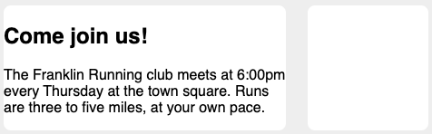
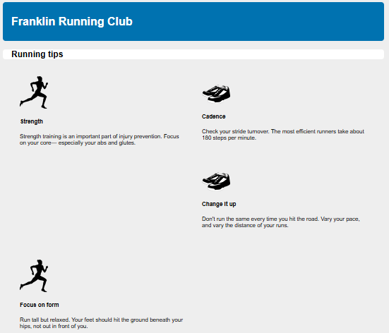
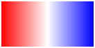
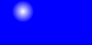
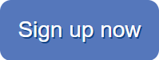
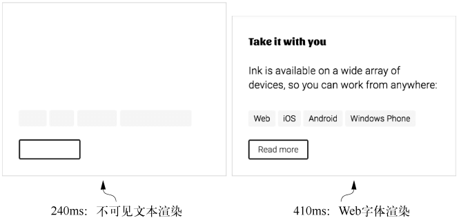

# CSS 笔记

CSS 英文全称为 **Cascading Style Sheets**，中文翻译为 “层叠样式表”


## 术语解释

**声明** 

解释：CSS 的一行，由一个属性和一个值组成

```css
color: red;
```


**声明块**

解释：包含在大括号内的一组声明。声明块前有一个**选择器**(例如下方的 `body`)

```css
body {
  color: black;
  font-family: Helvetica;
}
```


**规则集（ruleset）**

解释：由声明块和选择器组成，一个规则集也简称为一个**规则（rules）**，例如前面的整个代码就是一个规则集


**@规则（at-rules）**

解释：指用 `@` 符号开头的语法，例如：`@import` 和 `@media`


## 层叠


### 规则

当声明冲突时，会按照以下规则顺序解决冲突

1. 样式表的来源
2. 选择器优先级
3. 在源码中的顺序


### 样式表的来源

样式表有以下来源：

- **用户代理样式表（User Agent Styles）：** 浏览器的默认样式，例如：`<h1>` 标签自带加粗和字体大小以及外边距的默认样式
- **用户样式表（User Styles）：** 用户通过浏览器插件(如 `Stylus` 插件)、浏览器设置或开发者工具定义的样式，较少见
- **作者样式表（Author Styles）：** 网页的开发者（即 “作者”）编写的样式表，根据定义位置可以分为如下：
  - 外部样式表：通过 `<link>` 标签引入的外部 CSS 文件
  - 内部样式：在 HTML 内部使用 `<style>` 标签定义的样式
  - 行内样式(内联样式)：通过元素的 `style` 属性直接定义的样式


### 样式表的优先级

样式表的优先级由低到高如下：

1. 用户代理样式表
2. 用户样式表
3. 作者样式表
   1. 外部样式表
   2. 内部样式表
   3. 行内样式表(内联样式表)
   4. 外部样式表的 `!important`
   5. 内部样式表的 `!important`
   6. 行内样式(内联样式)的 `!important`

**⚠️ 注意：不推荐在行内样式中使用 `!important`，因为优先级最高，无法被覆盖修改**


### 选择器的优先级

选择器的优先级由低到高如下：

| 选择器                                                       | 优先级标记 |
| ------------------------------------------------------------ | ---------- |
| 通用选择器（`*`）和组合器（`>`、`+`、`~`）                   | `(0,0,0)`  |
| 标签选择器（`p`）                                            | `(0,0,1)`  |
| 伪类选择器（`:hover`）、属性选择器（`[type="text"]`）、类选择器（`.class`） | `(0,1,0)`  |
| ID 选择器（`#id`）                                           | `(1,0,0)`  |

同时使用多个类型的选择器会让它们的优先级标记进行个数计算，例如 `(1,2,2)` 表示选择器由 1 个 ID 选择器、2 个类选择器、2 个标签选择器组成


### 源码顺序

当两个声明的来源和选择器优先级相同，这时哪个声明最晚出现，则使用哪个声明

**⚠️ 注意： 给链接添加样式时一定要按照正确的顺序书写选择器**

**❌ 错误的顺序**

```css
a:hover {
  text-decoration: underline;
}

a:link {
  color: blue;
  text-decoration: none;
}

a:visited {
  color: purple;
}

a:active {
  color: red;
}
```


此时 `a:hover` 的样式被 `a:link` 的样式覆盖，导致鼠标悬浮链接时不显示下划线


**✔️正确的顺序**

```css
a:link {
  color: blue;
  text-decoration: none;
}

a:visited {
  color: purple;
}

a:hover {
  text-decoration: underline;
}

a:active {
  color: red;
}
```


顺序记忆口诀：“LoVe/HAte”（“爱/恨”），其中 L 表示 `link`，V 表示 `visited`，H 表示 `hover`，`A` 表示 `active`


**层叠值**

一个声明在样式表来源、选择器优先级、以及源码顺序中胜出，最终使用的值被称为 “层叠值”

元素的每个属性最多只有一个层叠值，元素上一个属性都没指定，则该属性没有层叠值

```css
p {
  margin-top: 20px; /* 外部样式 */
}

#main p {
  margin-top: 30px; /* 内部样式 */
}

p {
  margin-top: 40px; /* 内联样式 */
}
```

上述代码中，因为样式来源中内联样式的优先级最高，所以 `<p>` 元素的 `margin-top` 属性的层叠值为 `40px`


### 最佳实践

处理层叠时的建议：

1. **不使用 ID 选择器来添加样式：** 因为 ID 选择器优先级过高，需要使用其它的 ID 选择器或者 `!important` 才能覆盖
2. **不使用 `!important`：** 比 ID 选择器更难覆盖，要覆盖就需要添加 `!important`，当很多声明都添加了 `!important` 时，就又会从样式表来源、选择器优先级以及源码顺序来比较了

**⚠️ 注意：** 在特殊情况中，上述两条建议**不必死板遵守**


创建用于分发的 NPM 包的建议：

1. **不要在 JavaScript 中使用行内样式：** 会导致想修改属性需要使用 `!important`
2. **在包中包含一个样式表，通过 JavaScript 来给元素添加或删除类：** 方便用户可以编辑其中的样式


## 继承

如果一个属性没有层叠值，则可能会继承祖先元素的值，继承是顺着 DOM 树向下传递的


例如在 `<body>` 标签中添加 `font-family` 属性，则 `<body>` 标签内的所有元素都会继承这个字体

```css
body {
  font-family: sans-serif;
}
```

**⚠️ 注意： 不是所有的属性都是能被继承的**，通常只有文本相关属性（例如：`color`、`font-family`、`font-style` 等）、列表相关属性（例如：`list-style`、`list-style-image` 等）以及表格的边框属性（例如：`border-collapse` 和 `border-spacing`）等可以被继承


## 特殊值

**inherit**

`inherit` 用于继承父元素的属性值

```css
a:link {
  color: blue;
}

.footer {
  color: #666;
}

.footer a {
  /* 该属性值会继承父元素的值，此处继承的层叠值为#666 */
  color: inherit;
}
```

**⚠️ 注意：** `inherit` 可以使任何属性的值强制继承父元素的值，例如继承父元素的外边距，**但是这样很少使用**


**initial**

`initial` 用于将某个属性的值重置为初始值

```js
a:link {
  color: blue;
}

.footer a {
  /* 该属性值会重置为初始值，color的初始值通常为black */
  color: initial;
}
```

**⚠️ 注意：** 

- `width` 属性的初始值为 `auto`，但并非所有属性都支持 `auto`，**推荐使用 `initial`**

- `display` 属性的初始值为 `inline`，而**不是根据元素类型来确定 `display` 属性的初始值**


## 简写属性

简写属性可以同时给多个属性赋值，常见的简写属性有：`background`、`border`、`border-width`、`font` 等

**⚠️ 注意：** 使用简写属性时，如果省略一些值，这些值会被隐式设置为初始值（与 `initial` 类似），从而导致覆盖其它地方定义的样式，**使用时需要小心（尤其是 `font` 简写属性问题最严重）**

例如：

```css
h1 {
  font-weight: bold;
}

h1.title {
  /* 简写属性指定字体相关的值 */
  font: 32px Helvetica, Arial, sans-serif;
}
```

上述代码的 `<h1>` 标签默认加粗的效果被简写属性隐式设置的初始值所覆盖


**简写属性的顺序**

- 针对元素四边的属性，例如：`margin`、`padding` 等

  - 4 个值时：`margin: 上 右 下 左`
  - 3 个值时：`margin: 上 左右 下`，左边右边使用相同的值
  - 2 个值时：`margin: 上下 左右`，上边下边使用相同的值，左边右边使用相同的值
  - 1 个值时：`margin: 上下左右`，上边下边左边右边都使用相同的值

  **⚠️ 注意：** 大部分情况只需要指定 2 个值，针对较小的元素设置内边距，左右的内边距最好大于上下的内边距

- 涉及一个点出发的两个方向的属性，例如：`background-position`、`box-shadow` 等，这类属性通常是先指定 x 值再指定 y 值

  ```css
  /* 先指定x值，再指定y值，最后是阴影颜色 */
  box-shadow: 10px 2px #6f9090;
  ```

- 其它属性，这类简写属性不在乎值的顺序，因为浏览器知道对应的样式对应什么类型的值，例如：`border`

  ```css
  /* 以下两种顺序等价 */
  border: 1px solid black;
  border: solid 1px black;
  ```

  


## 页面设计发展史

在早期的计算机应用程序开发和印刷出版中，开发人员和出版商能够明确知道媒介的限制，例如程序的窗口大小或页面尺寸都是固定的，因此可以使用固定单位（如像素或英寸）来精确布局

早期 Web 设计采用了 “像素级完美” 的设计理念，即通过创建一个紧凑的、居中的容器（通常约 800px 宽），在限制的范围内使用固定单位进行精确布局，类似于早期应用程序和印刷出版的设计方式

但随着技术发展，出现了越来越多高清显示器，此时人们探讨是否可以安全的把网页宽度设计成 1024px 宽(而不是 800px)，之后又开始讨论 1280px 宽，但当时无法适应所有设备，尤其是小屏幕设备（如笔记本电脑、平板电脑）

直到智能手机的出现，不得不抛弃固定的网页宽度设计，开始使用**响应式**设计

**响应式：** CSS 中的响应式是指样式能够根据浏览器窗口大小有不同的 “响应”，通常会考虑任何尺寸的手机、平板设备或者电脑屏幕


## 固定单位

CSS支持多种固定单位，最常用的是 `px`（像素），不常用的单位还有：`mm`（毫米）、`cm`（厘米）、`in`（英寸）、`pt`（点，印刷术语）、`pc`（派卡，印刷术语）

**各单位之间的换算关系：** `1in = 25.4mm = 2.54cm = 6pc = 72pt = 96px`


## 相对单位

相对单位可以基于浏览器的窗口大小来等比例缩放字号，也可以根据基础字号来设置页面上任何元素的大小，**相对单位是 CSS 响应式设计中的重要组成部分**

相对单位最终计算出来的固定单位的值被称为 **“计算值”**

CSS 常见的相对单位有：`em`、`rem`、`vw`、`vh`、`%` 等


### em

基于当前元素的字号 `font-size` 来计算具体的值

```css
.padded {
  font-size: 16px;
  padding: 1em;
}
```

此时 `padding` 属性的值为 16px，计算过程：`1x16=16`


**当 `font-size` 属性使用 `em` 单位时**

```css
body {
  font-size: 16px;
}

.padded {
  font-size: 0.8em;
  padding: 1em;
}
```

这里假设 `body` 是 `.padded` 的父元素，此时 `padding` 属性的值为 12.8px，`.padded` 的 `font-size` 属性的值为 12.8px

计算过程：

1. 首先计算 `font-size` 属性的值，`.padded` **继承** `<body>` 的 `font-size` 属性的值，再与 0.8 相乘，`16 x 0.8 = 12.8`
2. 然后再计算 `padding` 属性的值，`1 x 12.8 = 12.8`


**em 换算公式**

`想要的像素大小 / 当前元素的字号大小 = em 的值`

例如：`16 / 16 = 1em`，`12.8 / 16 = 0.8em`


**字体缩小问题**

使用 `em` 指定多重嵌套元素的字号时会出现字体逐渐缩小或放大的问题

```html
<body>
  <ul>
    <li>
      Top level
      <ul>
        <li>
          Second level
          <ul>
            <li>
              Third level
              <ul>
                <li>
                  Fourth level
                  <ul>
                    <li>Fifth level</li>
                  </ul>
                </li>
              </ul>
            </li>
          </ul>
        </li>
      </ul>
    </li>
  </ul>
</body>
```

```css
body {
  font-size: 16px;
}

ul {
  font-size: 0.8em;
}
```


原因：`<li>` 会继承父级元素 `<ul>` 的 `font-size` 属性的值进行计算

计算过程：

1. `Top level` 层，字号为 12.8px，继承 `<ul>` 的 `font-size` 属性值，`<ul>` 的 `font-size` 属性值继承 `<body>` 的字号进行计算，结果为 `16x0.8=12.8`
2. `Second level` 层，字号为 10.24px，继承 `<ul>` 的 `font-size` 属性值，`<ul>` 的 `font-size` 属性值继承 ``Top level` 层 `<ul>` 的字号进行计算，结果为 `12.8x0.8=10.24`
3. `Third level` 层，字号为 8.192px，继承 `<ul>` 的 `font-size` 属性值，`<ul>` 的 `font-size` 属性值继承 `Second level` 层 `<ul>` 的字号进行计算，结果为 `10.24x0.8=8.192`

以此类推计算


该问题解决方案：

```css
body {
  font-size: 16px;
}

ul {
  font-size: 0.8em;
}

/* 除第一个ul之外的ul都默认继承父级的字号，1em不会缩小和放大字号 */
ul ul {
  font-size: 1em;
}
```


**⚠️ 注意：** 这样的解决方案通过提升选择器的优先级覆盖规则，依旧不好，可以使用 `rem`

```css
:root {
  font-size: 1em;
}

ul {
  font-size: 0.8rem;
}
```

**⚠️ 注意：建议对字号使用 `rem` 而非 `em`，`em` 用在元素的内边距、外边距及大小上很好**


### rem

`<html>` 元素是顶级（根）节点，是所有其它元素的祖先元素，**根节点可以使用一个伪类选择器（`:root`）来选中自己**，等价于 `html` 元素选择器，但是 `:root` 优先级相当于类名，比元素选择器更高

```css
/* 等价于使用 html {}，但是优先级更高 */
:root {
  font-size: 16px;
}
```


`rem` 是 root em 的缩写，与 `em` 单位类似，只不过是基于**根节点的字号**进行计算的

```css
:root {
  font-size: 1em;
}

ul {
  font-size: 0.8rem;
}
```

上述代码计算过程：

1. `<html>` 根元素的字号为 16px，根元素上的 em 是相对于浏览器的默认字号进行计算，默认字号通常是 16px，计算过程为 `16 x 1 = 16`
2. `<ul>` 元素的字号为 12.8px，基于根节点的字号进行计算，计算过程为 `16 x 0.8 = 12.8`

**⚠️ 注意：** 用户可以修改浏览器的默认字号（默认值为 16px），**但不会影响已经使用 `px` 单位或其它绝对单位的字号**，修改默认字号对部分用户很有需要，所以建议始终使用相对单位来设置字号来适配可能修改的默认字号


### 使用建议

用 `rem` 来设置字号（`font-size`）、用 `px` 来设置边框、用 `em` 来设置其它大部分属性


### 停止像素思维

经常有人将网页根元素的字号设置为 `0.625em` 或者 `62.5%`

```css
:root {
  font-size: 0.625em;
}
```

这样做是想将根元素的默认字号 16px 修改为 10px，方便后续的 `rem` 单位的换算，例如：想将 14px 转换为 `rem` 单位，就用 `14 / 10 = 1.4rem`，但是这样做有以下两个缺点：

1. 因为将页面的根元素字号设置为了 10px，导致页面中所有元素的默认继承的字号都为 10px，有点偏小，导致需要给每个元素都要设置字号，**被迫写更多的代码**
2. 这样的做法本质还是属于像素思维，过度依赖具体的像素值来进行布局和设置样式，忽略了响应式和可伸缩的布局

**正确的做法：**

1. 对于第一个缺点，**将根元素的字号保持默认或者设置为 `1em`，与浏览器默认字号保持一致**，通过计算器或者其它的 `px` 转 `rem` 的工具来进行计算，默认的 16px 字号适合页面上绝大多数元素

   ```css
   :root {
     font-size: 1em;
   }
   ```

2. 对于第二个缺点，平常开发的时候需要习惯 “模糊” 值，不要刻意在意具体是多少像素，**重点是它比默认字号要稍微大或小一点**，如果显示效果不理想，就可以调整它的值，以达到合适的显示效果


### 视口的相对单位

**视口：** 浏览器窗口中可见部分的区域，不包括浏览器的地址栏、工具栏、状态栏

有以下单位：

- `vh` 视口高度的 1/100
- `vw` 视口宽度的 1/100
- `vmin` 视口宽、高中最小一边的 1/100
- `vmax` 视口宽、高中最大一边的 1/100

视口相对单位适合用于填满整个屏幕的大图，例如给图片高度设置 `100vh`


**使用 `vw` 定义字号**

在一个元素上使用 `vw` 单位指定字号，可以在不同视口宽度下平滑的过度字号，但是**不推荐使用**

存在以下问题：

1. 在小屏幕中字号变得过小，在大屏幕上字号变得过大
2. 无法精确控制在不同设备上的表现，因为 `vw` 依赖视口的宽度
3. 在浏览器宽度调整时会导致布局频繁变化，影响体验


### 百分比

- 当元素使用百分比（`%`）设置**宽度**时，是基于元素**包含块的宽度**进行计算

- 当元素使用百分比（`%`）设置**高度**时，是基于元素**包含块的高度**进行计算


**包含块**

包含块是一个元素在计算尺寸（如宽度、高度、边距、定位时）所参考的矩形区域


**初始化包含块**

如果一个元素没有明确的包含块（如：`<html>` 和元素使用了 `position: fixed` 或 `position: absolute`，并且没有定位祖先元素），则它的包含块为初始包含块，**初始包含块的大小通常等于视口的大小**


**包含块的确定规则：**

包含块的确定取决于元素的 `position` 属性

- **静态定位 `position: static` 和相对定位 `position: relative`**
  - 包含块是最近的**块级祖先元素**的内容区域
  - 如果没有块级祖先元素，则包含块为初始包含块
- **绝对定位 `position: absolute`**
  - 包含块是最近的 **定位祖先元素（即 `position` 为 `relative`、`absolute`、`fixed` 或 `sticky` 的元素）** 的 **padding box**（内容区域 + padding）
  - 如果没有定位祖先元素，则包含块是初始包含块
- **固定定位 `position: fixed`**
  - 包含块是初始包含块
- **粘性定位 `position: sticky`**
  - 包含块是最近的 **滚动祖先元素（即 `overflow: auto` 或 `overflow: scroll` 的元素）** 的内容区域
  - 如果没有滚动祖先元素，则包含块是初始包含块


### calc()

`calc()` 函数可以对两个及以上的值进行四则运算（加、减、乘、除），括号内的值可以是不同单位的数值

```css
:root {
  font-size: calc(0.5em + 1vw);
}
```

**⚠️ 注意：加号和减号运算符两边必须要有空格**，建议在每个操作符前后都添加一个空格


### 无单位的数值和行高

部分属性支持无单位数值，例如：`z-index`、`line-height`、`font-weight` 等，任何长度单位（`px`、`em`、`rem` 等）都可以使用无单位的 `0`，无单位的 `0` 不能用于角度、时间等相关的值

`line-height` 属性的值既可以有单位，也可以没有单位，**两者主要的差异在继承方式上**

```html
<body>
  <p class="about-us">
    We have built partnerships with small farms around the world to
    hand-select beans at the peak of season. We then carefully roast in small
    batches to maximize their potential.
  </p>
</body>
```

- 值无单位的情况

  ```css
  body {
    line-height: 1.2;
  }
  
  .about-us {
    font-size: 2em; /* 值为16px*2=32px */
    /* 继承了父元素1.2声明值进行计算，此时line-height属性的值为1.2*32px=38.4px */
  }
  ```
  
  
  
- 值有单位的情况

  ```css
  body {
    line-height: 1.2em; /* 值为16px*1.2=19.2px */
  }
  
  .about-us {
    font-size: 2em; /* 值为16px*2=32px */
    /* 继承了父元素的计算值，此时line-height属性的值为19.2px */
  }
  ```
  
  

**建议：** 可以在 `<body>` 元素上设置一个**无单位数值的行高**，之后就无需修改了，如果部分元素行高需要调整可以单独覆盖


### 自定义属性（CSS 变量）

CSS Variables 全称为 **Custom Properties for Cascading Variables**，中文翻译过来就是层叠变量的自定义属性，简称自定义属性，也叫 CSS 变量

**⚠️ 注意：** 自定义属性与 Scss、Less 等 CSS 预处理器的内置变量是不同的，前者是运行在浏览器环境，可以动态变化，后者只在预处理器编译阶段运行，最终生成的是静态的 CSS 代码，无法在浏览器运行时更改


**定义一个 CSS 变量**

```css
:root {
  --main-font: Helvetica, Arial, sans-serif;
}
```

**⚠️ 注意：变量名前必须要有两个连字符 `--`**，用来和 CSS 属性区分，`--` 后面的部分可以跟字母、数字、连字符、下划线


**引用 CSS 变量**

```css
p {
  font-family: var(--main-font);
}
```

通过 `var()` 函数对变量进行引用，可以接收两个参数，第一个参数为变量名，第二个参数为备用值，当第一个参数的变量没有被定义时，会使用第二个备用值

```css
:root {
  --main-font: Helvetica, Arial, sans-serif;
}

p {
  color: var(--main-color, blue); /* 此时值为 blue */
}
```

**⚠️ 注意：** 如果没有提供备用值，并且第一个参数的变量没有被定义，则 `var()` 函数计算出来是一个**非法值**，这时对应的属性值会变成其初始值，类似于 `initial` 的效果

在引用自定义属性时，尽量为不支持的浏览器提供回退方案

```css
p {
  color: black;
  color: var(--main-color, blue); /* 支持自定义属性时会覆盖之前的声明 */
}
```

**⚠️ 注意：** 很难对**动态的自定义属性**提供回退方案


**使用 JavaScript 访问自定义属性**

```js
const rootElement = document.documentElement; // 获取根元素
const styles = getComputedStyle(rootElement); // 获取根元素的样式对象
const mainColor = styles.getPropertyValue('--main-bg'); // 从样式对象上读取自定义属性的值
console.log(mainColor); // 打印值
```


**使用 JavaScript 修改自定义属性**

```js
const rootElement = document.documentElement; // 获取根元素
rootElement.style.setProperty('--main-bg', '#cdf'); // 修改自定义属性的值
```


## 盒模型

W3C 标准盒子模型（content-box）计算：


- 总宽度：内容宽度 + 左右内边距 + 左右边框
- 总高度：内容高度 + 上下内边距 + 上下边框


IE 盒子模型（border-box）计算：


- 总宽度：内容宽度（已包含左右内边距和边框）
- 总高度：内容高度（已包含上下内边距和边框）


**在开发中建议将如下代码放在样式表的开头**，以此调整全局元素的盒模型为 `border-box`，便于开发

```css
:root {
  box-sizing: border-box;
}

*,
::before,
::after {
  box-sizing: inherit;
}
```

上述代码使用继承方式，是为了便于调整第三方组件的盒子模型，如果使用 `*` 会导致第三方组件内部的所有子元素都是 `border-box`，导致难以调整

 **⚠️ 注意：** 

- `*` 选择器不会选中伪元素，所以这里需要加上 `::before` 和 `::after` 选择器

- 第三方组件如果用的不是 IE 盒子模型，使用上述代码可能会导致样式出现问题，可以使用如下代码对第三方组件单独修改盒子模型

  ```css
  /* 调整第三方组件根元素的盒子模型 */
  .third-party-component {
    box-sizing: content-box;
  }
  ```


### 列之间添加间隔


假设一个界面有两列，一列宽度为 `70%`，另一列的宽度为 `30%`，两列之间需要有间隔，有如下三种方式可以添加


**使用百分比外边距添加间隔**

```css
.main {
  float: left;
  width: 70%;
  background-color: #fff;
  border-radius: 0.5em;
}

.sidebar {
  float: left;
  /* 从宽度中减去1% */
  width: 29%;
  /* 将1%作为间隔 */
  margin-left: 1%;
  padding: 1.5em;
  background-color: #fff;
  border-radius: 0.5em;
}
```


 **⚠️ 注意：** 这样无法使用别的单位精确控制间距


**使用calc函数外边距添加间隔**

```css
.main {
  float: left;
  width: 70%;
  background-color: #fff;
  border-radius: 0.5em;
}

.sidebar {
  float: left;
  /* 从宽度中减去1.5em */
  width: calc(30% - 1.5em);
  /* 将1.5em宽度作为间隔 */
  margin-left: 1.5em;
  padding: 1.5em;
  background-color: #fff;
  border-radius: 0.5em;
}
```

这样的代码看起来比第一种使用 `29%` 意图更加清晰


### 元素高度问题

元素处理高度与处理宽度是不一样的，普通文档流是为有限的宽度和无限的高度设计的

**普通文档流：** 是指网页元素的默认布局行为，行内元素跟随文字的方向从左到右排列，到达容器边缘时换行，块级元素会占据一整行，前后都有换行

 **⚠️ 注意：除非别无选择，否则不要明确设置元素的高度，设置高度一定会导致更复杂的情况**


**溢出行为**

当给元素设置高度时，内容可能会溢出容器，渲染到父容器的外面，此时可以使用 `overflow` 属性来设置溢出行为

建议给 `overflow` 属性设置 `auto`，在内容溢出的时候才显示滚动条


 **⚠️ 注意：** 当文本内容没有空格、连字符（`-`）或其他可换行字符时，浏览器不会对内容进行换行，这种文本称为**长文本**，例如 URL 就是长文本，浏览器将长文本视为一个整体，不会在中间换行，此时会导致内容水平溢出


**百分比高度问题**



想要实现如上图的等高列，左侧部分内容撑开高度，右侧部分高度自适应与左侧相同高度，**无法用过给右侧部分添加 `height: 100%` 达到效果**，以下有两个备选方案

用百分比指定高度存在问题，百分比参考的是元素包含块的大小，但是包含块的高度通常是由子元素的高度决定的，这样就造成的死循环，浏览器无法处理，会忽略这个声明，想让百分比高度生效，必须给父元素明确一个高度


**使用 CSS 表格布局实现等高列（兼容 IE8+）**

```html
<div class="wrapper">
  <div class="container">
    <main class="main">
      <h2>Come join us!</h2>
      <p>
        The Franklin Running club meets at 6:00pm every Thursday at the town
        square. Runs are three to five miles, at your own pace.
      </p>
    </main>
    <aside class="sidebar">
      <div class="widget"></div>
      <div class="widget"></div>
    </aside>
  </div>
</div>
```

```css
.wrapper {
  /* 使用父外边距抵消表格边框外部水平方向的间距 */
  margin-left: -1.5em;
  margin-right: -1.5em;
}

.container {
  /* 让容器布局像表格一样 */
  display: table;
  /* 默认情况，display:table元素宽度不会扩展到100%，所以需要指定宽度 */
  width: 100%;
  /* 设置表格单元格水平方向的间距，副作用：会导致表格边框外部水平方向也会有1.5em的间距 */
  border-spacing: 1.5em 0;
}

.main {
  /* 让列布局像表格的单元格一样 */
  display: table-cell;
  width: 70%;
  background-color: #fff;
  border-radius: 0.5em;
}

.sidebar {
  /* 让列布局像表格的单元格一样 */
  display: table-cell;
  width: 30%;
  /* 外边距不会在display: table-cell上起效果*/
  margin-left: 1.5em;
  padding: 1.5em;
  background-color: #fff;
  border-radius: 0.5em;
}
```

**缺点：** 需要额外的包装元素使用负外边距抵消 `border-spacing` 属性的副作用


**使用Flexbox弹性盒子布局实现等高列（兼容 IE10+）**

```html
<div class="container">
  <main class="main">
    <h2>Come join us!</h2>
    <p>
      The Franklin Running club meets at 6:00pm every Thursday at the town
      square. Runs are three to five miles, at your own pace.
    </p>
  </main>
  <aside class="sidebar">
    <div class="widget"></div>
    <div class="widget"></div>
  </aside>
</div>
```

```css
.container {
  /* 使用弹性盒子布局 */
  display: flex;
}

.main {
  width: 70%;
  background-color: #fff;
  border-radius: 0.5em;
}

.sidebar {
  width: 30%;
  /* 虽然使用了外边距导致宽度超出了100%，弹性盒子布局会自行妥善处理 */
  margin-left: 1.5em;
  padding: 1.5em;
  background-color: #fff;
  border-radius: 0.5em;
}
```

**推荐 IE10+ 的浏览器使用弹性盒子布局**


**使用 `min-height` 和 `max-height`**

`max-height`：用于指定元素的最大高度

`min-height`：用于指定元素的最小高度

类似的宽度也有 `max-width` 和 `min-width` 用于限制元素的宽度


**让元素内容垂直居中**

如果企图使用 `vertical-align: middle` 让**块级元素**内容垂直居中，**浏览器会忽略这个声明**

`vertical-align` 声明只会影响行内元素或 `table-cell` 元素内部的**行内内容**（如文本、图片等）

- 对于行内元素它控制着该元素跟同一行其它元素之间的垂直对齐关系，例如：图片和相邻的文字垂直对齐
- 对于 `table-cell` 元素，它控制着内容在单元格中的垂直对齐


**垂直居中指南**

通过问自己以下几个问题来判断使用哪种方法最合适

- 容器可以不设置固定高度吗？如果没有固定的高度则可以**给容器添加相等的上下内边距**

- 容器需要设置固定高度或者避免使用内边距吗？对容器使用 `display: table-cell` 和 `vertical-align: middle`，容器的父元素需要使用 `display: table` 才有效

- 可以使用 Flexbox 吗？如果不需要支持 IE9，则可以使用弹性盒子让内容居中

- 容器里面的内容只有一行文字吗？如果是的话使用 `line-height` 设置一个大的行高，让它等于理想的容器高度，这样会让容器高度扩展到合适的高度，如果内容不是行内元素，则可以给内容设置为 `display: inline-block`
- 容器盒内容的高度都知道吗？如果都知道则将内容设置为绝对定位，**只有前面的方法都不行再用这个方法**
- 不知道内部元素的高度？用绝对定位结合变形（`transform`），**只有前面的方法都不行再用这个方法**

也可以访问 http://howtocenterincss.com/ ，通过填写自己场景的选项会相应的生成垂直居中的代码


### 负外边距

**左边或者顶部的负外边距：** 元素会相应的向左或者向上移动，导致元素与前面的元素重叠

**右边或者底部的负外边距：** 元素不会移动，会将后面的元素拉过来

 **⚠️ 注意：** 如果一个**块级元素不指定宽度（默认是 `width: auto`）**，它会自然填充容器的宽度，如果在右边添加负外边距，则会将它**拉出容器**，可以用于抵消 `border-spacing` 的影响，如果块级元素指定了宽度，则不会拉出容器

- 未添加右侧负外边距的代码

  ```html
  <div class="container">
    <div class="box1"></div>
  </div>
  ```

  ```css
  .container {
    width: 300px;
    height: 200px;
    background-color: pink;
  }
  
  .container .box1 {
    height: 200px;
    color: red;
  }
  ```

  

- 添加右侧负外边距后的代码

  ```css
  .container {
    width: 300px;
    height: 200px;
    background-color: pink;
  }
  
  .container .box1 {
    color: red;
    height: 200px;
    /* 右侧负外边距 */
    margin-right: -80px;
  }
  ```

  

  如果给 `.box1` 元素指定具体的宽度，例如：`width: 100%`，则不会拉出容器


### 外边距折叠


**上下方向**的外边距相邻时，就会发生折叠，产生单个外边距，**取其中的最大值**

 **⚠️ 注意：** 只有上下方向的外边距会产生折叠，**水平方向的外边距不会折叠**


**多个嵌套的外边距折叠**


嵌套元素的垂直方向的外边距也会发生折叠，取其中的最大值


**自身外边距折叠**


假如**空元素**有上下外边距，也会与自身底部的外边距发生折叠，取其中的最大值，如果遇到另外一个元素的外边距会继续折叠，如下图


**防止外边距折叠**

- 给容器添加 `overflow: auto`（或者非 `visible` 的值），防止内部元素的上下外边距和容器的上下外边距折叠，**这种方法副作用最小**
- 在元素上下两个外边距之间添加边框或者内边距，防止它们折叠
- 如果容器为浮动元素、内联块（`inline-block`）、绝对定位或固定定位时，外边距不会在它外面折叠
- 当使用 Flexbox 布局或 Grid 布局时，内部的元素之间不会发生外边距折叠
- 当元素为 `table-cell` 时，外边距不会生效，也就不会折叠，此外还有 `table-row` 和大部分其他表格显示类型，但不包括` table`、`table-inline`、`table-caption`

 **⚠️ 注意：** 这些方法部分会改变布局，除非能产生想要的布局，否则不要轻易使用


### 容器内元素之间的间距


**使用相邻兄弟选择器来添加外边距**

```css
.button-link + .button-link {
  margin-top: 1.5em;
}
```

这样只能给紧跟在其他 `.button-link` 后的 `.button-link` 元素加上顶部外边距，**无法应用给其它类名的元素**


**使用迟钝的猫头鹰选择器（简称猫头鹰选择器）来添加全局外边距**

```css
body * + * {
  margin-top: 1.5em;
}
```

这段代码是给**所有相邻的兄弟元素**添加顶部外边距，这里使用 `body` 是因为 `<body>` 元素是 `<head>` 元素的兄弟节点，也会有外边距，所以需要排除

 **⚠️ 注意：** 使用猫头鹰选择器是需要权衡的，它省去了许多需要设置外边距的地方，**但在不需要外边距的地方需要自行覆盖**，通常只有在并列元素或者有多列布局的时候这样使用


## 浮动


### 设计初衷

**不是用于布局**，主要用于实现文档中**文字环绕图片**的效果，类似下图


但由于当时还没有 `display: flex` 和 `display: inline-block`，所以浮动一直承担着布局的重任

通过给元素添加 `float` 属性来添加浮动，值有 `left` 和 `right`，分别表示向左浮动和向右浮动，相邻的浮动元素之间会水平排列，如果一行装不下了会自动换行显示

 **⚠️ 注意：** 如果一个行内元素设置了 `float` 属性，则这个元素会变成块级元素


### 容器折叠问题

因为浮动元素不属于普通文档流的元素，**不会在容器保留之前占据的空间**，导致容器高度折叠，例如下图中的白色容器高度折叠了




### 清除浮动

要解决容器折叠的问题，需要清除浮动元素所带来的影响，有以下几种方案可以实现


**在容器的末尾添加一个元素用于清除浮动**

```html
<div class="container">
	<!-- 浮动元素相关代码... -->
  
  <!-- 清除浮动 -->
  <div style="clear: both"></div>
</div>
```

`clear: both` 属性可以让元素同时清除它**前面** `float: left` 和 `float: right` 元素带来的影响，会让该元素跑到所有前面浮动元素的最后面，以此来撑开容器的高度，**只会清除当前元素的兄弟元素中的浮动元素**

`clear` 属性的值还有 `left` 和 `right`

- `right`：表示只清除元素前面的 `float: right` 元素带来的影响
- `left`：表示只清除元素前面的 `float: left` 元素带来的影响

 **⚠️ 注意：** 

- 这种方式不优雅，需要在 HTML 中添加不必要的元素
- `clear` 属性只能加在块级元素身上有效


**使用伪元素清除浮动**

```html
<div class="container clearfix">
	<!-- 浮动元素相关代码... -->
</div>
```

```css
.clearfix::after {
  /* 将伪元素的display设置为非inline值，以便出现在文档中 */
  display: block;
  /* 旧版的Opera浏览器中有个隐藏的 bug，需要添加一个空格字符才能解决，建议保留 */
  content: ' ';
  /* 清除浮动 */
  clear: both;
}
```

为容器添加一个伪元素，就可以不用在 HTML 中添加一个元素

- `::after` 会在元素内的最末尾添加一个伪元素
- `::before` 会在元素内的最前面添加一个伪元素


**使用伪元素清除浮动并阻止外边距折叠**

让容器内的浮动元素的上下外边距不会和容器的上下外边距发生折叠，**当不想外边距折叠时，可以使用如下方式**

```html
<div class="container clearfix">
  <!-- 浮动元素相关代码... -->
</div>
```

```css
/* 因为是上下可能会出现折叠，所以需要在容器的最前面和最后面都添加伪元素 */
.clearfix::before,
.clearfix::after {
  display: table;
  content: ' ';
}

/* 清除浮动只需要容器内最后一个伪元素做就可以了 */
.clearfix::after {
  clear: both;
}
```

将伪元素设置为 `display: table` 元素，该元素不会外边距折叠，用来隔开浮动元素和容器的上下边接触，避免外边距折叠


### 浮动的陷阱

当多个浮动元素的高度不一致时，可能会导致以下的问题


第三个浮动元素无法浮动到最左边，因为被第一个浮动元素刚好高度挡住了，此时可以给第三个浮动元素添加一个 `clear: left;` 即可

如果是**两列多行**的布局，可以使用 `:nth-child` 选择器为每行第一个(奇数个)元素添加 `clear: left;`

```css
.media:nth-child(odd) {
  clear: left;
}
```

 **⚠️ 注意：** 这种方式**需要知道每行有几个元素**，如果每行的个数是随视口宽度变化的，建议换种布局方案或者使用 Flexbox 或 inline-block 元素来实现


### BFC

BFC 的全称是**块级格式化上下文（block formatting context）**，是一块独立渲染的区域，内部的元素**不会影响**外部的元素，反之亦然

右侧文字容器使用 BFC 前


右侧文字容器使用 BFC 后


BFC 的主要作用包括如下：

- **防止外边距重叠：** BFC 中内部的元素不会和外部的元素（包括 BFC 自身）的外边距产生折叠
- **清除浮动：** BFC 中可以包含浮动元素，高度不会塌陷
- **阻止元素被外部浮动元素覆盖：** BFC 容器内的元素不会与外部浮动元素重叠
- **独立布局：** BFC 内部的布局（如浮动元素、定位元素、外边距等）不会被外部元素（如外部浮动元素影响其它元素的字体环绕）影响，反之亦然


**给元素添加以下任意属性都会创建 BFC**

- `float` 属性：`left` 或 `right`，不为 `none` 即可
- `overflow` 属性：`hidden`、`auto` 或 `scroll`，不为 `visible` 即可
- `display` 属性：`inline-block`、`table-cell`、`table-caption`、`flex`、`inline-flex`、`grid` 或 `inline-grid`，拥有这些属性的元素称为块级容器（block container）
- `position` 属性：`absolute` 或 `position: fixed`

**⚠️ 注意：** 

- 网页的根元素 `<html>` 也创建了一个顶级的 BFC
- 部分情况下 BFC 中的内容还是会和其它 BFC 中的内容重叠，例如：内容太宽或者因为使用了负外边距导致内容被拉到了容器外面
- 使用 `overflow: auto` 通常是创建 BFC 最简单的一种方式


### 网格（栅格）系统

网格系统可以提高 CSS 代码的复用性，提供一系列的类名，将网页的一部分构造成行和列，**只给容器提供宽度和定位相关的样式**，不提供颜色、边框等视觉样式，大部分 CSS 框架都有自己的网格系统

**CSS 框架：** 一个预编译的 CSS 代码库，可以快速搭建原型，提供稳定的样式基础，常见的有 Bootstrap、Tailwind CSS、Unocss 等

网格系统一般将每行划分为 12 列，可以指定元素占不同列数据的宽度，如下图


**⚠️ 注意：** 选用 12 作为列数是因为它能被 2、3、4、6 整除，组合起来更灵活

通常用 `.row` 类名表示行容器的，内部使用 `.column-n` 表示列容器，`n` 表示该列宽度所占的列数

```css
/* 抵消行容器的左右两边的内边距 */
.row {
  margin-left: -0.75em;
  margin-right: -0.75em;
}

/* 每行清除浮动，以包含浮动元素 */
.row::after {
  content: " ";
  display: block;
  clear: both;
}

/* 属性选择器，让每列都向左浮动 */
[class*="column-"] {
  float: left;
  padding: 0 0.75em; /* 将 1.5em 间距分成两半，给内部元素的内边距 */
}

/* 定义不同列宽 */
.column-1 { width: 8.3333%; }
.column-2 { width: 16.6667%; }
.column-3 { width: 25%; }
.column-4 { width: 33.3333%; }
.column-5 { width: 41.6667%; }
.column-6 { width: 50%; }
.column-7 { width: 58.3333%; }
.column-8 { width: 66.6667%; }
.column-9 { width: 75%; }
.column-10 { width: 83.3333%; }
.column-11 { width: 91.6667% }
.column-12 { width: 100%; }
```

```html
<div class="row">
  <div class="column-4">4</div>
  <div class="column-8">8</div>
</div>
```

**⚠️ 注意：** 上述代码中 `[class*="column-"]` 选择器会选择所有 `class` 属性中包含 `column-` 的元素，需要避免 `column` 在其它类名上使用


## Flexbox

Flexbox 中文意思为 **“弹性盒子”**，是一种布局方式

给一个元素添加 `display: flex`，则该元素就变成了一个**弹性容器（flex container）**，它的**直接子元素**就变成了**弹性子元素（flex item）**

使用 `display: flex` 会使元素变成块级（block）元素，宽度默认占满父容器的可用宽度，独占一行显示

使用 `display: inline-flex` 会使元素变成行内（inline）元素，宽度根据内容宽度调整，会与其它行内元素（inline）在一行显示


**⚠️ 注意：** 使用 flex 布局后，它的弹性子元素的 `float`、`clear`、`vertical-align` 属性失效


### 弹性容器属性

**flex-direction 属性**

作用：用于设置主轴的方向

初始值：`row`

```css
.box {
  flex-direction: row | row-reverse | column | column-reverse;
}
```


**flex-wrap 属性**

作用：用于定义一条轴上排不下时，弹性子元素如何换行

初始值：`nowrap`

```css
.box{
  flex-wrap: nowrap | wrap | wrap-reverse;
}
```


**⚠️ 注意：** 

- 启用换行后，弹性子元素不在根据 `flex-shrink` 的值进行收缩，弹性子元素如果超过弹性容器，就会换行显示
- 如果主轴方向是 `column` 或 `column-reverse`，此时会允许弹性子元素换到新的一列显示，**通常只有在限制了弹性容器高度的情况下才会发生**，否则容器高度会扩展以此来包含全部弹性子元素


**flex-flow 属性**

作用：该属性是 `flex-direction` 属性和 `flex-wrap` 属性的简写形式

初始值：`row nowrap`

```css
.box {
  flex-flow: <flex-direction> || <flex-wrap>;
}
```


**justify-content 属性**

作用：定义了弹性子元素在主轴上的对齐方式

初始值：`flex-start`

```css
.box {
  justify-content: flex-start | flex-end | center | space-between | space-around;
}
```


**⚠️ 注意：** 弹性子元素之间的间距是在元素的外边距之后进行计算的，而且 `flex-grow` 属性的值也要考虑，当出现如下两种情况的任意一种时，`justify-content` 属性就失效了

- 弹性子元素的 `flex-grow` 的值不为 `0`，会自动占满容器内的剩余空间，导致没有剩余空间调整间距
- 弹性子元素的外边距的值为 `auto`，会自动占满容器内的剩余空间，导致没有剩余空间调整间距


**align-items 属性**

作用：定义弹性子元素在副轴上如何对齐

初始值：`stretch`，默认让所有弹性子元素填充容器的高度，在主轴方向垂直的情况下，会让子元素填充容器的宽度，设置其它值可以让弹性子元素保留自身的大小，不会填充容器的大小

```css
.box {
  align-items: flex-start | flex-end | center | baseline | stretch;
}
```


**align-content 属性**

作用：定义**多根副轴**上弹性子元素的对齐方式，**只有弹性子元素换行时才有多根副轴线**

初始值：`stretch`，占满整个副轴上的剩余空间

```css
.box {
  align-content: flex-start | flex-end | center | space-between | space-around | stretch;
}
```


**⚠️ 注意：** 当项目只有一根副轴时(不换行时)，该属性不起作用


**gap 属性**

作用：用于定义内部弹性子元素之间的间距

初始值：`0`

```css
.box {
  gap: 10px 20px; /* 10px 代表行间距，20px 代表列间距 */
  gap: 15px; /* 行间距和列间距都为 15px */
}
```

```css
.box {
  /* 也可以使用如下声明 */
  row-gap: 10px; /* 仅设置行间距 */
  column-gap: 20px; /* 仅设置列间距 */
}
```


**⚠️ 注意：** 因为该属性出现的时间比 Flexbox 出现的时间晚，存在兼容性问题，例如不支持 IE 和 部分手机上不支持，**需谨慎使用**


### 弹性子元素属性

**order 属性**

作用：设置当前弹性子元素的排列顺序，数值越小，排列越靠前，默认情况下，弹性子元素的排列顺序是按照源码顺序

初始值：`0`

```css
.item {
  order: <integer>;
}
```


**⚠️ 注意：** 需要谨慎使用该属性，因为 `order` 属性可能会让布局和代码顺序差别太大，会影响网站的可访问性，在大多数浏览器里按 Tab 键切换聚焦元素的顺序和源码一致，大部分屏幕阅读器也是根据源码的顺序来的


**flex-basic 属性**

作用：定于当前弹性子元素分配多余空间前，占据主轴的大小

初始值：`auto`

```css
.item {
  flex-basis: <length> | auto;
}
```

该属性可以使用任意的 `width` 值，包括 `px`、`%`、`em`、`rem` 等

如果 `flex-basic` 属性值为 `auto` 时，浏览器会先检查元素是否指定了 `width` 属性值，如果有，则使用 `wdith` 属性值作为 `flex-basic` 属性的值，如果没有，则使用弹性子元素内容自身的大小，**在 Flexbox 中，浏览器会忽略块级元素的默认 `100%` 宽度，而是根据内容的大小作为 `flex-basis` 的值**

如果 `flex-basic` 属性值不是 `auto`，`width` 属性就会被忽略，

当主轴方向为 `column` 时，与上述步骤相同，不过会以 `height` 属性值进行计算


**flex-grow 属性**

作用：定义当前弹性子元素的放大比例

初始值：`0`，表示存在剩余空间，也不放大，宽度不会超过它的 `flex-basic` 属性的值

```css
.item {
  flex-grow: <number>;
}
```


每个弹性子元素的 `flex-basic` 属性值计算出来后，加起来的宽度（加上外边距）不一定刚好填满弹性容器的宽度，可能会有多余的空间，此时会按照 `flex-grow` 增长因子的值将多余的空间分配给每个弹性子元素，`flex-grow` 属性的值越大，就会占据更大的剩余宽度

**⚠️ 注意：** 负值对该属性无效


**flex-shrink 属性**

作用：定义当前弹性子元素的缩小比例

初始值：`1`，表示如果空间不足，则将该弹性子元素缩小，`0` ，表示不会收缩

```css
.item {
  flex-shrink: <number>;
}
```


每个弹性子元素的 `flex-basic` 属性值计算出来后，加起来的宽度（加上外边距），如果大于容器的宽度，不使用收缩会导致溢出，`flex-shrink` 属性值如果大于 `0`，就会收缩至不再溢出，`flex-shrink` 属性的值越大，就会收缩得越多

**⚠️ 注意：** 负值对该属性无效


**flex 属性**

作用：该属性是 `flex-grow`, `flex-shrink` 和 `flex-basis`的简写

初始值：`0 1 auto`

```css
.item {
  flex: none | [ <'flex-grow'> <'flex-shrink'>? || <'flex-basis'> ]
}
```

**注意： 建议优先使用该属性**，而不是单独使用这三个属性，因为浏览器会推算这三个值（通常是合适的）

快捷值如下：

- `flex: auto` 等价于 `flex: 1 1 auto`
- `flex: none` 等价于 `flex: 0 0 auto`
- `flex: 1` 等价于 `flex: 1 1 0%`，`flex: 2` 等价于 `flex: 2 1 0%`
- `flex: 50%` 等价于 `flex: 1 1 50%`
- `flex: 1 80%` 等价于 `flex: 1 1 80%`

使用 `flex` 属性可以实现如下常见布局


**align-self 属性**

作用：定义当前弹性子元素自身副轴上的对齐方式

初始值：`auto`，表示继承父弹性容器的 `align-items` 属性值

```css
.item {
  align-self: auto | flex-start | flex-end | center | baseline | stretch;
}
```


### 注意事项

- 应该依靠正常的文档流，只在**必要的时候**使用 Flexbox

- 并非所有的浏览器都完美的实现了 Flexbox，尤其是 IE10 和 IE11，一些环境下的 BUG 及解决方案可以在 https://github.com/philipwalton/flexbugs 这个代码仓库中查询到

- 当页面很大或者加载很慢的时候，浏览器加载内容渐进渲染到屏幕，即使网页内容的剩余部分还在加载，例如使用弹性盒子 `flex-direction: row` 实现三列布局，如果其中前两列的内容加载了，浏览器可能会在加载第三列前加载这两列，等到剩余内容加载完会重新计算每个弹性子元素的大小，重新渲染网页，**导致用户短暂的先看到两列布局，再出现第三列**，建议此时可以使用网格（grid）布局

  **⚠️ 注意：** 只有一行多列的布局才会产生这个问题，如果布局采用一列多行（`flex-direction: column`）就没这个问题

- 旧版浏览器中使用 Flexbox 需要添加浏览器前缀，不然浏览器默认会忽略不认识的声明，例如下述代码

  ```css
  display: -ms-flexbox;
  display: -webkit-flex;
  display: flex;
  ```

  推荐使用 [Autoprefixer](https://github.com/postcss/autoprefixer) 配合构建工具来自动为代码添加浏览器前缀，前缀的方式目前正在被现代浏览器所弃用


## Grid

Grid 中文意思为 **“网格”**，是一种布局方式

给一个元素添加 `display: grid`，则该元素就变成了一个**网格容器（grid container）**，它的**直接子元素**变成了**网格子元素（grid item）**

使用 `display: grid` 会使元素变成块级（block）元素，宽度默认占满父容器的可用宽度，独占一行显示

使用 `display: inline-grid` 会使元素变成行内（inline）元素，宽度根据内容宽度调整，与其它行内（inline）元素在一行显示


**网格线（grid line）：** 一条网格线可以水平或垂直，构成了网格的框架，可以位于一行或一列的任意一侧

**网格轨道（grid track）：** 两条相邻网格线之间的空间，有水平（行）和垂直（列）轨道

**网格单元（grid cell）：** 网格上的单个空间，水平和垂直网格轨道交叉重叠的部分

**网格区域（grid area）：** 网格上的矩形区域，由一个或多个网格单元组成，区域位于两条水平网格线和两条垂直网格线之间

**⚠️ 注意：** 设置了网格容器后，内部的网格子元素的 `float`、`display: inline-block`、`display: table-cell`、`vertical-align` 和 `column-*` 等属性都将失效

更多的示例可以参考 [Grid by Example - Usage examples of CSS Grid Layout](https://gridbyexample.com/examples/)


### 与 Flexbox 的区别

Flexbox 布局可以看做是**一维布局**，只能指定弹性子元素单行或单列的布局

Grid 布局是可以看做是**二维布局**，将容器划分为行和列，可以指定网格子元素的所在的单元格，所以相比 Flexbox 布局更加强大


通常使用 Grid 实现页面的整体布局，对于网格单元内的内容使用 Flexbox 实现对齐


### 网格容器属性

**grid-template-columns 和 grid-template-rows 属性**

作用：`grid-template-columns` 用于划分网格容器的列，`grid-template-rows` 用于划分网格容器的行

```css
.container {
  display: grid;
  grid-template-columns: 100px 100px 100px;
  grid-template-rows: 100px 100px 100px;
}
```

例如上述代码划分了三行三列的网格，列宽和行高都为 `100px`


除了使用 `px` 固定单位来指定大小，还可以使用 `%` 单位

```css
.container {
  display: grid;
  grid-template-columns: 33.33% 33.33% 33.33%;
  grid-template-rows: 33.33% 33.33% 33.33%;
}
```


**repeat() 函数**

上述代码中重复的值写起来比较麻烦，可以使用 `repeat()` 函数**简化重复的值**

```css
.container {
  display: grid;
  /* 等价于grid-template-columns: 100px 100px 100px */
  grid-template-columns: repeat(3, 100px);
  /* 等价于grid-template-rows: 100px 100px 100px */
  grid-template-rows: repeat(3, 100px); 
}
```

`repeat()` 函数接收两个参数，第一个参数是重复次数，上述代码中是 `3`，第二个参数是要重复的值

`repeat()` 函数也可以重复某种模式

```css
/* 等价于grid-template-columns: 100px 20px 80px 100px 20px 80px */
grid-template-columns: repeat(2, 100px 20px 80px);
```


**auto-fill 关键字**

有时候，网格子元素的大小是固定的，但是容器的大小不确定（例如随着窗口宽度的变化显示不同个数的网格子元素），想让每一行尽可能的容纳更多的单元格，可以使用 `auto-fill` 关键字来自动填充

```css
.container {
  display: grid;
  grid-template-columns: repeat(auto-fill, 100px);
}
```

在视口宽度为 `660px` 下的布局


在视口宽度为 `495px` 下的布局


与 `auto-fill` 关键字类似的还有 **`auto-fit`**，两者的行为基本相同，只有当网格子元素无法填满所有网格轨道时，才会有差别

- 使用 `auto-fill` 没填满时，会生成一些空的网格轨道

  

- 使用 `auto-fit` 没填满时，**不会生成空的网格轨道**

  

  如果此时**列宽不是固定值**时，会对元素进行**拉伸**以占满空的网格轨道

  


**fr 关键字**

`fr` 全称是 **fraction unit**，表示每一行或者每一列的**分数单位**，与 Flexbox 中的 `flex-grow` 放大因子表现效果类似

```css
.container {
  display: grid;
  /* 这行代码表示生成三列等宽的布局 */
  grid-template-columns: repeat(3, 1fr);
  grid-template-rows: repeat(3, 100px); 
}
```


```css
.container {
  display: grid;
  /* 这行代码表示生成两列的布局，第二列宽度是第一列宽度的两倍 */
  grid-template-columns: 1fr 2fr;
  grid-template-rows: repeat(3, 100px); 
}
```


**minmax() 函数**

该函数可以生成一个长度范围值，表示长度就在这个范围之中，它接收两个参数，分别是最小值和最大值

```css
grid-template-columns: 1fr 1fr minmax(100px, 1fr);
```

上述代码会生成三列，前两列列宽相等，最后一列列宽最小是 `100px`，最大不大于 `1fr`


**auto 关键字**

表示由浏览器自己决定长度，既考虑剩余空间，也会考虑内容的宽度

```css
grid-template-columns: 100px auto 100px;
```

上述代码如果第二列没有内容，会自动平分剩余空间，如果有内容，则会将内容宽度作为最小宽度，再自动平分剩余空间


**网格线的名称**

默认情况下，浏览器会给网格布局中每个网格线都赋予数字编号，便于网格子元素指定要显示的位置


当个网格线多的时候，数字编号可能使用起来不够直观，可以使用在 `grid-template-columns` 属性和 `grid-template-rows` 属性中使用**方括号**自定义每根网格线的名称

```css
.container {
  display: grid;
  grid-template-columns: [c1] 100px [c2] 100px [c3] auto [c4];
  grid-template-rows: [r1] 100px [r2] 100px [r3] auto [r4];
}
```

也允许同一根线有多个名字，例如下述代码

```css
grid-template-columns: [c1] 100px [c1-end c2-start] 100px [c2];
```

也可以配合 `repeat()` 函数使用

```css
/* 等价于 grid-template-rows: [row] auto [row] auto [row] auto [row] auto */
grid-template-rows: repeat(4, [row] auto);
```


**row-gap、column-gap 和 gap 属性**

三个属性的初始值都为 `0`

`row-gap` 属性用于设置行与行之间的间隔

```css
.container {
  display: grid;
  grid-template-columns: repeat(3, 100px);
  grid-template-rows: repeat(3, 100px);
  row-gap: 10px;
}
```


`column-gap` 属性用于设置列与列之间的间隔

```css
.container {
  display: grid;
  grid-template-columns: repeat(3, 100px);
  grid-template-rows: repeat(3, 100px);
  column-gap: 10px;
}
```


`gap` 属性是 `row-gap` 和 `column-gap` 属性的简写形式，具体格式如下

```css
gap: <row-gap> <column-gap>;
```

**⚠️ 注意：** 当省略第二个值的时候，浏览器认为第二个值等于第一个值


**grid-template-areas 属性**

一个网格区域（grid area）由单个或者多个单元格组成，可以使用 `grid-template-areas` 属性定义区域，在网格子元素上使用 `grid-area: 区域名` 来指定要显示的区域

```css
.container {
  display: grid;
  grid-template-columns: 100px 100px 100px;
  grid-template-rows: 100px 100px 100px;
  grid-template-areas: 'a b c'
                       'd e f'
                       'g h i';
}
```

上述代码划分出九个区域，每个区域都有对应的名称

对于连续的多个单元格的区域，可以使用下述代码来指定区域

```css
grid-template-areas: 'header header header'
                     'main main sidebar'
                     'footer footer footer';
```

**⚠️ 注意：** 

- 每个命名的网格区域必须组成一个矩形，**不能创造更复杂的形状，比如 L 或者 U 型**
- 区域的命名会影响到网格线，**每个区域的起始网格线会被自动命名为 `区域名-start`，终止网格线会被自动命名为 `区域名-end`**，例如上述代码中的 `header` 区域的起始网格线名为 `header-start`，终止网格线名为 `header-end`

某些区域不需要利用，可以使用 `.` 表示

```css
grid-template-areas: 'a . c'
                     'd . f'
                     'g . i';
```

上述代码中，中间一列为 `.`，该单元格不属于任何区域


**grid-auto-flow 属性**

作用：该属性用于控制布局算法的行为

初始值：`row`

默认情况下，只有当一行无法容纳网格子元素时，才会换到下一行，**先行后列**

```css
.container {
  display: grid;
  grid-template-columns: repeat(3, 100px);
  grid-template-rows: repeat(3, 100px);
  grid-auto-flow: row;
}
```


当使用了 `grid-auto-flow: column` 时，会变成当一列无法容器网格子元素时，才会换到下一行，**先列后行**

```css
.container {
  display: grid;
  grid-template-columns: repeat(3, 100px);
  grid-template-rows: repeat(3, 100px);
  grid-auto-flow: column;
}
```


当有部分网格子元素大小不一致时，布局中可能会出现无法容纳大元素的空白区域


如果想要尽可能的填满空白，可以使用 `dense` 关键字，作为 `grid-auto-flow` 属性第二个参数， 它让算法紧凑地填满网格里的空白，小元素会回填空白区域，**尽管这会改变网格元素的顺序**

```css
.container {
  display: grid;
  grid-template-columns: 100px 100px 100px;
  grid-template-rows: 100px 100px 100px;
  /* 先行后列，并尽可能填满空格 */
  grid-auto-flow: row dense;
}
```


也可以设置为 `grid-auto-flow: column dense`，以此来先列后行并尽可能填满空格

**⚠️ 注意：** 使用紧凑布局排列时，可能会导致元素的顺序和 HTML 源码中的顺序不一致，导致按 Tab 键或者以源码顺序为准的屏幕阅读器来浏览器网页时，用户可能会感到困扰


**justify-items、align-items 和 place-items 属性**

作用：可以通过以下属性设置所有网格子元素内容的对齐方式


`justify-items` 属性用于设置所有网格子元素的水平位置（左、中、右），默认值为 `stretch`

`align-items` 属性用于设置所有网格子元素的垂直位置（上、中、下），默认值为 `stretch`

以上两种属性写法完全一样，都可以取以下的值：

- `start`：对齐网格子元素的起始边缘
- `end`：对齐网格子元素的结束边缘
- `center`：网格子元素内部居中
- `stretch`：拉伸，占满网格单元的大小

`place-items` 属性是 `align-items` 属性和 `justify-items` 属性的合并简写形式

```css
place-items: <align-items> <justify-items>;
```

**⚠️ 注意：** 如果忽略第二个值，则浏览器认为第二个值和第一个值一样


**justify-content、align-content 和 place-content 属性**

作用：当网格子元素大小无法填满网格容器时，可以通过以下属性设置整个内容区域与网格容器的对齐方式


`justify-content` 属性用于设置整个内容区域在容器中的水平位置（左、中、右），默认值为 `start`

`align-content` 属性用于设置整个内容区域在容器中的垂直位置（上、中、下），默认值为 `start`

以上两种属性写法完全一样，都可以取以下的值：

- `start`：对齐容器的起始边框

  

- `end`：对齐容器的结束边框

  

- `center`：容器的内部居中

  

- `stretch`：网格子元素没有指定大小时，拉伸占据整个网格容器

  

- `space-around`：每个网格子元素的两侧间隔相等，与网格容器边框间隔要小一倍

  

- `space-between`：每个网格子元素的间隔相等，网格子元素与网格容器边框之间没有间隔

  

- `space-evenly`：每个网格子元素以及网格子元素与网格容器边框之间的间隔都相等

  

`place-content` 属性是 `align-content` 和 `align-content` 属性的简写形式

```css
place-content: <align-content> <justify-content>;
```

**⚠️ 注意：** 如果忽略第二个值，则浏览器认为第二个值和第一个值一样


**grid-auto-columns 和 grid-auto-rows 属性**

使用 `grid-template-*` 属性创建的网格轨道是**显式网格（explicit grid）**，当某些网格子元素指定在显式网格轨道的外面时，默认情况下浏览器会自动创建多余的的网格轨道是**隐式网格（implicit grid）**，以此来包裹这些网格子元素，例如下图中深划分好的显式网格是 1 行 1 列，但是深色区域的网格子元素却指定在了第 2 行，第 2 列的位置


`grid-auto-columns` 和 `grid-auto-rows` 属性用于设置浏览器自动创建多余的隐式网格的列宽和行高

该两个属性的值写法和 `grid-template-*` 属性的写法完全相同，这两个属性默认值都为 `auto`，浏览器完全根据网格子元素内容的大小来决定隐式网格的列宽和行高

```css
.container {
  display: grid;
  grid-template-columns: 100px 100px 100px;
  grid-template-rows: 100px 100px 100px;
  /* 指定隐式网格的行高为50px */
  grid-auto-rows: 50px;
}
```


**⚠️ 注意：** 在指定网格线的时候，隐式网格轨道不会改变负数网格线编号的含义，负的网格线编号仍然是从显式网格的右下开始的


### 网格子元素属性

**grid-column-start、 grid-column-end、 grid-row-start、grid-row-end 属性**

作用：用于指定网格子元素定位在哪根网格线的位置

- `grid-column-start`：左边框所在的垂直网格线
- `grid-column-end`：右边框所在的垂直网格线
- `grid-row-start`：上边框所在的水平网格线
- `grid-row-end`：下边框所在的水平网格线

```css
.item-1 {
  background-color: #ef342a;
  grid-column-start: 1;
  grid-column-end: 3;
}
```

这段代码表示红色的一号元素定位在左边框是第一根垂直网格线，右边框是第三根垂直网格线


除了可以指定网格线的数字编号，也可以指定为网格线的名称

```css
.item-1 {
  grid-column-start: header-start;
  grid-column-end: header-end;
}
```

**⚠️ 注意：** 

- 当没有指定上下的边框，浏览器会采用默认位置（上边框是第一根水平网格线，下边框是第二根水平网格线）
- 网格子元素没有指定位置时，它们的位置由 `grid-auto-flow` 属性决定，默认值为 `row`，即先行后列
- 如果多个网格子元素的指定位置重叠时，可以使用 `z-index` 属性指定层叠顺序


**span 关键字**

作用：表示左右边框或上下边框跨越多少个网格轨道

```css
.item-1 {
  background-color: #ef342a;
  /* 垂直左边框距离垂直右边框跨越2个网格轨道 */
  grid-column-start: span 2;
}
```


**grid-column 和 grid-row 属性**

`grid-column` 属性是 `grid-column-start` 和 `grid-column-end` 属性的简写形式

```css
grid-column: <start-line> / <end-line>;
```

`grid-row` 属性是 `grid-row-start` 和 `grid-row-end` 属性的简写形式

```css
grid-row: <start-line> / <end-line>;
```

前面的例子可以使用如下代码实现相同效果

```css
.item-1 {
  background-color: #ef342a;
  grid-column: 1 / 3;
}
```


也可以使用 `span` 关键字实现前面的效果

```css
.item-1 {
  background-color: #ef342a;
  grid-column: 1 / span 2;
}
```

也可以使用网格线名称来实现

```css
.item-1 {
  background-color: #ef342a;
  grid-column: header-start / span 2;
}
```


**grid-area 属性**

作用：用于指定网格子元素放在哪一个区域

```css
#container{
  display: grid;
  grid-template-columns: 100px 100px 100px;
  grid-template-rows: 100px 100px 100px;
  grid-template-areas: 'a b c'
                       'd e f'
                       'g h i';
}

.item-1 {
  grid-area: e;
}
```


也可以使用网格线指定区域

```css
.item {
  grid-area: <row-start> / <column-start> / <row-end> / <column-end>;
}
```


**justify-self、align-self、place-self 属性**

`justify-self` 属性用于指定**单个网格单元**内容的水平位置（左、中、右），默认值为 `stretch`，拉伸占满整个网格单元的大小，用法和 `justify-items` 相同

```css
.item {
  justify-self: start | end | center | stretch;
}
```

`align-self` 属性用于指定**单个网格单元**内容的垂直位置（上、中、下），默认值为 `stretch`，用法和 `align-items` 相同

```css
.item {
  align-self: start | end | center | stretch;
}
```

`place-self` 属性是 `align-self` 属性和 `justify-self` 属性的简写形式

```css
place-self: <align-self> <justify-self>;
```

**⚠️ 注意：** 如果忽略第二个值，则浏览器认为第二个值和第一个值一样


**order 属性**

作用：跟 Flexbox 的 `order` 属性一样，数值越小，排列越靠前，默认情况下，网格子元素的排列顺序是按照源码顺序

初始值：`0`

```css
.item {
  order: <integer>;
}
```

**⚠️ 注意：** 需要谨慎使用该属性，因为 `order` 属性可能会让布局和代码顺序差别太大，会影响网站的可访问性，在大多数浏览器里按 Tab 键切换聚焦元素的顺序和源码一致，大部分屏幕阅读器也是根据源码的顺序来的


## 特性查询

作用：检测浏览器是否支持声明的特性

```css
@supports (display: grid) {
  /* 样式规则 */
}
```

上述代码中当浏览器支持 `display: grid`，会使用花括号内的样式规则，反之则忽略

`@supports` 还有以下几种写法：

- `@supports not(<declaration>)` 当**不支持**查询声明里的特性时才生效
- `@supports (<declaration>) or (<declaration>)` 当两个查询声明的特性**只要有一个支持**就使用里面的样式规则
- `@supports (<declaration>) and (<declaration>)` 当两个查询声明的特性**都支持**时才使用里面的样式规则

**⚠️ 注意：** IE 不支持 `@supports` 规则，会忽略特性查询里的任何规则，不管是否支持该特性，通常情况下这是可以接受的，因为让旧版的浏览器渲染回退布局也是情理之中


## 定位和层叠上下文


### 静态定位

作用：默认情况下，元素的初始定位，**遵循正常的文档流布局**，此时元素是被认为是**未定位**的

包含块：最近的块级祖先元素的内容区域

```css
.box {
  /* 这行代码可以省略 */
  position: static;
}
```

当 `position` 属性被设置为其它值时，则被认为是**定位**了，**定位的元素会脱离正常文档流，不会影响其他元素的位置**


### 定位位置及大小

**固定定位、相对定位、绝对定位、粘性定位**都需要搭配以下四种属性一起使用

- `top`：定位元素距离**包含块**顶部的距离
- `left`：定位元素距离**包含块**左侧的距离
- `right`：定位元素距离**包含块**右侧的距离
- `bottom`：定位元素距离**包含块**底部的距离

这四种属性可以指定任意长度单位，如 `rem`、`px`、`%`、`em` 等

**除了相对定位外**，这四个值还**隐式定义了元素的宽高**，当指定了如下代码时，表示元素的宽度等于视口的宽度减去 `4em`（左右两边各 `2em`），元素的高度也是同理

```css
.box {
  position: fixed;
  left: 2em;
  right: 2em;
}
```

定位一个元素时，**可以不要求指定四个方向的值，可以只指定需要方向的值**，然后使用 `width` 和 `height` 来指定它的大小，也可以让元素本身内容来决定大小

```css
.box {
  position: fixed; 
  top: 1em; 
  right: 1em; 
  width: 20%
}
```

上述代码，元素的宽度为视口宽度的 `20%`，高度由自身内容高度决定


### 固定定位

作用：将元素固定在**视口**的任意位置，即使页面滚动，元素的位置也不会变化

包含块：视口

```css
.box {
  position: fixed;
}
```


### 绝对定位

作用：与固定定位类似，只不过包含块不是视口，通常和 JavaScript 配合使用，用于弹出菜单、工具提示以及消息菜单等

包含块：最近祖先定位元素（除静态定位的其它定位元素）

```css
.box {
  position: absolute;
}
```

**⚠️ 注意：** 如果父元素未被定位，浏览器会沿着 DOM 树往上找它的祖父、曾祖父，直到找到一个定位元素，作为它的包含块，如果祖先元素没有定位，则会基于**初始包含块**（跟视口一样大）定位


### 相对定位

作用：可以基于当前的位置调整元素的位置，周围的元素仍旧保持之前的位置，**通常用于给它内部绝对定位的元素创建一个包含块**

包含块：最近的块级祖先元素的内容区域

```css
.box {
  position: relative;
}
```


**⚠️ 注意：** 不能使用 `top`、`right`、`bottom` 和 `left` 改变相对定位元素的大小，只能使用这些属性来让相对定位元素移动，不能同时使用 `top` 和 `bottom`（`bottom` 会被忽略），不能同时使用 `right` 和 `left`（`right` 会被忽略）


### 粘性定位

作用：正常情况下，元素随着页面滚动，但当滚动到特定位置时，用户继续滚动，元素就会固定在这个位置，常用于侧边栏导航

包含块：最近的滚动祖先元素（即 `overflow: auto` 或 `overflow: scroll` 的元素）** 的内容区域

```css
.box {
  position: sticky;
  /* 当距离视口顶部距离1em时固定，不随页面滚动 */
  top: 1em;
}
```

**⚠️ 注意：** 

- 粘性元素永远不会超出父元素的范围，当父元素的底部到达粘性元素的底部时，会让粘性元素继续滚动
- **只有当父元素的高度大于粘性元素时，粘性元素才会固定**
- 如果没有滚动祖先元素，则它的包含块为**初始包含块**（跟视口一样大）


### z-index

作用：控制定位元素的层叠顺序，值任意整数（正负都行），值越大显示越靠前，负数的 `z-index` 定位元素显示在静态元素的后面

初始值：`auto`，按照 HTML 源码顺序层叠，后出现的元素在最上层

```css
.box {
  position: absolute;
  z-index: 1;
}
```

**⚠️ 注意：** `z-index` 只在**定位元素和同一层叠上下文中**有效


### 层叠上下文

一个层叠上下文像一个独立的层级容器，内部的元素按照特定的规则层叠


**如何创建层叠上下文**

以下任意条件都可以创建层叠上下文：

- 根元素 `<html>` 默认的根层叠上下文
- 元素 `position` 非 `static` 且 `z-index` 不为 `auto`
- 元素 `opacity` 值小于 `1`
- 元素 `transform` 值不为 `none`
- 元素设置了 `filter`、`will-change`、`contain` 等属性


**层叠顺序规则**

在同一个层叠上下文内，元素从底到顶的层叠顺序为：

1. 层叠上下文的背景和边框
2. `z-index` 值为负数的定位子元素
3. 正常文档流中的块级子元素
4. 浮动子元素
5. 正常文档流中的行内子元素
6. `z-index` 值为 `0` 或 `auto` 的定位子元素（按 DOM 顺序）
7. `z-index` 值大于 `0` 的定位子元素


**层叠上下文之间的关系**

- **父元素决定了内部子元素的层级**，例如父元素 one 的 `z-index` 为 `1`，内部子元素 nested 的 `z-index` 为`999`，元素 two 的 `z-index` 为 `2`，如下图所示：

  

  内部子元素 nested 虽然 `z-index` 值最高，但依旧被元素 two 所遮挡，因为子元素 nested 的父元素 one 的层级小于元素 two 的层级，所以它内部的所有子元素的层级无论设置多高，也都小于元素 two 的层级

- **隔离性**，层叠上下文中的子元素只在该上下文中比较，**与外部的 `z-index` 无关**


## 响应式设计

为所有用户提供同一份 HTML 和 CSS，根据浏览器视口大小（或者屏幕分辨率）让内容在智能手机、平板或者其它任何设备上运行

响应式设计有以下三大原则：

1. **移动端优先**
2. **使用 `@media` 规则**
3. **流式布局（液体布局）**


### 移动端优先

在构建桌面端网页前先构建移动端网页，移动端相比网页端有以下几个限制：

- 屏幕空间受限
- 网络速度更慢
- 渲染性能更差
- 网页交互方式不同（例如无法触发 CSS 中的 `:hover`）

如果一开始就设计一个包含全部交互的网站，再根据移动端的限制去约束网站的功能，会很困难

移动端优先采用 **渐进增强（progressive enhancement）** 的方式为大屏用户增加体验，先完成移动端的页面，再慢慢通过媒体查询增强在大屏幕中的使用体验

开发移动端网页常做的步骤：

1. 在开发移动端网页前，需要先了解大视口下的网页是什么样的，才能一开始就写出合适的 HTML

2. 如果有横向排列的菜单，可以默认隐藏，使用汉堡包图标 ≡ 作为触发显示按钮，通过 JavaScript 实现菜单的显示和隐藏

3. 给页面添加 `meta` 标签

   ```html
   <meta name="viewport" content="width=device-width, initial-scale=1.0" />
   ```

   上述代码告诉浏览器解析 CSS 时以当前设备宽度作为假定宽度，而不是默认全屏的桌面浏览器的宽度，并将页面缩放比设置为 `100%`

   **⚠️ 注意：** 不推荐将视口宽度设置为固定值 `320px`，以及使用 `user-scalable=no` 阻止用户双指缩放页面


### 媒体查询

根据特定屏幕大小来指定样式

```css
@media (min-width: 560px) {
  h1 {
    font-size: 2.25rem;
  } 
}
```

上述代码只有当视口宽度大于等于 `560px` 时，应用内部的样式，反之则忽略

可以指定多个媒体查询临界值，每个临界值被称为**断点**，上述代码中 `560px` 就是一个断点

推荐在使用媒体查询的时候使用 `em` 单位，在主流浏览器中，当用户缩放页面或者改变默认字号时，只有 `em` 单位表现一致，`rem` 和 `px` 不太可靠，例如下述代码

```css
/* 35em(560 / 16) */
@media (min-width: 35em) {
  h1 {
    font-size: 2.25rem;
  } 
}
```


可以使用 `and` 将多个媒体查询联合起来组成一个媒体查询

```css
@media (min-width: 20em) and (max-width: 35em) {
  /* 样式规则 */
}
```

上述代码，当视口宽度大于等于 `20em` 并且小于等于 `35em` 时，才会使用内部的样式规则

使用逗号分隔媒体查询，只需要满足多个条件之一时就会使用内部的样式规则

```css
@media (min-width: 20em), (max-width: 35em) {
  /* 样式规则 */
}
```


**媒体特征**

- `(min-width: 20em)` 表示匹配宽度大于等于 `20em` 视口
- `(min-height: 20em)` 表示匹配高度大于等于 `20em` 视口
- `(max-width: 20em)` 表示匹配宽度小于等于 `20em` 视口
- `(max-height: 20em)` 表示匹配高度小于等于 `20em` 视口
- `(orientation: landscape)` 表示匹配宽度大于高度的视口（手机横屏或者电脑屏幕）
- `(orientation: portrait)` 表示匹配高度大于宽度的视口（手机竖屏）
- `(min-resolution: 2dppx)` 表示匹配屏幕分辨率大于等于 2dppx（dppx 指每个 CSS 像素里包含的物理像素点数）的设备，比如视网膜屏幕
- `(max-resolution: 2dppx)` 表示匹配屏幕分辨率小于等于 2dppx 的设备

**⚠️ 注意：** 基于分辨率的媒体查询因为比较新，浏览器支持得不好，比如 IE9~11 和 Opera Mini 不支持 dppx 单位，因此需要使用 dpi（每

英寸的像素点数）单位代替（比如用 192dpi 代替 2dpx），Safari 和 iOS 的 Safari 支持前缀版的媒体特征 `-webkit-min-device-pixel-ratio`，推荐将两种方式组合起来使用

```css
@media (-webkit-min-device-pixel-ratio: 2), (min-resolution: 192dpi) {
  /* 样式规则 */
}
```


**`<link>` 标签中的媒体查询 **

在 `<link>` 标签中可以使用 `media` 属性实现媒体查询，满足条件时才会应用对应的 CSS 样式文件

```css
<link rel="stylesheet" media="(min-width: 45em)" href="large-screen.css" />
```

**⚠️ 注意：** 这样做不会节省网络流量，**无论是否满足媒体查询条件时，样式文件都会被下载**，只是为了更好的组织代码


**媒体类型**

常见的媒体类型有 `screen` 和 `print`

- `screen` 针对电脑屏幕设备

  ```css
  @media screen {
    /* 样式文件 */
  }
  ```

- `print` 针对打印时的布局

  ```css
  @media print {
    * {
      color: black !important;
      background: none !important;
    } 
  }
  ```

  常用于在打印时隐藏网页不必要的元素（如顶部导航栏或者背景图），并将网页中的文字全部设置为黑色以此来便于打印


**添加断点策略**

在移动端优先中，添加断点最常用的媒体特征是 `min-width`，大致的结构如下：

```css
/* 移动端样式，对所有断点都生效 */
.title {
  ...
} 

/* 中等屏幕断点，覆盖对应的移动端样式 */
@media (min-width: 35em) {
  .title {
    ...
  } 
}

/* 大屏幕断点，覆盖对应的小屏幕和中等屏幕的样式 */
@media (min-width: 50em) {
  .title {
    ...
  } 
}
```

**⚠️ 注意：** 

- 小屏幕的样式如果没有被后续断点覆盖，会自然继承到大屏幕，所以无需给每个元素的每个断点再设置一遍样式
- `max-width` 只用做排除某些规则的方式，并非常规手段，不要滥用


### 流式布局

容器随着视口的宽度而变化，不给容器设置固定单位（如 `px`、`em`（因为 `em` 只能根据字体大小变化，无法根据视口宽度变化） 等），使用 `%`、Flexbox、Grid 等方式布局


### 处理表格的响应式

在移动端中，表格的问题很多，**建议使用别的方式组织数据**，如果实在要用表格，可以对表格的每一行和每一个单元格都使用 `display: block`，可以参考以下代码

```css
table {
  width: 100%;
}

@media (max-width: 30em) {
  /* 让表格所有元素都显示为块级元素 */
  table, thead, tbody, tr, th, td {
    display: block;
  }

  /* 将表头移动到屏幕外隐藏 */
  /* 没有使用display: none;是为了屏幕阅读器能够读到表头 */
  thead tr {
    position: absolute;
    top: -9999px;
    left: -9999px;
  }
	
  /* 给表格每一行都加上外边距 */
  tr {
    margin-bottom: 1em;
  }
}
```


### 响应式图片

图片通常是网页中最大的资源，除了要压缩图片体积大小，还要避免不必要的高分辨率图片

根据视口大小判断是否有必要，**对于小屏幕没有必要提供大图，因为大图最终还是会被缩小**


**使用媒体查询切换不同图片**

```css
/* 移动端中显示小图片 */
.hero {
  background-image: url(coffee-beans-small.jpg);
}

/* 中等屏幕提供稍大的图片 */
@media (min-width: 35em) {
  .hero {
    background-image: url(coffee-beans-medium.jpg);
  }
}

/* 大屏幕提供完整分辨率的图片 */
@media (min-width: 50em) {
  .hero {
    background-image: url(coffee-beans.jpg);
  }
}
```


**使用 srcset 属性切换不同图片**

```html

```

`src` 属性用于给不支持 `srcset` 属性的浏览器提供常规图片显示

`srcset` 属性中设置每个尺寸图片的 URL 以及图片的宽度，浏览器针对屏幕宽度以及分辨率自动选择合适的图片

**⚠️ 注意：** 图片作为流式布局中的一部分，需要始终确保它的宽度不会超过容器的宽度，建议在样式表规则中加入如下代码

```css
img {
  /* 设置图片的最大宽度为父容器的宽度 */
  max-width: 100%;
}
```


## 模块化 CSS

模块化 CSS 是指把页面分割成不同的组成部分，这些组成部分可以在多种上下文中重复使用，并且对其中一部分进行修改不会对其他部分产生影响

**模块（module）：** 样式表的每个组成部分，每个模块独立负责自己的样式，不会影响其它模块内的样式


### 基础样式

作为样式表中的通用规则，包含链接的颜色、标题的样式、外边距以及去除 `<body>` 元素默认的外边距等基础样式

```css
:root {
  box-sizing: border-box;
}

*,
*::before,
*::after {
  box-sizing: inherit;
}

body {
  font-family: Helvetica, Arial, sans-serif;
  margin: 0;
}
```

**推荐引入 [normalize.css](https://csstools.github.io/normalize.css/) 库**，有助于消除不同浏览器渲染不一致的问题，将其下载添加到自己的样式表前面即可

**⚠️ 注意：** 基础样式应该是通用的，只添加影响大部分页面元素的样式，**不应该使用类名或 ID 选择器来匹配元素，应当只使用标签选择器或伪类选择器，基础样式配置完很少会再改动**


### 一个模块

每个模块都需要一个独一无二的名称，在命名时推荐使用 BEM 方式来组织模块

**BEM 规范**


通过以下格式来给元素添加类名

```css
block__element--modifier
```

- `block` 就是模块名
- `element` 就是模块内部子元素的名称
- `modifier` 就是模块或者模块内部子元素状态修饰符

例如开发一个按钮模块

```css
/* 按钮基础样式 */
.button {
  padding: 0.5em 0.8em;
  border: 1px solid #265559;
  border-radius: 0.2em;
  background-color: transparent;
  font-size: 1rem;
}

/* 成功按钮的样式 */
.button--success {
  border-color: #cfe8c9;
  color: #fff;
  background-color: #2f5926;
}

/* 危险按钮的样式 */
.button--danger {
  border-color: #e8c9c9;
  color: #fff;
  background-color: #a92323;
}

/* 小号按钮的样式 */
.button--small {
  font-size: 0.8rem;
}

/* 大号按钮的样式 */
.button--large {
  font-size: 1.2rem;
}
```

```html
<button class="button button--large">Read more</button>
<button class="button button--success">Save</button>
<button class="button button--danger button—small">Cancel</button>
```


**⚠️ 注意：** 不要使用后代选择器来修改模块的样式，这样做会导致以下几个问题：

- 会提升选择器的优先级
- 会产生越来越长的选择器


### 多元素模块

一个模块可能会由多个元素组成时，例如开发一个媒体模块

```css
/* 主容器 */
.media {
  padding: 1.5em;
  background-color: #eee;
  border-radius: 0.5em;
}

/* 清除浮动 */
.media::after {
  content: '';
  display: block;
  clear: both;
}

/* 图片子元素 */
.media__image {
  float: left;
  margin-right: 1.5em;
}

/* 正文子元素 */
.media__body {
  overflow: auto;
  margin-top: 0;
}

/* 正文中的标题 */
.media__body > h4 {
  margin-top: 0;
}
```

```html
<div class="media">
  
  <div class="media__body">
    <h4>Strength</h4>
    <p>
      Strength training is an important part of injury prevention. Focus on
      your core&mdash; especially your abs and glutes.
    </p>
  </div>
</div>
```


上述代码中 `<h4>` 标签已经足够语义化，能够表明是媒体模块的正文的标题，可以不使用类名，但是标题元素也只能使用 `<h4>` 标签（因为使用了**直接子元素选择器**）

**⚠️ 注意：** 避免在模块中使用通用标签名选择器，例如 `span`  和 `div`，但可以使用 `h1~h6`、`li`、`img` 等非通用标签名，例如：`.menu > li`、`.media__body > h4`


**多元素模块使用修饰符**

```css
.media--right > .media__image {
  float: right;
}
```

```html
<div class="media media--right">
  
  <div class="media__body">
    <h4>Strength</h4>
    <p>
      Strength training is an important part of injury prevention. Focus on
      your core&mdash; especially your abs and glutes.
    </p>
  </div>
</div>
```

给上述的媒体模块添加图片右浮动的模块变体，使用**直接子元素选择器**修改模块内部元素的样式


### 将模块组合成更大的结构

每个模块应该只做一件事情，例如消息模块的职责是使消息提示醒目，媒体模块的职责是使在一段文本中配置一张图片，当模块想完成的事情不止一件的时候，可以考虑把它拆分成多个模块


**如何判断是否需要拆分成多个模块**

创建模块之前，问自己：**从更高层面上看，这个模块的职责是什么？**

如果不得不使用 **并（或者和）** 的词来描述这个模块的职责，那表示该模块有多项职责，需要进一步拆分

例如下述的下拉菜单模块，它的职责是 “用按钮触发下拉菜单**并**展示上下堆叠的菜单项”


此时可以将下拉菜单模块拆分为下拉模块（`dropdown`）和菜单模块（`menu`），如下述代码

```html
<div class="dropdown">
  <button class="dropdown__toggle">Main Menu</button>
  <div class="dropdown__drawer">
    <ul class="menu">
      <li><a href="/">Home</a></li>
      <li><a href="/coffees">Coffees</a></li>
      <li><a href="/brewers">Brewers</a></li>
      <li><a href="/specials">Specials</a></li>
      <li><a href="/about">About us</a></li>
    </ul>
  </div>
</div>

<script>
  (function () {
    const toggle = document.querySelector('.dropdown__toggle');
    toggle.addEventListener('click', function (event) {
      event.preventDefault();
      const dropdown = event.target.parentNode;
      dropdown.classList.toggle('is-open');
    });
  })();
</script>
```

- 下拉模块样式

  ```css
  .dropdown {
    display: inline-block;
    position: relative;
  }
  
  .dropdown__toggle {
    padding: 0.5em 2em 0.5em 1.5em;
    border: 1px solid #ccc;
    font-size: 1rem;
    background-color: #eee;
  }
  
  .dropdown__toggle::after {
    content: "";
    position: absolute;
    right: 1em;
    top: 1em;
    border: 0.3em solid;
    border-color: black transparent transparent;
  }
  
  .dropdown__drawer {
    display: none;
    position: absolute;
    left: 0;
    top: 2.1em;
    min-width: 100%;
    background-color: #eee;
  }
  
  .dropdown.is-open .dropdown__toggle::after {
    top: 0.7em;
    border-color: transparent transparent black;
  }
  
  .dropdown.is-open .dropdown__drawer {
    display: block;
  }
  ```

- 菜单模块样式

  ```css
  .menu {
    margin: 0;
    padding-left: 0;
    list-style-type: none;
    border: 1px solid #999;
  } 
  
  .menu > li + li {
    border-top: 1px solid #999;
  }
  
  .menu > li > a {
    display: block;
    padding: 0.5em 1.5em;
    background-color: #eee;
    color: #369;
    text-decoration: none;
  }
  
  .menu > li > a:hover {
    background-color: #fff;
  }
  ```

**⚠️ 注意：** 

- 模块内使用相对定位、绝对定位等 CSS 属性时，定位应基于模块内的元素，而不是模块外的元素，这样将模块放到另一个有定位的容器中才不会弄乱样式
- **状态类（state class）** 通常在模块中使用 JavaScript **动态地添加和移除**它，一般以 `is-` 或 `has-` 开头，例如：`is-expanded`、`is-loading` 或者 `has-error` 等，状态类的代码要和模块的其它代码放在一起，适用于任何元素


### 模块命名

模块命名需要唯一，最好看上去通用些


上图中的模块，如果叫跑步提示模块，当跑步主题网站用该模块作为举办的赛事信息时，该模块当前的名称就不合适了，此时需要思考该模块代表什么含义，例如媒体模块就很不错，无论什么使用场景都可以用

为模块变体类命名的时候，不应该使用 `button--red` 和 `button--blue`，应该使用 `button--danger` 和 `button--success` 这种有具体含义的

对于尺寸变体命名的时候，不应该使用 `button--20px` 特别精确的修饰符，应该使用 `button--large` 表示比标准按钮稍微大一些的含义


### 工具类

用一个类对元素做一件简单明确的事情，比如：文字居中、清除浮动、让元素左浮动等，这样的类称为**工具类（utility class）**，这类工具类通常放在样式表的底部，模块代码的下面

```css
/* 文字居中 */
.text-center {
  text-align: center !important;
} 

/* 左浮动 */
.float-left {
  float: left;
}

/* 阻止内部元素与容器外边距折叠 */
.clearfix::before, 
.clearfix::after {
  content: " ";
  display: table;
}

/* 清除浮动 */
.clearfix::after {
  clear: both;
}

/* 隐藏元素 */
.hidden {
  display: none !important;
}
```

**⚠️ 注意：** 

- 不要滥用工具类，对于大部分网站，最多十几个工具类就够用了
- 工具类是唯一应该使用 `!important` 注释的地方，以此来确保工具类始终生效


### CSS 方法论

有以下几种比较有名的 CSS 模块化的方法论，按时间顺序从早到晚排列

1. OOCSS：面向对象的 CSS，由 Nicole Sullivan 创建

2. SMACSS：可扩展的、模块化 CSS 架构，由 Jonathan Snook 创建

3. BEM：块（Block）、元素（Element）和修饰符（Modifier），由 Yandex 公司提出

4. ITCSS：倒三角形 CSS，由 Harry Roberts 创建


## 模式库

使用模块化方式书写 CSS 后，将模块清单组成一组文档，这些文档被称为**模式库（pattern library）**或者**样式指南（style guide）**

可以通过 KSS（Knyle Style Sheets）工具来生成模式库，可以记录 HTML 示例、模块、模块变体以及相关的 JavaScript

该库是用 Ruby 语言编写的，仓库地址：https://github.com/kneath/kss

社区也有 Node.js 编写的版本，仓库地址：https://github.com/kss-node/kss-node


### CSS 优先的工作流程

先写 CSS，而不是 HTML，开发的对应的样式模块后，再将这些模块拼成页面

使用模式库开发大致流程如下：

1. 先有一个草图或者设计稿
2. 查看模式库文档，是否有模块可以直接使用
3. 如果模式库中不存在可以直接使用的模块，先暂停页面开发，在模式库中添加这个新模块
4. 继续页面开发，将新的模块添加到页面中


### 像 API 一样使用模式库

CSS 中主要是通过类名和 HTML 元素连接 CSS 样式，所以这里的 API 就是类名

创建模块时，**API 的结构是最重要的部分，因为后面很难再修改**，后续如果要修改，只要 API 的核心部件（类名和 DOM 结构）没有改变，就可以把 CSS 任意修改成自己想要的效果


### 使用语义化版本

有时候不得不修改 API，这时可以使用三位数字的 **语义版本（semver）** 来为 CSS 设置版本号

三个数字分别代表主版本号、次版本号和修订号

有了版本控制，可以配置项目使用任意版本的 CSS 模式库


### CSS 框架

有很多流行的 CSS 框架提供了一套预先封装好的样式，例如：Bootstrap、Foundation、Pure 等

CSS 框架相比个人的模式库，框架更加通用，模式库是为了项目个性化定制的，为了更好的契合项目使用

CSS 框架中不可能提供所有需要的模块，**建议只取其中需要的部分，把不要的部分丢掉，将需要的部分放入自己的样式表中**，可以使页面中的 CSS 更加精简，也可以直接修改样式

**不要盲目使用框架，要学习思考框架背后的设计思路**


## 背景

`background` 属性是以下八个属性的简写

- `background-image`：指定一个图片文件或者生成的颜色渐变作为背景图片

- `background-position`：设置背景图片的初始位置

- `background-size`：设置元素内背景图片的渲染尺寸

- `background-repeat`：决定是否平铺图片，以此来填充整个图片的背景

- `background-origin`：决定背景相对于元素的边框盒（`border-box`）、内边距盒（`padding-box`）（初始值）或内容盒（`content-box`）来定位

- `background-clip`：指定背景是否应该填充边框盒（`border-box`）（初始值）、内边距盒（`padding-box`）或内容盒（`content-box`）

- `background-attachment`：指定背景图片是随着元素上下滚动（初始值），还是固定在视口区域

  **⚠️ 注意：** 使用 `fixed` 值会对页面性能产生负面影响

- `background-color`：指定纯色背景，**始终渲染到背景图片下方**

**⚠️ 注意：** 简写属性 `background` 可以设置指定的值，其它的值都会重置为初始值，所以**推荐如果用到多个属性时，使用单独属性而非简写属性**


### 线性渐变

```css
.fade {
  height: 200px;
  width: 400px;
  /* 向右渐变，从白色过渡到蓝色 */
  background-image: linear-gradient(to right, white, blue);
}
```

```html
<div class="fade"></div>
```


`linear-gradient` 函数使用以下三个参数来定义渐变

- 角度
  - 可以使用 `to right`、`to top` 等，也可以使用对角 `to bottom right`
  - 也可以使用以下单位
    - `deg`：度，`0deg` 代表垂直向上（等价于 `to top`），更大的值会沿着顺时针变化，**最常用**
    - `rad`：弧度（radian），一个完整的圆是 `2π`，大概是 `6.2832` 弧度
    - `turn`：代表环绕圆周的圈数，一圈相当于 `360deg`
    - `grad`：百分度（gradian），一个完整的圆是 `400grad`
- 起始颜色：可以使用 hex、RGB、`transparent` 关键字表示颜色
- 终止颜色：可以使用 hex、RGB、`transparent` 关键字表示颜色


**使用多个颜色节点**

```css
.fade {
  height: 200px;
  width: 400px;
  background-image: linear-gradient(90deg, red, white, blue);
}
```



上述代码中，每一个颜色就是一个颜色节点，**默认情况下渐变会自动均匀地平铺这些颜色节点**，等价于下述代码
```css
 background-image: linear-gradient(90deg, red 0%, white 50%, blue 100%);
```

上述代码中，节点的位置可以通过 `%`、`px`、`em` 或者其他长度单位进行调整


**实现条纹效果**

```css
.fade {
  height: 200px;
  width: 400px;
  background-image: linear-gradient(
    90deg,
    red 40%,
    white 40%,
    white 60%,
    blue 60%
  );
}
```


如果**同一个位置设置了两个颜色节点，那么渐变会直接从一个颜色变换到另一个**，例如上述代码


**实现重复渐变效果**

通过使用 `repeating-linear-gradient` 函数重复渐变效果

```css
.fade {
  height: 1em;
  width: 400px;
  border-radius: 0.3em;
  background-image: repeating-linear-gradient(
    -45deg,
    #57b,
    #57b 10px,
    #148 10px,
    #148 20px
  );
}
```


上述代码各参数含义如下：

- 渐变角度为 `-45deg`

- 颜色从 `#57b` 起点开始
- `#57b 10px` 表示前 10 像素处为 `#57b`
- `#148b 10px` 表示前 10 像素处颜色**直接变成** `#148`
- ` #148 20px` 表示 10 像素到 20 像素处为 `#148`

之后重复上述效果，形成条纹图案


### 径向渐变

使用 `radial-gradient` 函数可以实现

```css
.fade {
  height: 200px;
  width: 400px;
  background-image: radial-gradient(white, blue);
}
```


默认情况下，渐变是从元素的中心开始，平滑过渡到边缘，渐变整体呈椭圆形，跟随元素大小进行变化

径向渐变与线性渐变一样，都支持多个颜色节点，以及可以使用 `%`、`px`、`em` 或者其他长度单位设置颜色节点的位置


**设置圆形径向渐变**

```css
.fade {
  height: 200px;
  width: 400px;
  /* 第一个参数使用circle实现圆形径向渐变 */
  background-image: radial-gradient(circle, white, blue);
}
```


**设置径向渐变大小以及中心点位置**

```css
.fade {
  height: 200px;
  width: 400px;
  background-image: radial-gradient(3em at 25% 25%, white, blue);
}
```



上述代码各参数含义如下：

- `3em` 表示渐变半径
- `at 25% 25%` 表示渐变的中心位置，表示 25% 宽度和 25% 高度处开始
- `white, blue` 表示渐变的颜色，从白色过渡到蓝色


**指定颜色节点的位置**

```css
.fade {
  height: 200px;
  width: 400px;
  background-image: radial-gradient(circle, red 0%, green 1em, blue 2em);
}
```


**重复渐变生成条纹效果**

```css
.fade {
  height: 200px;
  width: 400px;
  background-image: repeating-radial-gradient(
    circle,
    blue 0,
    blue 1em,
    white 1em,
    white 2em
  );
}
```


除了第一个 `circle` 参数，其它参数含义与线性渐变中的重复渐变效果相同


## 阴影

可以通过阴影给网页增加立体感的效果


### 元素阴影

通过使用 `box-shadow` 给元素添加背景阴影，它的参数含义如下图


**如果元素设置了 `border-radius`，那么阴影相应的也会有圆角**

阴影的水平偏移量（x）、垂直偏移量（y）、颜色都是必须的，模糊半径和扩展半径是可选的

模糊半径可以设置**阴影边缘模糊区域**的大小，可以为阴影生成一个柔和、有点透明的边缘

扩展半径可以用来控制阴影的大小，设置正值阴影会全方位变大，负值则会变小


**内部阴影**

通过使用 `inset` 关键字可以指定元素内部的阴影，并且可以同时指定多个阴影，用逗号分隔

```css
box-shadow: inset 0 0 0.5em #124, inset 0 0.5em 1em rgba(0, 0, 0, 0.4);
```


### 文字阴影

通过使用 `text-shadow` 给元素内的文字添加阴影

```css
text-shadow: 1px 1px #148;
```



`text-shadow` 属性的参数与 `box-shadow` 相同


## 混合模式

`background-image` 属性可以接受任意数量的值，用逗号分隔

```css
background-image: url(bear.jpg), linear-gradient(to bottom, #57b, #148);
```

使用多个背景时，列表中排在前面的图片**会渲染在靠后的图片前面**，上述代码中，渐变会被前面的图片遮挡

当使用了两张背景图片时，想要第二张图片也可以透视显示，就可以使用**混合模式（blend mode）**

通过使用 `background-blend-mode` 属性来使用混合模式，**不仅可以合并多个背景图片，还会合并 `background-color`**

例如下述代码使用明度混合模式，将蓝色背景混合到背景图上

```css
.blend {
  min-height: 400px;
  background-image: url('../images/bear.jpg');
  background-size: cover;
  background-position: center;
  /* 使用蓝色背景色 */
  background-color: #148;
  /* 使用明度混合模式与蓝色背景色混合 */
  background-blend-mode: luminosity;
}
```


**⚠️ 注意：** 

- 如果一张图片背景有透明度（例如 png 或者 gif 的图片），即使不适用混合模式，它下方的其它背景会从透明区域显现出来
- 使用多张背景图片时，`background-size` 属性 和 `background-repeat` 属性也可以指定多个值，第一个值会应用到第一张背景图片上，第二个值会应用到第二张背景图片上，以此类推，如果只设置了一个值，则会应用到所有的背景图片上


### CSS 混合模式分类表

| 效果分类 | CSS混合模式名称 | 特点描述                                                     |
| :------- | :-------------- | :----------------------------------------------------------- |
| **变暗** | `multiply`      | 前景色越亮，背景色显示越多（类似正片叠底，颜色变暗）         |
|          | `darken`        | 取前景和背景中较暗的通道值作为结果                           |
|          | `color-burn`    | 加深背景色并增强对比度，暗部细节更明显                       |
| **变亮** | `screen`        | 前景色越暗，背景色显示越多（类似滤色，颜色变亮）             |
|          | `lighten`       | 取前景和背景中较亮的通道值作为结果                           |
|          | `color-dodge`   | 加亮背景色并降低对比度，亮部细节更突出                       |
| **对比** | `overlay`       | 叠加效果，暗区用 `multiply`，亮区用 `screen`，对比柔和       |
|          | `hard-light`    | 强对比效果，根据前景亮度选择 `multiply` 或 `screen`，效果更强烈 |
|          | `soft-light`    | 类似 `overlay`，但用 `color-burn` 和 `color-dodge` 实现，对比更自然 |
| **颜色** | `hue`           | 保留背景的亮度和饱和度，仅应用前景的色相                     |
|          | `saturation`    | 保留背景的亮度和色相，仅应用前景的饱和度                     |
|          | `color`         | 保留背景的亮度，应用前景的色相和饱和度（常用于黑白图上色）   |
|          | `luminosity`    | 保留背景的色相和饱和度，仅应用前景的亮度                     |
| **比较** | `difference`    | 计算两个颜色的绝对差值（亮色减暗色），产生高对比反色效果     |
|          | `exclusion`     | 类似 `difference`，但对比更柔和，差值公式为 `a + b - 2ab`    |

**⚠️ 注意：** 有的模式在应用中更实用点，需要反复试验才能选出最合适的混合模式


### 融合混合模式

`background-blend-mode` 只能实现**当前元素**的多张背景图片以及背景颜色的混合

但 `mix-blend-mode` 属性可以混合多个元素，控制当前元素**所有可见部分**（包括文字、边框、背景颜色/图片、子元素等）与它下方的内容（包括父容器或祖先元素的背景）产生混合效果

例如下述代码实现文字和背景融合混合的效果

```css
.blend {
  background-image: url('../images/bear.jpg');
  background-size: cover;
  background-position: center;
  padding: 15em 0 1em;
}

.blend > h1 {
  margin: 0;
  font-family: Helvetica, Arial, sans-serif;
  font-size: 6rem;
  text-align: center;
  /* 使用强光融合混合模式 */
  mix-blend-mode: hard-light;
  /* 设置背景颜色 */
  background-color: #c33;
  /* 设置文字颜色 */
  color: #808080;
  border: 0.1em solid #ccc;
  border-width: 0.1em 0;
}
```

```html
<div class="blend">
  <h1>Ursa Major</h1>
</div>
```


## 对比

对比（contrast）是设计中的一种手段，通过突出某物来达到吸引注意力的目的，人的眼睛和思维天生对模式比较敏感，一旦有某种东西打破了模式，就会注意到它

**模式：** 就是一堆重复出现的东西，并且可以预测之后东西的样子，在页面设计中表现为统一重复的组件样式（如相同按钮、标题格式等）

**想要起到对比的效果，就必须先建立模式，然后某个东西打破模式**

在页面中使用不同的颜色、间距和大小是建立对比的常用方式，例如下图中的 Login 按钮在页面中比较突出


在页面中对比程度没有那么强烈的内容，可以设计的很小，用很淡的颜色，例如下图中页脚的版权信息


## 颜色

在设计师提供的网页设计稿中会包含很多的网站颜色的调色板，**调色板一般会有一种主色，其他颜色基于主色**

主色一般是从公司的品牌或者 LOGO 中衍生出来，其它颜色一般是同一色系不同明暗程度的颜色，以及一些补充色（黑色、白色、灰色等）

颜色会在 CSS 中出现很多次，一次次手动添加十六进制颜色可能会出错，**把它们指定为变量可以节省很多时间**

**⚠️ 注意：** 在较新的浏览器中，可以使用 CSS 自定义属性，但是如果需要支持 IE 等不支持 CSS 自定义属性的浏览器，需要使用 Scss 等预处理变量来替代


### 颜色表示法

页面中的颜色通常都是使用十六进制表示法指定的，但是这种表示法并不好用，常见的其它表示法还有 `rgb()` 和 `hsl()` 函数

**⚠️ 注意：** 一些浏览器支持八位（通常是三位或者六位）的十六进制表示法，最后两位用来设置 alpha 通道值


**RGB**

`rgb()` 函数是一种描述红、绿、蓝彩色值的表示法，使用 `0~255` 之间的十进制，例如：`rgb(0, 0, 0)` 表示纯黑色

**⚠️ 注意：**  `rgba()` 函数还支持第四个参数，取值在 `0~1` 之间的数字，表示透明度


**HSL**

`rgb()` 函数和十六进制表示法理解起来都有点难，看到一个十六进制或 RGB 的颜色，无法联想它在页面中是渲染什么颜色

`hsl()` 函数是一种**更适合人类读取颜色的表示法**，它的参数代表色相、饱和度和明度，例如：`hsl(198, 73%, 46%)`

- **色相：** 是一个 `0~359` 之间的整数值，表示**色相环**上的 360 度，从红色（0）、黄色（60）、绿色（120）、青色（180）、蓝色（240）、洋红色（300）依次过渡，最后回到红色

  

- **饱和度：** 表示色彩强度的百分数，`100%` 时颜色最鲜艳，`0%` 意味着没有彩色，只是一片灰色

- **明度：** 表示色彩亮度的百分数，大部分鲜艳的颜色是使用 `50%` 的明度值

  - 设置越高，颜色越浅，`100%` 时是白色
  - 设置的越低，颜色越暗，`0%` 时是黑色

可以在 https://hslpicker.com/ 调整以上三个参数来实时查看颜色

**⚠️ 注意：** `hsla()` 函数还支持第四个参数，取值在 `0~1` 之间的数字，表示透明度


十六进制颜色一般可以满足需求，但是转换成 HSL 值可以更方便地进行颜色微调，也更容易找到可以添加到网站的新颜色，例如下列对比

- **十六进制：** 不够直观，无法微调颜色

  ```css
  --brand-green: #076448;
  --dark-green: #099067;
  --medium-green: #20cb98;
  ```

- **HSL：** 直观，可以通过调整同一色相的颜色的饱和度和明度来得到一个新的颜色

  ```css
  --brand-green: hsl(162, 87%, 21%);
  --dark-green: hsl(162, 88%, 30%);
  --medium-green: hsl(162, 73%, 46%);
  ```

**⚠️ 注意：** 在开发中没有必要所有颜色值都使用 HSL 格式，在需要的时候使用即可


### 在浏览器中转换颜色

在浏览器的开发者工具中，按住 `Shift` 键并用鼠标点击颜色色块可以切换别的颜色表示法


### 颜色变量命名

有时候可能会用到多个不同的灰色，此时可以用数值来进行命名，例如：`--gray-50` 或者 `--gray-80`，数字大致是等于明度值


### 寻找一个搭配色

要为某种颜色寻找一个搭配色，最简单的方式是寻找它的**补色（complement）**

补色位于色相环相对的位置，例如：蓝色的补色是黄色，绿色的补色是洋红色（或者紫色），红色的补色是青色


使用 HSL 颜色值时计算补色非常简单，**为色相值加上或者减去 180 即可**，例如为 `hsl(162, 87%, 21%)` 绿色值寻找它的补色，可以得到 `hsl(-18, 87%, 21%)` 和 `hsl(342, 87%, 21%)` 两种相同的颜色

**⚠️ 注意：** 建议把色相值保持在 `0~360` 的范围内，方便在色相环上查找

颜色理论相关的文章可以参考：https://tallys.github.io/color-theory/


### 字体颜色对比效果

在背光式的计算机屏幕上，纯黑（`#000`）字体在纯白（`#fff`）背景上会产生强烈的对比效果，容易在阅读时造成阅读疲劳，特别是在大段的文本，纯白字体在纯黑背景上也会有这个问题

**解决方案：** 通常使用深灰色替代黑色，要么使用浅灰色替代白色，或者都替换掉

不想让文本产生过于强烈的对比效果，也不喜欢对比效果太差，可以参考 W3C 的 Web 内容无障碍指南（Web Content Accessibility Guidelines，WCAG）提供了关于对比度最小值的建议（称为 AA 级）更严格一点，还有加强型对比度（称为 AAA 级）

|          | Level AA | Level AAA |
| -------- | -------- | --------- |
| 普通文本 | 4.5 : 1  | 7 : 1     |
| 大号文本 | 3 : 1    | 4.5 : 1   |

大号文本：指未加粗的 18pt（24px）及其以上的文本，或者加粗的 14pt（18.667px）及其以上的文本

可以使用 https://www.siegemedia.com/contrast-ratio/ 将背景颜色和文字颜色都粘贴进去，就可以显示计算好的对比度

**⚠️ 注意：** 

- 不必每个地方的文字都达到 AAA 对比级别，**只需要主体文本达到即可**

- 并非达到了 AAA 对比级别就可以了，有些字型比较纤细，也会影响对比度，例如下图中相同文本内容，不同字型

  

  **对于纤细的字型，为了保证可读性，一定要设置强烈的颜色对比**


## 间距

开发网页时需要根据设计稿标注的间距正确设置元素的外边距或内边距


### 是否使用相对单位

通常设计稿使用 `px` 标注间距，使用绝对单位会很容易，但是使用相对单位好处有很多

基于 `em` 和 `rem` 的外边距也随着字号相应的变大，当用户修改了浏览器的默认字号时，好处也会体现出来


### 内边距 vs 外边距

处理间距时，需要知道什么时候应该使用内边距，什么时候应该使用外边距

对于整个容器的内部元素需要与底部相同的间距时，可以给容器添加底部的内边距

对于每个导航项之间的间距可以使用外边距


### 行高

内容盒子的高度由行高决定，可能大于文字本身的高度，导致内容盒子高度超出文字的上下边缘

例如文字高度是 `1em`，行高是 `1.5em`，此时内容盒子的高度为 `1.5em`，多出的 `0.5em` 会被平均分配到文字的上方和下方，也就是文字上方和下方各 `0.25em` 高度，使文字垂直居中


**为行内元素添加内边距，元素本身会变高，却不会增加文本行的高度**

```css
.inline-padding {
  padding: 10px;
  background-color: yellow;
}
```

```html
<p>
  这是一段文本，其中有一个<span class="inline-padding">带内边距的行内元素</span>。
</p>
```


但文字换行时会出现被遮挡的问题


此时要解决这个问题，需要设置调整 `<p>` 元素文字的行高

```css
p {
  line-height: 2.5em;
}
```


**⚠️ 注意：** 只有行内元素有这个行为，如果一个元素是弹性子元素（或者行内块级元素），为了容纳它其所在的行会随之增高


## 文字排版

在网页设计中，Web 字体很重要，在过去 Web 开发者只能选择有限的系统字体，这类字体叫做 **Web 安全字体（Web safe font）**，这类字体类型包括 Arial、Helvetica、Georgia 等，浏览器只能使用这些系统字体去渲染页面，如果碰巧用户系统中没有这个字体，就只能看到通用的回退方案


### Web 字体

随着 Web 字体的兴起，情况发生了改变，Web 字体使用 `@font-face` 规则告诉浏览器去哪里找到并下载字体，供页面使用，使得页面随着使用不同的字体有了不同的观感

使用 Web 字体有以下两种普遍的方式

- 下载 Web 字体文件在本地引入
  - **优点：** 
    - 适合内网环境
    - 增强可靠性（不依赖第三方服务）
    - 可以添加特定需求的字体
  - **缺点：** 
    - 需要自行处理技术上（托管服务）和法律上（授权许可）的一些问题
    - 字体文件体积较大
- 使用在 Web 字体在线服务
  - **优点：** 
    - 无需处理技术上（托管服务）和法律上（授权许可）的一些问题
    - 会根据用户的设备和浏览器自动提供最优的字体格式
    - 使用方便
  - **缺点：** 
    - 依赖第三方服务
    - 无法在内网环境中使用
    - 无法满足特定需求的字体

常见的 Web 字体服务如下：

- Google Fonts：https://fonts.google.com/
- Adobe Fonts（Typekit）：https://fonts.adobe.com/

- Webtype：https://typenetwork.com/

**推荐优先使用 Google Fonts**，因为有很多高质量并且开源的字体（还免费）


### 使用字体

在引入了 Web 字体后，需要使用 `font-family` 属性来指定字体，例如下述代码设置全局默认字体

```css
body {
  font-family: Roboto, sans-serif;
}
```

`sans-serif` 并非是某一种字体，而是一个**通用字体系列名称**，表示无衬线字体，放在 `font-family` 的末尾，作为备用字体，如果前面的字体都无法加载或者不支持，则使用系统默认的无衬线字体

通用字体系列名称总共有五种：

1. **serif**：衬线字体，字母笔画末端带有小线条或者 “爪状” 装饰
2. **sans-serif**：无衬线字体，字母笔画末端没有小线条或者 “爪状” 装饰
3. **monospace**：等宽字体
4. **cursive**：手写体
5. **fantasy**：装饰性字体

**⚠️ 注意：** 

- **字型（typeface）：** 通常是指字体（比如 Roboto）的整个家族，一般由同一个设计师创造
- **字体（font）：** 一个字型可能会存在多种变体和字重（比如细体、粗体、斜体、压缩等），这些变体每一种可以称为一种字体
- 理想情况下可以下载所有的字体变体，但是这样会影响网页的加载速度，仅次于图片，**最好只挑选自己需要的字体**


### 使用 @font-face

```css
@font-face {
  font-family: 'Roboto'; /* 声明字体名称 */
  font-style: normal; /* 设置字体样式 */
  font-weight: 300; /* 设置字重 */
  src: local('Roboto Light'), local('Roboto-Light'),
  url(https://fonts.gstatic.com/s/roboto/v15/Hgo13k-tfSpn0qi1SFdUfZBw1xU1rKptJj_0jans920.woff2) format('woff2'); /* 设置字体文件位置 */
  unicode-range: U+0000-00FF, U+0131, U+0152-0153, U+02C6, U+02DA, U+02DC, U+2000-206F, U+2074, U+20AC, U+2212, U+2215; /* 设置@font-face规则使用的Unicode编码范围 */
}
```

使用 `font-family` 引用字体的名称，`local('Roboto Light')` 和 `local('Roboto-Light')` 表示如果系统中恰好有名为 Roboto Light 或 Roboto-Light 的字体，就使用这些字体，否则下载 url() 指定的 woff2 字体文件

**⚠️ 注意：** 谷歌提供的字体文件包含了其它字符集的类似代码，这些字符集放在其它的字体文件中，如希腊语、越南语等，如果没有用到，浏览器不会下载它们


### 字体回退处理

常见的字体文件格式如下：

1. **TrueType (TTF)**
   - 由 Apple 和 Microsoft 开发，广泛用于 Windows 和 macOS，支持高质量屏幕显示和打印
2. **OpenType (OTF)**
   - 由 Microsoft 和 Adobe 开发，扩展了 TTF，支持更多字符和高级排版功能，兼容多种平台
3. **PostScript Type 1 (PFB/PFA)**
   - Adobe 开发，主要用于专业排版和打印，逐渐被 OTF 取代
4. **Web Open Font Format (WOFF/WOFF2)**
   - 专为网页设计，WOFF2 压缩率更高，支持现代浏览器，提升网页加载速度
5. **Embedded OpenType (EOT)**
   - Microsoft 开发，用于网页字体嵌入，逐渐被 WOFF 取代
6. **Scalable Vector Graphics (SVG)**
   - 主要用于图标字体，适合高分辨率显示，但逐渐被 WOFF2 取代
7. **Bitmap Fonts (BDF, PCF, FON)**
   - 包含像素点阵，适合低分辨率屏幕，通常用于嵌入式系统
8. **DFONT**
   - Apple开发，用于 macOS 系统，资源存储在数据分支中

在网页中推荐使用 WOFF2 字体文件格式，但不是所有的浏览器都支持 WOFF2 字体文件格式，此时需要使用 WOFF 字体文件格式作为回退方案

```css
@font-face {
  font-family: "Roboto"; 
  font-style: normal;
  font-weight: 300;
  src: local("Roboto Light"), local("Roboto-Light"),
    url(https://example.com/roboto.woff2) format('woff2'),
    url(https://example.com/roboto.woff) format('woff');
}
```

**⚠️ 注意：** 现在绝大部分浏览器都已经支持 WOFF，因为 WOFF2 加载更快，所以一般会提供这两种字体的 URL


### 字型变体

如果需要用到同一字型的多种字体，那么每一种字体都需要自己的 `@font-face` 规则

```css
/* 细体 Roboto */
@font-face {
  font-family: 'Roboto';
  font-style: normal;
  font-weight: 300;
  src: local('Roboto Light'), local('Roboto-Light'),
  url(https://fonts.gstatic.com/s/roboto/v15/Hgo13k-tfSpn0qi1SFdUfZBw1xU1rKptJj_0jans920.woff2) format('woff2');
  unicode-range: U+0000-00FF, U+0131, U+0152-0153, U+02C6, U+02DA, U+02DC, U+2000-206F, U+2074, U+20AC, U+2212, U+2215;
} 

/* 粗体 Roboto */
@font-face {
  font-family: 'Roboto';
  font-style: normal;
  font-weight: 700;
  src: local('Roboto Bold'), local('Roboto-Bold'),
  url(https://fonts.gstatic.com/s/roboto/v15/d-6IYplOFocCacKzxwXSOJBw1xU1rKptJj_0jans920.woff2) format('woff2');
  unicode-range: U+0000-00FF, U+0131, U+0152-0153, U+02C6, U+02DA, U+02DC, U+2000-206F, U+2074, U+20AC, U+2212, U+2215;
}
```

如果在页面中需要 `font-weight: 300` 的 Roboto，就会下载第一种，如果需要 `font-weight: 700` 的 Roboto，就会下载第二种

**⚠️ 注意：** 如果使用了其它的字重，浏览器就会选择两种字体中选择更接近的字体，不过这取决于浏览器，它可能会把某个已提供字体倾斜或者加粗来达到想要的效果，通过使用几何学的方法来实现字母形状的转换，显式效果不如原生，**不建议依靠这种方式**


### 调整字距

字距涉及以下两个属性

- `line-height`：控制文本行之间的间距（垂直方向）
- `letter-spacing`：控制字符之间的间距（水平方向）


**line-height**

该属性的初始值是 `normal`，大约等于 `1.2`，实际的 `normal` 值由字体文件中的元数据决定，不同字体的 `normal` 值可能略有不同，取决于字体的 `em` 的大小，但是在大部分情况下，`1.2` 这个值太小了，**对于正文主体来说，介于 `1.4` 和 `1.6` 之间的值比较理想**

**⚠️ 注意：** 文字行越长，行高应该设置的越大，这样眼睛扫到下一行的时候才更容易，不会注意力分散，理想情况下，**每行文字的长度应该控制在 45～75 个字符，一般认为这样的长度最利于阅读**


**letter-spacing**

该属性需要是一个长度值，用来设置每个字符之间的距离，即使只设置 `1px`，也是很夸张的字间距了，所以该属性的值应该是一个很小的长度值，一般每次只增加 `1em` 的 1/100，例如：`letter-spacing: 0.01em`


### text-transform

**在需要将字体改成大写或者小写的时候，强烈建议使用 `text-transform` 属性**，而不是直接去将 HTML 里的文本改成大写，这样便于维护，如果需要遵循某种语法规则的大写，例如首字母缩略词，这时就需要修改 HTML 里的内容


### 垂直规律

针对整个页面的所有文本行应用这个原则的实践方式，通过设置**基线网格（baseline grid）**来实现，基线网格是指文本行之间重复等距离的标线，页面上大部分甚至全部的文本应该参考基线网格来对齐，例如下图中的使用了等距离的水平线标注了基线网格，具体实践可以参考 https://zellwk.com/blog/why-vertical-rhythms/


**⚠️ 注意：** 

- 在网站中引入这种设计原则会增加很多工作量，但回报是更加精细的一致性
- 创建垂直规律一般需要在 `line-height` 声明中使用单位，因为这样会改变行高值被继承的方式，**必须确保在页面上所有字号改变的地方都明确设置合适的行高**


###  处理 FOUT 和 FOIT

在处理字体前，需要考虑性能，确保页面使用的字体文件数量应该精简到最少，但即使这样仍然存在问题


**FOUT**

最开始，浏览器供应商为了尽快渲染页面，使用了可用的系统字体，然后等到 Web 字体加载完成了，页面会用 Web 字体重新渲染一遍，因为系统字体和 Web 字体在屏幕上占据的空间可能不一致，导致会出现文字跳动的现象，会使得用户的注意力分散，这就是 **FOUT（Flash Of Unstyled Text）**，即**无样式文本闪动**


**FOIT**

因为开发者们不喜欢 FOUT，所以大部分的浏览器供应商修改了浏览器的默认行为，在 Web 字体加载完成前，**不再先使用系统字体，而是把文本渲染成不可见的**，文字依旧占据页面空间，Web 字体加载完成后再渲染一遍页面，当网速慢时，用户会看到页面正在加载，这就导致了另一个问题，如下图背景颜色和边框都显示出来了，但是文字在第二次渲染时才显示，这就是 **FOIT（Flash Of Invisible Text）**，即**不可见文本闪动**



当 Web 字体加载失败或者加载时间长，会导致页面一直空白，这些彩色的盒子只是空盒，对用户没有任何意义


**解决方案**

开发者针对这些问题每年都涌现出更好的方案，但是**这两个问题从来没有完全解决过，只能使它们产生的影响降低到最低**

有以下两种方案：

1. 使用 JavaScript 监控字体加载事件

   这样可以更好的控制 FOUT 和 FOIT 的发生过程，**推荐使用 [Font Face Observer](https://github.com/bramstein/fontfaceobserver) 库**，该库可以让 Web 字体加载的时候做出相应的响应

   ```html
   <script>
     const html = document.documentElement;
     // 动态创建script标签将fontfaceobserver.js添加到页面上
     const script = document.createElement('script');
     script.src = './fontfaceobserver.js';
     script.async = true;
     script.onload = function () {
       // 为Roboto和Sansita字体创建观察器
       const roboto = new FontFaceObserver('Roboto');
       const sansita = new FontFaceObserver('Sansita');
       const timeout = 2000;
       Promise.all([roboto.load(null, timeout), sansita.load(null, timeout)])
         .then(function () {
           // 两种字体都加载完成以后，为<html>元素添fonts-loaded类
           html.classList.add('fonts-loaded');
         })
         .catch(function (e) {
           // 如果字体加载失败或者超时，为<html>元素添fonts-failed类
           html.classList.add('fonts-failed');
         });
     };
     document.head.appendChild(script);
   </script>
   ```

   将上述代码放在 `</body>` 闭合标签之前，如果字体加载完成，会为 `<html>` 元素添 `fonts-loaded` 类，反之如果加载失败或者超时，会为 `<html>` 元素添加 `fonts-failed` 类

   **⚠️ 注意：** 因为 IE 浏览器不支持 Promise 的特性，需要使用包含 polyfill 的 Font Face Observer 独立版本

   

   **对于字体加载，可以采取以下两种策略**

   1. 在 CSS 中使用回退字体（系统自带字体），然后在选择器 `.fonts-loaded` 把回退字体改成想要的 Web 字体，这样相当于把浏览器的 FOIT（不可见文本）的问题变成了 FOUT（无样式文本）的问题
   2. 在 CSS 中使用 Web 字体，然后在选择器 `.fonts-failed` 中使用回退字体，当 Web 字体加载失败或者超时时，会显示回退字体，这种方法依然会产生**短暂的（不会超过设定的超时时间）** FOIT（不可见文本）的问题

   以上两种策略没有标准答案

   - 对于高网速来说，可以使用策略 2，一般来说，网速快时 FOIT 更容易接受一些
   - 对于慢网速来说，可以使用策略 1

   **⚠️ 注意：** 如果想把回退字体的字符间距设置成跟 Web 字体相同，使 FOUT 的时候不会那么明显，可以使用 https://meowni.ca/font-style-matcher/

2. 使用 CSS 属性 `font-display`

   无须 JavaScript 的帮助就可以更好地控制字体加载

   ```css
   @font-face {
     font-family: "Roboto";
     font-style: normal;
     font-weight: 300;
     src: local("Roboto Light"), local("Roboto-Light"),
     url(https://example.com/roboto.woff2) format('woff2'),
     url(https://example.com/roboto.woff) format('woff');
     /* 加载字体时使用swap行为，即FOUT */
     font-display: swap;
   }
   ```

   上述代码等价于 FOUT 行为，该属性支持以下几个值

   - `auto`：默认行为（在大多数浏览器中是 FOIT）
   - `swap`：先显示回退字体，在 Web 字体准备好之后进行字体交换（FOUT）
   - `fallback`：介于 `auto` 和 `swap` 之间，文本会保持较短时间（100ms）的隐藏状态，如果这时 Web 字体还没有准备好，就显示回退字体，接下来一旦 Web 字体加载完成，就会显示 Web 字体
   - `optional`：类似于 `fallback`，但是允许浏览器基于网速判断是否显示 Web 字体，当网速慢的时候 Web 字体可能不会显示

   相比使用 JavaScript 提供了更多的控制能力

   - 对于高网速来说，`fallback` 表现的最好，会出现短暂的 FOIT，但如果 Web 字体加载超过了 100ms 就会产生 FOUT
   - 对于低网速，`swap` 表现的更好，可以立刻渲染回退字体
   - 如果 Web 字体对网页的整体设计来说必不可少，可以使用 `optional`


## 过渡

过渡通过一系列的 `transition-*` 属性实现，如果某个元素设置了过渡，当它的属性值发送变化时，**并不是直接变成新值，而是使用过渡效果**


### 基本使用

```css
button {
  background-color: hsl(180, 50%, 50%);
  border: 0;
  color: white;
  font-size: 1rem;
  padding: .3em 1em;
  transition-property: all;
  transition-duration: 0.5s;
}

button:hover {
  background-color: hsl(0, 50%, 50%);
  border-radius: 1em;
}
```

**⚠️ 注意：** 上述代码中要把过渡设置在一个始终指向该元素的选择器中，这样才能使得悬停时和退出悬停状态时都有过渡，反之如果设置在 `:hover` 规则集中只有悬停时有过渡，退出悬停状态时没有过渡


### 简写语法

可以使用简写属性来定义过渡


- **生效的属性：** 等价于使用 `transition-property` 指定哪些属性使用过渡

  - `all` 关键字表示所有的属性变化都使用过渡
  - `transition-property: color` 表示只对 `color` 属性变化使用过渡
  - `transition-property: color, font-size` 表示同时给 `color` 和 `font-size` 属性变化使用过渡

- **持续时间：** 等价于使用 `transition-duration` 指定过渡到最终值之前需要多长时间

  - 支持 `s` 和 `ms` 单位的时间值，例如 `0.5s` 或者 `0.5ms`

  **⚠️ 注意：** 不能使用 `0`，因为不是一个有效的时间值，要使用 `0s` 或者 `0ms`，否则声明将无效，被浏览器忽略

- **定时函数：** 等价于使用 `transition-timing-function` 指定过渡过程中变化率是如何加速或减速

  - 支持 `linear`、`ease-in` 和 `ease-out` 等关键字
  - 也支持使用 `cubic-bezier` 函数，使用贝塞尔曲线自定义函数

- **延迟时间：** 等价于使用 `transition-delay` 指定属性值变化过渡之前的等待时间

  - 支持 `s` 和 `ms` 单位的时间值，例如 `0.5s` 或者 `0.5ms`

  **⚠️ 注意：** 不能使用 `0`，因为不是一个有效的时间值，要使用 `0s` 或者 `0ms`，否则声明将无效，被浏览器忽略


可以分别为不同的属性设置不同的过渡，用逗号分隔

```css
transition: border-radius 0.3s linear, background-color 0.6s ease;
```

等价于

```css
transition-property: border-radius, background-color;
transition-duration: 0.3s, 0.6s;
transition-timing-function: linear, ease;
```


### 定时函数

定时函数是过渡中非常重要的一部分，用于描述属性值是如何变化到另一个值


- `linear` 表示恒定速度变化
- `ease-in` 表示加速变化（开始慢，后来快）
- `ease-out` 表示减速变化（开始快，后来慢）
- `ease` 表示先加速后减速的平滑变化，**默认值**
- `ease-in-out` 表示先慢，中间快，然后再慢的变化


**贝塞尔曲线**

浏览器使用贝塞尔曲线作为随时间变化的函数，来计算某个属性的值


每个曲线的末端都有一条短直线，称为**控制柄（handles）**，直线上有小圆点，称为**控制点（control points）**，点击拖动小圆点可以改变曲线的形状

使用 `cubic-bezier` 函数接收两个控制点的坐标，例如：`cubic-bezier(0,45, 0.05, 0.55, 0.95)`

**⚠️ 注意：** 很难通过想象曲线的具体样式，可以通过 Chrome 浏览器的开发者工具中的样式面板或 https://cubic-bezier.com/ 网站来自定义贝塞尔曲线


**如何选择合适的定时函数**

每个网站或者应用程序都应该包含一条减速曲线（`ease-out`）、一条加速曲线（`ease-in`）和一条线性曲线（`linear`），最好的做法是复用相同的几条曲线，提供更加一致的用户体验

在以下场景分别使用这三种函数

- **线性：** 颜色变化和淡出、淡入效果
- **减速：** 用户发起的变化，例如用户点击按钮或者划过元素的时候，用户可以快速看到反馈，然后元素再慢慢过渡到最终状态
- **加速：** 系统发起的变化，例如内容加载完成或者超时事件触发的时候，这样元素可以慢慢引起用户的注意，然后速度越来越快直到完成最终变化

**⚠️ 注意：** 以上并不是硬性规定，如果感觉不合适可以不遵守


**阶跃**

使用 `steps` 函数实现一系列非连续性的瞬时 **“阶跃”（steps）**

`steps` 函数有以下两个参数：

- 阶跃次数，必须是大于 `0` 正整数

- 一个表示每次变化发生在阶跃的开始还是结束的关键词（`start` 或者 `end`），**默认值为 `end`**


**⚠️ 注意：** 默认情况下（第二参数为 `end` ），属性值在每一步结束的时候改变，因此过渡不会立即开始，当修改第二个参数为 `start` 时，过渡会发生在每步的开始，而不是结束，例如让元素的宽度从 `0px` 到 `300px` 的过渡，两者的对比

- 使用 `steps(3, end)` 时

  - 时间轴被分为 3 段（每段 1 秒）

  - | 时间区间      | 显示宽度 |
    | :------------ | :------- |
    | [0s - 1s)     | 0px      |
    | [1s - 2s)     | 100px    |
    | [2s - 3s)     | 200px    |
    | 3s 时瞬间完成 | 300px    |

- 使用 `steps(3, start)` 时

  - 时间轴被分为 3 段（每段 1 秒）

  - | 时间区间      | 显示宽度   |
    | :------------ | :--------- |
    | [0s - 1s)     | 100px      |
    | [1s - 2s)     | 200px      |
    | [2s - 3s)     | 300px      |
    | 3s 时动画结束 | 保持 300px |

`steps` 函数实际开发用的比较少，更多用法可以参考 https://css-tricks.com/clever-uses-step-easing/


### 非动画属性

不是所有的属性都可以添加过渡动画效果的，例如 `display` 属性，无法在 `display: none` 和 `display: block` 两个值之间过渡，应用在 `display` 属性上的过渡属性会被忽略

可以在 MDN 上查阅属性值是否可以添加动画效果，例如 `background-color` 属性


**⚠️ 注意：** 通常大部分接受长度值、数值、颜色值或者 `calc()` 函数值的属性可以添加动画效果，其它大部分的使用关键字或者其他非连续性值的属性（比如 `url()`）不可以使用动画效果


### 过渡时间选择

| **特效类型**                             | **过渡时间**  | **备注**                             |
| :--------------------------------------- | :------------ | :----------------------------------- |
| **鼠标悬停、淡入淡出、轻微缩放**         | `100ms~300ms` | 较快的过渡速度，避免用户等待时间过长 |
| **较大移动或复杂定时函数（如弹跳特效）** | `300ms~500ms` | 较长的持续时间，确保动画效果自然流畅 |


### 淡入与淡出


```css
/* 菜单初始状态（关闭） */
.dropdown__drawer {
  position: absolute;
  background-color: white;
  width: 10em;
  opacity: 0;
  visibility: hidden;
  transition: opacity 0.2s linear,
    visibility 0s linear 0.2s;
}

/* 菜单打开状态 */
.dropdown.is-open .dropdown__drawer {
  opacity: 1;
  visibility: visible;
  transition-delay: 0s;
}
```

上述代码的执行过程如下：

- 当菜单打开时，使用 `.dropdown.is-open .dropdown__drawer` 选择器中的过渡样式，此时 `visibility 0s linear 0.2s` 中的 `0.2s` 延迟时间被覆盖为 `0s`，此时先立即触发可见性的切换并同时进行透明度的切换
- 当菜单关闭时，使用 `.dropdown__drawer` 选择器中的过渡样式，因为此时 `visibility 0s linear 0.2s` 有 `0.2s` 的延迟时间，会先进行透明度的切换，等到透明度切换完成，立即触发可见性的切换

**⚠️ 注意：** 

- 也可以使用 `JavaScript` 的 `transitionend` 事件在过渡完成之后做一些额外处理，但如果一个过渡或者动画只用 CSS 就可以实现，一般会选择 CSS
- 此处使用 `visibility` 是因为该属性支持动画，而 `display` 属性不支持


### 过渡到自动高度


```css
/* 菜单初始状态（关闭） */
.dropdown__drawer {
  position: absolute;
  background-color: white;
  width: 10em;
  height: 0;
  /* 在关闭或者过渡过程中截断抽屉的内容 */
  overflow: hidden;
  transition: height 0.3s ease-out;
}
```

```js
(function () {
  const toggle = document.getElementsByClassName('dropdown__toggle')[0];
  const dropdown = toggle.parentElement;
  const drawer = document.getElementsByClassName('dropdown__drawer')[0];
  // 获取计算得到的抽屉自动高度值
  const height = drawer.scrollHeight;

  toggle.addEventListener('click', function (e) {
    e.preventDefault();
    dropdown.classList.toggle('is-open');
    if (dropdown.classList.contains('is-open')) {
      // 打开抽屉时精确设置高度
      drawer.style.setProperty('height', height + 'px');
    } else {
      // 关闭抽屉时将高度设置为0
      drawer.style.setProperty('height', '0');
    }
  });
})();
```

上述代码的执行过程如下：

1. 在页面渲染完成后，通过 JavaScript 访问 `scrollHeight` 属性，这里虽然 `height` 属性值设为了 `0`，但是实际上高度被内部子元素撑开，此处使用了 `overflow: hidden` 隐藏了超出高度的子元素

2. `scrollHeight` 用于读取元素内容高度，**包括溢出导致的视图中不可见内容**，保存在变量中

3. 当菜单打开时，使用 JavaScript 设置高度值为元素 `scrollHeight` 属性的值
4. 当菜单关闭时，使用 JavaScript 设置高度值为 `0`

**⚠️ 注意：** 

- 上述代码中不能在 CSS 中使用 `height: auto`，因为 `height: 0` 无法过渡到 `height: auto`，必须确定具体的高度值，所以只能使用 JavaScript 来获取
- 如果元素使用 `display: none` 隐藏，则它的 `scrollHeight` 属性值为 `0`，此时可以用 JavaScript 在页面渲染的时候先把元素的 `display` 属性设置为 `block`，然后获取 `scrollHeight` 的值，最后再重置 `display` 属性的值为 `none`
- 有时候过渡需要 CSS 和 JavaScript 相互配合，但通常应该使用 CSS 去做那些需要消耗性能的事情，浏览器对这部分做过优化，有更好的性能表现


## 变换

变换使用 `transform` 属性，通过使用变换函数来指定如何变换，有以下四类变换函数

- 旋转（`rotate`）：元素绕着轴心转动一定的角度
- 平移（`translate`）：元素向上、下、左、右各个方向移动，类似于相对定位
- 缩放（`scale`）：缩小或放大元素
- 倾斜（`skew`）：使元素变形，顶边滑向一个方向，底边滑向相反的方向


**⚠️ 注意：** 

- `transform` 只是视觉上的变换，可能会遮挡其它元素的内容，但**不会改变元素在文档流中的初始位置**
- **`transform` 不能用在 `<span>` 或 `<a>` 这样的行内元素中**，如果确实要变换这类元素，要么修改元素的 `display` 属性，要么将此元素改变弹性子元素或者网格项目


### 改变变换基点

变换是围绕**基点（point of origin）**发生的，基点是旋转的轴心，也是缩放、倾斜开始的地方

**默认情况下，基点在元素的中心**，可以通过 `transform-origin` 属性改变基点位置


上图中第一个元素基点设置为

```css
transform-origin: right bottom;
```

中间的元素基点设置为

```css
transform-origin: right top;
```

最后一个元素基点设置为

```css
transform-origin: left top;
```

**⚠️ 注意：** 也可以使用 `%`、`px`、`em` 等其它长度值来指定基点，例如上述代码中的

```css
transform-origin: right center;
```

等价于

```css
transform-origin: 100% 50%;
```


### 使用多重变换

`transform` 属性可以指定多个值，用空格隔开，**执行顺序是从左到右执行**

```css
transform: translateX(100px) rotate(90deg);
```

上述代码中，元素会先向右平移 `100px`，然后顺时针旋转 90 度

**⚠️ 注意：** 使用 `rotate` 会旋转坐标系，如果想基于原始未旋转的坐标系执行，需要确保 `transform` 函数的书写顺序中 `rotate` 始终放在最后


### 动画性能

`transform` 变换的很多操作，也可以使用相对定位或者设置元素的宽高来实现元素的平移和缩放，但是实际上**变换在浏览器中的性能更好**，在复杂的元素上尤为明显


**浏览器渲染页面的过程**

浏览器渲染页面的过程主要有以下三个阶段


1. **布局**

   浏览器需要计算每个元素将在屏幕上占多大空间，因为文档流的工作方式，所以一个元素的大小可能会影响页面上无数其它元素的大小和位置，这个阶段会解决这个问题

   **⚠️ 注意：** 当页面中任何一个元素的宽度、高度或者位置属性（`top` 或者 `left` 等）变化时，元素的布局都会重新进行计算，使用 JavaScript 在 DOM 中插入或者移除元素时也会重新计算布局，一但布局发生改变，浏览器就必须**重排（reflow）**页面，重新计算所有其他被移动或者缩放的元素

   的布局

2. **绘制**

   布局之后是绘制，这个过程是**在内存中**填充像素：描绘文本，着色图片、边框和阴影，不会显示在屏幕上，页面各个部分生成了很多的**图层（layers）**

   如果改变了某个元素的背景颜色，就必须重新绘制它，但因为不会影响到页面上任何元素的大小和位置，所以这种变换不会重新计算布局，改变背景颜色比改变元素大小需要的计算操作要少

   某些条件下，页面元素会被提取到自己的图层，这时候，它会从页面的其他图层中独立出来单独使用 GPU 绘制，而不是像主图层那样使用 CPU 绘制，GPU 经过充分的优化，这就是**硬件加速（hardware acceleration）**，会消耗更多的内存，但是可以加快渲染

3. **合成**

   浏览器收集绘制完成的图层，把它们提取为最终显示在屏幕上的图像，合成过程按照特定顺序进行，确保图层出现重叠时，正确的显示图层

   `opacity` 和 `transform` 属性之一如果发生改变，需要渲染的时间非常少，因为浏览器会把元素提升到其自己的绘制图层并使用 GPU 加速，整个图像变化过程中主图层不会发生变化，也**无须重新绘制**

   **⚠️ 注意：** 当屏幕需要在一秒内发生多达几十次的更新，这种情况下渲染速度就很重要了，大部分的屏幕每秒钟会刷新 60 次，理想情况下，重新计算也要那么快才能在屏幕上生成流畅的运动轨迹，但每次重新计算的时候需要做的事情越多，越难达到这种速度，所以 `opacity` 和 `transform` 等属性的优化跳过耗时的布局和绘制步骤，使得每帧的计算时间大大缩短，更容易达到 60 FPS 的流畅效果


**使用 will-change 控制绘制**

浏览器会尽可能可能把一些元素划归到不同的图层，来优化渲染流程

如果对一个元素的 `transform` 或者 `opacity` 属性设置动画，现代浏览器为了使动画过程更加流畅，会基于系统资源在内的一系列因素，做出最佳处理，但是可能会遇到**突变或闪烁的动画**

如果遇到该情况，可以使用 `will-change` 属性对渲染图层的控制，这个属性会提前告知浏览器，元素的特定属性将发生改变，意味着元素将被提升到自己的绘制图层，例如 `will-change: transform` 表示将要改变元素的 `transform` 属性

**⚠️ 注意：** 

- 除非遇到性能问题，否则不要盲目使用该属性，因为它会占用很多的系统资源，添加前后要测试一下，在性能表现好时再在样式表中保留 `will-change`
- 在处理过渡或动画时，尽量只改变 `transform` 和 `opacity` 属性，有需要可以只修改导致重绘而不会重新布局的属性，**只有在没有其它替代方案时再去修改影响布局的属性**，想查看哪些属性会导致布局、绘制或者合成，可以访问 https://lab.skk.moe/css-triggers


### 三维变换

平移和旋转可以在三个维度上实现

可以使用 `translate()` 函数实现水平（X 轴）和垂直（Y 轴）方向上的平移，也可以使用 `translateX()` 和 `translateY()` 函数实现相同的效果，使用 `translateZ()` 函数可以实现在 Z 轴上的平移，相当于移动元素远离或靠近用户


与平移不同，`rotate()` 函数可以被称为 `rotateZ()`，它就是围绕着 Z 轴旋转的，函数 `rotateX()` 和 `rotateY()` 分别围绕着水平方向上的 X 轴和垂直方向上的 Y 轴旋转


**控制透视距离**

添加 3D 变换之前，需要先确定**透视距离（perspective）**，变换的元素构成一个 3D 场景，浏览器会计算这个 3D 场景的 2D 图像，并渲染在屏幕上

透视距离就像摄像机和场景之间的距离，镜头比较近（即透视距离小），那么 3D 效果就会比较强，如果镜头比较远（即透视距离大），那么 3D 效果就会比较弱


不设置透视距离的 3D 变换看上去像是平的，例如上图最左侧的元素

指定透视距离有以下两种方式

- 使用 `perspective()` 变换：可以为单个元素设置透视距离

  ```css
  .box {
    /* 为每个元素指定相同的透视距离 */
    transform: perspective(200px) rotateX(30deg);
  }
  ```

  ```html
  <div class="row">
    <div class="box">One</div>
    <div class="box">Two</div>
    <div class="box">Three</div>
    <div class="box">Four</div>
  </div>
  ```

  

- 使用 `perspective` 属性：为多个元素共享同一套透视距离，在多个元素的父容器（或其他祖先元素）设置统一的透视距离

  ```css
  .row {
    /* 为容器添加透视距离 */
    perspective: 200px;
  }
  
  .box {
   transform: rotateX(30deg);
  }
  ```

  ```html
  <div class="row">
    <div class="box">One</div>
    <div class="box">Two</div>
    <div class="box">Three</div>
    <div class="box">Four</div>
  </div>
  ```

  


### 高级三维变换

以下属性在实际开发中用的较少


**`perspective-origin` 属性**

默认情况透视距离的渲染是假设观察者（或者镜头）位于元素中心的正前方

`perspective-origin` 属性可以上下、左右移动镜头的位置

可以使用 `top`、`left`、`bottom`、`right` 和 `center` 来指定位置，也可以使用百分比或者长度值

```css
.row {
  perspective: 200px;
  /* 将镜头位置移动到元素的左下方 */
  perspective-origin: left bottom;
}

.box {
 transform: rotateX(30deg);
}
```

```html
<div class="row">
  <div class="box">One</div>
  <div class="box">Two</div>
  <div class="box">Three</div>
  <div class="box">Four</div>
</div>
```


**`backface-visibility` 属性**

当使用 `rotateX()` 或 `rotateY()` 函数旋转元素超过 90 度时，会看到元素的背面，看起来就像是之前元素的镜像图片，**默认情况下元素的背景是可见的**，可以为元素设置 `backface-visibility: hidden` 来使得元素的背景不可见，可以基于这个技术实现两个元素背靠背放在一起，就像卡片的两个面一样，具体实现和效果可以参考 https://3dtransforms.desandro.com/


**`transform-style` 属性**

如果要使用嵌套元素构建复杂的 3D 场景，`transform-style` 属性非常重要，目前对容器内的元素使用 3D 变换，元素容器渲染时最终会被绘制为 2D 场景，如果对容器元素进行 3D 旋转，会导致透视距离错误，场景立体感被破坏


为了纠正这个问题，需要对父元素使用 `transform-style: preserve-3d`


## 动画

过渡无法实现元素的变化过程是迂回的路径，也无法在元素运动完后再回到起始的地方

CSS 提供关键帧动画可以对页面的变化有更加精确的控制

**关键帧（keyframe）**指动画过程中某个特定的时刻


原理上，过渡和关键帧动画类似：

- **过渡：** 定义第一帧（起始点）和最后一帧（结束点），浏览器计算所有中间值，使得元素在这些值之间平滑变换

- **关键帧动画：** 不局限于只能定义两个点，可以根据需要添加任意多个，浏览器会计算一个个点与点之间的值，最后生成一系列无缝衔接的过渡


### 定义动画

CSS 中的动画包括以下部分：

- 使用 `@keyframes` 定义动画
- 为元素添加 `animation` 属性来使用动画


**使用 `@keyframes` 定义动画**

```css
/* 为动画命名 */
@keyframes over-and-back {
  /* 第一个关键帧声明 */
  0% {
    background-color: hsl(0, 50%, 50%);
    transform: translate(0);
  }

  /* 第二个关键帧发生于动画进行到一半时 */
  50% {
    /* 此时背景颜色是红色和粉色的中间值 */
    transform: translate(50px);
  }

  /* 最后一个关键帧 */
  100% {
    background-color: hsl(270, 50%, 90%);
    transform: translate(0);
  }
}
```

上述代码中，动画名称为 `over-and-back`，定义了三个关键帧，百分比表示关键帧发生于动画过程中的哪些时刻


**为元素添加 `animation` 属性来使用动画**

```css
.box {
  width: 100px;
  height: 100px;
  background-color: green;
  /* 为元素应用动画 */
  animation: over-and-back 1.5s linear 3;
}
```

`animation` 属性是以下几个属性的简写

- `animation-name` 表示要使用动画的名称，例如上述代码中的 `over-and-back`
- `animation-duration` 表示动画的持续时间，例如上述代码中的 `1.5s`
- `animation-timing-function` 表示动画的定时函数，与过渡的定时函数取值相同，例如上述代码中的 `linear`
- `animation-iteration-count` 表示动画循环播放的次数，初始值为 `1`，使用 `infinite` 表示无限循环播放动画，上述代码中的值为 `3`


**⚠️ 注意：**

- 上述动画重复的时候，颜色立即变成了红色，如果希望动画重复整体衔接流畅，需要确保结束值和初始值相同
- 作者样式优先级高于用户代理样式，**但动画中应用的声明有更高的优先级来源**，为某个属性添加动画的时候，会覆盖样式表中其他地方应用的样式，这样确保关键帧中所有的声明可以相互配合完成动画
- 部分移动浏览器需要使用 `-webkit-` 前缀才能支持动画，动画属性（`-webkit-animation`）和关键帧@规则（`@-webkit-keyframes`）都要用到，推荐使用 Autoprefixer 来实现
