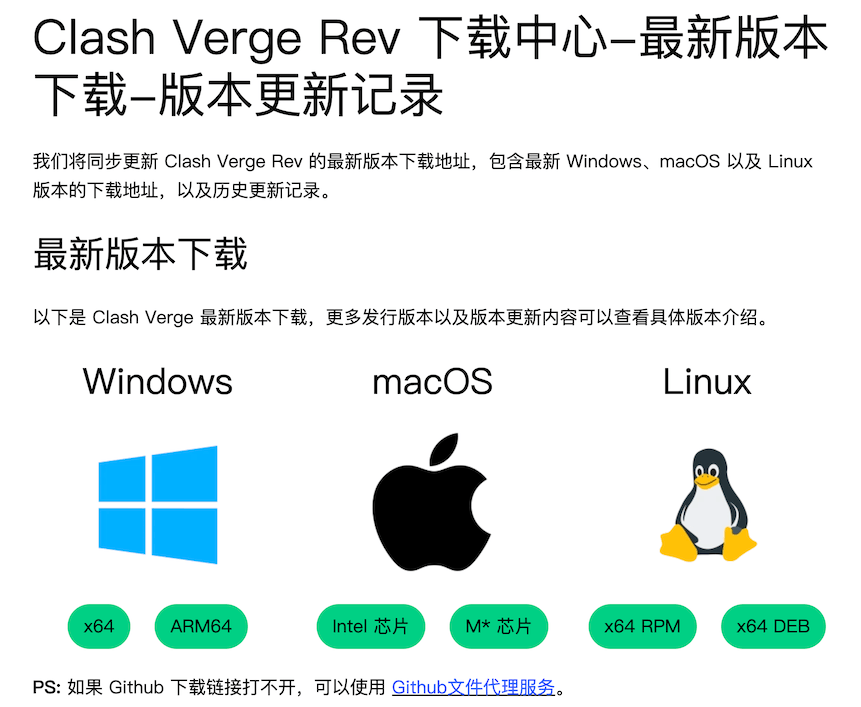
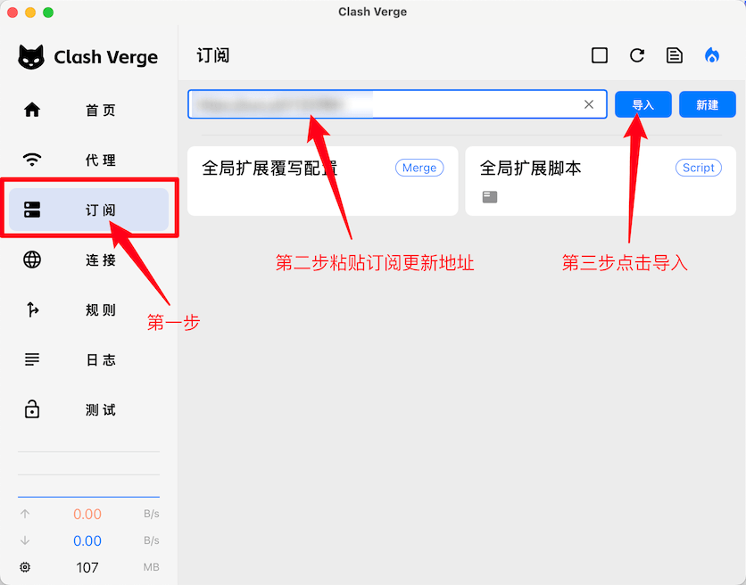
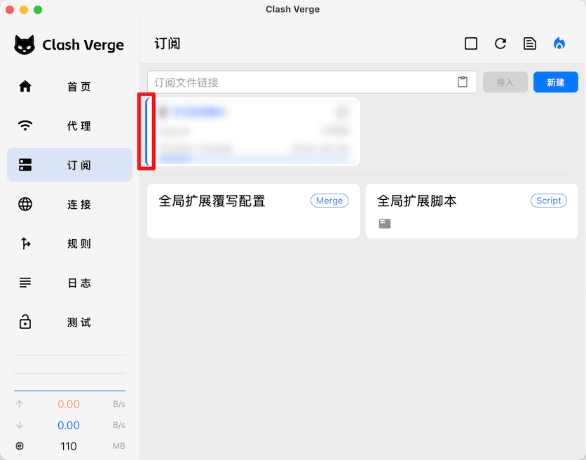
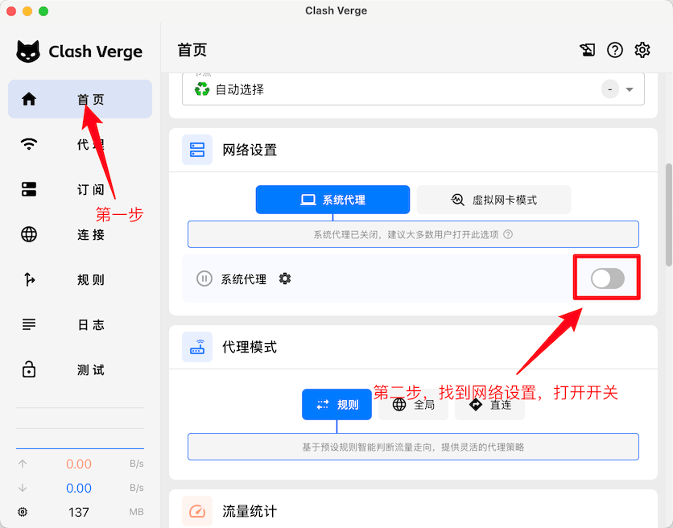
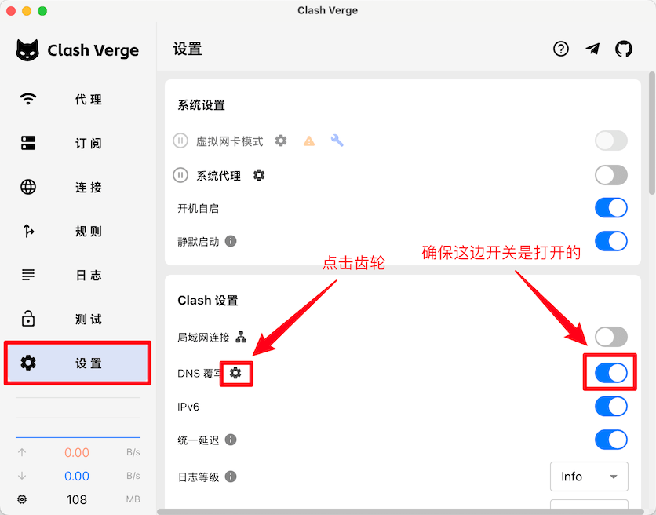
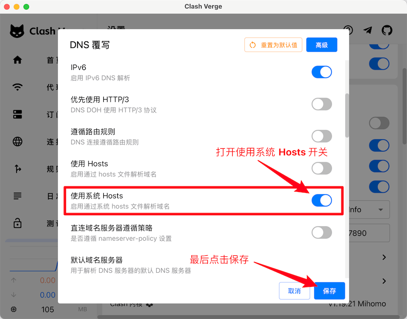
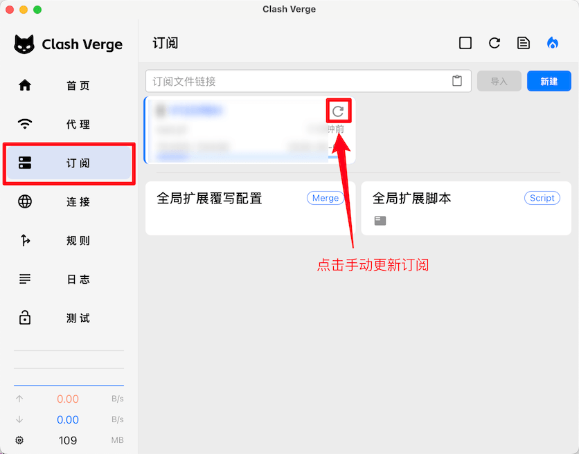

# Clash Verge 使用指北

Clash Verge 支持 Windows、Mac 和 Linux 系统

## 前言

项目源码地址：https://github.com/clash-verge-rev/clash-verge-rev

## 安装

- [Windows 版本下载](https://github.com/clash-verge-rev/clash-verge-rev/releases/download/v2.4.7/Clash.Verge_2.4.7_x64-setup.exe)

- [MacOS(Intel 系列处理器) 版本下载](https://github.com/clash-verge-rev/clash-verge-rev/releases/download/v2.4.7/Clash.Verge_2.4.7_x64.dmg)

- [MacOS(M 系列处理器) 版本下载](https://github.com/clash-verge-rev/clash-verge-rev/releases/download/v2.4.7/Clash.Verge_2.4.7_aarch64.dmg)

更多版本访问 https://clashverge.net/downloads/

如果上述链接无法打开请访问备用链接 https://www.clashverge.dev/install.html

## 配置

1. 选择左侧 `订阅` 选项，将**订阅更新地址**粘贴进上方输入框，最后导入配置

   

2. 导入完成后选中配置 **(注意选中配置后前面会有一个蓝色的线条)**

   

3. 选择左侧 `首页` 选项，打开网络设置区域中的 `系统代理` 开关，表示开启系统代理

   

   到这一步就算配置结束了，可以尝试访问 www.google.com 来判断是否代理成功

## 常见问题

### 使用  Clash Verge 后之前修改的系统 hosts 文件没生效

之所以这样是因为 Clash Verge **默认不使用系统 Hosts**，如果需要走系统 Hosts，按照如下步骤设置：

1. 找到 `设置` 中的 `DNS 覆写`

   

   2. 打开 `使用系统 Hosts` 开关

      

### 粘贴订阅更新地址后下载没反应

一般这个问题大部分是本地网络的问题，可以尝试换个网络下载或者耐心等待一会儿

### 节点无法正常使用

选择左侧 `订阅` 配置选项，尝试手动更新

更新完之后会有两种情况：

- 更新成功，并且代理可以正常使用，这个情况就不用处理了

- 更新失败，**可以试试换个网络**，如果还是不行就需要联系代理服务的提供商，确认一下是不是他们那里出现问题，一般来说到这一步代理服务的提供商会帮你解决(也可能跑路了XD)

### 节点可以正常使用，但浏览器里无法正常使用

这种情况很大概率是浏览器里安装了网络代理相关的插件，同时开启网络代理插件会和 Clash Verge 代理冲突，关闭浏览器的网络代理插件即可
