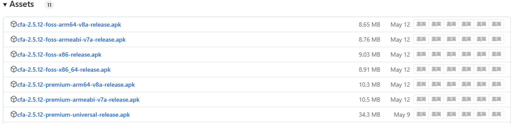

# Clash for Android 使用指北

Clash for Android 只能用于 Android(安卓) 系统，IOS(苹果) 系统需要使用 Shadowrocket

## 前言

原发布地址：~~https://github.com/Kr328/ClashForAndroid~~ (目前打开为 404)

目前原作者已经删库停更，感兴趣的可以看这篇文章 [Clash 删库跑路停更事件](https://jichanggo.com/clashforwindows%E5%88%A0%E5%BA%93%E8%B7%91%E8%B7%AF)

Clash for Windows 的最后一个版本为 `2.5.12`，测试版本为 `3.0.3`，**不推荐使用测试版本**

## 安装

> **foss** 为开源内核版，**premium** 为闭源内核版，比前者功能更强一些，推荐下载 **premium** 版

- [闭源内核通用版本下载](https://github.com/xiumuzdiao/Clash-for-Windows-and-Android/releases/download/CFA-2.5.12/cfa-2.5.12-premium-universal-release.apk)

更多版本访问 https://github.com/xiumuzdiao/Clash-for-Windows-and-Android/releases/tag/CFA-2.5.12

## 配置

1. 点击配置
    

2. 在配置页面点击右上角的加号
    

3. 点击从 URL 导入
    

4. 复制订阅地址，点击 URL 输入框，将订阅地址粘贴进去
    

5. 调整配置更新间隔为 `1440` 分钟
    

6. 保存配置
    

7. 选中配置项并更新配置项
    

8. 返回 App 首页，并点击启动按钮
    

9. 点击确定，之后出现的弹窗一律同意即可
    

10. 最后，尝试在手机浏览器中访问 www.google.com 测试代理是否正常

