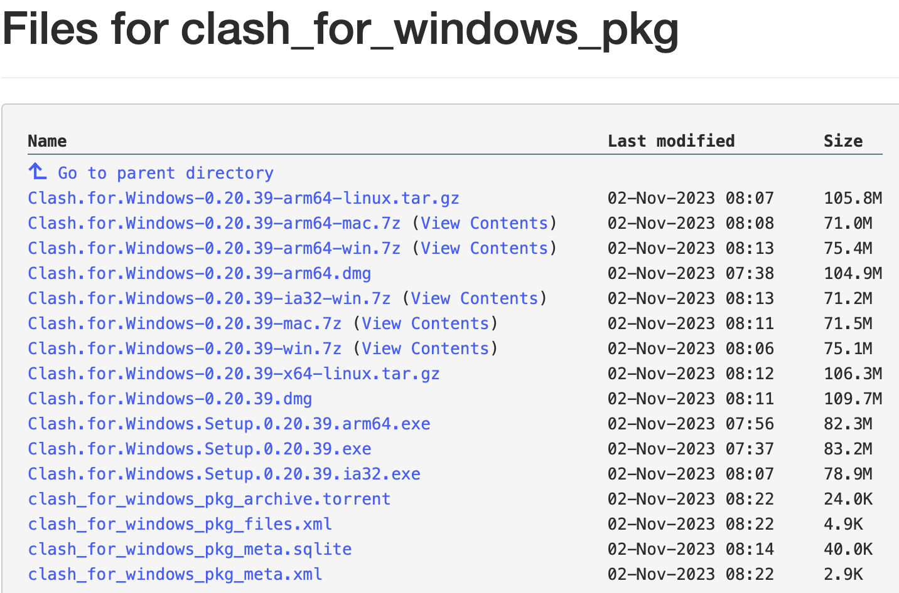
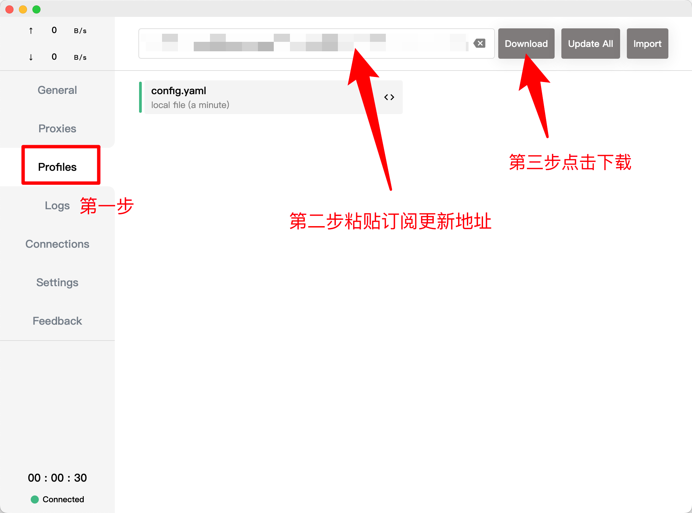
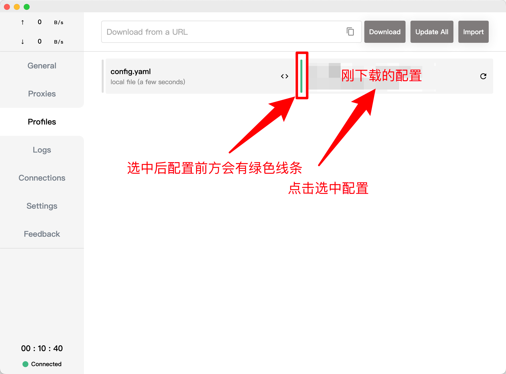
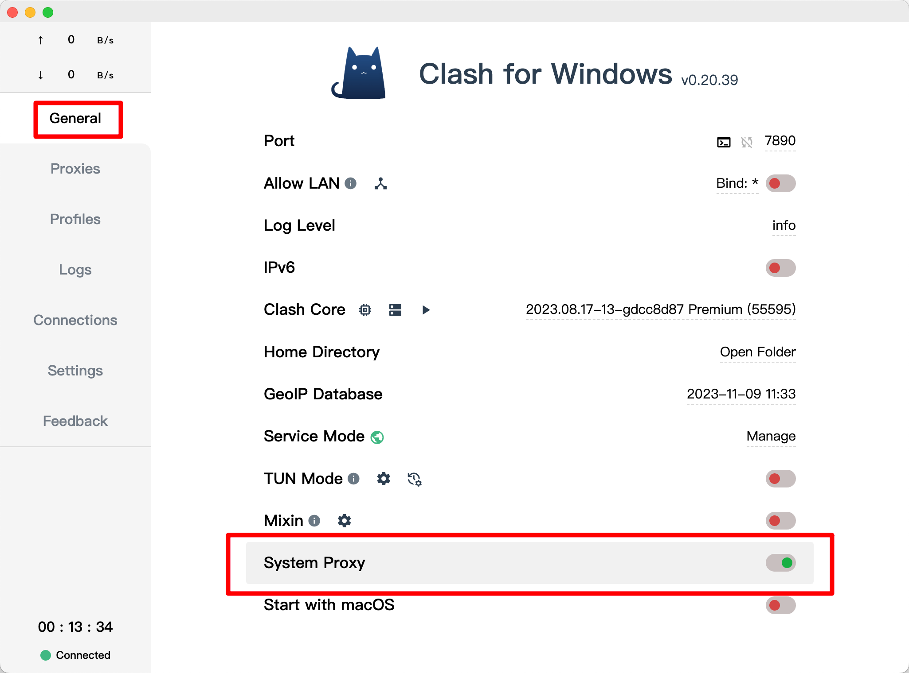
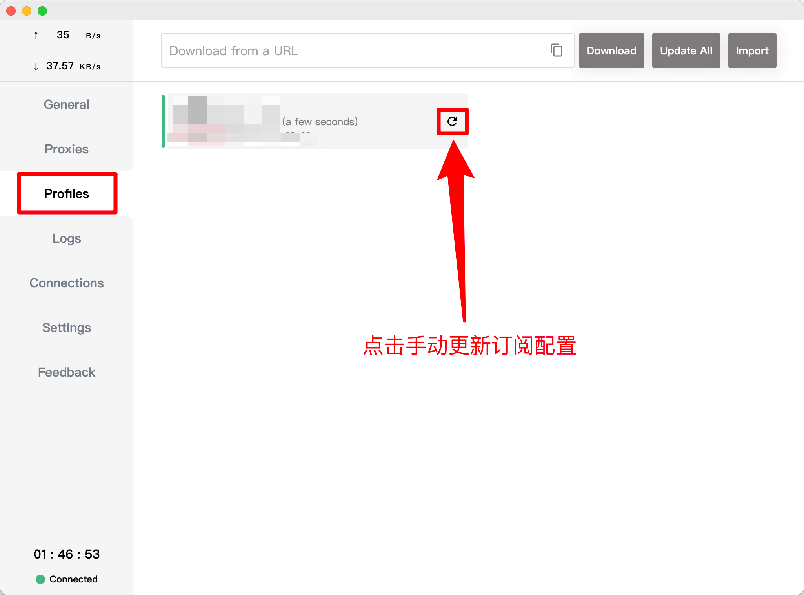
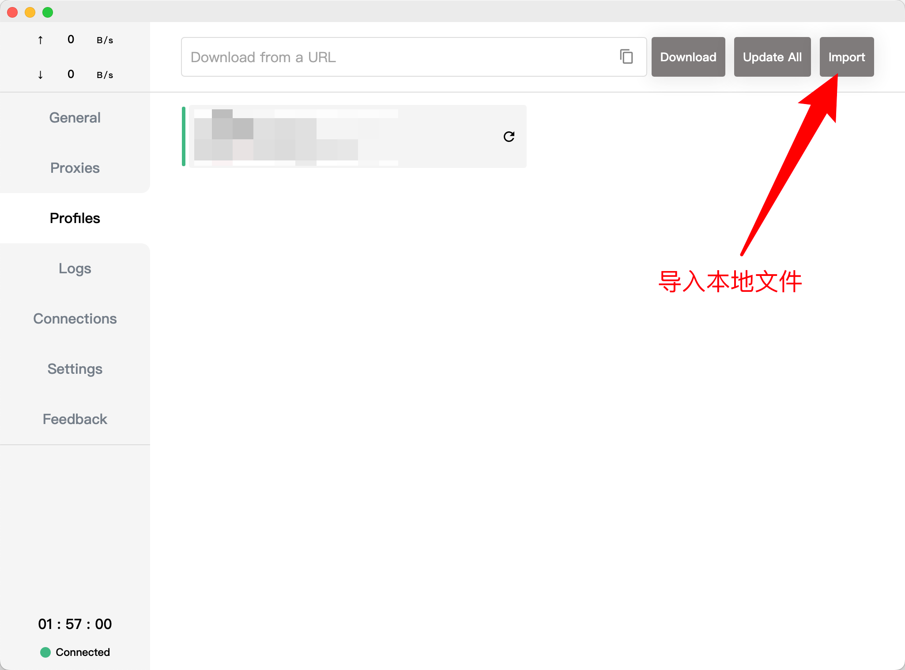

# Clash for Windows 使用指北

Clash for Windows 虽然名字中带有 Windows，但不仅限于 Windows

该软件还支持 Linux 和 Mac 系统

## 前言

原发布地址：~~https://github.com/Fndroid/clash_for_windows_pkg~~ (目前打开为 404)

目前原作者已经删库停更，感兴趣的可以看这篇文章 [Clash 删库跑路停更事件](https://jichanggo.com/clashforwindows%E5%88%A0%E5%BA%93%E8%B7%91%E8%B7%AF)

Clash for Windows 的最后一个版本为 0.20.39

## 安装

- [Windows 版本下载](https://archive.org/download/clash_for_windows_pkg/Clash.for.Windows.Setup.0.20.39.exe)

- [MacOS(Intel 系列处理器) 版本下载](https://archive.org/download/clash_for_windows_pkg/Clash.for.Windows-0.20.39.dmg)

- [MacOS(M 系列处理器) 版本下载](https://archive.org/download/clash_for_windows_pkg/Clash.for.Windows-0.20.39-arm64.dmg)

更多版本访问 https://archive.org/download/clash_for_windows_pkg

## 配置

1. 选择 Profiles 配置选项，将**订阅更新地址**粘贴进上方输入框，最后下载配置

   

2. 下载完成选中配置 **(注意选中配置后前面会有一个绿色的线条)**

   

3. 选择 General 选项，打开 System Proxy 开关，表示开启系统代理

   

   到这一步就算配置结束了，可以尝试访问 www.google.com 来判断是否代理成功

## 常见问题

### 粘贴订阅更新地址后下载没反应

一般这个问题大部分是本地网络的问题，可以尝试换个网络下载或者耐心等待一会儿

### 节点无法正常使用

选择 Profiles 配置选项，尝试手动更新

更新完之后会有两种情况

- 更新成功，并且代理可以正常使用，这个情况就不用处理了

- 更新失败，这个时候需要你尝试先关闭  General 选项下的 System Proxy 开关，再尝试手动更新，如果还是不行就需要尝试更换连接的网络

  

如果还是不行可以尝试把订阅地址(**就是你粘贴到输入框里的东西**)放在**浏览器  的地址栏**中看看能不能触发下载文件操作，如果可以下载，就把下载的文件通过本地文件 Import 方式导入

打开 General 选项下的 System Proxy 开关，再重复如下步骤，如果成功下载就可以选择下载之后的配置，原来本地导入的配置(因为不会自动更新)可以删除

最后如果还是不行就需要联系代理服务的提供商，确认一下是不是他们那里出现问题，一般来说到这一步代理服务的提供商会帮你解决(也可能跑路了XD)

