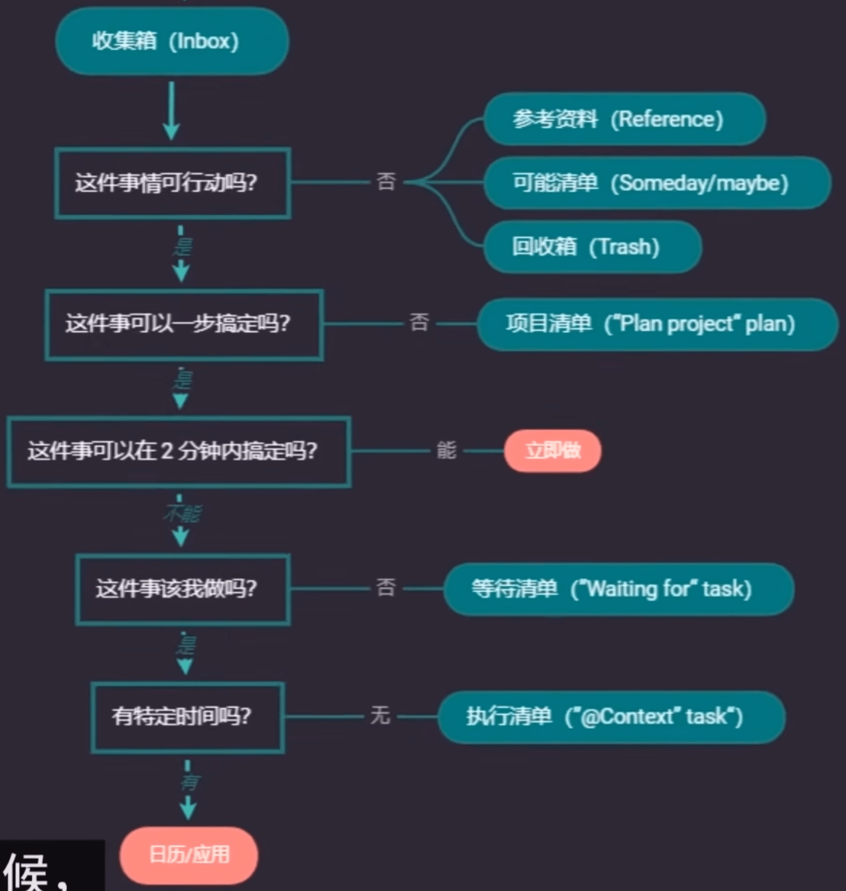
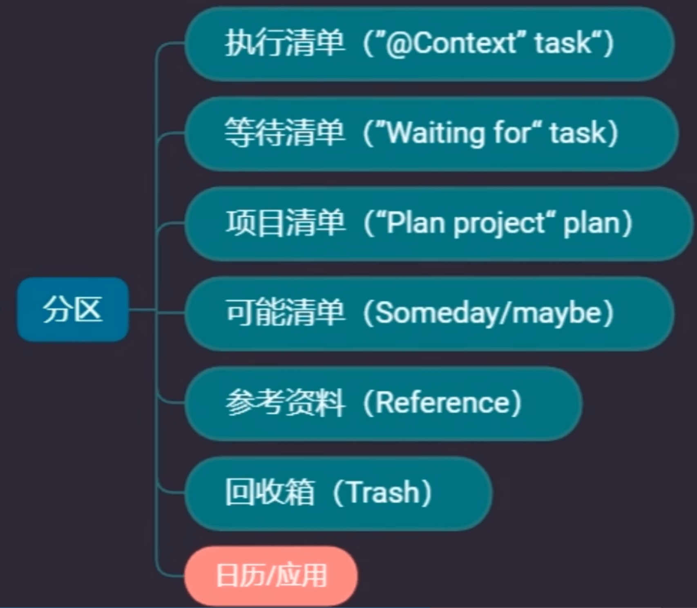
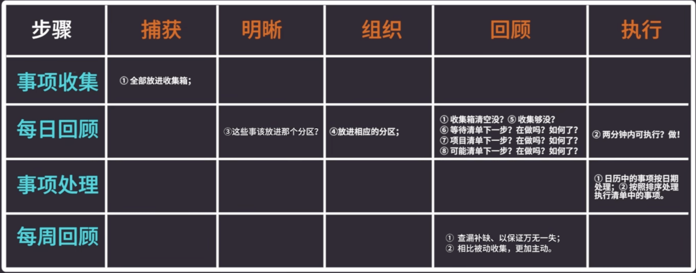

# GTD 时间管理

视频地址：https://www.bilibili.com/video/BV1wE411176Q

## GTD不应该翻译为“把事情做完”

**GTD：** Getting Things Done，不应该翻译为 “把事情做完”，**因为没有人可以把事情做完**

GTD 所强调的是把你需要做的事情列出来并处理它们，**GTD 不等于把事情做完**，所以应该翻译为 **把事情处理完或者把事情做好**

大脑是一个不稳定的存储器，无法快速对它们进行排序，此时需要一张纸或者一个软件作为稳定的外部存储器来解决这个问题，混乱的待办事项会让大脑陷入混乱的失控感当中，会导致人出现焦虑和拖延

## GTD的具体流程

### 1.捕获

把所有遇到的大小事情都捕获在一起，放入收集箱(Inbox)当中

### 2.明晰

把收集箱当中的东西一件一件拿出来，每一件都问自己五个问题

### 3.组织

在进行第二步时已经完成了组织的步骤

### 4.回顾

回顾所有清单，查出错漏，检查安排是否科学

**注意：**

1. 从收集箱中拿出的事项不能再放回收集箱
2. 项目清单中的项目需要你自己主动去拆解，去谋划执行方案，把大项目拆解为小的步骤，分解到其它清单中
3. 要特别保障等待清单、可能清单、回收箱三个分区当中的回顾，要定期主动确定等待清单是否被完成，回收箱和可能清单中的事项是否有变动
4. 确定日期是否设置恰当
5. 为第四步回顾腾出专门的时间，例如：每天回顾、每三天回顾或者每月回顾

### 5.执行

执行是你去拿结果，而不是去等做了，等结果

## 收集箱当中的事情如何放进其它分区

根据上一节 GTD 的具体流程进行实操，要注意以下要点

等待清单不等于确认别人是否完成，而是**确保任务顺利完成**，可以把事情拆成两件事

- 跟对方确认时间并提前，告知对方与其利益相关
- 在明天上班时间如果还未收到回复，可以再告知对方，起到提醒的作用，提高任务完成的可能性

## 如何回顾，以及如何为执行清单排序

**回顾顺序和步骤**

1. 日历当中的事情，只需要到时候做就行了
2. 可能清单中的事情短期内不会发生改变
3. 等待清单当中的事情到特定时间去确认就可以了
4. 项目清单中的事情进行拆分任务放入执行清单中

**如何为执行清单排序**

需要根据以下两个原则去排序

1. 你不可能完成所有的事情，尽可能的去做，尽可能是指以下两点
   - 不以牺牲个人合理的人际关系和幸福感为前提
   - 保证充足的睡眠、健康的身体
2. 尽可能做离你目标更近的事情，把事情按照自己的目标权重来排序

## 执行清单的四大注意事项

1. 能被放入执行清单的，都是可以一步搞定的事情
2. 做计划、做方案是每个人的必修课
3. 做好时间预估
4. 为特别的事情预留时间

## 如何保障执行清单的质量和效率

1. 一次只处理一件事情
2. 使用番茄时钟提高效率
3. 打破负罪感幻觉

## GTD的五个步骤分别在什么时候回顾

## 参考资料的意义和筛选标准

**意义**

1. 一切可被记录的，就可被参考
2. 参考价值的高低是相对的

**筛选标准**

1. 回归常识，避免追新、奇、怪
2. 提高信息的检索、辨别能力
3. 提高参考资料的存档标准
   - 搜索引擎能找到的、浅显平常的，不存档
   - 新概念，换汤不换药，不存档

