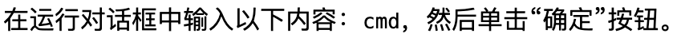
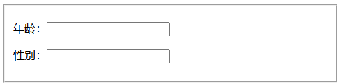
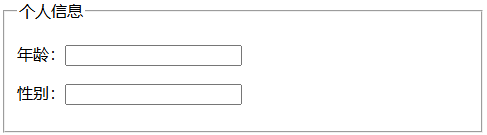
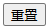
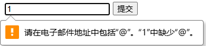
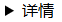

#  HTML 笔记


## 网页三要素

- 结构（HTML）
- 表现（CSS）
- 行为（JavaScript）


## 网页元素分类

- 块级元素（block），默认占据 100% 的宽度，独占一行，例如：`<div>`、`<p>` 等
- 行内元素（inline），默认和其它元素在同一行，不产生换行，例如：`<span>` 等


## 网页的基本结构

```html
<!DOCTYPE html>
<html lang="zh-CN">
  <head>
    <meta charset="utf-8">
    <title></title>
  </head>
  <body>
  </body>
</html>
```

**⚠️ 注意：** 

- HTML 语言忽略缩进和换行

- HTML 标签名对大小写不敏感
- 一般习惯使用小写


## 基本结构说明

对网页的基本结构中的各个标签进行说明


**文档类型**

```html
<!DOCTYPE html>
```

**作用：** `<!DOCTYPE>` 是用来告诉浏览器使用什么方式渲染页面

**⚠️ 注意：**

- `DOCTYPE` 一般习惯使用大写
- `DOCTYPE` 本质不是标签，像处理命令
- `html` 代指以 HTML5 的标准来解析当前页面


**`<html>` 标签**

```html
<html></html>
```

**⚠️ 注意：** 

- **一个网页只能有一个根元素**
- 除了 `<!DOCTYPE html>` 外其它标签都要放在 `<html>` 标签中


**`<head>` 标签**

```html
<!DOCTYPE html>
<html>
  <head>
    <title></title>
  </head>
</html>
```

**作用：** 它的内容不会出现在网页中，用于放置网页不可见的元信息，提供额外的渲染信息

**⚠️ 注意：** 

当网页中不包含 `<head>` 浏览器会自动创建一个

`<head>` 的子元素一般有以下七个：

- `<meta>`：设置网页的元数据
- `<link>`：引入外部样式表
- `<title>`：设置网页标题
- `<style>`：设置内嵌的样式表
- `<script>`：引入脚本
- `<noscript>`：浏览器不支持脚本时，要显示的内容
- `<base>`：设置网页内部相对 URL 的计算基准


**`<meta>` 标签**

```html
<head>
  <meta charset="utf-8">
  <meta name="viewport" content="width=device-width, initial-scale=1">
  <title></title>
</head>
```

**作用：** 用于设置网页的元数据，元数据是指描述数据的数据，HTML 网页本身也是数据

**⚠️ 注意：** `<meta>` 标签按约定放在 `<head>` 中所有子元素的最前面


**`<title>` 标签**

```html
<head>
  <title>网页标题</title>
</head>
```

**作用：** 用于设置网页的标题，对搜索引擎的排序有很大的影响，所以最好根据网页的主题设置标题

**⚠️ 注意：** `<title>` 标签中**只能放纯文本**，不能放置其它标签


**`<body>` 标签**

```html
<html>
  <head>
    <title>网页标题</title>
  </head>
  <body>
    <p>hello world</p>
  </body>
</html>
```

**作用：** `<body>` 标签中的内容是网页显示的页面


**注释**

```html
<!-- 我是一个注释 -->
```

**作用：** 注释内部的代码浏览器不会去解析，也不会去渲染


## 空格和换行处理


**标签内容的头部和尾部空格忽略不计**

```html
<p>  CodePencil  </p>
```

等价于

```html
<p>CodePencil</p>
```


**标签内容内部有多个连续空格会被合并成一个**

```html
<p>Hello      HTML</p>
```

等价于

```html
<p>Hello HTML</p>
```

**⚠️ 注意：** 标签内容中的换行符和回车符也会被替换成一个空格，**需要换行请使用 `<br />`**


## URL

URL 是 “统一资源定位符”（Uniform Resource Locator）首字母的缩写，也叫 “链接”


**URL 组成部分**

```
https://www.example.com:80/path/to/index.html?key1=value1&key2=value2#anchor
```

- 网络协议：上例中是 `https://`
- 主机名(域名)：上例中是 `www.example.com`
- 端口：上例中是 `80`，端口如果省略 HTTP 默认是 `80`，HTTPS 默认是 `443`，与域名间使用 `:` 分隔
- 路径：上例中是 `/path/to/index.html`，省略文件名默认情况是访问 `index.html`（取决于后台的配置），过去是实际地址，现在都是服务器模拟地址
- 查询参数：上例中是 `?key1=value1&key2=value2#anchor`，是键值对，以 `&` 分隔一组，与路径间用 `?` 分隔
- 锚点：上例中是 `#anchor`，页面跳转后会自动滚动到 `id` 为 `anchor` 元素所在的位置


**URL 字符**

合法的 URL 字符：

- 26 个英文字符（包含大写和小写）
- 数字
- 连词号（`-`）
- 句点（`.`）
- 下划线（`_`）

**⚠️ 注意：** 

- 还有 18 个 URL 保留字符，例如 `?`，**只能在给定位置出现，其他位置出现是非法的**
- 在 URL 中使用 URL 保留字符，**必须使用它们的转义形式**，转义规则为 `%+十六进制 ASCII 码` ，例如： `?` 转化为 `%3F`
- 既不是保留字符也不是合法字符的字符，在 URL 中浏览器会自动进行转义


**绝对 URL**

靠 URL 自身就可以定位资源，带有完整的网络协议、主机名、端口、路径

```
https://www.example.com:80/path/to/index.html
```


**相对 URL**

无法靠 URL 自身定位资源，必须结合当前网站的位置才能定位资源

- `.`  表示当前目录，例如：`./index.html`
- `..` 表示上一级目录，例如：`../index.html`

```
https://www.example.com/./index.html
```

等价于

```
https://www.example.com/index.html
```


**`<base>` 标签**

```html
<head>
  <base href="https://www.example.com/files/" target="_blank">
</head>
```

**作用：** 指定网页内部所有相对 URL 的计算基准

**⚠️ 注意：** 

- **整个网页只能有一个 `<base>` 标签**
- 至少要有 `href` 属性或 `target` 属性
- 只能放在 `<head>` 标签中
- 要改变某个链接的行为，只能使用绝对 URL 替换相对 URL


## 网页元素的属性

用于定制元素的行为


**属性格式**

```html
<html lang="en">
```

**⚠️ 注意：** 

- 标签内的属性都是 “键值对”
- 属性不区分大小写
- **建议属性值统一使用双引号**


**布尔属性值**

```html
<input type="text" required> 
```

上述代码中 `required` 是布尔属性值，可以省略属性值

等价于

```html
<input type="text" required="required"> 
```

**⚠️ 注意：** 布尔属性值只能有一个值，这个值一般和属性名相同


**全局属性**

指所有元素都可以使用的属性，下述属性所有元素都可以使用，有些属性对某些元素可能没有任何意义


**id**

```html
<p id="p1">你好</p>
```

**作用：** 指定标签的唯一标识符，在 `id` 前加 `#` 放在 URL 中可以作为锚点

**⚠️ 注意：** 同一个页面**不能有两个相同**的 `id` 属性


**class**

```html
<p class="className"></p>
```

**作用：** 用于给相同 `class` 值的标签进行分类


**title**

```html
<div title="我是title">
  <p>鼠标放在我身上会显示title</p>
</div>
```

**作用：** 为元素添加附加说明，大多数浏览器中鼠标悬浮在元素上会显示 `title` 的属性值的浮动提示


**tabindex**

```html
<p tabindex="0">我可以获得焦点</p>
```

**作用：** 控制按下 Tab 键时光标切换的顺序，这个属性的值是一个整数，有下列三种值：

- 负整数：该元素可以获得焦点（例如使用 JavaScript 中的 `focus()` 方法），但是不参与 Tab 键对网页的遍历，值通常是 `-1`
- `0`：该元素参 Tab 键对网页的遍历，顺序由浏览器指定，通常按照在网页中显示的顺序
- 正整数：网页元素按照从小到大的顺序（1、2、3、...），参与 Tab 键的遍历，如果值相同则按照在网页源码中的出现的顺序

**⚠️ 注意：** 

- `tabindex` 属性最好都设置为 `0`，按照自然顺序遍 历
- 只有无法获取焦点的元素才有必要设置 `tabindex` 属性，例如：`span`、`div` 等


**accesskey**

```html
<button accesskey="s">提交</button>
```

**作用：** 指定网页元素获得焦点的快捷键

**⚠️ 注意：** 

- 属性值必须是单个的可打印字符(可以在屏幕或打印中显示出来的字符)
- 必须配合功能键才能使用，Chrome 浏览器中在 Windows 和 Linux 系统中，是 `Alt + 字符键`，Mac 系统中是 `Ctrl + Alt + 字符键`
- 如果快捷键和系统快捷键冲突，这时不会生效


**style**

```html
<p style="color: red;">你好</p>
```

**作用：** 指定元素的 CSS 样式


**hidden**

```html
<p hidden>看不见我，看不见我</p>
```

**作用：** `hidden` 是布尔属性，表示元素跟当前网页无关，浏览器也不会渲染这个元素

**⚠️ 注意：** 如果 CSS 设置该元素可见，那么 `hidden` 属性无效


**lang**

```html
<p lang="en">hello</p>
<p lang="zh">你好</p>
```

**作用：** 指定元素使用的语言，常见的语言代码如下：

- zh：中文
- zh-Hans：简体中文
- zh-Hant：繁体中文
- en：英语
- en-US：美国英语
- en-GB：英国英语
- es：西班牙语
- fr：法语


**dir**

```html
<div dir="rtl">文本方向从右到左!</div>
```

**作用：** 指定元素中文本显示的方向，取值如下：

- `ltr`：从左到右，例如：中文、英语
- `rtl`：从右到左，例如：阿拉伯语
- `auto`：让浏览器根据内容来判断文本方向，仅在文本方向未知时推荐使用


**translate**

```html
<p>
  你好 <span translate="no">JavaScript<span>
</p>
```

**作用：** 告诉翻译软件不翻译该文本，取值如下：

- 空字符串或者 `yes`：表示内容要被翻译
- `no`：表示内容不需要被翻译

**⚠️ 注意：** 

- `translate` 属性只适用于文本元素
- 该属性是枚举属性，使用时最好带上值


**contenteditable**

```html
<p contenteditable="true">点我可以修改我</p>
```

**作用：** 指定允许用户修改元素的内容，默认情况元素的内容是不能编辑的，取值如下：

- `true` 或空字符串：内容可以编辑
- `false`：内容不可以编辑

**⚠️ 注意：** 该属性是枚举属性，使用时最好带上值


**spellcheck**

```html
<p contenteditable="true" spellcheck="true">
  英语单词 separate 容易写错成 seperate。
</p>
```

**作用：** 对允许用户修改的内容进行拼写检查，拼写错误的单词会显示红色波浪线，取值如下：

- `true`：打开拼写检查
- `false`：关闭拼写检查

**⚠️ 注意：** 

- 该属性需要和 ` contenteditable="true"` 一起使用，否则该属性无效

- 该属性值是枚举属性，使用时最好带上值
- 不使用该属性时，由浏览器自行决定是否拼写检查


**`data-` 属性**

```html
<a href="#" class="tooltip" data-tip="this is the tip!">我是链接</a>
```

**作用：** 用于在元素上放置自定义数据

**⚠️ 注意：** `data-` 属性只能通过 CSS 或 JavaScript 使用


**事件处理属性**

```html
<div onclick="alert('你好世界')">点我出现你好世界</div>
```

**作用：** 用于响应用户的操作，这些属性的值都是 JavaScript 代码，具体可以参考[事件处理属性列表](https://wangdoc.com/html/attribute#事件处理属性)


## 字符编码

浏览器必须知道字符编码才能正常显示网页的文字，通过以下方式获取字符编码

1. 一般来说从服务器发送 HTML 网页时，会通过 HTTP 头信息声明网页的编码方式，如下：

   ```
   Content-Type: text/html; charset=UTF-8
   ```

   - `text/html` 是文件类型，表示 HTML 网页
   - `charset=UTF-8` 是指定网页的字符编码方式为 `UTF-8`

2. 网页内部通过 `<meta>` 标签再次声明网页文字的编码方式

   ```html
   <meta charset="UTF-8">
   ```

**⚠️ 注意：**

- 如果 HTTP 头信息里的编码方式和网页内部的编码方式不一致，则**优先使用 HTTP 头信息里的编码方式**
- 如果 HTTP 头信息里没有编码方式则使用网页内部的编码方式
- 建议 HTTP 头信息里的编码方式和网页内部的编码方式始终保持一致


**数字表示法**

网页可以使用不同语言的编码方式，**最常用的是 UTF-8**，UTF-8 是 Unicode 字符集的一种表达方式，该字符集设计目标是包含世界上所有字符

每一个字符都有一个**码点（code point）**，例如：英文字母 `a` 的码点是十进制的 `97`（十六进制的 `61`）

由于以下原因不是每一个 Unicode 字符都可以在 HTML 中显示

- 不是每一个 Unicode 字符都可以被打印出来，例如：换行符
- 小于号 `<` 和大于号 `>` 用来定义 HTML 标签，需要用到这两个符号时必须避免它们被解释成标签
- Unicode 字符过多，没有一种输入法或者键盘可以输入所有的字符
- 网页不允许混合使用多种字符编码

HTML 为了解决上述问题允许使用 Unicode 码点表示字符，浏览器会自动将码点转换为相应的字符，具体表示如下：

- `&#N;` 十进制，`N` 表示码点
- `&#xN;` 十六进制，`N` 表示码点

```html
<p>&#97;</p>
```

等价于

```html
<p>a</p>
```

**⚠️ 注意：** HTML 标签本身不能使用码点表示，浏览器会当做文本内容显示


**实体表示法**

因为数字表示法难以记忆，为了方便使用，HTML 为一些特殊字符规定了容易记忆的名字

例如：空格：`&nbsp;`，具体可以参考[特殊字符实体表示列表](https://wangdoc.com/html/encode#字符的实体表示法)


## 网页语义结构


**`<header>` 标签**

```html
<!-- 整个网页的头部 -->
<header>
  <h1>公司名称</h1>
  <ul>
    <li><a href="/home">首页</a></li>
    <li><a href="/about">关于</a></li>
    <li><a href="/contact">联系</a></li>
  </ul>
  <form target="/search" >
    <input name="q" type="search" />
    <input type="submit" />
  </form>
</header>
```

```html
<!-- 文章头部 -->
<article>
  <header>
    <h2>文章标题</h2>
    <p>CodePencil，发表于 2025年1月17日</p>
  </header>
</article>
```

**作用：** 可以表示整个网页的头部，被称作 “页眉”，也可以表示一篇文章或者一个区块的头部，通常包含导航栏和搜索栏

**⚠️ 注意：**

- 一个页面可以包含多个 `<header>`，但是一个具体的场景中只能包含一个，例如：网页的页眉只能有一个
- `<header>` 中不能包含 `<header>` 或 `<footer>`


**`<footer>` 标签**

```html
<!-- 整个网页的底部 -->
<footer>
  <p>© 2025 xxx 公司</p>
</footer>
```

```html
<!-- 文章的底部 -->
<article>
  <header>
    <h1>文章标题</h1>
  </header>
  <footer>
    <p>>© 禁止转贴</p>
  </footer>
</article>
```

**作用：** 可以表示整个网页的尾部，被称作 “页尾”，也可以表示一篇文章或章节的尾部，通常包含版权信息或其它相关信息

**⚠️ 注意：** 

- 一个页面可以包含多个 `<footer>`，但是一个具体的场景中只能包含一个，例如：网页的页眉只能有一个
- `<footer>` 中不能包含 `<footer>` 或 `<header>`


**`<main>` 标签**

```html
<body>
  <header>页眉</header>
  <main>
    <article>文章</article>
  </main>
  <aside>侧边栏</aside>
  <footer>页尾</footer>
</body>
```

**作用：** 表示页面的主体内容

**⚠️ 注意：** 

- `<main>` 是顶层标签，不能放置 `<header>`、`<footer>`、`<article>`、`<aside>`、`<nav>` 等标签之中
- **一个页面只能有一个 `<main>` 标签**
- 功能性区块（比如搜索栏）不适合放入 `<main>` 标签中，除非当前页面是搜索页面


**`<article>` 标签**

```html
<article>
  <h2>文章标题</h2>
  <p>文章内容</p>
</article>
```

**作用：** 表示页面里面一段完整的内容，通常用来表示一篇文章或者一个论坛帖子，一个页面可以包含一个或者多个 `<article>` 标签


**`<aside>` 标签**

```html
<!-- 页面中使用 -->
<body>
  <main>主体内容</main>
  <aside>侧边栏</aside>
</body>
```

```html
<!-- 文章中使用 -->
<article>
  <h1>文章标题</h1>
  <p>第一段</p>
  <aside>
    <p>本段是文章的重点。</p>
  </aside>
</article>
```

**作用：** 用来放置与网页或者文章主要内容相关的部分

- 网页级别的 `<aside>` 可以当做侧边栏，但并不一定要在页面的侧边
- 文章级别的 `<aside>` 可以放置补充信息、评论或注释


**`<section>` 标签**

```html
<article>
  <h1>文章标题</h1>
  <section>
    <h2>第一章</h2>
    <p>...</p>
  </section>
  <section>
    <h2>第二章</h2>
    <p>...</p>
  </section>
</article>
```

**作用：** 表示一个主题区块的独立部分，在文章主题区块中表示一个章节，在幻灯片主题区块中表示一个幻灯片

**⚠️ 注意：** 一个页面不能只有一个 `<section>`


**`<nav>` 标签**

```html
<nav>
  <ol>
    <li><a href="item-a">商品 A</a></li>
    <li><a href="item-b">商品 B</a></li>
    <li>商品 C</li>
  </ol>
</nav>
```

**作用：** 用于放置页面或者文档的导航信息，`<nav>` 一般放在 `<header>` 里面，一个页面可以有多个 `<nav>` 标签，例如：一个用于页面导航，一个用于文章导航

**⚠️ 注意：** 不适合放入 `<footer>` 标签中


**`<h1>~<h6>` 标签**

```html
<body>
  <h1>JavaScript 语言介绍</h1>
    <h2>概述</h2>
    <h2>基本概念</h2>
      <h3>网页</h3>
      <h3>链接</h3>
    <h2>主要用法</h2>
</body>
```

**作用：** 表示文章的标题，按照等级一共分成六级，`<h1>` 是最高级别的标题，`<h6>` 是最低级别的标题，下一个标题是上一个标题的子标题

**⚠️ 注意：** 标题不应该越界级，例如：`<h1>` 标题下面写 `<h3>`，会导致文章失去清晰章节的结构


**`<hgroup>` 标签**

```html
<hgroup>
  <h1>Heading 1</h1>
  <h2>Subheading 1</h2>
  <h2>Subheading 2</h2>
</hgroup>
```

**作用：** 主标题如果带有副标题，可以使用 `<hgroup>` 将多级标题放入其中

**⚠️ 注意：** `<hgroup>` 标签中只能包含 `<h1>~<h6>` 标签


## 文本标签


**`<div>` 标签**

```html
<div>我是内容</div>
```

**类型：** 块级元素

**作用：** 表示通用目的的块级元素，没有任何语义，当需要一个块级容器但没有合适的标签时可以使用它

**⚠️ 注意：** 使用 `<div>` 标签应该是最后的措施，**优先使用语义标签**


**`<p>` 标签**

```html
<p>我是一个段落</p>
```

**类型：** 块级元素

**作用：** 表示文章的一个段落，相以段落显示的内容（图片、表单项等）都可以放入其中


**`<span>` 标签**

```html
<p>我是一段<span>重要</span>的文本</p>
```

**类型：** 行内元素

**作用：** 表示通用目的的行内元素，没有任何语义，通常用于对行内内容指定 CSS 样式


**`<br>` 标签**

```html
<p>Hello<br>World</p>
```


**作用：** 产生换行效果

**⚠️ 注意：** 块级元素之间的间隔不要使用 `<br>` 来产生，应当使用 CSS


**`<wbr>` 标签**

```html
<p>Hello<wbr>World</p>
```

**作用：** 与 `<br>` 标签类似，表示一个可选的换行，宽度足够时依旧一行显示，反之换行显示，主要用于防止浏览器对很长的单词不正确的换行，所以事先标明换行位置


**`<hr>` 标签**

```html
<p>第一个主题</p>
<hr>
<p>第二个主题</p>
```

**作用：** 表示水平线，在一篇文章中用于分隔不同的主题

**⚠️ 注意：** 该标签是历史遗留，尽量避免使用，分隔主题可以使用 `<section>` 标签，想要水平线可以使用 CSS


**`<pre>` 标签**

```html
<pre>Hello

   World</pre>
```


**类型：** 块级元素

**作用：** 浏览器会保留该标签内部的空格和换行，默认使用等宽字体显示


**`<strong>` 标签**

```html
<p>今天要<strong>学习HTML</strong></p>
```


**类型：** 行内元素

**作用：** 表示包含的内容具有很强的重要性，浏览器默认会加粗显示

**⚠️ 注意：** `<b>` 标签与 `<strong>` 类似，但是 `<b>` 标签缺乏语义，**推荐优先使用 `<strong>` 标签**


**`<em>` 标签**

```html
<p>我要<em>每天</em>进步一点点</p>
```


**类型：** 行内元素

**作用：** 表示强调，浏览器默认会倾斜显示

**⚠️ 注意：** 

- `<i>` 标签与 `<em>` 类似，但是 `<i>` 标签缺乏语义，**推荐优先使用 `<em>` 标签**
- 浏览器不能保证一定会倾斜，最好使用 CSS 指定切斜样式


**`<sub>` 标签**

```html
<p>水分子是 H<sub>2</sub>O</p>
```


**类型：** 行内元素

**作用：** 将内容变为下标


**`<sup>` 标签**

```html
<p>
  <var>a<sup>2</sup></var> + <var>b<sup>2</sup></var> = <var>c<sup>2</sup></var>
</p>
```


**类型：** 行内元素

**作用：** 将内容变为上标，`<var>` 标签表示代码或者数学公式中的变量


**`<u>` 标签**

```html
<p>是<em>CodePencil</em>不是<u>CodePnecil</u></p>
```


**类型：** 行内元素

**作用：** 对内容提供注释，提醒用户这里有问题，基本上用来表示拼写错误，浏览器默认以下划线显示

**⚠️ 注意：** `<a>` 标签默认也有一个下划线，容易让用户误以为 `<u>` 标签可点击，如果一定要使用，最好通过 CSS 修改 `<u>` 的默认样式


**`<s>` 标签**

```html
<p><s>原价：100元</s>优惠价：38元</p>
```


**类型：** 行内元素

**作用：** 为内容加上删除线


**`<blockquote>` 标签**

```html
<blockquote cite="https://quote.example.com">
  <p>耐心是生活的关键。</p>
</blockquote>
```


**类型：** 块级元素

**作用：** 引用他人的话，`cite` 属性的值是一个网址，表示引用来源，不会在网页上显示


**`<cite>` 标签**

```html
<blockquote cite="https://quote.example.com">
  <p>Patience is key in life.</p>
</blockquote>
<cite>-- Jared McCain</cite>
```


**类型：** 行内元素

**作用：** 表示引言出处或者作者，浏览器默认以斜体显示，`<cite>` 标签不一定要和 `<blockquote>` 标签一起使用，可以单独使用，例如下列代码

```html
<p>更多内容请参考<cite>维基百科</cite>。</p>
```


**`<q>` 标签**

```html
<p>
  Jared McCain:
  <q cite="https://quote.example.com">Patience is key in life.</q>
</p>
```


**类型：** 行内元素

**作用：** 与 `<blockquote>` 标签相同，但不会产生换行

**⚠️ 注意：** 大部分现代浏览器会为 `<q>` 标签内的文本添加引号，旧浏览器可能需要使用 CSS 添加引号


**`<code>` 标签**

```html
<code>
	console.log('你好，世界');
</code>
```


**类型：** 行内元素

**作用：** 显示计算机代码，浏览器会默认使用等宽字体显示，默认代码都是一行显示

如果要显示多行代码，`<code>` 标签必须放置 `<pre>` 标签中，以保留代码的换行以及空格

```html
<pre>
  <code> 
    let a = 1;
    console.log(a);
  </code>
</pre>
```


**`<kbd>` 标签**

```html
<p>
  在运行对话框中输入以下内容：<kbd>cmd</kbd>，然后单击“确定”按钮。
</p>
```



**类型：** 行内元素

**作用：** 表示用户的输入内容，浏览器默认使用等宽字体显示


**`<samp>` 标签**

```html
<p>
  如果使用没有定义的变量，浏览器会报错：
	<samp>Uncaught ReferenceError: foo is not defined</samp>。
</p>
```


**类型：** 行内元素

**作用：** 表示计算机程序输出的内容，浏览器默认使用等宽字体显示


**`<mark>` 标签**

```html
<p>
  全体目光向我看齐，我宣布个事情，<mark>我是个XX。</mark>
</p>
```


**类型：** 行内元素

**作用：** 表示突出显示的内容，Chrome 浏览器会默认以亮黄色为背景，突显显示该内容，`<mark>` 标签还可以用于搜索结果中，标记处匹配的关键词

**⚠️ 注意：** 不能为了高亮效果使用这个标签，不同浏览器的处理方式可能不同，最好使用 CSS 样式


**`<small>` 标签**

```html
<p>文章正文</p>
<p><small>以上内容使用创意共享许可证。</small></p>
```


**类型：** 行内元素

**作用：** 浏览器将它包含的内容以小一号的字号显示，通常用于文章附带的版权信息或者法律信息


**`<time>` 标签**

```html
<p>
  Vue 2 已于 <time datetime="2023-12-31">2023 年 12 月 31 日</time>达到终止支持时间。
</p>
```


**类型：** 行内元素

**作用：** 为与时间相关的内容提供机器可读的格式，方便搜索引擎抓取，可以有以下多种格式：

- 有效年份：`2011`
- 有效月份：`2011-11`
- 有效日期：`2011-11-18`
- 无年份的日期：`11-18`
- 年度的第几周：`2011-W47`
- 有效时间：`14:54`、`14:54:39`、`14:54:39.929`
- 日期和时间：`2011-11-18T14:54:39.929`


**`<data>` 标签**

```html
<p>水果价格：</p>
<ul>
  <li><data value="30">苹果</data></li>
  <li><data value="80">香蕉</data></li>
  <li><data value="40">橘子</data></li>
</ul>
```


**类型：** 行内元素

**作用：** 与 `<time>` 标签类似，提供给机器可读的内容，但是用于非时间的场合，`value` 属性用于指定内容对应的数据


**`<address>` 标签**

```html
<p>联系方式：</p>
<address>
  <a href="mailto:zhangsan@example.com">zhangsan@example.com</a><br />
  <a href="tel:+14155550132">+1 (415) 555‑0132</a>
</address>
```


**类型：** 块级元素

**作用：** 表示某个组织或某个人的联系方式

**⚠️ 注意：** 

- 不能有非联系信息

- 不能嵌套使用，以及不能有其它语义标签
- 通常放在 `<footer>` 标签中


**`<abbr>` 标签**

```html
<abbr title="HyperText Markup Language">HTML</abbr>
```


**类型：** 行内元素

**作用：** 表示标签内容是一个缩写，`title` 属性是给出完整形式，鼠标悬停上方会完整显示出来

**⚠️ 注意：** 部分浏览器会在内容下方添加虚线下划线


**`<ins>` 标签**

```html
<ins cite="./why.html" datetime="2025-01"><p>会议定于5月9日举行。</p></ins>
```


**类型：** 行内元素

**作用：** 表示原始文档添加的内容，用于展示文档的增加操作

- `cite` 该属性值是一个 URL，表示该网址可以解释本次添加操作
- `datetime` 该属性表示添加的时间


**`<del>` 标签**

```html
<del cite="./why.html" datetime="2025-01"><p>会议定于5月8日举行。</p></del>
```


**类型：** 行内元素

**作用：** 表示原始文档删除的内容，用于展示文档的删除操作

- `cite` 该属性值是一个 URL，表示该网址可以解释本次删除操作
- `datetime` 该属性表示删除的时间


**`<def>` 标签**

```html
<p>
  通过 TCP/IP 协议连接的全球性计算机网络，叫做 <dfn>Internet</dfn>。
</p>
```

为了脚本操作方便，也可以直接用 `title` 属性将定义写入 `<dfn>` 标签，如下

```html
<p>
  通过 TCP/IP 协议连接的全球性计算机网络，叫做
  <dfn title="全球性计算机网络">Internet</dfn>。
</p>
```


**类型：** 行内元素

**作用：** 表示内容是一个术语，本段是用于解释它的定义

术语本身是个缩写，可以 `<dfn>` 和 `<abbr>` 结合使用

```html
<p>
  <dfn><abbr title="acquired immune deficiency syndrome">AIDS</abbr></dfn>
  的全称是获得性免疫缺陷综合征。
</p>
```


**`<ruby>` 标签**

```html
<ruby>
  汉<rp>(</rp><rt>han</rt><rp>)</rp> 字<rp>(</rp><rt>zi</rt><rp>)</rp>
</ruby>
```


**类型：** 行内元素

**作用：** 表示文字的语音注释，主要用于东亚文字，例如：汉语拼音和日语的片假名

- `<rp>` 标签用于为不支持语音注释的浏览器显示该标签中的内容，对于支持的浏览器则不显示
- `<rt>` 标签用于放置语音注释

**⚠️ 注意：** 必须把文字和语音注释都放入 `<ruby>` 中


**`<bdo>` 标签**

```html
<p>床前明月光，<bdo dir="rtl">霜上地是疑</bdo>。</p>
```


**类型：** 行内元素

**作用：** 用于控制部分文字的显示方向，通过 `dir` 属性指定文字的方向，有以下两个值：

- `ltr`：文本从左往右显示
- `rtl`：文本从右往左显示


**`<bdi>` 标签**

**类型：** 行内元素

**作用：** 用于不确定文字方向的情况，告诉浏览器自己决定


## 列表标签

主要分为无序列表和有序列表


**`<ol>` 标签**

```html
<ol>
  <li>列表项 A</li>
  <li>列表项 B</li>
  <li>列表项 C</li>
</ol>
```


**类型：** 块级元素

**作用：** 表示有序列表，一般用于列表项的顺序有意义时，内部可以嵌套使用 `<ol>` 或者 `<ul>`

```html
<ol>
  <li>列表项 A</li>
  <li>列表项 B
    <ol>
      <li>列表项 B1</li>
      <li>列表项 B2</li>
      <li>列表项 B3</li>
    </ol>
  </li>
  <li>列表项 C</li>
</ol>
```


该标签有以下属性：

- `reversed`：用于产生倒序的的数字列表

  ```html
  <ol reversed>
    <li>列表项 A</li>
    <li>列表项 B</li>
    <li>列表项 C</li>
  </ol>
  ```

  

- `start`：该属性的值是一个整数，表示数字列表的起始编号

  ```html
  <ol start="4">
    <li>列表项 A</li>
    <li>列表项 B</li>
    <li>列表项 C</li>
  </ol>
  ```

  

- `type`：指定数字编号的样式，目前支持以下的值：

  - `a`：小写字母
  - `A`：大写字母
  - `i`：小写罗马数字
  - `I`：大写罗马数字
  - `1`：整数（默认值）

  ```html
  <ol type="I">
    <li>列表项 A</li>
    <li>列表项 B</li>
    <li>列表项 C</li>
  </ol>
  ```

  

  **⚠️ 注意：** 即使 `type` 属性指定的是非数字的值，**但 `start` 属性指定时依旧使用整数**

  ```html
  <ol type="I" start="3">
    <li>列表项 A</li>
    <li>列表项 B</li>
    <li>列表项 C</li>
  </ol>
  ```

  

  

**`<ul>` 标签**

```html
<ul>
  <li>列表项 A</li>
  <li>列表项 B</li>
  <li>列表项 C</li>
</ul>
```


**类型：** 块级元素

**作用：** 表示无序列表，列表顺序无意义时使用，可以嵌套 `<ul>` 或者 `<ol>`


**`<li>` 标签**

```html
<ol>
  <li>列表项 A</li>
  <li value="4">列表项 B</li>
  <li>列表项 C</li>
</ol>
```


**类型：** 块级元素

**作用：** 表示列表项，用在 `<ol>` 或者 `<ul>` 中，在 `<ol>` 有序列表中，`<li>` 有一个 `value` 属性，用于定义当前项的编号，后面的列表项会从这个编号开始


**`<dl>` 标签**

```html
<dl>
  <dt>CPU</dt>
  <dd>中央处理器</dd>

  <dt>Memory</dt>
  <dd>内存</dd>

  <dt>Hard Disk</dt>
  <dd>硬盘</dd>
</dl>
```


**类型：** 块级元素

**作用：** `<dl>` 用来定义词汇表，`<dt>` 用来定义术语名，`<dd>` 用来定义术语解释

`<dd>` 和 `<dt>` 都是块级元素，一个 `<dt>` 可以对应一个或者多个 `<dd>`


## 图像标签


**`` 标签**

```html

```


**类型：** 行内元素

**作用：** 用于插入图片，`src` 属性用于指定图片的网址

图像默认以原始大小显示，如果图片很大与文字处于同一行，图片会把当前行的行高撑高，图片和文字底部对齐

```html
<p>
  
  我是文字
</p>
```


`` 标签有以下属性：

- `alt` 属性：用于图片无法正常显示时的提示文本

  ```html
  
  ```

  

- `width` 和 `height` 属性：网页图片默认以图片原始大小插入，通过 `width` 和 `height` 可以指定图片的宽度和高度，单位可以是百分比或者像素

  ```html
  
  ```

  

  **⚠️ 注意：** 

  - 一旦设置了这两个属性，不管图片是否加载成功，浏览器都会在网页中为图片预留出这个大小的空间，图片大小可以使用 CSS 控制，一般情况不建议使用这两个属性
  - 这两个属性如果只设置其中一个，浏览器会根据图片原始大小比例自动设置宽度或高度

- `referrerpolicy` 属性：`` 标签加载图片会发送 HTTP 请求，默认会带有 `refer` 请求头信息，该属性可以对这个行为进行设置

- `crossorigin` 属性：当网页和图片属于不同的网站时，网页加载图片会导致跨域请求，如果对方服务器要求跨源认证，可以使用该属性进行告诉浏览器是否采用跨域形式下载图片，打开了该属性，就会在 HTTP 请求头中添加 `origin` 字段，给出请求发出的域名，`crossorigin` 属性可以设置以下两个值：

  - `anonymous`：跨域请求不带有用户凭证（通常是 Cookie）
  - `use-credentials`：跨域请求带有用户凭证

  ```html
  
  ```

  等价于

  ```html
  
  ```


- `loading` 属性：控制图片的加载方式，浏览器的默认行为是只要解析到 `` 标签就立马下载图片，该属性有以下三个取值：

  - `auto`：浏览器默认行为，等同于不使用 `loading` 属性
  - `lazy`：启用懒加载，只有图片进入视口可见区域时才会加载，节省流量带宽
  - `eager`：立即加载资源，无论图片在哪个位置

  ```html
  
  ```

  **⚠️ 注意：** 图片的懒加载可能会导致页面布局重新排列，使用 `loading` 属性时最好指定图片的宽度和高度


**`<figure>` 和 `<figcation>` 标签**

```html
<figure>
  
  <figcaption>CodePencil的头像</figcaption>
</figure>
```


**类型：** 块级元素

**作用：** `<figure>` 作为一个图像区块，用于将图片和相关信息封装在一起，`<figcation>` 标签是它的可选子元素，表示图片的文本描述，通常用于放置标题，可以有多个，也是块级元素

`<figure>` 除了图像，还可以封装引言、代码、诗歌等，等同于一个将主体和相关信息封装在一起的语义封装容器

```html
<figure>
  <figcaption>JavaScript 代码示例</figcaption>
  <p><code>console.log('你好，世界');</code></p>
</figure>
```


**响应式图像**

为什么有响应式图像的需求？

因为通常直接使用 `` 标签插入图片存在以下三个问题：

- 桌面端显示的图片尺寸和体积对移动端来说过大，加载慢（体积问题）
- 桌面端显示的图片在移动端上显示有些模糊（像素密度问题）
- 桌面端显示的图片放在移动端上容易缺失重点， 部分细节无法看清（视觉风格问题）


如何解决上面的三个问题？

HTML 提供了一套完整的解决方案

首先 `` 标签引入了 `srcset` 属性，该属性可以指定多张图片来适应不同像素密度的屏幕，值是以逗号分隔的字符串，当没有适合的像素比或者不支持 `srcset` 属性时会使用 `src` 属性中的图片

**格式：** 图像 URL + 空格 + 像素密度倍数 + 字母 `x`，`1x` 表示单倍像素比，可以省略

```html

```

- 在1.25 倍像素比下显示 480 宽度的图片，浏览器选择最接近的像素比

  

- 在 2 倍像素比下显示 640 宽度的图片

  

上述步骤解决了像素问题

如何解决图片尺寸和体积以及视觉风格的问题

第一步：使用 `srcset` 属性列出所有可用的图像，该属性的值是以逗号分隔的字符串

**格式：** 图像 URL + 空格 + 宽度描述符（图像原始宽度 + `w`）

```html

```

第二步：使用 `sizes` 属性列出不同设备的图像显示宽度，该属性的值是以逗号分隔的字符串

```html

```

屏幕宽度为 320px 时

当像素比为 1 时，执行 `(max-width: 320px) 320px` 返回 320px 并与像素比相乘得到320px，会加载 320px 的图片

但当像素比为 2 时，返回的 320px 与 像素比 2 相乘得到 640px，会加载 640px 的图片

屏幕宽度为 1000px 并且像素比为 1 时，会加载最后一档的 640px，与像素比相乘得到 640px 的图片

**⚠️ 注意：** `sizes` 属性必须和 `srcset` 属性搭配使用，单独使用 `sizes` 属性无效，如果省略 `sizes` 属性单独使用 `srcset` 属性，浏览器根据实际图像宽度显示


**`<picture>` 标签**

```html
<picture>
  <source media="(max-width: 500px)"
          srcset="https://dummyimage.com/500, https://dummyimage.com/1000 2x">
  <source media="(max-width: 501px)"
          srcset="https://dummyimage.com/501, https://dummyimage.com/1002 2x">
  
</picture>
```


**类型：** 行内元素

**作用：** `` 标签的 `srcset` 属性解决了像素密度的问题，`sizes` 属性解决了图片尺寸与屏幕大小适配的问题，要同时解决像素密度和屏幕大小适配问题需要使用 `<picture>` 标签，内部的标签有 `<source>` 和 ``

`<source>` 标签有以下属性：

- `media` 属性：用于给出媒体查询表达式，`sizes` 属性依旧可以用，但因为有了该属性就不用了
- `srcset` 属性：与 `` 的 `srcset` 属性相同，**可以同时指定1倍图和2倍图**

按照 `<source>` 标签的顺序来判断当前设备是否满足媒体查询条件，满足就加载对应图片，如果都不满足或者不支持 `<pircture>` 标签则加载最后的 `` 标签

`<picture>` 还可以用来加载不同格式的图像

```html
<picture>
  <source type="image/svg+xml" srcset="logo.xml">
  <source type="image/webp" srcset="logo.webp"> 
  
</picture>
```

`type` 属性用于填写图像文件的 MIME 类型，`srcset` 是对应的图像 URL，按 `<source>` 标签顺序依次判断浏览器是否支持，如果支持则加载对应格式的图片，如果都不支持则使用最后的 `` 标签


## `<a>` 标签

```html
<a href="https://github.com">Github</a>
```

**类型：** 行内元素

**作用：** 表示一个可以跳转的链接，标签内部可以放置图片、元素、文本等

有以下属性：

- `href` 属性：链接指向的网址，值可以是 URL 或者锚点

  ```html
  <a href="#demo">我是锚点</a>
  ```

  锚点点击会滚动到当前页面锚点所在的位置

- `hreflang` 属性：告诉搜索引擎链接指向网址所用的语言，没有实际功能

  ```html
  <a href="https://github.com" hreflang="en">Github</a>
  ```

  `hreflang="en"` 属性表明链接指向的网址的语言是英语

  某个资源有多个语言版本，可以将 `hreflang` 设为 `x-default`，表示哪一个版本是默认语言

  ```html
  <a href="https://v2.vuejs.org/index.html" hreflang="en">English Vue</a>
  <a href="https://v2.cn.vuejs.org" hreflang="x-default">Chinese Vue</a>
  ```

- `title` 属性：鼠标移动到链接上时提示的文字

  ```html
  <a href="https://github.com" title="你好，Github">Github</a>
  ```

  

- `target` 属性：用于指定链接的打开方式

  ```html
  <a href="https://github.com" target="_blank">Github</a>
  ```

  有以下几个值：

  - `_self`：当前窗口打开，默认值
  - `_blank`：新窗口打开
  - `_parent`：上层窗口打开，通常用于父窗口打开子窗口，或者 `<iframe>` 里的链接，如果当前窗口没有父窗口，这个值等价于 `_self`
  - `_top`：顶层窗口打开，如果当前窗口就是顶层窗口，这个值等价于 `_self`
  - 窗口名，例如：`target="test"`，如果 test 窗口已经打开则取代里面的网页显示，反之创建一个名为 `test` 的窗口并打开页面

  **⚠️ 注意：** 使用 `target` 属性时最好配合 `rel="noreferrer"` 一起使用，可以避免请求头里携带当前网址，避免安全风险

-  `rel` 属性：用于说明链接和当前文档之间的关系

  ```html
  <a href="https://github.com/wjw020206" rel="author">CodePencil</a>
  ```

  具体属性值可以参考[rel属性值列表](https://wangdoc.com/html/a#rel)

- `referrerpolicy` 属性：用于精确设置点击链接时发送 HTTP 头信息的 `Referer` 字段的行为，具体属性值可以参考[referrerPolicy属性值列表](https://developer.mozilla.org/zh-CN/docs/Web/API/HTMLAnchorElement/referrerPolicy#%E5%80%BC)

- `ping` 属性：用于跟踪用户的行为，该属性的值是一个网址的 URL，用户点击时会向这个网址发送一个 POST 请求（包含点击的行为发生的页面的链接以及链接所指向页面的链接），FireFox 浏览器不支持该属性，无法发送任何自定义的数据，不推荐使用

- `type` 属性：给出网址的 MIME 类型，没有实际功能

  ```html
  <a href="avatar.jpg" type="image/jpeg">头像图片</a>
  ```

- `download` 属性：表示当前链接用于下载而不是跳转到另一个 URL

  ```html
  <a href="avatar.jpg" download>下载头像图片</a>
  ```

  如果 `download` 属性设置了值，例如：`download="demo.jpg"`，下载的文件名变为 `demo.jpg`，如果服务器的 HTTP 响应头信息里设置的 `Content-Disposition` 与 `download` 属性里设置的文件名不一致，按照 `Content-Disposition` 来

  有些地址是数据地址，不是真实的网址，例如下述代码：

  ```html
  <a href="data:,Hello%2C%20World!" download="hello.txt">点击下载</a>
  ```

  这时可以使用 `download` 属性指定文件名，上述 `hello.txt` 文件点击下载后文本内容就是 `Hello, World!`

  **⚠️ 注意：** 

  - `download` 属性只有链接与网址同源才能下载
  - 在 Chrome 浏览器中只能使用 HTTPS 协议的链接才能下载


**邮箱链接**

链接地址指向一个邮箱，使用 `mailto` 协议，点击链接浏览器会打开默认的邮件程序

```html
<a href="mailto:contact@example.com">联系我们</a>
```

除了邮箱地址，还可以通过 URL 参数的形式指定邮件的几个要素，具体可以参考[邮箱要素列表](https://wangdoc.com/html/a#%E9%82%AE%E4%BB%B6%E9%93%BE%E6%8E%A5)

也可以不指定邮箱地址，让用户自己在邮箱程序中选择转发的联系人

```html
<a href="mailto:">转发</a>
```


**电话链接**

链接地址指向一个电话号码，使用 `tel` 协议，在手机点击链接会唤起拨号界面，可以直接拨打指定号码

```html
<a href="tel:13412345678">13412345678</a>
```


## `<link>` 标签

**作用：** 用于当前网页与外部资源联系起来，通常放在 `<head>` 标签中，通常用来做以下几件事：

- 加载 CSS 样式表

  ```html
  <link rel="stylesheet" type="text/css" href="theme.css">
  ```

- 加载 favicon 图标文件

  ```html
  <link rel="icon" href="/favicon.ico" type="image/x-icon">
  ```

- 在手机上访问时，网站通常需要提供不同分辨率的图标文件

  ```html
  <link rel="apple-touch-icon-precomposed" sizes="114x114" href="favicon114.png">
  <link rel="apple-touch-icon-precomposed" sizes="72x72" href="favicon72.png">
  ```

  上述代码为苹果手机指定不同分辨率的图标文件

- 提供文档的相关链接，例如文档的 RSS 地址

  ```html
  <link rel="alternate" type="application/atom+xml" href="/blog/news/atom">
  ```

有以下常用的属性：

- `rel` 属性：**是 `<link>` 标签必须的属性**，当做对 `href` 属性资源链接的说明，取值可以参考[rel 属性列表](https://wangdoc.com/html/link#rel-属性)

- `hreflang` 属性：表示 `href` 属性所链接的资源使用的语言，用法与 `<a>` 标签的 `hreflang` 属性相同

  ```html
  <link href="https://example.com" rel="alternate" hreflang="x-default">
  <link href="https://example.com/de" rel="alternate" hreflang="de">
  ```


**资源的预加载**

**作用：** 浏览器预先下载资源，缓存起来，**等到需要使用的时候不需要下载立即就可以用**

主要有以下五种类型：

- `preload`：告诉浏览器尽快下载并缓存资源，**优先级高，浏览器一定会下载，下载后不会对资源执行任何操作，只作为缓存**

  ```html
  <link rel="preload" href="image.png" as="image">
  ```

  **优点：**

  - 允许指定预加载资源的类型，通过 `as` 属性指定资源类型

    ```html
    <link rel="preload" href="style.css" as="style">
    <link rel="preload" href="main.js" as="script">
    ```

    `as` 属性的值可以参考[as属性值列表](https://developer.mozilla.org/zh-CN/docs/Web/HTML/Element/link#as)

    **⚠️ 注意：** 

    - 如果 `as` 属性指定这些值以外或者浏览器不认识的值，浏览器会以低优先级下载
    - 当设置了 `rel="preload"` 后，`as` 属性必须要有

    还可以指定 `type` 属性，进一步明确 `MIME` 类型

    ```html
    <link rel="preload" href="demo.mp4" as="video" type="video/mp4">
    ```

  - 允许配置 `onload` 事件回调

    ```html
    <link rel="preload" as="style" href="style.css" onload="this.rel='stylesheet'">
    ```

    上述代码中，`onload` 指定的回调函数会在 style.css 下载完成后立即插入页面

- `prefetch`：预下载资源作为缓存用于后续的页面，**优先级较低，浏览器不一定会下载**，例如：网速很慢时

  ```html
  <link rel="prefetch" href="https://www.example.com/">
  ```

- `preconnect`：要求浏览器提前与某个域名建立 TCP 连接，适用于很快就要请求该域名的情况

  ```html
  <link rel="preconnect" href="https://www.example.com/">
  ```

- `dns-prefetch`：要求浏览器提前对某个域名进行 DNS 解析

  ```html
  <link rel="dns-prefetch" href="https://example.com/">
  ```

- `prerender`：要求浏览器加载某个页面时，提前渲染它，例如：当用户点击指向该页面的链接时，会立即呈现页面

  ```html
  <link rel="prerender" href="https://example.com/">
  ```


**media 属性**

用于设置外部资源生效的媒体条件

```html
<link href="print.css" rel="stylesheet" media="print">
<link href="mobile.css" rel="stylesheet" media="screen and (max-width: 600px)">
```

上述代码，打印时加载 print.css 文件，当屏幕宽度小于等于 600px 时，才会加载 mobile.css 文件


**其它属性**

具体可以参考[其他属性列表](https://wangdoc.com/html/link#其他属性)


## `<script>` 标签

```html
<script>
  console.log('Hello World');
</script>
```

**作用：** 用于加载脚本代码

有以下几个属性：

- `src` 属性：用于加载外部脚本代码

  ```html
  <script src="main.js"></script>
  ```

- `type` 属性：用于设置脚本的类型，默认值是 `text/javascript`，可以省略，下述是完整写法

  ```html
  <script type="text/javascript" src="main.js"></script>
  ```

  `type` 属性可以设置为 `module`，表示是一个 ES6 模块，不是传统脚本

  ```html
  <script type="module" src="main.js"></script>
  ```

  对于不支持 ES6 模块的浏览器，可以设置为 `nomodule` 属性兼容老的浏览器，下述代码在不支持 ES6 模块的浏览器中会加载 fallback.js 而不会加载 main.js，反之只会加载 main.js

  ```html
  <script type="module" src="main.js"></script>
  <script nomodule src="fallback.js"></script>
  ```

- `async` 属性：指定 JavaScript 代码为异步代码，加载的时候不会阻塞页面，JavaScript 代码默认是同步执行

- `defer` 属性：指定 JavaScript 代码不会立即执行，在页面解析完成之后才执行

- `crossorigin` 属性：采用跨域的方式加载外部脚本，在 HTTP 请求头中会添加 `origin` 字段

- `integrity` 属性：给出外部脚本的哈希值，只有哈希值相同才会执行脚本，防止脚本被篡改

- `nonce` 属性：一个密码随机数，由服务器在 HTTP 头信息里给出，每次加载脚本都不一样，浏览器会检查是否带有正确的 `nonce`，如果没有则不会执行代码

- `referrerpolicy` 属性：配置 HTTP 请求的 `Referer` 字段处理方法


## `<noscript>` 标签

```html
<noscript>
  您的浏览器不能执行 JavaScript，页面无法正常显示。
</noscript>
```

**作用：** 用于当浏览器不支持或者关闭 JavaScript 时，所要显示的内容


## 多媒体标签


**`<video>` 标签**

```html
<video src="example.mp4" controls>
  <p>你的浏览器不支持 HTML5 视频，请下载<a href="example.mp4">视频文件</a>。</p>
</video>
```

**类型：** 块级元素

**作用：** 用于放置视频

`<video>` 标签的属性具体可以参考 [video 属性列表 ](https://wangdoc.com/html/multimedia#video)

为了避免浏览器不支持视频格式的问题，可以使用 `<source>` 标签放置同一个视频的多种格式

```html
<video controls>
  <source src="example.mp4" type="video/mp4">
  <source src="example.webm" type="video/webm">
  <p>你的浏览器不支持 HTML5 视频，请下载<a href="example.mp4">视频文件</a>。</p>
</video>
```

`type` 属性是 MIME 类型，上述代码如果浏览器支持 mp4，就不会再往下执行，如果所有视频格式都不支持，则显示提示


**`<audio>` 标签**

```html
<audio controls>
  <source src="example.mp3" type="audio/mp3">
  <source src="example.ogg" type="audio/ogg">
  <p>你的浏览器不支持 HTML5 音频，请直接下载<a href="example.mp3">音频文件</a>。</p>
</audio>
```

**类型：** 块级元素

**作用：** 用于放置音频，用法与 `<video>` 标签类似，标签属性可以参考 [audio 属性列表](https://wangdoc.com/html/multimedia#audio)


**`<track>` 标签**

```html
<video controls src="sample.mp4">
   <track label="英文" kind="subtitles" src="subtitles_en.vtt" srclang="en">
   <track label="中文" kind="subtitles" src="subtitles_cn.vtt" srclang="cn" default>
</video>
```

**作用：** 用于指定视频的字幕，**放置与 `<video>` 标签内部**，字幕文件格式是 `.vtt` 文件

该标签有以下属性：

- `label`：播放器显示的字幕名称，供用户选择
- `kind`：字幕的类型，有以下两种类型：
  - `subtitles`：表示使用翻译后的字幕，例如：英文视频中显示中文字幕
  - `captions`：表示使用没翻译的字幕，例如：英文视频中显示英文字幕
- `src`：vtt 字幕文件的网址
- `srclang`：字幕的语言，**必须是有效的语言代码**
- `default`：布尔属性，表示是否默认打开


**`<source>` 标签**

**作用：** 放置在 `<picture>`、`<video>`、`<audio>` 标签的内部，用于指定一项外部资源

有以下常用属性：

- `type`：指定外部资源的 MIME 类型
- `src`：指定源文件，用于 `<video>` 和 `<audio>`
- `srcset`：指定不同条件下加载不同的图片文件，用于 `<picture>`
- `media`：指定媒体查询的表达式，用于 `<picture>`
- `sizes`：指定不同设备的显示大小，用于 `<picture>`，**必须和 `srcset` 一起使用**


**`<embed>` 标签**

```html
<embed type="video/quicktime" src="movie.mov" width="640" height="480" />
```

**类型：** 行内元素

**作用：** 用于嵌入外部内容，外部内容的样式通常是由浏览器插件负责控制，上述代码如果浏览器没有安装 quicktime 插件，视频就无法播放

`<embed>` 标签具有如下属性：

- `height`：显示高度，单位为像素，不允许百分比
- `width`：显示宽度，单位为像素，不允许百分比
- `src`：嵌入的资源的 URL
- `type`：嵌入资源的 MIME 类型

**⚠️ 注意：** 大多数现代浏览器已经取消了对浏览器插件的支持，**谨慎使用**


**`<object>` 标签和 `<param>` 标签**

```html
<object type="application/pdf"
    data="https://interactive-examples.mdn.mozilla.net/media/examples/In-CC0.pdf"
    width="250"
    height="200">
</object>
```


**作用：** 与 `<embed>` 标签类似，插入外部资源，由浏览器插件处理，**可以作为 `<embed>` 标签的替代品，有标准化行为**，无历史问题，只限于插入少数几种通用资源，上述代码在页面中插入了 PDF 文件

`<object>` 具有如下属性：

- `data`：嵌入资源的 URL
- `form`：当前网页中相关联表单的`id`属性（如果有的话）
- `height`：资源的显示高度，单位为像素，不能使用百分比
- `width`：资源的显示宽度，单位为像素，不能使用百分比
- `type`：资源的 MIME 类型
- `typemustmatch`：布尔属性，表示 `data` 属性与 `type` 属性是否必须匹配

`<object>` 内部可以使用 `<param>` 标签，用于传递给浏览器插件运行所需要的参数

```html
<object data="movie.swf" type="application/x-shockwave-flash">
  <param name="foo" value="bar">
</object>
```


## `<iframe>` 标签

```html
<iframe src="https://www.example.com"
        width="100%"
        height="500"
        frameborder="0"
        allowfullscreen
        sandbox>
  <p><a href="https://www.example.com">点击打开嵌入页面</a></p>
</iframe>
```

**类型：** 行内元素

**作用：** 在网页中嵌入其它网页

当浏览器不支持时，会显示内部的子元素，例如：上述代码会显示一个链接

该标签具有以下属性：

- `allowfullscreen`：允许嵌入的网页全屏显示，需要全屏 API 的支持
- `frameborder`：是否绘制边框，`0` 为不绘制，`1` 为绘制（默认值），**建议使用 CSS 来设置边框的样式**
- `src`：要嵌入网页的 URL
- `width`：显示区域的宽度
- `height`：显示区域的高度
- `sandbox`：配置嵌入网页的权限
- `importance`：浏览器下载嵌入网页的优先级，可以设置以下值：
  - `height`：高优先级
  - `low`：低优先级
  - `auto`：表示由浏览器自行决定
- `name`：内嵌窗口的名称，用于 `<a>`、`<form>`、`<base>` 的 `target` 属性
- `referrerpolicy`：配置请求嵌入网页时发送的 HTTP 请求的 `Referer` 字段，具体设置与 `<a>` 标签配置相同


**sandbox 属性**

`<iframe>` 嵌入的网页默认是由正常权限，例如：执行脚本、提交表单、弹出窗口，因此存在安全风险，为了限制安全风险，HTML 提供一个 `sandbox` 属性，用于配置 `<iframe>` 嵌入的网页的权限，类似于沙箱环境

```html
<iframe src="https://www.example.com" sandbox></iframe>
```

该属性可以当做布尔属性使用，上述代码表示开启所有的限制

该属性也可以设置具体的值，可以同时设置多个，以空格分隔，未设置某一项表示不具有该权限，例如：

```html
<iframe src="https://www.example.com" sandbox="allow-same-origin allow-popups"></iframe>
```

具体设置的值可以参考 [sandbox 属性列表](https://wangdoc.com/html/iframe#sandbox-属性)

**⚠️ 注意：** **不要同时设置 `allow-scripts` 和 `allow-same-origin`**，这会使嵌入的网页可以改变和删除 `sandbox` 属性


**loading 属性**

`<iframe>` 指定的网页会立马加载，可以通过 `loading` 属性配置懒加载，只有当 `<iframe>` 滚动进入视口后才加载

```html
<iframe src="https://www.example.com" loading="lazy"></iframe>
```

该属性可以取以下几个值：

- `auto`：浏览器的默认行为，相当于不使用 `loading` 属性
- `lazy`：`<iframe>` 进入视口时加载网页
- `eager`：立即加载资源，不管在页面的什么位置

**⚠️ 注意：** 如果 `<iframe>` 是隐藏的，则 `loading` 属性无效，将会立即加载，在 Chrome 浏览器中，满足以下任意一个条件则视为隐藏：

- `<iframe>` 的宽度和高度为 4 像素或更小
- `<iframe>` 的样式设置为 `display: none` 或者 `visibility: hidden`
- 使用定位坐标为负 `X` 或 `Y`，将 `<iframe>` 放置在屏幕外


## 表格标签


**`<table>`、`<caption>` 标签**

```html
<table>
  <caption>示例表格</caption>
</table>
```

**类型：** 两个标签都是块级元素

**作用：** 

- `<table>`  所有表格的内容都要放在这个标签中
- `<caption>` 标签表示表格的标题，是 `<table>` 标签第一个子元素，是可选的


**`<thead>`、`<tbody>`、`<tfoot>` 标签** 

```html
<table>
  <thead></thead>
  <tbody></tbody>
  <tfoot></tfoot>
</table>
```

**类型：** 这三个标签都块级元素

**作用：**

- `<thead>` 表示表头
- `<tbody>` 表示表体，在大型表格中可以使用多个 `<tbody>`，表示连续的多个部分
- `<tfoot>` 表示表尾

三个标签都是可选的

**⚠️ 注意：** 最好按照上述代码的标签顺序去使用


**`<colgroup>`、`<col>` 标签**

```html
<table>
  <colgroup>
    <col>
    <col>
    <col>
  </colgroup>
</table>
```

**作用：** 

- `<colgroup>` 用于包含一组列的定义
- `<col>` 是 `<colgroup>` 的子元素，用来定义表格的一列，**没有子元素，主要用来声明表结构，为表格附加样式**

上述代码中表示表格有 3 列

```html
<table>
  <colgroup>
    <col class="red">
    <col class="green">
    <col class="blue">
  </colgroup>
  <tr>
    <td>1</td>
    <td>2</td>
    <td>3</td>
  </tr>
  <tr>
    <td>4</td>
    <td>5</td>
    <td>6</td>
  </tr>
</table>
```


上述代码通过每列的 `class` 指定了背景颜色

`<col>` 标签有一个 `span` 属性，值为正整数，默认值为 `1`，如果大于 `1` 表示该列的宽度包含连续多列

```html
<table>
  <colgroup>
    <col class="red" />
    <col span="2" class="green" />
    <col class="blue" />
  </colgroup>
  <tr>
    <td>1</td>
    <td>2</td>
    <td>3</td>
  </tr>
  <tr>
    <td>4</td>
    <td>5</td>
    <td>6</td>
  </tr>
</table>
```


上述代码，虽然表头只定义了 3 列，但实际数据有 4 列，第 2 列连续跨了 2 列，图中第 3 列因为没有数据所以没显示


**`<tr>` 标签**

```html
<table>
  <tr></tr>
  <tr></tr>
</table>
```

**作用：** 表示表格的一行，如果表格有 `<thead>`、`<tbody>`、`<tfoot>`，就放在这些容器元素中，反之直接放在 `<table>` 中

上述代码表示表格总共有 2 行


**`<th>`、`<td>` 标签**

```html
<table>
  <tr>
    <th>学号</th><th>姓名</th>
  </tr>
  <tr>
    <td>001</td><td>张三</td>
  </tr>
  <tr>
    <td>002</td><td>李四</td>
  </tr>
</table>
```


**作用：**

- `<th>` 表示标题单元格，默认内部文字加粗
- `<td>` 表示数据单元格


**colspan 和 rowspan 属性**

单元格通过 `colspan` 和 `rowspan` 属性配置跨多列和跨多行

- `colspan` 值类型为非负整数，表示跨越的列数，默认值为 1
- `rowspan` 值类型为非负整数，表示跨越的行数，默认值为 1

```html
<table>
  <tr>
    <td colspan="2">A</td>
    <td>B</td>
  </tr>
  <tr>
    <td>A</td>
    <td>B</td>
    <td>C</td>
  </tr>
</table>
```


**headers 属性**

表格单元格很多时，源码里会看不清哪个单元格对应哪个表头，这时可以使用 `headers` 属性设置对应表头的 `id`

```html
<table>
  <tr>
    <th id="no">学号</th><th id="names">姓名</th>
  </tr>
  <tr>
    <td headers="no">001</td><td headers="names">张三</td>
  </tr>
  <tr>
    <td headers="no">002</td><td headers="names">李四</td>
  </tr>
</table>
```

上述代码中，标题栏 `<th>` 设置了 `id` 属性，后面的 `<td>` 单元格通过 `headers` 对应这些 `id` 属性

如果有一个单元格跨多列的情况时，`headers` 属性可以是以空格分隔的字符串，来对应多个 `id` 属性的值


**scope 属性**

该属性只有 `<th>` 支持，表示该 `<th>` 单元格是行的标题还是列的标题

```html
<table>
  <tr>
    <th scope="col">姓名</th>
    <th scope="col">学号</th>
    <th scope="col">性别</th>
  </tr>
  <tr>
    <th scope="row">张三</th>
    <td>001</td>
    <td>男</td>
  </tr>
  <tr>
    <th scope="row">李四</th>
    <td>002</td>
    <td>男</td>
  </tr>
</table>
```


上述代码中，第一行是列的标题，所以 `scope` 属性都是 `col`，第一列是行的标题，所以 `scope` 属性都是 `row`

`scope` 属性可以取以下的值：

- `row`：该行的所有单元格，都与该标题单元格相关
- `col`：该列的所有单元格，都与该标题单元格相关
- `rowgroup`：多行组成的一个行组的所有单元格，都与该标题单元格相关，可以与 `rowspan` 属性配合使用
- `colgroup`：多列组成的一个列组的所有单元格，都与该标题单元格相关，可以与 `colspan` 属性配合使用
- `auto`：默认值，表示由浏览器自行决定

下述代码是具体的例子：

```html
<table>
  <thead>
    <tr>
      <th scope="col">海报名称</th>
      <th scope="col">颜色</th>
      <th colspan="3" scope="colgroup">尺寸</th>
    </tr>
  </thead>
  <tbody>
    <tr>
      <th rowspan="3" scope="rowgroup">Zodiac</th>
      <th scope="row">Full color</th>
      <td>A2</td>
      <td>A3</td>
      <td>A4</td>
    </tr>
    <tr>
      <th scope="row">Black and white</th>
      <td>A1</td>
      <td>A2</td>
      <td>A3</td>
    </tr>
    <tr>
      <th scope="row">Sepia</th>
      <td>A3</td>
      <td>A4</td>
      <td>A5</td>
    </tr>
  </tbody>
</table>
```


## 表单标签

表单是用户输入信息与网页交互的一种形式，表单内有很多小部件，这些小部件被称为控件


**`<form>` 标签**

```html
<form action="https://example.com/api" method="post">
  <label for="post-name">用户名：</label>
  <input id="post-name" type="text" name="user">
  <input type="submit" value="提交">
</form>
```


**类型：** 块级元素

**作用：** 用来定义一个表单，所有表单内容都放在这个容器中

文本输入框的 `name` 属性是 `user` 表示提交表单会向服务器发送一个键名为 `user` 的键值对，键值为这个控件 `value`  属性的值

在输入框中输入 `CodePencil` 然后点击提交，会向服务器 `https://example.com/api` 发送一个 POST 请求，发送的数据为 `user=CodePencil`

- `enctype` 属性：当指定了 POST 方法提交数据时，浏览器给出的数据的 MIME 类型，可以取以下的值：

  - `application/x-www-form-urlencoded ` 是默认类型，**控件名和控件值都要经过转义**，转义规则如下：

    - 空格转为 `+` 号
    - 非数字和非字母转为 `%HH` 的形式
    - 换行转换为 CR LF

    控件名和控件值之间使用 `=` 分隔，键值对之间使用 `&` 连接

  -  `multipart/form-data` 主要用于文件上传，上传大文件时会将文件分成好几块，每一块的 HTTP 请求头信息里都有 `Content-Disposition` 属性，值为 `form-data`

    ```html
    <form action="https://example.com/api"
          enctype="multipart/form-data"
          method="post">
      用户名：<input type="text" name="submit-name"><br>
      文件：<input type="file" name="files"><br>
      <input type="submit" value="上传"> <input type="reset" value="清除">
    </form>
    ```

    

    上述代码输入用户名 `Larry`，选中 `file1.txt` 文件点击上传，浏览器发送实际的数据如下：

    ```
    Content-type: multipart/form-data; boundary=----WebKitFormBoundarysoLu4ES35sndarUK
    
    ------WebKitFormBoundarysoLu4ES35sndarUK
    Content-Disposition: form-data; name="submit-name"
    
    Larry
    ------WebKitFormBoundarysoLu4ES35sndarUK
    Content-Disposition: form-data; name="files"; filename="file1.txt"
    Content-Type: text/plain
    
    ------WebKitFormBoundarysoLu4ES35sndarUK--
    ```

    `Content-Type` 用于告诉服务器数据的格式是 `multipart/form-data`（即多个数据块）

    每个数据块分隔的标志是 `----WebKitFormBoundarysoLu4ES35sndarUK`

    每个数据块第一行是 `Content-Disposition`，其中 `name` 字段表示数据块的控件名，`filename` 属性给出的是文件名 `file1.txt`，数据体是`file1.txt`的内容

`<form>` 标签其它的属性可以参考 [form 属性列表](https://wangdoc.com/html/form#简介)


**`<fieldset>` 和 `<legend>` 标签**

```html
<form>
  <fieldset>
    <p>年龄：<input type="text" name="age"></p>
    <p>性别：<input type="text" name="gender"></p>
  </fieldset>
</form>
```



**类型：** `<fieldset>` 标签是块级元素

**作用：** 表示控件的集合，用于将多个控件组合成一组

`<fieldset>` 有如下属性：

- `disabled`：布尔属性，一旦设置整个 `<fieldset>` 内的控件都不可用，显示灰色状态

  

- `form`：指定控件所属的 `<form>`，它的值等于 `<form>` 标签的 `id` 属性

- `name`：该控件组的名称

`<legend>` 标签用于设置 `<fieldset>` 标签的标题，会嵌入显示在 `<fieldset>` 的上边框

```html
<form>
  <fieldset>
    <legend>个人信息</legend>
    <p>年龄：<input type="text" name="age"></p>
    <p>性别：<input type="text" name="gender"></p>
  </fieldset>
</form>
```




**`<label>` 标签**

```html
<label for="user">用户名：</label>
<input type="text" name="user" id="user">
```


**类型：** 行内元素

**作用：** 提供控件的文字说明

`<label>` 标签的优势可以通过点击文字来选中对应的控件，非常适合小的不易点击的控件，点击文字可以触发控件本身的 `click` 事件

`<label>` 标签具有如下属性：

- `for`：关联控件的 `id` 属性
- `form`：关联 `<form>` 的 `id` 属性，设置了该属性后，`<label>` 可以放置在页面的任何位置，反之只能放在 `<form>` 标签内部

控件也可以放在 `<label>` 标签内部，这样就不用给控件设置 `id` 属性

```html
<label>用户名：
  <input type="text" name="user">
</label>
```

一个控件可以关联多个 `<label>` 标签

```html
<label for="username">用户名：</label>
<input type="text" id="username" name="username">
<label for="username"><abbr title="required">*</abbr></label>
```


**`<input>` 标签**

```html
<input>
<!-- 等同于 -->
<input type="text">
```


**类型：** 行内元素

**作用：** 用来接收用户的输入

`<input>` 标签有多种类型，类型取决于 `type` 属性的值，默认值为 `text`

`<input>` 标签所有类型通用属性如下：

- `autofocus`：布尔属性，控制在页面加载时是否自动获得焦点
- `disabled`：布尔属性，控制是否禁用控件，一旦设置控件将变灰，无法操作
- `form`：关联 `<form>` 的 `id` 属性，设置了 `form` 属性后可以放置在页面的任何位置，反之只能放在 `<form>` 内部
- `list`：关联 `<datalist>` 的 `id` 属性，用于配置该控件的数据列表
- `name`：控件的名称，用于提交数据时，控件的键值对的键名，**⚠️ 注意：** 只有设置了 `name` 属性的控件才会向服务器提交，不设置不会提交
- `readonly`：布尔属性，设置控件是否只读
- `required`：布尔属性，设置控件是否必填
- `type`：设置控件的类型
- `value`：设置控件的值

`type` 属性决定了 `<input>` 标签的类型，可以取以下的值：

- `text` 表示普通文本框，用来输入单行文本，如果输入换行符会被自动从输入中删除

  ```html
  <input type="text" id="name" name="name" required
         minlength="4" maxlength="8" size="10">
  ```

  可以搭配如下属性：

  - `maxlength`：可以输入的最大字符数，值为一个非负整数

  - `minlength`：可以输入的最小字符数，值为一个非负整数

  - `pattern`：配置用户输入必须匹配的正则表达式，例如：`pattern="[a-z]{4,8}"` 要求用户必须输入 4 个~8 个英文字符，如果输入不符合条件浏览器会弹出提示，不会提交表单

    

  - `placeholder`：输入为空时显示的提示文字

  - `readonly`：布尔属性，表示输入框是只读的，用户不能输入

  - `size`：表示输入框的显示长度有几个字符宽，它是一个正整数，默认值为 20，超过这个数字的字符需要移动光标才能看到

  - `spellcheck`：表示是否对用户的输入启用拼写检查，可能的值为 `true` 或 `false`

- `search` 表示用于搜索的文本框，基本等同于 `type="text"`，部分浏览器（例如：Chrome）会在输入的时候，尾部显示一个删除按钮，点击删除可以清空文本框的内容

  ```html
  <input type="search">
  ```

  

   

- `button` 表示没有默认行为的按钮，通常用于监听 `click` 事件使用，**⚠️ 注意：** 不推荐使用这个类型，**推荐使用 `<button>` 标签，语义更加清晰，而且可以在内部插入图片或者其它 HTML 代码**

  ```html
  <input type="button" value="点击">
  ```

  
  
- `submit` 表示表单的提交按钮，用户点击时会将表单提交给服务器

  ```html
  <input type="submit" value="提交">
  ```

  

  该按钮有如下属性，用来配置 `<form>` 标签相应的设置

  - `formaction`：提交表单数据的服务器 URL
  - `formenctype`：表单数据的编码类型
  - `formmethod`：提交表单所使用的 HTTP 方法（`get` 或 `post`）
  - `formnovalidate`：一个布尔值，配置数据提交给服务器前是否要忽略表单校验
  - `formtarget`：收到服务器返回的数据后，在哪一个窗口显示

- `image` 表示将图像文件作为表单的提交按钮，行为和 `submit` 类型一致

  ```html
  <input type="image" alt="登录" src="avatar.jpg">
  ```

  

  该按钮有如下属性：

  - `alt`：图像无法加载时显示的文字
  - `src`：加载图像的 URL
  - `width`：图像显示的宽度，单位：像素
  - `height`：图像显示的高度，单位：像素

  - `formaction`：提交表单数据的服务器 URL
  - `formenctype`：表单数据的编码类型
  - `formmethod`：提交表单所使用的 HTTP 方法（`get` 或 `post`）
  - `formnovalidate`：一个布尔值，配置数据提交给服务器前是否要忽略表单校验
  - `formtarget`：收到服务器返回的数据后，在哪一个窗口显示

  用户点击图像按钮提交时，会额外提交两个参数 `x` 和 `y` 到服务器，表示鼠标点击的位置，例如：`x=34&y=54`

  

  当给按钮设置了 `name` 属性时，提交就会以 `name` 属性的值作为坐标的前缀，例如：`position.x=69&position.y=42`

  ```html
  <input type="image" alt="登录" src="avatar.jpg" name="position">
  ```

  

- `reset` 表示重置按钮，用户点击后会让表单控件的值都重置为初始值，**⚠️ 注意：** 该按钮用处不大，点错了会重置用户输入的数据，**不建议使用**

  ```html
  <input type="reset" value="重置">
  ```

  

- `checkbox` 表示复选框，允许选择和取消选择

  ```html
  <input type="checkbox" id="agreement" name="agreement" checked>
  <label for="agreement">是否同意</label>
  ```

  

  该控件的 `value` 属性默认值为 `on`，表示选中复选框时，会提交 `agreement=on` 参数，如果没有选中不会有该项

  多个复选框可以放在 `<fieldset>` 中

  ```html
  <fieldset style="width: 100px">
    <legend>你的兴趣</legend>
    <div>
      <input type="checkbox" id="coding" name="interest" value="coding">
      <label for="coding">编码</label>
    </div>
    <div>
      <input type="checkbox" id="read" name="interest" value="read">
      <label for="read">阅读</label>
    </div>
  </fieldset>
  ```

  

  如果同时选中两个复选框，提交时会有两个 `name` 属性参数，例如： `interest=coding&interest=read`

- `radio` 表示单选框， 表示一组选项中只能选择一个

  ```html
  <fieldset style="width: 100px">
    <legend>性别</legend>
    <div>
      <input type="radio" id="male" name="gender" value="male">
      <label for="male">男</label>
    </div>
    <div>
      <input type="radio" id="female" name="gender" value="female">
      <label for="female">女</label>
    </div>
  </fieldset>
  ```

  

  该控件的属性如下：

  - `checked`：布尔属性，表示是否默认选中当前值
  - `value`：用户选中项时，提交到服务器的值，默认为 `on`

  **⚠️ 注意：**  多个单选框的 `name` 属性应该是一致的

- `email` 表示只能输入电子邮箱的输入框，表单提交前会自动校验是否符合电子邮箱格式，不符合会显示提示，无法提交到服务器

  ```html
  <form>
    <input type="email">
    <input type="submit">
  </form>
  ```

  

  该控件有一个 `multiple` 的布尔属性，一旦设置，就表示该输入框可以输入多个逗号分隔的电子邮箱

  ```html
  <input type="email" multiple required>
  ```

  **⚠️ 注意：** 如果同时设置了 `multiple` 属性和 `required` 属性，零个电子邮箱是允许的

  该控件的属性如下：

  - `maxlength`：可输入的最大字符数
  - `minlength`：可输入的最小字符数
  - `multiple`：布尔属性，是否允许输入多个以逗号分隔的电子邮箱
  - `pattern`：输入必须匹配的正则表达式
  - `placeholder`：输入为空时显示的提示文字
  - `readonly`：布尔属性，设置输入框是否只读
  - `size`：一个非负整数，表示输入框显示长度为多少字符
  - `spellcheck`：是否对输入内容启用拼写检查，可能值为 `true` 或 `false`

  该控件的 `list` 属性还可以搭配 `<datalist>` 标签，提供输入备选项

  ```html
  <input type="email" list="defaultEmails">
  <datalist id="defaultEmails">
    <option value="jbond007@mi6.defence.gov.uk">
    <option value="jbourne@unknown.net">
    <option value="nfury@shield.org">
    <option value="tony@starkindustries.com">
    <option value="hulk@grrrrrrrr.arg">
  </datalist>
  ```

  

- `password` 表示密码输入框，用户输入会被遮挡，字符通常以 `*` 或者点 `·` 显示

  ```html
  <input type="password">
  ```

  

  不同浏览器对输入框的显示会有差异，常见的处理方式是用户每输入一个字符，现在输入框中显示一秒，然后再遮挡该字符

  如果用户输入包含换行符（`U+000A`）和回车符（`U+000D`），浏览器会自动将这两个字符过滤掉

  该控件可配置的属性如下：

  - `maxlength`：可以输入的最大字符数
  - `minlength`：可以输入的最少字符数
  - `pattern`：输入必须匹配的正则表达式
  - `placeholder`：输入为空时显示的提示文字
  - `readonly`：布尔属性，该输入框是否只读
  - `size`：一个非负整数，表示输入框的显示长度为多少个字符
  - `autocomplete`：是否允许自动填充，可能的值有 `on`（允许自动填充）、`off`（不允许自动填充）、`current-password`（填入当前网站保存的密码）、`new-password`（自动生成一个随机密码）
  - `inputmode`：允许用户输入的数据类型，可能的值有 `none`（不使用系统输入法）、`text`（标准文本输入）、`decimal`（数字，包含小数）、`numeric`（数字0-9）等

- `file` 表示文件选择框，允许用户选择一个或者多个文件，用于文件上传功能

  ```html
  <input type="file" id="avatar" name="avatar" accept="image/png, image/jpeg">
  ```

  

  该类型控件可配置的属性如下：

  - `accept`：允许选择文件的类型，使用逗号分隔，可以使用 MIME 类型，例如：`image/jpeg`，也可以是有文件后缀名，例如：`.png`，还可以使用 `image/*` 表示任何图片文件
  - `capture`：用于捕获图像和视频数据的源，可能有如下的值：
    - `user` 面向用户的摄像头或麦克风
    - `environment` 外接的摄像头或麦克风
  - `multiple`：布尔属性，是否允许用户选择多个文件

- `hidden` 表示一个不显示在页面的控件，用户无法输入它的值，用来向服务器传递一些隐藏信息，例如让每个表单生成一个独一无二的编号，防止伪表单的提交

  ```html
  <input name="prodId" type="hidden" value="xm234jq">
  ```

  上述代码表示用户提交表单时会将 `prodId=xm234jq` 提交给服务器

- `number` 表示一个数字输入框，只能输入数字，浏览器通常会在右侧显示一个上下可以点击的箭头

  ```html
  <input type="number" id="age" name="age">
  ```

  

  该控件可以接收任何数值，包括小数和整数，可以通过 `step` 属性，限定只接受整数

  该控件有如下属性：

  - `max`：允许输入的最大数值
  - `min`：允许输入的最小数值
  - `placeholder`：用户输入为空时显示的提示文字
  - `readonly`：布尔属性，表示该控件是否为只读
  - `step`：点击向上或向下箭头时，数值每次的变化步长值，当输入的值不符合步长值的设定，浏览器会自动四舍五入到最近似的值，默认步长值为 `1`

- `range` 表示一个滑块控件，用户拖动滑块，选择给定范围中的值

  ```html
  <input type="range" id="start" name="volume" min="0" max="11">
  ```

  

  该控件有如下属性：

  - `max`：允许的最大值，默认为 100
  - `min`：允许的最小值，默认为 0
  - `step`：步长值，默认为 1

  `value` 属性用于配置滑块的初始值（也就是滑块的位置），如果没有 `value` 属性，滑块默认会停在最大值和最小值的中间，如果 `max`、`min`、`value` 属性都没有配置，默认 `value` 属性值为 50

  该控件通过 `list` 属性还可以与 `<datalist>` 标签配合使用，在滑动区产生刻度

  ```html
  <input type="range" list="tickmarks">
  <datalist id="tickmarks">
    <option value="0" label="0%">
    <option value="10">
    <option value="20">
    <option value="30">
    <option value="40">
    <option value="50" label="50%">
    <option value="60">
    <option value="70">
    <option value="80">
    <option value="90">
    <option value="100" label="100%">
  </datalist>
  ```

  

  上面的代码会在 0 ~ 100 之间产生 11 个刻度，其中 `0%`、`50%` 和 `100%` 的位置会有文字提示，不过浏览器可能不支持，例如：Chrome

  **⚠️ 注意：** 

  - 拖动产生的数值是不精准的，如果需要精准值，不建议使用这个控件
  - 浏览器生成的都是水平滑块，要生成垂直滑块需要使用 CSS 改变滑块区域的方向

- `url` 表示只能输入网址的输入框，在提交表单前，浏览器会自动检查网址格式是否正确，如果不正确则无法提交

  ```html
  <input type="url">
  ```

  

  该控件的属性如下：

  - `maxlength`：允许的最大字符数
  - `minlength`：允许的最少字符串
  - `pattern`：输入内容必须匹配的正则表达式
  - `placeholder`：输入为空时显示的提示文字
  - `readonly`：布尔属性，表示是否只读
  - `size`：一个非负整数，表示该输入框显示宽度为多少个字符
  - `spellcheck`：是否启动拼写检查，可能的值为 `true`（启用）和 `false`（不启用）

  该控件通过 `list` 属性与 `<datalist>` 标签配合使用如下：

  ```html
  <input id="myURL" name="myURL" type="url" list="defaultURLs">
  <datalist id="defaultURLs">
    <option value="https://developer.mozilla.org/" label="MDN Web Docs">
    <option value="http://www.google.com/" label="Google">
    <option value="http://www.microsoft.com/" label="Microsoft">
    <option value="https://www.mozilla.org/" label="Mozilla">
    <option value="http://w3.org/" label="W3C">
  </datalist>
  ```

  

  上述代码中 `label` 表示文本标签

- `tel` 表示只能输入电话号码的输入框，因为全世界的手机号格式都一样，因此没有默认的校验模式，需要自定义验证

  ```html
  <input type="tel">
  ```

  

  该控件的属性如下：

  - `maxlength`：允许的最大字符数
  - `minlength`：允许的最少字符串
  - `pattern`：输入内容必须匹配的正则表达式
  - `placeholder`：输入为空时显示的提示文字
  - `readonly`：布尔属性，表示是否只读
  - `size`：一个非负整数，表示该输入框显示宽度为多少个字符

- `color` 表示选择颜色的控件，它的颜色值格式为 `#rrggbb` 十六进制的格式，如果没有指定 `value` 属性，默认值为 `#000000`（黑色）

  ```html
  <input type="color">
  ```

  

- `date` 表示只能输入日期的输入框，**只能输入年月日，不能输入时分秒**，输入格式为 `YYYY-MM-DD`

  ```html
  <input type="date">
  ```

  

  该控件有以下属性：

  - `max`：可以允许的最晚日期，格式为 `YYYY-MM-DD`
  - `min`：可以允许的最早日期，格式为 `YYYY-MM-DD`
  - `step`：步长值，一个数字，以天为单位

- `time` 表示只能输入时间的输入框，**只能输入时分秒，不能输入年月日**，输入格式为 `hh:mm`，如果包含秒数为 `hh:mm:ss`

  ```html
  <input type="time">
  ```

  

  该控件有以下属性：

  - `max`：允许的最晚时间
  - `min`：允许的最早时间
  - `readonly`：布尔属性，表示是否只读
  - `step`：步长值，单位为秒

- `month` 表示只能输入年份和月份的输入框，格式为 `YYYY-MM`

  ```html
  <input type="month">
  ```

  

  该控件有以下属性：

  - `max`：允许的最晚时间，格式为 `YYYY-MM`
  - `min`：允许的最早时间，格式为 `YYYY-MM`
  - `readonly`：布尔属性，表示是否只读
  - `step`：步长值，单位为月

- `week` 表示输入一年中第几周的输入框，格式为 `YYYY-Www`，例如 `2025-W10` 表示 2025 年第 10 周

  ```html
  <input type="week">
  ```

  

  该控件有以下属性：

  - `max`：允许的最晚时间，格式为 `YYYY-Www`
  - `min`：允许的最早时间，格式为 `YYYY-Www`
  - `readonly`：布尔属性，表示是否只读
  - `step`：步长值，单位为周

- `datetime-local` 表示时间输入框，让用户输入年月日和时分，格式为 `YYYY-MM-ddThh:mm`，例如：`2025-01-23T13:38`

  ```html
  <input type="datetime-local">
  ```

  

  该控件有以下属性：

  - `max`：允许的最晚时间，格式为 `YYYY-MM-ddThh:mm`
  - `min`：允许的最早时间，格式为 `YYYY-MM-ddThh:mm`
  - `step`：步长值，单位为秒，默认值是 60

  **⚠️ 注意：** 该控件不支持秒


**`<button>` 标签**

```html
<button>点击</button>
```


**类型：** 行内元素

**作用：** 生成一个可以点击的按钮，没有默认行为

`<button>` 标签内部可以放置图像形成图像按钮，具体的属性参考 [button 属性列表](https://wangdoc.com/html/form#button)


**`<select>` 标签**

```html
<select>
  <option value="">--请选择一项框架--</option>
  <option value="vue">Vue.js</option>
  <option value="react">React.js</option>
  <option value="angular">Angular</option>
  <option value="others">其它</option>
</select>
```


**类型：** 行内元素

**作用：** 生成一个下拉菜单

菜单项由 `<option>` 标签给出，选中的 `<option>` 的 `value` 属性就是要发送给服务器的值

`<option>` 标签有一个布尔属性 `selected`，用于设置下拉菜单的默认值，例如：

```html
<select>
  <option value="">--请选择一项框架--</option>
  <option value="vue" selected>Vue.js</option>
  <option value="react">React.js</option>
  <option value="angular">Angular</option>
  <option value="others">其它</option>
</select>
```


该控件具有如下属性：

- `autofocus`：布尔属性，页面加载时是否自动获得焦点
- `disabled`：布尔属性，是否禁用
- `form`：关联表单的 `id` 属性
- `multiple`：布尔属性，是否启用多选，可能需要按住 `Shift` 或其他功能键，选中多项
- `name`：控件名
- `required`：布尔属性，是否为必填
- `size`：设置了 `multiple` 属性时，页面显示时一次可见的行数，其他行需要滚动查看


**`<option>`、`<optgroup>` 标签**

**作用：** `<option>` 用在 `<select>`、`<optgroup>`、`<datalist>` 里面，表示一个菜单项

`<option>` 标签具有如下属性：

- `disabled`：布尔属性，是否禁用该项
- `label`：该项的说明，如果省略，则等于该项的文本内容
- `selected`：布尔属性，是否为默认值，一组菜单中，只能有一个菜单项设置该属性
- `value`：该项提交到服务器的值，如果省略，则等于该项的文本内容

`<optgroup>` 标签用于菜单项的分组，通常用在 `<select>` 标签的内部

```html
<select>
  <optgroup label="前端基础">
    <option value="html">HTML</option>
    <option value="css">CSS</option>
    <option value="javascript">JavaScript</option>
  </optgroup>
  <optgroup label="前端框架">
    <option value="vue">Vue.js</option>
    <option value="react">React.js</option>
    <option value="angular">Angular</option>
    <option value="others">Others</option>
  </optgroup>
</select>
```


`<optgroup>` 具有如下属性：

- `disabled`：布尔设置，是否禁用该组，一旦设置，该组所有的菜单项都不可选
- `label`：菜单项分组的标题


**`<datalist>` 标签**

**作用：** 用于为指定控件提供一组相关数据，通常用于输入的提示

`<datalist>` 标签内部使用 `<option>` 标签来生成每个菜单项

指定控件通过 `list` 属性关联 `<datalist>` 标签的 `id` 属性

```html
<input type="text" list="frame">
<datalist id="frame">
  <option value="Vue.js"></option>
  <option value="React.js"></option>
  <option value="Angular"></option>
  <option value="Others"></option>
</datalist>
```


会自动匹配用户已经输入的字符，缩小选择范围


`<option>` 可以配置 `label`，以此在每个选项下显示另外的文本

```html
<input type="text" list="frame" />
<datalist id="frame">
  <option value="Vue.js" label="我是Vue"></option>
  <option value="React.js" label="我是React"></option>
  <option value="Angular" label="我是Angular"></option>
  <option value="Others" label="我是Others"></option>
</datalist>
```


**`<textarea>` 标签**

**类型：** 块级元素

**作用：** 用于生成多行的文本框

```html
<textarea name="story" rows="5" cols="33">
  我是默认文本
</textarea
```


该标签具体属性可以参考 [textarea 标签属性列表](https://wangdoc.com/html/form#textarea)


**`<output>` 标签**

**类型：** 行内元素

**作用：** 用于显示用户操作的结果

```html
<input type="number" name="a" value="10"> +
<input type="number" name="b" value="10"> =
<output name="result">20</output>
```


该标签具有如下属性：

- `for`：关联控件的 `id` 属性，表示为该控件的操作结果
- `form`：关联表单的 `id` 属性
- `name`：控件的名称


**`<progress>` 标签**

**类型：** 行内元素

**作用：** 用于生成一个进度条

```html
<progress max="100" value="70">70%</progress>
```


该控件具有如下属性：

- `max`：进度条的最大值，应该是一个大于 0 的浮点数，默认值为 1

- `value`：进度条的当前值。它必须是 0 和 `max` 属性之间的一个有效浮点数，如果省略了 `max` 属性，该值则必须在 0 和 1 之间，如果省略了`value` 属性，则进度条会出现滚动，表明正在进行中，无法知道完成的进度

  ```html
  <progress max="100">70%</progress>
  ```

  


**`<meter>` 标签**

**类型：** 行内元素

**作用：** 用来显示已知范围内的一个值，适合任务的当前进度、磁盘已用空间、充电量等场景

```html
<p>当前烤箱温度是 <meter min="200" max="500" value="350">350 度</meter></p>
```


该标签具有如下属性：

- `min`：范围的下限，必须小于 `max` 属性，如果省略，则默认为 0
- `max`：范围的上限，必须大于 `min` 属性，如果省略，则默认为 1
- `value`：当前值，必须在 `min` 属性和 `max` 属性之间，如果省略，则默认值为 0
- `low`：表示“低端”的上限门槛值，必须大于 `min` 属性，小于 `high` 属性和 `max` 属性，如果省略，则等于 `min` 属性
- `high`：表示“高端”的下限门槛值，必须小于 `max` 属性，大于 `low` 属性和 `min` 属性。如果省略，则等于 `max` 属性
- `optimum`：指定最佳值，必须在 `min` 属性和 `max` 属性之间，它应该与 `low` 属性和 `high` 属性一起使用
  - 如果 `optimum` 小于 `low` 属性，则表示“低端”是最佳范围
  - 如果  `optimum` 如果大于 `high` 属性，则表示“高端”是最佳范围
  - 如果 `optimum` 在 `low` 和 `high` 之间，则表示“中间地带”是最佳范围
  - 如果省略 `optimum`，则等于 `min` 和 `max` 的中间值
- `form`：关联表单的 `id` 属性

**⚠️ 注意：** `<meter>` 标签的子元素只有在浏览器不支持 `<meter>` 标签时才会显示


## 其它标签


**`<dialog>` 标签**

**作用：** 用于表示一个可关闭的对话框

```html
<dialog open>
  Hello world
</dialog>
```


**⚠️ 注意：** `<dialog>` 对话框**默认情况下是隐藏的**，需要加上 `open` 属性对话框才会显示

`<dialog>` 标签内部可以放入其它 HTML 元素

```html
<dialog open>
  <form method="dialog">
    <input type="text">
    <button type="submit" value="foo">提交</button>
  </form>
</dialog>
```


**⚠️ 注意：** 上述代码中的 `<form>` 标签的 `method` 属性为 `dialog`，这时点击提交，对话框会消失，但表单数据不会提交到服务器，会将表单元素的 `returnValue` 属性设置为提交按钮的 `value` 属性，例如上述代码是 `foo`

`<dialog>` 标签的 JavaScript API 提供两个方法：

```js
const modal = document.querySelector('dialog');

modal.showModal(); // 对话框显示
modal.close(); // 对话框关闭
```

- `Dialog.showModal()` 打开对话框，相当于增加 `open` 属性，会有一个透明层，用于阻止用户和对话框外部的内容进行交互

- `Dialog.show()` 打开对话框，相当于增加 `open` 属性，但是没有透明层

- `Dialog.close()` 关闭对话框，相当于移除 `open` 属性，该方法可以接受一个字符串作为参数，用于传递信息

  ```js
  // 对话框关闭
  modal.close('Hello World');
  modal.returnValue // 'Hello World'
  ```

`<dialog>` 标签有两个事件可以监听：

- `close` 对话框被关闭时触发
- `cancel` 用户按下 `Esc` 键关闭对话框时触发


**`<details>`、`<summary>` 标签**

**类型：** `<details>` 是块级元素

**作用：** 用于折叠内容，鼠标点击可以切换折叠状态

```html
<details>你好，世界！</details>
```

折叠状态：



展开状态：


`<details>` 标签的 `open` 属性用于默认打开折叠

`<summary>` 标签用来设置折叠内容的标题

```html
<details>
  <summary>我是标题</summary>
  你好，世界！
</details>
```

折叠状态：


展开状态：


`<details>` 标签有一个 `toggle` 事件，打开和关闭折叠时都会触发这个事件

```js
details.addEventListener('toggle', event => {
  if (details.open) {
    /* 展开状况 */
  } else {
    /* 折叠状态 */
  }
});
```


