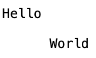
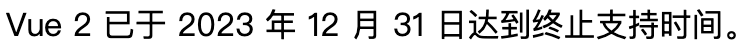

#  HTML 笔记


## 网页三要素

- 结构（HTML）
- 表现（CSS）
- 行为（JavaScript）


## 网页元素分类

- 块级元素（block），默认占据 100% 的宽度，独占一行，例如：`<div>`、`<p>` 等
- 行内元素（inline），默认和其它元素在同一行，不产生换行，例如：`<span>` 等


## 网页的基本结构

```html
<!DOCTYPE html>
<html lang="zh-CN">
  <head>
    <meta charset="utf-8">
    <title></title>
  </head>
  <body>
  </body>
</html>
```

**⚠️ 注意：** 

- HTML 语言忽略缩进和换行

- HTML 标签名对大小写不敏感
- 一般习惯使用小写


## 基本结构说明

对网页的基本结构中的各个标签进行说明


**文档类型**

```html
<!DOCTYPE html>
```

**作用：** `<!DOCTYPE>` 是用来告诉浏览器使用什么方式渲染页面

**⚠️ 注意：**

- `DOCTYPE` 一般习惯使用大写
- `DOCTYPE` 本质不是标签，像处理命令
- `html` 代指以 HTML5 的标准来解析当前页面


**`<html>` 标签**

```html
<html></html>
```

**⚠️ 注意：** 

- **一个网页只能有一个根元素**
- 除了 `<!DOCTYPE html>` 外其它标签都要放在 `<html>` 标签中


**`<head>` 标签**

```html
<!DOCTYPE html>
<html>
  <head>
    <title></title>
  </head>
</html>
```

**作用：** 它的内容不会出现在网页中，用于放置网页不可见的元信息，提供额外的渲染信息

**⚠️ 注意：** 

当网页中不包含 `<head>` 浏览器会自动创建一个

`<head>` 的子元素一般有以下七个：

- `<meta>`：设置网页的元数据
- `<link>`：引入外部样式表
- `<title>`：设置网页标题
- `<style>`：设置内嵌的样式表
- `<script>`：引入脚本
- `<noscript>`：浏览器不支持脚本时，要显示的内容
- `<base>`：设置网页内部相对 URL 的计算基准


**`<meta>` 标签**

```html
<head>
  <meta charset="utf-8">
  <meta name="viewport" content="width=device-width, initial-scale=1">
  <title></title>
</head>
```

**作用：** 用于设置网页的元数据，元数据是指描述数据的数据，HTML 网页本身也是数据

**⚠️ 注意：** `<meta>` 标签按约定放在 `<head>` 中所有子元素的最前面


**`<title>` 标签**

```html
<head>
  <title>网页标题</title>
</head>
```

**作用：** 用于设置网页的标题，对搜索引擎的排序有很大的影响，所以最好根据网页的主题设置标题

**⚠️ 注意：** `<title>` 标签中**只能放纯文本**，不能放置其它标签


**`<body>` 标签**

```html
<html>
  <head>
    <title>网页标题</title>
  </head>
  <body>
    <p>hello world</p>
  </body>
</html>
```

**作用：** `<body>` 标签中的内容是网页显示的页面


**注释**

```html
<!-- 我是一个注释 -->
```

**作用：** 注释内部的代码浏览器不会去解析，也不会去渲染


## 空格和换行处理


**标签内容的头部和尾部空格忽略不计**

```html
<p>  CodePencil  </p>
```

等价于

```html
<p>CodePencil</p>
```


**标签内容内部有多个连续空格会被合并成一个**

```html
<p>Hello      HTML</p>
```

等价于

```html
<p>Hello HTML</p>
```

**⚠️ 注意：** 标签内容中的换行符和回车符也会被替换成一个空格，**需要换行请使用 `<br />`**


## URL

URL 是 “统一资源定位符”（Uniform Resource Locator）首字母的缩写，也叫 “链接”


**URL 组成部分**

```
https://www.example.com:80/path/to/index.html?key1=value1&key2=value2#anchor
```

- 网络协议：上例中是 `https://`
- 主机名(域名)：上例中是 `www.example.com`
- 端口：上例中是 `80`，端口如果省略 HTTP 默认是 `80`，HTTPS 默认是 `443`，与域名间使用 `:` 分隔
- 路径：上例中是 `/path/to/index.html`，省略文件名默认情况是访问 `index.html`（取决于后台的配置），过去是实际地址，现在都是服务器模拟地址
- 查询参数：上例中是 `?key1=value1&key2=value2#anchor`，是键值对，以 `&` 分隔一组，与路径间用 `?` 分隔
- 锚点：上例中是 `#anchor`，页面跳转后会自动滚动到 `id` 为 `anchor` 元素所在的位置


**URL 字符**

合法的 URL 字符：

- 26 个英文字符（包含大写和小写）
- 数字
- 连词号（`-`）
- 句点（`.`）
- 下划线（`_`）

**⚠️ 注意：** 

- 还有 18 个 URL 保留字符，例如 `?`，**只能在给定位置出现，其他位置出现是非法的**
- 在 URL 中使用 URL 保留字符，**必须使用它们的转义形式**，转义规则为 `%+十六进制 ASCII 码` ，例如： `?` 转化为 `%3F`
- 既不是保留字符也不是合法字符的字符，在 URL 中浏览器会自动进行转义


**绝对 URL**

靠 URL 自身就可以定位资源，带有完整的网络协议、主机名、端口、路径

```
https://www.example.com:80/path/to/index.html
```


**相对 URL**

无法靠 URL 自身定位资源，必须结合当前网站的位置才能定位资源

- `.`  表示当前目录，例如：`./index.html`
- `..` 表示上一级目录，例如：`../index.html`

```
https://www.example.com/./index.html
```

等价于

```
https://www.example.com/index.html
```


**`<base>` 标签**

```html
<head>
  <base href="https://www.example.com/files/" target="_blank">
</head>
```

**作用：** 指定网页内部所有相对 URL 的计算基准

**⚠️ 注意：** 

- **整个网页只能有一个 `<base>` 标签**
- 至少要有 `href` 属性或 `target` 属性
- 只能放在 `<head>` 标签中
- 要改变某个链接的行为，只能使用绝对 URL 替换相对 URL


## 网页元素的属性

用于定制元素的行为


**属性格式**

```html
<html lang="en">
```

**⚠️ 注意：** 

- 标签内的属性都是 “键值对”
- 属性不区分大小写
- **建议属性值统一使用双引号**


**布尔属性值**

```html
<input type="text" required> 
```

上述代码中 `required` 是布尔属性值，可以省略属性值

等价于

```html
<input type="text" required="required"> 
```

**⚠️ 注意：** 布尔属性值只能有一个值，这个值一般和属性名相同


**全局属性**

指所有元素都可以使用的属性，下述属性所有元素都可以使用，有些属性对某些元素可能没有任何意义


**id**

```html
<p id="p1">你好</p>
```

**作用：** 指定标签的唯一标识符，在 `id` 前加 `#` 放在 URL 中可以作为锚点

**⚠️ 注意：** 同一个页面**不能有两个相同**的 `id` 属性


**class**

```html
<p class="className"></p>
```

**作用：** 用于给相同 `class` 值的标签进行分类


**title**

```html
<div title="我是title">
  <p>鼠标放在我身上会显示title</p>
</div>
```

**作用：** 为元素添加附加说明，大多数浏览器中鼠标悬浮在元素上会显示 `title` 的属性值的浮动提示


**tabindex**

```html
<p tabindex="0">我可以获得焦点</p>
```

**作用：** 控制按下 Tab 键时光标切换的顺序，这个属性的值是一个整数，有下列三种值：

- 负整数：该元素可以获得焦点（例如使用 JavaScript 中的 `focus()` 方法），但是不参与 Tab 键对网页的遍历，值通常是 `-1`
- `0`：该元素参 Tab 键对网页的遍历，顺序由浏览器指定，通常按照在网页中显示的顺序
- 正整数：网页元素按照从小到大的顺序（1、2、3、...），参与 Tab 键的遍历，如果值相同则按照在网页源码中的出现的顺序

**⚠️ 注意：** 

- `tabindex` 属性最好都设置为 `0`，按照自然顺序遍 历
- 只有无法获取焦点的元素才有必要设置 `tabindex` 属性，例如：`span`、`div` 等


**accesskey**

```html
<button accesskey="s">提交</button>
```

**作用：** 指定网页元素获得焦点的快捷键

**⚠️ 注意：** 

- 属性值必须是单个的可打印字符(可以在屏幕或打印中显示出来的字符)
- 必须配合功能键才能使用，Chrome 浏览器中在 Windows 和 Linux 系统中，是 `Alt + 字符键`，Mac 系统中是 `Ctrl + Alt + 字符键`
- 如果快捷键和系统快捷键冲突，这时不会生效


**style**

```html
<p style="color: red;">你好</p>
```

**作用：** 指定元素的 CSS 样式


**hidden**

```html
<p hidden>看不见我，看不见我</p>
```

**作用：** `hidden` 是布尔属性，表示元素跟当前网页无关，浏览器也不会渲染这个元素

**⚠️ 注意：** 如果 CSS 设置该元素可见，那么 `hidden` 属性无效


**lang**

```html
<p lang="en">hello</p>
<p lang="zh">你好</p>
```

**作用：** 指定元素使用的语言，常见的语言代码如下：

- zh：中文
- zh-Hans：简体中文
- zh-Hant：繁体中文
- en：英语
- en-US：美国英语
- en-GB：英国英语
- es：西班牙语
- fr：法语


**dir**

```html
<div dir="rtl">文本方向从右到左!</div>
```

**作用：** 指定元素中文本显示的方向，取值如下：

- `ltr`：从左到右，例如：中文、英语
- `rtl`：从右到左，例如：阿拉伯语
- `auto`：让浏览器根据内容来判断文本方向，仅在文本方向未知时推荐使用


**translate**

```html
<p>
  你好 <span translate="no">JavaScript<span>
</p>
```

**作用：** 告诉翻译软件不翻译该文本，取值如下：

- 空字符串或者 `yes`：表示内容要被翻译
- `no`：表示内容不需要被翻译

**⚠️ 注意：** 

- `translate` 属性只适用于文本元素
- 该属性是枚举属性，使用时最好带上值


**contenteditable**

```html
<p contenteditable="true">点我可以修改我</p>
```

**作用：** 指定允许用户修改元素的内容，默认情况元素的内容是不能编辑的，取值如下：

- `true` 或空字符串：内容可以编辑
- `false`：内容不可以编辑

**⚠️ 注意：** 该属性是枚举属性，使用时最好带上值


**spellcheck**

```html
<p contenteditable="true" spellcheck="true">
  英语单词 separate 容易写错成 seperate。
</p>
```

**作用：** 对允许用户修改的内容进行拼写检查，拼写错误的单词会显示红色波浪线，取值如下：

- `true`：打开拼写检查
- `false`：关闭拼写检查

**⚠️ 注意：** 

- 该属性需要和 ` contenteditable="true"` 一起使用，否则该属性无效

- 该属性值是枚举属性，使用时最好带上值
- 不使用该属性时，由浏览器自行决定是否拼写检查


**`data-` 属性**

```html
<a href="#" class="tooltip" data-tip="this is the tip!">我是链接</a>
```

**作用：** 用于在元素上放置自定义数据

**⚠️ 注意：** `data-` 属性只能通过 CSS 或 JavaScript 使用


**事件处理属性**

```html
<div onclick="alert('你好世界')">点我出现你好世界</div>
```

**作用：** 用于响应用户的操作，这些属性的值都是 JavaScript 代码，具体可以参考[事件处理属性列表](https://wangdoc.com/html/attribute#事件处理属性)


## 字符编码

浏览器必须知道字符编码才能正常显示网页的文字，通过以下方式获取字符编码

1. 一般来说从服务器发送 HTML 网页时，会通过 HTTP 头信息声明网页的编码方式，如下：

   ```
   Content-Type: text/html; charset=UTF-8
   ```

   - `text/html` 是文件类型，表示 HTML 网页
   - `charset=UTF-8` 是指定网页的字符编码方式为 `UTF-8`

2. 网页内部通过 `<meta>` 标签再次声明网页文字的编码方式

   ```html
   <meta charset="UTF-8">
   ```

**⚠️ 注意：**

- 如果 HTTP 头信息里的编码方式和网页内部的编码方式不一致，则**优先使用 HTTP 头信息里的编码方式**
- 如果 HTTP 头信息里没有编码方式则使用网页内部的编码方式
- 建议 HTTP 头信息里的编码方式和网页内部的编码方式始终保持一致


**数字表示法**

网页可以使用不同语言的编码方式，**最常用的是 UTF-8**，UTF-8 是 Unicode 字符集的一种表达方式，该字符集设计目标是包含世界上所有字符

每一个字符都有一个**码点（code point）**，例如：英文字母 `a` 的码点是十进制的 `97`（十六进制的 `61`）

由于以下原因不是每一个 Unicode 字符都可以在 HTML 中显示

- 不是每一个 Unicode 字符都可以被打印出来，例如：换行符
- 小于号 `<` 和大于号 `>` 用来定义 HTML 标签，需要用到这两个符号时必须避免它们被解释成标签
- Unicode 字符过多，没有一种输入法或者键盘可以输入所有的字符
- 网页不允许混合使用多种字符编码

HTML 为了解决上述问题允许使用 Unicode 码点表示字符，浏览器会自动将码点转换为相应的字符，具体表示如下：

- `&#N;` 十进制，`N` 表示码点
- `&#xN;` 十六进制，`N` 表示码点

```html
<p>&#97;</p>
```

等价于

```html
<p>a</p>
```

**⚠️ 注意：** HTML 标签本身不能使用码点表示，浏览器会当做文本内容显示


**实体表示法**

因为数字表示法难以记忆，为了方便使用，HTML 为一些特殊字符规定了容易记忆的名字

例如：空格：`&nbsp;`，具体可以参考[特殊字符实体表示列表](https://wangdoc.com/html/encode#字符的实体表示法)


## 网页语义结构


**`<header>` 标签**

```html
<!-- 整个网页的头部 -->
<header>
  <h1>公司名称</h1>
  <ul>
    <li><a href="/home">首页</a></li>
    <li><a href="/about">关于</a></li>
    <li><a href="/contact">联系</a></li>
  </ul>
  <form target="/search" >
    <input name="q" type="search" />
    <input type="submit" />
  </form>
</header>
```

```html
<!-- 文章头部 -->
<article>
  <header>
    <h2>文章标题</h2>
    <p>CodePencil，发表于 2025年1月17日</p>
  </header>
</article>
```

**作用：** 可以表示整个网页的头部，被称作 “页眉”，也可以表示一篇文章或者一个区块的头部，通常包含导航栏和搜索栏

**⚠️ 注意：**

- 一个页面可以包含多个 `<header>`，但是一个具体的场景中只能包含一个，例如：网页的页眉只能有一个
- `<header>` 中不能包含 `<header>` 或 `<footer>`


**`<footer>` 标签**

```html
<!-- 整个网页的底部 -->
<footer>
  <p>© 2025 xxx 公司</p>
</footer>
```

```html
<!-- 文章的底部 -->
<article>
  <header>
    <h1>文章标题</h1>
  </header>
  <footer>
    <p>>© 禁止转贴</p>
  </footer>
</article>
```

**作用：** 可以表示整个网页的尾部，被称作 “页尾”，也可以表示一篇文章或章节的尾部，通常包含版权信息或其它相关信息

**⚠️ 注意：** 

- 一个页面可以包含多个 `<footer>`，但是一个具体的场景中只能包含一个，例如：网页的页眉只能有一个
- `<footer>` 中不能包含 `<footer>` 或 `<header>`


**`<main>` 标签**

```html
<body>
  <header>页眉</header>
  <main>
    <article>文章</article>
  </main>
  <aside>侧边栏</aside>
  <footer>页尾</footer>
</body>
```

**作用：** 表示页面的主体内容

**⚠️ 注意：** 

- `<main>` 是顶层标签，不能放置 `<header>`、`<footer>`、`<article>`、`<aside>`、`<nav>` 等标签之中
- **一个页面只能有一个 `<main>` 标签**
- 功能性区块（比如搜索栏）不适合放入 `<main>` 标签中，除非当前页面是搜索页面


**`<article>` 标签**

```html
<article>
  <h2>文章标题</h2>
  <p>文章内容</p>
</article>
```

**作用：** 表示页面里面一段完整的内容，通常用来表示一篇文章或者一个论坛帖子，一个页面可以包含一个或者多个 `<article>` 标签


**`<aside>` 标签**

```html
<!-- 页面中使用 -->
<body>
  <main>主体内容</main>
  <aside>侧边栏</aside>
</body>
```

```html
<!-- 文章中使用 -->
<article>
  <h1>文章标题</h1>
  <p>第一段</p>
  <aside>
    <p>本段是文章的重点。</p>
  </aside>
</article>
```

**作用：** 用来放置与网页或者文章主要内容相关的部分

- 网页级别的 `<aside>` 可以当做侧边栏，但并不一定要在页面的侧边
- 文章级别的 `<aside>` 可以放置补充信息、评论或注释


**`<section>` 标签**

```html
<article>
  <h1>文章标题</h1>
  <section>
    <h2>第一章</h2>
    <p>...</p>
  </section>
  <section>
    <h2>第二章</h2>
    <p>...</p>
  </section>
</article>
```

**作用：** 表示一个主题区块的独立部分，在文章主题区块中表示一个章节，在幻灯片主题区块中表示一个幻灯片

**⚠️ 注意：** 一个页面不能只有一个 `<section>`


**`<nav>` 标签**

```html
<nav>
  <ol>
    <li><a href="item-a">商品 A</a></li>
    <li><a href="item-b">商品 B</a></li>
    <li>商品 C</li>
  </ol>
</nav>
```

**作用：** 用于放置页面或者文档的导航信息，`<nav>` 一般放在 `<header>` 里面，一个页面可以有多个 `<nav>` 标签，例如：一个用于页面导航，一个用于文章导航

**⚠️ 注意：** 不适合放入 `<footer>` 标签中


**`<h1>~<h6>` 标签**

```html
<body>
  <h1>JavaScript 语言介绍</h1>
    <h2>概述</h2>
    <h2>基本概念</h2>
      <h3>网页</h3>
      <h3>链接</h3>
    <h2>主要用法</h2>
</body>
```

**作用：** 表示文章的标题，按照等级一共分成六级，`<h1>` 是最高级别的标题，`<h6>` 是最低级别的标题，下一个标题是上一个标题的子标题

**⚠️ 注意：** 标题不应该越界级，例如：`<h1>` 标题下面写 `<h3>`，会导致文章失去清晰章节的结构


**`<hgroup>` 标签**

```html
<hgroup>
  <h1>Heading 1</h1>
  <h2>Subheading 1</h2>
  <h2>Subheading 2</h2>
</hgroup>
```

**作用：** 主标题如果带有副标题，可以使用 `<hgroup>` 将多级标题放入其中

**⚠️ 注意：** `<hgroup>` 标签中只能包含 `<h1>~<h6>` 标签


## 文本标签


**`<div>` 标签**

```html
<div>我是内容</div>
```

**类型：** 块级元素

**作用：** 表示通用目的的块级元素，没有任何语义，当需要一个块级容器但没有合适的标签时可以使用它

**⚠️ 注意：** 使用 `<div>` 标签应该是最后的措施，**优先使用语义标签**


**`<p>` 标签**

```html
<p>我是一个段落</p>
```

**类型：** 块级元素

**作用：** 表示文章的一个段落，相以段落显示的内容（图片、表单项等）都可以放入其中


**`<span>` 标签**

```html
<p>我是一段<span>重要</span>的文本</p>
```

**类型：** 行内元素

**作用：** 表示通用目的的行内元素，没有任何语义，通常用于对行内内容指定 CSS 样式


**`<br>` 标签**

```html
<p>Hello<br>World</p>
```


**作用：** 产生换行效果

**⚠️ 注意：** 块级元素之间的间隔不要使用 `<br>` 来产生，应当使用 CSS


**`<wbr>` 标签**

```html
<p>Hello<wbr>World</p>
```

**作用：** 与 `<br>` 标签类似，表示一个可选的换行，宽度足够时依旧一行显示，反之换行显示，主要用于防止浏览器对很长的单词不正确的换行，所以事先标明换行位置


**`<hr>` 标签**

```html
<p>第一个主题</p>
<hr>
<p>第二个主题</p>
```

**作用：** 表示水平线，在一篇文章中用于分隔不同的主题

**⚠️ 注意：** 该标签是历史遗留，尽量避免使用，分隔主题可以使用 `<section>` 标签，想要水平线可以使用 CSS


**`<pre>` 标签**

```html
<pre>Hello

   World</pre>
```



**类型：** 块级元素

**作用：** 浏览器会保留该标签内部的空格和换行，默认使用等宽字体显示


**`<strong>` 标签**

```html
<p>今天要<strong>学习HTML</strong></p>
```


**类型：** 行内元素

**作用：** 表示包含的内容具有很强的重要性，浏览器默认会加粗显示

**⚠️ 注意：** `<b>` 标签与 `<strong>` 类似，但是 `<b>` 标签缺乏语义，**推荐优先使用 `<strong>` 标签**


**`<em>` 标签**

```html
<p>我要<em>每天</em>进步一点点</p>
```


**类型：** 行内元素

**作用：** 表示强调，浏览器默认会倾斜显示

**⚠️ 注意：** 

- `<i>` 标签与 `<em>` 类似，但是 `<i>` 标签缺乏语义，**推荐优先使用 `<em>` 标签**
- 浏览器不能保证一定会倾斜，最好使用 CSS 指定切斜样式


**`<sub>` 标签**

```html
<p>水分子是 H<sub>2</sub>O</p>
```


**类型：** 行内元素

**作用：** 将内容变为下标


**`<sup>` 标签**

```html
<p>
  <var>a<sup>2</sup></var> + <var>b<sup>2</sup></var> = <var>c<sup>2</sup></var>
</p>
```


**类型：** 行内元素

**作用：** 将内容变为上标，`<var>` 标签表示代码或者数学公式中的变量


**`<u>` 标签**

```html
<p>是<em>CodePencil</em>不是<u>CodePnecil</u></p>
```


**类型：** 行内元素

**作用：** 对内容提供注释，提醒用户这里有问题，基本上用来表示拼写错误，浏览器默认以下划线显示

**⚠️ 注意：** `<a>` 标签默认也有一个下划线，容易让用户误以为 `<u>` 标签可点击，如果一定要使用，最好通过 CSS 修改 `<u>` 的默认样式


**`<s>` 标签**

```html
<p><s>原价：100元</s>优惠价：38元</p>
```


**类型：** 行内元素

**作用：** 为内容加上删除线


**`<blockquote>` 标签**

```html
<blockquote cite="https://quote.example.com">
  <p>耐心是生活的关键。</p>
</blockquote>
```


**类型：** 块级元素

**作用：** 引用他人的话，`cite` 属性的值是一个网址，表示引用来源，不会在网页上显示


**`<cite>` 标签**

```html
<blockquote cite="https://quote.example.com">
  <p>Patience is key in life.</p>
</blockquote>
<cite>-- Jared McCain</cite>
```


**类型：** 行内元素

**作用：** 表示引言出处或者作者，浏览器默认以斜体显示，`<cite>` 标签不一定要和 `<blockquote>` 标签一起使用，可以单独使用，例如下列代码

```html
<p>更多内容请参考<cite>维基百科</cite>。</p>
```


**`<q>` 标签**

```html
<p>
  Jared McCain:
  <q cite="https://quote.example.com">Patience is key in life.</q>
</p>
```


**类型：** 行内元素

**作用：** 与 `<blockquote>` 标签相同，但不会产生换行

**⚠️ 注意：** 大部分现代浏览器会为 `<q>` 标签内的文本添加引号，旧浏览器可能需要使用 CSS 添加引号


**`<code>` 标签**

```html
<code>
	console.log('你好，世界');
</code>
```


**类型：** 行内元素

**作用：** 显示计算机代码，浏览器会默认使用等宽字体显示，默认代码都是一行显示

如果要显示多行代码，`<code>` 标签必须放置 `<pre>` 标签中，以保留代码的换行以及空格

```html
<pre>
  <code> 
    let a = 1;
    console.log(a);
  </code>
</pre>
```


**`<kbd>` 标签**

```html
<p>
  在运行对话框中输入以下内容：<kbd>cmd</kbd>，然后单击“确定”按钮。
</p>
```


**类型：** 行内元素

**作用：** 表示用户的输入内容，浏览器默认使用等宽字体显示


**`<samp>` 标签**

```html
<p>
  如果使用没有定义的变量，浏览器会报错：
	<samp>Uncaught ReferenceError: foo is not defined</samp>。
</p>
```


**类型：** 行内元素

**作用：** 表示计算机程序输出的内容，浏览器默认使用等宽字体显示


**`<mark>` 标签**

```html
<p>
  全体目光向我看齐，我宣布个事情，<mark>我是个XX。</mark>
</p>
```


**类型：** 行内元素

**作用：** 表示突出显示的内容，Chrome 浏览器会默认以亮黄色为背景，突显显示该内容，`<mark>` 标签还可以用于搜索结果中，标记处匹配的关键词

**⚠️ 注意：** 不能为了高亮效果使用这个标签，不同浏览器的处理方式可能不同，最好使用 CSS 样式


**`<small>` 标签**

```html
<p>文章正文</p>
<p><small>以上内容使用创意共享许可证。</small></p>
```


**类型：** 行内元素

**作用：** 浏览器将它包含的内容以小一号的字号显示，通常用于文章附带的版权信息或者法律信息


**`<time>` 标签**

```html
<p>
  Vue 2 已于 <time datetime="2023-12-31">2023 年 12 月 31 日</time>达到终止支持时间。
</p>
```



**类型：** 行内元素

**作用：** 为与时间相关的内容提供机器可读的格式，方便搜索引擎抓取，可以有以下多种格式：

- 有效年份：`2011`
- 有效月份：`2011-11`
- 有效日期：`2011-11-18`
- 无年份的日期：`11-18`
- 年度的第几周：`2011-W47`
- 有效时间：`14:54`、`14:54:39`、`14:54:39.929`
- 日期和时间：`2011-11-18T14:54:39.929`


**`<data>` 标签**

```html
<p>水果价格：</p>
<ul>
  <li><data value="30">苹果</data></li>
  <li><data value="80">香蕉</data></li>
  <li><data value="40">橘子</data></li>
</ul>
```


**类型：** 行内元素

**作用：** 与 `<time>` 标签类似，提供给机器可读的内容，但是用于非时间的场合，`value` 属性用于指定内容对应的数据


**`<address>` 标签**

```html
<p>联系方式：</p>
<address>
  <a href="mailto:zhangsan@example.com">zhangsan@example.com</a><br />
  <a href="tel:+14155550132">+1 (415) 555‑0132</a>
</address>
```


**类型：** 块级元素

**作用：** 表示某个组织或某个人的联系方式

**⚠️ 注意：** 

- 不能有非联系信息

- 不能嵌套使用，以及不能有其它语义标签
- 通常放在 `<footer>` 标签中


**`<abbr>` 标签**

```html
<abbr title="HyperText Markup Language">HTML</abbr>
```


**类型：** 行内元素

**作用：** 表示标签内容是一个缩写，`title` 属性是给出完整形式，鼠标悬停上方会完整显示出来

**⚠️ 注意：** 部分浏览器会在内容下方添加虚线下划线


**`<ins>` 标签**

```html
<ins cite="./why.html" datetime="2025-01"><p>会议定于5月9日举行。</p></ins>
```


**类型：** 行内元素

**作用：** 表示原始文档添加的内容，用于展示文档的增加操作

- `cite` 该属性值是一个 URL，表示该网址可以解释本次添加操作
- `datetime` 该属性表示添加的时间


**`<del>` 标签**

```html
<del cite="./why.html" datetime="2025-01"><p>会议定于5月8日举行。</p></del>
```


**类型：** 行内元素

**作用：** 表示原始文档删除的内容，用于展示文档的删除操作

- `cite` 该属性值是一个 URL，表示该网址可以解释本次删除操作
- `datetime` 该属性表示删除的时间


**`<def>` 标签**

```html
<p>
  通过 TCP/IP 协议连接的全球性计算机网络，叫做 <dfn>Internet</dfn>。
</p>
```

为了脚本操作方便，也可以直接用 `title` 属性将定义写入 `<dfn>` 标签，如下

```html
<p>
  通过 TCP/IP 协议连接的全球性计算机网络，叫做
  <dfn title="全球性计算机网络">Internet</dfn>。
</p>
```


**类型：** 行内元素

**作用：** 表示内容是一个术语，本段是用于解释它的定义

术语本身是个缩写，可以 `<dfn>` 和 `<abbr>` 结合使用

```html
<p>
  <dfn><abbr title="acquired immune deficiency syndrome">AIDS</abbr></dfn>
  的全称是获得性免疫缺陷综合征。
</p>
```


**`<ruby>` 标签**

```html
<ruby>
  汉<rp>(</rp><rt>han</rt><rp>)</rp> 字<rp>(</rp><rt>zi</rt><rp>)</rp>
</ruby>
```


**类型：** 行内元素

**作用：** 表示文字的语音注释，主要用于东亚文字，例如：汉语拼音和日语的片假名

- `<rp>` 标签用于为不支持语音注释的浏览器显示该标签中的内容，对于支持的浏览器则不显示
- `<rt>` 标签用于放置语音注释

**⚠️ 注意：** 必须把文字和语音注释都放入 `<ruby>` 中


**`<bdo>` 标签**

```html
<p>床前明月光，<bdo dir="rtl">霜上地是疑</bdo>。</p>
```


**类型：** 行内元素

**作用：** 用于控制部分文字的显示方向，通过 `dir` 属性指定文字的方向，有以下两个值：

- `ltr`：文本从左往右显示
- `rtl`：文本从右往左显示


**`<bdi>` 标签**

**类型：** 行内元素

**作用：** 用于不确定文字方向的情况，告诉浏览器自己决定


## 列表标签

主要分为无序列表和有序列表


**`<ol>` 标签**

```html
<ol>
  <li>列表项 A</li>
  <li>列表项 B</li>
  <li>列表项 C</li>
</ol>
```


**类型：** 块级元素

**作用：** 表示有序列表，一般用于列表项的顺序有意义时，内部可以嵌套使用 `<ol>` 或者 `<ul>`

```html
<ol>
  <li>列表项 A</li>
  <li>列表项 B
    <ol>
      <li>列表项 B1</li>
      <li>列表项 B2</li>
      <li>列表项 B3</li>
    </ol>
  </li>
  <li>列表项 C</li>
</ol>
```


该标签有以下属性：

- `reversed`：用于产生倒序的的数字列表

  ```html
  <ol reversed>
    <li>列表项 A</li>
    <li>列表项 B</li>
    <li>列表项 C</li>
  </ol>
  ```

  

- `start`：该属性的值是一个整数，表示数字列表的起始编号

  ```html
  <ol start="4">
    <li>列表项 A</li>
    <li>列表项 B</li>
    <li>列表项 C</li>
  </ol>
  ```

  

- `type`：指定数字编号的样式，目前支持以下的值：

  - `a`：小写字母
  - `A`：大写字母
  - `i`：小写罗马数字
  - `I`：大写罗马数字
  - `1`：整数（默认值）

  ```html
  <ol type="I">
    <li>列表项 A</li>
    <li>列表项 B</li>
    <li>列表项 C</li>
  </ol>
  ```

  

  **⚠️ 注意：** 即使 `type` 属性指定的是非数字的值，**但 `start` 属性指定时依旧使用整数**

  ```html
  <ol type="I" start="3">
    <li>列表项 A</li>
    <li>列表项 B</li>
    <li>列表项 C</li>
  </ol>
  ```

  

  

**`<ul>` 标签**

```html
<ul>
  <li>列表项 A</li>
  <li>列表项 B</li>
  <li>列表项 C</li>
</ul>
```


**类型：** 块级元素

**作用：** 表示无序列表，列表顺序无意义时使用，可以嵌套 `<ul>` 或者 `<ol>`


**`<li>` 标签**

```html
<ol>
  <li>列表项 A</li>
  <li value="4">列表项 B</li>
  <li>列表项 C</li>
</ol>
```


**类型：** 块级元素

**作用：** 表示列表项，用在 `<ol>` 或者 `<ul>` 中，在 `<ol>` 有序列表中，`<li>` 有一个 `value` 属性，用于定义当前项的编号，后面的列表项会从这个编号开始


**`<dl>` 标签**

```html
<dl>
  <dt>CPU</dt>
  <dd>中央处理器</dd>

  <dt>Memory</dt>
  <dd>内存</dd>

  <dt>Hard Disk</dt>
  <dd>硬盘</dd>
</dl>
```


**类型：** 块级元素

**作用：** `<dl>` 用来定义词汇表，`<dt>` 用来定义术语名，`<dd>` 用来定义术语解释

`<dd>` 和 `<dt>` 都是块级元素，一个 `<dt>` 可以对应一个或者多个 `<dd>`


## 图像标签


**`` 标签**

```html

```


**类型：** 行内元素

**作用：** 用于插入图片，`src` 属性用于指定图片的网址

图像默认以原始大小显示，如果图片很大与文字处于同一行，图片会把当前行的行高撑高，图片和文字底部对齐

```html
<p>
  
  我是文字
</p>
```


`` 标签有以下属性：

- `alt` 属性：用于图片无法正常显示时的提示文本

  ```html
  
  ```

  

- `width` 和 `height` 属性：网页图片默认以图片原始大小插入，通过 `width` 和 `height` 可以指定图片的宽度和高度，单位可以是百分比或者像素

  ```html
  
  ```

  

  **⚠️ 注意：** 

  - 一旦设置了这两个属性，不管图片是否加载成功，浏览器都会在网页中为图片预留出这个大小的空间，图片大小可以使用 CSS 控制，一般情况不建议使用这两个属性
  - 这两个属性如果只设置其中一个，浏览器会根据图片原始大小比例自动设置宽度或高度

- `referrerpolicy` 属性：`` 标签加载图片会发送 HTTP 请求，默认会带有 `refer` 请求头信息，该属性可以对这个行为进行设置

- `crossorigin` 属性：当网页和图片属于不同的网站时，网页加载图片会导致跨域请求，如果对方服务器要求跨源认证，可以使用该属性进行告诉浏览器是否采用跨域形式下载图片，打开了该属性，就会在 HTTP 请求头中添加 `origin` 字段，给出请求发出的域名，`crossorigin` 属性可以设置以下两个值：

  - `anonymous`：跨域请求不带有用户凭证（通常是 Cookie）
  - `use-credentials`：跨域请求带有用户凭证

  ```html
  
  ```

  等价于

  ```html
  
  ```


- `loading` 属性：控制图片的加载方式，浏览器的默认行为是只要解析到 `` 标签就立马下载图片，该属性有以下三个取值：

  - `auto`：浏览器默认行为，等同于不使用 `loading` 属性
  - `lazy`：启用懒加载，只有图片进入视口可见区域时才会加载，节省流量带宽
  - `eager`：立即加载资源，无论图片在哪个位置

  ```html
  
  ```

  **⚠️ 注意：** 图片的懒加载可能会导致页面布局重新排列，使用 `loading` 属性时最好指定图片的宽度和高度


**`<figure>` 和 `<figcation>` 标签**

```html
<figure>
  
  <figcaption>CodePencil的头像</figcaption>
</figure>
```


**类型：** 块级元素

**作用：** `<figure>` 作为一个图像区块，用于将图片和相关信息封装在一起，`<figcation>` 标签是它的可选子元素，表示图片的文本描述，通常用于放置标题，可以有多个，也是块级元素

`<figure>` 除了图像，还可以封装引言、代码、诗歌等，等同于一个将主体和相关信息封装在一起的语义封装容器

```html
<figure>
  <figcaption>JavaScript 代码示例</figcaption>
  <p><code>console.log('你好，世界');</code></p>
</figure>
```


**响应式图像**

为什么有响应式图像的需求？

因为通常直接使用 `` 标签插入图片存在以下三个问题：

- 桌面端显示的图片尺寸和体积对移动端来说过大，加载慢（体积问题）
- 桌面端显示的图片在移动端上显示有些模糊（像素密度问题）
- 桌面端显示的图片放在移动端上容易缺失重点， 部分细节无法看清（视觉风格问题）


如何解决上面的三个问题？

HTML 提供了一套完整的解决方案

首先 `` 标签引入了 `srcset` 属性，该属性可以指定多张图片来适应不同像素密度的屏幕，值是以逗号分隔的字符串，当没有适合的像素比或者不支持 `srcset` 属性时会使用 `src` 属性中的图片

**格式：** 图像 URL + 空格 + 像素密度倍数 + 字母 `x`，`1x` 表示单倍像素比，可以省略

```html

```

- 在1.25 倍像素比下显示 480 宽度的图片，浏览器选择最接近的像素比

  

- 在 2 倍像素比下显示 640 宽度的图片

  

上述步骤解决了像素问题

如何解决图片尺寸和体积以及视觉风格的问题

第一步：使用 `srcset` 属性列出所有可用的图像，该属性的值是以逗号分隔的字符串

**格式：** 图像 URL + 空格 + 宽度描述符（图像原始宽度 + `w`）

```html

```

第二步：使用 `sizes` 属性列出不同设备的图像显示宽度，该属性的值是以逗号分隔的字符串

```html

```

屏幕宽度为 320px 时

当像素比为 1 时，执行 `(max-width: 320px) 320px` 返回 320px 并与像素比相乘得到320px，会加载 320px 的图片

但当像素比为 2 时，返回的 320px 与 像素比 2 相乘得到 640px，会加载 640px 的图片

屏幕宽度为 1000px 并且像素比为 1 时，会加载最后一档的 640px，与像素比相乘得到 640px 的图片

**⚠️ 注意：** `sizes` 属性必须和 `srcset` 属性搭配使用，单独使用 `sizes` 属性无效，如果省略 `sizes` 属性单独使用 `srcset` 属性，浏览器根据实际图像宽度显示


**`<picture>` 标签**

```html
<picture>
  <source media="(max-width: 500px)"
          srcset="https://dummyimage.com/500, https://dummyimage.com/1000 2x">
  <source media="(max-width: 501px)"
          srcset="https://dummyimage.com/501, https://dummyimage.com/1002 2x">
  
</picture>
```


**类型：** 行内元素

**作用：** `` 标签的 `srcset` 属性解决了像素密度的问题，`sizes` 属性解决了图片尺寸与屏幕大小适配的问题，要同时解决像素密度和屏幕大小适配问题需要使用 `<picture>` 标签，内部的标签有 `<source>` 和 ``

`<source>` 标签有以下属性：

- `media` 属性：用于给出媒体查询表达式，`sizes` 属性依旧可以用，但因为有了该属性就不用了
- `srcset` 属性：与 `` 的 `srcset` 属性相同，**可以同时指定1倍图和2倍图**

按照 `<source>` 标签的顺序来判断当前设备是否满足媒体查询条件，满足就加载对应图片，如果都不满足或者不支持 `<pircture>` 标签则加载最后的 `` 标签

`<picture>` 还可以用来加载不同格式的图像

```html
<picture>
  <source type="image/svg+xml" srcset="logo.xml">
  <source type="image/webp" srcset="logo.webp"> 
  
</picture>
```

`type` 属性用于填写图像文件的 MIME 类型，`srcset` 是对应的图像 URL，按 `<source>` 标签顺序依次判断浏览器是否支持，如果支持则加载对应格式的图片，如果都不支持则使用最后的 `` 标签


## `<a>` 标签

```html
<a href="https://github.com">Github</a>
```

**类型：** 行内元素

**作用：** 表示一个可以跳转的链接，标签内部可以放置图片、元素、文本等

有以下属性：

- `href` 属性：链接指向的网址，值可以是 URL 或者锚点

  ```html
  <a href="#demo">我是锚点</a>
  ```

  锚点点击会滚动到当前页面锚点所在的位置

- `hreflang` 属性：告诉搜索引擎链接指向网址所用的语言，没有实际功能

  ```html
  <a href="https://github.com" hreflang="en">Github</a>
  ```

  `hreflang="en"` 属性表明链接指向的网址的语言是英语

  某个资源有多个语言版本，可以将 `hreflang` 设为 `x-default`，表示哪一个版本是默认语言

  ```html
  <a href="https://v2.vuejs.org/index.html" hreflang="en">English Vue</a>
  <a href="https://v2.cn.vuejs.org" hreflang="x-default">Chinese Vue</a>
  ```

- `title` 属性：鼠标移动到链接上时提示的文字

  ```html
  <a href="https://github.com" title="你好，Github">Github</a>
  ```

  

- `target` 属性：用于指定链接的打开方式

  ```html
  <a href="https://github.com" target="_blank">Github</a>
  ```

  有以下几个值：

  - `_self`：当前窗口打开，默认值
  - `_blank`：新窗口打开
  - `_parent`：上层窗口打开，通常用于父窗口打开子窗口，或者 `<iframe>` 里的链接，如果当前窗口没有父窗口，这个值等价于 `_self`
  - `_top`：顶层窗口打开，如果当前窗口就是顶层窗口，这个值等价于 `_self`
  - 窗口名，例如：`target="test"`，如果 test 窗口已经打开则取代里面的网页显示，反之创建一个名为 `test` 的窗口并打开页面

  **⚠️ 注意：** 使用 `target` 属性时最好配合 `rel="noreferrer"` 一起使用，可以避免请求头里携带当前网址，避免安全风险

-  `rel` 属性：用于说明链接和当前文档之间的关系

  ```html
  <a href="https://github.com/wjw020206" rel="author">CodePencil</a>
  ```

  具体属性值可以参考[rel属性值列表](https://wangdoc.com/html/a#rel)

- `referrerpolicy` 属性：用于精确设置点击链接时发送 HTTP 头信息的 `Referer` 字段的行为，具体属性值可以参考[referrerPolicy属性值列表](https://developer.mozilla.org/zh-CN/docs/Web/API/HTMLAnchorElement/referrerPolicy#%E5%80%BC)

- `ping` 属性：用于跟踪用户的行为，该属性的值是一个网址的 URL，用户点击时会向这个网址发送一个 POST 请求（包含点击的行为发生的页面的链接以及链接所指向页面的链接），FireFox 浏览器不支持该属性，无法发送任何自定义的数据，不推荐使用

- `type` 属性：给出网址的 MIME 类型，没有实际功能

  ```html
  <a href="avatar.jpg" type="image/jpeg">头像图片</a>
  ```

- `download` 属性：表示当前链接用于下载而不是跳转到另一个 URL

  ```html
  <a href="avatar.jpg" download>下载头像图片</a>
  ```

  如果 `download` 属性设置了值，例如：`download="demo.jpg"`，下载的文件名变为 `demo.jpg`，如果服务器的 HTTP 响应头信息里设置的 `Content-Disposition` 与 `download` 属性里设置的文件名不一致，按照 `Content-Disposition` 来

  有些地址是数据地址，不是真实的网址，例如下述代码：

  ```html
  <a href="data:,Hello%2C%20World!" download="hello.txt">点击下载</a>
  ```

  这时可以使用 `download` 属性指定文件名，上述 `hello.txt` 文件点击下载后文本内容就是 `Hello, World!`

  **⚠️ 注意：** 

  - `download` 属性只有链接与网址同源才能下载
  - 在 Chrome 浏览器中只能使用 HTTPS 协议的链接才能下载


**邮箱链接**

链接地址指向一个邮箱，使用 `mailto` 协议，点击链接浏览器会打开默认的邮件程序

```html
<a href="mailto:contact@example.com">联系我们</a>
```

除了邮箱地址，还可以通过 URL 参数的形式指定邮件的几个要素，具体可以参考[邮箱要素列表](https://wangdoc.com/html/a#%E9%82%AE%E4%BB%B6%E9%93%BE%E6%8E%A5)

也可以不指定邮箱地址，让用户自己在邮箱程序中选择转发的联系人

```html
<a href="mailto:">转发</a>
```


**电话链接**

链接地址指向一个电话号码，使用 `tel` 协议，在手机点击链接会唤起拨号界面，可以直接拨打指定号码

```html
<a href="tel:13412345678">13412345678</a>
```


## `<link>` 标签

**作用：** 用于当前网页与外部资源联系起来，通常放在 `<head>` 标签中，通常用来做以下几件事：

- 加载 CSS 样式表

  ```html
  <link rel="stylesheet" type="text/css" href="theme.css">
  ```

- 加载 favicon 图标文件

  ```html
  <link rel="icon" href="/favicon.ico" type="image/x-icon">
  ```

- 在手机上访问时，网站通常需要提供不同分辨率的图标文件

  ```html
  <link rel="apple-touch-icon-precomposed" sizes="114x114" href="favicon114.png">
  <link rel="apple-touch-icon-precomposed" sizes="72x72" href="favicon72.png">
  ```

  上述代码为苹果手机指定不同分辨率的图标文件

- 提供文档的相关链接，例如文档的 RSS 地址

  ```html
  <link rel="alternate" type="application/atom+xml" href="/blog/news/atom">
  ```

有以下常用的属性：

- `rel` 属性：**是 `<link>` 标签必须的属性**，当做对 `href` 属性资源链接的说明，取值可以参考[rel 属性列表](https://wangdoc.com/html/link#rel-属性)

- `hreflang` 属性：表示 `href` 属性所链接的资源使用的语言，用法与 `<a>` 标签的 `hreflang` 属性相同

  ```html
  <link href="https://example.com" rel="alternate" hreflang="x-default">
  <link href="https://example.com/de" rel="alternate" hreflang="de">
  ```


**资源的预加载**

**作用：** 浏览器预先下载资源，缓存起来，**等到需要使用的时候不需要下载立即就可以用**

主要有以下五种类型：

- `preload`：告诉浏览器尽快下载并缓存资源，**优先级高，浏览器一定会下载，下载后不会对资源执行任何操作，只作为缓存**

  ```html
  <link rel="preload" href="image.png" as="image">
  ```

  **优点：**

  - 允许指定预加载资源的类型，通过 `as` 属性指定资源类型

    ```html
    <link rel="preload" href="style.css" as="style">
    <link rel="preload" href="main.js" as="script">
    ```

    `as` 属性的值可以参考[as属性值列表](https://developer.mozilla.org/zh-CN/docs/Web/HTML/Element/link#as)

    **⚠️ 注意：** 

    - 如果 `as` 属性指定这些值以外或者浏览器不认识的值，浏览器会以低优先级下载
    - 当设置了 `rel="preload"` 后，`as` 属性必须要有

    还可以指定 `type` 属性，进一步明确 `MIME` 类型

    ```html
    <link rel="preload" href="demo.mp4" as="video" type="video/mp4">
    ```

  - 允许配置 `onload` 事件回调

    ```html
    <link rel="preload" as="style" href="style.css" onload="this.rel='stylesheet'">
    ```

    上述代码中，`onload` 指定的回调函数会在 style.css 下载完成后立即插入页面

- `prefetch`：预下载资源作为缓存用于后续的页面，**优先级较低，浏览器不一定会下载**，例如：网速很慢时

  ```html
  <link rel="prefetch" href="https://www.example.com/">
  ```

- `preconnect`：要求浏览器提前与某个域名建立 TCP 连接，适用于很快就要请求该域名的情况

  ```html
  <link rel="preconnect" href="https://www.example.com/">
  ```

- `dns-prefetch`：要求浏览器提前对某个域名进行 DNS 解析

  ```html
  <link rel="dns-prefetch" href="https://example.com/">
  ```

- `prerender`：要求浏览器加载某个页面时，提前渲染它，例如：当用户点击指向该页面的链接时，会立即呈现页面

  ```html
  <link rel="prerender" href="https://example.com/">
  ```


**media 属性**

用于设置外部资源生效的媒体条件

```html
<link href="print.css" rel="stylesheet" media="print">
<link href="mobile.css" rel="stylesheet" media="screen and (max-width: 600px)">
```

上述代码，打印时加载 print.css 文件，当屏幕宽度小于等于 600px 时，才会加载 mobile.css 文件


**其它属性**

具体可以参考[其他属性列表](https://wangdoc.com/html/link#其他属性)


## `<script>` 标签

```html
<script>
  console.log('Hello World');
</script>
```

**作用：** 用于加载脚本代码

有以下几个属性：

- `src` 属性：用于加载外部脚本代码

  ```html
  <script src="main.js"></script>
  ```

- `type` 属性：用于设置脚本的类型，默认值是 `text/javascript`，可以省略，下述是完整写法

  ```html
  <script type="text/javascript" src="main.js"></script>
  ```

  `type` 属性可以设置为 `module`，表示是一个 ES6 模块，不是传统脚本

  ```html
  <script type="module" src="main.js"></script>
  ```

  对于不支持 ES6 模块的浏览器，可以设置为 `nomodule` 属性兼容老的浏览器，下述代码在不支持 ES6 模块的浏览器中会加载 fallback.js 而不会加载 main.js，反之只会加载 main.js

  ```html
  <script type="module" src="main.js"></script>
  <script nomodule src="fallback.js"></script>
  ```

- `async` 属性：指定 JavaScript 代码为异步代码，加载的时候不会阻塞页面，JavaScript 代码默认是同步执行

- `defer` 属性：指定 JavaScript 代码不会立即执行，在页面解析完成之后才执行

- `crossorigin` 属性：采用跨域的方式加载外部脚本，在 HTTP 请求头中会添加 `origin` 字段

- `integrity` 属性：给出外部脚本的哈希值，只有哈希值相同才会执行脚本，防止脚本被篡改

- `nonce` 属性：一个密码随机数，由服务器在 HTTP 头信息里给出，每次加载脚本都不一样，浏览器会检查是否带有正确的 `nonce`，如果没有则不会执行代码

- `referrerpolicy` 属性：配置 HTTP 请求的 `Referer` 字段处理方法


## `<noscript>` 标签

```html
<noscript>
  您的浏览器不能执行 JavaScript，页面无法正常显示。
</noscript>
```

**作用：** 用于当浏览器不支持或者关闭 JavaScript 时，所要显示的内容


