# JavaScript 笔记


## 简介

JavaScript 写出来的程序被称为**脚本**，可以直接运行在 HTML 网页中，在页面加载的时候会自动执行。

脚本**以纯文本的形式运行，不需要提前编译即可运行**。

JavaScript 与 Java 完全不同，有自己的语言规范 **ECMAScript**。

JavaScript 不仅可以在浏览器中执行，也可以在服务端执行，可以在搭载任意 **JavaScript 引擎**的设备中执行。

浏览器中嵌入了 JavaScript 引擎，也被称作 **“JavaScript 虚拟机”**，不同的引擎有不同的代号：

- **V8：** Chrome、Opera 和 Edge 中的 JavaScript 引擎
- **SpiderMonkey：** Firefox 中的 JavaScript 引擎
- **Chakra：** IE 中的 JavaScript 引擎
- **JavaScriptCore、SquirrelFish、Nitro：** 在 Safari 中并行使用的 JavaScript 引擎

JavaScript 引擎的工作步骤：

1. 读取脚本

2. 将脚本转化（“编译”）为机器语言

3. 运行机器语言代码

引擎会对每个步骤进行优化，在运行时监视脚本，分析获得的信息进一步优化机器语言代码。

JavaScript 的能力取决于它的运行环境，在浏览器中无法访问 CPU 和 内存，但在 Node.js 中可以读取、写入任意文件，执行网络请求等函数。

JavaScript 与其它编程语言主要不同之处：

- **与 HTML、CSS 完全集成**
- **简单的事，简单地完成**
- **被所有的主流浏览器支持，并且默认开启**

有很多其它语言可以编译为 JavaScript，提供更多的功能，这些语言有：

- [CoffeeScript](https://coffeescript.org/)：JavaScript 的一种语法糖，可以编写更清晰简洁的代码
- [TypeScript](https://www.typescriptlang.org/)：添加 “严格的数据类型” 以简化开发，更好地支持复杂系统的开发，由微软开发
- [Flow](https://flow.org/)：与 TypeScript 类似，不过是以另外一种方式实现，由 Facebook 开发。
- [Dart](https://www.dartlang.org/)：一门独立的语言，有自己的引擎，该引擎在非浏览器环境中运行（例如手机应用），它也可以被编译成 JavaScript，由 Google 开发
- [Brython](https://brython.info/)：Python 到 JavaScript 的转译器
- [Kotlin](https://kotlinlang.org/docs/reference/js-overview.html)：编写出的程序可以在浏览器和 Node 环境中运行


##  手册与规范

**规范**

- **规范草案：** https://tc39.es/ecma262/
- **即将纳入规范的新特性：** https://github.com/tc39/proposals

**手册**

- **MDN：** https://developer.mozilla.org/zh-CN/docs/Web/JavaScript/Reference

更加推荐使用搜索引擎输入 `MDN [关键字]` 来查询。

**兼容性表**

- **查看功能的支持表：** [https://caniuse.com](https://caniuse.com/) 
- **列有语言功能以及引擎是否支持这些功能的表格：** https://compat-table.github.io/compat-table/


## 代码编辑器

代码编辑器主要分为：IDE（集成开发环境）和轻量编辑器。


**IDE**

IDE 编辑器具有强大功能，是一个完整的 “开发环境”，通常来说有以下两个 IDE 推荐使用：

- [Visual Studio Code](https://code.visualstudio.com/)（跨平台，免费）
- [WebStorm](https://www.jetbrains.com/webstorm/)（跨平台，收费，目前对个人使用免费）


**轻量编辑器**

虽然没有 IDE 那么强大的功能，但是启动速度快，使用简单，主要用来快速打开和编辑文件。

轻量编辑器也可以通过安装各种插件来实现 IDE 的语法分析和代码补全功能，所以 “轻量编辑器” 和 IDE 也没有严格的界限。

推荐的轻量编辑器：

- [Sublime Text](http://www.sublimetext.com/)（跨平台，共享软件）
- [Vim](http://www.vim.org/)
- [Emacs](https://www.gnu.org/software/emacs/)

**代码编辑器没有最好的，取决于个人的习惯和喜好。**


## 开发者控制台

控制台可以用来查看错误、执行命令、检查变量，**推荐使用 Chrome 或 Firefox 进行开发**，因为它们有最好的开发者工具。

大多浏览器都是通过 `F12` 来打开开发者工具。

**Chrome 直接打开控制台快捷键**

- Mac：`Command + Option + J` 或者 `Command + Option + I`
- Windows：`Ctrl + Shift + J` 或者 `Ctrl + Shift + I`

**Firefox 直接打开控制台快捷键**

- Mac：`Command + Option + K`
- Windows：`Ctrl + Shift + K`

**Safari 直接打开控制台快捷键**

- Mac：`Command + Option + C`

**⚠️ 注意：** Safari 需要**先提前在设置中开启“网页开发者功能”** ，“设置” -> “高级” -> “显示网页开发者功能”。


在控制台中 `>` 标志处表示命令行，可以输入 JavaScript 命令，按下 `Enter` 执行，如果需要输入多行代码则使用 `Shift + Enter` 来进行换行。

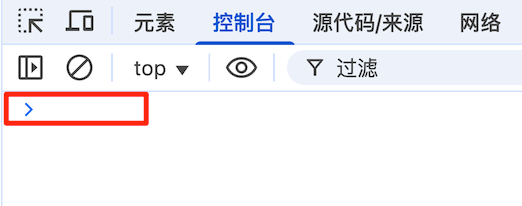


## script 标签

`<script>` 标签可以将 JavaScript 程序插入到 HTML 文档的任意位置。

```html
<!DOCTYPE HTML>
<html>
<body>
  <p>script 标签之前...</p>
  <script>
    alert('Hello, world!');
  </script>
  <p>...script 标签之后</p>
</body>
</html>
```

当浏览器遇到了 `<script>` 标签，内部代码会自动运行。

`<script>` 标签有以下几个特性（attribute）：

- **`type`：** 在过去需要指定为 `type="text/javascript"`，现在不再需要，现代 HTML 标准已经完全改变了此特性的含义，用于指定 JavaScript 模块 `type="module"`，**`type` 特性是可选的**

- **`language`：** 在过去用于指定脚本使用的语言，现在没有任何意义，语言默认是 JavaScript，**不需要再使用它**

- **`src`：** 用于引入外部 JavaScript 代码

  ```html
  <script src="/path/to/script.js"></script>
  ```

  可以是相对路径，也可以是绝对路径引入。

  如果要引入多个脚本，需要使用多个标签。

  ```html
  <script src="/js/script1.js"></script>
  <script src="/js/script2.js"></script>
  ...
  ```

  **⚠️ 注意：** 

  - 只有最简单的脚本才嵌入到 HTML 中。**更复杂的脚本推荐存放在单独的文件中**，使用独立文件的好处是浏览器会下载它，并保存在浏览器的缓存中，之后再访问该文件就是从缓存中获取，而不是下载，可以节省流量，使页面加载更快。

  - **如果设置了** `src` **特性，**`<script>` **标签的内容将会被忽略**

    ```html
    <script src="file.js">
      alert(1); // 此内容会被忽略，因为设定了 src
    </script>
    ```

    如果要上述代码正常工作，可以将它们分成两个标签。

    ```html
    <script src="file.js"></script>
    <script>
      alert(1);
    </script>
    ```

    

**脚本前后的注释**

```html
<script type="text/javascript"><!--
    ...
//--></script>
```

这些注释是用于不支持 `<script>` 标签的古老的浏览器隐藏 JavaScript 代码的，**现代 JavaScript 已经不这样使用了**。


## 代码结构


**语句**

语句是执行行为（action）的语法结构和命令，例如：`alert('Hello, world!');` 就是用来显示消息的语句。

可以在代码中编写任意数量的语句，语句之间可以使用分号进行分割。

```js
alert('Hello'); alert('World');
```

通常每个语句独占一行，用来提高语句的可读性。

```js
alert('Hello');
alert('World');
```


**分号**

当存在换行符（line break）时，大多数情况下可以省略分号。

```js
alert('Hello')
alert('World')
```

这时 JavaScript 会将换行符理解为 “隐式” 的分号，这也被称为**自动分号插入**。

并不是所有换行符都会理解为分号

```js
alert(3 +
1
+ 2);
```

代码输出结果是 `6`，这里 JavaScript 没有插入分号，因为如果插入分号，一行以 `+` 号结尾，就不是一个 “完整的表达式”。


**存在 JavaScript 无法确定是否真的需要自动插入分号的情况**

```js
alert('Hello');

[1, 2].forEach(alert);
```

这段代码在有分号的时候是先显示 `Hello`，然后显示 `1`，再然后是 `2`。

如果不加分号是这样的

```js
alert('Hello')

[1, 2].forEach(alert)
```

输出结果为先显示 `Hello`，后面不会再有数字出现，然后控制台出现报错信息。

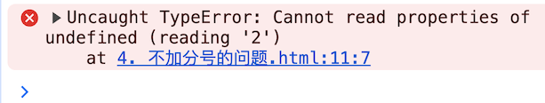

上述代码会被 JavaScript 理解为

```js
alert('Hello')[1, 2].forEach(alert);
```

**⚠️ 注意：** 虽然大多数的时候可以省略分号，**但最好不要省略分号**。


## 注释

注释用于描述代码它做了什么和为什么要这样做。不会影响代码的执行，引擎会忽略它们。

- 单行注释

  ```js
  // 这行注释独占一行
  alert('Hello');
  
  alert('World'); // 这行注释跟随在语句后面
  ```

- 多行注释

  ```js
  /* 两个消息的例子。
  这是一个多行注释。
  */
  alert('Hello');
  alert('World');
  ```

**⚠️ 注意：**

- 大多数的编辑器都支持使用 `Ctrl + /` 快捷键添加单行注释，`Ctrl + Shift + /` 进行多行注释

- **多行注释不支持嵌套注释**，例如下面这段代码注释会出问题

  ```js
  /*
    /* 嵌套注释 ?!? */
  */
  alert('World');
  ```

- 注释虽然会增加代码量，但很多工具会在代码构建打包时缩减代码，移除注释，这样注释就不会产生任何影响。


## 现代模式 'use strict'

在过去 JavaScript 不断的向前发展，一直在增加新的特性，同时保持旧的功能没有改变，这样做有利于兼容旧的代码，**缺点就是 JavaScript 创造者的任何错误或不完善的决定也将永远被保留在 JavaScript 语言中**。

直到 2009 年 ECMAScript 5 (ES5) 的出现，改变了这个情况，增加了新的语言特性的同时又修改了一些已经存在的特性。但为了确保旧的功能能够使用，所以大部分修改默认是不生效的，需要使用一个特殊的指令 `'use strict'` 来告诉浏览器启用这些特性。


**'use strict'**

该指令像一个字符串，双引号和单引号都可以使用。

```js
'use strict';
// 代码以现代模式工作
...
```

**⚠️ 注意：**

- **必须确保 `'use strict'` 出现在脚本的最顶部**，否则严格模式无法启用，**只有注释可以出现在 `'use strict'` 的上面**

  ```js
  alert('some code');
  // 下面的 "use strict" 会被忽略，必须在最顶部。
  
  'use strict';
  
  // 严格模式没有被激活
  ```

- `'use strict'`  也可以放在函数体的顶部，这样可以只在该函数中启用严格模式，不过**通常会在整个脚本中启用严格模式**

- **没有办法取消 `'use strict'`**，一旦进入了严格模式，就没有回头路了

- **在浏览器的开发者控制台中，默认是不启用 `'use strict'` 严格模式**

  如果需要启用严格模式，可以在控制台搭配 `Shift + Enter` 来换行输入多行代码，将 `'use strict'`放在代码的顶部。

  ```js
  'use strict'; <Shift+Enter 换行>
  //  ...你的代码
  <按下 Enter 以运行>
  ```

  对于旧版本的浏览器，可以将代码放入以下的包装器中。

  ```js
  (function() {
    'use strict';
    
    // ...你的代码...
  })()
  ```
  
- **建议始终使用严格模式开发，在现代 JavaScript 支持的 `class` 和 `module` 中会自动启用 `'use strict'`**，所以如果使用它们就不需要手动添加 `'use strict'`


## 变量

变量是数据的 “命名存储”，在 JavaScript 中**使用 `let` 关键字创建一个变量**。

```js
let message;
```

这段代码表示**声明**或者**定义**了一个名为 `message` 的变量，可以**通过赋值运算符 `=` 为变量添加数据**。

```js
let message;
message = 'Hello'; // 将字符串 'Hello' 保存在名为 message 的变量中
```

此时字符串 `Hello` 已经保存到与该变量相关联的内存区域，我们可以通过**变量名称**来访问它。

```js
let message;
message = 'Hello';

alert(message); // 显示变量内容
```

可以简化写法，将变量定义和赋值合并为一行。

```js
let message = 'Hello'; // 定义变量，并且赋值

alert(message); // Hello
```

可以在一行声明多个变量。

```js
let user = 'CodePencil', age = 22, message = 'Hello';
```

**⚠️ 注意：** 这样可读性较差，**推荐一行只声明一个变量**，例如下面这样：

```js
let user = 'CodePencil';
let age = 22;
let message = 'Hello';
```

当然也可以写成下面这样：

```js
let user = 'CodePencil',
  age = 22,
  message = 'Hello';
```

**⚠️ 注意：** 过去定义变量使用的是 `var`，与 `let` 大体相同，但是存在微妙的差别，**更加推荐使用 `let`**。

前面的变量 `message` 可以看做是标有 `message` 的盒子，盒子里的值为 `Hello`。


对变量重新赋值，就相当于先把变量盒子中原来的值删除，再放入新的值。

```js
let message;

message = 'Hello';

message = 'World'; // 值改变了

alert(message); // World
```

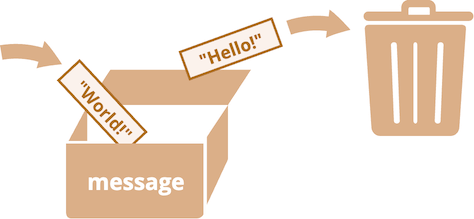

**⚠️ 注意：** 重复声明变量两次会触发错误，例如下面这段代码。

```js
let message = "This";

// 重复声明 message 变量会触发错误
let message = "That"; // Uncaught SyntaxError: Identifier 'message' has already been declared.
```

我们应该**对同一个变量只声明一次**，之后在不使用 `let` 的情况下对其引用。


**变量命名**

JavaScript 的变量命名有两个限制：

1. **变量名称只能包含字母、数字、符号 `$` 和 `_`**
2. **变量名称首字符不能是数字**

```js
let userName; // 有效命名
let 123test; // 无效命名
```

如果命名包括多个单词，通常采样驼峰式命名法（camelCase），**JavaScript 中的变量名称区分大小写，也允许使用非英文字符，但不推荐**。


**保留字**

JavaScript 有一张[保留字段列表](https://developer.mozilla.org/zh-CN/docs/Web/JavaScript/Reference/Lexical_grammar#保留字)，这里面的**保留字都无法用作变量名使用**，例如：`let`、`class` 等。


**未采用 `use strict` 下的赋值**

在早期，可以不使用 `let` 进行变量声明，直接通过赋值来创建一个变量。

```js
num = 5; // 如果变量 "num" 不存在，就会被创建

alert(num); // 5
```

但是这样做是糟糕的做法，**在严格模式下会报错**。

```js
'use strict';

num = 5; // Uncaught ReferenceError: num is not defined.
```


**常量**

常量用于声明一个**常数（不变）变量**，使用 `const` 而非 `let`。

```js
const myBirthday = '06.02.2002';
```

**`const` 声明的变量的值无法进行修改**，如果尝试修改会触发错误。

```js
const myBirthday = '06.02.2002';
myBirthday = '01.01.2002'; // Uncaught TypeError: Assignment to constant variable.
```

当确定一个变量的值不会发生改变的时候，就可以使用 `const` 来确保这个行为。


**大写形式的常量**

通常是将常量作为别名来使用，以便记住那些在执行之前就难以记忆的值。

使用大写字母和下划线来命名常量，例如下面这样的颜色值。

```js
const COLOR_RED = "#F00";
const COLOR_GREEN = "#0F0";
const COLOR_BLUE = "#00F";
const COLOR_ORANGE = "#FF7F00";

// ……当我们需要选择一个颜色
let color = COLOR_ORANGE;
alert(color); // #FF7F00
```

好处：

- `COLOR_ORANGE` 比 `#FF7F00` 更容易记忆
- `COLOR_ORANGE` 比 `#FF7F00` 更不容易输错
- 阅读代码时，`COLOR_ORANGE` 比 `#FF7F00` 更易懂

简单来说，**大写命名的常量仅用作 “硬编码（hard-coded）” 值的别名**，对于在执行期间被 “计算” 出来，但初始赋值之后就不会改变的常量，依旧使用**常规命名（驼峰式命名法（camelCase））**，例如：

```js
const pageLoadTime = /* 网页加载所需的时间 */;
```

`pageLoadTime` 的值在页面加载之前是未知的，所以采用常规命名。


**正确命名变量**

一个变量名应该有一个清晰、明显的含义，对其存储的数据进行描述。

命名一个变量可以遵守以下规则：

- 使用易读的命名，比如 `userName` 或者 `shoppingCart`
- 不使用诸如 `a`、`b`、`c` 这种缩写和短名称
- 变量名在能够准确描述变量的同时要足够简洁，如果使用 `data` 和 `value`，这样的名称等于什么都没说，**不过如果能非常明显地从上下文知道数据和值所表达的含义，使用它们也是可以的**
- 术语要和团队保持一致，例如网站的访客称为 “用户”，那可以取名 `currentUser` 或者 `newUser`，而不是使用 `currentVisitor` 或者 `newManInTown`


**复用变量还是新建变量**

在开发时如果重用现有的变量，而不是声明一个新的变量，那么这变量就像是被扔进不同东西盒子，但没有改变它的贴纸，里面是什么东西谁也不知道，导致在调试代码的时候损失数十倍时间。

**所以推荐始终额外声明一个变量而不是复用现有的变量**，现代 JavaScript 压缩器和浏览器能够对代码进行很好的优化，所以不会产生性能问题，**并且为不同值使用不同变量可以帮助引擎对代码进行优化**。


## 数据类型

在 JavaScript 中一共**有 8 种数据类型**，可以细分为以下两大类：

- **原始类型（7种）：** `number`、`bigint`、`string`、`boolean`、`null`、`undefined`、`symbol`
- **引用类型（1种）：** `object`

**JavaScript 是 “动态类型”（dynamically typed）的编程语言**，一个变量的可以前一刻是字符串，后一刻存储一个数字。


**Number 类型**

`number` 类型可以表示整数和浮点数，数字可以有很多操作，例如：乘法 `*`、除法 `/`、加法 `+`、减法 `-` 等等。

除了常规数字，**还有 “特殊数值”：`Infinity`、`-Infinity` 和 `NaN`**。

- `Infinity` 表示数学概念中的无穷大 ∞，是一个**比任何数字都大的特殊值**

  可以通过除以 `0` 来得到它

  ```js
  alert( 1 / 0 ); // Infinity
  ```

  也可以在代码中直接使用它

  ```js
  alert( Infinity ); // Infinity
  ```

- `NaN` 表示一个计算错误，是**一个不正确的或者一个未定义的数学操作所得到的结果**

  ```js
  alert( 'not a number' / 2 ); // NaN，这样的除法是错误的
  ```

  `NaN` 是粘性的，任何对 `NaN` 的进一步数学运算都会返回 `NaN`，例如下面这样：

  ```js
  alert( NaN + 1 ); // NaN
  alert( 3 * NaN ); // NaN
  alert( 'not a number' / 2 - 1 ); // NaN
  ```

  **⚠️ 注意：**

  - **`NaN ** 0` 是一个例外，其结果为 `1`**
  - `NaN` 可以确保 JavaScript 中做数学运算是安全的，不会因为计算错误导致脚本停止，在最坏的情况下，也只会得到 `NaN` 的结果
  - “特殊数值” 虽然在直觉上会觉得它们不是数字，但它们都属于 `number` 类型


**BigInt 类型**

在 JavaScript 中，`number` 类型无法安全地表示大于 `(2^53-1)`（即 `9007199254740991`），或小于 `-(2^53-1)` 的整数。

具体来说就是 `number` 类型可以存储更大的整数（最多 `1.7976931348623157 * 10308`），但超出安全整数范围 `±(2^53-1)` 会出现**精度问题**，因为不是所有数字都适合固定的 64 位存储，此时可能存储的是“近似值”。

```js
// 两个数字（正好超出了安全整数范围）是相同的
console.log(9007199254740991 + 1); // 9007199254740992
console.log(9007199254740991 + 2); // 9007199254740992
```

简单来说**所有大于 `(2^53-1)` 的奇数都不能用 `Number` 类型存储**。

在大多数情况下，`±(2^53-1)` 范围就足够了，但有时候需要整个范围非常大的整数，例如用于密码学或微秒精度的时间戳。

`BigInt` 类型就可以解决这个问题，它可以用于表示**任意长度的整数**，通过将 `n` 添加到整数字段的末尾来创建 `BigInt` 类型。

```js
// 尾部的 n 表示这是一个 BigInt 类型
const bigInt = 1234567890123456789012345678901234567890n;
```

**⚠️ 注意：** `BigInt` 类型是最近被添加到 JavaScript 语言中的，存在兼容性问题，**目前只有 IE 浏览器不支持**。


**String 类型**

在 JavaScript 中有三种创建字符串的方式：

1. 双引号：`"Hello"`
2. 单引号：`'Hello'`
3. 反引号：`` `Hello` ``

单引号和双引号都是 “简单” 引用，几乎没什么区别，反引号是**功能扩展**引号，允许我们将变量和表达式包装在 `${...}` 中，来将它嵌入到字符串中。

```js
let name = 'CodePencil';

// 嵌入一个变量
alert( `Hello, ${name}!` ); // Hello, CodePencil!

// 嵌入一个表达式
alert( `the result is ${1 + 2}` ); // the result is 3
```

**⚠️ 注意：**

- `${...}` 只能在反引号中使用
- 在 JavaScript 中，**只有一种 `string` 类型，一个字符串可以包含零个（为空）、一个或多个字符**


**Boolean 类型**

`boolean` 类型只包含两个值：`true` 和 `false`。

这类值通常用来存储 yes 或 no 的值，例如：`true` 意味着 “yes，正确”，`false` 意味着 “no，不正确”。

布尔值也可以作为比较的结果：

```js
let isGreater = 4 > 1;

alert( isGreater ); // true（比较的结果是 "yes"）
```


**null 类型**

`null` 类型构成了一个独立的类型，只包含 `null` 值，**表示一个代表 “无”、“空” 或 “值未知” 的特殊值**。

```js
let age = null;
```

例如上述代码表示 `age` 是未知。


**undefined 类型**

特殊值 `undefined` 和 `null` 一样自成类型，**表示未被赋值或者未初始化**。

```js
let age;

alert(age); // undefined
```

如果一个变量声明了，但是没有赋值，则它的值就是 `undefined`。

**⚠️ 注意：** 虽然从技术上可以显式地将 `undefined` 赋值给变量，**但是不推荐这样做，通常使用 `null` 来将一个 “空” 或者 “未知” 的值写入变量中**，而 `undefined` 则保留作**为未进行初始化的事物的默认初始值**，这样便于区分变量的值是未初始化还是变量的值为空。


**Object 类型**

`object` 类型是一个特殊的类型，其它所有的数据类型都被称为 “原始类型”，因为它们的值只包含一个单独的内容（字符串、数字或者其他），而 `object` 类型用于储存数据集合和更复杂的实体。


**Symbol 类型**

`symbol` 类型用于创建对象的唯一标识符。


**typeof 运算符**

`typeof` 运算符可以返回参数的类型，`typeof x` 的调用会**以字符串的形式**返回数据类型：：

```js
typeof undefined // 'undefined'

typeof 0 // 'number'

typeof 10n // 'bigint'

typeof true // 'boolean'

typeof 'foo' // 'string'

typeof Symbol('id') // 'symbol'

typeof Math // 'object'

typeof null // 'object'

typeof alert // 'function'
```

**⚠️ 注意：**

- `Math` 是一个提供数学运算的内建 `object`

- `typeof null` 的结果为 `'object'`，这是官方承认的 `typeof` 的错误，来自于 JavaScript 语言的早期阶段，为了兼容性而保留下来，**`null` 有自己的类型，它是一个特殊值**

- `typeof alert` 的结果为 `'function'`，因为 `alert` 在 JavaScript 语言中是一个函数，但 JavaScript 没有  `function` 类型，函数隶属于 `object` 类型，但是 `typeof` 对函数却返回了 `'function'`，这也是 JavaScript 语言早期的问题，但这个行为在实际编程中非常方便
- 也有人使用 `typeof(x)` 的语法，与 `typeof x` 相同，**括号不是 `typeof` 的一部分，它只是数学运算分组的括号**，例如：`(2 + 2)`


## 交互：alert、prompt 和 confirm


**alert**

用来显示信息。

```js
alert("Hello World");
```


**⚠️ 注意：** 弹出信息的小框称为**模态窗（modal）**，这意味着用户不能与页面的其他部分（例如点击其他按钮等）进行交互，直到处理完模态窗（例如这里点 “确定” 按钮）。


**prompt**

显示一个带有文本消息的模态窗口，还有 input 框和确定/取消按钮。

`prompt` 函数接收两个参数：

```js
const result = prompt(title, [default]);
```

- **`title`：** 显示给用户的文本
- **`default`：** 指定 input 输入框的初始值，**该参数是可选的**

例如：

```js
const age = prompt('How old are you?', 100);
```


访问者可以在提示输入框中输入内容，然后按 “确定” 键，然后我们在 `result` 中获取该文本。如果用户按取消键或者按 `Esc` 键取消输入，那我们在 `result` 中得到的是 `null`。

**⚠️ 注意：** 在 IE 浏览器中第二个参数如果不提供的话，默认会是 `'undefined'`，为了 prompt 始终有好的效果，**建议始终提供第二个参数**，就像下面这样。

```js
const test = prompt('Test', ''); // <-- 用于 IE 浏览器
```


**confirm**

显示一个带有 `question` 以及确定和取消两个按钮的模态窗口。

```js
const result = confirm(question);
```

例如：

```js
const isBoss = confirm("Are you the boss?");

alert( isBoss ); // 如果 “确定” 按钮被按下，则显示 true
```


点击确定返回 `true`，点击取消或者按 `Esc` 键返回 `false`。


前面这些方法都是模态的：它们会**暂停脚本的执行**，并且不允许用户与该页面的其余部分进行交互，直到窗口被解除。

上述所有方法共有两个限制：

1. 模态窗口位置由浏览器决定，通常在页面中心，无法修改
2. 模态窗口外观由浏览器决定，无法修改


## 类型转换


**字符串转换**

将值转换为字符串形式。

- `alert(value)` 会先将 `value` 转换为字符串类型，然后再显示这个值

- `String(value)` 显式地讲 `value` 转换为字符串类型

  ```js
  let value = true;
  alert(typeof value); // 'boolean'
  
  value = String(value); // 现在，值是一个字符串形式的 'true'
  alert(typeof value); // string
  ```

  `false` 变成 `'false'`、`null` 变成 `'null'`、`0` 变成 `'0'` 等。


**数字型转换**

在**算术函数和表达式**中，会自动进行 `number` 类型转换。

例如在除法 `/` 用于非 `number` 类型时：

```js
alert( '6' / '2' ); // 3
```

上述代码中 `string` 类型的值被自动转换成 `number` 类型后进行计算。

也可以通过 `Number(value)` 显式地将 `value` 转化为 `number` 类型。

```js
const str = '123';
alert(typeof str); // string

const num = Number(str); // 变成 number 类型 123

alert(typeof num); // number
```

**⚠️ 注意：** 如果该字符串不是有效的数字，则转换结果为 `NaN`，例如下面这样：

```js
const age = Number("an arbitrary string instead of a number");

alert(age); // NaN，转换失败
```

具体转换规则如下：

| 值                | 变成                                                         |
| :---------------- | :----------------------------------------------------------- |
| `undefined`       | `NaN`                                                        |
| `null`            | `0`                                                          |
| `true` 和 `false` | `1` 和 `0`                                                   |
| `string`          | 去掉首尾空白字符（空格、换行符 `\n`、制表符 `\t` 等）后的纯数字字符串中含有的数字。如果剩余字符串为空，则转换结果为 `0`。否则，将会从剩余字符串中 “读取” 数字。当类型转换出现 error 时返回 `NaN`。 |

具体例子：

```js
alert( Number("   123   ") ); // 123
alert( Number("123z") );      // NaN（从字符串“读取”数字，读到 "z" 时出现错误）
alert( Number(true) );        // 1
alert( Number(false) );       // 0
```

**⚠️ 注意：**

- `undefined` 变成 `NaN`，`null` 变成数字 `0`
- 大多数数学运算符都会进行上述转换


**布尔型转换**

通常发生在**逻辑运算**中，也可以使用 `Boolean(value)` 显式地进行转换。

具体转换规则如下：

| 值                                    | 变成    |
| :------------------------------------ | :------ |
| `0`, `null`, `undefined`, `NaN`, `""` | `false` |
| 其他值                                | `true`  |

**⚠️ 注意：** 字符串 `'0'` 和非空的字符串 `' '` 进行布尔型转换时，输出结果都为 `true`。


## 算数运算符

```js
5 * 2
```

**运算元：** 也称为参数，是指运算符应用的对象，例如上面有两个运算元，左运算元 `5` 和右运算元 `2`。

**一元运算符：** 指一个运算符对应的只有一个运算元，例如一元负号运算符。

```js
let x = 1;

x = -x;
alert( x ); // -1，一元负号运算符生效
```

**二元运算符：** 指一个运算符拥有两个运算元，例如下面这样。

```js
let x = 1, y = 3;
alert( y - x ); // 2，二元运算符减号做减运算
```


**数学运算**

JavaScript 支持以下数学运算符：

- 加法 `+`
- 减法 `-`
- 乘法 `*`
- 除法 `/`
- 取余 `%`
- 求幂 `**`


**取余**

```js
alert( 5 % 2 ); // 1，5 除以 2 的余数
alert( 8 % 3 ); // 2，8 除以 3 的余数
```


**求幂**

求幂运算 `a ** b` 将 `a` 提升至 `a` 的 `b` 次幂。

在数学运算中表示为：

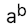

```js
alert( 2 ** 2 ); // 2² = 4
alert( 2 ** 3 ); // 2³ = 8
```

幂运算也适用于**非整数**。

```js
alert( 4 ** (1/2) ); // 2（1/2 次方与平方根相同)
alert( 8 ** (1/3) ); // 2（1/3 次方与立方根相同)
```


**二元运算符 + 连接字符串**

通常，加号 `+` 用于求和，但**如果任意一个运算元是字符串，那么另一个运算元也将被转化为字符串**。

```js
alert( '1' + 2 ); // '12'
alert( 2 + '1' ); // '21'
```

**⚠️ 注意：** 不管这个字符串运算元在左边还是右边，都会发生同样的 “字符串拼接” 行为。

其它复杂的例子：

```js
alert(2 + 2 + '1' ); // '41'，不是 '221'
```

这里运算符是按从左到右的顺序工作的，先计算 `2 + 2` 得到 `4`，然后再跟 `'1'` 拼接为字符串 `'41'`。

如果反过来最左边的是字符串运算元，那么结果大不相同。

```js
alert('1' + 2 + 2); // '122'，不是 '14'
```

**⚠️ 注意：只有二元 `+` 运算符会拼接字符串，其它运算符只对数字起作用，并且总是会其转换为数字**。

```js
alert( 6 - '2' ); // 4，将 '2' 转换为数字
alert( '6' / '2' ); // 3，将两个运算元都转换为数字
```


**一元运算符 +**

一元运算符 `+` 对于数字没有任何作用，但**如果运算元不是数字，则加号 `+` 会将其转化为数字**。

```js
// 对数字无效
let x = 1;
alert( +x ); // 1

let y = -2;
alert( +y ); // -2

// 转化非数字
alert( +true ); // 1
alert( +'' );   // 0
```

效果和 `Number(...)` 相同，但是更加简短。


**运算符优先级**

当一个表达式拥有超过一个运算符时，执行的顺序由**运算符的优先级**决定，所有运算符都有优先级顺序。

例如：`1 + 2 * 2` 是先计算乘法，再计算加法，**因为乘法的优先级比加法高**。

**圆括号拥有最高优先级**，可以用来调整运算顺序，例如：`(1 + 2) * 2`。

 JavaScript 中每个运算符都有对应的优先级数字，数字越大，越先执行。如果优先级相同，则按照由左至右的顺序执行。

| 优先级 | 名称     | 符号 |
| :----- | :------- | :--- |
| 15     | 一元加号 | `+`  |
| 15     | 一元负号 | `-`  |
| 14     | 求幂     | `**` |
| 13     | 乘号     | `*`  |
| 13     | 除号     | `/`  |
| 12     | 加号     | `+`  |
| 12     | 减号     | `-`  |
| 2      | 赋值符   | `=`  |

完整的优先级表可以参考 [MDN](https://developer.mozilla.org/zh-CN/docs/Web/JavaScript/Reference/Operators/Operator_precedence#汇总表)。


**赋值运算符**

再优先级表中它的优先级最低，只有 `2`，这也是为什么 `=` 最后才执行的原因。

```js
let x = 2 * 2 + 1;
alert( x ); // 5
```

**⚠️ 注意：** 在 JavaScript 中所有运算符都会返回一个值，例如：`1 + 1` 返回的是 `2` 等等，对于 `=` 也是如此。

语句 `x = value` 将值 `value` 写入 `x` **然后返回 value**。

```js
let a = 1;
let b = 2;

let c = 3 - (a = b + 1);

alert( a ); // 3
alert( c ); // 0
```

上述代码中 `(a = b + 1)` 先将 `b + 1` 的值写入 `a`，然后再返回 `b + 1` 的值。

**⚠️ 注意：** 不推荐写上面形式的代码，不利于代码的清晰和可读。


**链式赋值（Chaining assignments）**

```js
let a, b, c;

a = b = c = 2 + 2;

alert( a ); // 4
alert( b ); // 4
alert( c ); // 4
```

**链式赋值是从右往左进行计算**，首先对最右边的表达式 `2 + 2` 求值，然后将其赋给左边的变量：`c`、`b` 和 `a`。

**⚠️ 注意：** 出于可读性，最好将这种代码分成几行，像下面这样：

```js
let a, b, c;

c = 2 + 2;
b = c;
a = c;
```


**原地修改**

对一个变量做运算，然后将新的结果存在在同一个变量中。

```js
let n = 2;
n = n + 5;
n = n * 2;
```

上述代码可以简化为：

```js
let n = 2;
n += 5; // 等同于 n = n + 5
n *= 2; // 等同于 n = n * 2
```

**⚠️ 注意：** 

- 所有算术和位运算符都有简短的 “修改并赋值” 运算符，例如：`/=` 和 `-=` 等

- 这类运算符的优先级与**赋值运算符的优先级相同**，在大多数其它运算之后执行，例如：

  ```js
  let n = 2;
  n *= 3 + 5;
  alert( n ); // 16 （右边部分先被计算，等同于 n *= 8）
  ```

  

**自增、自减**

- **自增运算符 `++`：** 将变量与 1 相加

  ```js
  let counter = 2;
  counter++; // 等同于 counter = counter + 1
  alert( counter ); // 3
  ```

- **自减运算符 `--`：** 将变量与 1 相减

  ```js
  let counter = 2;
  counter--; // 等同于 counter = counter - 1
  alert( counter ); // 1
  ```

**⚠️ 注意：自增和自减只能用于变量**，例如使用 `5++` 就会报错。

运算符 `++` 和 `--` 可以放在变量前，也可以放在变量后。

- 当运算符置于变量后，被称为 **“后置形式”**：`counter++`
- 当运算符置于变量前，被称为 **“前置形式”**：`++counter`

**相同点：** 将变量 `counter` 与 `1` 相加。

**不同点：** 它们的返回值不同，例如：

- 前置形式，对 `counter` 做自增运算，返回的是新值 `2`

  ```js
  let counter = 1;
  let a = ++counter;
  
  alert(a); // 2
  ```

- 后置形式，也是对 `counter` 做自增运算，但返回的值是旧值 `1`

  ```js
  let counter = 1;
  let a = counter++;
  
  alert(a); // 1
  ```

简单来说

- 当想要对变量进行自增操作，并且需要**立刻使用自增后的值**，则使用 “前置形式”
- 当想要对变量进行自增操作，并且需要**使用自增之前的值**，则使用 “后置形式”

**⚠️ 注意：** `++/--` 运算符的优先级比绝大部分的算数运算符要高，例如：

```js
let counter = 1;
alert( 2 * ++counter ); // 4
```


**位运算符**

位运算符把运算元当做 32 位整数，并在它的**二进制形式上进行操作**。

有以下位运算符：

- 按位与 ( `&` )
- 按位或 ( `|` )
- 按位异或 ( `^` )
- 按位非 ( `~` )
- 左移 ( `<<` )
- 右移 ( `>>` )
- 无符号右移 ( `>>>` )

通常这些运算符很少被使用，一般是我们需要在最低级别（位）上操作数字时才使用，在 Web 开发中很少使用它们，但在某些特殊领域中它们非常有用，例如密码学。


**逗号运算符**

逗号运算符是最少见最不常使用的运算符之一，能让我们处理多个表达式，使用 `,` 将它们分开。

每个表达式都运行了，但是**只有最后一个的结果会被返回**。

```js
let a = (1 + 2, 3 + 4);
alert( a ); // 7（3 + 4 的结果）
```

上述代码中，第一个表达式 `1 + 2` 运行了，但是它的结果被丢弃了。随后计算 `3 + 4`，并且该计算结果被返回。

**⚠️ 注意： 逗号运算符的优先级非常低，比 `=` 还要低**，所以前面代码中必须要加上 `()`，不然就变成了 `let a = 1 + 2, 3 + 4;`，等同于 `a = 3, 7`，`7` 会被忽略不会再执行。

逗号运算符通常用在 `for` 循环中，例如下面这样：

```js
// 一行上有三个运算符
for (a = 1, b = 3, c = a * b; a < 10; a++) {
 ...
}
```


## 比较运算符

在 JavaScript 中有以下几个比较大小的运算符：

- 大于 `a > b`
- 小于 `a < b`
- 大于等于 `a >= b`
- 小于等于 `a <= b`
- 相等 `a == b`
- 不相等 `a != b`
- 严格相等 `a === b`
- 严格不相等 `a !== b`

**所有比较运算符都返回布尔值**。

```js
alert( 2 > 1 );  // true
alert( 2 == 1 ); // false
alert( 2 != 1 ); // true
```


**字符串比较**

在比较字符串之间的大小时，JavaScript 会**按照 Unicode 编码顺序进行比较**。

简单来说，**字符串是按字符（母）逐个进行比较的**。

```js
alert( 'Z' > 'A' ); // true
alert( 'Glow' > 'Glee' ); // true
alert( 'Bee' > 'Be' ); // true
```

比较过程如下：

1. 首先比较两个字符串的首位字符大小
2. 如果一方字符较大（或较小），则该字符串大于（或小于）另一个字符串。比较结束
3. 否则，如果两个字符串的首位字符相等，则继续取出两个字符串各自的后一位字符进行比较
4. 重复上述步骤进行比较，直到比较完成某字符串的所有字符为止
5. 如果两个字符串的字符同时用完，那么则判定它们相等，否则未结束（还有未比较的字符）的字符串更大


**不同类型之间的比较**

在对不同类型的值进行比较时，JavaScript 会**首先将其转化为数字（`number`）类型后再进行比较**。

```js
alert( '2' > 1 ); // true，字符串 '2' 会被转化为数字 2
alert( '01' == 1 ); // true，字符串 '01' 会被转化为数字 1
```

对于布尔值来说，`true` 会被转化为 `1`、`false` 转化为 `0`。

```js
alert( true == 1 ); // true
alert( false == 0 ); // true
```


**严格相等**

普通的相等 `==` 无法区分出 `0` 和 `false`，也无法区分空字符串 `''` 和 `false`。

```js
alert( 0 == false ); // true
alert( '' == false ); // true
alert( 0 == '' ); // true
```

因为在比较不同类型的值时，**处于相等判断符号 `==` 两侧的值会先被转化为数字**，它们转换后的值都为 `0`。

如果需要区分则需要使用**严格相等运算符 `===`**，它在**进行比较时不会做任何的类型转换**。

如果 `a` 和 `b` 属于不同的数据类型，`a === b` 会立刻返回 `false`，例如下面这样：

```js
alert( 0 === false ); // false
```

**同样也有严格不相等运算符 `!==`**。


**null 和 undefined 进行比较**

- 使用严格相等 `===` 比较时

  ```js
  alert( null === undefined ); // false
  ```

- 使用非严格相等 `==` 比较时

  ```js
  alert( null == undefined ); // true
  ```

**⚠️ 注意：** 

- 在非严格相等 `==` 中，**`null` 和 `undefined` 不会进行类型转换，并且两者相等**

  ```css
  alert( null == 0 ); // false
  alert( null == undefined); // true
  
  alert( null == null); // true
  alert( undefined == undefined); // true
  ```

- 当使用数学式或其他比较方法 `<`、`>`、` <=`、`>=` 时

  - **`null` 被转化为 `0`**

    ```js
    alert( null > 0 );  // false
    alert( null == 0 ); // false, 非严格相等中，null 不会转换为 0
    alert( null >= 0 ); // true
    ```

  - **`undefined` 转换为 `NaN`**

    ```js
    alert( undefined > 0 ); // false
    alert( undefined < 0 ); // false
    alert( undefined == 0 ); // false, 非严格相等中，undefined 不会转换为 NaN
    ```


## 条件分支：if 和 ?

**if 语句**

`if(...)` 语句计算括号里的条件表达式，如果计算结果是 `true`，就会执行对应的代码块。

```js
if (year == 2025) alert( 'You are right!' );
```

如果有多条语句，**必须**要将执行的代码放入 `{}` 中。

```js
if (year == 2025) {
  alert( "That's correct!" );
  alert( "You're so smart!" );
}
```

**⚠️ 注意：建议每次使用 `if` 语句都用大括号 `{}` 来包装代码块，即使只有一条语句**，这样可以提高代码可读性。


**布尔转换**

`if(...)` 语句会计算括号内的表达式，并**将计算结果转换为布尔型**，遵守前面学的**布尔型转换**规则。

```js
if (0) { // 0 转换为 false
  ...
}

if (1) { // 0 转换为 true
  ...
}
```


**else 语句**

`if` 语句中可以包含一个**可选的 `else` 块**，如果判断条件不成立，就会执行它内部的代码。

```js
if (year == 2025) {
  alert( 'You guessed it right!' );
} else {
  alert( 'How can you be so wrong?' ); // 2025 以外的任何值
}
```


**多个条件 else if**

当一个条件有多个变体时，可以通过使用 `else if` 子句实现。
```js
const year = prompt('In which year was ECMAScript-2015 specification published?', '');

if (year < 2015) {
  alert( 'Too early...' );
} else if (year > 2015) {
  alert( 'Too late' );
} else {
  alert( 'Exactly!' );
}
```

上述代码先检查 `year < 2015`，如果条件不符合，就会转到下一个条件 `year > 2015`，如果这个也不符合就显示最后 `else` 块中的语句。

**⚠️ 注意：** 可以有更多的的 `else if`，**结尾的 `else` 是可选的**。


**条件运算符 ?**

当需要根据一个条件去赋值一个变量时可以使用条件运算符。

这个运算符通过问号 `?` 表示。有时它被称为**三元运算符**。

```js
const result = condition ? value1 : value2;
```

上述代码中，当 `condition` 为真时，返回 `value1`，否则返回 `value2`。

**使用括号可以增强可读性**，例如下面这样：

```js
const accessAllowed = (age > 18) ? true : false;
```

**问号运算符的优先级较低**，会在比较运算符 `>` 之后执行。

多个 `?` 可以嵌套使用，类似于 `else if` 语句，例如下面这样。

```js
const age = prompt('age?', 18);

const message = (age < 3) ? 'Hi, baby!' :
  (age < 18) ? 'Hello!' :
  (age < 100) ? 'Greetings!' :
  'What an unusual age!';

alert( message );
```

**⚠️ 注意：** 不推荐下面这种情况下使用 `?` 替代 `if` 语句。

```js  
const company = prompt('Which company created JavaScript?', '');

(company === 'Netscape') ?
   alert('Right!') : alert('Wrong.');
```

**这里不是把结果赋值给变量，而是根据条件执行不同的代码**，使用 `if` 语句实现更加的直观。

```js
const company = prompt('Which company created JavaScript?', '');

if (company === 'Netscape') {
  alert('Right!');
} else {
  alert('Wrong.');
}
```


## 逻辑运算符

在 JavaScript 中有四个逻辑运算符：

- 或 `||`
- 与 `&&`
- 非 `!`
- 空值合并运算符 `??`

**这些运算符可以应用于任意类型的值，它们的返回结果也可以是任意类型，而不仅仅是布尔值**。


**或 `||`**

参与运算的任意一个参数为 `true`，返回的结果就为 `true`。

```js
alert( true || true );   // true
alert( false || true );  // true
alert( true || false );  // true
alert( false || false ); // false
```

如果操作数不是布尔类型，会被转换为布尔值来进行计算，例如下面这样：

```js
if (1 || 0) { // 等同于 if( true || false )
  alert( 'truthy!' );
}
```


**或运算寻找第一个真值**

在 JavaScript 中对或 `||` 运算符有提供附加的特性。

```js
result = value1 || value2 || value3;
```

或运算符 `||` 做了如下的事情：

- 从左到右依次计算操作数
- 处理每一个操作数时，**都将其转化为布尔值**，如果结果是 `true`，就停止计算，返回这个**操作数的初始值**
- 如果所有的操作数都被计算过（也就是，转换结果都是 `false`），则**返回最后一个操作数**

例如：

```js
alert( 1 || 0 ); // 1

alert( null || 1 ); // 1
alert( null || 0 || 1 ); // 1

alert( undefined || null || 0 ); // 0
```


**短路求值（Short-circuit evaluation）**

指 `||` 运算符如果第一个参数为真值，会立即返回该值，**后面的参数不会进行转换和处理**。

```js
true || alert('not printed'); // alert 不会执行
false || alert('printed');
```

可以利用这个特性，只在左侧的条件为假时才执行命令。


**与 `&&`**

参与运算的所有参数都为 `true`，返回的结果才为 `true`。

```js
alert( true && true );   // true
alert( false && true );  // false
alert( true && false );  // false
alert( false && false ); // false
```

就像或运算一样，与运算的操作数可以是任意类型的值，会被转换为布尔值来进行计算。

```js
if (1 && 0) { // 等价于 true && false
  alert( "won't work, because the result is falsy" );
}
```


**与运算寻找第一个假值**

```js
result = value1 && value2 && value3;
```

与运算 `&&` 做了如下的事：

- 从左到右依次计算操作数
- 在处理每一个操作数时，都将其转化为布尔值，如果结果是 `false`，就停止计算，并返回这个**操作数的初始值**
- 如果所有的操作数都被计算过（也就是，转换结果都是 `true`），则返回**最后一个操作数**

```js
alert( 1 && 0 ); // 0
alert( 1 && 5 ); // 5

alert( null && 5 ); // null
alert( 0 && "no matter what" ); // 0
```

**⚠️ 注意：** 

- **与运算 `&&` 或运算 `||` 之前进行**，例如：`a && b || c && d` 等同于 `(a && b) || (c && d)`

- **不要用 `||` 或 `&&` 来取代`if`**，例如下面这样：

  ```js
  let x = 1;
  
  (x > 0) && alert( 'Greater than zero!' );
  ```

  这样缺乏可读性，换成 `if` 更加明显。

  ```js
  let x = 1;
  
  if (x > 0) alert( 'Greater than zero!' );
  ```


**非 `!`**

```js
result = !value;
```

逻辑非运算符接受一个参数，计算过程如下：

1. 将操作数转化为布尔类型：`true/false`
2. 返回相反的值

```js
alert( !true ); // false
alert( !0 ); // true
```

可以通过 `!!` 将某个值转换为布尔类型：

```js
alert( !!'non-empty string' ); // true
alert( !!null ); // false
```

等同于 `Boolean` 函数的效果。

```js
alert( Boolean("non-empty string") ); // true
alert( Boolean(null) ); // false
```

**⚠️ 注意： 非运算符 `!` 的优先级在所有逻辑运算符里面最高**，所以它总是在 `&&` 和 `||` 之前执行。


**空值合并运算符 ?? **

当一个值既不是 `null` 也不是 `undefined` 时，我们将其称为 **“已定义的（defined）”**。

`a ?? b` 的结果是：

- 如果 `a` 是已定义的，则结果为 `a`
- 如果 `a` 不是已定义的，则结果为 `b`

等同于

```js
(a !== null && a !== undefined) ? a : b;
```

**`??` 和 `||` 的优先级一样，都是 `3`**，仅略高于 `?` 和 `=`，所以在大多数其它运算（例如 `+` 和 `*`）之后计算，所以在计算时可能需要添加括号来调整计算顺序。

```js
let height = null;
let width = null;

// 重要：使用括号
let area = (height ?? 100) * (width ?? 50);

alert(area); // 5000
```

`||` 和 `??` 之间的重要区别是：

- `||` 返回第一个**真**值
- `??` 返回第一个**已定义的**值

简单来说就是 **`||` 无法区分 `false`、`0`、空字符串 `""` 和 `null`、`undefined`**，例如下面这样。

```js
let height = 0;

alert(height || 100); // 100
alert(height ?? 100); // 0
```

上述代码中高度 `0` 通常是一个有效值，不应该被替换换位默认值， `??` 运算得到的是正确的结果。

**⚠️ 注意：** 出于安全原因，**JavaScript 禁止将 `??` 运算符与 `&&` 和 `||` 运算符一起使用**

```js
let x = 1 && 2 ?? 3; // Uncaught SyntaxError: Unexpected token '??'
```

这样做是为了避免开发者从 `||` 切换到 `??` 时的编程错误。

可以通过明确使用括号来解决这个问题。

```js
let x = (1 && 2) ?? 3; // 正常工作了

alert(x); // 2
```


## 循环：while 和 for

常用于重复执行一些操作。

**while 循环**

当循环条件 `condition` 为真时，执行循环体的代码。

```js
while (condition) {
  // 循环体
}
```

例如：

```js
let i = 0;
while (i < 3) { // 依次显示 0、1、2
  alert( i );
  i++;
}
```

循环体的单次执行叫做**一次迭代**，上述代码的循环共进行了三次迭代。

任何变量和表达式都可以是循环条件，在 `while` 中的循环条件会被计算为布尔值。

也可以通过 `while(true)` 来构造 “无限” 循环。

**⚠️ 注意： 单行循环体可以不需要使用大括号**。

```js
let i = 3;
while (i) alert(i--);
```


**do...while 循环**

循环首先执行循环体中的代码，然后检查条件，当条件为真时，重复执行循环体。

```js
do {
  // 循环体
} while (condition);
```

例如：

```js
let i = 0;
do {
  alert( i );
  i++;
} while (i < 3); // 依次显示 0、1、2
```

**⚠️ 注意：** 

- `do...while` 循环无论条件是否为真，**`do...while` 的循环体至少执行一次**
- 该形式语法用的比较少，**通常更加倾向使用 `while(...) {...}`**


**for 循环**

语法格式如下：

```js
for (begin; condition; step) {
  // 循环体
}
```

例如：

```js
for (let i = 0; i < 3; i++) { // 依次显示 0、1、2
  alert(i);
}
```

上述代码运行步骤如下：

| 语句段         |             |                                                  |
| :------------- | :---------- | :----------------------------------------------- |
| begin          | `let i = 0` | 进入循环时执行一次                               |
| condition      | `i < 3`     | 在每次循环迭代之前检查，如果为 `false`，停止循环 |
| body（循环体） | `alert(i)`  | 条件为真时，重复运行                             |
| step           | `i++`       | 在每次循环体迭代后执行                           |

上述代码中的 “计数” 变量 `i` 是在循环中声明的，叫做 **“内联” 变量声明，只在循环中可见**。

```js
for (let i = 0; i < 3; i++) {
  alert(i); // 0, 1, 2
}
alert(i); // 错误，没有这个变量
```

除了在循环中声明变量，还可以使用外部现有的变量。

```js
let i = 0;

for (i = 0; i < 3; i++) { // 使用现有的变量
  alert(i); // 0, 1, 2
}

alert(i); // 3，可见，因为是在循环之外声明的
```

`for` 循环中的任何语句段都可以被省略。

- 省略 `begin` 部分

  ```js
  let i = 0; // 我们已经声明了 i 并对它进行了赋值
  
  for (; i < 3; i++) { // 不再需要 begin 语句段
    alert( i ); // 0, 1, 2
  }
  ```

- 省略 `step` 部分

  ```js
  let i = 0;
  
  for (; i < 3;) {
    alert( i++ );
  }
  ```

  该循环等同于 `while (i < 3)`。

- 删除所有部分，从而创建一个无限循环

  ```js
  for (;;) {
    // 无限循环
  }
  ```

  **⚠️ 注意：`for` 的两个 `;` 必须存在**，否则会出现语法错误。


**跳出循环**

使用 `break` 指令**强制停止循环**，例如下面这段代码。

```js
let sum = 0;

while (true) {
  let value = +prompt('Enter a number', '');
  if (!value) break; // 输入空行或取消输入时停止循环
  sum += value;
}

alert( 'Sum: ' + sum );
```

`break` 跳转循环后将控制权交给循环后的第一行，在上述代码中即 `alert`。


**继续下一次迭代**

使用 `continue` 指令**不会停止整个循环，而是停止当前这一次迭代，并启动新的一轮循环（如果条件允许的话）。**

```js
for (let i = 0; i < 10; i++) {

  // 如果为真，跳过循环体的剩余部分。
  if (i % 2 == 0) continue;

  alert(i); // 1，然后 3，5，7，9
}
```

上述代码中对于偶数的 `i` 值，`continue` 指令会停止本次循环的执行，将控制权传递给下一次 `for` 循环的迭代，所以 `alert` 仅被奇数值调用。

**`continue` 指令有利于减少嵌套**，如果不用 `continue` 指令就会像下面这样多一层嵌套：

```js
for (let i = 0; i < 10; i++) {
  if (i % 2) {
    alert( i );
  }
}
```

**⚠️ 注意： 非表达式的语法结构不能与三元运算符 `?` 一起使用**，所以 `break/continue` 这样的指令是不允许和三元运算符 `?` 一起使用的，例如下面这段代码：

```js
(i > 5) ? alert(i) : continue; // Uncaught SyntaxError: Unexpected token 'continue'
```

上述代码会停止运行，并显示有语法错误。

**表达式：** 可以**产生一个值的代码片段**，比如：

```js
1 + 2      // 3
a > b      // true 或者 false
func()     // undefined
x ? y : z  // y 或者 z
```


**break/continue 标签**

当需要从多层嵌套的循环中跳出来时，使用普通 `break` 只会打破内部循环，此时就需要使用 `break/continue` 标签。

**标签** 是在循环之前带有冒号的标识符：

```js
labelName: for (...) {
  ...
}
```

`break <labelName>` 语句可以跳出循环至标签处，例如下面这段代码：

```js
outer: for (let i = 0; i < 3; i++) {
  for (let j = 0; j < 3; j++) {
    let input = prompt(`Value at coords (${i},${j})`, '');
		
    if (!input) break outer; // 如果是空字符串或被取消，则中断并跳出这两个循环
  }
}

alert('Done!');
```

上述代码标签名是 `outer`，通过 `break outer` 跳出循环到 `outer` 标签处，然后将控制权交给 `alert('Done!')` 处。

`continue` 指令也可以和标签一起使用，**可以执行跳转到标记循环的下一次迭代**。

**⚠️ 注意：标签并不允许跳转到代码的任意位置**，例如：

```js
break label;  // 跳转至下面的 label 处（无效）

label: for (...)
```

**`break` 指令必须在代码块或者循环体内部中**，从技术上讲，任何被标记的代码块都有效。

```js
label: {
  // ...
  break label; // 有效
  // ...
}
```

不过 99.9% 的情况下 `break` 都被用在循环体内。

**⚠️ 注意： `continue` 只能放在循环体内部**，不能像 `break` 可以放在代码块中。


## swtich 语句

`switch` 语句可以替代多个 `if` 判断，为多分支选择的情况提供了一个更具描述性的方式。

```js
switch(x) {
  case 'value1':  // if (x === 'value1')
    ...
    [break]

  case 'value2':  // if (x === 'value2')
    ...
    [break]

  default:
    ...
    [break]
}
```

上述代码中，`swtich` 语句首先判断 `x` 值与第一个 `case` 后的值（也是就是 `value1`）是否**严格相等**，然后再比较第二个 `case`（`value2`），以此类推。

- 如果相等，`switch` 语句就执行相应 `case` 下的代码块，**直到遇到最靠近的 `break` 语句（或者直到 `switch` 语句末尾）**
- 如果没有符合的 `case`，则执行 `default` 代码块

**⚠️ 注意：**

- **`switch` 语句中的比较都是严格相等 `===` 的**

- **`switch` 语句中至少有一个 `case` 代码块**和一个可选的 `default` 代码块

- 如果没有 `break`，程序将不经过任何检查就继续执行下一个 `case`

  ```js
  let a = 2 + 2;
  
  switch (a) {
    case 3:
      alert( 'Too small' );
    case 4:
      alert( 'Exactly!' );
    case 5:
      alert( 'Too big' );
    default:
      alert( "I don't know such values" );
  }
  ```

  上述代码会连续执行的三个 `alert`，分别是：

  ```js
  alert( 'Exactly!' );
  alert( 'Too big' );
  alert( "I don't know such values" );
  ```

- `switch` 和 `case` 允许使用任意表达式，例如下面这样：

  ```js
  let a = "1";
  let b = 0;
  
  switch (+a) {
    case b + 1:
      alert("this runs, because +a is 1, exactly equals b+1");
      break;
    default:
      alert("this doesn't run");
  }
  ```

  会执行 `alert("this runs, because +a is 1, exactly equals b+1");`。


**case 分组**

可以将共享同一段代码的几个 `case` 分为一组。

```js
let a = 3;

switch (a) {
  case 4:
    alert('Right!');
    break;
  case 3: // 下面这两个 case 被分在一组
  case 5:
    alert('Wrong!');
    alert("Why don't you take a math class?");
    break;
  default:
    alert('The result is strange. Really.');
}
```

上述代码中当 `a` 是 `3` 或者 `5` 时，都会显示相同的信息。

**⚠️ 注意：** `case` 分组的能力其实是 `switch` 语句没有 `break` 时的副作用，没有 `break` 时会从 `case3` 执行到 `case5`。


## 函数

函数是程序的主要构建块，可以使一段代码被调用多次，不需要写重复的代码。


**函数声明**

```js
function name(parameter1, parameter2, ... parameterN) {
  // 函数体 body
}
```

`function` 关键字首先出现，然后再是**函数名**，括号中的是**参数列表**（使用逗号分隔，参数列表可以为空），最后花括号之间的代码是**函数体**，例如：

```js
function sum(a, b) {
  return a + b;
}
```

通过 `sum()` 可以调用函数。

```js
function sum(a, b) {
  return a + b;
}

sum(1, 3); // 4
sum(2, 5); // 7
```


**局部变量**

函数中声明的变量**只在该函数内部可见**。

```js
function showMessage() {
  let message = "Hello, I'm JavaScript!"; // 局部变量
  alert(message);
}

showMessage(); // Hello, I'm JavaScript!

alert(message); // ReferenceError: message is not defined
```


**外部变量**

函数可以访问外部的变量。

```js
let userName = 'CodePencil';

function showMessage() {
  let message = 'Hello, ' + userName;
  alert(message);
}

showMessage(); // Hello, CodePencil
```

函数也可以修改外部变量。

```js
let userName = 'CodePencil';

function showMessage() {
  userName = 'Bob'; // 修改外部变量
  let message = 'Hello, ' + userName;
  alert(message);
}

alert(userName); // CodePencil

showMessage(); // Hello, Bob

alert(userName); // Bob
```

**⚠️ 注意：** 当函数内声明了**同名的变量**（局部变量），就不会使用函数外的变量。

```js
let userName = 'Bob';

function showMessage() {
  let userName = 'CodePencil'; // 声明一个局部变量

  let message = 'Hello, ' + userName; // CodePencil
  alert(message);
}

showMessage(); // Hello, CodePencil

alert(userName); // Bob，未被更改，函数没有访问外部变量
```

**⚠️ 注意：** 

- **任何函数之外声明的变量被称为全局变量**，例如上述代码中函数外的 `userName` 变量，全局变量在任意函数中都是可见的（除非被局部变量遮蔽）
- 现代开发很少甚至没有全局变量，大多数变量都存在于函数之中，不过有时候，全局变量能够用于存储项目级别的数据


**参数**

- 参数（parameter）是函数**声明**中括号内列出的变量（它是函数声明时的术语）

  ```js
  function sum(a, b) { // a，b 都是 parameter
    return a + b;
  }
  ```

- 参数（argument）是**调用**函数时传递给函数的值（它是函数调用时的术语）

  ```js
  sum(1, 3); // 1, 3 都是 argument
  ```

修改函数内部的参数，在函数外部看不到更改。

```js
function showMessage(from, text) {
  from = '*' + from + '*'; // 修改的是复制的变量值副本
  alert(from + ': ' + text);
}

let from = 'CodePencil';
showMessage(from, 'Hello'); // *CodePencil*: Hello

// from 值相同，函数修改了一个局部的副本
alert(from); // CodePencil
```


**默认值**

如果函数调用，**有参数（parameter）但没有提供，相应的值就会变成 `undefined`**。

```js
function showMessage(from, text) {
  from = '*' + from + '*';
  alert(from + ': ' + text);
}

let from = 'CodePencil';
showMessage(from); // *CodePencil*: undefined
```

可以通过 `=` 为函数参数（parameter）指定默认值。

```js
function showMessage(from, text = 'no text given') { // 为 text 参数指定默认值
  from = '*' + from + '*';
  alert(from + ': ' + text);
}

let from = 'CodePencil';
showMessage(from); // *CodePencil*: no text given
```

上述代码中当 `text` 参数没传递时，将会使用默认值 `no text given`。

默认值也可以是一个复杂的表达式。

```js
function showMessage(from, text = anotherFunction()) {
  ...
}
```

当 `text` 参数没传递时，`anotherFunction` 函数会被调用，反之不会调用。

**⚠️ 注意：** 对于不支持默认参数的浏览器中，可以使用以下方式来兼容。

```js
function showMessage(from, text) {
  if (text === undefined) { // 显式检查是否为 undefined
    text = 'no text given';
  }

  alert(from + ": " + text);
}
```

也可以使用 `||` 运算符。

```js
function showMessage(from, text) {
  text = text || 'no text given';
  ...
}
```

如果 `text` 的值为假值，则分配默认值。


**返回值**

函数可以将一个值返回作为调用函数的结果。

```js
function sum(a, b) {
  return a + b;
}

let result = sum(1, 2);
alert(result); // 3
```

**`return` 指令可以在函数的任意位置**，当执行 `return` 时，函数停止，并将值返回给调用函数的地方（例如：上述代码会返回给 `result` 变量）。

一个函数中可以有多个 `return`。

```js
function checkAge(age) {
  if (age >= 18) { // 比较 age 大小返回不同的值
    return true;
  } else {
    return confirm('Got a permission from the parents?');
  }
}

let age = prompt('How old are you?', 18);

if (checkAge(age)) {
  alert('Access granted');
} else {
  alert('Access denied');
}
```

**⚠️ 注意：**

- 可以只使用 `return` 但没有返回值也是可行的，但会导致**函数立即退出**。

  ```js
  function showMovie(age) {
    if (!checkAge(age)) {
      return; // 使用空值 return
    }
    alert('Showing you the movie');
  }
  ```

  上述代码中，如果 `checkAge` 返回 `false`，则会执行 `return` 指令停止函数，导致后面的 `alert` 语句不会执行。

- **空值的** `return` **或没有** `return` **的函数返回值都为** `undefined`

  ```js
  function doNothing() { /* 没有代码 */ }
  
  alert( doNothing() === undefined ); // true
  ```

  ```js
  function doNothing() {
    return;
  }
  
  alert( doNothing() === undefined ); // true
  ```

- **不要在 `return` 与返回值之间添加新行**

  ```js
  return
   (some + long + expression + or + whatever * f(a) + f(b))
  ```

  上述代码换行等价于下列代码，**`return` 后面的语句不会执行**，实际返回的是空值。

  ```js
  return;
   (some + long + expression + or + whatever * f(a) + f(b))
  ```

  如果想写成跨多行的形式，需要在 `return` 同一行，并且按如下方式使用括号。

  ```js
  return (
    some + long + expression
    + or +
    whatever * f(a) + f(b)
    )
  ```


**函数命名**

函数是行为（action），所以函数名通常是动词，**应该简短且尽可能准确地描述函数的作用**。

普遍的做法是使用动词前缀来开始一个函数。

- `"get…"` 返回一个值
- `"calc…"` 计算某些内容
- `"create…"` 创建某些内容
- `"check…"` 检查某些内容并返回 `boolean` 值
- `"show…"` 显示某些内容

例如下面这些例子：

```js
showMessage(..)     // 显示信息
getAge(..)          // 返回 age 值
calcSum(..)         // 计算求和并返回结果
createForm(..)      // 创建表单（通常会返回它）
checkPermission(..) // 检查权限并返回 true/false
```

**⚠️ 注意：**

- **一个函数应该只包含函数名所指定的功能，不做更多与函数名无关的功能**，如果一个函数的功能很复杂，应该把该函数拆分为几个小的函数

- 一个单独的函数不仅更容易测试和调试，**它的存在本身就是一个很好的注释**

  ```js
  function showPrimes(n) {
    nextPrime: for (let i = 2; i < n; i++) {
  
      for (let j = 2; j < i; j++) {
        if (i % j == 0) continue nextPrime;
      }
  
      alert(i); // 一个素数
    }
  }
  ```

  上述代码我们可以将判断素数的部分拆分为一个单独的函数，就像下面这样。

  ```js
  function showPrimes(n) {
    for (let i = 2; i < n; i++) {
      if (!isPrime(i)) continue;
  
      alert(i);  // 一个素数
    }
  }
  
  function isPrime(n) {
    for (let i = 2; i < n; i++) {
      if ( n % i == 0) return false;
    }
    return true;
  }
  ```

  通过 `isPrime` 函数名可以清晰的看出函数的行为，不需要通过注释和代码，这样的代码称为**自描述**。


## 函数表达式

在 JavaScript 中函数不是一个 “神奇的语言结构”，而是一种**特殊的值**。

字符串或数字等常规值代表**数据**。

函数可以被视为一个**行为（action）**。

- **函数声明**

  ```js
  function sayHi() {
    alert('Hello');
  }
  ```

-  **函数表达式**

  ```js
  let sayHi = function() {
    alert('Hello');
  };
  ```

**⚠️ 注意：**

- 上述两种创建方式虽然不同，但都是在 `sayHi` 变量中存储了一个函数

  ```js
  function sayHi() {
    alert('Hello');
  }
  
  alert(sayHi); // 显示函数代码
  ```

  上述代码中 **`alert(sayHi);` 不会执行函数，因为 `sayHi` 没有加括号**，所以只会显示函数的源码，如下图。

  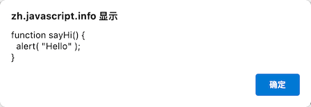

- **函数表达式结尾有一个分号 `;`，这个分号不是函数语法的一部分**，而是赋值语句的一部分，例如：

  ```js
  let sayHi = 5;
  ```

- 函数表达式中 `function` 关键字后面没有函数名，**函数表达式允许省略函数名**


**回调函数**

```js
function ask(question, yes, no) {
  if ( confirm(question) ) {
    yes();
  } else {
    no();
  }
}

function showOk() {
  alert('You agreed.');
}

function showCancel() {
  alert('You canceled the execution.');
}

// 函数 showOk 和 showCancel 被作为参数传入到 ask
ask('Do you agree?', showOk, showCancel);
```

上述代码中 `ask` 函数的参数值 `showOk` 和 `showCancel` 被称为**回调函数**或者**回调**，也可以使用**匿名函数**来简化代码：

```js
function ask(question, yes, no) {
  if ( confirm(question) ) {
    yes();
  } else {
    no();
  }
}

ask(
  'Do you agree?',
  function() { alert('You agreed.'); },
  function() { alert('You canceled the execution.'); }
);
```

**⚠️ 注意：** 上述代码中 `ask` 函数中的两个匿名函数因为没有分配变量，所以在 `ask` 函数的外部无法访问。


**函数声明和函数表达式的区别**

首先是两者在语法上不同：

- **函数声明**：在主代码流中声明为单独的语句的函数

  ```js
  // 函数声明
  function sum(a, b) {
    return a + b;
  }
  ```

- **函数表达式**：在一个表达式中或另一个语法结构中创建的函数，例如下面这个函数是在赋值表达式 `=` 右侧创建的

  ```js
  // 函数表达式
  let sum = function(a, b) {
    return a + b;
  };
  ```

其次是两者在 JavaScript 引擎创建函数时机上的不同：

- **在函数声明被定义之前，它就可以被调用**

  ```js
  sayHi('John'); // Hello, John
  
  function sayHi(name) {
    alert(`Hello, ${name}`);
  }
  ```

  之所以会这样是因为内部算法的缘故，当 JavaScript **准备**运行脚本时，**首先会在脚本中寻找全局函数声明，并创建这些函数**。

  **⚠️ 注意：在严格模式下，当一个函数声明在一个代码块内时，它在代码块中的任何位置都是可见的，但是在代码块外不可见 **，例如下面这样：

  ```js
  let age = prompt('What is your age?', 18);
  
  // 有条件地声明一个函数
  if (age < 18) {
  
    function welcome() {
      alert('Hello!');
    }
  
  } else {
  
    function welcome() {
      alert('Greetings!');
    }
  
  }
  
  welcome(); // Uncaught ReferenceError: welcome is not defined
  ```

  上述代码中**如果需要 `welcome` 在 `if` 外可见，可以使用函数表达式**。

  ```js
  let age = prompt('What is your age?', 18);
  
  let welcome;
  
  if (age < 18) {
  
    welcome = function() {
      alert('Hello!');
    };
  
  } else {
  
    welcome = function() {
      alert('Greetings!');
    };
  
  }
  
  welcome(); // 可以正常运行
  ```

  

- **函数表达式是在代码执行到达时被创建，并且仅从那一刻起可用**

  ```js
  sayHi('John'); // Uncaught ReferenceError: sayHi is not defined
  
  let sayHi = function(name) {
    alert(`Hello, ${name}`);
  };
  ```


## 箭头函数

创建函数的另外一种简单的语法，通常比函数表达式更好。

```js
let func = (arg1, arg2, ..., argN) => expression;
```

上述代码中创建了一个函数 `func`，它接收多个参数 `arg1..argN`，然后使用参数对右侧的 `expression` 求值并返回其结果，例如：

```js
let sum = (a, b) => a + b;

alert( sum(1, 2) ); // 3
```

- 如果只有一个参数**可以不使用括号**

  ```js
  let double = n => n * 2;
  
  alert( double(3) ); // 6
  ```

- 如果没有参数，**需要保留空的括号**

  ```js
  let sayHi = () => alert('Hello!');
  
  sayHi();
  ```

箭头函数可以像函数表达式一样使用。

```js
let age = prompt('What is your age?', 18);

let welcome = (age < 18) ?
  () => alert('Hello!') :
  () => alert('Greetings!');

welcome();
```


**多行箭头函数**

如果函数内有多行的表达式或语句，需要使用 `{}` 括起来，并需要包含 `return` 才能返回值。

```js
let sum = (a, b) => {  // 花括号表示开始一个多行函数
  let result = a + b;
  return result; // 如果我们使用了花括号，那么我们需要一个显式的 return
};

alert( sum(1, 2) ); // 3
```


## 在浏览器中调试

**调试**是指在一个脚本中找出错误并修复的过程。所有的现代浏览器和大多数其它环境都支持调试工具，**推荐使用 Chrome**。


**资源面板**

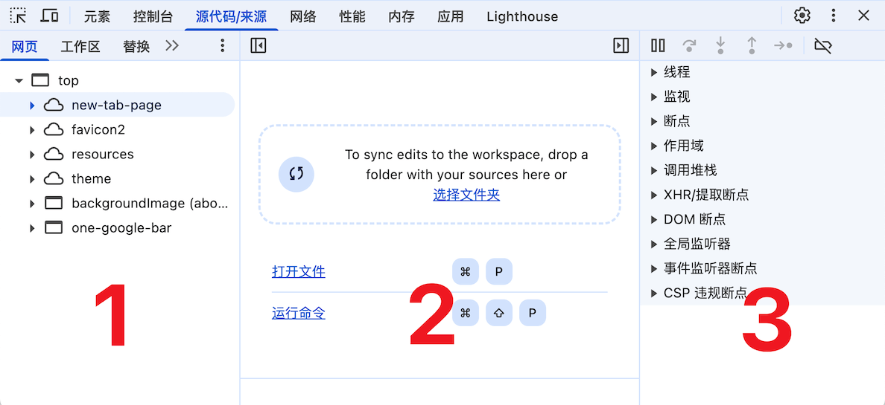

1. **文件导航（File Navigator）区域：** 列出了 HTML、JavaScript、CSS 和图片等资源，浏览器扩展程序的资源也会在这里显示
1. **代码编辑（Code Editor）区域：** 展示源码
1. **JavaScript 调试（JavaScript Debugging）区域：** 用于调试的，可以查看断点、观察表达式的值以及变量作用域，还有调用栈等信息


**控制台**

按下 `Esc`，下方会出现一个控制台，可以输入一些命令然后按下 `Enter` 来执行。

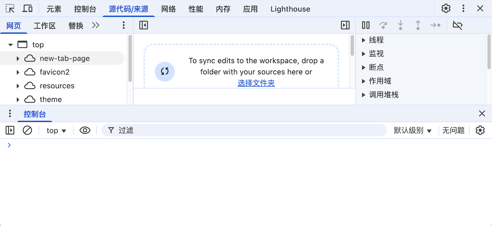


**断点**

**断点是调试器自动暂停 JavaScript 执行的地方**。

点击代码编辑区域代码行前的数字，就可以设置一个断点，例如下面给 `4`、`8` 行各设置一个断点。

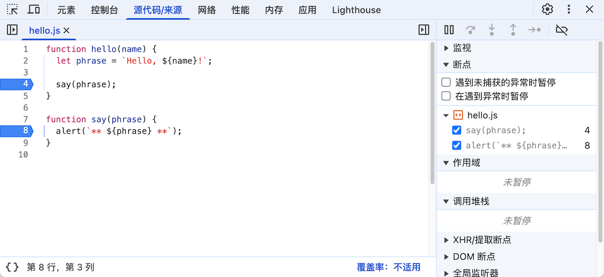

- 在右侧面板中可以找到断点的列表，点击可以快速跳转到代码中的断点

- 取消前面的勾选可以临时禁用对应的断点
  
  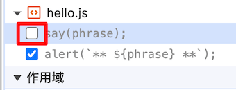
  
- 可以通过右键单击并选择来删除一个断点

  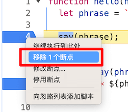

- 在行号前右键单击修改可以创建一个条件断点，**只有当给定的表达式为真时才会被触发，适合需要在特定的变量值或参数的情况下暂停程序执行时的调试**

  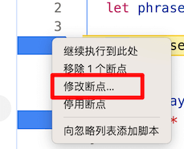

  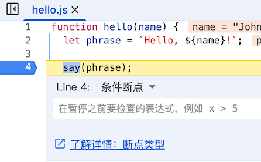

**debugger 命令**

可以在代码中使用 `debugger` 命令来暂停代码的执行。

```js
function hello(name) {
  let phrase = `Hello, ${name}!`;

  debugger;  // 调试器会在这停止

  say(phrase);
}
```

**⚠️ 注意：** `debugger` 命令只有在开发者工具打开时才有效，否则浏览器会忽略它。


**暂停并查看**

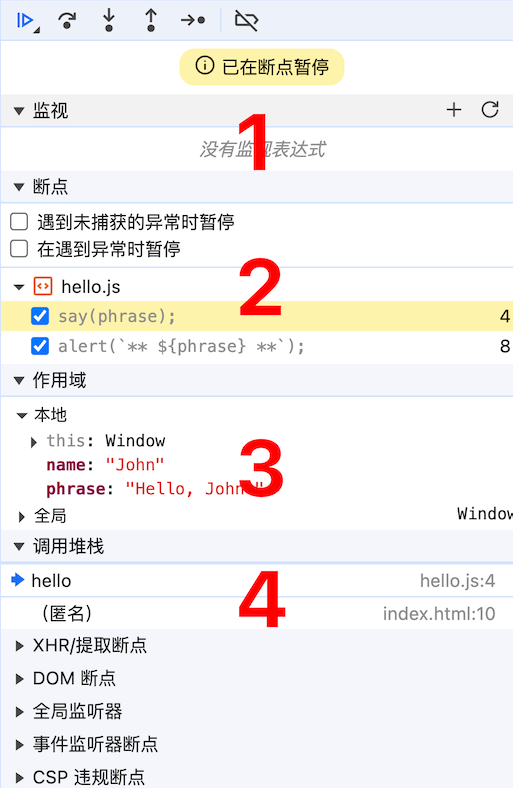

1. **监视（Watch）：显示任意表达式的当前值** 

   可以通过点击加号 `+`，然后输入一个表达式，调试器将显示它的值，并在执行过程中自动重新计算该表达式。

2. **断点（Breakpoints）：显示当前的断点以及断点所在的文件及行号**

3. **作用域（Scope）：显示当前的变量**

   - “本地（`Local`）” 显示**当前函数中的变量**，可以在源代码中看到它们的值高亮显示了出来
     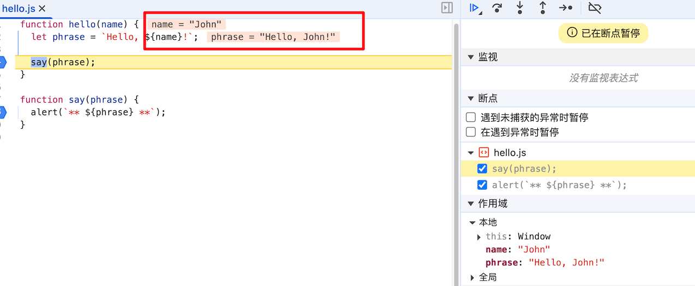
   - “全局（`Global`）” 显示全局变量（**不在任何函数中**）

4. **调用堆栈（Call Stack）：显示嵌套的调用链**

   上图中调试器正在 `hello()` 的调用链中，被 `index.html` 中的一个脚本调用（因为这里没有函数，所以显示 “匿名（anonymous）”）。


**跟踪执行**


1. **继续执行脚本：快捷键 `F8`** 

   如果没有其它断点，程序会继续执行，并且调试器不会再控制程序。

2. **跳过下一个函数调用：快捷键 `F10`**

   运行下一条（即当前行）指令，如果是函数调用则不会进入函数中。

   **⚠️ 注意：** 这里的函数指的是：不是内建的如 `alert` 函数等，而是我们自己写的函数。

3. **进入下一个函数调用：快键键 `F11`** 

   运行下一条（即当前行）指令，如果是函数是异步函数，则会等待一段时间后再执行，反之与单步调试类似。

4. **跳出当前函数：快键键 `Shift+F11`**

   继续执行当前函数内的剩余代码，并暂停在调用当前函数的下一行代码处。

   适用于使用单步调试偶然进入到一个嵌套调用，但是又对这个函数不感兴趣时，想要尽可能的继续执行到最后的情况。

5. **单步调试：快键键 `F9`**

   运行下一条语句。

   如果一次接一次地点击此按钮，整个脚本的所有语句会被逐个执行。

6. **启用/停用断点**

   一个批量操作断点是否启用的开关。


**出现错误时自动暂停脚本执行**


如果勾选启动这两个功能，在开发者工具开着的情况下，任何脚本执行错误都会导致该脚本执行自动暂停，然后就可以分析变量为什么出错。


**继续执行到此处**

在调试开始的情况下，在代码中的某一行上右键，可以看到 **“继续执行到此处（Continue to here）”** 的选项。

适用于想要向前移动很多步到某一行为止，但是又懒得设置一个断点。

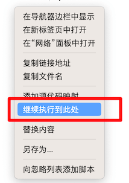


**日志记录**

通过 `console.log` 函数将内容输出在控制台中。

```js
console.log('Hello World');
```

在代码中有足够的日志记录，那么可以从记录中看到发生了什么，而不需要借助调试器。


## 代码风格

代码必须尽可能的清晰和易读。


**花括号**

- 如果代码短的话，可以只写成一行

  ```js
  if (n < 0) alert(`Power ${n} is not supported`);
  ```

- 最好的方式，这样更具有可读性

  ```js
  if (n < 0) {
    alert(`Power ${n} is not supported`);
  }
  ```


**行的长度**

没有人喜欢读一长串代码，最好将代码分割一下。

```js
// 回勾引号 ` 允许将字符串拆分为多行
let str = `
  ECMA International's TC39 is a group of JavaScript developers,
  implementers, academics, and more, collaborating with the community
  to maintain and evolve the definition of JavaScript.
`;
```

对于 `if` 语句：

```js
if (
  id === 123 &&
  moonPhase === 'Waning Gibbous' &&
  zodiacSign === 'Libra'
) {
  letTheSorceryBegin();
}
```

**⚠️ 注意：** 一行代码的最大长度应该在团队层面上达成一致，通常是 80 或 120 个字符。


**缩进**

- **水平方向上的缩进：2 或 4 个空格**

  一个水平缩进通常由 2 或 4 个空格或者 “Tab” 制表符（Tab 键）构成，目前空格使用更普遍一点。

  ```js
  show(
    parameters,
    aligned, // 左边有 2 个空格
    one,
    after,
    another
    ) {
    // ...
  }
  ```

- **垂直方向上的缩进：用于将代码拆分成逻辑块的空行**

  即使是单个函数通常也被分割为数个逻辑块。

  ```js
  function pow(x, n) {
    let result = 1;
    //              <--
    for (let i = 0; i < n; i++) {
      result *= x;
    }
    //              <--
    return result;
  }
  ```

  **⚠️ 注意：** 插入一个额外的空行有助于使代码更具可读性，写代码时，**不应该出现连续超过 9 行都没有被垂直分割的代码**。


**分号**

每一个语句后面都应该有一个分号，即使 JavaScript 可以省略分号。

**⚠️ 注意：** 有经验的 JavaScript 程序员可以选择无分号的代码风格，否则最好还是使用分号来避免可能出现的陷阱。


**嵌套的层级**

尽量避免代码嵌套层级过深。

- 不好的做法

  ```js
  function pow(x, n) {
    if (n < 0) {
      alert("Negative 'n' not supported");
    } else {
      let result = 1;
  
      for (let i = 0; i < n; i++) {
        result *= x;
      }
  
      return result;
    }
  }
  ```

- 好的做法

  ```js
  function pow(x, n) {
    if(n < 0) {
      alert("Negative 'n' not supported");
      return;
    }
  
    let result = 1;
  
    for (let i = 0; i < n; i++) {
      result *= x;
    }
  
    return result;
  }
  ```

  第二个代码比第一个代码更具有可读性，`n < 0` 特殊情况在一开始就被处理。


**函数位置**

有三种方式来组织函数定义和函数使用代码的位置。

1. 在调用函数的代码**上方**声明函数

   ```js
   // 函数声明
   function createElement() {
     ...
   }
   
   function setHandler(elem) {
     ...
   }
   
   function walkAround() {
     ...
   }
   
   // 调用函数的代码
   let elem = createElement();
   setHandler(elem);
   walkAround();
   ```

2. 先写调用函数的代码，再写声明函数

   ```js
   // 调用函数的代码
   let elem = createElement();
   setHandler(elem);
   walkAround();
   
   // 函数声明
   function createElement() {
     ...
   }
   
   function setHandler(elem) {
     ...
   }
   
   function walkAround() {
     ...
   }
   ```

3. 混合使用

   ```js
   // 调用函数的代码
   let elem = createElement();
   
   // 函数声明
   function createElement() {
     ...
   }
   
   // 调用函数的代码
   setHandler(elem);
   
   // 函数声明
   function setHandler(elem) {
     ...
   }
   
   // 调用函数的代码
   walkAround();
   
   // 函数声明
   function walkAround() {
     ...
   }
   ```

**⚠️ 注意：** 大多数情况下，使用第二种方式更好，因为在阅读代码时，我们首先想要知道的是它执行了哪些函数，不一定要阅读这些函数具体的内容


**风格指南**

有很多受欢迎现成的风格指南：

- [Google JavaScript 风格指南](https://google.github.io/styleguide/jsguide.html)
- [Airbnb JavaScript 风格指南](https://github.com/airbnb/javascript)
- [Idiomatic.JS](https://github.com/rwaldron/idiomatic.js)
- [StandardJS](https://standardjs.com/)


**自动检查器**

检查器（Linters）是可以自动检查代码样式，还可以发现一些代码错误。

有很多出名的代码检查工具：

- [JSLint](https://www.jslint.com/)：最早一批检查器之一
- [JSHint](https://www.jshint.com/)：比 JSLint 多了更多设置
- [ESLint](https://eslint.org/)：最新的一个检查器

**推荐使用 ESLint，目前也是前端中用的最多的检查器之一**。


##  注释

**在好的代码中，“解释性” 的注释应该是最少的。**

不推荐像下面这样的注释：

```js
// 这里的代码会先做这件事（……）然后做那件事（……）
// ……谁知道还有什么……
very;
complex;
code;
```

一个很棒的原则：“如果代码不够清晰以至于需要一个注释，那么或许它应该被重写。”


**用函数替代注释**

用一个函数来代替一个代码片段是更好的

```js
function showPrimes(n) {
  nextPrime:
  for (let i = 2; i < n; i++) {

    // 检测 i 是否是一个质数（素数）
    for (let j = 2; j < i; j++) {
      if (i % j == 0) continue nextPrime;
    }

    alert(i);
  }
}
```

上述代码可以调整为

```js
function showPrimes(n) {

  for (let i = 2; i < n; i++) {
    if (!isPrime(i)) continue;

    alert(i);
  }
}

function isPrime(n) {
  for (let i = 2; i < n; i++) {
    if (n % i == 0) return false;
  }

  return true;
}
```


**为代码块创建函数替代注释**

```js
// 在这里我们添加威士忌
for(let i = 0; i < 10; i++) {
  let drop = getWhiskey();
  smell(drop);
  add(drop, glass);
}

// 在这里我们添加果汁
for(let t = 0; t < 3; t++) {
  let tomato = getTomato();
  examine(tomato);
  let juice = press(tomato);
  add(juice, glass);
}
```

上述代码可以调整为
```js
addWhiskey(glass);
addJuice(glass);

function addWhiskey(container) {
  for(let i = 0; i < 10; i++) {
    let drop = getWhiskey();
    smell(drop);
    add(drop, glass);
  }
}

function addJuice(container) {
  for(let t = 0; t < 3; t++) {
    let tomato = getTomato();
    examine(tomato);
    let juice = press(tomato);
    add(juice, glass);
  }
}
```

函数本身就可以说明功能，所以可以不需要注释，每一个函数做什么、需要什么和返回什么都非常地清晰。

**⚠️ 注意：** 在实际开发中，**不能完全避免 “解释型” 注释**，例如在一些复杂的算法中，会有一些出于优化的目的而做的一些巧妙的 “调整”，但通常情况下，应该尽可能地保持代码的简单和 “自我描述” 性。


**好的注释**

一种专门用于记录函数的语法  JSDoc，可以用来描述函数的用法、参数和返回值。

```js
/**
 * 返回 x 的 n 次幂的值
 *
 * @param {number} x 要改变的值。
 * @param {number} n 幂数，必须是一个自然数
 * @return {number} x 的 n 次幂的值
 */
function pow(x, n) {
  ...
}
```

在类似 VSCode、WebStorm 这样的编辑器中，都可以很好地理解和使用这些注释，来提供自动补全和一些自动化代码检查工作。

像 [JSDoc 3](https://github.com/jsdoc/jsdoc) 这样的工具，可以通过注释直接生成 HTML 文档。


## Polyfill 和转译器

JavaScript 语言在稳步发展，有很多新的特性在老的浏览器上无法很好的支持，所以要让现代的代码能够正常运行在旧引擎的浏览器上，需要使用 Polyfill 和转译器。


**转译器（Transpilers）**

**转译器是一种可以将源码转译为另一种源码的软件**，它可以解析现代代码，并使用旧的语法结构进行重写，使其可以在旧的引擎上工作。

例如在 ES2020 之前没有 “空值合并运算符” `??`，旧的引擎不明白 `height = height ?? 100` 这段代码的含义，所以需要使用转译器。

-  在运行转译器之前：

  ```js
  height = height ?? 100;
  ```

- 运行转译器之后：

  ```js
  height = (height !== undefined && height !== null) ? height : 100;
  ```

通常，会在自己的计算机上运行转译器，然后将转译后的代码部署到服务器。

[Babel](https://babeljs.io/) 是最著名的转译器之一，通常会在现代项目构建系统（例如 [Webpack](https://webpack.js.org/)）中集成转译器，在每次代码更改时自动运行转译器的方法。


**垫片（Polyfills）**

新的语言特性可能不仅包括语法结构和运算符，还可能包括内建函数。

垫片可以用来添加缺少的特性。

例如 `Math.trunc(n)` 是一个“截断” 数字小数部分的函数，在旧的 JavaScript 引擎中不支持，此时谈论的是新函数，而不是语法更改，因此无需在转译任何内容，而是要**补全缺失的函数。**

```js
if (!Math.trunc) { // 如果没有这个函数
  // 实现它
  Math.trunc = function(number) {
    return number < 0 ? Math.ceil(number) : Math.floor(number);
  };
}
```

`Math.ceil` 和 `Math.floor` 老的 JavaScript 引擎都支持。

[Core.js](https://github.com/zloirock/core-js) 是著名的 Polyfill 库之一，支持很多特性，允许只包含需要的特性。


## 对象

原始类型的值只能存储一种东西（字符串，数字或者其他），但对象可以用来存储键值对和更复杂的实体。


**创建对象**

有以下两种语法可以创建一个空的对象。

```js
let user = new Object(); // “构造函数” 的语法
let user = {};  // “字面量” 的语法
```


**对象属性**

可以在创建对象的时候，立即将一些属性以**键值对**的形式放入 `{...}` 中。

```js
let user = {
  name: 'CodePencil',  // 键 name，值 CodePencil
  age: 23,             // 键 age，值 23
};
```

位于冒号 `:` 前面的是键（`key`）,也叫做属性名，值（`value`）在冒号的后面。

也可以使用多字词语作为属性名，但是**必须加上引号：**

```js
let user = {
  name: 'CodePencil',
  age: 23,
  'likes birds': true,  // 多词属性名必须加引号
};
```

**⚠️ 注意：列表中的最后一个属性应以逗号结尾**，这叫做尾随（trailing）或悬挂（hanging）逗号，便于添加、删除和移动属性。


**访问属性值**
可以使用点操作符 `.` 访问属性值。

```js
alert(user.name); // CodePencil
alert(user.age); // 23
```


**修改属性**

可以通过 `=` 来修改对象属性的值，**属性的值可以是任意类型**，例如添加布尔类型。

```js
user.isAdmin = true;
```


**删除属性**

可以使用 `delete` 操作符来移除属性。

```js
delete user.age;
```


**方括号**

对于多字词语的属性，无法使用点操作符 `.` 。

```js
// 这将提示有语法错误
user.likes birds = true; // Uncaught SyntaxError: Unexpected identifier 'birds'
```

JavaScript 会认为在处理 `user.likes`，然后遇到意外的 `birds` 时给出语法错误。

**点符号要求 `key` 是有效的变量标识符。这意味着：不包含空格，不以数字开头，也不包含特殊字符（允许使用 `$` 和 `_`）。**

这时可以使用方括号，可以用于任何字符串。

```js
let user = {};

// 设置
user['likes birds'] = true;

// 读取
alert(user['likes birds']); // true

// 删除
delete user['likes birds'];
```

**⚠️ 注意：** 方括号中的字符串要放在引号中，单引号或双引号都可以。

方括号中也支持通过任意表达式来获取属性名的方式。

```js
let key = 'likes birds';

user[key] = true; // 等价于 user['likes birds'] = true;
```

但点符号 `.` 不支持这样。

```js
let user = {
  name: 'CodePencil',
  age: 23,
};

let key = 'name';
alert(user.key); // undefined
```


**计算属性**

创建一个对象时，可以在对象字面量中使用方括号，这被称为计算属性。

```js
let fruit = prompt('Which fruit to buy?', 'apple');

let bag = {
  [fruit]: 5, // 属性名是从 fruit 变量中得到的
};

alert(bag.apple); // 5 如果 fruit='apple'
```

也支持使用更复杂的表达式：

```js
let fruit = 'apple';
let bag = {
  [fruit + 'Computers']: 5, // bag.appleComputers = 5
};
```

**⚠️ 注意：** 

- 当属性名是已知且简单的时候，就使用点符号
- 如果需要一些更复杂的内容，就使用方括号


**属性简写**

在实际开发中，通常用已存在的变量当做属性名。

```js
function makeUser(name, age) {
  return {
    name: name,
    age: age,
    // ……其他的属性
  };
}

let user = makeUser('CodePencil', 23);
alert(user.name); // CodePencil
```

上述代码中属性名跟变量名一样，此时可以使用一种**属性值缩写**方法，使属性名变得更短。

```js
function makeUser(name, age) {
  return {
    name, // 与 name: name 相同
    age,  // 与 age: age 相同
    // ...
  };
}
```

属性名简写方式可以和正常方式混用。

```js
let user = {
  name,   // 与 name:name 相同
  age: 30,
};
```


**属性名限制**

- **属性名可以是任何字符串或者 `symbol`，使用 JavaScript 的保留字也没问题**

  ```js
  let obj = {
    for: 1,
    let: 2,
    return: 3,
  };
  
  alert( obj.for + obj.let + obj.return );  // 6
  ```

- **其它类型的属性名会被自动转换为字符串**

  ```js
  let obj = {
    0: 'test', // 等同于 '0': 'test'
  };
  
  // 都会输出相同的属性（数字 0 被转为字符串 '0'）
  alert(obj['0']); // test
  alert(obj[0]);   // test (相同的属性)
  ```


**⚠️ 注意：** 名为 `__proto__` 的属性，不能将它设置为一个非对象的值。

```js
let obj = {};
obj.__proto__ = 5; // 分配一个数字
alert(obj.__proto__); // [object Object]
```

上述代码中赋值结果与预期不符，具体解决方案可以参考原型链相关的内容。


**属性存在测试符 “in” 操作符**

JavaScript 的对象中能够访问任何属性，即使属性不存在也不会报错。

读取不存在的属性只会得到 `undefined`，可以通过以下方式判断属性是否存在。

```js
let user = {};

alert( user.noSuchProperty === undefined ); // true 表示该属性不存在
```

也可以使用操作符 `in` 来检测属性是否存在。

语法：

```js
'key' in object
```

例如：

```js
let user = { age: 23, };

let key = 'age';
alert(key in user); // true，属性 'age' 存在
```

**⚠️ 注意：** 如果对象中一个属性存在，但是存储的值是 `undefined` 的时候，只能使用 `in` 符号来检测属性是否存在。

```js
let obj = {
  test: undefined,
};

alert(obj.test); // 显示 undefined，所以属性不存在？

alert('test' in obj); // true，属性存在！
```

通常情况下不应该给对象的属性赋值 `undefined`，会用 `null` 来表示未知的或者空的值。


**for in 遍历对象属性**

用于遍历一个对象的所有键（`key`）。

语法：

```js
for (key in object) {
  // 对此对象属性中的每个键执行的代码
}
```

例如：

```js
let user = {
  name: 'CodePencil',
  age: 23,
  isAdmin: true,
};

for (let key in user) {
  // keys
  alert(key);  // name, age, isAdmin
  // 属性键的值
  alert(user[key]); // CodePencil, 23, true
}
```

也可以用其他属性名来替代 `key`，例如 `for(let prop in obj)` 也很常用。


**对象属性顺序**

使用 `for in` 遍历对象属性有特别的顺序，**整数属性会被进行排序，其他属性则按照创建的顺序显示**。

```js
let codes = {
  '49': 'Germany',
  '41': 'Switzerland',
  '44': 'Great Britain',
  '1': 'USA',
};

for(let code in codes) {
  alert(code); // 1, 41, 44, 49
}
```

**整数属性：** 指的是一个可以在不做任何更改的情况下与一个整数进行相互转换的字符串。

例如 `'49'` 是一个整数属性名，因为我们把它转换成整数，再转换回来，它还是一样的，但是 `'+49'` 和 `'1.2'` 就不行了：

```js
// Number(...) 显式转换为数字
// Math.trunc 是内建的去除小数部分的方法。
alert( String(Math.trunc(Number('49'))) );  // '49'，相同，整数属性
alert( String(Math.trunc(Number('+49'))) ); // '49'，不同于 '+49' ⇒ 不是整数属性
alert( String(Math.trunc(Number('1.2'))) ); // '1'，不同于 '1.2' ⇒ 不是整数属性
```

对于非整数属性，就按照创建时的顺序来排序，例如：

```js
let user = {
  name: 'John',
  surname: 'Smith'
};
user.age = 25; // 增加一个

// 非整数属性是按照创建的顺序来排列的
for (let prop in user) {
  alert( prop ); // name, surname, age
}
```

如果同时有整数属性和非整数属性，则会先输出整数属性（从小到大），再输出非整数属性（添加顺序），例如：

```js
let codes = {
  name: 'CodePencil',
  44: 'Great Britain',
  1: 'USA',
};

codes.age = 23;

for (let code in codes) {
  alert(code); // 1, 44, name, age
}
```


## 对象复制和引用

对象： “通过引用” 存储和复制的。

原始类型：字符串、数字、布尔值等总是 “作为一个整体” 复制。


例如将 `message` 复制到 `phrase`。

```js
let message = 'Hello!';
let phrase = message;
```


但对象不是这样。

**赋值了对象的变量存储的不是对象本身，而是该对象 “在内存中的地址”，简单来说就是对该对象的 “引用”**。

```js
let user = {
  name: 'John',
};
```

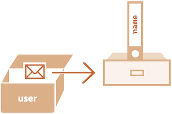

所以当一个对象变量被复制，**其实是引用被复制，而该对象自身并没有被复制**。

```js
let user = { name: 'John' };

let admin = user; // 复制引用
```

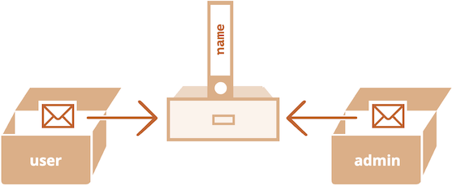

```js
let user = { name: 'John' };

let admin = user;

admin.name = 'Pete'; // 通过 'admin' 引用来修改

alert(user.name); // 'Pete'，修改能通过 'user' 引用看到
```


**对象比较**

只有当两个对象为同一对象时，两者才相等。

- 这里 `a` 和 `b` 两个变量都引用同一个对象，所以它们相等

  ```js
  let a = {};
  let b = a; // 复制引用
  
  alert(a == b);  // true，都引用同一对象
  alert(a === b); // true
  ```

- 两个独立的对象则并不相等，即使它们都是 `{}`

  ```js
  let a = {};
  let b = {}; // 两个独立的对象
  
  alert( a == b ); // false
  ```

对于 `obj1 > obj2` 的比较，或者跟一个原始类型值的比较 `obj == 5` 时，**对象都会被转换为原始值**。

**⚠️ 注意：** 通常来说很少需要这样的比较，通常是在编程错误的时候才会出现这种情况。


**浅拷贝**

如果要复制一个对象，可以通过遍历已有对象的属性，在原始类型值的层面复制它们。

```js
let user = {
  name: 'John',
  age: 23,
};

let clone = {}; // 新的空对象

// 将 user 中所有的属性拷贝到其中
for (let key in user) {
  clone[key] = user[key];
}

clone.name = 'CodePencil';

alert(user.name); // 原来的对象中的 name 属性依然是 John
```

也可以使用 `Object.assign` 方法达到同样的效果。

语法：

```js
Object.assign(dest, [src1, src2, src3...])
```

- `dest` 是指目标对象
- `src1, ..., srcN` 是指源对象（可按需传递多个参数）

该方法可以**将第二个开始的所有参数的属性都被拷贝到第一个参数的对象中**，重写前面的例子：

```js
let user = {
  name: 'John',
  age: 23,
};

let clone = Object.assign({}, user);
```

上述代码中 `Object.assign` 将 `user` 对象中所有的属性都拷贝到一个空对象中，并返回这个新的对象。


**深拷贝**

如果对象的属性是其它对象的引用。

```js
let user = {
  name: 'CodePencil',
  sizes: {
    height: 182,
    width: 50,
  }
};

let clone = Object.assign({}, user);

alert( user.sizes === clone.sizes ); // true，同一个对象
```

使用 `Object.assign` 克隆的新对象的 `sizes` 属性依旧是引用形式被拷贝。

这时需要使用递归并进行拷贝循环来检查 `user[key]` 的每个值，如果它是一个对象，那么也复制它的结构。

**推荐使用 lodash 库的 [_.cloneDeep(obj)](https://lodash.com/docs#cloneDeep)**。


**使用 const 声明的对象也是可以被修改的**

```js
const user = {
  name: 'John',
};

user.name = 'CodePencil'; // 这行不会报错

alert(user.name); // CodePencil
```

上述代码中 `user` 变量**必须始终引用同一个对象**，但该对象的属性可以被自由修改。


## 垃圾回收

JavaScript 的内存管理是自动、无形的，创建的变量、对象、函数...这一切都会占用内存。


**可达性（Reachability）**

JavaScript 中主要的内存管理概念是**可达性**。

**可达： 是指那些以某种方式可访问或可用的值，它们被存储在内存中**。


以下是**固有可达集合**，这些值明显不能被释放：

- 当前执行的函数，它的局部变量和参数

- 当前嵌套调用链上的其它函数、它们的局部变量和参数

- 全局变量

- （还有一些其他的，内部实现，例如：比如闭包环境、定时器队列等）

这些值都被称作为**根（roots）**。


如果一个值可以**从根通过引用或者引用链进行访问**，则认为该值是可达的，例如下面的例子：

```js
// user 具有对这个对象的引用
let user = {
  name: 'John'
};
```

`user` 是全局变量，引用了对象 `{name：'John'}`，此时该对象是可达的。

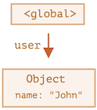

如果 `user` 变量的值被重写，则该引用就没了：

```js
user = null;
```

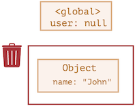

此时对象 `{name：'John'}` 变成不可达了，垃圾回收器会认为它是垃圾数据并进行回收，然后释放内存。


如果同时有两个变量引用同一个对象。

```js
let user = {
  name: 'John'
};

let admin = user;
```

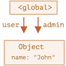

此时如果执行之前的操作

```js
user = null;
```

对象 `{name：'John'}` 依旧可达，因为它还被 `admin` 这个全局变量所引用，因此它必须被保留在内存中，如果我们再对 `admin` 变量赋值为 `null`，那么该对象就变为不可达，会被删除。


**相互关联的对象**

```js
function marry(man, woman) {
  woman.husband = man;
  man.wife = woman;

  return {
    father: man,
    mother: woman
  }
}

let family = marry({
  name: 'John'
}, {
  name: 'Ann'
});
```

`marry` 函数让两个对象相互引用，使它们 “结婚”，并返回一个包含着两个对象的一个对象，此时内存结构如下图：

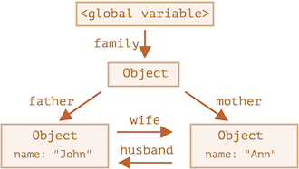

全局变量 `family` 引用着一个对象，这对象又引用着两个对象，两个对象之间又相互引用，此时所有对象都是可达的。

此时如果移除两个引用：

```js
delete family.father;
delete family.mother.husband;
```

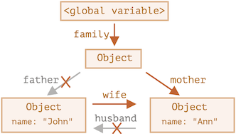

此时再也没有对 `John` 对象的引用，**对外引用不重要，只有传入引用才可以使对象可达**，所以此时 `John` 对象不可达，将从内存中删除。

最后的结果：

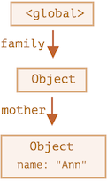


如果几个对象之间相互引用，但是**外部没有对其任意对象的引用**，那么这些对象也可能是不可达的，并从内存中删除，例如对前面的例子：

```js
family = null;
```

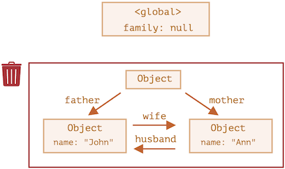

上图中，虽然 `John` 对象和 `Ann` 对象之间依旧相互引用，但没了外部对其的引用，它就变成了一座 “孤岛”，将从内存中删除。


**内部算法**

垃圾回收的基本算法被称为 “mark-and-sweep”。

定期执行以下“垃圾回收”步骤：

1. 垃圾收集器找到所有的根，并 “标记”（记住）它们
2. 然后它遍历并 “标记” 来自它们的所有引用
3. 然后它遍历标记的对象并标记 **它们的** 引用，所有被遍历到的对象都会被记住，以免将来再次遍历到同一个对象
4. ...如此操作，直到所有可达的（从根部）引用都被访问到
5. 没有被标记的对象都会被删除


例如有以下内存结构：

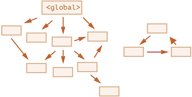

1. 标记所有的根

   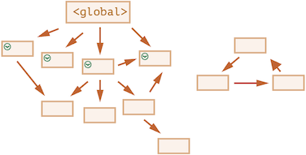

2. 跟随它们的引用标记它们所引用的对象

   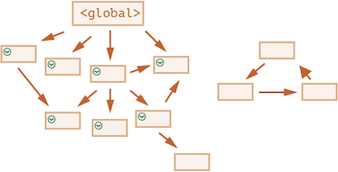

3. 如果还有引用的话，重复第二步，继续标记

   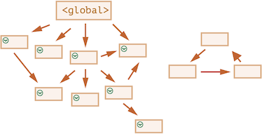

4. 无法通过这个过程访问到的对象，被认为是不可达，会从内存中删除

   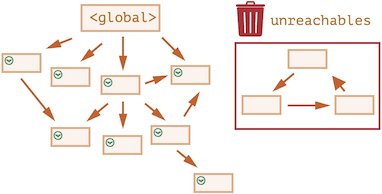

这个过程类似于从根溢出一大桶油漆，它流经所有引用并标记所有可达到的对象，然后移除未标记的。

**⚠️ 注意：** 

- JavaScript 引擎做了许多优化，使垃圾回收运行速度更快，并且不会对代码执行引入任何延迟
- 还有其它的垃圾回收算法的优化和风格，不过大多都是类似的


## 对象方法，"this"


**对象方法**

对象属性中的函数被称为**方法**。

```js
let user = {
  name: 'CodePencil',
  age: 23,
};

user.sayHi = function() {
  alert('Hello!');
};

user.sayHi(); // Hello!
```

也可以提前声明函数，然后再赋值给对象。

```js
let user = {
  name: 'CodePencil',
  age: 23,
};

// 首先，声明函数
function sayHi() {
  alert('Hello!');
}

// 然后将其作为一个方法添加
user.sayHi = sayHi;

user.sayHi(); // Hello!
```


**方法简写**

在对象字面量中，可以使用更短的语法来声明方法。

```js
let user = {
  sayHi: function() {
    alert('Hello');
  }
};
```

可以简化为：

```js
let user = {
  sayHi() {
    alert('Hello');
  }
};
```

**⚠️ 注意：** 这两种方式并不完全相等，在对象继承方面有一些细微的差别，**不过通常情况下更短的语法是首选**。


**方法中的 "this"**

通常对象的方法需要访问对象中存储的信息才能完成工作，**为了访问该对象，在方法中可以使用 `this` 关键字**。

在 JavaScript 中 **`this` 关键字的值是在代码运行时计算出来的，取决于代码上下文**。

简单来说，`this` 的值就是 `.` 之前的对象，即调用该方法的对象。

```js
let user = {
  name: 'CodePencil',
  age: 23,

  sayHi() {
    // this 指的是 “当前的对象”
    alert(this.name);
  }

};

user.sayHi(); // CodePencil
```

在 `user.sayHi();` 执行过程中，`this` 的值为 `user`。

**⚠️ 注意：** 前面的例子也可以不使用 `this`，通过外部变量来实现，但这样的代码是不可靠的，例如：

```js
let user = {
  name: 'CodePencil',
  age: 23,

  sayHi() {
    alert(user.name); // 'user' 替代 'this'
  }

};

let admin = user;
user = null;
admin.sayHi(); // Uncaught TypeError: Cannot read properties of null (reading 'name')
```

上述代码将 `user` 复制给另一个变量 `admin`，并赋 `null` 给 `user`，导致它访问错误的对象。


**"this" 不受限制**

在 JavaScript 中

