# JavaScript 笔记


## 简介

JavaScript 写出来的程序被称为**脚本**，可以直接运行在 HTML 网页中，在页面加载的时候会自动执行。

脚本**以纯文本的形式运行，不需要提前编译即可运行**。

JavaScript 与 Java 完全不同，有自己的语言规范 **ECMAScript**。

JavaScript 不仅可以在浏览器中执行，也可以在服务端执行，可以在搭载任意 **JavaScript 引擎**的设备中执行。

浏览器中嵌入了 JavaScript 引擎，也被称作 **“JavaScript 虚拟机”**，不同的引擎有不同的代号：

- **V8：** Chrome、Opera 和 Edge 中的 JavaScript 引擎
- **SpiderMonkey：** Firefox 中的 JavaScript 引擎
- **Chakra：** IE 中的 JavaScript 引擎
- **JavaScriptCore、SquirrelFish、Nitro：** 在 Safari 中并行使用的 JavaScript 引擎

JavaScript 引擎的工作步骤：

1. 读取脚本

2. 将脚本转化（“编译”）为机器语言

3. 运行机器语言代码

引擎会对每个步骤进行优化，在运行时监视脚本，分析获得的信息进一步优化机器语言代码。

JavaScript 的能力取决于它的运行环境，在浏览器中无法访问 CPU 和 内存，但在 Node.js 中可以读取、写入任意文件，执行网络请求等函数。

JavaScript 与其它编程语言主要不同之处：

- **与 HTML、CSS 完全集成**
- **简单的事，简单地完成**
- **被所有的主流浏览器支持，并且默认开启**

有很多其它语言可以编译为 JavaScript，提供更多的功能，这些语言有：

- [CoffeeScript](https://coffeescript.org/)：JavaScript 的一种语法糖，可以编写更清晰简洁的代码
- [TypeScript](https://www.typescriptlang.org/)：添加 “严格的数据类型” 以简化开发，更好地支持复杂系统的开发，由微软开发
- [Flow](https://flow.org/)：与 TypeScript 类似，不过是以另外一种方式实现，由 Facebook 开发。
- [Dart](https://www.dartlang.org/)：一门独立的语言，有自己的引擎，该引擎在非浏览器环境中运行（例如手机应用），它也可以被编译成 JavaScript，由 Google 开发
- [Brython](https://brython.info/)：Python 到 JavaScript 的转译器
- [Kotlin](https://kotlinlang.org/docs/reference/js-overview.html)：编写出的程序可以在浏览器和 Node 环境中运行


##  手册与规范

**规范**

- **规范草案：** https://tc39.es/ecma262/
- **即将纳入规范的新特性：** https://github.com/tc39/proposals

**手册**

- **MDN：** https://developer.mozilla.org/zh-CN/docs/Web/JavaScript/Reference

更加推荐使用搜索引擎输入 `MDN [关键字]` 来查询。

**兼容性表**

- **查看功能的支持表：** [https://caniuse.com](https://caniuse.com/) 
- **列有语言功能以及引擎是否支持这些功能的表格：** https://compat-table.github.io/compat-table/


## 代码编辑器

代码编辑器主要分为：IDE（集成开发环境）和轻量编辑器。


**IDE**

IDE 编辑器具有强大功能，是一个完整的 “开发环境”，通常来说有以下两个 IDE 推荐使用：

- [Visual Studio Code](https://code.visualstudio.com/)（跨平台，免费）
- [WebStorm](https://www.jetbrains.com/webstorm/)（跨平台，收费，目前对个人使用免费）


**轻量编辑器**

虽然没有 IDE 那么强大的功能，但是启动速度快，使用简单，主要用来快速打开和编辑文件。

轻量编辑器也可以通过安装各种插件来实现 IDE 的语法分析和代码补全功能，所以 “轻量编辑器” 和 IDE 也没有严格的界限。

推荐的轻量编辑器：

- [Sublime Text](http://www.sublimetext.com/)（跨平台，共享软件）
- [Vim](http://www.vim.org/)
- [Emacs](https://www.gnu.org/software/emacs/)

**代码编辑器没有最好的，取决于个人的习惯和喜好。**


## 开发者控制台

控制台可以用来查看错误、执行命令、检查变量，**推荐使用 Chrome 或 Firefox 进行开发**，因为它们有最好的开发者工具。

大多浏览器都是通过 `F12` 来打开开发者工具。

**Chrome 直接打开控制台快捷键**

- Mac：`Command + Option + J` 或者 `Command + Option + I`
- Windows：`Ctrl + Shift + J` 或者 `Ctrl + Shift + I`

**Firefox 直接打开控制台快捷键**

- Mac：`Command + Option + K`
- Windows：`Ctrl + Shift + K`

**Safari 直接打开控制台快捷键**

- Mac：`Command + Option + C`

**⚠️ 注意：** Safari 需要**先提前在设置中开启“网页开发者功能”** ，“设置” -> “高级” -> “显示网页开发者功能”。


在控制台中 `>` 标志处表示命令行，可以输入 JavaScript 命令，按下 `Enter` 执行，如果需要输入多行代码则使用 `Shift + Enter` 来进行换行。


## script 标签

`<script>` 标签可以将 JavaScript 程序插入到 HTML 文档的任意位置。

```html
<!DOCTYPE HTML>
<html>
<body>
  <p>script 标签之前...</p>
  <script>
    alert('Hello, world!');
  </script>
  <p>...script 标签之后</p>
</body>
</html>
```

当浏览器遇到了 `<script>` 标签，内部代码会自动运行。

`<script>` 标签有以下几个特性（attribute）：

- **`type`：** 在过去需要指定为 `type="text/javascript"`，现在不再需要，现代 HTML 标准已经完全改变了此特性的含义，用于指定 JavaScript 模块 `type="module"`，**`type` 特性是可选的**

- **`language`：** 在过去用于指定脚本使用的语言，现在没有任何意义，语言默认是 JavaScript，**不需要再使用它**

- **`src`：** 用于引入外部 JavaScript 代码

  ```html
  <script src="/path/to/script.js"></script>
  ```

  可以是相对路径，也可以是绝对路径引入。

  如果要引入多个脚本，需要使用多个标签。

  ```html
  <script src="/js/script1.js"></script>
  <script src="/js/script2.js"></script>
  ...
  ```

  **⚠️ 注意：** 

  - 只有最简单的脚本才嵌入到 HTML 中。**更复杂的脚本推荐存放在单独的文件中**，使用独立文件的好处是浏览器会下载它，并保存在浏览器的缓存中，之后再访问该文件就是从缓存中获取，而不是下载，可以节省流量，使页面加载更快。

  - **如果设置了** `src` **特性，**`<script>` **标签的内容将会被忽略**

    ```html
    <script src="file.js">
      alert(1); // 此内容会被忽略，因为设定了 src
    </script>
    ```

    如果要上述代码正常工作，可以将它们分成两个标签。

    ```html
    <script src="file.js"></script>
    <script>
      alert(1);
    </script>
    ```

    

**脚本前后的注释**

```html
<script type="text/javascript"><!--
    ...
//--></script>
```

这些注释是用于不支持 `<script>` 标签的古老的浏览器隐藏 JavaScript 代码的，**现代 JavaScript 已经不这样使用了**。


## 代码结构


**语句**

语句是执行行为（action）的语法结构和命令，例如：`alert('Hello, world!');` 就是用来显示消息的语句。

可以在代码中编写任意数量的语句，语句之间可以使用分号进行分割。

```js
alert('Hello'); alert('World');
```

通常每个语句独占一行，用来提高语句的可读性。

```js
alert('Hello');
alert('World');
```


**分号**

当存在换行符（line break）时，大多数情况下可以省略分号。

```js
alert('Hello')
alert('World')
```

这时 JavaScript 会将换行符理解为 “隐式” 的分号，这也被称为**自动分号插入**。

并不是所有换行符都会理解为分号

```js
alert(3 +
1
+ 2);
```

代码输出结果是 `6`，这里 JavaScript 没有插入分号，因为如果插入分号，一行以 `+` 号结尾，就不是一个 “完整的表达式”。


**存在 JavaScript 无法确定是否真的需要自动插入分号的情况**

```js
alert('Hello');

[1, 2].forEach(alert);
```

这段代码在有分号的时候是先显示 `Hello`，然后显示 `1`，再然后是 `2`。

如果不加分号是这样的

```js
alert('Hello')

[1, 2].forEach(alert)
```

输出结果为先显示 `Hello`，后面不会再有数字出现，然后控制台出现报错信息。


上述代码会被 JavaScript 理解为

```js
alert('Hello')[1, 2].forEach(alert);
```

**⚠️ 注意：** 虽然大多数的时候可以省略分号，**但最好不要省略分号**。


## 注释

注释用于描述代码它做了什么和为什么要这样做。不会影响代码的执行，引擎会忽略它们。

- 单行注释

  ```js
  // 这行注释独占一行
  alert('Hello');
  
  alert('World'); // 这行注释跟随在语句后面
  ```

- 多行注释

  ```js
  /* 两个消息的例子。
  这是一个多行注释。
  */
  alert('Hello');
  alert('World');
  ```

**⚠️ 注意：**

- 大多数的编辑器都支持使用 `Ctrl + /` 快捷键添加单行注释，`Ctrl + Shift + /` 进行多行注释

- **多行注释不支持嵌套注释**，例如下面这段代码注释会出问题

  ```js
  /*
    /* 嵌套注释 ?!? */
  */
  alert('World');
  ```

- 注释虽然会增加代码量，但很多工具会在代码构建打包时缩减代码，移除注释，这样注释就不会产生任何影响。


## 现代模式 'use strict'

在过去 JavaScript 不断的向前发展，一直在增加新的特性，同时保持旧的功能没有改变，这样做有利于兼容旧的代码，**缺点就是 JavaScript 创造者的任何错误或不完善的决定也将永远被保留在 JavaScript 语言中**。

直到 2009 年 ECMAScript 5 (ES5) 的出现，改变了这个情况，增加了新的语言特性的同时又修改了一些已经存在的特性。但为了确保旧的功能能够使用，所以大部分修改默认是不生效的，需要使用一个特殊的指令 `'use strict'` 来告诉浏览器启用这些特性。


**'use strict'**

该指令像一个字符串，双引号和单引号都可以使用。

```js
'use strict';
// 代码以现代模式工作
...
```

**⚠️ 注意：**

- **必须确保 `'use strict'` 出现在脚本的最顶部**，否则严格模式无法启用，**只有注释可以出现在 `'use strict'` 的上面**

  ```js
  alert('some code');
  // 下面的 "use strict" 会被忽略，必须在最顶部。
  
  'use strict';
  
  // 严格模式没有被激活
  ```

- `'use strict'`  也可以放在函数体的顶部，这样可以只在该函数中启用严格模式，不过**通常会在整个脚本中启用严格模式**

- **没有办法取消 `'use strict'`**，一旦进入了严格模式，就没有回头路了

- **在浏览器的开发者控制台中，默认是不启用 `'use strict'` 严格模式**

  如果需要启用严格模式，可以在控制台搭配 `Shift + Enter` 来换行输入多行代码，将 `'use strict'`放在代码的顶部。

  ```js
  'use strict'; <Shift+Enter 换行>
  //  ...你的代码
  <按下 Enter 以运行>
  ```

  对于旧版本的浏览器，可以将代码放入以下的包装器中。

  ```js
  (function() {
    'use strict';
    
    // ...你的代码...
  })()
  ```
  
- **建议始终使用严格模式开发，在现代 JavaScript 支持的 `class` 和 `module` 中会自动启用 `'use strict'`**，所以如果使用它们就不需要手动添加 `'use strict'`


## 变量

变量是数据的 “命名存储”，在 JavaScript 中**使用 `let` 关键字创建一个变量**。

```js
let message;
```

这段代码表示**声明**或者**定义**了一个名为 `message` 的变量，可以**通过赋值运算符 `=` 为变量添加数据**。

```js
let message;
message = 'Hello'; // 将字符串 'Hello' 保存在名为 message 的变量中
```

此时字符串 `Hello` 已经保存到与该变量相关联的内存区域，我们可以通过**变量名称**来访问它。

```js
let message;
message = 'Hello';

alert(message); // 显示变量内容
```

可以简化写法，将变量定义和赋值合并为一行。

```js
let message = 'Hello'; // 定义变量，并且赋值

alert(message); // Hello
```

可以在一行声明多个变量。

```js
let user = 'CodePencil', age = 22, message = 'Hello';
```

**⚠️ 注意：** 这样可读性较差，**推荐一行只声明一个变量**，例如下面这样：

```js
let user = 'CodePencil';
let age = 22;
let message = 'Hello';
```

当然也可以写成下面这样：

```js
let user = 'CodePencil',
  age = 22,
  message = 'Hello';
```

**⚠️ 注意：** 过去定义变量使用的是 `var`，与 `let` 大体相同，但是存在微妙的差别，**更加推荐使用 `let`**。

前面的变量 `message` 可以看做是标有 `message` 的盒子，盒子里的值为 `Hello`。


对变量重新赋值，就相当于先把变量盒子中原来的值删除，再放入新的值。

```js
let message;

message = 'Hello';

message = 'World'; // 值改变了

alert(message); // World
```


**⚠️ 注意：** 重复声明变量两次会触发错误，例如下面这段代码。

```js
let message = "This";

// 重复声明 message 变量会触发错误
let message = "That"; // Uncaught SyntaxError: Identifier 'message' has already been declared.
```

我们应该**对同一个变量只声明一次**，之后在不使用 `let` 的情况下对其引用。


**变量命名**

JavaScript 的变量命名有两个限制：

1. **变量名称只能包含字母、数字、符号 `$` 和 `_`**
2. **变量名称首字符不能是数字**

```js
let userName; // 有效命名
let 123test; // 无效命名
```

如果命名包括多个单词，通常采样驼峰式命名法（camelCase），**JavaScript 中的变量名称区分大小写，也允许使用非英文字符，但不推荐**。


**保留字**

JavaScript 有一张[保留字段列表](https://developer.mozilla.org/zh-CN/docs/Web/JavaScript/Reference/Lexical_grammar#保留字)，这里面的**保留字都无法用作变量名使用**，例如：`let`、`class` 等。


**未采用 `use strict` 下的赋值**

在早期，可以不使用 `let` 进行变量声明，直接通过赋值来创建一个变量。

```js
num = 5; // 如果变量 "num" 不存在，就会被创建

alert(num); // 5
```

但是这样做是糟糕的做法，**在严格模式下会报错**。

```js
'use strict';

num = 5; // Uncaught ReferenceError: num is not defined.
```


**常量**

常量用于声明一个**常数（不变）变量**，使用 `const` 而非 `let`。

```js
const myBirthday = '06.02.2002';
```

**`const` 声明的变量的值无法进行修改**，如果尝试修改会触发错误。

```js
const myBirthday = '06.02.2002';
myBirthday = '01.01.2002'; // Uncaught TypeError: Assignment to constant variable.
```

当确定一个变量的值不会发生改变的时候，就可以使用 `const` 来确保这个行为。


**大写形式的常量**

通常是将常量作为别名来使用，以便记住那些在执行之前就难以记忆的值。

使用大写字母和下划线来命名常量，例如下面这样的颜色值。

```js
const COLOR_RED = "#F00";
const COLOR_GREEN = "#0F0";
const COLOR_BLUE = "#00F";
const COLOR_ORANGE = "#FF7F00";

// ……当我们需要选择一个颜色
let color = COLOR_ORANGE;
alert(color); // #FF7F00
```

好处：

- `COLOR_ORANGE` 比 `#FF7F00` 更容易记忆
- `COLOR_ORANGE` 比 `#FF7F00` 更不容易输错
- 阅读代码时，`COLOR_ORANGE` 比 `#FF7F00` 更易懂

简单来说，**大写命名的常量仅用作 “硬编码（hard-coded）” 值的别名**，对于在执行期间被 “计算” 出来，但初始赋值之后就不会改变的常量，依旧使用**常规命名（驼峰式命名法（camelCase））**，例如：

```js
const pageLoadTime = /* 网页加载所需的时间 */;
```

`pageLoadTime` 的值在页面加载之前是未知的，所以采用常规命名。


**正确命名变量**

一个变量名应该有一个清晰、明显的含义，对其存储的数据进行描述。

命名一个变量可以遵守以下规则：

- 使用易读的命名，比如 `userName` 或者 `shoppingCart`
- 不使用诸如 `a`、`b`、`c` 这种缩写和短名称
- 变量名在能够准确描述变量的同时要足够简洁，如果使用 `data` 和 `value`，这样的名称等于什么都没说，**不过如果能非常明显地从上下文知道数据和值所表达的含义，使用它们也是可以的**
- 术语要和团队保持一致，例如网站的访客称为 “用户”，那可以取名 `currentUser` 或者 `newUser`，而不是使用 `currentVisitor` 或者 `newManInTown`


**复用变量还是新建变量**

在开发时如果重用现有的变量，而不是声明一个新的变量，那么这变量就像是被扔进不同东西盒子，但没有改变它的贴纸，里面是什么东西谁也不知道，导致在调试代码的时候损失数十倍时间。

**所以推荐始终额外声明一个变量而不是复用现有的变量**，现代 JavaScript 压缩器和浏览器能够对代码进行很好的优化，所以不会产生性能问题，**并且为不同值使用不同变量可以帮助引擎对代码进行优化**。


## 数据类型

在 JavaScript 中一共**有 8 种数据类型**，可以细分为以下两大类：

- **原始类型（7种）：** `number`、`bigint`、`string`、`boolean`、`null`、`undefined`、`symbol`
- **引用类型（1种）：** `object`

**JavaScript 是 “动态类型”（dynamically typed）的编程语言**，一个变量的可以前一刻是字符串，后一刻存储一个数字。


**Number 类型**

`number` 类型可以表示整数和浮点数，数字可以有很多操作，例如：乘法 `*`、除法 `/`、加法 `+`、减法 `-` 等等。

除了常规数字，**还有 “特殊数值”：`Infinity`、`-Infinity` 和 `NaN`**。

- `Infinity` 表示数学概念中的无穷大 ∞，是一个**比任何数字都大的特殊值**

  可以通过除以 `0` 来得到它

  ```js
  alert( 1 / 0 ); // Infinity
  ```

  也可以在代码中直接使用它

  ```js
  alert( Infinity ); // Infinity
  ```

- `NaN` 表示一个计算错误，是**一个不正确的或者一个未定义的数学操作所得到的结果**

  ```js
  alert( 'not a number' / 2 ); // NaN，这样的除法是错误的
  ```

  `NaN` 是粘性的，任何对 `NaN` 的进一步数学运算都会返回 `NaN`，例如下面这样：

  ```js
  alert( NaN + 1 ); // NaN
  alert( 3 * NaN ); // NaN
  alert( 'not a number' / 2 - 1 ); // NaN
  ```

  **⚠️ 注意：**

  - **`NaN ** 0` 是一个例外，其结果为 `1`**
  - `NaN` 可以确保 JavaScript 中做数学运算是安全的，不会因为计算错误导致脚本停止，在最坏的情况下，也只会得到 `NaN` 的结果
  - “特殊数值” 虽然在直觉上会觉得它们不是数字，但它们都属于 `number` 类型


**BigInt 类型**

在 JavaScript 中，`number` 类型无法安全地表示大于 `(2^53-1)`（即 `9007199254740991`），或小于 `-(2^53-1)` 的整数。

具体来说就是 `number` 类型可以存储更大的整数（最多 `1.7976931348623157 * 10308`），但超出安全整数范围 `±(2^53-1)` 会出现**精度问题**，因为不是所有数字都适合固定的 64 位存储，此时可能存储的是“近似值”。

```js
// 两个数字（正好超出了安全整数范围）是相同的
console.log(9007199254740991 + 1); // 9007199254740992
console.log(9007199254740991 + 2); // 9007199254740992
```

简单来说**所有大于 `(2^53-1)` 的奇数都不能用 `Number` 类型存储**。

在大多数情况下，`±(2^53-1)` 范围就足够了，但有时候需要整个范围非常大的整数，例如用于密码学或微秒精度的时间戳。

`BigInt` 类型就可以解决这个问题，它可以用于表示**任意长度的整数**，通过将 `n` 添加到整数字段的末尾来创建 `BigInt` 类型。

```js
// 尾部的 n 表示这是一个 BigInt 类型
const bigInt = 1234567890123456789012345678901234567890n;
```

**⚠️ 注意：** `BigInt` 类型是最近被添加到 JavaScript 语言中的，存在兼容性问题，**目前只有 IE 浏览器不支持**。


**String 类型**

在 JavaScript 中有三种创建字符串的方式：

1. 双引号：`"Hello"`
2. 单引号：`'Hello'`
3. 反引号：`` `Hello` ``

单引号和双引号都是 “简单” 引用，几乎没什么区别，反引号是**功能扩展**引号，允许我们将变量和表达式包装在 `${...}` 中，来将它嵌入到字符串中。

```js
let name = 'CodePencil';

// 嵌入一个变量
alert( `Hello, ${name}!` ); // Hello, CodePencil!

// 嵌入一个表达式
alert( `the result is ${1 + 2}` ); // the result is 3
```

**⚠️ 注意：**

- `${...}` 只能在反引号中使用
- 在 JavaScript 中，**只有一种 `string` 类型，一个字符串可以包含零个（为空）、一个或多个字符**


**Boolean 类型**

`boolean` 类型只包含两个值：`true` 和 `false`。

这类值通常用来存储 yes 或 no 的值，例如：`true` 意味着 “yes，正确”，`false` 意味着 “no，不正确”。

布尔值也可以作为比较的结果：

```js
let isGreater = 4 > 1;

alert( isGreater ); // true（比较的结果是 "yes"）
```


**null 类型**

`null` 类型构成了一个独立的类型，只包含 `null` 值，**表示一个代表 “无”、“空” 或 “值未知” 的特殊值**。

```js
let age = null;
```

例如上述代码表示 `age` 是未知。


**undefined 类型**

特殊值 `undefined` 和 `null` 一样自成类型，**表示未被赋值或者未初始化**。

```js
let age;

alert(age); // undefined
```

如果一个变量声明了，但是没有赋值，则它的值就是 `undefined`。

**⚠️ 注意：** 虽然从技术上可以显式地将 `undefined` 赋值给变量，**但是不推荐这样做，通常使用 `null` 来将一个 “空” 或者 “未知” 的值写入变量中**，而 `undefined` 则保留作**为未进行初始化的事物的默认初始值**，这样便于区分变量的值是未初始化还是变量的值为空。


**Object 类型**

`object` 类型是一个特殊的类型，其它所有的数据类型都被称为 “原始类型”，因为它们的值只包含一个单独的内容（字符串、数字或者其他），而 `object` 类型用于储存数据集合和更复杂的实体。


**Symbol 类型**

`symbol` 类型用于创建对象的唯一标识符。


**typeof 运算符**

`typeof` 运算符可以返回参数的类型，`typeof x` 的调用会**以字符串的形式**返回数据类型：：

```js
typeof undefined // 'undefined'

typeof 0 // 'number'

typeof 10n // 'bigint'

typeof true // 'boolean'

typeof 'foo' // 'string'

typeof Symbol('id') // 'symbol'

typeof Math // 'object'

typeof null // 'object'

typeof alert // 'function'
```

**⚠️ 注意：**

- `Math` 是一个提供数学运算的内建 `object`

- `typeof null` 的结果为 `'object'`，这是官方承认的 `typeof` 的错误，来自于 JavaScript 语言的早期阶段，为了兼容性而保留下来，**`null` 有自己的类型，它是一个特殊值**

- `typeof alert` 的结果为 `'function'`，因为 `alert` 在 JavaScript 语言中是一个函数，但 JavaScript 没有  `function` 类型，函数隶属于 `object` 类型，但是 `typeof` 对函数却返回了 `'function'`，这也是 JavaScript 语言早期的问题，但这个行为在实际编程中非常方便
- 也有人使用 `typeof(x)` 的语法，与 `typeof x` 相同，**括号不是 `typeof` 的一部分，它只是数学运算分组的括号**，例如：`(2 + 2)`


## 交互：alert、prompt 和 confirm


**alert**

用来显示信息。

```js
alert("Hello World");
```


**⚠️ 注意：** 弹出信息的小框称为**模态窗（modal）**，这意味着用户不能与页面的其他部分（例如点击其他按钮等）进行交互，直到处理完模态窗（例如这里点 “确定” 按钮）。


**prompt**

显示一个带有文本消息的模态窗口，还有 input 框和确定/取消按钮。

`prompt` 函数接收两个参数：

```js
const result = prompt(title, [default]);
```

- **`title`：** 显示给用户的文本
- **`default`：** 指定 input 输入框的初始值，**该参数是可选的**

例如：

```js
const age = prompt('How old are you?', 100);
```


访问者可以在提示输入框中输入内容，然后按 “确定” 键，然后我们在 `result` 中获取该文本。如果用户按取消键或者按 `Esc` 键取消输入，那我们在 `result` 中得到的是 `null`。

**⚠️ 注意：** 在 IE 浏览器中第二个参数如果不提供的话，默认会是 `'undefined'`，为了 prompt 始终有好的效果，**建议始终提供第二个参数**，就像下面这样。

```js
const test = prompt('Test', ''); // <-- 用于 IE 浏览器
```


**confirm**

显示一个带有 `question` 以及确定和取消两个按钮的模态窗口。

```js
const result = confirm(question);
```

例如：

```js
const isBoss = confirm("Are you the boss?");

alert( isBoss ); // 如果 “确定” 按钮被按下，则显示 true
```


点击确定返回 `true`，点击取消或者按 `Esc` 键返回 `false`。


前面这些方法都是模态的：它们会**暂停脚本的执行**，并且不允许用户与该页面的其余部分进行交互，直到窗口被解除。

上述所有方法共有两个限制：

1. 模态窗口位置由浏览器决定，通常在页面中心，无法修改
2. 模态窗口外观由浏览器决定，无法修改


## 类型转换


**字符串转换**

将值转换为字符串形式。

- `alert(value)` 会先将 `value` 转换为字符串类型，然后再显示这个值

- `String(value)` 显式地讲 `value` 转换为字符串类型

  ```js
  let value = true;
  alert(typeof value); // 'boolean'
  
  value = String(value); // 现在，值是一个字符串形式的 'true'
  alert(typeof value); // string
  ```

  `false` 变成 `'false'`、`null` 变成 `'null'`、`0` 变成 `'0'` 等。


**数字型转换**

在**算术函数和表达式**中，会自动进行 `number` 类型转换。

例如在除法 `/` 用于非 `number` 类型时：

```js
alert( '6' / '2' ); // 3
```

上述代码中 `string` 类型的值被自动转换成 `number` 类型后进行计算。

也可以通过 `Number(value)` 显式地将 `value` 转化为 `number` 类型。

```js
const str = '123';
alert(typeof str); // string

const num = Number(str); // 变成 number 类型 123

alert(typeof num); // number
```

**⚠️ 注意：** 如果该字符串不是有效的数字，则转换结果为 `NaN`，例如下面这样：

```js
const age = Number("an arbitrary string instead of a number");

alert(age); // NaN，转换失败
```

具体转换规则如下：

| 值                | 变成                                                         |
| :---------------- | :----------------------------------------------------------- |
| `undefined`       | `NaN`                                                        |
| `null`            | `0`                                                          |
| `true` 和 `false` | `1` 和 `0`                                                   |
| `string`          | 去掉首尾空白字符（空格、换行符 `\n`、制表符 `\t` 等）后的纯数字字符串中含有的数字。如果剩余字符串为空，则转换结果为 `0`。否则，将会从剩余字符串中 “读取” 数字。当类型转换出现 error 时返回 `NaN`。 |

具体例子：

```js
alert( Number("   123   ") ); // 123
alert( Number("123z") );      // NaN（从字符串“读取”数字，读到 "z" 时出现错误）
alert( Number(true) );        // 1
alert( Number(false) );       // 0
```

**⚠️ 注意：**

- `undefined` 变成 `NaN`，`null` 变成数字 `0`
- 大多数数学运算符都会进行上述转换


**布尔型转换**

通常发生在**逻辑运算**中，也可以使用 `Boolean(value)` 显式地进行转换。

具体转换规则如下：

| 值                                    | 变成    |
| :------------------------------------ | :------ |
| `0`, `null`, `undefined`, `NaN`, `""` | `false` |
| 其他值                                | `true`  |

**⚠️ 注意：** 字符串 `'0'` 和非空的字符串 `' '` 进行布尔型转换时，输出结果都为 `true`。


## 算数运算符

```js
5 * 2
```

**运算元：** 也称为参数，是指运算符应用的对象，例如上面有两个运算元，左运算元 `5` 和右运算元 `2`。

**一元运算符：** 指一个运算符对应的只有一个运算元，例如一元负号运算符。

```js
let x = 1;

x = -x;
alert( x ); // -1，一元负号运算符生效
```

**二元运算符：** 指一个运算符拥有两个运算元，例如下面这样。

```js
let x = 1, y = 3;
alert( y - x ); // 2，二元运算符减号做减运算
```


**数学运算**

JavaScript 支持以下数学运算符：

- 加法 `+`
- 减法 `-`
- 乘法 `*`
- 除法 `/`
- 取余 `%`
- 求幂 `**`


**取余**

```js
alert( 5 % 2 ); // 1，5 除以 2 的余数
alert( 8 % 3 ); // 2，8 除以 3 的余数
```


**求幂**

求幂运算 `a ** b` 将 `a` 提升至 `a` 的 `b` 次幂。

在数学运算中表示为：


```js
alert( 2 ** 2 ); // 2² = 4
alert( 2 ** 3 ); // 2³ = 8
```

幂运算也适用于**非整数**。

```js
alert( 4 ** (1/2) ); // 2（1/2 次方与平方根相同)
alert( 8 ** (1/3) ); // 2（1/3 次方与立方根相同)
```


**二元运算符 + 连接字符串**

通常，加号 `+` 用于求和，但**如果任意一个运算元是字符串，那么另一个运算元也将被转化为字符串**。

```js
alert( '1' + 2 ); // '12'
alert( 2 + '1' ); // '21'
```

**⚠️ 注意：** 不管这个字符串运算元在左边还是右边，都会发生同样的 “字符串拼接” 行为。

其它复杂的例子：

```js
alert(2 + 2 + '1' ); // '41'，不是 '221'
```

这里运算符是按从左到右的顺序工作的，先计算 `2 + 2` 得到 `4`，然后再跟 `'1'` 拼接为字符串 `'41'`。

如果反过来最左边的是字符串运算元，那么结果大不相同。

```js
alert('1' + 2 + 2); // '122'，不是 '14'
```

**⚠️ 注意：只有二元 `+` 运算符会拼接字符串，其它运算符只对数字起作用，并且总是会其转换为数字**。

```js
alert( 6 - '2' ); // 4，将 '2' 转换为数字
alert( '6' / '2' ); // 3，将两个运算元都转换为数字
```


**一元运算符 +**

一元运算符 `+` 对于数字没有任何作用，但**如果运算元不是数字，则加号 `+` 会将其转化为数字**。

```js
// 对数字无效
let x = 1;
alert( +x ); // 1

let y = -2;
alert( +y ); // -2

// 转化非数字
alert( +true ); // 1
alert( +'' );   // 0
```

效果和 `Number(...)` 相同，但是更加简短。


**运算符优先级**

当一个表达式拥有超过一个运算符时，执行的顺序由**运算符的优先级**决定，所有运算符都有优先级顺序。

例如：`1 + 2 * 2` 是先计算乘法，再计算加法，**因为乘法的优先级比加法高**。

**圆括号拥有最高优先级**，可以用来调整运算顺序，例如：`(1 + 2) * 2`。

 JavaScript 中每个运算符都有对应的优先级数字，数字越大，越先执行。如果优先级相同，则按照由左至右的顺序执行。

| 优先级 | 名称     | 符号 |
| :----- | :------- | :--- |
| 15     | 一元加号 | `+`  |
| 15     | 一元负号 | `-`  |
| 14     | 求幂     | `**` |
| 13     | 乘号     | `*`  |
| 13     | 除号     | `/`  |
| 12     | 加号     | `+`  |
| 12     | 减号     | `-`  |
| 2      | 赋值符   | `=`  |

完整的优先级表可以参考 [MDN](https://developer.mozilla.org/zh-CN/docs/Web/JavaScript/Reference/Operators/Operator_precedence#汇总表)。


**赋值运算符**

再优先级表中它的优先级最低，只有 `2`，这也是为什么 `=` 最后才执行的原因。

```js
let x = 2 * 2 + 1;
alert( x ); // 5
```

**⚠️ 注意：** 在 JavaScript 中所有运算符都会返回一个值，例如：`1 + 1` 返回的是 `2` 等等，对于 `=` 也是如此。

语句 `x = value` 将值 `value` 写入 `x` **然后返回 value**。

```js
let a = 1;
let b = 2;

let c = 3 - (a = b + 1);

alert( a ); // 3
alert( c ); // 0
```

上述代码中 `(a = b + 1)` 先将 `b + 1` 的值写入 `a`，然后再返回 `b + 1` 的值。

**⚠️ 注意：** 不推荐写上面形式的代码，不利于代码的清晰和可读。


**链式赋值（Chaining assignments）**

```js
let a, b, c;

a = b = c = 2 + 2;

alert( a ); // 4
alert( b ); // 4
alert( c ); // 4
```

**链式赋值是从右往左进行计算**，首先对最右边的表达式 `2 + 2` 求值，然后将其赋给左边的变量：`c`、`b` 和 `a`。

**⚠️ 注意：** 出于可读性，最好将这种代码分成几行，像下面这样：

```js
let a, b, c;

c = 2 + 2;
b = c;
a = c;
```


**原地修改**

对一个变量做运算，然后将新的结果存在在同一个变量中。

```js
let n = 2;
n = n + 5;
n = n * 2;
```

上述代码可以简化为：

```js
let n = 2;
n += 5; // 等同于 n = n + 5
n *= 2; // 等同于 n = n * 2
```

**⚠️ 注意：** 

- 所有算术和位运算符都有简短的 “修改并赋值” 运算符，例如：`/=` 和 `-=` 等

- 这类运算符的优先级与**赋值运算符的优先级相同**，在大多数其它运算之后执行，例如：

  ```js
  let n = 2;
  n *= 3 + 5;
  alert( n ); // 16 （右边部分先被计算，等同于 n *= 8）
  ```

  

**自增、自减**

- **自增运算符 `++`：** 将变量与 1 相加

  ```js
  let counter = 2;
  counter++; // 等同于 counter = counter + 1
  alert( counter ); // 3
  ```

- **自减运算符 `--`：** 将变量与 1 相减

  ```js
  let counter = 2;
  counter--; // 等同于 counter = counter - 1
  alert( counter ); // 1
  ```

**⚠️ 注意：自增和自减只能用于变量**，例如使用 `5++` 就会报错。

运算符 `++` 和 `--` 可以放在变量前，也可以放在变量后。

- 当运算符置于变量后，被称为 **“后置形式”**：`counter++`
- 当运算符置于变量前，被称为 **“前置形式”**：`++counter`

**相同点：** 将变量 `counter` 与 `1` 相加。

**不同点：** 它们的返回值不同，例如：

- 前置形式，对 `counter` 做自增运算，返回的是新值 `2`

  ```js
  let counter = 1;
  let a = ++counter;
  
  alert(a); // 2
  ```

- 后置形式，也是对 `counter` 做自增运算，但返回的值是旧值 `1`

  ```js
  let counter = 1;
  let a = counter++;
  
  alert(a); // 1
  ```

简单来说

- 当想要对变量进行自增操作，并且需要**立刻使用自增后的值**，则使用 “前置形式”
- 当想要对变量进行自增操作，并且需要**使用自增之前的值**，则使用 “后置形式”

**⚠️ 注意：** `++/--` 运算符的优先级比绝大部分的算数运算符要高，例如：

```js
let counter = 1;
alert( 2 * ++counter ); // 4
```


**位运算符**

位运算符把运算元当做 32 位整数，并在它的**二进制形式上进行操作**。

有以下位运算符：

- 按位与 ( `&` )
- 按位或 ( `|` )
- 按位异或 ( `^` )
- 按位非 ( `~` )
- 左移 ( `<<` )
- 右移 ( `>>` )
- 无符号右移 ( `>>>` )

通常这些运算符很少被使用，一般是我们需要在最低级别（位）上操作数字时才使用，在 Web 开发中很少使用它们，但在某些特殊领域中它们非常有用，例如密码学。


**逗号运算符**

逗号运算符是最少见最不常使用的运算符之一，能让我们处理多个表达式，使用 `,` 将它们分开。

每个表达式都运行了，但是**只有最后一个的结果会被返回**。

```js
let a = (1 + 2, 3 + 4);
alert( a ); // 7（3 + 4 的结果）
```

上述代码中，第一个表达式 `1 + 2` 运行了，但是它的结果被丢弃了。随后计算 `3 + 4`，并且该计算结果被返回。

**⚠️ 注意： 逗号运算符的优先级非常低，比 `=` 还要低**，所以前面代码中必须要加上 `()`，不然就变成了 `let a = 1 + 2, 3 + 4;`，等同于 `a = 3, 7`，`7` 会被忽略不会再执行。

逗号运算符通常用在 `for` 循环中，例如下面这样：

```js
// 一行上有三个运算符
for (a = 1, b = 3, c = a * b; a < 10; a++) {
 ...
}
```


## 比较运算符

在 JavaScript 中有以下几个比较大小的运算符：

- 大于 `a > b`
- 小于 `a < b`
- 大于等于 `a >= b`
- 小于等于 `a <= b`
- 相等 `a == b`
- 不相等 `a != b`
- 严格相等 `a === b`
- 严格不相等 `a !== b`

**所有比较运算符都返回布尔值**。

```js
alert( 2 > 1 );  // true
alert( 2 == 1 ); // false
alert( 2 != 1 ); // true
```


**字符串比较**

在比较字符串之间的大小时，JavaScript 会**按照 Unicode 编码顺序进行比较**。

简单来说，**字符串是按字符（母）逐个进行比较的**。

```js
alert( 'Z' > 'A' ); // true
alert( 'Glow' > 'Glee' ); // true
alert( 'Bee' > 'Be' ); // true
```

比较过程如下：

1. 首先比较两个字符串的首位字符大小
2. 如果一方字符较大（或较小），则该字符串大于（或小于）另一个字符串。比较结束
3. 否则，如果两个字符串的首位字符相等，则继续取出两个字符串各自的后一位字符进行比较
4. 重复上述步骤进行比较，直到比较完成某字符串的所有字符为止
5. 如果两个字符串的字符同时用完，那么则判定它们相等，否则未结束（还有未比较的字符）的字符串更大


**不同类型之间的比较**

在对不同类型的值进行比较时，JavaScript 会**首先将其转化为数字（`number`）类型后再进行比较**。

```js
alert( '2' > 1 ); // true，字符串 '2' 会被转化为数字 2
alert( '01' == 1 ); // true，字符串 '01' 会被转化为数字 1
```

对于布尔值来说，`true` 会被转化为 `1`、`false` 转化为 `0`。

```js
alert( true == 1 ); // true
alert( false == 0 ); // true
```


**严格相等**

普通的相等 `==` 无法区分出 `0` 和 `false`，也无法区分空字符串 `''` 和 `false`。

```js
alert( 0 == false ); // true
alert( '' == false ); // true
alert( 0 == '' ); // true
```

因为在比较不同类型的值时，**处于相等判断符号 `==` 两侧的值会先被转化为数字**，它们转换后的值都为 `0`。

如果需要区分则需要使用**严格相等运算符 `===`**，它在**进行比较时不会做任何的类型转换**。

如果 `a` 和 `b` 属于不同的数据类型，`a === b` 会立刻返回 `false`，例如下面这样：

```js
alert( 0 === false ); // false
```

**同样也有严格不相等运算符 `!==`**。


**null 和 undefined 进行比较**

- 使用严格相等 `===` 比较时

  ```js
  alert( null === undefined ); // false
  ```

- 使用非严格相等 `==` 比较时

  ```js
  alert( null == undefined ); // true
  ```

**⚠️ 注意：** 

- 在非严格相等 `==` 中，**`null` 和 `undefined` 不会进行类型转换，并且两者相等**

  ```css
  alert( null == 0 ); // false
  alert( null == undefined); // true
  
  alert( null == null); // true
  alert( undefined == undefined); // true
  ```

- 当使用数学式或其他比较方法 `<`、`>`、` <=`、`>=` 时

  - **`null` 被转化为 `0`**

    ```js
    alert( null > 0 );  // false
    alert( null == 0 ); // false, 非严格相等中，null 不会转换为 0
    alert( null >= 0 ); // true
    ```

  - **`undefined` 转换为 `NaN`**

    ```js
    alert( undefined > 0 ); // false
    alert( undefined < 0 ); // false
    alert( undefined == 0 ); // false, 非严格相等中，undefined 不会转换为 NaN
    ```


## 条件分支：if 和 ?

**if 语句**

`if(...)` 语句计算括号里的条件表达式，如果计算结果是 `true`，就会执行对应的代码块。

```js
if (year == 2025) alert( 'You are right!' );
```

如果有多条语句，**必须**要将执行的代码放入 `{}` 中。

```js
if (year == 2025) {
  alert( "That's correct!" );
  alert( "You're so smart!" );
}
```

**⚠️ 注意：建议每次使用 `if` 语句都用大括号 `{}` 来包装代码块，即使只有一条语句**，这样可以提高代码可读性。


**布尔转换**

`if(...)` 语句会计算括号内的表达式，并**将计算结果转换为布尔型**，遵守前面学的**布尔型转换**规则。

```js
if (0) { // 0 转换为 false
  ...
}

if (1) { // 0 转换为 true
  ...
}
```


**else 语句**

`if` 语句中可以包含一个**可选的 `else` 块**，如果判断条件不成立，就会执行它内部的代码。

```js
if (year == 2025) {
  alert( 'You guessed it right!' );
} else {
  alert( 'How can you be so wrong?' ); // 2025 以外的任何值
}
```


**多个条件 else if**

当一个条件有多个变体时，可以通过使用 `else if` 子句实现。
```js
const year = prompt('In which year was ECMAScript-2015 specification published?', '');

if (year < 2015) {
  alert( 'Too early...' );
} else if (year > 2015) {
  alert( 'Too late' );
} else {
  alert( 'Exactly!' );
}
```

上述代码先检查 `year < 2015`，如果条件不符合，就会转到下一个条件 `year > 2015`，如果这个也不符合就显示最后 `else` 块中的语句。

**⚠️ 注意：** 可以有更多的的 `else if`，**结尾的 `else` 是可选的**。


**条件运算符 ?**

当需要根据一个条件去赋值一个变量时可以使用条件运算符。

这个运算符通过问号 `?` 表示。有时它被称为**三元运算符**。

```js
const result = condition ? value1 : value2;
```

上述代码中，当 `condition` 为真时，返回 `value1`，否则返回 `value2`。

**使用括号可以增强可读性**，例如下面这样：

```js
const accessAllowed = (age > 18) ? true : false;
```

**问号运算符的优先级较低**，会在比较运算符 `>` 之后执行。

多个 `?` 可以嵌套使用，类似于 `else if` 语句，例如下面这样。

```js
const age = prompt('age?', 18);

const message = (age < 3) ? 'Hi, baby!' :
  (age < 18) ? 'Hello!' :
  (age < 100) ? 'Greetings!' :
  'What an unusual age!';

alert( message );
```

**⚠️ 注意：** 不推荐下面这种情况下使用 `?` 替代 `if` 语句。

```js  
const company = prompt('Which company created JavaScript?', '');

(company === 'Netscape') ?
   alert('Right!') : alert('Wrong.');
```

**这里不是把结果赋值给变量，而是根据条件执行不同的代码**，使用 `if` 语句实现更加的直观。

```js
const company = prompt('Which company created JavaScript?', '');

if (company === 'Netscape') {
  alert('Right!');
} else {
  alert('Wrong.');
}
```


## 逻辑运算符

在 JavaScript 中有四个逻辑运算符：

- 或 `||`
- 与 `&&`
- 非 `!`
- 空值合并运算符 `??`

**这些运算符可以应用于任意类型的值，它们的返回结果也可以是任意类型，而不仅仅是布尔值**。


**或 `||`**

参与运算的任意一个参数为 `true`，返回的结果就为 `true`。

```js
alert( true || true );   // true
alert( false || true );  // true
alert( true || false );  // true
alert( false || false ); // false
```

如果操作数不是布尔类型，会被转换为布尔值来进行计算，例如下面这样：

```js
if (1 || 0) { // 等同于 if( true || false )
  alert( 'truthy!' );
}
```


**或运算寻找第一个真值**

在 JavaScript 中对或 `||` 运算符有提供附加的特性。

```js
result = value1 || value2 || value3;
```

或运算符 `||` 做了如下的事情：

- 从左到右依次计算操作数
- 处理每一个操作数时，**都将其转化为布尔值**，如果结果是 `true`，就停止计算，返回这个**操作数的初始值**
- 如果所有的操作数都被计算过（也就是，转换结果都是 `false`），则**返回最后一个操作数**

例如：

```js
alert( 1 || 0 ); // 1

alert( null || 1 ); // 1
alert( null || 0 || 1 ); // 1

alert( undefined || null || 0 ); // 0
```


**短路求值（Short-circuit evaluation）**

指 `||` 运算符如果第一个参数为真值，会立即返回该值，**后面的参数不会进行转换和处理**。

```js
true || alert('not printed'); // alert 不会执行
false || alert('printed');
```

可以利用这个特性，只在左侧的条件为假时才执行命令。


**与 `&&`**

参与运算的所有参数都为 `true`，返回的结果才为 `true`。

```js
alert( true && true );   // true
alert( false && true );  // false
alert( true && false );  // false
alert( false && false ); // false
```

就像或运算一样，与运算的操作数可以是任意类型的值，会被转换为布尔值来进行计算。

```js
if (1 && 0) { // 等价于 true && false
  alert( "won't work, because the result is falsy" );
}
```


**与运算寻找第一个假值**

```js
result = value1 && value2 && value3;
```

与运算 `&&` 做了如下的事：

- 从左到右依次计算操作数
- 在处理每一个操作数时，都将其转化为布尔值，如果结果是 `false`，就停止计算，并返回这个**操作数的初始值**
- 如果所有的操作数都被计算过（也就是，转换结果都是 `true`），则返回**最后一个操作数**

```js
alert( 1 && 0 ); // 0
alert( 1 && 5 ); // 5

alert( null && 5 ); // null
alert( 0 && "no matter what" ); // 0
```

**⚠️ 注意：** 

- **与运算 `&&` 或运算 `||` 之前进行**，例如：`a && b || c && d` 等同于 `(a && b) || (c && d)`

- **不要用 `||` 或 `&&` 来取代`if`**，例如下面这样：

  ```js
  let x = 1;
  
  (x > 0) && alert( 'Greater than zero!' );
  ```

  这样缺乏可读性，换成 `if` 更加明显。

  ```js
  let x = 1;
  
  if (x > 0) alert( 'Greater than zero!' );
  ```


**非 `!`**

```js
result = !value;
```

逻辑非运算符接受一个参数，计算过程如下：

1. 将操作数转化为布尔类型：`true/false`
2. 返回相反的值

```js
alert( !true ); // false
alert( !0 ); // true
```

可以通过 `!!` 将某个值转换为布尔类型：

```js
alert( !!'non-empty string' ); // true
alert( !!null ); // false
```

等同于 `Boolean` 函数的效果。

```js
alert( Boolean("non-empty string") ); // true
alert( Boolean(null) ); // false
```

**⚠️ 注意： 非运算符 `!` 的优先级在所有逻辑运算符里面最高**，所以它总是在 `&&` 和 `||` 之前执行。


**空值合并运算符 ?? **

当一个值既不是 `null` 也不是 `undefined` 时，我们将其称为 **“已定义的（defined）”**。

`a ?? b` 的结果是：

- 如果 `a` 是已定义的，则结果为 `a`
- 如果 `a` 不是已定义的，则结果为 `b`

等同于

```js
(a !== null && a !== undefined) ? a : b;
```

**`??` 和 `||` 的优先级一样，都是 `3`**，仅略高于 `?` 和 `=`，所以在大多数其它运算（例如 `+` 和 `*`）之后计算，所以在计算时可能需要添加括号来调整计算顺序。

```js
let height = null;
let width = null;

// 重要：使用括号
let area = (height ?? 100) * (width ?? 50);

alert(area); // 5000
```

`||` 和 `??` 之间的重要区别是：

- `||` 返回第一个**真**值
- `??` 返回第一个**已定义的**值

简单来说就是 **`||` 无法区分 `false`、`0`、空字符串 `""` 和 `null`、`undefined`**，例如下面这样。

```js
let height = 0;

alert(height || 100); // 100
alert(height ?? 100); // 0
```

上述代码中高度 `0` 通常是一个有效值，不应该被替换换位默认值， `??` 运算得到的是正确的结果。

**⚠️ 注意：** 出于安全原因，**JavaScript 禁止将 `??` 运算符与 `&&` 和 `||` 运算符一起使用**

```js
let x = 1 && 2 ?? 3; // Uncaught SyntaxError: Unexpected token '??'
```

这样做是为了避免开发者从 `||` 切换到 `??` 时的编程错误。

可以通过明确使用括号来解决这个问题。

```js
let x = (1 && 2) ?? 3; // 正常工作了

alert(x); // 2
```


## 循环：while 和 for

常用于重复执行一些操作。

**while 循环**

当循环条件 `condition` 为真时，执行循环体的代码。

```js
while (condition) {
  // 循环体
}
```

例如：

```js
let i = 0;
while (i < 3) { // 依次显示 0、1、2
  alert( i );
  i++;
}
```

循环体的单次执行叫做**一次迭代**，上述代码的循环共进行了三次迭代。

任何变量和表达式都可以是循环条件，在 `while` 中的循环条件会被计算为布尔值。

也可以通过 `while(true)` 来构造 “无限” 循环。

**⚠️ 注意： 单行循环体可以不需要使用大括号**。

```js
let i = 3;
while (i) alert(i--);
```


**do...while 循环**

循环首先执行循环体中的代码，然后检查条件，当条件为真时，重复执行循环体。

```js
do {
  // 循环体
} while (condition);
```

例如：

```js
let i = 0;
do {
  alert( i );
  i++;
} while (i < 3); // 依次显示 0、1、2
```

**⚠️ 注意：** 

- `do...while` 循环无论条件是否为真，**`do...while` 的循环体至少执行一次**
- 该形式语法用的比较少，**通常更加倾向使用 `while(...) {...}`**


**for 循环**

语法格式如下：

```js
for (begin; condition; step) {
  // 循环体
}
```

例如：

```js
for (let i = 0; i < 3; i++) { // 依次显示 0、1、2
  alert(i);
}
```

上述代码运行步骤如下：

| 语句段         |             |                                                  |
| :------------- | :---------- | :----------------------------------------------- |
| begin          | `let i = 0` | 进入循环时执行一次                               |
| condition      | `i < 3`     | 在每次循环迭代之前检查，如果为 `false`，停止循环 |
| body（循环体） | `alert(i)`  | 条件为真时，重复运行                             |
| step           | `i++`       | 在每次循环体迭代后执行                           |

上述代码中的 “计数” 变量 `i` 是在循环中声明的，叫做 **“内联” 变量声明，只在循环中可见**。

```js
for (let i = 0; i < 3; i++) {
  alert(i); // 0, 1, 2
}
alert(i); // 错误，没有这个变量
```

除了在循环中声明变量，还可以使用外部现有的变量。

```js
let i = 0;

for (i = 0; i < 3; i++) { // 使用现有的变量
  alert(i); // 0, 1, 2
}

alert(i); // 3，可见，因为是在循环之外声明的
```

`for` 循环中的任何语句段都可以被省略。

- 省略 `begin` 部分

  ```js
  let i = 0; // 我们已经声明了 i 并对它进行了赋值
  
  for (; i < 3; i++) { // 不再需要 begin 语句段
    alert( i ); // 0, 1, 2
  }
  ```

- 省略 `step` 部分

  ```js
  let i = 0;
  
  for (; i < 3;) {
    alert( i++ );
  }
  ```

  该循环等同于 `while (i < 3)`。

- 删除所有部分，从而创建一个无限循环

  ```js
  for (;;) {
    // 无限循环
  }
  ```

  **⚠️ 注意：`for` 的两个 `;` 必须存在**，否则会出现语法错误。


**跳出循环**

使用 `break` 指令**强制停止循环**，例如下面这段代码。

```js
let sum = 0;

while (true) {
  let value = +prompt('Enter a number', '');
  if (!value) break; // 输入空行或取消输入时停止循环
  sum += value;
}

alert( 'Sum: ' + sum );
```

`break` 跳转循环后将控制权交给循环后的第一行，在上述代码中即 `alert`。


**继续下一次迭代**

使用 `continue` 指令**不会停止整个循环，而是停止当前这一次迭代，并启动新的一轮循环（如果条件允许的话）。**

```js
for (let i = 0; i < 10; i++) {

  // 如果为真，跳过循环体的剩余部分。
  if (i % 2 == 0) continue;

  alert(i); // 1，然后 3，5，7，9
}
```

上述代码中对于偶数的 `i` 值，`continue` 指令会停止本次循环的执行，将控制权传递给下一次 `for` 循环的迭代，所以 `alert` 仅被奇数值调用。

**`continue` 指令有利于减少嵌套**，如果不用 `continue` 指令就会像下面这样多一层嵌套：

```js
for (let i = 0; i < 10; i++) {
  if (i % 2) {
    alert( i );
  }
}
```

**⚠️ 注意： 非表达式的语法结构不能与三元运算符 `?` 一起使用**，所以 `break/continue` 这样的指令是不允许和三元运算符 `?` 一起使用的，例如下面这段代码：

```js
(i > 5) ? alert(i) : continue; // Uncaught SyntaxError: Unexpected token 'continue'
```

上述代码会停止运行，并显示有语法错误。

**表达式：** 可以**产生一个值的代码片段**，比如：

```js
1 + 2      // 3
a > b      // true 或者 false
func()     // undefined
x ? y : z  // y 或者 z
```


**break/continue 标签**

当需要从多层嵌套的循环中跳出来时，使用普通 `break` 只会打破内部循环，此时就需要使用 `break/continue` 标签。

**标签** 是在循环之前带有冒号的标识符：

```js
labelName: for (...) {
  ...
}
```

`break <labelName>` 语句可以跳出循环至标签处，例如下面这段代码：

```js
outer: for (let i = 0; i < 3; i++) {
  for (let j = 0; j < 3; j++) {
    let input = prompt(`Value at coords (${i},${j})`, '');
		
    if (!input) break outer; // 如果是空字符串或被取消，则中断并跳出这两个循环
  }
}

alert('Done!');
```

上述代码标签名是 `outer`，通过 `break outer` 跳出循环到 `outer` 标签处，然后将控制权交给 `alert('Done!')` 处。

`continue` 指令也可以和标签一起使用，**可以执行跳转到标记循环的下一次迭代**。

**⚠️ 注意：标签并不允许跳转到代码的任意位置**，例如：

```js
break label;  // 跳转至下面的 label 处（无效）

label: for (...)
```

**`break` 指令必须在代码块或者循环体内部中**，从技术上讲，任何被标记的代码块都有效。

```js
label: {
  // ...
  break label; // 有效
  // ...
}
```

不过 99.9% 的情况下 `break` 都被用在循环体内。

**⚠️ 注意： `continue` 只能放在循环体内部**，不能像 `break` 可以放在代码块中。


## swtich 语句

`switch` 语句可以替代多个 `if` 判断，为多分支选择的情况提供了一个更具描述性的方式。

```js
switch(x) {
  case 'value1':  // if (x === 'value1')
    ...
    [break]

  case 'value2':  // if (x === 'value2')
    ...
    [break]

  default:
    ...
    [break]
}
```

上述代码中，`swtich` 语句首先判断 `x` 值与第一个 `case` 后的值（也是就是 `value1`）是否**严格相等**，然后再比较第二个 `case`（`value2`），以此类推。

- 如果相等，`switch` 语句就执行相应 `case` 下的代码块，**直到遇到最靠近的 `break` 语句（或者直到 `switch` 语句末尾）**
- 如果没有符合的 `case`，则执行 `default` 代码块

**⚠️ 注意：**

- **`switch` 语句中的比较都是严格相等 `===` 的**

- **`switch` 语句中至少有一个 `case` 代码块**和一个可选的 `default` 代码块

- 如果没有 `break`，程序将不经过任何检查就继续执行下一个 `case`

  ```js
  let a = 2 + 2;
  
  switch (a) {
    case 3:
      alert( 'Too small' );
    case 4:
      alert( 'Exactly!' );
    case 5:
      alert( 'Too big' );
    default:
      alert( "I don't know such values" );
  }
  ```

  上述代码会连续执行的三个 `alert`，分别是：

  ```js
  alert( 'Exactly!' );
  alert( 'Too big' );
  alert( "I don't know such values" );
  ```

- `switch` 和 `case` 允许使用任意表达式，例如下面这样：

  ```js
  let a = "1";
  let b = 0;
  
  switch (+a) {
    case b + 1:
      alert("this runs, because +a is 1, exactly equals b+1");
      break;
    default:
      alert("this doesn't run");
  }
  ```

  会执行 `alert("this runs, because +a is 1, exactly equals b+1");`。


**case 分组**

可以将共享同一段代码的几个 `case` 分为一组。

```js
let a = 3;

switch (a) {
  case 4:
    alert('Right!');
    break;
  case 3: // 下面这两个 case 被分在一组
  case 5:
    alert('Wrong!');
    alert("Why don't you take a math class?");
    break;
  default:
    alert('The result is strange. Really.');
}
```

上述代码中当 `a` 是 `3` 或者 `5` 时，都会显示相同的信息。

**⚠️ 注意：** `case` 分组的能力其实是 `switch` 语句没有 `break` 时的副作用，没有 `break` 时会从 `case3` 执行到 `case5`。


## 函数

函数是程序的主要构建块，可以使一段代码被调用多次，不需要写重复的代码。


**函数声明**

```js
function name(parameter1, parameter2, ... parameterN) {
  // 函数体 body
}
```

`function` 关键字首先出现，然后再是**函数名**，括号中的是**参数列表**（使用逗号分隔，参数列表可以为空），最后花括号之间的代码是**函数体**，例如：

```js
function sum(a, b) {
  return a + b;
}
```

通过 `sum()` 可以调用函数。

```js
function sum(a, b) {
  return a + b;
}

sum(1, 3); // 4
sum(2, 5); // 7
```


**局部变量**

函数中声明的变量**只在该函数内部可见**。

```js
function showMessage() {
  let message = "Hello, I'm JavaScript!"; // 局部变量
  alert(message);
}

showMessage(); // Hello, I'm JavaScript!

alert(message); // ReferenceError: message is not defined
```


**外部变量**

函数可以访问外部的变量。

```js
let userName = 'CodePencil';

function showMessage() {
  let message = 'Hello, ' + userName;
  alert(message);
}

showMessage(); // Hello, CodePencil
```

函数也可以修改外部变量。

```js
let userName = 'CodePencil';

function showMessage() {
  userName = 'Bob'; // 修改外部变量
  let message = 'Hello, ' + userName;
  alert(message);
}

alert(userName); // CodePencil

showMessage(); // Hello, Bob

alert(userName); // Bob
```

**⚠️ 注意：** 当函数内声明了**同名的变量**（局部变量），就不会使用函数外的变量。

```js
let userName = 'Bob';

function showMessage() {
  let userName = 'CodePencil'; // 声明一个局部变量

  let message = 'Hello, ' + userName; // CodePencil
  alert(message);
}

showMessage(); // Hello, CodePencil

alert(userName); // Bob，未被更改，函数没有访问外部变量
```

**⚠️ 注意：** 

- **任何函数之外声明的变量被称为全局变量**，例如上述代码中函数外的 `userName` 变量，全局变量在任意函数中都是可见的（除非被局部变量遮蔽）
- 现代开发很少甚至没有全局变量，大多数变量都存在于函数之中，不过有时候，全局变量能够用于存储项目级别的数据


**参数**

- 参数（parameter）是函数**声明**中括号内列出的变量（它是函数声明时的术语）

  ```js
  function sum(a, b) { // a，b 都是 parameter
    return a + b;
  }
  ```

- 参数（argument）是**调用**函数时传递给函数的值（它是函数调用时的术语）

  ```js
  sum(1, 3); // 1, 3 都是 argument
  ```

修改函数内部的参数，在函数外部看不到更改。

```js
function showMessage(from, text) {
  from = '*' + from + '*'; // 修改的是复制的变量值副本
  alert(from + ': ' + text);
}

let from = 'CodePencil';
showMessage(from, 'Hello'); // *CodePencil*: Hello

// from 值相同，函数修改了一个局部的副本
alert(from); // CodePencil
```


**默认值**

如果函数调用，**有参数（parameter）但没有提供，相应的值就会变成 `undefined`**。

```js
function showMessage(from, text) {
  from = '*' + from + '*';
  alert(from + ': ' + text);
}

let from = 'CodePencil';
showMessage(from); // *CodePencil*: undefined
```

可以通过 `=` 为函数参数（parameter）指定默认值。

```js
function showMessage(from, text = 'no text given') { // 为 text 参数指定默认值
  from = '*' + from + '*';
  alert(from + ': ' + text);
}

let from = 'CodePencil';
showMessage(from); // *CodePencil*: no text given
```

上述代码中当 `text` 参数没传递时，将会使用默认值 `no text given`。

默认值也可以是一个复杂的表达式。

```js
function showMessage(from, text = anotherFunction()) {
  ...
}
```

当 `text` 参数没传递时，`anotherFunction` 函数会被调用，反之不会调用。

**⚠️ 注意：** 对于不支持默认参数的浏览器中，可以使用以下方式来兼容。

```js
function showMessage(from, text) {
  if (text === undefined) { // 显式检查是否为 undefined
    text = 'no text given';
  }

  alert(from + ": " + text);
}
```

也可以使用 `||` 运算符。

```js
function showMessage(from, text) {
  text = text || 'no text given';
  ...
}
```

如果 `text` 的值为假值，则分配默认值。


**返回值**

函数可以将一个值返回作为调用函数的结果。

```js
function sum(a, b) {
  return a + b;
}

let result = sum(1, 2);
alert(result); // 3
```

**`return` 指令可以在函数的任意位置**，当执行 `return` 时，函数停止，并将值返回给调用函数的地方（例如：上述代码会返回给 `result` 变量）。

一个函数中可以有多个 `return`。

```js
function checkAge(age) {
  if (age >= 18) { // 比较 age 大小返回不同的值
    return true;
  } else {
    return confirm('Got a permission from the parents?');
  }
}

let age = prompt('How old are you?', 18);

if (checkAge(age)) {
  alert('Access granted');
} else {
  alert('Access denied');
}
```

**⚠️ 注意：**

- 可以只使用 `return` 但没有返回值也是可行的，但会导致**函数立即退出**。

  ```js
  function showMovie(age) {
    if (!checkAge(age)) {
      return; // 使用空值 return
    }
    alert('Showing you the movie');
  }
  ```

  上述代码中，如果 `checkAge` 返回 `false`，则会执行 `return` 指令停止函数，导致后面的 `alert` 语句不会执行。

- **空值的** `return` **或没有** `return` **的函数返回值都为** `undefined`

  ```js
  function doNothing() { /* 没有代码 */ }
  
  alert( doNothing() === undefined ); // true
  ```

  ```js
  function doNothing() {
    return;
  }
  
  alert( doNothing() === undefined ); // true
  ```

- **不要在 `return` 与返回值之间添加新行**

  ```js
  return
   (some + long + expression + or + whatever * f(a) + f(b))
  ```

  上述代码换行等价于下列代码，**`return` 后面的语句不会执行**，实际返回的是空值。

  ```js
  return;
   (some + long + expression + or + whatever * f(a) + f(b))
  ```

  如果想写成跨多行的形式，需要在 `return` 同一行，并且按如下方式使用括号。

  ```js
  return (
    some + long + expression
    + or +
    whatever * f(a) + f(b)
    )
  ```


**函数命名**

函数是行为（action），所以函数名通常是动词，**应该简短且尽可能准确地描述函数的作用**。

普遍的做法是使用动词前缀来开始一个函数。

- `"get…"` 返回一个值
- `"calc…"` 计算某些内容
- `"create…"` 创建某些内容
- `"check…"` 检查某些内容并返回 `boolean` 值
- `"show…"` 显示某些内容

例如下面这些例子：

```js
showMessage(..)     // 显示信息
getAge(..)          // 返回 age 值
calcSum(..)         // 计算求和并返回结果
createForm(..)      // 创建表单（通常会返回它）
checkPermission(..) // 检查权限并返回 true/false
```

**⚠️ 注意：**

- **一个函数应该只包含函数名所指定的功能，不做更多与函数名无关的功能**，如果一个函数的功能很复杂，应该把该函数拆分为几个小的函数

- 一个单独的函数不仅更容易测试和调试，**它的存在本身就是一个很好的注释**

  ```js
  function showPrimes(n) {
    nextPrime: for (let i = 2; i < n; i++) {
  
      for (let j = 2; j < i; j++) {
        if (i % j == 0) continue nextPrime;
      }
  
      alert(i); // 一个素数
    }
  }
  ```

  上述代码我们可以将判断素数的部分拆分为一个单独的函数，就像下面这样。

  ```js
  function showPrimes(n) {
    for (let i = 2; i < n; i++) {
      if (!isPrime(i)) continue;
  
      alert(i);  // 一个素数
    }
  }
  
  function isPrime(n) {
    for (let i = 2; i < n; i++) {
      if ( n % i == 0) return false;
    }
    return true;
  }
  ```

  通过 `isPrime` 函数名可以清晰的看出函数的行为，不需要通过注释和代码，这样的代码称为**自描述**。


## 函数表达式

在 JavaScript 中函数不是一个 “神奇的语言结构”，而是一种**特殊的值**。

字符串或数字等常规值代表**数据**。

函数可以被视为一个**行为（action）**。

- **函数声明**

  ```js
  function sayHi() {
    alert('Hello');
  }
  ```

-  **函数表达式**

  ```js
  let sayHi = function() {
    alert('Hello');
  };
  ```

**⚠️ 注意：**

- 上述两种创建方式虽然不同，但都是在 `sayHi` 变量中存储了一个函数

  ```js
  function sayHi() {
    alert('Hello');
  }
  
  alert(sayHi); // 显示函数代码
  ```

  上述代码中 **`alert(sayHi);` 不会执行函数，因为 `sayHi` 没有加括号**，所以只会显示函数的源码，如下图。

  

- **函数表达式结尾有一个分号 `;`，这个分号不是函数语法的一部分**，而是赋值语句的一部分，例如：

  ```js
  let sayHi = 5;
  ```

- 函数表达式中 `function` 关键字后面没有函数名，**函数表达式允许省略函数名**


**回调函数**

```js
function ask(question, yes, no) {
  if ( confirm(question) ) {
    yes();
  } else {
    no();
  }
}

function showOk() {
  alert('You agreed.');
}

function showCancel() {
  alert('You canceled the execution.');
}

// 函数 showOk 和 showCancel 被作为参数传入到 ask
ask('Do you agree?', showOk, showCancel);
```

上述代码中 `ask` 函数的参数值 `showOk` 和 `showCancel` 被称为**回调函数**或者**回调**，也可以使用**匿名函数**来简化代码：

```js
function ask(question, yes, no) {
  if ( confirm(question) ) {
    yes();
  } else {
    no();
  }
}

ask(
  'Do you agree?',
  function() { alert('You agreed.'); },
  function() { alert('You canceled the execution.'); }
);
```

**⚠️ 注意：** 上述代码中 `ask` 函数中的两个匿名函数因为没有分配变量，所以在 `ask` 函数的外部无法访问。


**函数声明和函数表达式的区别**

首先是两者在语法上不同：

- **函数声明**：在主代码流中声明为单独的语句的函数

  ```js
  // 函数声明
  function sum(a, b) {
    return a + b;
  }
  ```

- **函数表达式**：在一个表达式中或另一个语法结构中创建的函数，例如下面这个函数是在赋值表达式 `=` 右侧创建的

  ```js
  // 函数表达式
  let sum = function(a, b) {
    return a + b;
  };
  ```

其次是两者在 JavaScript 引擎创建函数时机上的不同：

- **在函数声明被定义之前，它就可以被调用**

  ```js
  sayHi('John'); // Hello, John
  
  function sayHi(name) {
    alert(`Hello, ${name}`);
  }
  ```

  之所以会这样是因为内部算法的缘故，当 JavaScript **准备**运行脚本时，**首先会在脚本中寻找全局函数声明，并创建这些函数**。

  **⚠️ 注意：在严格模式下，当一个函数声明在一个代码块内时，它在代码块中的任何位置都是可见的，但是在代码块外不可见 **，例如下面这样：

  ```js
  let age = prompt('What is your age?', 18);
  
  // 有条件地声明一个函数
  if (age < 18) {
  
    function welcome() {
      alert('Hello!');
    }
  
  } else {
  
    function welcome() {
      alert('Greetings!');
    }
  
  }
  
  welcome(); // Uncaught ReferenceError: welcome is not defined
  ```

  上述代码中**如果需要 `welcome` 在 `if` 外可见，可以使用函数表达式**。

  ```js
  let age = prompt('What is your age?', 18);
  
  let welcome;
  
  if (age < 18) {
  
    welcome = function() {
      alert('Hello!');
    };
  
  } else {
  
    welcome = function() {
      alert('Greetings!');
    };
  
  }
  
  welcome(); // 可以正常运行
  ```

  

- **函数表达式是在代码执行到达时被创建，并且仅从那一刻起可用**

  ```js
  sayHi('John'); // Uncaught ReferenceError: sayHi is not defined
  
  let sayHi = function(name) {
    alert(`Hello, ${name}`);
  };
  ```


## 箭头函数

创建函数的另外一种简单的语法，通常比函数表达式更好。

```js
let func = (arg1, arg2, ..., argN) => expression;
```

上述代码中创建了一个函数 `func`，它接收多个参数 `arg1..argN`，然后使用参数对右侧的 `expression` 求值并返回其结果，例如：

```js
let sum = (a, b) => a + b;

alert( sum(1, 2) ); // 3
```

- 如果只有一个参数**可以不使用括号**

  ```js
  let double = n => n * 2;
  
  alert( double(3) ); // 6
  ```

- 如果没有参数，**需要保留空的括号**

  ```js
  let sayHi = () => alert('Hello!');
  
  sayHi();
  ```

箭头函数可以像函数表达式一样使用。

```js
let age = prompt('What is your age?', 18);

let welcome = (age < 18) ?
  () => alert('Hello!') :
  () => alert('Greetings!');

welcome();
```


**多行箭头函数**

如果函数内有多行的表达式或语句，需要使用 `{}` 括起来，并需要包含 `return` 才能返回值。

```js
let sum = (a, b) => {  // 花括号表示开始一个多行函数
  let result = a + b;
  return result; // 如果我们使用了花括号，那么我们需要一个显式的 return
};

alert( sum(1, 2) ); // 3
```


## 在浏览器中调试

**调试**是指在一个脚本中找出错误并修复的过程。所有的现代浏览器和大多数其它环境都支持调试工具，**推荐使用 Chrome**。


**资源面板**


1. **文件导航（File Navigator）区域：** 列出了 HTML、JavaScript、CSS 和图片等资源，浏览器扩展程序的资源也会在这里显示
1. **代码编辑（Code Editor）区域：** 展示源码
1. **JavaScript 调试（JavaScript Debugging）区域：** 用于调试的，可以查看断点、观察表达式的值以及变量作用域，还有调用栈等信息


**控制台**

按下 `Esc`，下方会出现一个控制台，可以输入一些命令然后按下 `Enter` 来执行。


**断点**

**断点是调试器自动暂停 JavaScript 执行的地方**。

点击代码编辑区域代码行前的数字，就可以设置一个断点，例如下面给 `4`、`8` 行各设置一个断点。


- 在右侧面板中可以找到断点的列表，点击可以快速跳转到代码中的断点

- 取消前面的勾选可以临时禁用对应的断点
  
  
  
- 可以通过右键单击并选择来删除一个断点

  

- 在行号前右键单击修改可以创建一个条件断点，**只有当给定的表达式为真时才会被触发，适合需要在特定的变量值或参数的情况下暂停程序执行时的调试**

  

  

**debugger 命令**

可以在代码中使用 `debugger` 命令来暂停代码的执行。

```js
function hello(name) {
  let phrase = `Hello, ${name}!`;

  debugger;  // 调试器会在这停止

  say(phrase);
}
```

**⚠️ 注意：** `debugger` 命令只有在开发者工具打开时才有效，否则浏览器会忽略它。


**暂停并查看**


1. **监视（Watch）：显示任意表达式的当前值** 

   可以通过点击加号 `+`，然后输入一个表达式，调试器将显示它的值，并在执行过程中自动重新计算该表达式。

2. **断点（Breakpoints）：显示当前的断点以及断点所在的文件及行号**

3. **作用域（Scope）：显示当前的变量**

   - “本地（`Local`）” 显示**当前函数中的变量**，可以在源代码中看到它们的值高亮显示了出来
     
   - “全局（`Global`）” 显示全局变量（**不在任何函数中**）

4. **调用堆栈（Call Stack）：显示嵌套的调用链**

   上图中调试器正在 `hello()` 的调用链中，被 `index.html` 中的一个脚本调用（因为这里没有函数，所以显示 “匿名（anonymous）”）。


**跟踪执行**


1. **继续执行脚本：快捷键 `F8`** 

   如果没有其它断点，程序会继续执行，并且调试器不会再控制程序。

2. **跳过下一个函数调用：快捷键 `F10`**

   运行下一条（即当前行）指令，如果是函数调用则不会进入函数中。

   **⚠️ 注意：** 这里的函数指的是：不是内建的如 `alert` 函数等，而是我们自己写的函数。

3. **进入下一个函数调用：快键键 `F11`** 

   运行下一条（即当前行）指令，如果是函数是异步函数，则会等待一段时间后再执行，反之与单步调试类似。

4. **跳出当前函数：快键键 `Shift+F11`**

   继续执行当前函数内的剩余代码，并暂停在调用当前函数的下一行代码处。

   适用于使用单步调试偶然进入到一个嵌套调用，但是又对这个函数不感兴趣时，想要尽可能的继续执行到最后的情况。

5. **单步调试：快键键 `F9`**

   运行下一条语句。

   如果一次接一次地点击此按钮，整个脚本的所有语句会被逐个执行。

6. **启用/停用断点**

   一个批量操作断点是否启用的开关。


**出现错误时自动暂停脚本执行**


如果勾选启动这两个功能，在开发者工具开着的情况下，任何脚本执行错误都会导致该脚本执行自动暂停，然后就可以分析变量为什么出错。


**继续执行到此处**

在调试开始的情况下，在代码中的某一行上右键，可以看到 **“继续执行到此处（Continue to here）”** 的选项。

适用于想要向前移动很多步到某一行为止，但是又懒得设置一个断点。


**日志记录**

通过 `console.log` 函数将内容输出在控制台中。

```js
console.log('Hello World');
```

在代码中有足够的日志记录，那么可以从记录中看到发生了什么，而不需要借助调试器。


## 代码风格

代码必须尽可能的清晰和易读。


**花括号**

- 如果代码短的话，可以只写成一行

  ```js
  if (n < 0) alert(`Power ${n} is not supported`);
  ```

- 最好的方式，这样更具有可读性

  ```js
  if (n < 0) {
    alert(`Power ${n} is not supported`);
  }
  ```


**行的长度**

没有人喜欢读一长串代码，最好将代码分割一下。

```js
// 回勾引号 ` 允许将字符串拆分为多行
let str = `
  ECMA International's TC39 is a group of JavaScript developers,
  implementers, academics, and more, collaborating with the community
  to maintain and evolve the definition of JavaScript.
`;
```

对于 `if` 语句：

```js
if (
  id === 123 &&
  moonPhase === 'Waning Gibbous' &&
  zodiacSign === 'Libra'
) {
  letTheSorceryBegin();
}
```

**⚠️ 注意：** 一行代码的最大长度应该在团队层面上达成一致，通常是 80 或 120 个字符。


**缩进**

- **水平方向上的缩进：2 或 4 个空格**

  一个水平缩进通常由 2 或 4 个空格或者 “Tab” 制表符（Tab 键）构成，目前空格使用更普遍一点。

  ```js
  show(
    parameters,
    aligned, // 左边有 2 个空格
    one,
    after,
    another
    ) {
    // ...
  }
  ```

- **垂直方向上的缩进：用于将代码拆分成逻辑块的空行**

  即使是单个函数通常也被分割为数个逻辑块。

  ```js
  function pow(x, n) {
    let result = 1;
    //              <--
    for (let i = 0; i < n; i++) {
      result *= x;
    }
    //              <--
    return result;
  }
  ```

  **⚠️ 注意：** 插入一个额外的空行有助于使代码更具可读性，写代码时，**不应该出现连续超过 9 行都没有被垂直分割的代码**。


**分号**

每一个语句后面都应该有一个分号，即使 JavaScript 可以省略分号。

**⚠️ 注意：** 有经验的 JavaScript 程序员可以选择无分号的代码风格，否则最好还是使用分号来避免可能出现的陷阱。


**嵌套的层级**

尽量避免代码嵌套层级过深。

- 不好的做法

  ```js
  function pow(x, n) {
    if (n < 0) {
      alert("Negative 'n' not supported");
    } else {
      let result = 1;
  
      for (let i = 0; i < n; i++) {
        result *= x;
      }
  
      return result;
    }
  }
  ```

- 好的做法

  ```js
  function pow(x, n) {
    if(n < 0) {
      alert("Negative 'n' not supported");
      return;
    }
  
    let result = 1;
  
    for (let i = 0; i < n; i++) {
      result *= x;
    }
  
    return result;
  }
  ```

  第二个代码比第一个代码更具有可读性，`n < 0` 特殊情况在一开始就被处理。


**函数位置**

有三种方式来组织函数定义和函数使用代码的位置。

1. 在调用函数的代码**上方**声明函数

   ```js
   // 函数声明
   function createElement() {
     ...
   }
   
   function setHandler(elem) {
     ...
   }
   
   function walkAround() {
     ...
   }
   
   // 调用函数的代码
   let elem = createElement();
   setHandler(elem);
   walkAround();
   ```

2. 先写调用函数的代码，再写声明函数

   ```js
   // 调用函数的代码
   let elem = createElement();
   setHandler(elem);
   walkAround();
   
   // 函数声明
   function createElement() {
     ...
   }
   
   function setHandler(elem) {
     ...
   }
   
   function walkAround() {
     ...
   }
   ```

3. 混合使用

   ```js
   // 调用函数的代码
   let elem = createElement();
   
   // 函数声明
   function createElement() {
     ...
   }
   
   // 调用函数的代码
   setHandler(elem);
   
   // 函数声明
   function setHandler(elem) {
     ...
   }
   
   // 调用函数的代码
   walkAround();
   
   // 函数声明
   function walkAround() {
     ...
   }
   ```

**⚠️ 注意：** 大多数情况下，使用第二种方式更好，因为在阅读代码时，我们首先想要知道的是它执行了哪些函数，不一定要阅读这些函数具体的内容


**风格指南**

有很多受欢迎现成的风格指南：

- [Google JavaScript 风格指南](https://google.github.io/styleguide/jsguide.html)
- [Airbnb JavaScript 风格指南](https://github.com/airbnb/javascript)
- [Idiomatic.JS](https://github.com/rwaldron/idiomatic.js)
- [StandardJS](https://standardjs.com/)


**自动检查器**

检查器（Linters）是可以自动检查代码样式，还可以发现一些代码错误。

有很多出名的代码检查工具：

- [JSLint](https://www.jslint.com/)：最早一批检查器之一
- [JSHint](https://www.jshint.com/)：比 JSLint 多了更多设置
- [ESLint](https://eslint.org/)：最新的一个检查器

**推荐使用 ESLint，目前也是前端中用的最多的检查器之一**。


##  注释

**在好的代码中，“解释性” 的注释应该是最少的。**

不推荐像下面这样的注释：

```js
// 这里的代码会先做这件事（……）然后做那件事（……）
// ……谁知道还有什么……
very;
complex;
code;
```

一个很棒的原则：“如果代码不够清晰以至于需要一个注释，那么或许它应该被重写。”


**用函数替代注释**

用一个函数来代替一个代码片段是更好的

```js
function showPrimes(n) {
  nextPrime:
  for (let i = 2; i < n; i++) {

    // 检测 i 是否是一个质数（素数）
    for (let j = 2; j < i; j++) {
      if (i % j == 0) continue nextPrime;
    }

    alert(i);
  }
}
```

上述代码可以调整为

```js
function showPrimes(n) {

  for (let i = 2; i < n; i++) {
    if (!isPrime(i)) continue;

    alert(i);
  }
}

function isPrime(n) {
  for (let i = 2; i < n; i++) {
    if (n % i == 0) return false;
  }

  return true;
}
```


**为代码块创建函数替代注释**

```js
// 在这里我们添加威士忌
for(let i = 0; i < 10; i++) {
  let drop = getWhiskey();
  smell(drop);
  add(drop, glass);
}

// 在这里我们添加果汁
for(let t = 0; t < 3; t++) {
  let tomato = getTomato();
  examine(tomato);
  let juice = press(tomato);
  add(juice, glass);
}
```

上述代码可以调整为
```js
addWhiskey(glass);
addJuice(glass);

function addWhiskey(container) {
  for(let i = 0; i < 10; i++) {
    let drop = getWhiskey();
    smell(drop);
    add(drop, glass);
  }
}

function addJuice(container) {
  for(let t = 0; t < 3; t++) {
    let tomato = getTomato();
    examine(tomato);
    let juice = press(tomato);
    add(juice, glass);
  }
}
```

函数本身就可以说明功能，所以可以不需要注释，每一个函数做什么、需要什么和返回什么都非常地清晰。

**⚠️ 注意：** 在实际开发中，**不能完全避免 “解释型” 注释**，例如在一些复杂的算法中，会有一些出于优化的目的而做的一些巧妙的 “调整”，但通常情况下，应该尽可能地保持代码的简单和 “自我描述” 性。


**好的注释**

一种专门用于记录函数的语法  JSDoc，可以用来描述函数的用法、参数和返回值。

```js
/**
 * 返回 x 的 n 次幂的值
 *
 * @param {number} x 要改变的值。
 * @param {number} n 幂数，必须是一个自然数
 * @return {number} x 的 n 次幂的值
 */
function pow(x, n) {
  ...
}
```

在类似 VSCode、WebStorm 这样的编辑器中，都可以很好地理解和使用这些注释，来提供自动补全和一些自动化代码检查工作。

像 [JSDoc 3](https://github.com/jsdoc/jsdoc) 这样的工具，可以通过注释直接生成 HTML 文档。


## Polyfill 和转译器

JavaScript 语言在稳步发展，有很多新的特性在老的浏览器上无法很好的支持，所以要让现代的代码能够正常运行在旧引擎的浏览器上，需要使用 Polyfill 和转译器。


**转译器（Transpilers）**

**转译器是一种可以将源码转译为另一种源码的软件**，它可以解析现代代码，并使用旧的语法结构进行重写，使其可以在旧的引擎上工作。

例如在 ES2020 之前没有 “空值合并运算符” `??`，旧的引擎不明白 `height = height ?? 100` 这段代码的含义，所以需要使用转译器。

-  在运行转译器之前：

  ```js
  height = height ?? 100;
  ```

- 运行转译器之后：

  ```js
  height = (height !== undefined && height !== null) ? height : 100;
  ```

通常，会在自己的计算机上运行转译器，然后将转译后的代码部署到服务器。

[Babel](https://babeljs.io/) 是最著名的转译器之一，通常会在现代项目构建系统（例如 [Webpack](https://webpack.js.org/)）中集成转译器，在每次代码更改时自动运行转译器的方法。


**垫片（Polyfills）**

新的语言特性可能不仅包括语法结构和运算符，还可能包括内建函数。

垫片可以用来添加缺少的特性。

例如 `Math.trunc(n)` 是一个“截断” 数字小数部分的函数，在旧的 JavaScript 引擎中不支持，此时谈论的是新函数，而不是语法更改，因此无需在转译任何内容，而是要**补全缺失的函数。**

```js
if (!Math.trunc) { // 如果没有这个函数
  // 实现它
  Math.trunc = function(number) {
    return number < 0 ? Math.ceil(number) : Math.floor(number);
  };
}
```

`Math.ceil` 和 `Math.floor` 老的 JavaScript 引擎都支持。

[Core.js](https://github.com/zloirock/core-js) 是著名的 Polyfill 库之一，支持很多特性，允许只包含需要的特性。


## 对象

原始类型的值只能存储一种东西（字符串，数字或者其他），但对象可以用来存储键值对和更复杂的实体。


**创建对象**

有以下两种语法可以创建一个空的对象。

```js
let user = new Object(); // “构造函数” 的语法
let user = {};  // “字面量” 的语法
```


**对象属性**

可以在创建对象的时候，立即将一些属性以**键值对**的形式放入 `{...}` 中。

```js
let user = {
  name: 'CodePencil',  // 键 name，值 CodePencil
  age: 23,             // 键 age，值 23
};
```

位于冒号 `:` 前面的是键（`key`）,也叫做属性名，值（`value`）在冒号的后面。

也可以使用多字词语作为属性名，但是**必须加上引号：**

```js
let user = {
  name: 'CodePencil',
  age: 23,
  'likes birds': true,  // 多词属性名必须加引号
};
```

**⚠️ 注意：列表中的最后一个属性应以逗号结尾**，这叫做尾随（trailing）或悬挂（hanging）逗号，便于添加、删除和移动属性。


**访问属性值**
可以使用点操作符 `.` 访问属性值。

```js
alert(user.name); // CodePencil
alert(user.age); // 23
```


**修改属性**

可以通过 `=` 来修改对象属性的值，**属性的值可以是任意类型**，例如添加布尔类型。

```js
user.isAdmin = true;
```


**删除属性**

可以使用 `delete` 操作符来移除属性。

```js
delete user.age;
```


**方括号**

对于多字词语的属性，无法使用点操作符 `.` 。

```js
// 这将提示有语法错误
user.likes birds = true; // Uncaught SyntaxError: Unexpected identifier 'birds'
```

JavaScript 会认为在处理 `user.likes`，然后遇到意外的 `birds` 时给出语法错误。

**点符号要求 `key` 是有效的变量标识符。这意味着：不包含空格，不以数字开头，也不包含特殊字符（允许使用 `$` 和 `_`）。**

这时可以使用方括号，可以用于任何字符串。

```js
let user = {};

// 设置
user['likes birds'] = true;

// 读取
alert(user['likes birds']); // true

// 删除
delete user['likes birds'];
```

**⚠️ 注意：** 方括号中的字符串要放在引号中，单引号或双引号都可以。

方括号中也支持通过任意表达式来获取属性名的方式。

```js
let key = 'likes birds';

user[key] = true; // 等价于 user['likes birds'] = true;
```

但点符号 `.` 不支持这样。

```js
let user = {
  name: 'CodePencil',
  age: 23,
};

let key = 'name';
alert(user.key); // undefined
```


**计算属性**

创建一个对象时，可以在对象字面量中使用方括号，这被称为计算属性。

```js
let fruit = prompt('Which fruit to buy?', 'apple');

let bag = {
  [fruit]: 5, // 属性名是从 fruit 变量中得到的
};

alert(bag.apple); // 5 如果 fruit='apple'
```

也支持使用更复杂的表达式：

```js
let fruit = 'apple';
let bag = {
  [fruit + 'Computers']: 5, // bag.appleComputers = 5
};
```

**⚠️ 注意：** 

- 当属性名是已知且简单的时候，就使用点符号
- 如果需要一些更复杂的内容，就使用方括号


**属性简写**

在实际开发中，通常用已存在的变量当做属性名。

```js
function makeUser(name, age) {
  return {
    name: name,
    age: age,
    // ……其他的属性
  };
}

let user = makeUser('CodePencil', 23);
alert(user.name); // CodePencil
```

上述代码中属性名跟变量名一样，此时可以使用一种**属性值缩写**方法，使属性名变得更短。

```js
function makeUser(name, age) {
  return {
    name, // 与 name: name 相同
    age,  // 与 age: age 相同
    // ...
  };
}
```

属性名简写方式可以和正常方式混用。

```js
let user = {
  name,   // 与 name:name 相同
  age: 30,
};
```


**属性名限制**

- **属性名可以是任何字符串或者 `symbol`，使用 JavaScript 的保留字也没问题**

  ```js
  let obj = {
    for: 1,
    let: 2,
    return: 3,
  };
  
  alert( obj.for + obj.let + obj.return );  // 6
  ```

- **其它类型的属性名会被自动转换为字符串**

  ```js
  let obj = {
    0: 'test', // 等同于 '0': 'test'
  };
  
  // 都会输出相同的属性（数字 0 被转为字符串 '0'）
  alert(obj['0']); // test
  alert(obj[0]);   // test (相同的属性)
  ```


**⚠️ 注意：** 名为 `__proto__` 的属性，不能将它设置为一个非对象的值。

```js
let obj = {};
obj.__proto__ = 5; // 分配一个数字
alert(obj.__proto__); // [object Object]
```

上述代码中赋值结果与预期不符，具体解决方案可以参考原型链相关的内容。


**属性存在测试符 “in” 操作符**

JavaScript 的对象中能够访问任何属性，即使属性不存在也不会报错。

读取不存在的属性只会得到 `undefined`，可以通过以下方式判断属性是否存在。

```js
let user = {};

alert( user.noSuchProperty === undefined ); // true 表示该属性不存在
```

也可以使用操作符 `in` 来检测属性是否存在。

语法：

```js
'key' in object
```

例如：

```js
let user = { age: 23, };

let key = 'age';
alert(key in user); // true，属性 'age' 存在
```

**⚠️ 注意：** 如果对象中一个属性存在，但是存储的值是 `undefined` 的时候，只能使用 `in` 符号来检测属性是否存在。

```js
let obj = {
  test: undefined,
};

alert(obj.test); // 显示 undefined，所以属性不存在？

alert('test' in obj); // true，属性存在！
```

通常情况下不应该给对象的属性赋值 `undefined`，会用 `null` 来表示未知的或者空的值。


**for in 遍历对象属性**

用于遍历一个对象的所有键（`key`）。

语法：

```js
for (key in object) {
  // 对此对象属性中的每个键执行的代码
}
```

例如：

```js
let user = {
  name: 'CodePencil',
  age: 23,
  isAdmin: true,
};

for (let key in user) {
  // keys
  alert(key);  // name, age, isAdmin
  // 属性键的值
  alert(user[key]); // CodePencil, 23, true
}
```

也可以用其他属性名来替代 `key`，例如 `for(let prop in obj)` 也很常用。


**对象属性顺序**

使用 `for in` 遍历对象属性有特别的顺序，**整数属性会被进行排序，其他属性则按照创建的顺序显示**。

```js
let codes = {
  '49': 'Germany',
  '41': 'Switzerland',
  '44': 'Great Britain',
  '1': 'USA',
};

for(let code in codes) {
  alert(code); // 1, 41, 44, 49
}
```

**整数属性：** 指的是一个可以在不做任何更改的情况下与一个整数进行相互转换的字符串。

例如 `'49'` 是一个整数属性名，因为我们把它转换成整数，再转换回来，它还是一样的，但是 `'+49'` 和 `'1.2'` 就不行了：

```js
// Number(...) 显式转换为数字
// Math.trunc 是内建的去除小数部分的方法。
alert( String(Math.trunc(Number('49'))) );  // '49'，相同，整数属性
alert( String(Math.trunc(Number('+49'))) ); // '49'，不同于 '+49' ⇒ 不是整数属性
alert( String(Math.trunc(Number('1.2'))) ); // '1'，不同于 '1.2' ⇒ 不是整数属性
```

对于非整数属性，就按照创建时的顺序来排序，例如：

```js
let user = {
  name: 'John',
  surname: 'Smith'
};
user.age = 25; // 增加一个

// 非整数属性是按照创建的顺序来排列的
for (let prop in user) {
  alert( prop ); // name, surname, age
}
```

如果同时有整数属性和非整数属性，则会先输出整数属性（从小到大），再输出非整数属性（添加顺序），例如：

```js
let codes = {
  name: 'CodePencil',
  44: 'Great Britain',
  1: 'USA',
};

codes.age = 23;

for (let code in codes) {
  alert(code); // 1, 44, name, age
}
```


## 对象复制和引用

对象： “通过引用” 存储和复制的。

原始类型：字符串、数字、布尔值等总是 “作为一个整体” 复制。


例如将 `message` 复制到 `phrase`。

```js
let message = 'Hello!';
let phrase = message;
```


但对象不是这样。

**赋值了对象的变量存储的不是对象本身，而是该对象 “在内存中的地址”，简单来说就是对该对象的 “引用”**。

```js
let user = {
  name: 'John',
};
```


所以当一个对象变量被复制，**其实是引用被复制，而该对象自身并没有被复制**。

```js
let user = { name: 'John' };

let admin = user; // 复制引用
```


```js
let user = { name: 'John' };

let admin = user;

admin.name = 'Pete'; // 通过 'admin' 引用来修改

alert(user.name); // 'Pete'，修改能通过 'user' 引用看到
```


**对象比较**

只有当两个对象为同一对象时，两者才相等。

- 这里 `a` 和 `b` 两个变量都引用同一个对象，所以它们相等

  ```js
  let a = {};
  let b = a; // 复制引用
  
  alert(a == b);  // true，都引用同一对象
  alert(a === b); // true
  ```

- 两个独立的对象则并不相等，即使它们都是 `{}`

  ```js
  let a = {};
  let b = {}; // 两个独立的对象
  
  alert( a == b ); // false
  ```

对于 `obj1 > obj2` 的比较，或者跟一个原始类型值的比较 `obj == 5` 时，**对象都会被转换为原始值**。

**⚠️ 注意：** 通常来说很少需要这样的比较，通常是在编程错误的时候才会出现这种情况。


**浅拷贝**

如果要复制一个对象，可以通过遍历已有对象的属性，在原始类型值的层面复制它们。

```js
let user = {
  name: 'John',
  age: 23,
};

let clone = {}; // 新的空对象

// 将 user 中所有的属性拷贝到其中
for (let key in user) {
  clone[key] = user[key];
}

clone.name = 'CodePencil';

alert(user.name); // 原来的对象中的 name 属性依然是 John
```

也可以使用 `Object.assign` 方法达到同样的效果。

语法：

```js
Object.assign(dest, [src1, src2, src3...])
```

- `dest` 是指目标对象
- `src1, ..., srcN` 是指源对象（可按需传递多个参数）

该方法可以**将第二个开始的所有参数的属性都被拷贝到第一个参数的对象中**，重写前面的例子：

```js
let user = {
  name: 'John',
  age: 23,
};

let clone = Object.assign({}, user);
```

上述代码中 `Object.assign` 将 `user` 对象中所有的属性都拷贝到一个空对象中，并返回这个新的对象。


**深拷贝**

如果对象的属性是其它对象的引用。

```js
let user = {
  name: 'CodePencil',
  sizes: {
    height: 182,
    width: 50,
  }
};

let clone = Object.assign({}, user);

alert( user.sizes === clone.sizes ); // true，同一个对象
```

使用 `Object.assign` 克隆的新对象的 `sizes` 属性依旧是引用形式被拷贝。

这时需要使用递归并进行拷贝循环来检查 `user[key]` 的每个值，如果它是一个对象，那么也复制它的结构。

**推荐使用 lodash 库的 [_.cloneDeep(obj)](https://lodash.com/docs#cloneDeep)**。


**使用 const 声明的对象也是可以被修改的**

```js
const user = {
  name: 'John',
};

user.name = 'CodePencil'; // 这行不会报错

alert(user.name); // CodePencil
```

上述代码中 `user` 变量**必须始终引用同一个对象**，但该对象的属性可以被自由修改。


## 垃圾回收

JavaScript 的内存管理是自动、无形的，创建的变量、对象、函数...这一切都会占用内存。


**可达性（Reachability）**

JavaScript 中主要的内存管理概念是**可达性**。

**可达： 是指那些以某种方式可访问或可用的值，它们被存储在内存中**。


以下是**固有可达集合**，这些值明显不能被释放：

- 当前执行的函数，它的局部变量和参数

- 当前嵌套调用链上的其它函数、它们的局部变量和参数

- 全局变量

- （还有一些其他的，内部实现，例如：比如闭包环境、定时器队列等）

这些值都被称作为**根（roots）**。


如果一个值可以**从根通过引用或者引用链进行访问**，则认为该值是可达的，例如下面的例子：

```js
// user 具有对这个对象的引用
let user = {
  name: 'John'
};
```

`user` 是全局变量，引用了对象 `{name：'John'}`，此时该对象是可达的。


如果 `user` 变量的值被重写，则该引用就没了：

```js
user = null;
```


此时对象 `{name：'John'}` 变成不可达了，垃圾回收器会认为它是垃圾数据并进行回收，然后释放内存。


如果同时有两个变量引用同一个对象。

```js
let user = {
  name: 'John'
};

let admin = user;
```


此时如果执行之前的操作

```js
user = null;
```

对象 `{name：'John'}` 依旧可达，因为它还被 `admin` 这个全局变量所引用，因此它必须被保留在内存中，如果我们再对 `admin` 变量赋值为 `null`，那么该对象就变为不可达，会被删除。


**相互关联的对象**

```js
function marry(man, woman) {
  woman.husband = man;
  man.wife = woman;

  return {
    father: man,
    mother: woman
  }
}

let family = marry({
  name: 'John'
}, {
  name: 'Ann'
});
```

`marry` 函数让两个对象相互引用，使它们 “结婚”，并返回一个包含着两个对象的一个对象，此时内存结构如下图：


全局变量 `family` 引用着一个对象，这对象又引用着两个对象，两个对象之间又相互引用，此时所有对象都是可达的。

此时如果移除两个引用：

```js
delete family.father;
delete family.mother.husband;
```


此时再也没有对 `John` 对象的引用，**对外引用不重要，只有传入引用才可以使对象可达**，所以此时 `John` 对象不可达，将从内存中删除。

最后的结果：


如果几个对象之间相互引用，但是**外部没有对其任意对象的引用**，那么这些对象也可能是不可达的，并从内存中删除，例如对前面的例子：

```js
family = null;
```


上图中，虽然 `John` 对象和 `Ann` 对象之间依旧相互引用，但没了外部对其的引用，它就变成了一座 “孤岛”，将从内存中删除。


**内部算法**

垃圾回收的基本算法被称为 “mark-and-sweep”。

定期执行以下“垃圾回收”步骤：

1. 垃圾收集器找到所有的根，并 “标记”（记住）它们
2. 然后它遍历并 “标记” 来自它们的所有引用
3. 然后它遍历标记的对象并标记 **它们的** 引用，所有被遍历到的对象都会被记住，以免将来再次遍历到同一个对象
4. ...如此操作，直到所有可达的（从根部）引用都被访问到
5. 没有被标记的对象都会被删除


例如有以下内存结构：


1. 标记所有的根

   

2. 跟随它们的引用标记它们所引用的对象

   

3. 如果还有引用的话，重复第二步，继续标记

   

4. 无法通过这个过程访问到的对象，被认为是不可达，会从内存中删除

   

这个过程类似于从根溢出一大桶油漆，它流经所有引用并标记所有可达到的对象，然后移除未标记的。

**⚠️ 注意：** 

- JavaScript 引擎做了许多优化，使垃圾回收运行速度更快，并且不会对代码执行引入任何延迟
- 还有其它的垃圾回收算法的优化和风格，不过大多都是类似的


## 对象方法，this


**对象方法**

对象属性中的函数被称为**方法**。

```js
let user = {
  name: 'CodePencil',
  age: 23,
};

user.sayHi = function() {
  alert('Hello!');
};

user.sayHi(); // Hello!
```

也可以提前声明函数，然后再赋值给对象。

```js
let user = {
  name: 'CodePencil',
  age: 23,
};

// 首先，声明函数
function sayHi() {
  alert('Hello!');
}

// 然后将其作为一个方法添加
user.sayHi = sayHi;

user.sayHi(); // Hello!
```


**方法简写**

在对象字面量中，可以使用更短的语法来声明方法。

```js
let user = {
  sayHi: function() {
    alert('Hello');
  }
};
```

可以简化为：

```js
let user = {
  sayHi() {
    alert('Hello');
  }
};
```

**⚠️ 注意：** 这两种方式并不完全相等，在对象继承方面有一些细微的差别，**不过通常情况下更短的语法是首选**。


**方法中的 "this"**

通常对象的方法需要访问对象中存储的信息才能完成工作，**为了访问该对象，在方法中可以使用 `this` 关键字**。

在 JavaScript 中 **`this` 关键字的值是在代码运行时计算出来的，取决于代码上下文**。

简单来说，`this` 的值就是 `.` 之前的对象，即调用该方法的对象。

```js
let user = {
  name: 'CodePencil',
  age: 23,

  sayHi() {
    // this 指的是 “当前的对象”
    alert(this.name);
  }

};

user.sayHi(); // CodePencil
```

在 `user.sayHi();` 执行过程中，`this` 的值为 `user`。

**⚠️ 注意：** 前面的例子也可以不使用 `this`，通过外部变量来实现，但这样的代码是不可靠的，例如：

```js
let user = {
  name: 'CodePencil',
  age: 23,

  sayHi() {
    alert(user.name); // 'user' 替代 'this'
  }

};

let admin = user;
user = null;
admin.sayHi(); // Uncaught TypeError: Cannot read properties of null (reading 'name')
```

上述代码将 `user` 复制给另一个变量 `admin`，并赋 `null` 给 `user`，导致它访问错误的对象。


**"this" 不受限制**

在 JavaScript 中 `this` 可以用于任何函数，即使它不是对象方法。

```js
function sayHi() {
  alert(this);
}

sayHi(); // undefined
```

**⚠️ 注意：** 在没有对象的情况下调用函数，**严格模式下的 `this` 值为 `undefined`**，此时如果尝试访问 `this.name` 将会报错，**在非严格模式下，`this` 值为全局对象**（在浏览器中是 `window`），这是一个历史行为。


**箭头函数没有自己的 "this"**

在箭头函数中引用 `this`，`this` 的值取决于外部 “正常的” 函数。

```js
let user = {
  name: 'CodePencil',
  sayHi() {
    let arrow = () => alert(this.name);
    arrow();
  }
};

user.sayHi(); // CodePencil
```

上述代码中 `arrow()` 使用的 `this` 来自于外部的 `user.sayHi()` 方法。

**⚠️ 注意：** 当不想要一个独立的 `this`，想从外部上下文中获取时它很有用。


## 构造器和操作符 new

常规的 `{...}` 对象字面量允许创建一个对象，但有时候需要创建很多类似的对象，这时可以使用构造函数和 `new` 操作符来实现。


**构造函数**

构造函数的主要目的就是**实现可重用的对象创建代码**。

构造函数本质上是常规函数，不过有以下两个约定：

1. **函数名以大写字母开头**
2. **只能使用 `new` 操作符来执行函数**

```js
function User(name) { // 函数名以大写字母开头
  this.name = name;
  this.isAdmin = false;
}

let user = new User('CodePencil'); // 使用 new 操作符来执行函数

alert(user.name);    // CodePencil
alert(user.isAdmin); // false
```


**构造函数执行步骤**

当一个函数被使用 `new` 操作符执行时，它按照以下步骤：

1. **创建一个新的空对象并分配给 `this`**
2. **函数体执行，通常会修改 `this`，为其添加新的属性或方法**
3. **返回 `this` 的值**

拿前面 `new User(...)` 来说就是做了以下类似的事情：

```js
function User(name) {
  // this = {};（隐式创建）

  // 添加属性到 this
  this.name = name;
  this.isAdmin = false;

  // return this;（隐式返回）
}
```

**⚠️ 注意：** 

- 从技术上讲，任何函数（除了箭头函数，它没有自己的 `this`）都可以作为构造函数（构造器），都可以通过 `new` 来运行，并执行上述的算法，“首字母大写”是一个共同的约定，以明确表示一个函数将被使用 `new` 来运行

- 如果有许多行用于创建单个复杂对象的代码，可以将它们封装在一个立即调用的构造函数中，例如下面这样：

  ```js
  // 创建一个函数并立即使用 new 调用它
  let user = new function() {
    this.name = 'CodePencil';
    this.isAdmin = false;
  
    // ……用于用户创建的其他代码
    // 也许是复杂的逻辑和语句
    // 局部变量等
  };
  ```

  **⚠️ 注意：** 上述构造函数不能被再次调用，因为它没有保存在任何地方，只是被创建和调用，**该技巧便于封装构建单个对象的代码，而无需将来重用**。


**构造器模式检测 new.target**

在一个函数的内部，可以通过 `new.target` 属性来检查它是否被使用 `new` 进行调用了。

对于常规调用，它为 `undefined`，但对于使用 `new` 的调用，则等于该函数：

```js
function User() {
  alert(new.target);
}

// 不带 new：
User(); // undefined

// 带 new：
new User(); // function User { ... }
```

可以利用该属性让 `new` 调用和常规调用都做相同的工作，例如下面这样：

```js
function User(name) {
  if(!new.target) {
    return new User(name);
  }

  this.name = name;
}

let user = User('CodePencil'); // 将调用重定向到新用户
alert(user.name); // CodePencil
```

**⚠️ 注意：** 该技巧用在库中可以使语法更加灵活，在调用函数时，无论是否使用了 `new`，程序都能工作，但到处使用它也不是一件好事，因为省略了 `new` 使得很难观察代码中到底是创建对象还是普通调用函数。


**构造器的 return**

通常构造器没有 `return` 语句，它的任务就是将所有必要的东西写入 `this`，并自动转换为结果。

如果构造器中有 `return` 语句，会按照以下规则返回结果：

- **如果 `return` 返回的是一个对象，则返回这个对象，而不是 `this`**
- **如果 `return` 返回的是一个原始类型，则忽略**

例如：

- 通过 `return` 返回一个对象覆盖 `this`

  ```js
  function BigUser() {
  
    this.name = 'CodePencil';
  
    return { name: 'John' };  // <-- 返回这个对象
  }
  
  alert( new BigUser().name );  // John，得到了那个对象
  ```

- `return` 返回为空（或者其它原始类型值也可以）

  ```js
  function SmallUser() {
  
    this.name = 'CodePencil';
  
    return; // <-- 返回 this
  }
  
  alert( new SmallUser().name );  // CodePencil
  ```

**⚠️ 注意：** 如果没有参数，我们可以省略 `new` 后的括号，例如下面这样：

```js
let user = new User; // <-- 没有参数
// 等同于
let user = new User();
```

**但省略括号不被认为是一种 “好风格”，不推荐**。


**构造器中的方法**

构造器不仅可以将属性添加到 `this` 中，还可以添加方法，例如下面这样：

```js
function User(name) {
  this.name = name;

  this.sayHi = function() {
    alert('My name is: ' + this.name);
  };
}

let user = new User('CodePencil');

user.sayHi(); // My name is: CodePencil
```


## 可选链

例如当 `user` 对象中 `address` 属性（假设是可选属性）不存在时读取 `address.street` 会发生以下错误：

```js
let user = {};

alert(user.address.street); // Uncaught TypeError: Cannot read properties of undefined (reading 'street')
```

上述代码可以使用 `if` 或者条件运算符 `?` 对该值进行检查，像下面这样：

```js
let user = {};

alert(user.address ? user.address.street : undefined); // undefined（不报错）
```

也可以使用 `&&` 运算符：

```js
let user = {};

alert(user.address && user.address.street); // undefined（不报错）
```

但是上述代码都重复写了好几遍对象属性名 `user.address`，这时可以使用可选链 `?.` 来解决这个问题。


**如果可选链 `?.` 前面的值为 `undefined` 或者 `null`，它会停止运算并返回 `undefined`**。

```js
let user = {};

alert(user.address?.street); // undefined（不报错）
```

上述代码简单来说：

- 如果 `user.address` 存在，则结果与 `user.address.street` 相同
- 否则（当 `user.address` 为 `undefined/null` 时）则返回 `undefined`

这样代码更加简洁明了，不用重复写好几遍属性名。


即使前面代码中 `user` 对象不存在，可以使用以下方法来读取：

```js
let user = null;

alert(user?.address.street); // undefined（不报错）
```

**⚠️ 注意：** 

- `?.` 语法使其前面的值成为可选值，但不会对其后面的起作用，例如在 `user?.address.street` 中，`?.` 允许 `user` 为 `null/undefined`，但是这仅对于 `user` 对象，**更深层次的属性是通过常规方式访问的**

- **不要过度使用可选链**，如果 `user` 对象必须存在，但是 `address` 是可选的，应该写成 `user.address?.street` 而不是 `user?.address?.street`，如果当  `user` 恰巧为 `undefined`，滥用可选链会导致我们看不到错误，导致调试更加困难

- **`?.` 前的变量必须已声明（例如 `let/const/var user` 或作为一个函数参数）**，可选链仅适用于已声明的变量

  ```js
  user?.address; // Uncaught ReferenceError: user is not defined
  ```


**短路效应**

如果 `?.` 左边的部分不存在，就会立即停止运算（“短路效应”）。

```js
let user = null;
let x = 0;

user?.sayHi(x++);
alert(x); // 0，因为代码执行没有到达 sayHi 调用和 x++，所以 x 的值没有增加
```


**其它变体：?.()，?.[]**

可选链 `?.` 不是一个运算符，而是一个特殊的语法结构，**还可以与函数和方括号一起使用**。

```js
let userAdmin = {
  admin() {
    alert('I am admin');
  }
};

let userGuest = {};

userAdmin.admin?.(); // I am admin

userGuest.admin?.(); // 啥都没发生（没有这样的方法）
```

上述代码中，如果 `admin` 方法不存在，则不调用函数，反之会调用函数。


也可以使用 `[]` 而不是点符号 `.` 来访问属性，例如：

```js
let key = 'name';

let user1 = {
  name: 'CodePencil',
};

let user2 = null;

alert(user1?.[key]); // CodePencil
alert(user2?.[key]); // undefined
```

上述代码中如果对象存在则读取属性，反之则不读取属性。


**与 delete 一起使用**

`?.` 还可以与 `delete` 一起使用：

```js
delete user?.name;
```

上述代码中，如果 `user` 存在，则删除 `name` 属性，反之不会删除 `name` 属性。

**⚠️ 注意：`?.` 可以安全地读取或删除属性，但不能写入**，例如下面这样：

```js
let user = null;

user?.name = 'John'; // Uncaught SyntaxError: Invalid left-hand side in assignment
// 等同于：undefined = 'John'
```


## symbol 类型


**symbol**

`symbol` 值表示唯一标识符，可以通过 `Symbol()` 来创建：

```js
let id = Symbol();
```

创建时也可以给 `symbol` 一个描述（也称为 `symbol` 名），便于代码调试：

```js
let id = Symbol('id'); // id 是描述为 'id' 的 symbol
```

**⚠️ 注意：**

- **描述只是一个标签，不影响任何东西，`symbol` 始终确保是唯一**，即使描述相同的 `symbol` 它们也不相等：

  ```js
  let id1 = Symbol('id');
  let id2 = Symbol('id');
  
  alert(id1 == id2); // false
  ```

- **`symbol` 不会被自动转换为字符串**

  ```js
  let id = Symbol('id');
  alert(id); // Uncaught TypeError: Failed to execute 'alert' on 'Window': Cannot convert a Symbol value to a string
  ```

  虽然 JavaScript 中的大多数值都支持字符串的隐式转换，但 `symbol` 比较特殊，这是一种防止混乱的“语言保护”，因为字符串和 `symbol` 有本质上的不同，不应该意外地将它们转换成另一个。

  如果真的需要显示一个 `symbol`，可以调用它的 `.toString()`。

  ```js
  let id = Symbol('id');
  alert(id.toString()); // Symbol(id)
  ```

  或者通过 `symbol.description` 只显示描述（description）。

  ```js
  let id = Symbol('id');
  alert(id.description); // id
  ```


**隐藏属性**

`symbol` 允许创建对象的 “隐藏” 属性，使代码的其它任何部分都不能意外访问或重写这些属性。

假如使用第三方的代码的 `user` 对象，我们想给它添加一些属性：

```js
let user = { // 属于另一个代码
  name: 'CodePencil',
};

let id = Symbol('id');
let user[id] = 1;

alert(user[id]); /// 1
```

上述代码中 `user` 对象是属于另一个代码库的，给它添加字段是不安全的，可能会不小心覆盖原有字段的值，但使用 `symbol` 是安全的，因为 `symbol` 是唯一的，不会覆盖 `user` 对象中的属性。


**对象字面量中的 symbol**

在对象字面量 `{...}` 使用 `symbol`，需要使用方括号 `[]`。

```js
let id = Symbol('id');

let user = {
  name: 'CodePencil',
  [id]: 123,
};
```


**symbol 在 for...in 中会被跳过**

`symbol` 属性不会参与 `for...in` 循环。

```js
let id = Symbol('id');
let user = {
  name: 'CodePencil',
  age: 23,
  [id]: 123
};

for (let key in user) alert(key); // name, age（没有 symbol）

// 使用 symbol 任务直接访问
alert('Direct: ' + user[id]); // Direct: 123
```

**⚠️ 注意： **

- **`Object.keys(user)` 也会忽略 `symbol`**，因为这是一般 “隐藏符号属性” 原则的一部分，避免另一个脚本或者库遍历对象访问到符号属性

- 从技术上讲，`symbol` 不是 100% 隐藏的，可以使用内建方法 ` Object.getOwnPropertySymbols(obj) ` 来获取所有的 `symbol`，也可以使用 `Reflect.ownKeys(obj)` 返回一个对象所有的键（包括 `symbol`）

-  **`Object.assign` 会同时复制字符串和符号属性**

  ```js
  let id = Symbol('id');
  let user = {
    [id]: 123
  };
  
  let clone = Object.assign({}, user);
  
  alert( clone[id] ); // 123
  ```

  这样设计是对的，因为当克隆或者合并一个 `object` 时，通常希望**所有**属性被复制（包括像 `id` 这样的 `symbol`）。


**全局 symbol**

通常所有的 `symbol` 都是不同的，即使它们有相同的名字，如果想要名字相同的 `symbol` 具有相同的实体，可以使用**全局 `symbol` 注册表**，它可以确保每次访问相同名字的 `symbol` 时，返回的都是相同的 `symbol`。

语法：

```js
Symbol.for(key); 
```

表示从全局 `symbol` 注册表中读取 `key` 名字的 `symbol`，如果不存在则创建。

例如：

```js
// 从全局注册表中读取
let id = Symbol.for('id'); // 如果该 symbol 不存在，则创建它

// 再次读取（可能是在代码中的另一个位置）
let idAgain = Symbol.for('id');

// 相同的 symbol
alert( id === idAgain ); // true
```

全局 `symbol` 注册表中的 `symbol` 被称为**全局 `symbol`**，用于在一个应用程序范围内在代码中可以随处访问 `symbol`。


**Symbol.keyFor**

`Symbol.for(key)` 是按名字返回一个**全局 `symbol`**，也可以通过全局 `symbol` 来返回一个名字。

语法：

```js
Symbol.keyFor(symbol);
```

例如：

```js
// 通过 name 获取 symbol
let sym = Symbol.for('name');
let sym2 = Symbol.for('id');

// 通过 symbol 获取 name
alert(Symbol.keyFor(sym));  // name
alert(Symbol.keyFor(sym2)); // id
```

**⚠️ 注意：** `Symbol.keyFor` 内部使用全局 `symbol` 注册表来查找 `symbol` 的键，所以**它不适用于非全局 `symbol`**，如果 `symbol` 不是全局的，它将无法找到它并返回 `undefined`，例如：

```js
let globalSymbol = Symbol.for('name');
let localSymbol = Symbol('name');

alert(Symbol.keyFor(globalSymbol)); // name，全局 symbol
alert(Symbol.keyFor(localSymbol)); // undefined，非全局 symbol

alert(localSymbol.description); // name
```

不过所有 `symbol` 都具有 `description` 属性。

```js
let globalSymbol = Symbol.for('name');
let localSymbol = Symbol('name');

alert(Symbol.keyFor(globalSymbol)); // name，全局 symbol
alert(Symbol.keyFor(localSymbol)); // undefined，非全局

alert(localSymbol.description); // name
```


**系统 Symbol**

JavaScript 内部有很多 ”系统“ `symbol`，可以使用它们来微调对象的各个方面，例如：

- `Symbol.hasInstance`
- `Symbol.isConcatSpreadable`
- `Symbol.iterator`
- `Symbol.toPrimitive`
- ……等等

完整的列表可以参考 [ECMAScript® 2026 Language Specification](https://tc39.es/ecma262/#sec-well-known-symbols)。


## 对象原始值转换


**转换规则**

1. **对象转换为布尔值始终为 `true`**，`{}` 也是为 `true`
2. **对象转换为数字发生在对象相减或者应用数学函数时**
3. **对象转换为字符串发生在像 `alert(obj)` 这样的上下文中**


**hint**

对象的类型转换在各种情况下有三种变体，它们都称为 **hint**。

- **`'string'`**

  对象转换到字符串，当**对一个对象执行期望是字符串的操作**时，例如下面的例子：

  ```js
  // 输出
  alert(obj);
  
  // 将对象作为属性键
  anotherObj[obj] = 123;
  ```

- **`'number'`**

  对象转换到数字，**当进行数学运算时**，例如下面的例子：

  ```js
  // 显式转换
  let num = Number(obj);
  
  // 数学运算（除了二元加法）
  let n = +obj; // 一元加法
  let delta = date1 - date2;
  
  // 小于/大于的比较
  let greater = user1 > user2;
  ```

  **⚠️ 注意：** 大多数内建的数学函数也有这种转换。

- **`'default'`**

  在少数情况下发生，**当运算符 “不确定” 期望值的类型时**。

  - 二元加法 `+` 可以用于字符串的连接，也可以用于数字的相加，所以二元加法得到对象类型的参数时，无法确定期望值的类型，所以依据 `'default'` hint 来进行转换

    ```js
    let num = obj1 + obj2; // 二元加法使用 'default' hint
    ```

  - 当对象被用于字符串、数字或 `symbol` 进行 `==` 比较时，也无法确定进行哪种转换，所以也是依据 `'default'` hint 来进行转换

    ```js
    if (user == 1) { ... }; // obj == number 使用 'default' hint
    ```

    **⚠️ 注意：** 虽然 `<` 和 `>` 也可以同时用于字符串和数字，但是它们都使用 `'number'` hint，而不是 `'default'`，这是**历史原因**。


**为了进行转换，JavaScript 尝试查找并调用三个对象的方法**

1. 首先调用 `obj[Symbol.toPrimitive](hint)`，该方法是带有 `symbol` 键 `Symbol.toPrimitive`（系统 symbol）的方法，如果该方法存在的话
2. 否则，如果 hint 是 `'string'`，先调用 `toString` 方法，如果它不存在，则再调用 `valueOf` 方法
3. 否则，如果 hint 是 `'number'` 或 `'default'`，先调用 `valueOf` 方法，如果它不存在，则再调用 `toString` 方法


**Symbol.toPrimitive**

如果 `Symbol.toPrimitive` 方法存在，它会被**用于所有 hint**，不需要其它方法。

```js
// hint 参数的值是 'string'、'number' 或 'default' 中的一个
obj[Symbol.toPrimitive] = function(hint) { 
  // 这里是将此对象转换为原始值的代码
  // 它必须返回一个原始值
}
```

例如：

```js
let user = {
  name: 'CodePencil',
  money: 1000,

  [Symbol.toPrimitive](hint) {
    alert(`hint: ${hint}`);
    return hint === 'string' ? `{name: '${this.name}'}` : this.money;
  }
};

// 转换演示：
alert(user); // hint: string -> {name: 'CodePencil'}
alert(+user); // hint: number -> 1000
alert(user + 500); // hint: default -> 1500
```

上述代码中根据转换的不同，`user` 变成一个字符串或者一个金额。


**toString/valueOf**

如果没有 `Symbol.toPrimitive` 方法，JavaScript 会尝试寻找 `toString` 和 `valueOf` 方法。

- **对于 `'string'` hint：** 先调用 `toString` 方法，如果它不存在，则调用 `valueOf` 方法（因此，对于字符串转换，优先调用 `toString`）
- **对于 `'number'` 和 `'default'` hint：** 先调用 `valueOf` 方法，如果它不存在，则调用 `toString` 方法（因此，对于数学运算，优先调用 `valueOf` 方法）

**这些方法必须返回一个原始值**。如果 `toString` 或 `valueOf` 返回了一个对象，那么返回值会被忽略（和这里没有方法的时候相同）。

**默认情况下，普通对象具有 `toString` 和 `valueOf` 方法：**

- `toString` 方法返回一个字符串 `'[object Object]'`
- `valueOf` 方法返回对象自身

```js
let user = {name: 'CodePencil'};

alert(user); // [object Object]
alert(user.valueOf() === user); // true
```

**⚠️ 注意：默认的 `valueOf` 只是为了完整起见，它默认返回对象本身，因此被忽略**，这是历史原因，可以假设它根本就不存在。

例如：

```js
let user = {
  name: 'CodePencil',
  money: 1000,

  // 对于 hint='string'
  toString() {
    return `{name: "${this.name}"}`;
  },

  // 对于 hint='number' 或 'default'
  valueOf() {
    return this.money;
  }

};

alert(user); // toString -> {name: 'CodePencil'}
alert(+user); // valueOf -> 1000
alert(user + 500); // valueOf -> 1500
```

如果希望有一个 “全能” 的地方来处理所有原始转换，**可以只实现对象的 `toString` 方法处理所有原始转换**。

```js
let user = {
  name: 'CodePencil',
  toString() {
    return this.name;
  }
};

alert(user); // toString -> CodePencil
alert(user + 500); // toString -> CodePencil500
```

**⚠️ 注意：** `valueOf` 方法不能像 `toString` 方法处理所有原始转换，因为对于 `'string'` hint 来说，会先执行 `toString` 方法返回默认值 `'[object Object]'`，而 `toString` 方法之所以可以处理所有原始转换，主要还是因为 `valueOf` 默认情况下的返回会被忽略，所以就会默认执行 `toStirng`。


**转换可以返回任何原始类型**

没限制 `toString` 一定要返回字符串，或 `Symbol.toPrimitive` 方法是否为 `'number'` hint 时返回数字。

**唯一强制性的事情是：`toStirng`、`valueOf`、`Symbol.toPrimitive` 必须返回一个原始值，而不是对象**。

**⚠️ 注意：** 因为历史原因，如果 `toString` 或 `valueOf` 返回一个对象，则不会出现 error，但是这种值会被忽略（就像这种方法根本不存在），这是因为在 JavaScript 语言发展初期，没有很好的 error 的概念，相反 `Symbol.toPrimitive` 更加严格，必须返回一个原始值，否则就会出现 error。


**进一步的转换**

如果将对象作为参数传递，则会出现两个运算阶段：

1. 对象被转换为原始值（通过前面描述的规则）
2. 如果还需要进一步计算，则生成的原始值会被进一步转换

```js
let obj = {
  toString() {
    return '2';
  }
};

alert(obj * 2); // 4
```

上述代码的转换过程如下：

1. 先将 `obj` 对象转换为原始值 `'2'`
2. 因为 `'2' * 2` 会做进一步转换，变为 `2 * 2`

所以最终的结果为 `4`。


## 原始类型的方法

原始值和对象之间的区别：

**原始值：**

- 是原始类型中的一种值
- 在 JavaScript 中有 7 种原始类型：`string`，`number`，`bigint`，`boolean`，`symbol`，`null` 和 `undefined`

**对象：**

- 能够存储多个值作为属性

- 可以使用大括号 `{}` 创建对象，JavaScript 中还有其他种类的对象，例如函数就是对象

- 还可以把一个函数作为对象的属性

  ```js
  let user = {
    name: 'CodePencil',
    sayHi: function() {
      alert('Hello World!');
    }
  };
  
  user.sayHi(); // Hello World!
  ```

  **⚠️ 注意：** 对象的这些特性（feature）都是有成本的，**对象比原始值 “更重”，需要额外的资源来支持运作**。


**当做对象的原始类型**

在 JavaScript 中为了让原始类型也可以调用方法，并且保持原始类型的简单轻量，会根据以下流程来处理：

1. 原始类型仍然是原始的，存储单个值
2. JavaScript 允许访问字符串，数字，布尔值和 symbol 的方法和属性
3. 为了使第二点起作用，**创建了提供额外功能的特殊 “对象包装器” ，使用后即被销毁**

“对象包装器” 对每种原始类型都是不同的，它们被称为 `String`、`Number`、`Boolean`、`Symbol` 和 `BigInt`，所以它们提供了不同的方法。


例如字符串方法 `str.toUpperCase()` 会返回一个大写字符串的字符串。

```js
let str = 'Hello';

alert( str.toUpperCase() ); // HELLO
```

上述代码实际发生的情况如下：

1. 字符串 `str` 是一个原始值，所以在访问其属性时，会**创建一个包含字符串字面值的特殊对象**，并且具有可用的方法，例如：`toUpperCase()`
2. `toUpperCase` 方法运行并返回一个新的字符串，由 `alert` 显示
3. 销毁第一步创建的特殊对象，保证字符串 `str` 依旧是轻量的

**⚠️ 注意：** 

- JavaScript 引擎高度优化了这个过程，它甚至可能跳过创建额外的对象，但是它仍然必须遵守规范，表现得好像它创建了一样

- **构造器 `String/Number/Boolean` 仅供 JavaScript 内部使用**，由于历史原因，在 JavaScript 中也可以通过 `new Number(1)` 等语法去创建原始类型，但是**不推荐这样使用**，例如：

  ```js
  alert( typeof 0 ); // 'number'
  alert( typeof new Number(0) ); // 'object'
  ```

  因为对象转换为布尔值始终为 `true`，会导致如下结果：

  ```js
  let zero = new Number(0);
  
  if (zero) { // zero 为 true，因为它是一个对象
    alert( 'zero is truthy?!?' );
  }
  ```

  不过可以调用不带 `new` 的 `String/Number/Boolean` 函数将一个值转换为相应的类型。

  ```js
  let num = Number('123'); // 将字符串转成数字
  ```

- **`null`、`undefined` 是例外，它们没有对应的 “对象包装器”，也没有提供任何方法**

  ```js
  alert(null.test); // TypeError: Cannot read properties of null (reading 'test')
  ```

- **无法给原始类型添加属性**

  ```js
  let str = 'Hello';
  str.test = 5;
  alert(str.test);
  ```

  上述代码中

  - 严格模式 `use strict` 下，`str.test = 5` 语句会报错
  - 非严格模式下，`str.test` 的值为 `undefined`

  具体发生的操作如下：

  1. 当访问 `str` 的属性时，一个 “对象包装器” 被创建了
  2. 在严格模式下，向其添加属性会报错
  3. 否则，在非严格模式下，会继续添加属性，然后对象获得了 `test` 属性后，销毁 “对象包装器”

  所以 `alert(str.test)` 没有返回该属性的值。


## 数字类型

在 JavaScript 中，常规数字以 64 位的格式 IEEE-754 存储，也称为 “双精度浮点数”。


**编写数字的更多方法**

- 直接写数字

  ```js
  let billion = 1000000000;
  ```

- 使用 `_` 作为分隔符

  ```js
  let billion = 1_000_000_000;
  ```

  **⚠️ 注意：** 这里 `_` 扮演了语法糖的角色，使数字更具可读性，JavaScript 引擎会忽略数字之间的 `_`。

- 通过 `e` 来缩写数字

  - **`e` 后面的数是正数**

      ```js
      let billion = 1e9; // 等价于 1000000000 或者 1_000_000_000
      ```
    
     `e` 后面的正数表示乘以 `1` 后面跟着给定数量的 `0` 的数字：
    
      ```js
      1e3 === 1 * 1000; // e3 表示 *1000
      ```
    
  - **`e` 后面的数是负数**
  
    ```js
    let mcs = 1e-6; // 等价于 0.000001
    ```
  
    `e` 后面的负数表示除以 `1` 后面跟着给定数量的 `0` 的数字：
  
    ```js
    1e-6 === 1 / 1000000; // e-6 表示 /1000000
    ```


**十六进制、二进制和八进制**

在 JavaScript 中可以通过**在数字前添加前缀**来表示二进制、八进制和十六进制的数字系统。

- 二进制，使用 `0b` 前缀表示

  ```js
  let a = 0b11111111; // 二进制形式的 255
  ```

- 八进制，使用 `0o` 前缀表示

  ```js
  let a = 0o377; // 八进制形式的 255
  ```

- 十六进制，使用 `0x` 前缀表示

  ```js
  let a = 0xff; // 十六进制形式的 255
  ```

**⚠️ 注意：** JavaScript 只有这三种进制支持这种写法，其它进制应该使用函数 `parseInt`。


**toString(base)**

方法 `num.toString(base)` 返回指定 `base` 数字系统中 `num` 的**字符串表示形式**。

```js
let num = 255;

alert( num.toString(16) ); // ff
alert( num.toString(2) ); // 11111111
```

**`base` 的范围支持 `2` 到 `36`，默认不传的情况下为 `10`。**

**⚠️ 注意：**

- `base=36` 是最大进制，数字可以是 `0..9` 或 `A..Z`，所有的拉丁字母都被用于表示数字

- 可以使用 `..` 直接在一个数字上调用一个方法

  ```js
  alert( 123456..toString(36) ); // 2n9c
  ```

  上述代码如果只使用 `123456.toString(36)` 会出现一个 error，因为 JavaScript 语法隐含了第一个点之后的部分为小数部分，再放一个点告诉 JavaScript 小数部分为空，也可以写成下面这种形式

  ```js
  alert( (123456).toString(36) ); // 2n9c
  ```


**舍入**

有几个对数字进行舍入的内建函数：

**`Math.floor`**

向下舍入：`3.1` 变成 `3`，`-1.1` 变成 `-2`。


**`Math.ceil`**

向上舍入：`3.1` 变成 `4`，`-1.1` 变成 `-1`。


**`Math.round`**

向最近的整数舍入：`3.1` 变成 `3`，`3.6` 变成 `4`，中间值 `3.5` 变成 `4`，简单来说就是**四舍五入**。


**`Math.trunc`**

移除小数点后的所有内容而**没有舍入**：`3.1` 变成 `3`，`-1.1` 变成 `-1`。

**⚠️ 注意：** IE 浏览器不支持这个方法。


**将数字舍入小数点后 `n` 位**

例如有一个数字 `1.2345`，想将它舍入到小数点后两位，得到 `1.23`，有以下两种方式可以实现：

1. 乘除法

   先将数字乘以 `100`，再调用舍入函数，然后将其除回。

   ```js
   let num = 1.23456;
   
   alert( Math.round(num * 100) / 100 ); // 1.23456 -> 123.456 -> 123 -> 1.23
   ```

2. 使用 `toFixed(n)` 函数将数字舍入到小数点后 `n` 位，并**以字符串形式返回结果**

   ```js
   let num = 1.23456;
   alert( num.toFixed(2) ); // '1.23'
   ```

   这会向上或向下舍入到最接近的值，类似于 `Math.round`：

   ```js
   let num = 12.36;
   alert( num.toFixed(1) ); // '12.4'
   ```

   **⚠️ 注意：** 如果小数部分比所需要的短，则会在结尾添加零，例如下面这样：

   ```js
   let num = 12.34;
   alert( num.toFixed(5) ); // '12.34000'，在结尾添加了 0，以达到小数点后五位
   ```

   `toFixed(n)` 的结果是一个字符串，可以使用一元加号或 `Number()` 将其转换为数字，例如 `+num.toFixed(5)`。


**不精确的计算**

数字是以 64 位格式 IEEE-754 表示的，其中 52 位用于存储数字，11 位用于存储小数点的位置，而 1 位用于存储符号。

- 如果一个数字很大，可能会溢出 64 位存储，变成一个特殊的数值 `Infinity`

  ```js
  alert(1e500); // Infinity
  ```

- 小数精度损失

  ```js
  alert( 0.1 + 0.2 == 0.3 ); // false
  ```

  上述代码不相等的原因，主要是因为 `0.1 + 0.2` 的结果不是 `0.3`，而是：

  ```js
  alert( 0.1 + 0.2 ); // 0.30000000000000004
  ```

  之所以会出现这个情况主要是因为**一个数字以二进制的形式存储在内存中，但二进制数字系统无法精确存储 `0.1` 和 `0.2`**。

  具体分析如下：

  `0.1` 就是 `1` 除以 `10`，即 `1/10`，在十进制数字系统中，这样的数字很容易表示，但是如果表示 `1/3`，就变成了无限循环小数 `0.33333(3)`，因为在十进制数字系统中，可以保证以 `10` 的整数次幂作为除数能够正常工作，但是以 `3` 作为除数则不能。

  同样在二进制数字系统中，可以保证**以 `2` 的整数次幂作为除数能够正常工作**，但 `0.1` 和 `0.2` 分别表示 `1/10` 和 `1/5`，所以在二进制数字系统中都无法精确存储。

  **IEEE-754 数字格式会将数字舍入到最接近的可能数字来解决此问题**，这些舍入规则通常不允许我们看到“极小的精度损失”，但是它确实存在，例如：

  ```js
  alert( 0.1.toFixed(20) ); // 0.10000000000000000555
  ```

  所以当对两个数字进行求和时，它们的 “精度损失” 会叠加起来，这也就是 `0.1 + 0.2` 的结果不是 `0.3` 主要原因。

  **⚠️ 注意：** 不止是 JavaScript，其它编程语言也存在同样的问题，因为它们基于的是相同的数字格式。

  

  **如何解决精度问题**

  - 使用 `toFixed(n)` 方法对结果进行舍入（**最可靠**）

    ```js
    let sum = 0.1 + 0.2;
    alert( sum.toFixed(2) ); // '0.30'
    ```

    **⚠️ 注意：** 上述代码中 `toFixed(n)` 总是返回一个字符串，它确保小数点后有 2 位数字，所以**要记得将它转换为一个数字**。

  - 使用乘除法

    ```js
    alert( (0.1 * 10 + 0.2 * 10) / 10  ); // 0.3
    alert( (0.28 * 100 + 0.14 * 100) / 100 ); // 0.4200000000000001
    ```

    上述将数字临时乘以 100（或更大的数字），将其转换为整数，进行数学运算，然后再除回。当我们使用整数进行数学运算时，误差会有所减少。

    **⚠️ 注意：** 

    - 乘/除法可以减少误差，但**不能完全消除误差**，所以在开发时尽量避免小数，如果无法避免则在必要时剪掉其 “尾巴” 进行舍入即可

    - JavaScript 中不会对精度损失这类事件触发 error，会尽最大努力使数字符合所需的格式，例如：

      ```js
      // Hello！我是一个会自我增加的数字！
      alert(9999999999999999); // 显示 10000000000000000
      ```

      上述代码中有 64 位来表示该数字，其中 52 位可用于存储数字，但这范围还不够，超过这个范围之后，**尾数太长，低位数字就会被截掉或四舍五入**。

    - JavaScript 中有两个符号不同的零 `0` 和 `-0`，因为在存储时，使用一位来存储符号，因此对于包括零在内的任何数字，可以设置这一位或者不设置，在大多数情况下，这种区别并不明显，因为**运算符将它们视为相同的值**


**isFinite 和 isNaN**

JavaScript 中有两个特殊的数值：

- `Infinity` 和 `-Infinity`，比任何数值都大（小）
- `NaN` 表示一个 error

**⚠️ 注意：** 虽然它们都属于 `number` 类型，但不是 “普通” 数字，需要使用专门用于检查它们的特殊函数。

- `isNaN(value)` 会将参数转换为数字，如果是 `NaN` 则返回 `true`

  ```js
  alert( isNaN(NaN) );   // true
  alert( isNaN('str') ); // true
  alert( isNaN('123') ); // false
  ```

  **⚠️ 注意：** 之所以需要这个函数，是因为 **`NaN` 不等于任何东西，包括它自身**：

  ```js
  alert(NaN === NaN); // false
  ```

- `isFinite(value)` 会将参数转换为数字，如果是常规数字而不是 `NaN`、`Infinity`、`-Infinity`，则返回 `true`

  ```js
  alert( isFinite('15') );  // true
  alert( isFinite('str') ); // false，因为是一个特殊的值：NaN
  alert( isFinite(Infinity) ); // false，因为是一个特殊的值：Infinity
  ```

  `isFinite(value)` 常被用于验证字符串值是否为常规数字 ：

  ```js
  const num = +prompt('Enter a number', '');
  
  // 结果会是 true，除非你输入的是 Infinity、-Infinity 或不是数字
  alert( isFinite(num) );
  ```

  **⚠️ 注意：** 在所有数字函数中，包括 `isFinite`，**空字符串或仅有空格的字符串均被视为 `0`**。


**Object.is**

`Object.is` 是一个特殊的内建方法，它类似于 `===` 一样对值进行比较，但对于两种边缘情况更可靠：

1. **它适用于 `NaN`：`Object.is(NaN, NaN) === true`**
2. **可以区分 `0` 和 `-0` 是不同的：`Object.is(0, -0) === false`**，从技术上讲这是对的，因为在内部，数字的符号位可能会不同，即使其他所有位均为零

**⚠️ 注意：** 在除了以上两种的其它情况下，`Object.is(a, b)` 与 `a === b` 相同。


**parseInt 和 parseFloat**

**使用 `+` 或 `Number()` 进行数字转换是严格的，如果一个值不完全是数字，就会失败转换为  `NaN`**，例如：

```js
alert( +'100px' ); // NaN
```

**⚠️ 注意：** 唯一的例外是字符串开头或结尾的空格，因为它们会被忽略。

但是开发中经常会遇到带有单位的值，例如：`100px`、`50%`，有时候希望从中提取出一个数值，这就是 `parseInt` 和 `parseFloat` 的作用。

它们可以从字符串中 “读取” 数字，直到无法读取为止，如果发生 error，则返回收集到的数字。

```js
alert( parseInt('100px') ); // 100
alert( parseFloat('12.5em') ); // 12.5

alert( parseInt('12.3') ); // 12，只有整数部分被返回了
alert( parseFloat('12.3.4') ); // 12.3，在第二个点出停止了读取
```

**⚠️ 注意：** 当没有数字可读时依旧会返回 `NaN`：

```js
alert( parseInt('a123') ); // NaN，第一个符号停止了读取
```

`parseInt()` 函数具有第二个参数，用来指定数字系统的基数，因此 `parseInt` 还可以解析十六进制数字、二进制数字等的字符串：

```js
alert( parseInt('0xff', 16) ); // 255
alert( parseInt('ff', 16) ); // 255，没有 0x 仍然有效
alert( parseInt('2n9c', 36) ); // 123456
```


**其它数学函数**

JavaScript 中有一个内建的 Math 对象，它包含了一个小型的数学函数和常量库。

- **`Math.random()`：** 返回一个从 0 到 1 的随机数（不包括 1）

  ```js
  alert( Math.random() ); // 0.1234567894322
  alert( Math.random() ); // 0.5435252343232
  alert( Math.random() ); // ... (任何随机数)
  ```

- **`Math.max(a, b, c...)`：** 从任意数量的参数中返回最大值

  ```js
  alert( Math.max(3, 5, -10, 0, 1) ); // 5
  ```

- **`Math.min(a, b, c...)`：** 从任意数量的参数中返回最小值

  ```js
  alert( Math.min(1, 2) ); // 1
  ```

- **`Math.pow(n, power)`：** 返回 `n` 的给定（power）次幂

  ```js
  alert( Math.pow(2, 10) ); // 2 的 10 次幂 = 1024
  ```

  

## 字符串

在 JavaScript 中，**字符串的内部格式始终是 UTF-16，不依赖于页面编码**，所以字母、数字等常用字符都占用 2 个字节，而非 1 个字节。


**引号种类**

- 单引号

  ```js
  let str = 'Hello World';
  ```

- 双引号

  ```js
  let str = "Hello World";
  ```

- 反引号

  ```js
  let str = `Hello World`;
  ```

其中单引号和双引号基本相同，但反引号允许通过 `${…}` 将任何表达式嵌入到字符串中。

```js
function sum(a, b) {
  return a + b;
}

alert(`1 + 2 = ${sum(1, 2)}.`); // 1 + 2 = 3.
```

反引号也支持字符串换行

```js
let guestList = `Guests:
 * John
 * Pete
 * Mary
`;
alert(guestList); // 客人清单，多行显示
```

**⚠️ 注意：** 单引号和双引号不支持这种直接换行的写法。


**特殊字符**

虽然单引号和双引号不支持直接换行的写法，但可以使用换行符 `\n` 来换行：

```js
let str1 = 'Hello\nWorld'; // 使用换行符创建的两行字符串

// 使用反引号和普通的换行创建的两行字符串
let str2 = `Hello
World`;

alert(str1 === str2); // true
```

还有其它的特殊字符：

| 字符                                    | 描述                                                         |
| :-------------------------------------- | :----------------------------------------------------------- |
| `\n`                                    | 换行                                                         |
| `\r`                                    | 在 Windows 文本文件中，两个字符 `\r\n` 的组合代表一个换行。而在非 Windows 操作系统上，它就是 `\n`。这是历史原因造成的，大多数的 Windows 软件也理解 `\n`。 |
| `\'`, `\"`                              | 引号                                                         |
| `\\`                                    | 反斜线                                                       |
| `\t`                                    | 制表符                                                       |
| `\b`, `\f`, `\v`                        | 退格，换页，垂直标签 —— 为了兼容性，现在已经不使用了。       |
| `\xXX`                                  | 具有给定十六进制 Unicode `XX` 的 Unicode 字符，例如：`'\x7A'` 和 `'z'` 相同。 |
| `\uXXXX`                                | 以 UTF-16 编码的十六进制代码 `XXXX` 的 Unicode 字符，例如 `\u00A9` —— 是版权符号 `©` 的 Unicode。它必须正好是 4 个十六进制数字。 |
| `\u{X…XXXXXX}`（1 到 6 个十六进制字符） | 具有给定 UTF-32 编码的 Unicode 符号。一些罕见的字符用两个 Unicode 符号编码，占用 4 个字节。这样我们就可以插入长代码了。 |

Unicode 使用示例：

```js
alert('\u00A9'); // ©
alert('\u{20331}'); // 佫，罕见的中国象形文字（长 Unicode）
alert('\u{1F60D}'); // 😍，笑脸符号（另一个长 Unicode）
```

**⚠️ 注意：** 所有的特殊字符都以反斜杠字符 `\` 开始。


**在字符串中插入一个引号**

```js
alert('I\'m CodePencil'); // I'm CodePencil
```

只有与外部闭合引号相同的引号才需要转义，所以更好的做法是改用双引号或者反引号：

```js
alert(`I'm CodePencil`); // I'm CodePencil
alert("I'm CodePencil"); // I'm CodePencil
```

**⚠️ 注意：** 在 JavaScript 中反斜杠 `\` 用于正确读取字符串，然后消失，所以内存中的字符串没有 `\` 。

如果需要显示一个实际的反斜杠 `\`，只需要将其书写两次 `\\`：

```js
alert(`The backslash: \\`); // The backslash: \
```


**字符串长度**

`length` 属性表示字符串的长度。

```js
alert(`My\n`.length); // 3
```

**⚠️ 注意：** 上述代码中 `\n` 是一个单独的 “特殊” 字符，所以长度确实是 `3`。


**访问字符**

要获取字符串在 `pos` 位置的字符，有以下两种方式：

- 使用方括号 `[pos]`

  ```js
  let str = `Hello`;
  alert(str[0]); // H
  ```

- 使用 `charAt(pos)` 方法

  ```js
  let str = `Hello`;
  alert( str.charAt(0) ); // H
  ```

**⚠️ 注意：** 方括号 `[pos]` 是获取字符的一种现代化方法，而 `charAt` 是历史原因才存在的，它们之间区别是：

```js
let str = 'Hello';

alert( str[1000] ); // undefined
alert( str.charAt(1000) ); // ''（空字符串）
```

如果没有找到字符，**`[pos]` 会返回 `undefined`，而 `charAt(pos)` 会返回一个空字符串**。

也可以使用 `for..of` 遍历字符：

```js
for (let char of 'Hello') {
  alert(char); // H,e,l,l,o
}
```


**字符串是不可变的**

在 JavaScript 中，字符串是不可更改的。

```js
let str = 'Hi';

str[0] = 'h'; // TypeError: Cannot assign to read only property '0' of string 'Hi'
alert(str[0]); // 无法运行
```

通常的解决方法是创建一个新的字符串，将其分配给 `str`：

```js
let str = 'Hi';

str = 'h' + str[1];
alert(str); // hi
```


**改变大小写**

通过使用 `toLowerCase()` 和 `toUpperCase()` 改变字符串的大小写：

```js
alert( 'CodePencil'.toUpperCase() ); // CODEPENCIL
alert( 'CodePencil'.toLowerCase() ); // codepencil
```


**查找子字符串**

- **str.indexOf(substr, pos)**

  从给定位置 `pos` 开始，在 `str` 中查找 `substr`，如果没有找到，则返回 `-1`，否则返回匹配成功的位置。

  ```js
  let str = 'Widget with id';
  
  alert( str.indexOf('Widget') ); // 0，因为 'Widget' 一开始就被找到
  alert( str.indexOf('widget') ); // -1，没有找到，检索是大小写敏感的
  
  alert( str.indexOf('id') ); // 1，'id' 在位置 1 处（……idget 和 id）
  ```

  第二个参数 `pos` 是可选的，用于从给定的位置开始检索。

  ```js
  let str = 'Widget with id';
  
  alert( str.indexOf('id', 2) ) // 12
  ```

  **⚠️ 注意：** 在 `if` 中使用 `indexOf` 不太方便，因为 `if` 会把 `-1` 当做 `true`，而匹配项的下标 `0` 当做 `false`，例如：

  ```js
  let str = 'Widget with id';
  
  if ( str.indexOf('Widget') ) { // 不正常工作
    alert('We found it'); 
  }
  ```

  所以应该检查 `-1`：

  ```js
  let str = 'Widget with id';
  
  if ( str.indexOf('Widget') !== -1 ) { // 正常工作
    alert('We found it'); 
  }
  ```

  有一个老技巧 `~` 运算符，它将数字转换为 32 位整数（如果存在小数部分，则删除小数部分），然后对其二进制表示形式中的所有位均取反。

  简单来说就是对于 32 位整数，`~n` 等于 `-(n+1)`。

  ```js
  alert( ~2 ); // -3，和 -(2+1) 相同
  alert( ~1 ); // -2，和 -(1+1) 相同
  alert( ~0 ); // -1，和 -(0+1) 相同
  alert( ~-1 ); // 0，和 -(-1+1) 相同
  ```

  所以可以用于 `indexOf` 的检查：

  ```js
  let str = 'Widget with id';
  
  if ( ~str.indexOf('Widget') ) { // 正常工作
    alert('We found it'); 
  }
  ```

  **⚠️ 注意：** 由于 `~` 运算符将大数字截断为 32 位整数，因此存在给出 `0` 的其他数字，最小的数字是 `~4294967295 === 0`，**这种检查只有在字符串没有那么长的情况下才是正确的**，通常只有在旧代码中看到这个技巧，现代推荐使用 `.includes` 方法。

  

- **str.lastIndexOf(substr, pos)**

  该方法与 `str.indexOf(substr, pos)` 用法相同，不过是从字符串的末尾开始搜索到头。
  
  
  
- **str.includes(substr, pos)**

  该方法相比 `indexOf` 更加现代，根据 `str` 中是否包含 `substr` 来返回 `true/false`。

  ```js
  alert( 'Widget with id'.includes('Widget') ); // true
  alert( 'Hello'.includes('Bye') ); // false
  ```

  第二个参数 `pos` 是可选的，设置搜索的起始位置。

  ```js
  alert( 'Widget'.includes('id') ); // true
  alert( 'Widget'.includes('id', 3) ); // false, 从位置 3 开始没有 id
  ```

  

- **str.startsWith(substr, pos)**

  该方法用于检查 `str` 是否以 `substr` 开头，如果是则返回 `true`，反之为 `false`。

  ```js
  alert( 'Widget'.startsWith('Wid') ); // true，'Widget' 以 Wid 开始
  ```

  第二个参数 `pos` 是可选的，设置搜索的起始位置。

  

- **str.endsWith(substr, pos)**

  该方法用于检查 `str` 是否以 `substr` 结尾，如果是则返回 `true`，反之为 `false`。

  ```js
  alert( 'Widget'.endsWith('get') ); // true，'Widget' 以 get 结尾
  ```

  第二个参数 `pos` 是可选的，设置搜索的起始位置。


**获取子字符串**

- **str.slice(start [, end])**

  返回字符串从 `start` 到（但不包括）`end` 的部分。

  ```js
  let str = 'CodePecnil';
  alert( str.slice(0, 5) ); // 'CodeP'，从 0 到 5 的子字符串（不包括 5）
  alert( str.slice(0, 1) ); // 'C'，从 0 到 1，但不包括 1，所以只有在 0 处的字符
  ```

  如果没有第二个参数，`slice` 会一直运行到字符串末尾。

  ```js
  let str = 'CodePencil';
  alert( str.slice(2) ); // 'dePencil'
  ```

  `start/end` 的值也可以是负值，表示起始位置从字符串**结尾计算**：

  ```js
  let str = 'CodePencil';
  
  // 从右边的第四个位置开始，在右边的第一个位置结束
  alert( str.slice(-4, -1) ); // 'nci'
  ```

  **⚠️ 注意：** 如果 `start` 大于 `end`，会返回空字符串：

  ```js
  let str = 'CodePencil';
  alert( str.slice(2, 0) ); // ''
  ```

  

- **str.substring(start [, end])**

  返回字符串从 `start` 到（但不包括）`end` 的部分，功能与 `slice` 类似，但**它允许 `start` 大于 `end`**。

  ```js
  let str = 'CodePecnil';
  alert( str.substring(0, 6) ); // 'CodePe'
  alert( str.substring(6, 0) ); // 'CodePe'
  ```

  **⚠️ 注意：** `start/end` 的值不支持负值，它们被视为 `0`。

  

- **str.substr(start [, length])**

  返回字符串从 `start` 开始的给定 `length` 的部分。

  ```js
  let str = 'CodePecnil';
  alert( str.substr(0, 6) ); // 'CodePe'
  ```

  第一个参数可以是负值，从字符串结尾开始计算。

  ```js
  let str = 'CodePecnil';
  alert( str.substr(-2, 2) ); // 'il'
  ```

  **⚠️ 注意：`substr` 已经被弃用，不推荐使用，推荐优先使用 `slice`**。


**字符串比较**

在 JavaScript 中，所有字符串都使用 UTF-16 编码，每个字符都有对应的数字代码，**字符通过数字代码进行比较**，有如下方法可以获取数字代码表示的字符以及字符所对应的数字代码。

- **str.codePointAt(pos)**

  返回在 `pos` 位置的字符对应的数字代码。

  ```js
  // 不同的字母有不同的代码
  alert( 'z'.codePointAt(0) ); // 122
  alert( 'Z'.codePointAt(0) ); // 90
  ```

  

- **String.fromCodePoint(code)**

  通过数字代码创建对应的字符。

  ```js
  alert( String.fromCodePoint(90) ); // Z
  ```

  也可以传入 `\u` 后跟十六进制代码来创建字符。

  ```js
  // 在十六进制系统中 90 为 5a
  alert('\u005a'); // Z
  ```

  
  
- **str.localeCompare(str2)**

  不同语言的字母都不相同，所以浏览器需要知道要比较的语言，现代浏览器都支持国际化标准 ECMA-402。

  它提供了一种特殊的方法来比较不同语言的字符串，遵循对应语言的规则。

  调用 `str.localeCompare(str2)` 会根据语言规则返回一个整数：

  - 如果 `str` 排在 `str2` 前面，则返回负数。
  - 如果 `str` 排在 `str2` 后面，则返回正数。
  - 如果它们在相同位置，则返回 `0`。

  ```js
  alert( 'Österreich'.localeCompare('Zealand') ); // -1
  ```

  ``str.localeCompare(str2)`` 还支持两个额外的参数，第二个参数用于指定语言（默认语言从环境中读取），第三个参数用于设置区分大小写或者增加附加规则（例如可以添加将 `'a'` 和 `'á'` 视作相同字符的规则）。

  **⚠️ 注意：** IE10 浏览器需哟安装额外的库 [Intl.JS](https://github.com/andyearnshaw/Intl.js/) 才能支持这个方法。


**代理对**

在 JavaScript 中所有常用的字符都是一个 2 字节的代码，但 2 字节只允许 65536 个组合，对于显示一些符号是不够的，所以**稀有的 “符号” 都使用 “代理对” （一对 2 字节的符号）进行编码，这些符号的长度是 `2`**。

```js
alert( '𝒳'.length ); // 2，大写数学符号 X
alert( '😂'.length ); // 2，笑哭表情
alert( '𩷶'.length ); // 2，罕见的中国象形文字
```

**⚠️ 注意：** 上述代码中每个字符串都只有一个符号，但 `length` 却显示为 `2`，是因为 JavaScript 早期版本因历史原因未能正确处理代理对，导致操作 Unicode 扩展字符时会出现错误。

导致获取字符非常麻烦：

```js
alert( '𝒳'[0] ); // 代理对的一部分
alert( '𝒳'[1] ); // 代理对的另一部分
```

从技术角度来说，代理对也是可以通过代码检测到的：如果一个字符的代码在 `0xd800..0xdbff` 范围内，那么它是代理对的第一部分，下一个字符（第二部分）必须在 `0xdc00..0xdfff` 范围中，这些范围是按照标准专门为代理对保留的。

**只有 `String.fromCodePoint` 和 `str.codePointAt` 等方法可以正确处理代理对，但这些方法都是后来出现出现的，旧版浏览器不支持**，在此之前只有 `String.fromCharCode` 和 `str.charCodeAt`，功能与前者相同，但是无法正确处理代理对，例如：

```js
// 可以正确处理代理对
alert( '😂'.codePointAt(0) ); // 128514
alert( String.fromCodePoint(128514) ); // 😂

// 无法正确处理代理对
alert( '😂'.charCodeAt(0) ); // 55357
alert( String.fromCharCode(55357) ); // '\uD83D'
```


**变音符号和规范化**

在许多语言中，都有一些由基本字符组成的符号，在其上方/下方有一个标记，例如，字母 `a` 可以是 `àáâäãåā` 的基本字符，**最常见的 “复合” 字符在 UTF-16 表中都有自己的代码，但不是全部，因为可能的组合太多**。

**为了支持任意组合，UTF-16 支持多个 Unicode 字符：基本字符紧跟 “装饰” 它的一个或多个 “标记” 字符**。

例如：在 `S` 后跟一个特殊的 “dot above” 字符（代码 `\u0307`），显示为 Ṡ。

```js
alert('S\u0307'); // Ṡ
```

可以在字母上方（或下方）添加额外的标记，例如：再追加一个字符 “dot below”（代码 `\u0323`）：

```js
alert('S\u0307\u0323'); // Ṩ
```

上述写法虽然很灵活，但是存在一个问题：**两个视觉上看起来相同的字符，可以用不同的 Unicode 组合表示**。

```js
const s1 = 'S\u0307\u0323'; // Ṩ，S + 上点 + 下点
const s2 = 'S\u0323\u0307'; // Ṩ，S + 下点 + 上点

alert( s1 === s2 ); // false，只是看起来相同
```

为了解决这问题，有一个 “Unicode 规范化” 算法，它将每个字符串都转化成单个 “通用” 格式，通过 `str.normalize()` 实现。

```js
const s1 = 'S\u0307\u0323'; // Ṩ，S + 上点 + 下点
const s2 = 'S\u0323\u0307'; // Ṩ，S + 下点 + 上点

alert( s1.normalize() === s2.normalize() ); // true
```

`normalize()` 实际上将一个 3 个字符组成的序列合并为一个：`\u1e68`，并且可以正确的返回字符串的 `length`。

```js
alert('S\u0307\u0323'.length); // 3，不正确
alert('S\u0307\u0323'.normalize().length); // 1，正确
alert('S\u0307\u0323'.normalize() === '\u1e68'); // true
```

**⚠️ 注意：** 并且任何 “复合” 字符都可以使用 `normalize()` 返回对应的代码，上述代码因为符号 `Ṩ` 是 “常用” 的，所以 UTF-16 创建者把它包含在主表中并给它了对应的代码，具体的规则和变体可以参考 [Unicode 规范化形式](https://www.unicode.org/reports/tr15/)。


## 数组

数组用于存储**有序集合**，里面的元素都是按顺序排列。


**声明**

创建一个空数组有以下两种方式：

```js
let arr = new Array();
let arr = [];
```

**⚠️ 注意：** 绝大多数情况都使用第二种方式，可以在方括号中添加初始元素。

```js
let fruits = ['Apple', 'Orange', 'Plum'];
```

数组中的元素从 `0` 开始编号，可以通过方括号中的数字获取元素：

```js
let fruits = ['Apple', 'Orange', 'Plum'];

alert( fruits[0] ); // 'Apple'
alert( fruits[1] ); // 'Orange'
alert( fruits[2] ); // 'Plum'
```

除了获取元素，也可以用来替换对应位置的元素：

```js
fruits[1] = 'Lemon'; // 此时变成了 ['Apple', 'Lemon', 'Plum']
```

也可以再添加一个元素：

```js
fruits[3] = 'Pear'; // 此时变成了 ['Apple', 'Lemon', 'Plum', 'Pear']
```

`length` 属性的值是数组中元素的总个数：

```js
let fruits = ['Apple', 'Orange', 'Plum'];

alert(fruits.length); // 3
```

可以使用 `alert` 来显示整个数组。

```js
let fruits = ['Apple', 'Orange', 'Plum'];

alert(fruits); // Apple,Orange,Plum
```

数组跟对象一样，内部可以存储任何类型的元素。

```js
let arr = [ 'Apple', { name: 'CodePencil' }, true, function() { alert('hello'); } ];
```

**⚠️ 注意：** 和对象属性一样，**推荐数组中每个元素以逗号结尾**，便于移动、插入和移除项。

```js
let fruits = [
  'Apple', 
  'Orange', 
  'Plum',
];
```


**使用 at 获取数组中最后一个元素**

我们可以显式计算最后一个元素的索引来获取数组中最后一个元素：

```js
let fruits = ['Apple', 'Orange', 'Plum'];
alert( fruits[fruits.length - 1] ); // Plum
```

但是这样的写法有点麻烦，变量名重复写了两次，可以使用更简短的语法：

```js
let fruits = ['Apple', 'Orange', 'Plum'];
alert( fruits.at(-1) ); // Plum
```

`arr.at(i)` 简单来说：

- 如果 `i >= 0`，则与 `arr[i]` 完全相同
- 如果 `i < 0`，它则从数组的尾部向前数，例如：`-1` 表示倒数第一个元素


**pop/push, shift/unshift 方法**

**队列（Queue）**是最常见的使用数组的方法之一。

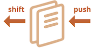

- `push` 在队列的末尾添加一个元素
- `shift` 取出队列首端的一个元素，整个队列往前移，使原先排第二的元素现在排在了第一

这两种操作数组都支持，对于队列来说，最先放进去的内容是最先接收，叫做 **FIFO（First-In-First-Out），即先进先出法则**。


**堆栈（Stack）**也是常见的使用数组的方法之一。

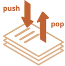

- `push` 在末端添加一个元素
- `pop` 从末端取出一个元素

所以新元素的添加和取出都是从 **“末端”** 开始的，对于栈来说，最后放进去的内容是最先接收的，叫做 **LIFO（Last-In-First-Out），即后进先出法则**。

在 JavaScript 中，数组既可以用作队列，也可以用作栈，在计算机科学中，允许这样的操作的数据结构被称为 **双端队列（Deque）**。


**作用于数组末端的方法：**

- **`pop`**

  取出并返回数组最后一个元素。

  ```js
  let fruits = ['Apple', 'Orange', 'Plum'];
  alert( fruits.pop() ); // Plum
  ```

  **⚠️ 注意：** `fruits.pop()` 与 `fruits.at(-1)` 不同，虽然它们都返回数组最后一个元素，但前者同时会删除数组的最后一个元素，进而修改了原数组。

- **`push`**

  在数组的末端添加一个元素。

  ```js
  let fruits = ['Apple', 'Orange'];
  fruits.push('Lemon');
  alert(fruits); // Apple,Orange, Lemon
  ```

  **⚠️ 注意：** `fruits.push(...)` 与 `fruits[fruits.length] = ...` 是一样的。


**作用于数组首端的方法：**

- **`shift`**

  取出数组第一个元素并返回它。

  ```js
  let fruits = ['Apple', 'Orange', 'Plum'];
  alert( fruits.shift() ); // Apple
  alert(fruits); // Orange,Plum
  ```

- **`unshift`**

  在数组的首端添加元素。

  ```js
  let fruits = ['Orange', 'Plum'];
  fruits.unshift('Apple');
  alert(fruits); // Apple,Orange,Plum
  ```


**`push` 和 `unshift` 方法都可以一次添加多个元素：**

```js
let fruits = ['Apple'];

fruits.push('Orange', 'Peach');
fruits.unshift('Pineapple', 'Lemon');

alert(fruits); // Pineapple,Lemon,Apple,Orange,Peach
```


**内部**

数组是一种特殊的对象，使用方括号来访问属性 `arr[0]` 是来自于对象的语法，本质上与 `obj[key]` 相同。

数组扩展了对象，特供了特殊的方法来处理有序的数据集合以及 `length` 属性。

数组跟对象一样都是通过引用来复制的：

```js
let fruits = ['Apple'];

let arr = fruits; // 通过引用复制 (两个变量引用的是相同的数组)
alert(arr === fruits); // true
arr.push('Pear'); // 通过引用修改数组

alert(fruits); // Apple,Pear
```

**⚠️ 注意：** 

- 数组真正特殊的是它内部的实现，JavaScript 引擎尝试把数组内的元素一个接一个地存储在连续的内存区域，还有一些其它的优化，使得数组运行得非常快

- 可以不像 “有序集合” 那样使用数组，而是像常规对象那样使用数组，是这样使用会导致对数组的优化不生效了，例如下面这样：

  ```js
  let fruits = []; // 创建一个数组
  
  fruits[99999] = 5; // 分配索引远大于数组长度的属性
  
  fruits.age = 25; // 创建一个具有任意名称的属性
  ```

  上述操作是可以的，因为数组是基于对象，可以添加任何属性，但是 JavaScript 引擎会发现像使用常规对象一样使用数组，那么针对数组的优化就不再适用了，然后对应的优化就会被关闭。

  常见的误用数组的方式：

  - **添加一个非数字的属性**，比如 `arr.test = 5`
  - **制造空洞**，比如：添加 `arr[0]`，然后添加 `arr[1000]` (它们中间什么都没有)
  - **以倒序填充数组**，比如 `arr[1000]`，`arr[999]` 等等


**性能**

`push/pop` 方法运行的比较快，而 `shift/unshift` 比较慢。


- `shift` 操作：
  1. 移除索引为 `0` 的元素
  2. 把所有的元素向左移动，把索引 `1` 改成 `0`，`2` 改成 `1` 以此类推，对其重新编号
  3. 更新 `length` 属性
- `unshift` 操作：
  1. 把所有的元素向右移动，把索引 `0` 改成 `1`，`1` 改成 `2` 以此类推，对其重新编号
  2. 再插入元素到索引 `0` 的位置
  3. 更新 `length` 属性

**数组里的元素越多，移动它们就要花越多的时间，也就意味着越多的内存操作，**所以 `shift/unshift` 比较慢。

而 **`push/pop` 不需要移动任何元素**，只需要再数组末端插入或者移除元素，并更新 `length` 属性就可以了，所以 `push/pop` 比较快。


**循环**

遍历数组有以下几种方式：

- **`for` 循环**

  ```js
  let arr = ['Apple', 'Orange', 'Pear'];
  
  for (let i = 0; i < arr.length; i++) {
    alert(arr[i]);
  }
  ```

  

- **`for..of`**

  ```js
  let arr = ['Apple', 'Orange', 'Pear'];
  
  for (let fruit of fruits) {
    alert(fruit);
  }
  ```

  **⚠️ 注意：** 

  - `for..of` 不能获取当前元素索引值，只能获取元素值

  - 数组也是对象，所以也可以使用 `for..in` 来遍历数组，**但是不推荐**

    ```js
    let arr = ['Apple', 'Orange', 'Pear'];
    
    for (let key in arr) {
      alert(arr[key]);
    }
    ```

    使用 `for..in` 遍历数组存在以下几个问题：

    1. `for..in` 循环会遍历**所有属性**，不仅仅是数字属性，在浏览器和其它环境中有一种称为 **“类数组”** 的对象，它们**看似是数组（有 `length` 和索引属性）**，但是也可能有其它的非数字的属性和方法，`for..in` 会把它们全部列出来
    2. **`for..in` 只适用于普通对象，并做了对应的优化，但是优化不适用于数组**，因此速度要慢 10~100 倍

    所以通常来说，**不应该用 `for..in` 来处理数组**。


**关于 length**

当修改数组的时候，`length` 属性会自动更新，但它实际上**不是数组里元素的个数，而是数组里最大的数字索引值加一**。

```js
let fruits = [];
fruits[123] = 'Apple';

alert(fruits.length); // 124
```

上述代码中数组中只有一个元素，但这个元素的索引值很大，所以数组的 `length` 也会很大。

**`length` 属性是可写的**，例如：

```js
let arr = [1, 2, 3, 4, 5];

arr.length = 2; // 截断到只剩 2 个元素
alert(arr); // 1,2

arr.length = 5; // 又把 length 加回来
alert(arr[3]); // undefined：被截断的那些数值并没有回来
```

**所以清空数组最简单的方法是：`arr.length = 0;`**


**new Array()**

`new Array()` 是创建数组的另一种语法：

```js
let arr = new Array('Apple', 'Orange', 'Pear');
```

**但它很少被使用，因为使用方括号 `[]` 更简洁。**

**⚠️ 注意：** 使用 `new Array()` 语法还存在一个棘手的特性，如果使用单个参数（即数字）调用 `new Array`，那么它会创建一个**指定了长度，却没有任何项**的数组，例如下面这样：

```js
const arr = new Array(2); // 会创建一个 [2] 的数组吗？

alert(arr[0]); // undefined！没有元素。

alert(arr.length); // 2
```

所以通常创建数组还是使用方括号，除非就是想创建一个指定长度的空数组。


**多维数组**

数组里的项也可以是数组。

```js
let matrix = [
  [1, 2, 3],
  [4, 5, 6],
  [7, 8, 9]
];

alert(matrix[1][1]); // 5
```


**toString**

**数组有自己的 `toString` 方法的实现**，会返回以逗号隔开的元素列表。

```js
let arr = [1, 2, 3];

alert(arr); // 1,2,3
alert(String(arr) === '1,2,3'); // true
```

当参与运算时进行类型转换：

```js
alert([] + 1);    // '1'
alert([1] + 1);   // '11'
alert([1,2] + 1); // '1,21'
```

**⚠️ 注意：** 数组没有 `Symbol.toPrimitive`，也没有 `valueOf`，**只能执行 `toString` 进行转换**。


**不要使用 == 比较数组**

在 JavaScript 中不应该使用 `==` 运算符比较数组，该运算符不会对数组进行特殊处理，它会像处理任意对象那样处理数组。

```js
alert([] == []); // false
alert([0] == [0]); // false
```

上述代码中这些数组是不同的对象，所以不相等，**`==` 运算符不会进行逐项比较**。

但与原始类型比较可能会产生奇怪的结果：

```js
alert(0 == []); // true
alert('0' == []); // false
```

上述代码转换过程如下：

1. 数组 `[]` 先是被转换为原始类型，但因为数组只能执行 `toString` 进行转换，所以 `[]` 转换为了 `''`

   ```js
   alert(0 == '');
   alert('0' == '');
   ```

2. 然后再是原始类型之间的比较

   ```js
   alert(0 == 0); // true
   alert('0' == ''); // false
   ```

所以对数组进行比较时，**最好不要使用 `==` 运算符**，而是通过循环或者迭代方法逐项比较它们。 


## 数组方法

除了前面的 `push`、`pop`、`shift`、`unshift` 方法，数组还有其它几种方法。


**splice**

`splice` 是处理数组的瑞士军刀，可以删除、替换和插入元素。

语法：

```js
arr.splice(start[, deleteCount, elem1, ..., elemN]);
```

从索引 `start` 开始修改 `arr`：删除 `deleteCount` 个元素并在当前位置插入 `elem1, ..., elemN`，**最后返回被删除的元素所组成的数组**。


- **删除元素**

  ```js
  let arr = ['I', 'study', 'JavaScript'];
  
  arr.splice(1, 1); // 从索引 1 开始删除 1 个元素，也就是 'study'
  
  alert(arr); // I,JavaScript
  ```

  **⚠️ 注意：**

  - 数组也是对象，也可以使用 `delete` 来删除数组中的元素，但是这样操作**不会移动剩下元素的位置并释放占据的位置**，应当使用数组的方法来操作数组

    ```js
    let arr = ['I', 'study', 'JavaScript'];
    
    delete arr[1]; // 删除 'study'
    
    alert(arr[1]); // undefined
    
    alert(arr.length); // 3
    ```

    

  - 当 `splice` 中只填写了 `start` 参数时，**将删除从索引 `start` 开始的所有数组项**

    ```js
    let arr = ['I', 'study', 'JavaScript'];
    
    arr.splice(1);
    
    alert(arr); // I
    ```

    

- **替换元素**

  ```js
  let arr = ['I', 'study', 'JavaScript', 'right', 'now'];
  
  // 删除数组的前三项，并使用其它内容代替它们
  arr.splice(0, 3, "Let's", 'dance');
  
  alert(arr); // Let's,dance,right,now
  ```


- **插入元素**

  将 `deleteCount` 设置为 `0`，`splice` 方法就能够**插入元素而不用删除任何元素**

  ```js
  let arr = ['I', 'study', 'JavaScript'];
  
  arr.splice(2, 0, 'complex', 'language');
  
  alert(arr); // I,study,complex,language,JavaScript
  ```

  

**slice**

与字符串的 `str.slice` 方法类似，用于将从索引 `start` 到 `end`（不包括 `end`）的数组项复制到一个新的数组。

语法：

```js
arr.slice([start], [end]);
```

**`start` 和 `end` 都可以是负数**，在这种情况下，从末尾计算索引。

例如：

```js
let arr = ['t', 'e', 's', 't'];

alert( arr.slice(1, 3) ); // e,s

alert( arr.slice(-2) ); // s,t
```

**⚠️ 注意：** 可以不带参数地调用它，`arr.slice()` 会创建一个 `arr` 的副本，通常用于获取数组的副本。


**concat**

创建一个新数组，其中包含来自于其他数组和其他项的值。

语法：

```js
arr.concat(arg1, arg2...);
```

**它接受任意数量的参数，数组或值都可以**，如果参数 `argN` 是一个数组，那么其中的所有元素都会被复制，否则将复制参数本身。

例如：

```js
let arr = [1, 2];

// 从 arr 和 [3,4] 创建一个新数组
alert( arr.concat([3, 4]) ); // 1,2,3,4

// 从 arr、[3,4] 和 [5,6] 创建一个新数组
alert( arr.concat([3, 4], [5, 6]) ); // 1,2,3,4,5,6

// 从 arr、[3,4]、5 和 6 创建一个新数组
alert( arr.concat([3, 4], 5, 6) ); // 1,2,3,4,5,6
```

**⚠️ 注意：** 

- 通常它只复制数组中的元素，对于其它对象，即使看起来像数组一样，但仍然会被作为一个整体添加

  ```js
  let arr = [1, 2];
  
  let arrayLike = {
    0: 'something',
    length: 1,
  };
  
  alert( arr.concat(arrayLike) ); // 1,2,[object Object]
  ```

  

- 如果类数组对象具有 `Symbol.isConcatSpreadable` 属性，那么它就会被 `concat` 当作一个数组来处理

  ```js
  let arr = [1, 2];
  
  let arrayLike = {
    0: 'something',
    1: 'else',
    length: 1,
    [Symbol.isConcatSpreadable]: true,
  };
  
  alert( arr.concat(arrayLike) ); // 1,2,something,else
  ```


**forEach**

`arr.forEach` 方法允许为数组的每个元素都运行一个函数。

语法：

```js
arr.forEach(function(item, index, array) {
  // ... do something with item
});
```

`item` 是当前项，`index` 是当前项的下标，`array` 是原数组。

例如：

```js
['Bilbo', 'Gandalf', 'Nazgul'].forEach((item, index, array) => {
  alert(`${item} is at index ${index} in ${array}`);
});

// 输出结果依次为：
// Bilbo is at index 0 in Bilbo,Gandalf,Nazgul
// Gandalf is at index 1 in Bilbo,Gandalf,Nazgul
// Nazgul is at index 2 in Bilbo,Gandalf,Nazgul
```

**⚠️ 注意：** 该函数的结果如果有返回，会被抛弃和忽略。


**indexOf / lastIndexOf 和 includes**

这些方法与字符串的方法相同，不过这里是针对数组项而非字符进行操作。

- **`arr.indexOf(item, from)`：** 从索引 `from` 开始搜索 `item`，如果找到则返回索引，否则返回 `-1`
- **`arr.lastIndexOf(item, from)`：** 与 `indexof` 相同，但从右向左查找
- **`arr.includes(item, from)`：** 从索引 `from` 开始搜索 `item`，如果找到则返回 `true`，否则返回 `false`

例如：

```js
let arr = [1, 0, false];

alert( arr.indexOf(0) ); // 1
alert( arr.indexOf(false) ); // 2
alert( arr.indexOf(null) ); // -1
alert( arr.includes(1) ); // true
```

**⚠️ 注意：** 

- `indexOf` 和 `includes` 使用严格相等 `===` 进行比较

- **方法 `includes` 可以正确处理 `NaN`**

  ```js
  const arr = [NaN];
  alert( arr.indexOf(NaN) ); // -1（错，应该为 0）
  alert( arr.includes(NaN) );// true（正确）
  ```

  因为 `includes` 是在比较晚的时候才被添加到 JavaScript 中的，并且在内部使用了更新了的比较算法


**findIndex / findLastIndex 和 find**

这三个方法通常用于对象数组（即数组中的元素都是对象）。

- **`findIndex`**

  用于寻找具有特定条件的**对象的索引，而不是元素本身**，如果没有找到则返回 `-1`。

  语法：

  ```js
  let result = arr.findIndex(function(item, index, array) {
    // 如果返回 true，则返回 index 并停止迭代
    // 对于假值（falsy）的情况，则返回 -1
  });
  ```

  依次对数组中的每个元素调用该函数：

  - `item` 是元素
  - `index` 是它的索引
  - `array` 是数组本身

  例如：

  ```js
  let users = [
    {id: 1, name: 'John'},
    {id: 2, name: 'Pete'},
    {id: 3, name: 'Mary'},
  ];
  
  alert( users.findIndex(user => user.name === 'John') ); // 0
  alert( users.findIndex(user => user.name === 'CodePencil') ); // -1
  ```

  

- **`findLastIndex`**

  与 `findIndex` 语法相同，**但从右向左搜索**。

  ```js
  let users = [
    {id: 1, name: 'John'},
    {id: 2, name: 'Pete'},
    {id: 3, name: 'Mary'},
    {id: 4, name: 'John'},
  ];
  
  alert( users.findIndex(user => user.name === 'John') ); // 0
  alert( users.findLastIndex(user => user.name === 'John') ); // 3
  ```


- **`find`**

  与 `findIndex` 语法相同，但是它返回的**不是元素索引，而是元素本身**，如果没有找到则返回 `undefined`。

  ```js
  let users = [
    {id: 1, name: 'John'},
    {id: 2, name: 'Pete'},
    {id: 3, name: 'Mary'},
  ];
  
  let user = users.find(item => item.id === 1);
  
  alert(user.name); // John
  alert( users.find(item => item.id === 4) ); // undefined
  ```

  
  
- **`filter`**

  `filter` 返回所有匹配元素组成的数组。

  语法：

  ```js
  let results = arr.filter(function(item, index, array) {
    // 如果 true item 被 push 到 results，迭代继续
    // 如果什么都没找到，则返回空数组
  });
  ```

  例如：

  ```js
  let users = [
    {id: 1, name: 'John'},
    {id: 2, name: 'Pete'},
    {id: 3, name: 'Mary'},
  ];
  
  // 返回前两个用户的数组
  let someUsers = users.filter(item => item.id < 3);
  
  alert(someUsers.length); // 2
  ```


- **`map`**

  `map` 对数组的每个元素都调用函数，并返回结果数组。

  语法：

  ```js
  let result = arr.map(function(item, index, array) {
    // 返回新值而不是当前元素
  });
  ```

  例如：

  ```js
  let lengths = ['Bilbo', 'Gandalf', 'Nazgul'].map(item => item.length);
  
  alert(lengths); // 5,7,6
  ```

  

- **`sort`**

  `arr.sort` 方法对数组进行**原位（in-place）**排序（指修改原数组，而非生成一个新数组），更改元素的顺序。

  语法：

  ```js
  let arr = [15, 1, 2];
  
  // 该方法重新排列 arr 的内容
  arr.sort();
  
  alert(arr);  // 1,15,2
  ```

  **⚠️ 注意：**

  - **`arr.sort` 方法还会返回排序后的数组**，但是在平常开发中返回值通常不会去使用，因为已经修改了原数组本身

  - 上述代码的排序结果不对，是因为 `arr.sort` 中的元素**默认按字符串进行排序**，如果要使用自己的排序顺序，需要提供一个函数作为 `arr.sort` 的参数

    ```js
    function compareNumeric(a, b) {
      if (a > b) return 1;   // 如果第一个值比第二个值大
      if (a === b) return 0; // 如果两个值相等
      if (a < b) return -1;  // 如果第一个值比第二个值小
    }
    
    let arr = [1, 15, 2];
    
    arr.sort(compareNumeric);
    
    alert(arr); // 1,2,15
    ```

    上述代码中 `arr.sort` 内部的算法会将一个元素与多个其他元素进行比较，会尝试尽可能少的比较。

    **⚠️ 注意：**

    - 比较函数可以返回任何数字，**返回一个正数表示 `a` 应该排在 `b` 后面，返回一个负数表示 `a` 应该排在 `b` 前面，返回 `0` 表示顺序不变**，所以前面的代码可以简化为：

      ```js
      let arr = [1, 15, 2];
      
      arr.sort(function(a, b) { 
        return a - b;
      });
      
      alert(arr); // 1,2,15
      ```

      代码中的 `a` 和 `b` 表示待比较的两个元素，它们不一定是原数组中**相邻**或**有固定位置的**元素，在排序过程中具体选择哪两个元素进行比较取决于浏览器内部的排序算法。

      

    - 对于不同地区的字母，最好使用 `str.localeCompare` 正确地对字母进行排序

      例如用德语对几个国家/地区进行排序：

      ```js
      let countries = ['Österreich', 'Andorra', 'Vietnam'];
      
      alert( countries.sort( (a, b) => a > b ? 1 : -1) ); // Andorra, Vietnam, Österreich（错的）
      alert( countries.sort( (a, b) => a.localeCompare(b) ) ); // Andorra,Österreich,Vietnam（对的！）
      ```

      

- **`reverse`**

  `arr.reverse` 方法对数组进行**原位（in-place）**颠倒，也会返回颠倒后的数组 `arr`。

  ```js
  let arr = [1, 2, 3, 4, 5];
  arr.reverse();
  
  alert(arr); // 5,4,3,2,1
  ```

  

- **`split`**

  `str.split` 通过给定的分隔符 `delim` 将字符串分割成一个数组。

  ```js
  let names = 'Bilbo, Gandalf, Nazgul';
  let arr = names.split(', '); // 此时 arr = ['Bilbo', 'Gandalf', 'Nazgul']
  ```

  `split` 还支持可选的第二个数字参数，用于限制数组的长度，如果提供了，额外的元素会被忽略。

  ```js
  let arr = 'Bilbo, Gandalf, Nazgul, Saruman'.split(', ', 2);
  alert(arr); // Bilbo, Gandalf
  ```

  空参数的 `split` 可以将字符串拆分为字母数组：

  ```js
  let str = 'test';
  alert( str.split('') ); // t,e,s,t
  ```

  

- **`join`**

  `arr.join(glue)` 与 `split` 相反，用于将数组中的每一项通过给定的 `glue` 粘合为一个字符串。

  ```js
  let arr = ['Bilbo', 'Gandalf', 'Nazgul'];
  let str = arr.join(';'); // 使用分号 ; 将数组粘合成字符串
  alert(str); // Bilbo;Gandalf;Nazgul
  ```

  

- **`reduce`**

  用于根据数组计算单个值。

  语法：

  ```js
  let value = arr.reduce(function(accumulator, item, index, array) {
    // ...
  }, [initial]);
  ```

  该函数按顺序应用于每个数组元素，并将返回结果 “搬运（carry on）” 到下一个调用。

  参数：

  - `accumulator` 是上一个函数调用的结果，第一次等于 `initial`（如果提供了 `initial` 的话）
  - `item` 当前的数组元素
  - `index` 当前索引
  - `arr` 数组本身

  简单来说第一个参数就是一个累加器，用于存储所有先前执行的结果，最后它成为 `reduce` 的结果。

  例如：

  ```js
  let arr = [1, 2, 3, 4, 5];
  let result = arr.reduce((sum, current) => sum + current, 0);
  
  alert(result); // 15
  ```

  上述代码具体的执行过程如下：

  |             | `sum` | `current` | `result` |
  | :---------- | :---- | :-------- | -------- |
  | 第 1 次调用 | `0`   | `1`       | `1`      |
  | 第 2 次调用 | `1`   | `2`       | `3`      |
  | 第 3 次调用 | `3`   | `3`       | `6`      |
  | 第 4 次调用 | `6`   | `4`       | `10`     |
  | 第 5 次调用 | `10`  | `5`       | `15`     |

  也可以省略初始值：

  ```js
  let arr = [1, 2, 3, 4, 5];
  
  // 删除 reduce 的初始值（没有 0）
  let result = arr.reduce((sum, current) => sum + current);
  
  alert( result ); // 15
  ```

  结果跟前面的代码一样，因为**如果没有初始值，那么 `reduce` 会将数组的第一个元素作为初始值，并从第二个元素开始迭代**。

  它的计算过程如下：

  |             | `sum` | `current` | `result` |
  | :---------- | :---- | :-------- | -------- |
  | 第 1 次调用 | `1`   | `2`       | `3`      |
  | 第 2 次调用 | `3`   | `3`       | `6`      |
  | 第 3 次调用 | `6`   | `4`       | `10`     |
  | 第 4 次调用 | `10`  | `5`       | `15`     |

  **⚠️ 注意：** 如果数组为空，那么在没有初始值的情况下调用 `reduce` 会导致错误。

  ```js
  let arr = [];
  
  // 如果初始值存在，则 reduce 将为空 arr 返回它（即这个初始值）。
  arr.reduce((sum, current) => sum + current); // TypeError: Reduce of empty array with no initial value
  ```

  **所以建议始终指定初始值。**

  

- **`reduceRight`**

  与 `arr.reduce` 相同，不过遍历方向是从右到左。


**Array.isArray**

因为数组是基于对象的，在 JavaScript 中不是单独的数据类型，所以**只靠 `typeof` 无法区分普通对象和数组**：

```js
alert(typeof {}); // object
alert(typeof []); // object（相同）
```

所以有一种特殊的方法来判断：`Array.isArray(value)`，如果 `value` 是一个数组，则返回 `true`，反之返回 `false`。

```js
alert(Array.isArray({})); // false
alert(Array.isArray([])); // true
```


**大多数方法都支持 thisArg**

前面几乎所有调用函数的数组方法，如：`find`、`filter`、`map`（除了 `sort`）等都支持一个可选的附加参数 `thisArg`。

完整的语法如下：

```js
arr.find(func, thisArg);
arr.filter(func, thisArg);
arr.map(func, thisArg);
// ...
// thisArg 是可选的最后一个参数
```

**`thisArg` 参数的值用于在 `func` 运行时作为 `this`**。

例如：

```js
let army = {
  minAge: 18,
  maxAge: 27,
  canJoin(user) {
    return user.age >= this.minAge && user.age < this.maxAge;
  },
};

let users = [
  {age: 16},
  {age: 20},
  {age: 23},
  {age: 30}
];

// 找到 army.canJoin 返回 true 的 user
let soldiers = users.filter(army.canJoin, army);

alert(soldiers.length); // 2
alert(soldiers[0].age); // 20
alert(soldiers[1].age); // 23
```

上述代码中，如果使用的是 `users.filter(army.canJoin)`，那么 `army.canJoin` 将被作为独立函数调用，并且这时 `this=undefined`，从而导致报错，也可以使用箭头函数。

```js
// 找到 army.canJoin 返回 true 的 user
let soldiers = users.filter( user => army.canJoin(user) );
```

箭头函数在日常开发中的使用频率比使用 `thisArg` 高，也更加容易理解。


## Iterable object 可迭代对象

**可迭代（Iterable）**对象是数组的泛化（泛化指：更通用、更宽泛），这个概念是说任何对象都可以被定制为可以在 `for..of` 中循环使用的对象。

数组是可迭代的，不仅仅是数组。很多其它内建对象也都是可迭代的，例如字符串也是可迭代的。


**Symbol.iterator**

有一个对象，它并不是数组，但是看上去很适合使用 `for..of` 循环，例如：

```js
let range = {
  from: 1,
  to: 5,
};
```

为了让 `range` 对象可迭代，需要为对象添加一个名为 `Symbol.iterator` 的方法（一个专门用于使对象可迭代的内建 `symbol`）。

1. **当 `for..of` 循环启动时，它会调用这个方法**（如果没找到，就会报错），这个方法必须返回一个**迭代器（iterator）**—— 一个有 `next` 方法的对象
2. 从此开始，`for..of` **仅适用于这个被返回的对象**
3. 当 `for..of` 循环希望取得下一个数值，它就调用这个对象的 `next()` 方法
4. **`next()` 方法返回的结果必须是 `{done: Boolean, value: any}`**，当 `done = true` 时，表示循环结束，否则 `value` 是下一个值

完整的实现如下：

```js
let range = {
  from: 1,
  to: 5,
};

// 1. for..of 调用首先会调用这个：
range[Symbol.iterator] = function() {
  
  // ……它返回迭代器对象（iterator object）：
  // 2. 接下来，for..of 仅与下面的迭代器对象一起工作，要求它提供下一个值
  return {
		current: this.from,
    last: this.to,

    // 3. next() 在 for..of 的每一轮循环迭代中被调用
    next() {
      // 4. 它将会返回 {done:.., value :...} 格式的对象
      if (this.current <= this.last) {
       	return { done: false, value: this.current++ };
      } else {
        return { done: true };
      }
    }
  };
};

// 现在它可以运行了！
for (let num of range) {
  alert(num); // 1, 然后依次是 2, 3, 4, 5
}
```

**⚠️ 注意：** 可迭代对象的核心功能：**关注点分离**。

- `range` 对象自身没有 `next()` 方法
- 相反，是通过调用 `range[Symbol.iterator]()` 创建了另一个对象，即所谓的 “迭代器” 对象，并且它的 `next` 会为迭代生成值，所以迭代器对象和与其进行迭代的对象是分开的


在技术上也可以将它们进行合并，并使用 `range` 自身作为迭代器来简化代码。

```js
let range = {
  from: 1,
  to: 5,
  
  [Symbol.iterator]() {
    // 记忆当前迭代进程
    this.current = this.from;
    return this;
  },
  
  next() {
    if(this.current <= this.to) {
      return { done: false, value: this.current++ };
    } else {
      return { done: true };
    }
  }
};

for (let num of range) {
  alert(num); // 1, 然后依次是 2, 3, 4, 5
}
```

上述代码的 `range[Symbol.iterator]()` 返回的是 `range` 对象自身：它包括了必需的 `next()` 方法，并通过 `this.current` 记忆了当前的迭代进程。

**⚠️ 注意：** 

- 上述代码有个缺点，**无法同时在对象上运行两个 `for..of` 循环，因为它们共享同一个迭代器，即对象本身**，但是两个并行的 `for..of` 很罕见
- **无穷迭代器（iterator）**也是可以实现的，例如，将上述代码中的 `range` 设置为 `range.to = Infinity`，这时 `range` 成为了无穷迭代器，这种对象的 `for..of` 循环将不会停止，但可以通过使用 `break` 来停止它


**字符串是可迭代的**

数组和字符串是使用最广泛的内建可迭代对象。

```js
for (let char of 'test') {
  // 触发 4 次，每个字符一次
  alert(char); // t, 然后依次是 e, s, t
}
```

对于代理对，`for..of` 也可以正常工作：

```js
let str = '𝒳😂';

for (let char of str) {
  alert(char); // 𝒳，然后是 😂
}
```


**显式调用迭代器**

```js
let str = 'Hello';

// 和 for..of 做相同的事
// for (let char of str) alert(char);

let iterator = str[Symbol.iterator]();

while (true) {
  const result = iterator.next();
  if (result.done) break;
 	alert(result.value);
}
```

上述代码创建了一个迭代器，并通过 `while` 手动获取值。

**⚠️ 注意：** 很少需要这样做，但是比 `for..of` 给了更多的控制权，例如可以拆分迭代过程：迭代一部分，然后停止，做一些其它处理，然后再恢复迭代。


**可迭代（iterable）和类数组（array-like）**

- **可迭代对象：** 指实现了 `Symbol.iterator` 方法的对象
- **类数组：** 指具有索引和 `length` 属性的对象，看起来很像数组

在实际开发中可能会遇到**既是可迭代对象也是类数组对象**，例如字符串，即是可迭代的（`for..of` 对它们有效），又是类数组的（它们有数值索引和 `length` 属性）

**⚠️ 注意：** 一个可迭代对象也许不是类数组对象，反之亦然，类数组对象可能也不可迭代，例如：

```js
let arrayLike = { // 有索引和 length 属性 => 类数组对象
  0: 'Hello',
  1: 'World',
  length: 2,
};

// arrayLike 不是一个可迭代对象
for (let item of arrayLike) {}  // Uncaught TypeError: arrayLike is not iterable
```


**Array.from**

可迭代对象和类数组对象通常都**不是数组**，它们没有 `push` 和 `pop` 等方法，如果想像数组一样操作需要先将它们转换为一个真正的数组，可以使用全局方法 `Array.from`。

该方法**可以接受一个可迭代或类数组的值**，然后创建一个新的数组，并将该对象的所有元素复制到这个新数组。

```js
let arrayLike = { // 类数组对象
  0: 'Hello',
  1: 'World',
  length: 2,
};

let arr = Array.from(arrayLike);
alert( arr.pop() ); // World（pop 方法有效）
```

如果是可迭代对象，也是同样：

```js
let range = {
  from: 1,
  to: 5,
  [Symbol.iterator]() {
    return {
      current: this.from,
      last: this.to,
      next() {
        if (this.current <= this.last) {
          return { done: false, value: this.current++ };
        } else {
          return { done: true };
        }
      }
    };
  },
};

let arr = Array.from(range);
alert(arr); // 1,2,3,4,5
```

`Array.from` 完整语法还支持一个可选的 “映射（mapping）” 函数：

```js
Array.from(obj[, mapFn, thisArg]);
```

可选的第二个参数 `mapFn` 可以是一个函数，该函数会在对象中的元素被添加到数组前，应用于每个元素，第三个参数 `thisArg` 允许为该函数设置 `this`。

```js
// 假设 range 来自上文例子中

// 求每个数的平方
let arr = Array.from(range, num => num * num);
alert(arr); // 1,4,9,16,25
```


可以使用 `Array.from` 将一个字符串转换为单个字符的数组：

```js
let str = '𝒳😂';

// 将 str 拆分为字符数组
let chars = Array.from(str);

alert(chars[0]); // 𝒳
alert(chars[1]); // 😂
alert(chars.length); // 2
```

`Array.from` 依赖于字符串的可迭代特性，因此就像 `for..of` 一样，可以正确地处理代理对，**但 `str.split` 无法正确处理代理对**：

```js
let str = '𝒳😂';

// 将 str 拆分为字符数组
let chars = str.split('');

alert(chars[0]); // 第一个代理对的一部分
alert(chars[1]); // 第一个代理对的另一部分
alert(chars.length); // 4
```

所以可以基于 `Array.from` 创建一个支持代理对的 `slice` 方法：

```js
function slice(str, start, end) {
  return Array.from(str).slice(start, end).join('');
}

let str = '𝒳😂𩷶';

alert( slice(str, 1, 3) ); // 😂𩷶

// 原生方法不支持识别代理对
alert( str.slice(1, 3) ); // 乱码
```


## Map

`Map` 是一个带键的数据项的集合，就像一个 `Object` 一样，但**它与 `Object` 最大的差别是 `Map` 允许任何类型的键（key）**。

它的方法和属性如下：

- `new Map()` —— 创建 map
- `map.set(key, value)` —— 根据键存储值，**并返回 map 本身**
- `map.get(key)` —— 根据键来返回值，如果 `map` 中不存在对应的 `key`，则返回 `undefined`
- `map.has(key)` —— 如果 `key` 存在则返回 `true`，否则返回 `false`
- `map.delete(key)` —— 删除指定键的值
- `map.clear()` —— 清空 map
- `map.size` —— 返回当前 map 中元素的个数

例如：

```js
let map = new Map();

map.set('1', 'str1');   // 字符串键
map.set(1, 'num1');     // 数字键
map.set(true, 'bool1'); // 布尔值键

// Map 则会保留键的类型，所以下面这两个结果不同：
alert( map.get(1) ); // 'num1'
alert( map.get('1') ); // 'str1'

alert(map.size); // 3
```

`Map` 与对象不同，键不会被转换成字符串，键可以是任何类型。

**⚠️ 注意：** 虽然 `map[key]` 也有效，例如可以设置 `map[key] = 2`，但这样会将 `map` 视为普通对象，**应该使用 `map` 方法：`set` 和 `get` 等**。


**Map 还可以使用对象作为键**

```js
let codepencil = { name: 'CodePencil' };

// 存储每个用户的来访次数
let visitsCountMap = new Map();

// codepencil 是 Map 中的键
visitsCountMap.set(codepencil, 123);

alert( visitsCountMap.get(codepencil) ); // 123
```

**⚠️ 注意：** 使用对象作为键是 `Map` 最值得注意和重要的功能之一，但在 `Object` 中，无法使用对象作为键，例如：

```js
let john = { name: 'John' };
let ben = { name: 'Ben' };

let visitsCountObj = {};

visitsCountObj[ben] = 234; // 尝试将对象 ben 用作键
visitsCountObj[john] = 123; // 尝试将对象 john 用作键，但我们会发现使用对象 ben 作为键存下的值会被替换掉

// 变成这样了！
alert( visitsCountObj['[object Object]'] ); // 123
```


**`Map` 是怎么比较键的**

`Map` 使用 [SameValueZero](https://tc39.github.io/ecma262/#sec-samevaluezero) 算法来比较键是否相等，它和严格等于 `===` 差不多，但**区别是 `NaN` 被看成是等于 `NaN`，所以 `NaN` 也可以被用作键**，这个算法不能被改变或者自定义。


**链式调用**

每一次 `map.set` 调用都会返回 map 本身，所以可以进行 “链式” 调用。

```js
map.set('1', 'str1').set(1, 'num1').set(true, 'bool1');
```


**Map 迭代**

要在 `map` 里使用循环，可以使用如下三种方式：

- `map.keys()` —— 遍历并返回一个包含所有键的**可迭代对象**
- `map.values()` —— 遍历并返回一个包含所有值的**可迭代对象**
- `map.entries()` —— 遍历并返回一个包含所有实体 `[key, value]` 的**可迭代对象，`for..of` 在默认情况下使用这个**

例如：

```js
let recipeMap = new Map([
  ['cucumber', 500],
  ['tomatoes', 350],
  ['onion',    50]
]);

// 遍历所有的键（vegetables）
for (let vegetable of recipeMap.keys()) {
  alert(vegetable); // cucumber, tomatoes, onion
}

// 遍历所有的值（amounts）
for (let amount of recipeMap.values()) {
  alert(amount); // 500, 350, 50
}

// 遍历所有的实体 [key, value]
for (let entry of recipeMap) { // 与 recipeMap.entries() 相同
  alert(entry); // cucumber,500 (and so on)
}
```

**⚠️ 注意：** 

- **`Map` 的迭代顺序和插入值的顺序相同**

- `Map` 也有 `forEach` 方法，与 `Array` 类似

  ```js
  let recipeMap = new Map([
    ['cucumber', 500],
    ['tomatoes', 350],
    ['onion',    50]
  ]);
  
  recipeMap.forEach((value, key, map) => {
    alert(`${key}: ${value}`); // cucumber: 500
  });
  ```
  


**Object.entries**

当创建一个 `Map` 后，可以传入一个**带有键/值对的数组（或其它可迭代对象）来进行初始化**，例如：

```js
// 键值对 [key, value] 数组
let map = new Map([
  ['1', 'str1'],
  [1, 'num1'],
  [true, 'bool1'],
]);

alert( map.get('1') ); // str1
```

如果想从一个已有的普通对象来创建一个 `Map`，可以使用内置的方法 `Object.entries(obj)`，该方法返回对象的键/值对数组，格式完全按照 `Map` 所需的格式。

```js
let obj = {
  name: 'CodePencil',
  age: 23,
};

let map = new Map( Object.entries(obj) );
alert( map.get('name') ); // CodePencil
```

上述代码中 `Object.entries(obj)` 返回键/值对数组：`[ ["name","CodePencil"], ["age", 23] ]`，这是 `Map` 需要的格式。


**Object.fromEntries**

`Object.fromEntries` 的作用和 `Object.entries` 是相反的：给定一个具有 `[key, value]` 键/值对的数组，它会根据给定数组创建一个对象，例如：

```js
let prices = Object.fromEntries([
  ['banana', 1],
  ['orange', 2],
  ['meat', 4]
]);

// 现在 prices = { banana: 1, orange: 2, meat: 4 }
alert(prices.orange); // 2
```

我们也可以将 `Map` 转换为一个对象：

```js
let map = new Map();
map.set('banana', 1);
map.set('orange', 2);
map.set('meat', 4);

let obj = Object.fromEntries( map.entries() ); // 创建一个普通对象
// 此时 obj = { banana: 1, orange: 2, meat: 4 }

alert(obj.orange); // 2
```

上述代码中调用 `map.entries()` 将返回一个可迭代的键/值对，这刚好是 `Object.fromEntries` 所需要的格式，也可以简化为：

```js
let obj = Object.fromEntries(map); // 省掉 .entries()
```

上述代码作用是一样的，**因为 `Object.fromEntries` 期望得到一个可迭代的对象作为参数，`map` 的标准迭代会返回跟 `map.entries()` 一样的键/值对**。


## Set

`Set` 是一个特殊的类型集合，它是**值的集合（没有键），它的每一个值都只能出现一次**。

它的方法和属性如下：

- `new Set(iterable)` —— 创建一个 `set`，如果提供了一个 `iterable` 对象（通常是数组），将会从数组里面复制值到 `set` 中
- `set.add(value)` —— 添加一个值，**返回 set 本身**
- `set.delete(value)` —— 删除值，如果 `value` 在这个方法调用的时候存在则返回 `true` ，否则返回 `false`
- `set.has(value)` —— 如果 `value` 在 set 中，返回 `true`，否则返回 `false`
- `set.clear()` —— 清空 set
- `set.size` —— 返回元素个数

它的主要特点是，**重复使用同一个值调用 `set.add(value)` 不会发生任何改变**，例如下面的例子：

```js
let set = new Set();

let john = { name: 'John' };
let pete = { name: 'Pete' };
let mary = { name: 'Mary' };

// visits，一些访客来访好几次
set.add(john);
set.add(pete);
set.add(mary);
set.add(john);
set.add(mary);

// set 只保留不重复的值
alert(set.size); // 3

for (let user of set) {
  alert(user.name); // John（然后 Pete 和 Mary）
}
```

**⚠️ 注意：** 上述代码也可以使用数组实现，如果使用数组，**用 `arr.find` 在每次插入值时检查是否重复会导致性能变差，因为这个方法会遍历整个数组来检查每个元素**，所以更推荐使用 `Set` 来做唯一性的检查，因为 `Set` 内部对唯一性检查进行了更好的优化。


**Set 迭代**

可以使用 `for..of` 或者 `forEach` 来遍历 `Set`。

```js
let set = new Set(['oranges', 'apples', 'bananas']);

for (let value of set) alert(value);

set.forEach((value, valueAgain, set) => {
  alert(value);
});
```

**⚠️ 注意：** `forEach` 回调函数有三个参数：一个 `value`，然后是**同一个值** `valueAgain`，最后是目标对象，同一个值在参数里出现了两次，**`forEach` 的回调函数有三个参数，是为了与 `Map` 兼容**，便于特定情况下转换为 `Map` 或者普通对象。

`Map` 中用于迭代的方法在 `Set` 中也同样支持：

- `set.keys()` —— 遍历并返回一个包含所有值的**可迭代对象**
- `set.values()` —— 与 `set.keys()` 作用相同，这是为了兼容 `Map`
- `set.entries()` —— 遍历并返回一个包含所有的实体 `[value, value]` 的**可迭代对象**，它的存在也是为了兼容 `Map`


## WeakMap

JavaScript 引擎**在值 “可达” 和可能被使用时会将其保持在内存中**。

**对象、数组等数据结构在内存中时，它们内部的子元素（如对象属性、数组的元素）都被认为是可达的**，所以当把一个对象放入一个数组中时，只要这个数组存在，那么这个对象也存在，例如：

```js
let john = { name: 'john' };

let array = [john];

john = null; // 覆盖引用
```

上述代码中 `john` 引用的对象因为存储在了 `array` 中，所以**不会被垃圾回收**，依旧可以通过 `array[0]` 获取到它。

所以这就会出现一个问题，**当使用对象作为 `Map` 的键，当 `Map` 存在时，该对象也将存在，它会占用内存，并且不会被垃圾回收**，例如：

```js
let john = { name: 'john' };

const map = new Map();
map.set(john, '...');

john = null;
```

所以要解决这个问题，可以使用 `WeakMap`，**`WeakMap` 在这方面有着根本上的不同，它不会阻止垃圾回收机制对作为键的对象的回收**。


`WeakMap` 和 `Map` 的不同点就是，**`WeakMap` 的键必须是对象，不能是原始值：**

```js
const weakMap = new WeakMap();

const obj = {};

weakMap.set(obj, 'ok'); // 正常工作（以对象作为键）

// 不能使用字符串作为键
weakMap.set('test', 'Whoops'); // Uncaught TypeError: Invalid value used as weak map key
```

前面的例子可以使用 `WeakMap` 来重写：

```js
let john = { name: 'John' };

let weakMap = new WeakMap();
weakMap.set(john, '...');

john = null; // 覆盖引用
```

上述代码与常规的 `Map` 相比，`john` 仅仅是作为 `WeakMap` 的键而存在的，**当外部没有其它变量引用 `john`，它将会被从 WeakMap（和内存）中自动删除**。

`WeakMap` 只有以下的方法：

- `weakMap.get(key)`
- `weakMap.set(key, value)`
- `weakMap.delete(key)`
- `weakMap.has(key)`

**⚠️ 注意：**

- **`WeakMap` 不支持迭代以及 `keys()`，`values()` 和 `entries()` 方法**，所以没有办法获取 `WeakMap` 的所有键或值
- 之所以有这种限制，是因为技术原因，当一个对象丢失了其它所有的引用，那么它将被垃圾回收机制自动回收，在从技术的角度并不能准确知道**何时会被回收**，这些都是由 JavaScript 引擎决定的，JavaScript 引擎可能会选择立即执行内存清理，如果现在正在发生很多删除操作，那么 JavaScript 引擎可能就会选择等一等，**因此，从技术上讲，`WeakMap` 的当前元素的数量是未知的**


**WeakMap 使用场景**

- 额外数据存储

  ```js
  // visitsCount.js
  let visitsCountMap = new WeakMap(); // weakmap: user => visits count
  
  // 递增用户来访次数
  function countUser(user) {
    let count = visitsCountMap.get(user) || 0;
    visitsCountMap.set(user, count + 1);
  }
  
  let john = { name: 'John' };
  
  countUser(john); // 记录他的访问次数
  
  // 不久之后，john 离开了
  john = null;
  ```

  当 `john` 这个对象不可达时，会连同它作为 `WeakMap` 里的键所对应的信息**自动从内存中删除**，无需手动清理。

  

- 缓存

  可以存储（“缓存”）函数的结果，以便将来对同一个对象的调用可以重用这个结果。

  ```js
  let cache = new WeakMap();
  
  // 计算并记结果
  function process(obj) {
    if (!cache.has(obj)) {
      let result = /* 计算结果 */;
  
      cache.set(obj, result);
    }
  
    return cache.get(obj);
  }
  
  let result1 = process(obj);
  let result2 = process(obj);
  
  // 稍后，我们不再需要这个对象时
  obj = null;
  ```

  上述代码中，当对应的对象不可达时，对应的缓存结果会自动从内存中删除。


## WeakSet

`WeakSet` 与 `Set` 类似，但是我们**只能向 `WeakSet` 添加对象（而不能是原始值）**。

**`WeakSet` 中的对象只有可达时，才能留在 `WeakSet` 中**。

跟 `Set` 一样，`WeakSet` 支持 `add`，`has` 和 `delete` 方法，**不支持 `size` 和 `keys()`，并且不可迭代**。

`WeakSet` 可以作为额外的存储空间。**但并非针对任意数据，而是针对“是/否”的事实**，例如可以用来追踪访问过网站的用户。

```js
const visitedSet = new WeakSet();

let john = { name: 'John' };
let pete = { name: 'Pete' };
let mary = { name: 'Mary' };

visitedSet.add(john); // John 访问了
visitedSet.add(pete); // 然后是 Pete
visitedSet.add(john); // John 再次访问

// 检查 John 是否来访过？
alert( visitedSet.has(john) ); // true

// 检查 Mary 是否来访过？
alert(visitedSet.has(mary)); // false

john = null;

// visitedSet 将被自动清理(即自动清除其中已失效的值 john)
```


## Object.keys，values，entries

普通对象也支持类似 `map.keys()`，`map.values()` 和 `map.entries()` 等方法，但是语法上有些不同：

- **`Object.keys(obj)`** —— 返回一个包含该对象所有的键的**数组**
- **`Object.values(obj)`** —— 返回一个包含该对象所有的值的**数组**
- **`Object.entries(obj)`** —— 返回一个包含该对象所有 `[key, value]` 键值对的**数组**

例如：

```js
let user = {
  name: 'CodePenil',
  age: 23,
};

// 遍历所有的键
for (let key of Object.keys(user)) {
  alert(key); // name, then age
}

// 遍历所有的值
for (let value of Object.values(user)) {
  alert(value); // CodePenil, then 23
}

// 遍历所有的键值对
for (let [key, value] of Object.entries(user)) {
  alert(`键：${key}，值：${value}`); // 键：name，值：CodePenil, then 键：age，值：23
}
```

**⚠️ 注意：** 与 `for..in` 循环一样，**Object.keys/values/entries 会忽略 symbol 属性**，如果想要 Symbol 类型的键可以使用 `Object.getOwnPropertySymbols`，它会返回一个只包含 Symbol 类型的键的数组，也可以使用 `Reflect.ownKeys(obj)`，它会返回**所有**键。


**转换对象**

对象缺少数组存在的许多方法，例如 `map` 和 `filter` 等，如果想使用它们需要先**对数组进行转换**，具体转换步骤如下：

1. 使用 `Object.entries(obj)` 从 `obj` 获取由键/值对组成的数组
2. 对该数组使用数组方法，例如 `map`，对这些键/值对进行转换
3. 对结果数组使用 `Object.fromEntries(array)` 方法，将结果转回成对象

例如有一个带有价格的对象，将它们的属性值加倍：

```js
let prices = {
  banana: 1,
  orange: 2,
  meat: 4,
};

let doublePrices = Object.fromEntries(
  Object.entries(prices).map(entry => [entry[0], entry[1] * 2])
);

alert(doublePrices.meat); // 8
```


## 解构赋值

JavaScript 中最常用的两种数据结构是 `Object` 和 `Array`。

当把它们传递给函数时，**函数可能不需要整个对象/数组，只需要其中的一部分**，这时可以使用**解构赋值**。


**数组解构**

```js
// 我们有一个存放了名字和姓氏的数组
let arr = ['John', 'Smith']

// 解构赋值
// 设置 firstName = arr[0]
// 以及 surname = arr[1]
let [firstName, surname] = arr;

alert(firstName); // John
alert(surname);  // Smith
```

**⚠️ 注意：** 

- 解构并不意味着破坏，它只是 “拆开” 了数组或对象，将其中的各元素复制给一些变量，**原来的数组或对象自身没有被修改**

- 可以通过添加额外的逗号来丢弃数组中不想要的元素

  ```js
  // 不需要第二个元素
  let [firstName, , title] = ['Julius', 'Caesar', 'Consul', 'of the Roman Republic'];
  
  alert(title); // Consul
  ```

  上述代码中，数组的第二个元素被跳过了，从而第三个元素赋值给了 `title` 变量，数组剩下的元素也都被跳过了。
  
- **等号的右侧可以是任何可迭代对象**，例如：

  ```js
  let [a, b, c] = 'abc'; // ['a', 'b', 'c']
  let [one, two, three] = new Set([1, 2, 3]);
  ```

  上述情况中，解构赋值是**通过迭代右侧的值来完成工作的**，这是一种用于对在 `=` 右侧的值上调用 `for..of` 并进行赋值的操作的**语法糖**。

  

- **等号的左侧可以赋值任何内容**

  例如可以直接赋值给对象的属性：

  ```js
  let user = {};
  [user.name, user.surname] = 'John Smith'.split(' ');
  
  alert(user.name); // John
  alert(user.surname); // Smith
  ```

- **与 .entries() 方法进行循环操作**

  ```js
  let user = {
    name: 'CodePecnil',
    age: 23
  };
  
  // 使用循环遍历键—值对
  for (let [key, value] of Object.entries(user)) {
    alert(`${key}:${value}`); // name:CodePencil, then age:23
  }
  ```

  使用 `Map` 代码更加简单：

  ```js
  let user = new Map();
  user.set('name', 'CodePencil');
  user.set('age', 23);
  
  // Map 是以 [key, value] 对的形式进行迭代的，非常便于解构
  for (let [key, value] of user) {
    alert(`${key}:${value}`); // name:John, then age:30
  }
  ```

  

- **可以利用解构赋值来实现交换变量值的技巧**

  ```js
  let guest = 'Jane';
  let admin = 'Pete';
  
  // 使得 guest = 'Pete'，admin = 'Jane'
  [guest, admin] = [admin, guest];
  
  alert(`${guest} ${admin}`); // Pete Jane（成功交换！）
  ```

  上述代码创建了一个由两个变量组成的临时数组，并且立即以颠倒的顺序对其进行了解构赋值。


**其余的 ...**

如果数组比左侧的列表长，那么其余的数组项会被忽略，**如果还想收集其余数组项，可以使用 `...` 再加一个参数来获取其余数组项**：

```js
let [name1, name2, ...rest] = ['Julius', 'Caesar', 'Consul', 'of the Roman Republic'];

// rest 是包含从第三项开始的其余数组项的数组
alert(rest[0]); // Consul
alert(rest[1]); // of the Roman Republic
alert(rest.length); // 2
```

上述代码中 `rest` 就是数组中剩余元素组成的数组，变量名不一定要使用 `rest`，也可以使用其它的变量名，**只要确保它前面有三个点，并且在解构赋值的最后一个参数位置上**。


**默认值**
如果数组比左侧的变量列表短，**缺少的对应变量会被赋值 `undefined`**：

```js
let [firstName, surname] = [];

alert(firstName); // undefined
alert(surname); // undefined
```

如果要给未赋值的变量一个默认值，可以使用 `=` 来提供：

```js
// 默认值
let [name = 'Guest', surname = 'Anonymous'] = ['Julius'];

alert(name);    // Julius（来自数组的值）
alert(surname); // Anonymous（默认值被使用了）
```

默认值可以是更加复杂的表达式，也可以是函数调用，这些表达式或函数只会在这个**变量未被赋值的时候才会被计算**，例如：

```js
// 只会提示输入姓氏
let [name = prompt('name?'), surname = prompt('surname?')] = ['Julius'];

alert(name);    // Julius（来自数组）
alert(surname); // 输入的值
```


**对象解构**

解构赋值同样适用于对象，基本语法如下：

```js
let {var1, var2} = {var1:…, var2:…};
```

在等号的右侧是一个已经存在的对象，可以把它拆分到变量中，等号的左侧包含了对象相应属性的一个**类对象 “模式（pattern）”**。

例如：

```js
let options = {
  title: 'Menu',
  width: 100,
  height: 200,
};

let {title, width, height} = options;

alert(title);  // Menu
alert(width);  // 100
alert(height); // 200
```

上述代码中，属性 `options.title`、`options.width` 和 `options.height` 值被赋给了对应的变量。

**⚠️ 注意：** 

- 左侧变量的顺序并不重要

- 可以使用已有的变量，而不用 `let`，但这存在一个陷阱

  ```js
  let title, width, height;
  
  {title, width, height} = {title: 'Menu', width: 200, height: 100}; // SyntaxError: Unexpected token '='
  ```

  上述代码无法正常运行，问题在于 JavaScript 把主代码流（即不在其他表达式中）的 `{...}` 当做一个代码块。

  可以**将整个赋值表达式用括号 `(...)` 包起来**：

  ```js
  let title, width, height;
  
  // 现在就可以了
  ({title, width, height} = {title: "Menu", width: 200, height: 100});
  
  alert( title ); // Menu
  ```


等号左侧的模式（pattern）可以更加复杂，**可以指定属性和变量之间的映射关系，用来将一个属性赋值给另一个名字的变量**。

```js
let options = {
  title: 'Menu',
  width: 100,
  height: 200,
};

let {width: w, height: h, title} = options;

// width -> w
// height -> h
// title -> title

alert(title);  // Menu
alert(w);      // 100
alert(h);      // 200
```

上述代码中冒号的语法是 “从对象中什么属性的值：赋值给哪个变量”，在上述代码中属性 `width` 被赋值给了 `w`，属性 `height` 被赋值给了 `h`，属性 `title` 被赋值给了同名变量。


对于可能缺失的属性，也可以使用 `=` 设置默认值，例如：

```js
let options = {
  title: 'Menu',
};

let {width = 100, height = 200, title} = options;

alert(title);  // Menu
alert(width);  // 100
alert(height); // 200
```

默认值可以是更加复杂的表达式，也可以是函数调用，这些表达式或函数只会在这个**变量未被赋值的时候才会被计算**，例如：

```js
let options = {
  title: 'Menu',
};

let {width = prompt('width?'), title = prompt('title?')} = options;

alert(title);  // Menu
alert(width);  // (prompt 的返回值)
```

**还可以将冒号和等号结合起来**：

```js
let options = {
  title: 'Menu',
};

let {width: w = 100, height: h = 200, title} = options;

alert(title);  // Menu
alert(w);      // 100
alert(h);      // 200
```


**剩余模式 ...**

如果对象拥有的属性数量比左侧的提供的变量数据多，那么其余的属性会被忽略，**如果还想收集其余数组项，可以使用 `...` 再加一个参数来获取其余属性**：

```js
let options = {
  title: 'Menu',
  height: 200,
  width: 100
};

// title = 名为 title 的属性
// rest = 存有剩余属性的对象
let {title, ...rest} = options;

// 现在 title = 'Menu', rest = { height: 200, width: 100 }
alert(rest.height);  // 200
alert(rest.width);   // 100
```

**⚠️ 注意：** 一些较旧的浏览器不支持此功能（例如 IE，需要使用 Babel 对其进行 polyfill）


**嵌套解构**

如果一个对象或数组嵌套了其他的对象和数组，可以通过在等号左侧使用更复杂的模式（pattern）来提取更深层的数据。

```js
let options = {
  size: {
    width: 100,
    height: 200,
  },
  items: ['Cake', 'Donut'],
  extra: true,
};

let {
  size: { // 把 size 赋值到这里
    width,
    height
  },
  items: [item1, item2], // 把 items 赋值到这里
  title = 'Menu' // 在对象中不存在（使用默认值）
} = options;

alert(title);  // Menu
alert(width);  // 100
alert(height); // 200
alert(item1);  // Cake
alert(item2);  // Donut
```

上述代码中，对象 `options` 的所有属性，除了 `extra` 属性在等号左侧不存在，都被赋值给了对应的变量：

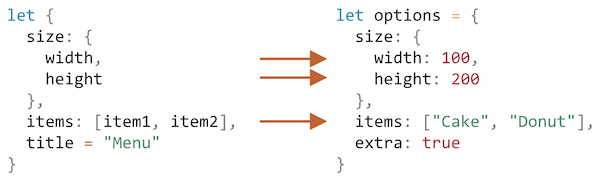


**智能函数参数**

如果一个函数有很多参数，其中大部分的参数都是可选的，例如：

```js
function showMenu(title = "Untitled", width = 200, height = 100, items = []) {
  // ...
}
```

这样的函数存在如下问题：

- **记忆如此多的参数的顺序是一个很大的负担**

- **大部分的参数只需采用默认值的情况下，调用这个函数时会需要写大量的 `undefined`**

  ```js
  // 在采用默认值就可以的位置设置 undefined
  showMenu("My Menu", undefined, undefined, ['Item1', 'Item2']);

为了解决上述两个问题，**可以用一个对象来传递所有参数，而函数负责把这个对象解构成各个参数**。

```js
// 我们传递一个对象给函数
let options = {
  title: 'My menu',
  items: ['Item1', 'Item2'],
};

showMenu(options);

// 函数把对象解构成变量
function showMenu({title = 'Untitled', width = 200, height = 100, items = []}) {
  // title, items – 提取于 options，
  // width, height – 使用默认值
  alert( `${title} ${width} ${height}` ); // My Menu 200 100
  alert( items ); // Item1, Item2
}
```

也可以使用带有嵌套对象和冒号映射的更加复杂的解构：

```js
let options = {
  title: 'My menu',
  items: ['Item1', 'Item2'],
};

showMenu(options);

function showMenu({
  title = 'Untitled',
  width: w = 100,  // 宽度赋值给变量 w
  height: h = 200, // 高度赋值给变量 h
  items: [item1, item2] // items 中的元素按顺序分别赋值给变量 item1 和 item2
}) {
  alert( `${title} ${w} ${h}` ); // My Menu 100 200
  alert( item1 ); // Item1
  alert( item2 ); // Item2
}
```

**⚠️ 注意：想让所有的参数都使用默认值，应该传递一个空对象：**

```js
showMenu({}); // 正确，所有值都取默认值

showMenu(); // 这样会导致错误，不传参数等价于对 undefined 进行解构，所以报错
```

也可以**通过定空对象 `{}` 为整个参数对象的默认值**来解决这个问题：

```js
function showMenu({ title = "Menu", width = 100, height = 200 } = {}) {
  alert( `${title} ${width} ${height}` );
}

showMenu(); // Menu 100 200
```

上述代码中，**整个参数对象的默认是 `{}`，因此总会有内容可以用来解构**。


## 日期和时间

JavaScript 中有一个内建的对象 `Date`，用来存储日期和时间，并提供了日期/时间的管理方法。

**⚠️ 注意：Date 在默认的类型转换中优先调用 `toString()`，而不是 `valueOf()`**。


**创建**

- **`new Date()`**

  通过 `new Date()` 来创建一个新的 `Date` 对象。

  ```js
  const now = new Date();
  alert(now); // 显示当前的日期/时间
  ```
  
  

- **`new Date(milliseconds)`**

  创建一个 `Date` 对象，其时间等于 1970 年 1 月 1 日 UTC+0 之后经过的毫秒数（1/1000 秒）

  ```js
  const Jan01_1970 = new Date(0); // 0 表示 01.01.1970 UTC+0
  alert(Jan01_1970);
  
  // 现在增加 24 小时，得到 02.01.1970 UTC+0
  const Jan02_1970 = new Date(24 * 3600 * 1000);
  alert(Jan02_1970);
  ```

  `milliseconds` 表示自 1970-01-01 00:00:00 以来经过的毫秒数，该整数被称为**时间戳**。

  在 1970-01-01 00:00:00 之前的日期需要使用**带有负的时间戳**：

  ```js
  // 现在减少 24 小时，得到 12.31.1969 UTC+0
  const Dec31_1969 = new Date(-24 * 3600 * 1000);
  alert(Dec31_1969);
  ```

  

- **`new Date(datestring)`**

  **如果只有一个参数，并且是字符串，那么它会被自动解析**，解析算法和 `Date.parse` 所使用的算法相同。

  ```js
  const date = new Date('2025-06-29');
  alert(date);
  ```

  **⚠️ 注意：** 如果未指定具体时间，假定时间为格林尼治标准时间（GMT）的午夜零点，**运行代码时会根据用户的时区自动进行调整**，例如:

  ```js
  let date = new Date('2017-01-26');
  alert(date);
  // 结果可能是
  // Thu Jan 26 2017 11:00:00 GMT+1100 (Australian Eastern Daylight Time)
  // 或
  // Wed Jan 25 2017 16:00:00 GMT-0800 (Pacific Standard Time)
  ```

  

- **`new Date(year, month, date, hours, minutes, seconds, ms)`**

  使用当前时区中给定的组件来创建日期，**只有前两个参数是必须的**。

  - `year` 应该是四位数，为了兼容性也接受 2 位数，并将其视为 `19xx`，例如 `98` 与 `1998` 相同，**建议始终使用 4 位数**
  - `month` 计数从 `0`（一月）开始，到 `11`（十二月）结束
  - `date` 是当月的具体某一天，如果缺失，则为默认值 `1`
  - 如果 `hours/minutes/seconds/ms` 缺失，则均为默认值 `0`

  例如：

  ```js
  new Date(2011, 0, 1, 0, 0, 0, 0); // 1 Jan 2011, 00:00:00
  new Date(2011, 0, 1); // 同样，时分秒等均为默认值 0
  ```

  

  时间度量最大精确到 1 毫秒（1/1000 秒）：

  ```js
  let date = new Date(2011, 0, 1, 2, 3, 4, 567);
  alert( date ); // 1.01.2011, 02:03:04.567
  ```

  上述代码中 567 表示 567 毫秒，等于 0.567 秒。


**访问日期组件**

- **`getFullYear()`** —— 获取年份（4 位数）

  **⚠️ 注意：不是 `getYear()`，而是 `getFullYear()`**，很多 JavaScript 引擎都实现了一个非标准化的方法 `getYear()`，不推荐使用这个方法。它有时候可能会返回 2 位的年份信息，**永远不要使用它**。

- **`getMonth()`** —— 获取月份，**从 0 到 11**

- **`getDate()`** —— 获取当月的具体日期，从 1 到 31

- **`getHours()`** —— 获取小时，从 0 到 23

- **`getMinutes()`** —— 获取分钟，从 0 到 59

- **`getSeconds()`** —— 获取秒，从 0 到 59

- **`getMilliseconds`** —— 获取毫秒，从 0 到 999

- **`getDay()`** —— 获取一周中的第几天(星期)，**从 `0`（星期日）到 `6`（星期六），第一天始终是星期日，某些国家可能不是这样的习惯，但这不能被改变**

**⚠️ 注意：** 以上的所有方法返回的组件都是基于当地时区（根据当地时区自动调整返回结果）。


如果需要基于 UTC（协调世界时），可以使用对应的 `getUTC*()` 方法，它们会返回基于 UTC+0 时区的日、月、年等：

- **`getUTCFullYear()`**
- **`getUTCMonth()`**
- **`getUTCDay()`**

只需要在 `'get'` 之后插入 `UTC` 即可，例如：

```js
//  当前日期
let date = new Date();

// 当地时区的小时数
alert( date.getHours() );

// 在 UTC+0 时区的小时数（非夏令时的伦敦时间）
alert( date.getUTCHours() );
```

**⚠️ 注意：** 除了上述给定的方法，还有两个没有 UTC 变体的特殊方法：

- **`getTime()`** —— 返回日期的时间戳

- **`getTimezoneOffset()`** —— 返回 UTC 与本地时区之间的时差，**以分钟为单位**

  ```js
  // 如果你在时区 UTC-1，输出 60
  // 如果你在时区 UTC+3，输出 -180
  alert( new Date().getTimezoneOffset() );
  ```


**设置日期组件**

有下列方法可以设置日期/时间组件：

- `setFullYear(year, [month], [date])`
- `setMonth(month, [date])`
- `setDate(date)`
- `setHours(hour, [min], [sec], [ms])`
- `setMinutes(min, [sec], [ms])`
- `setSeconds(sec, [ms])`
- `setMilliseconds(ms)`
- `setTime(milliseconds)`

以上方法除了 `setTime()` 都有 UTC 变体，例如：`setUTCHours()`。

有些方法可以一次性设置多个组件，比如 `setHours`，未提及的组件不会被修改：

```js
let today = new Date();

today.setHours(0);
alert(today); // 日期依然是今天，但是小时数被改为了 0

today.setHours(0, 0, 0, 0);
alert(today); // 日期依然是今天，时间为 00:00:00。
```


**自动校准**

**自动校准**是 `Date` 对象的一个非常方便的特性，可以设置超范围的数值，它会自动校准，例如：

```js
let date = new Date(2013, 0, 32); // 32 Jan 2013 ?!?
alert(date); // 是 1st Feb 2013
```

超出范围的日期组件将会被自动分配。

例如要在日期 “28 Feb 2016” 上加 2 天，结果可能是 “2 Mar” 或 “1 Mar”，因为存在闰年，但不需要考虑这些，只需要直接加 2 天，剩下的 `Date` 对象会帮我们处理：

```js
let date = new Date(2016, 1, 28);
date.setDate(date.getDate() + 2);

alert( date ); // 1 Mar 2016
```


还可以设置 `0` 甚至是负值，例如：

```js
let date = new Date(2016, 0, 2); // 2016 年 1 月 2 日

date.setDate(1); // 设置为当月的第一天
alert(date);

date.setDate(0); // 天数最小可以设置为 1，所以这里设置的是上一月的最后一天
alert(date); // 31 Dec 2015
```

**⚠️ 注意：** `date.setDate(0)` 可以获取上个月的最后一天。


**日期转换为数字，日期差值**

当 `Date` 对象被转化为数字时，得到的是对应的时间戳，与使用 `date.getTime()` 的结果相同：

```js
let date = new Date();
alert(+date); // 以毫秒为单位的数值，与使用 date.getTime() 的结果相同
```

**⚠️ 注意：** 日期可以相减，相减的结果是以毫秒为单位时间差，这个作用可以用于时间测量：

```js
let start = new Date(); // 开始测量时间

// 执行一些耗时的任务
for (let i = 0; i < 100000; i++) {
  let doSomething = i * i * i;
}

let end = new Date();

alert(`循环耗时 ${end - start} ms`);
```


**Date.now()**

如果仅仅想要测量时间间隔而不需要 `Date` 对象，可以使用 `Date.now()` 返回当前的时间戳。

它相当于 `new Date().getTime()`，但**它不会创建中间的 `Date` 对象**，所以它更快，而且**不会对垃圾回收造成额外的压力**。

这种方法很多时候因为方便，又或是因性能方面的考虑而被采用。

```js
let start = Date.now(); // 从 1 Jan 1970 至今的时间戳

// 执行一些耗时的任务
for (let i = 0; i < 100000; i++) {
  let doSomething = i * i * i;
}

let end = Date.now(); // 完成

alert(`循环耗时 ${end - start} ms`); // 相减的是时间戳，而不是日期
```

**⚠️ 注意：** 有时候需要更加精准的时间度量，JavaScript 自身并没有测量微秒的方法（百万分之一秒），但大多数运行环境会提供，例如：浏览器有 **`performance.now()` 方法**来给出从页面加载开始的以毫秒为单位的微秒数（精确到毫秒的小数点后三位）：

```js
alert(`Loading started ${performance.now()}ms ago`);
// 类似于 "Loading started 34731.26000000001ms ago"
// .26 表示的是微秒（260 微秒）
// 小数点后超过 3 位的数字是精度错误，只有前三位数字是正确的
```

Node.js 可以通过 `microtime` 模块或使用其他方法，从技术上讲，几乎所有的设备和环境都允许获取更高精度的时间数值，只不过不是使用 `Date` 对象。


**基准测试（Benchmarking）**

对一个很耗 CPU 性能的函数进行可靠的基准测试（Benchmarking）时，需要谨慎一点。

例如计算以下两个计算日期差值的函数：哪个更快？

这种性能测量通常称为 **“基准测试（benchmark）”**。

```js
// 我们有 date1 和 date2，哪个函数会更快地返回两者的时间差？
function diffSubtract(date1, date2) {
  return date2 - date1;
}

function diffGetTime(date1, date2) {
  return date2.getTime() - date1.getTime();
}
```

首先想到的方法可能是连续运行两者很多次，并计算所消耗的时间差，因为两个函数过于简单，所以必须执行至少 100000 次。

```js
function diffSubtract(date1, date2) {
  return date2 - date1;
}

function diffGetTime(date1, date2) {
  return date2.getTime() - date1.getTime();
}

function bench(f) {
  const date1 = new Date(0);
  const date2 = new Date();
  
  let start = Date.now();
  
  for (let i = 0; i < 100000; i++) f(date1, date2);
  
  return Date.now() - start;
}

alert('Time of diffSubtract: ' + bench(diffSubtract) + 'ms');
alert('Time of diffGetTime: ' + bench(diffGetTime) + 'ms');
```

上述代码运行才结果来看 `getTime()` 这种方式快得多，因为它没有进行类型转换，对引擎优化来说更加简单。

但是这样的基准测试存在一个问题：如果当运行 `bench(diffSubtract)` 的同时，CPU 还在并行处理其他事务，并且这也会占用资源，然而运行 `bench(diffGetTime)` 的时候，并行处理的事务完成了，从而**可能会导致错误的结论**。

**为了得到更加可靠的度量，整个度量测试包应该重新运行多次。**

```js
function diffSubtract(date1, date2) {
  return date2 - date1;
}

function diffGetTime(date1, date2) {
  return date2.getTime() - date1.getTime();
}

function bench(f) {
  let date1 = new Date(0);
  let date2 = new Date();

  let start = Date.now();
  for (let i = 0; i < 100000; i++) f(date1, date2);
  return Date.now() - start;
}

let time1 = 0;
let time2 = 0;

// 交替运行 bench(diffSubtract) 和 bench(diffGetTime) 各 10 次
for (let i = 0; i < 10; i++) {
  time1 += bench(diffSubtract);
  time2 += bench(diffGetTime);
}

alert('Total time for diffSubtract: ' + time1 + 'ms');
alert('Total time for diffGetTime: ' + time2 + 'ms');
```

现代的 JavaScript 引擎的先进优化策略只对执行很多次的 “hot code” 有效（对于执行很少次数的代码没有必要优化），所以上述代码中**第一次执行的优化程度不高，可能需要增加一个预热步骤**。

```js
// 在主循环中增加预热环节
bench(diffSubtract);
bench(diffGetTime);

// 开始度量
for (let i = 0; i < 10; i++) {
  time1 += bench(diffSubtract);
  time2 += bench(diffGetTime);
}
```

**⚠️ 注意：** 进行微型基准测试时要小心，现代的 JavaScript 引擎执行了很多优化，与正常编写的代码相比，它们**可能会改变 “人为编写的专用于测试的代码” 的执行流程**，特别是在我们对很小的代码片段进行基准测试时，如果需要深入理解性能问题，需要学习 JavaScript 引擎的工作原理，之后可能就再也不需要进行微型基准测试了。


**对字符串调用 Date.parse**

`Date.parse(str)` 方法可以从一个字符串中读取日期。

**字符串的格式应该为：`YYYY-MM-DDTHH:mm:ss.sssZ`**，其中：

- `YYYY-MM-DD` —— 日期：年-月-日
- 字符 `T` 是一个分隔符
- `HH:mm:ss.sss` —— 时间：小时，分钟，秒，毫秒
- 可选字符 `'Z'` 为 `+-hh:mm` 格式的时区，单个字符 `Z` 代表 UTC+0 时区

简短形式也是可以的，比如 `YYYY-MM-DD` 或 `YYYY-MM`，甚至可以是 `YYYY`。

`Date.parse(str)` 调用会解析给定格式的字符串，并**返回时间戳**，如果**给定字符串的格式不正确，则返回 `NaN`**。

例如：

```js
let ms = Date.parse('2012-01-26T13:51:50.417-07:00');
alert(ms); // 1327611110417
```

可以通过时间戳来立即创建一个 `new Date` 对象：

```js
let date = new Date( Date.parse('2012-01-26T13:51:50.417-07:00') );
alert(date);
```


## JSON

如果有一个复杂的对象，需要转换为字符串，用来通过网络发送或者在日志中输出它，可以使用 **JSON（JavaScript Object Notation）**。

**JSON 是表示值和对象的通用格式**，在 [RFC 4627](https://tools.ietf.org/html/rfc4627) 标准中有对其的描述。最初它是为 JavaScript 而创建的，但许多其他编程语言也有用于处理它的库。

JavaScript 提供了如下方法：

- `JSON.stringify` 将对象转换为 JSON
- `JSON.parse` 将 JSON 转换回对象

例如 `JSON.stringify` 一个 `student` 对象：

```js
let student = {
  name: 'John',
  age: 30,
  isAdmin: false,
  courses: ['html', 'css', 'js'],
  spouse: null
};

let json = JSON.stringify(student);

alert(typeof json); // string
alert(json);
```

上述代码中方法 `JSON.stringify(student)` 接收对象并将其转换为字符串，得到的 `json` 字符串是一个被称为 **JSON 编码（JSON-encoded）** 或 **序列化（serialized）** 或 **字符串化（stringified）** 或 **编组化（marshalled）** 的对象。

**⚠️ 注意：** JSON 编码的对象与对象字面量有几个重要的区别：

- **字符串使用双引号，JSON 中没有单引号或反引号**，所以 `'John'` 被转换为 `"John"`

- **对象属性名称也是双引号的，这是强制性的**，所以 `age: 30` 被转换成 `"age": 30`

- **`JSON.stringify` 也可以应用于原始（primitive）数据类型**，支持以下数据类型：

  - Objects `{ ... }`
  - Arrays `[ ... ]`
  - Primitives：
    - strings
    - numbers
    - boolean values `true/false`
    - `null`

  例如：

  ```js
  // 数字在 JSON 还是数字
  alert( JSON.stringify(1) ) // 1
  
  // 字符串在 JSON 中还是字符串，只是被双引号扩起来
  alert( JSON.stringify('test') ) // "test"
  
  alert( JSON.stringify(true) ); // true
  
  alert( JSON.stringify([1, 2, 3]) ); // [1,2,3]
  ```

  JSON 是语言无关的纯数据规范，因此**一些特定于 JavaScript 的对象属性会被 `JSON.stringify` 跳过**，即：

  - 函数属性（方法）
  - Symbol 类型的键和值
  - 存储 `undefined` 的属性

  ```js
  let user = {
    sayHi() { // 被忽略
      alert('Hello');
    },
    [Symbol('id')]: 123, // 被忽略
    something: undefined // 被忽略
  };
  
  alert( JSON.stringify(user) ); // {}（空对象）
  ```

  

- **JSON 支持嵌套对象转换**

  ```js
  let meetup = {
    title: 'Conference',
    room: {
      number: 23,
      participants: ['john', 'ann'],
    },
  };
  
  alert( JSON.stringify(meetup) );
  /* 整个结构都被字符串化了
  {
    "title":"Conference",
    "room":{"number":23,"participants":["john","ann"]},
  }
  */
  ```

  

- **JSON 不支持循环引用的对象**

  ```js
  let room = {
    number: 23
  };
  
  let meetup = {
    title: 'Conference',
    participants: ['john', 'ann'],
  };
  
  meetup.place = room;       // meetup 引用了 room
  room.occupiedBy = meetup; // room 引用了 meetup
  
  JSON.stringify(meetup); // Error: Converting circular structure to JSON
  ```

  上述代码转换失败，因为循环引用：`room.occupiedBy` 引用了 `meetup`，`meetup.place` 引用了 `room`：

  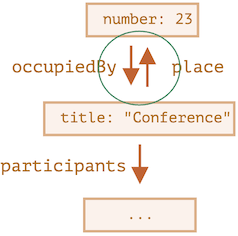


**排除和转换：replacer**

`JSON.stringify` 的完整语法是：

```js
let json = JSON.stringify(value[, replacer, space]);
```

- **`value`：** 要编码的值
- **`replacer`：** 要编码的属性数组或映射函数 `function(key, value)`
- **`space`：** 用于格式化的空格数量

大多数情况下，`JSON.stringify` 只使用第一个参数，如果需要微调替换过程，例如过滤掉循环引用，可以使用 `JSON.stringify` 的第二个参数。

如果传递一个属性数组给它，那么只有这些属性会被编码。

```js
let room = {
  number: 23
};

let meetup = {
  title: 'Conference',
  participants: [{name: 'John'}, {name: 'Alice'}],
  place: room // meetup 引用了 room
};

room.occupiedBy = meetup; // room 引用了 meetup

alert( JSON.stringify(meetup, ['title', 'participants']) );
// {"title":"Conference","participants":[{},{}]}
```

上述代码中 `participants` 是空的，因为 `name` 不在列表中，可以包含除了会导致循环引用的 `room.occupiedBy` 之外的所有属性：

```js
let room = {
  number: 23
};

let meetup = {
  title: 'Conference',
  participants: [{name: 'John'}, {name: 'Alice'}],
  place: room // meetup 引用了 room
};

room.occupiedBy = meetup; // room 引用了 meetup

alert( JSON.stringify(meetup, ['title', 'participants', 'place', 'name', 'number']) );
/*
{
  "title":"Conference",
  "participants":[{"name":"John"},{"name":"Alice"}],
  "place":{"number":23}
}
*/
```

现在除 `occupiedBy` 以外的所有内容都被序列化了，**但是属性的列表太长了**。

这时可以使用一个函数代替数组作为 `replacer`。

**该函数会为每个 `(key,value)` 对调用并返回 “已替换” 的值，该值将替换原有的值，如果返回 `undefined` ，则跳过该值**。

```js
let room = {
  number: 23
};

let meetup = {
  title: 'Conference',
  participants: [{name: 'John'}, {name: 'Alice'}],
  place: room // meetup 引用了 room
};

room.occupiedBy = meetup; // room 引用了 meetup

alert( JSON.stringify(meetup, function replacer(key, value) {
  alert(`${key}: ${value}`);
  return (key === 'occupiedBy') ? undefined : value;
}));

/* key:value pairs that come to replacer:
:             [object Object]
title:        Conference
participants: [object Object],[object Object]
0:            [object Object]
name:         John
1:            [object Object]
name:         Alice
place:        [object Object]
number:       23
occupiedBy: [object Object]
*/
```

 **⚠️ 注意：** 

- `replacer` 函数会获取每个键/值对，包括嵌套对象和数组项。它被递归地应用，**`replacer` 中的 `this` 的值是包含当前属性的对象**
- 第一个调用很特别，它是**使用特殊的 “包装对象” 制作的：`{"": meetup}`**，第一个 `(key, value)` 对的键是空的，并且该值是整个目标对象，也是上面的示例中第一行是 `":[object Object]"` 的原因，是所以这样是为了给 `replacer` 提供尽可能多的功能：如果有必要，它有机会分析并替换/跳过整个对象


**格式化：space**

`JSON.stringify(value, replacer, spaces)` 的第三个参数是用于**优化格式的空格数量**。

所有字符串化的对象默认都没有缩进和额外的空格，这没有什么问题，**`space` 参数专门用于调整出更美观的输出**。

```js
let user = {
  name: 'John',
  age: 25,
  roles: {
    isAdmin: false,
    isEditor: true,
  }
};

alert(JSON.stringify(user, null, 2));
/* 两个空格的缩进：
{
  "name": "John",
  "age": 25,
  "roles": {
    "isAdmin": false,
    "isEditor": true
  }
}
*/

/* 对于 JSON.stringify(user, null, 4) 的结果会有更多缩进：
{
    "name": "John",
    "age": 25,
    "roles": {
        "isAdmin": false,
        "isEditor": true
    }
}
*/
```

上述代码中 `space = 2` 告诉 JavaScript 在多行中显示嵌套的对象，对象内部缩进 2 个空格。

 **⚠️ 注意：第三个参数也可以是字符串**，这种情况下，**字符串用于缩进，而不是空格的数量**。

```js
const user = {
  name: 'Alice',
  age: 30,
  skills: ['JavaScript', 'Python']
};

alert(JSON.stringify(user, null, '*'))
/*
每一层缩进使用一个 *，嵌套越深，* 的数量越多（逐层叠加）

{
*"name": "Alice",
*"age": 30,
*"skills": [
**"JavaScript",
**"Python"
*]
}
*/
```


**自定义 toJSON**

像 `toString` 进行字符串转换，**对象也可以提供 `toJSON` 方法来进行 JSON 转换，如果可用，`JSON.stringify` 会自动调用它**。

```js
let room = {
  number: 23
};

let meetup = {
  title: 'Conference',
  date: new Date(Date.UTC(2017, 0, 1)),
  room
};

alert( JSON.stringify(meetup) );

/*
  {
    "title":"Conference",
    "date":"2017-01-01T00:00:00.000Z",
    "room": {"number":23}
  }
*/
```

上述代码中 `date` 变成了一个字符串，因为所**有日期对象都有一个内建的 `toJSON` 方法来返回这种类型的字符串**。

为对象 `room` 添加一个自定义的 `toJSON`：

```js
let room = {
  number: 23,
  toJSON() {
    return this.number;
  }
};

let meetup = {
  title: 'Conference',
  room
};

alert( JSON.stringify(room) ); // 23
alert( JSON.stringify(meetup) );
/*
  {
    "title":"Conference",
    "room": 23
  }
*/
```

就像上述代码一样，**`toJSON` 既可以用于直接调用 `JSON.stringify(room)` 也可以用于当 `room` 嵌套在另一个编码对象中时**。


**JSON.parse**

要解析 JSON 字符串，需要使用 `JSON.parse` 方法。

语法：

```js
let value = JSON.parse(str, [reviver]);
```

- **`str`：** 要解析的 JSON 字符串
- **`reviver`：** 可选的函数 function(key,value)，该函数将为每个 `(key, value)` 对调用，并可以对值进行转换

例如：

```js
// 字符串化数组
let numbers = '[0, 1, 2, 3]';

numbers = JSON.parse(numbers);

alert( numbers[1] ); // 1
```

对于嵌套对象：

```js
let userData = '{ "name": "John", "age": 35, "isAdmin": false, "friends": [0,1,2,3] }';

let user = JSON.parse(userData);

alert( user.friends[1] ); // 1
```

 **⚠️ 注意：** 

- JSON 字符串中不支持注释，向 JSON 添加注释无效
- 还有另一种名为 [JSON5](http://json5.org/) 的格式，它允许未加引号的键，也允许注释等，但它是一个独立的库，不在语言规范中，JSON 标准之所以严格是为够简单，可靠且快速地实现解析算法


**使用 reviver**

例如当从服务器上获取了一个字符串化的 `meetup` 对象。

```js
let str = '{"title":"Conference","date":"2017-11-30T12:00:00.000Z"}';
```

现在需要**反序列（deserialize）**，把它转换回 JavaScript 对象，调用 `JSON.parse` 来完成：

```js
let str = '{"title":"Conference","date":"2017-11-30T12:00:00.000Z"}';

let meetup = JSON.parse(str);
alert( meetup.date.getDate() ); // VM1590:4 Uncaught TypeError: meetup.date.getDate is not a function
```

上述代码报错的原因：`meetup.date` 的值是一个字符串，而不是 `Date` 对象，没有 `getDate` 方法。

这时可以将 reviver 函数传递给 `JSON.parse` 作为第二个参数，让其它属性 “原样” 返回所有值，但是 `date` 属性的值会变成 `Date` 类型：

```js
const str = '{"title":"Conference","date":"2017-11-30T12:00:00.000Z"}';

const meetup = JSON.parse(str, function(key, value) {
  if (key === 'date') return new Date(value);
  return value;
});

alert( meetup.date.getDate() ); // 30
```

 **⚠️ 注意：** reviver 函数也同样适用于嵌套对象。


## 递归和堆栈

**递归**是一种编程模式，表示从自身调用函数（自调用），递归函数可用于以更优雅的方式解决问题。

例如实现一个 `pow(x, n)` 函数，它可以计算 `x` 的 `n` 次方。

主要有以下两种实现方式：

- **迭代思路：** 使用 `for` 循环

  ```js
  function pow(x, n) {
    let result = 1;
  
    // 在循环中，用 x 乘以 result n 次
    for (let i = 0; i < n; i++) {
      result *= x;
    }
  
    return result;
  }
  
  alert( pow(2, 3) ); // 8
  ```

  

- **递归思路：** 简化任务，调用自身

  ```js
  function pow(x, n) {
    return n == 1 ? x : (x * pow(x, n - 1));
  }
  
  alert( pow(2, 3) ); // 8
  ```

  1. 当 `n == 1`，所有事情都会很简单，这叫做**基础的递归**，它会立即产生明显的结果：`pow(x, 1)` 等于 `x`
  2. 否则，我们可以用 `x * pow(x, n - 1)` 表示 `pow(x, n)`，这叫做**一个递归步骤**：将任务转化为更简单的行为（`x` 的乘法）和更简单的同类任务的调用（带有更小的 `n` 的 `pow` 运算）

  简单来说就是 `pow` **递归地调用自身** 直到 `n == 1`。

  
   **⚠️ 注意：** 
  
  - **递归解通常比迭代解更短**
  - 最大的嵌套调用次数（包括首次）被称为**递归深度**，例如前面的例子中，它正好为 `n`，最大递归深度受限于 JavaScript 引擎。通常来说，**引擎在最大迭代深度为 10000 及以下时是可靠的**，有些引擎可能允许更大的最大深度，但是对于大多数引擎来说，100000 可能就超出限制了，一些浏览器支持**尾部调用优化**，但目前它们还没有被完全支持，只能用于简单场景，虽然限制了递归的应用，但是递归仍然被广泛使用，递归思维方式会使代码更简单，更容易维护


**执行上下文和堆栈**

正在运行的函数的执行过程的相关信息被存储在其**执行上下文**中。

执行上下文是一个内部的数据结构，它包含有关函数执行时的详细细节：**当前控制流所在的位置，当前的变量，`this` 的值，以及其它的一些内部细节**。

一个函数调用**仅具有一个**与其相关联的执行上下文。

当一个函数进行**嵌套调用（调用自己（递归），也可能是调用其它函数）**时，执行的过程如下：

1. 当前函数被暂停
2. 与它关联的执行上下文被一个叫做**执行上下文堆栈**的特殊数据结构保存
3. 执行嵌套调用
4. 嵌套调用结束后，从堆栈中恢复之前的执行上下文，并**从停止的位置恢复外部函数**

例如前面 `pow(2, 3)` 的执行过程如下：

在调用 `pow(2, 3)` 的开始，执行上下文（context）会存储变量：`x = 2, n = 3`，执行流程在函数的第 `1` 行。

可以将其描绘为：


当函数开始执行的时候，条件 `n == 1` 结果为假，所以执行流程进入 `if` 的第二分支。

```js
function pow(x, n) {
  if (n == 1) {
    return x;
  } else {
    return x * pow(x, n - 1); // 执行到此处
  }
}

alert( pow(2, 3) );
```

变量相同，但是**行改变了**，因此现在的上下文是：


为了计算 `x * pow(x, n - 1)`，需要使用带有新参数的新的 `pow` 子调用 `pow(2, 2)`。

为了执行嵌套调用，JavaScript 会在**执行上下文堆栈**中记住当前的执行上下文。

执行过程如下：

1. 当前上下文被 “记录” 在堆栈的顶部
2. 为子调用创建新的上下文
3. 当子调用结束后 —— 前一个上下文被从堆栈中弹出，并继续执行

下面是进入子调用 `pow(2, 2)` 时的上下文堆栈：


新的当前执行上下文位于顶部（粗体显示），之前记住的上下文位于下方，当子调用完成后，很容易恢复上一个上下文，因为**它既保留了变量，也保留了当时所在代码的确切位置**。

重复该过程：在第 `5` 行生成新的子调用，现在的参数是 `x=2`, `n=1`。

新的执行上下文被创建，前一个被压入堆栈顶部：

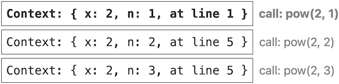

此时，有 2 个旧的上下文和 1 个当前正在运行的 `pow(2, 1)` 的上下文。

在执行 `pow(2, 1)` 时，与之前的不同，条件 `n == 1` 为真，因此 `if` 的第一个分支生效：

```js
function pow(x, n) {
  if (n == 1) {
    return x; // 执行到此处
  } else {
    return x * pow(x, n - 1);
  }
}
```

此时不再有更多的嵌套调用，所以函数结束，返回 `2`。

函数完成后，就不再需要其执行上下文了，因此它被从内存中移除。前一个上下文恢复到堆栈的顶部。

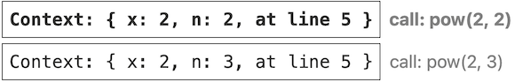

恢复执行 `pow(2, 2)`。它拥有子调用 `pow(2, 1)` 的结果，因此也可以完成 `x * pow(x, n - 1)` 的执行，并返回 `4`。

然后，前一个上下文被恢复：


它结束后，得到了最终的结果 `pow(2, 3) = 8`。

本示例中的递归深度为：**3**，从前面的插图我们可以看出，**递归深度等于堆栈中上下文的最大数量**。

 **⚠️ 注意：执行上下文占用内存**，在前面的例子中 `n` 次方需要存储 `n` 个上下文，以供更小的 `n` 值进行计算使用，所以**递归算法更占内存，而循环算法更节省内存**：

```js
function pow(x, n) {
  let result = 1;

  for (let i = 0; i < n; i++) {
    result *= x;
  }

  return result;
}
```

迭代 `pow` 的过程中**仅使用了一个执行上下文**用于修改 `i` 和 `result`。它的内存要求小，并且是固定了，不依赖于 `n`。

**任何递归都可以用循环来重写，通常循环变体更有效**，但有时重写很难，尤其是函数根据条件使用不同的子调用，然后合并它们的结果，或者分支比较复杂时，而且有些优化可能没有必要，完全不值得。

递归可以使代码更短，更易于理解和维护，但不是每个地方都需要优化，大多数时候只需要一个好代码，这就是为什么要使用它。


**递归遍历**

递归的一个重要应用就是递归遍历。

假如有一家公司，人员结构可以表示为一个对象：

```js
let company = {
  sales: [{
    name: 'John',
    salary: 1000
  }, {
    name: 'Alice',
    salary: 1600
  }],

  development: {
    sites: [{
      name: 'Peter',
      salary: 2000
    }, {
      name: 'Alex',
      salary: 1800
    }],

    internals: [{
      name: 'Jack',
      salary: 1300
    }]
  }
};
```

需要一个函数来获取所有薪资的总数，使用迭代方式并不容易，因为结构比较复杂，但可以使用递归来实现。

```js
function sumSalaries(department) {
  if (Array.isArray(department)) {
    return department.reduce((prev, current) => prev + current.salary, 0); // 求数组的和
  } else {
    let sum = 0;
    for (let subdep of Object.values(department)) {
      sum += sumSalaries(subdep); // 递归调用所有子部门，对结果求和
    }
    return sum;
  }
}

alert(sumSalaries(company)); // 7700
```

上述代码适用于任何层次的子部门嵌套。


**递归结构**

递归（递归定义的）数据结构是一种部分复制自身的结构。

前面的公司结构是递归结构，一个公司的**部门**是：

- 人员数组
- 或一个**部门**对象


 Web 开发中的 HTML 和 XML 文档也是递归结构，在 HTML 文档中，一个 **HTML 标签**可能包括以下内容：

- 文本片段
- HTML 注释
- 其它 **HTML 标签**（它有可能又包括文本片段、注释或其它标签等）


**链表**

链表也是一种递归结构。

如果我们要存储一个有序的对象列表，通常来说会选择数组：

```js
let arr = [obj1, obj2, obj3];
```

但是使用数组有一个问题，**“删除元素” 和 “插入元素” 的操作代价非常大**，因为这些操作必须对所有元素重新编号，如果数组内的元素很多，会很耗时。

如果我们确实需要快速插入/删除，可以选择种叫做**链表**的数据结构。

**链表元素** 是一个使用以下元素通过递归定义的对象：

- `value`
- `next` 属性引用下一个**链表元素**或者代表末尾的 `null`

例如：

```js
let list = {
  value: 1,
  next: {
    value: 2,
    next: {
      value: 3,
      next: {
        value: 4,
        next: null
      }
    }
  }
};
```

图形表示为：

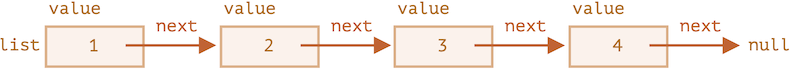

一段用来创建链表的代码：

```js
let list = { value: 1 };
list.next = { value: 2 };
list.next.next = { value: 3 };
list.next.next.next = { value: 4 };
list.next.next.next.next = null;
```

上述代码有很多个对象，每一个都有 `value` 和指向邻居的 `next`，变量 `list` 是链条中的第一个对象，因此顺着 `next` 指针，可以抵达任何元素。

该链表可以很容易被拆分为多个部分，然后再重新组装回去：

```js
let secondList = list.next.next;
list.next.next = null;
```

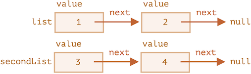

也可以将合并链表：

```js
list.next.next = secondList;
```


也可以在任何位置插入或移除元素：

```js
let list = { value: 1 };
list.next = { value: 2 };
list.next.next = { value: 3 };
list.next.next.next = { value: 4 };

// 将新值添加到链表头部
list = { value: 'new item', next: list };
```

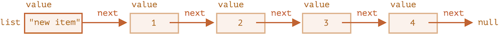

与数组不同，**链表没有大规模重排**，可以很容易地重新排列元素。

**⚠️ 注意：** 链表主要的缺点就是无法很容易地通过元素的编号获取元素，但在数组中很容易：例如 `arr[n]` 是一个直接引用，**但在链表中需要从起点元素开始，顺着 `next` 找 `N` 次才能获取到第 `N` 个元素**。

链表可以得到增强：

- 我们可以在 `next` 之外，再添加 `prev` 属性来引用前一个元素，以便轻松地往回移动
- 我们还可以添加一个名为 `tail` 的变量，该变量引用链表的最后一个元素
- 链表的数据结构可能会根据我们的需求而变化


## Rest 参数与 Spread 语法

**Rest 参数**

在 JavaScript 中，无论函数是如何定义的，你都可以在调用它时传入任意数量的参数。

例如：

```js
function sum(a, b) {
  return a + b;
}

alert( sum(1, 2, 3, 4, 5) );
```

上述代码不会因为传入过多的参数而报错，但只有前两个参数被求和了。

可以**在函数定义中声明一个数组来收集参数**，语法为：`...变量名`，这将会声明一个数组并指定其名称，这三个点的语义就是 **“收集剩余的参数并存进指定数组中”**。

例如需要把所有的参数都放到数组 `args` 中：

```js
function sumAll(...args) { // 数组名为 args
  let sum = 0;

  for (let arg of args) sum += arg;

  return sum;
}

alert( sumAll(1) ); // 1
alert( sumAll(1, 2) ); // 3
alert( sumAll(1, 2, 3) ); // 6
```

也可以选择将前几个参数获取为变量，并将剩余的参数收集起来，例如：

```js
function showName(firstName, lastName, ...titles) {
  alert( firstName + ' ' + lastName ); // Julius Caesar

  // 剩余的参数被放入 titles 数组中
  // titles = ['Consul', 'Imperator']
  alert( titles[0] ); // Consul
  alert( titles[1] ); // Imperator
  alert( titles.length ); // 2
}

showName('Julius', 'Caesar', 'Consul', 'Imperator');
```

**⚠️ 注意：Rest 参数必须在参数列表的末尾**，Rest 参数会收集剩余的所有参数，因此下面这种用法没有意义，并且会导致错误：

```js
function f(arg1, ...rest, arg2) { // arg2 在 ...rest 后面？！
  // Uncaught SyntaxError: Rest parameter must be last formal parameter
}
```

`...rest` 必须写在参数列表的最后。


**arguments 变量**

有一个名为 `arguments` 的特殊对象可以在函数中被访问，该对象**以参数在参数列表中的索引作为键，存储所有参数**。

**`arguments` 对象既是一个类数组，也是一个可迭代对象**。

例如：

```js
function showName() {
  alert(arguments.length);
  alert(arguments[0]);
  alert(arguments[1]);

  // 它是可遍历的
  // for(let arg of arguments) alert(arg);
}

// 依次显示：2，Julius，Caesar
showName('Julius', 'Caesar');

// 依次显示：1，Ilya，undefined（没有第二个参数）
showName('Ilya');
```

在**过去 JavaScript 中不支持 Rest 参数语法**，使用 `arguments` 是获取函数所有参数的唯一方法，现在它仍然有效，我们可以在一些老代码里找到它。

**⚠️ 注意：** 

- **`arguments` 不是数组，所以不支持数组方法**，而 Rest 参数则是数组

- **`arguments` 始终包含所有参数，不能像 Rest 参数那样只截取参数的一部分**

- **箭头函数没有 `arguments`**，访问到的 `arguments` 并不属于箭头函数，而是属于箭头函数外部的 “普通” 函数

  ```js
  function f() {
    let showArg = () => alert(arguments[0]);
    showArg();
  }
  
  f(1); // 1
  ```


**Spread 语法**

例如内建函数 `Math.max` 会返回参数中最大的值：

```js
alert( Math.max(3, 5, 1) ); // 5
```

如果有一个数组，直接传入 `Math.max` 是不会奏效的，因为 `Math.max` 期望的是列表形式的数值型参数，而不是一个数组：

```js
let arr = [3, 5, 1];

alert( Math.max(arr) ); // NaN
```

这时可以使用**Spread 语法**解决这个问题，它看起来和 Rest 参数很像，也使用 `...`，**但是二者的用途完全相反**。


当在函数中使用 `...arr` 时，它会把可迭代对象 `arr` “展开” 到参数列表中：

```js
let arr = [3, 5, 1];

alert( Math.max(...arr) ); // 5（spread 语法把数组转换为参数列表）
```


可以用这种方式传递多个可迭代对象：

```js
let arr1 = [1, -2, 3, 4];
let arr2 = [8, 3, -8, 1];

alert( Math.max(...arr1, ...arr2) ); // 8
```


可以将 Spread 语法与常规值结合使用：

```js
let arr1 = [1, -2, 3, 4];
let arr2 = [8, 3, -8, 1];

alert( Math.max(1, ...arr1, 2, ...arr2, 25) ); // 25
```


也可以用 Spread 语法来合并数组：

```js
let arr = [3, 5, 1];
let arr2 = [8, 9, 15];

let merged = [0, ...arr, 2, ...arr2];

alert(merged); // 0,3,5,1,2,8,9,15（0，然后是 arr，然后是 2，然后是 arr2）
```


**Spread 语法可以操作任何可迭代对象**，例如将字符串转换为字符数组：

```js
let str = 'Hello';

alert([...str]); // H,e,l,l,o
```


**Spread 语法内部使用了迭代器来收集元素，与 `for..of` 的方式相同**，上面这个例子也可以使用 `Array.from` 来实现：

```js
let str = 'Hello';

// Array.from 将可迭代对象转换为数组
alert( Array.from(str) ); // H,e,l,l,o
```

上述运行结果与 `[...str]` 相同，**不过 `Array.from(obj)` 和 `[...obj]` 存在一个细微的差别：**

- `Array.from` **适用于类数组对象也适用于可迭代对象**

- Spread 语法在**需要元素的上下文（例如：数组、函数调用）**中使用，**只能用于可迭代对象**，在**需要属性（键值对）的上下文**中使用，**可以用于任何对象**

  ```js
  let range = {
    from: 1,
    to: 5
  };
  
  range[Symbol.iterator] = function () {
    return {
      current: this.from,
      last: this.to,
      next() {
        if (this.current <= this.last) {
          return { done: false, value: this.current++ };
        } else {
          return { done: true };
        }
      }
    };
  };
  
  const spreadInArr = [ ...range ]; // 需要元素的上下文
  const spreadInObj = { ...range }; // 需要键值对的上下文
  console.log(spreadInArr, spreadInObj);
  
  // [1, 2, 3, 4, 5]
  // {from: 1, to: 5, Symbol(Symbol.iterator): ƒ}
  ```

  所以**对于将一些 “东西” 转换为数组的任务，`Array.from` 更加通用**。


**复制 array /object**

Spread 语法可以做与 `Object.assign()` 同样的事情（**浅拷贝对象**）。

```js
let arr = [1, 2, 3];

let arrCopy = [...arr]; // 将数组 Spread 到参数列表中，然后将结果放到一个新数组

// 两个数组中的内容相同吗？
alert(JSON.stringify(arr) === JSON.stringify(arrCopy)); // true

// 两个数组相等吗？
alert(arr === arrCopy); // false（它们的引用是不同的）

// 修改我们初始的数组不会修改副本：
arr.push(4);
alert(arr); // 1, 2, 3, 4
alert(arrCopy); // 1, 2, 3
```

也可以使用同样的方式来复制一个对象：

```js
let obj = { a: 1, b: 2, c: 3 };

let objCopy = { ...obj }; // 将对象 Spread 到参数列表中，然后将结果返回到一个新对象

// 两个对象中的内容相同吗？
alert(JSON.stringify(obj) === JSON.stringify(objCopy)); // true

// 两个对象相等吗？
alert(obj === objCopy); // false（它们的引用是不同的）

// 修改我们初始的对象不会修改副本：
obj.d = 4;
alert(JSON.stringify(obj)); // {"a":1,"b":2,"c":3,"d":4}
alert(JSON.stringify(objCopy)); // {"a":1,"b":2,"c":3}
```

这种方式比使用 `let arrCopy = Object.assign([], arr)` 复制数组，或使用 `let objCopy = Object.assign({}, obj)` 复制对象来说更为简便，所以只要情况允许，**更推荐使用它**。


**如何区分 Rest 语法和 Spread 语法**

- 若 `...` 出现在**函数参数列表的最后**，它是 Rest 语法，它会把参数列表中剩余的参数收集到一个数组
- 若 `...` 出现在**函数调用或类似的表达式**中，那它就是 Spread 语法，它会把一个数组展开为列表


## 变量作用域，闭包

JavaScript 中函数被创建之后，外部变量发生了变化会怎样？函数会获得新值还是旧值？

函数作为参数（argument）传递并在代码中的另一个位置调用它，该函数将访问的是新位置的外部变量吗？


**代码块**

如果在代码块 `{...}` 内声明了一个变量，那这个变量只能会在该代码块内可见，例如：

```js
{
  let message = 'Hello'; // 只在此代码块内可见

  alert(message); // Hello
}

alert(message); // Uncaught ReferenceError: message is not defined
```

可以用它来隔离一段代码，该代码执行自己的任务，并使用仅属于自己的变量：

```js
{
  // 显示 message
  let message = 'Hello';
  alert(message);
}

{
  // 显示另一个 message
  let message = 'Goodbye';
  alert(message);
}
```

**⚠️ 注意：** 如果没有代码块隔离，上述代码将会报错。

```js
// 显示 message
let message = 'Hello';
alert(message);

// 显示另一个 message
let message = 'Goodbye'; // Uncaught SyntaxError: Identifier 'message' has already been declared
alert(message);
```

因为 `let` 声明的变量无法重复声明，`const` 也是同理。


**对于 `if`，`for` 和 `while` 等，在 `{...}` 中声明的变量也仅在内部可见**：

```js
if (true) {
  let phrase = 'Hello!';

  alert(phrase); // Hello!
}

alert(phrase); // Uncaught ReferenceError: phrase is not defined
```

对于 `for` 和 `while` 循环也是这样：

```js
for (let i = 0; i < 3; i++) {
  // 变量 i 仅在这个 for 循环的内部可见
  alert(i); // 0，然后是 1，然后是 2
}

alert(i); // Uncaught ReferenceError: i is not defined
```

**⚠️ 注意：** 从视觉上看，`let i` 位于 `{...}` 之外，但 **`for` 构造很特殊：在其中声明的变量被视为块的一部分**。


**嵌套函数**

如果一个函数是在另一个函数中创建的，该函数就被称为 **“嵌套” 函数**。

例如：

```js
function sayHiBye(firstName, lastName) {

  // 辅助嵌套函数使用如下
  function getFullName() {
    return firstName + ' ' + lastName;
  }

  alert( 'Hello, ' + getFullName() );
  alert( 'Bye, ' + getFullName() );

}
```

上述代码中创建**嵌套函数** `getFullName()` 是为了更加方便，它可以访问外部变量，因此可以返回全名。

**也可以返回一个嵌套函数，作为一个新对象的属性或作为结果返回，之后可以在其他地方使用，不论在哪里调用，它仍然可以访问相同的外部变量**，例如：

```js
function makeCounter() {
  let count = 0;

  return function() {
    return count++;
  };
}

let counter = makeCounter();

alert( counter() ); // 0
alert( counter() ); // 1
alert( counter() ); // 2
```


**词法环境**

1. **变量**

   在 JavaScript 中，每个**运行的函数，代码块 `{...}` 以及整个脚本**，都有一个被称为**词法环境（Lexical Environment）**的内部（隐藏）的关联对象。

   词法环境对象由两部分组成：

   1. **环境记录（Environment Record）：** 存储所有局部变量作为其属性（包括一些其他信息，例如 `this` 的值）的对象
   2. 对**外部词法环境**的引用：与外部代码相关联

   一个变量只是**环境记录**这个特殊的内部对象的一个属性，**获取或修改变量意味着获取或修改词法环境中的一个属性**

   例如下面这段**没有函数的简单代码**只有一个词法环境：

   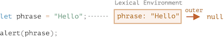

   这个词法环境与整个脚本相关联，也就是所谓的**全局词法环境**。

   上图中矩形表示环境记录（变量存储），箭头表示外部引用，**全局词法环境的没有外部引用**，所以箭头指向了 `null`。

   随着代码开始并继续运行，词法环境发生了变化。

   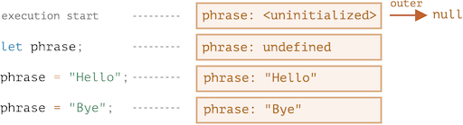

   右侧展示了执行过程中全局词法环境的变化：

   1. 当脚本开始运行，词法环境**预先填充了所有声明的变量**

      这些声明的变量处于 **“未初始化（Uninitialized）”** 状态，这是一种特殊的内部状态，这意味着**引擎知道变量，但是在用 `let` 声明前，不能引用它**

   2. 然后 `let phrase` 定义出现了，但它尚未被赋值，因此它的值为 `undefined`，**从这一刻起，就可以使用变量了**

   3. `phrase` 被赋予了一个值

   4. `phrase` 的值被修改

   **⚠️ 注意：**

   - **词法环境是一个规范对象**，只存在于[语言规范](https://tc39.es/ecma262/#sec-lexical-environments)的 “理论” 层面，用于描述事物是如何工作的，**无法在代码中获取该对象并直接对其进行操作**
   - 但 JavaScript 引擎同样可以优化它，比如清除未被使用的变量以节省内存和执行其他内部技巧等
   - 变量暂时无法使用的区域（从代码块的开始到 `let`）有时被称为 **“死区”**

     ```js
     function func() {
       // 引擎从函数开始就知道局部变量 x，
       // 但是变量 x 一直处于“未初始化”（无法使用）的状态，直到遇到 let，此时“死区”结束
       // 因此报错
       console.log(x); // ReferenceError: Cannot access 'x' before initialization
     
       let x = 2;
     }
     ```

   

2. **函数声明**

   一个函数就是一个值，就像变量一样，**不同之处在于函数声明的初始化会被立即完成**。

   当创建了一个词法环境时，**函数声明会立即变为即用型函数**（不像 `let` 那样到了声明处才可以使用），这也就是为什么可以在函数声明之前调用函数原因。

   例如添加一个函数时全局词法环境的初始状态：

   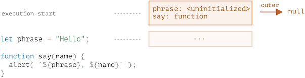

   **⚠️ 注意：这种行为仅适用于函数声明**，不适用于将函数分配给变量的函数表达式，例如 `let say = function(name)...`。


3. **内部和外部的词法环境**

   **在一个函数运行时，在调用刚开始时**，会自动创建一个新的词法环境以存储这个调用的局部变量和参数。

   例如，对于 `say('John')`，像下面这样（当前执行位置在箭头标记的那一行上）：

   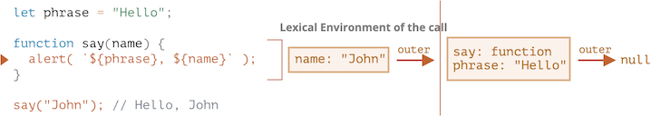

   在这个函数调用期间，有两个词法环境：**内部一个（用于函数调用）和外部一个（全局）**：

   - 内部词法环境与 `say` 的当前执行相对应，它具有一个单独的属性：`name`，函数的参数，因为调用的是 `say('John')`，所以 `name` 的值为 `'John'`
   - 外部词法环境是全局词法环境，它具有 `phrase` 变量和函数本身

   内部词法环境引用了外部的全局词法环境。

   **当代码要访问一个变量时 —— 首先会搜索内部词法环境，然后搜索外部环境，然后搜索更外部的环境，以此类推，直到全局词法环境**。

   如果在任何地方都找不到这个变量，那么**在严格模式下就会报错**（在非严格模式下，为了向下兼容，给未定义的变量赋值会创建一个全局变量）。

   对于上面这个示例，它变量搜索过程如下：

   - 对于 `name` 变量，当 `say` 中的 `alert` 试图访问 `name` 时，会立即在内部词法环境中找到它
   - 当它试图访问 `phrase` 时，因为内部没有 `phrase`，它顺着对外部词法环境的引用找到了它

   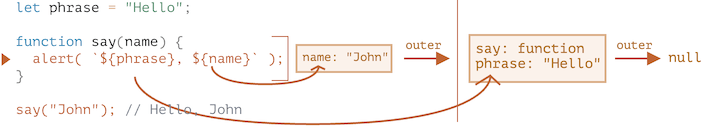

   

4. **返回函数**

   回到前面 `makeCounter` 的例子：

   ```js
   function makeCounter() {
     let count = 0;
   
     return function() {
       return count++;
     };
   }
   
   let counter = makeCounter();
   ```

   每次 `makeCounter()` 调用的开始，都会创建一个新的词法环境对象，以存储该 `makeCounter` 运行时的变量。

   因此，有两层嵌套的词法环境，就像上面的示例一样：

   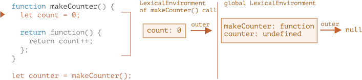

   不同的是，在执行 `makeCounter()` 的过程中创建了一个仅占一行的嵌套函数：`return count++`，但尚未运行它，只是创建了它。

   **JavaScript 中所有函数 “诞生” 时都会记住创建它们的词法环境**，所有函数都有名为 `[[Environment]]` 的隐藏属性，该属性保存了对创建该函数的词法环境的引用。

   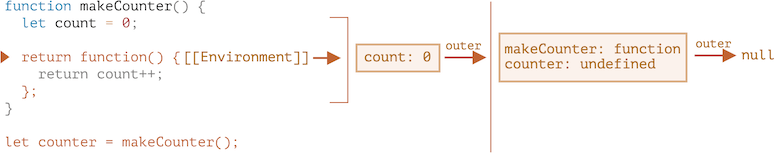

   所以 `counter.[[Environment]]` 有对 `{count: 0}` 词法环境的引用，这就是函数记住它创建于何处的方式，与函数被在哪儿调用无关，**`[[Environment]]` 引用在函数创建时被设置并永久保存**。
   
   当调用 `counter()` 时，会为该调用创建一个新的词法环境，并且**其外部词法环境引用获取于 `counter.[[Environment]]`**：
   
   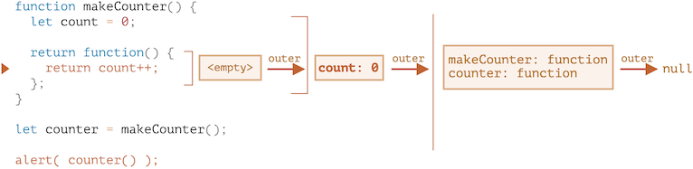
   
   所以当 `counter()` 中的代码查找 `count` 变量时，首先搜索自己的词法环境（为空，因为那里没有局部变量），然后是外部 `makeCounter()` 的词法环境，并且**在哪里找到就在哪里修改**。
   
   **在变量所在的词法环境中更新变量。**
   
   最后执行的状态为：
   
   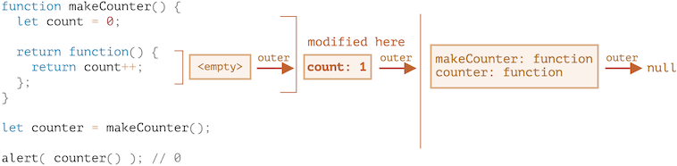
   
   如果调用 `counter()` 多次，`count` 变量将在同一位置增加到 `2`，`3` 等。


**闭包**

闭包是**指一个函数可以记住其外部变量并可以访问这些变量**，在 JavaScript 中，所有函数（**除了 `new Function` 方式创建的函数**）都是天生闭包的，因为 **JavaScript 中的函数会自动通过隐藏的 `[[Environment]]` 属性记住创建它们的位置**，所以它们都可以访问外部变量。


**垃圾回收**

通常函数调用完成后，会将其对应词法环境和其中的所有变量从内存中删除，因为没有任何对它们的引用，与 JavaScript 中的任何其他对象一样，**词法环境仅在可达时才会被保留在内存中**。

如果有**一个嵌套的函数在函数结束后仍然可达，则它将具有引用词法环境的 `[[Environment]]` 属性**。

例如：

```js
function f() {
  let value = 123;

  return function() {
    alert(value);
  }
}

let g = f(); // g.[[Environment]] 存储了对相应 f() 调用的词法环境的引用
```

**⚠️ 注意：** 如果多次调用 `f()`，并且返回的函数被保存，那么所有相应的词法环境对象也会保留在内存中，例如下面这样：

```js
function f() {
  let value = Math.random();

  return function() { alert(value); };
}

// 数组中的 3 个函数，每个都与来自对应的 f() 的词法环境相关联
let arr = [f(), f(), f()];
```


当词法环境对象变得不可达时，它就会死去，**至少有一个嵌套函数引用它时才存在**。

例如：嵌套函数被删除后，其封闭的词法环境（以及其中的 `value`）也会被从内存中删除。

```js
function f() {
  let value = 123;

  return function() {
    alert(value);
  }
}

let g = f(); // 当 g 函数存在时，该值会被保留在内存中

g = null; // 现在内存被清理了，因为嵌套函数没了，也就没了 [[Environment]] 属性引用封闭的词法环境（不可达）
```


**实际开发中的优化**

理论上当函数可达时，它外部的所有变量也都将存在。

但**在实际中，JavaScript 引擎会试图优化它**，会分析变量的使用情况，**如果从代码中可以明显看出有未使用的外部变量，那么就会将其删除**。

**在 V8（Chrome，Edge，Opera）中的一个重要的副作用是，此类变量在调试中将不可用。**

例如打开 Chrome 浏览器的开发者工具，并尝试运行下面的代码，当代码执行暂停时，在控制台中输入 `alert(value)`。

```js
function f() {
  let value = Math.random();

  function g() {
    debugger; // 在 Console 中：输入 alert(value); No such variable!
  }

  return g;
}

let g = f();
g();
```

上述代码理论上应该是可以访问的，但是**引擎把它优化掉了**。

**⚠️ 注意：** 这个不是调试器的 bug，而是 V8 的一个特别的特性。


## var

在 JavaScript 中声明变量有以下三种方式：

- `let`
- `const`
- `var`

**⚠️ 注意：** `var` 是早期 JavaScript 声明变量的一种方式，**现代脚本中一般不再使用它**。


**var 没有块级作用域**

用 `var` 声明的变量，**只有函数作用域和全局作用域，没有块级作用域**。

例如：

```js
if (true) {
  var test = true; // 使用 var 而不是 let
}

alert(test); // true
```

上述代码中 `var` 会**忽略**代码块，所有了一个全局变量 `test`，而 `let` 不会这样：

```js
if (true) {
  let test = true; // 使用 let
}

alert(test); // Uncaught ReferenceError: test is not defined
```


对于循环也是这样的，`var` 声明的变量**没有块级作用域也没有循环局部作用域**：

```js
for (var i = 0; i < 10; i++) {
  var one = 1;
  // ...
}

alert(i);   // 10，i 在循环结束后仍可见，它是一个全局变量
alert(one); // 1，one 在循环结束后仍可见，它是一个全局变量
```


如果一个代码块位于函数的内部，**`var` 声明的变量的作用域将为函数作用域**：

```js
function sayHi() {
  if (true) {
    var phrase = 'Hello';
  }

  alert(phrase); // Hello，能正常工作
}

sayHi();
alert(phrase); // Uncaught ReferenceError: phrase is not defined
```

 **`var` 可以穿透了 `if`，`for` 和其它代码块**，是因为早期 JavaScript 中没有词法环境。


**var 允许重新声明**

`let` 声明变量在同一个作用域下将同一个变量重复声明两次，则会出现错误：

```js
let user;
let user; // SyntaxError: Identifier 'user' has already been declared
```

但是使用 `var` 可以重复声明一个变量，如果对一个已经声明的变量使用 `var`，这条新的声明语句的 `var` 会被忽略。

```js
var user = 'Pete';
var user = 'John'; // 这个 var 无效（因为变量已经声明过了）

alert(user); // John
```


**var 声明的变量，可以在其声明语句前被使用**

在函数开始的时候，就会处理 `var` 声明（脚本启动对应全局变量），简单来说就是 **`var` 声明的变量会在函数开头被定义，与它在代码中定义的位置无关**。

例如：

```js
function sayHi() {
  phrase = 'Hello';

  alert(phrase); // Hello

  var phrase;
}
sayHi();
```

在技术上等价于下面的代码：

```js
function sayHi() {
  var phrase;
  
  phrase = 'Hello';

  alert(phrase); // Hello
}
sayHi();
```


在代码块中的也是一样：

```js
function sayHi() {
  phrase = 'Hello';

  if (false) {
    var phrase;
  }

  alert(phrase); // Hello
}
sayHi();
```

等价于

```js
function sayHi() {
  var phrase;
  
  phrase = 'Hello';

  if (false) {
  }

  alert(phrase); // Hello
}
sayHi();
```

`var` 的这种行为被称为 **“提升”**（英文为 “hoisting” 或 “raising”），所有的 `var` 都被提升到函数的顶部。

**⚠️ 注意：** 声明会被提升，但是赋值不会。

例如：

```js
function sayHi() {
  alert(phrase);  // undefined

  var phrase = 'Hello';
}

sayHi();
```

等价于

```js
function sayHi() {
  var phrase;
  
  alert(phrase); // undefined

  phrase = 'Hello';
}

sayHi();
```

上述代码中声明在函数刚开始执行的时候（“提升”）就被处理了，所以 `phrase` 变量存在不会报错，但是它还没赋值，所以显示 ` undefined`。


**IIFE**

**因为过去 `var` 声明的变量没有块级作用域**，所以程序员们就发明了一种**模仿块级作用域的方法**，这种方法被称为 **“立即调用函数表达式”**（immediately-invoked function expressions，简称 **IIFE**）。

看起来像这样：

```js
(function() {
  var message = 'Hello';
  alert(message); // Hello
})();
```

上述代码创建了一个函数表达式并立即调用，所以代码立即执行并拥有了自己的私有变量。


这里函数表达式被括号 `(function {...})` 包裹起来，是因为当 JavaScript 引擎在主代码中遇到 `function` 时，会把它当成一个函数声明的开始，但是函数必须要有函数名，所以就会导致错误：

```js
// 尝试声明并立即调用一个函数
function() { // SyntaxError: Function statements require a function name
  var message = 'Hello';
alert(message);
}();
```

即使给它加上了函数名，它仍然不工作：

```js
function go() { // SyntaxError: Unexpected token ')'
  var message = 'Hello';
  alert(message);
}(); // 不能立即调用函数声明
```

所以需要使用圆括号把该函数表达式包起来，来告诉 JavaScript，这个函数是在另一个表达式的上下文中创建的，因此它是一个函数表达式，它不需要函数名，可以立即调用。

除了使用括号，还可以使用其它方式来告诉 JavaScript，这里用的是函数表达式：

```js
// 创建 IIFE 的方法

(function() {
  alert('Parentheses around the function');
})();

(function() {
  alert('Parentheses around the function');
}());

!function() {
  alert('Parentheses around the function');
}();

+function() {
  alert('Parentheses around the function');
}();
```

上面的所有情况中，都声明了一个函数表达式并立即运行它。

**⚠️ 注意：** 如今没有理由编写这样的代码。


## 全局对象

全局对象提供可以在任何地方使用的变量和函数，**默认情况下，这些全局变量内建于语言或环境中**。

在浏览器中，全局对象是 `window`，在 Node.js 中，全局对象是 `global`，其它环境可能用的是别的名字。

`globalThis` 最近作为**全局对象的标准名称**加入到了 JavaScript 中，**所有环境都应该支持该名称**，所有主流浏览器都支持它。

如果脚本只在浏览器中运行，只要使用 `window` 即可，如果可能会在其它环境中运行，最好使用 `globalThis`。

全局对象的所有属性都可以被直接访问：

```js
alert('Hello');
// 等同于
window.alert('Hello');
```

**在浏览器中，使用 `var`（而不是 `let/const`）声明的全局函数和变量会成为全局对象的属性**。

```js
var gVar = 5;
alert(window.gVar); // 5（成为了全局对象的属性）
```

**函数声明（特指在主代码流中具有 `function` 关键字的语句，而不是函数表达式）也有这样的效果**。

**⚠️ 注意：** 不要依赖这种行为，这种行为是出于兼容性而存在的，现代脚本使用 JavaScript modules 则会发生这种事情。

如果使用 `let` 就不会发生这种情况：

```js
let gLet = 5;

alert(window.gLet); // undefined（不会成为全局对象的属性）
```

如果一个值非常重要，想在全局范围内可用，可以直接将其作为属性写入：

```js
// 将当前用户信息全局化，以允许所有脚本访问它
window.currentUser = {
  name: 'CodePencil'
};

// 代码中的另一个位置
alert(currentUser.name); // CodePencil

// 如果也有一个名为 currentUser 的局部变量，最好从 window 显式地获取它
alert(window.currentUser.name); // CodePencil
```

**⚠️ 注意：**

- **一般不建议使用全局变量，全局变量应尽可能的少**，与使用外部变量或全局变量相比，函数获取 “输入” 变量并产生特定 “输出” 的代码设计更加清晰，不易出错且更易于测试
- 推荐使用直接的方式访问全局对象的属性，如 `window.x`。


**使用 polyfills**

可以使用全局对象来测试对现代语言功能的支持。

例如，测试是否存在内建的 `Promise` 对象（在版本特别旧的浏览器中不存在）：

```js
if (!window.Promise) {
  alert('您的浏览器非常旧！');
}
```

如果没有，可以创建 polyfills：**添加环境不支持但在现代标准中存在的功能**。

```js
if (!window.Promise) {
  window.Promise = ... // 定制实现现代语言功能
}
```


## 函数对象，NFE

在 JavaScript 中，函数的类型是对象，可以把函数想象为可被调用的 **“行为对象（action object）”**，不仅可以调用它们，还能把它们当作对象来处理：增/删属性，按引用传递等。


**属性 name**

函数对象包含一些常用的属性。

例如函数的名字可以通过属性 `name` 来访问：

```js
function sayHi() {
  alert('Hi');
}

alert(sayHi.name); // sayHi
```

函数的名称赋值逻辑很智能，**即使函数被创建时没有名字，名称赋值的逻辑也能给它赋予一个正确的名字**，然后进行赋值：

```js
const sayHi = function () {
  alert('Hi');
};

alert(sayHi.name); // sayHi
```

当以默认值方式完成赋值时也有效：

```js
function f(sayHi = function() {}) {
  alert(sayHi.name); // sayHi
}

f();
```

在规范中把这种特性叫做**上下文命名**，如果函数自己没有提供，那么在赋值中，会根据上下文来推测一个。

在对象的中的方法也有名字：

```js
const user = {
  sayHi() {
    // ...
  },
  
  sayBye: function() {
    // ...
  },
};

alert(user.sayHi.name); // sayHi
alert(user.sayBye.name); // sayBye
```

**⚠️ 注意：也存在无法推测名字的情况**，属性 `name` 是空的，例如：

```js
// 函数是在数组中创建的
let arr = [function() {}];

alert(arr[0].name); // <空字符串>
```

不过大多数函数都是有名字的。


**属性 length**

函数还有另一个内建属性 `length`，它返回函数参数（**这里的参数特指函数声明时的参数（形参 parameter）**）的个数。

```js
function f1(a) {}
function f2(a, b) {}
function many(a, b, ...more) {}

alert(f1.length); // 1
alert(f2.length); // 2
alert(many.length); // 2
```

**⚠️ 注意：Rest 参数不参与计数**。

通常在开发中属性 `length` 在操作其它函数中用作**内省/运行时检查**，例如：

当用户提供了自己的答案后，函数会调用那些 `handlers`，可以传入两种 `handlers`：

- 一种是无参函数，它仅在用户给出肯定回答时被调用
- 一种是有参函数，它在两种情况都会被调用，并且返回一个答案

```js
function ask(question, ...handlers) {
  let isYes = confirm(question);

  for(let handler of handlers) {
    if (handler.length == 0) {
      if (isYes) handler();
    } else {
      handler(isYes);
    }
  }

}

// 对于肯定的回答，两个 handler 都会被调用
// 对于否定的回答，只有第二个 handler 被调用
ask('Question?', () => alert('You said yes'), result => alert(result));
```

上述代码就是**多态性**的例子，根据参数的类型，或者在具体情景下的 `length` 来做不同的处理。


**自定义属性**

函数也是对象，所以可以添加自定义的属性，例如：

```js
function sayHi() {
  alert('Hi');

  // 计算调用次数
  sayHi.counter++;
}

sayHi.counter = 0; // 初始值

sayHi(); // Hi
sayHi(); // Hi

alert(`调用了 ${sayHi.counter} 次`); // 调用了 2 次
```

**⚠️ 注意：`sayHi.counter = 0` 不会在函数内部定义一个局部变量 `counter`**，只是作为函数对象的属性，属性 `counter` 和变量 `let counter` 是毫不相关的两个东西。


函数属性有时会用来替代闭包，例如下面用闭包实现计数器的例子：

```js
function makeCounter() {
  let count = 0;
  
  return function() {
    return count++;
  }
}

let counter = makeCounter();
alert( counter() ); // 0
alert( counter() ); // 1
```

可以用函数属性实现相同的功能：

```js
function makeCounter() {
  
  function counter() {
    return counter.count++;
  }
  
  counter.count = 0;
  
  return counter;
}

let counter = makeCounter();
alert( counter() ); // 0
alert( counter() ); // 1
```

上述代码中 **`count` 被直接存储在函数里，而不是它外部的词法环境**。

**⚠️ 注意：** 两种写法最大的区别是：闭包写法的 `count` 的值位于外层（函数）变量中，外部的代码无法访问到它，只有嵌套的函数可以修改它，而函数属性方式的 `count` 值可以被外部代码修改，像下面这样：

```js
function makeCounter() {
  
  function counter() {
    return counter.count++;
  }
  
  counter.count = 0;
  
  return counter;
}

let counter = makeCounter();

counter.count = 10; // 外部代码可以直接修改函数的 count 属性
alert( counter() ); // 10
```


**命名函数表达式**

命名函数表达式（NFE，Named Function Expression），**指带有名字的函数表达式的术语**。

例如：

```js
let sayHi = function(who) {
  alert(`Hello, ${who}`);
};
```

可以给这个函数表达式添加一个名字：

```js
let sayHi = function func(who) {
  alert(`Hello, ${who}`);
};
```

**⚠️ 注意：** 

- 上述代码**仍然是一个函数表达式**，在 `function` 后面加一个名字 `func` **没有使它成为一个函数声明**

- 上述代码添加的 `func` 有两个特殊的地方：

  1. **它允许函数在内部引用自己**
  2. **它在函数外是不可见的**

  例如：

  ```js
  let sayHi = function func(who) {
    if (who) {
      alert(`Hello, ${who}`);
    } else {
      func('Guest'); // 使用 func 再次调用函数自身
    }
  };
  
  sayHi(); // Hello, Guest
  
  // 但这不工作：
  func(); // ReferenceError: func is not defined
  ```

  虽然大多数情况也可以这样做：

  ```js
  let sayHi = function(who) {
    if (who) {
      alert(`Hello, ${who}`);
    } else {
      sayHi('Guest');
    }
  };
  ```

  但是这段代码存在一个问题：**`sayHi` 的值可能会被函数外部的代码改变（原变量被修改），导致内部调用报错：**

  ```js
  let sayHi = function(who) {
    if (who) {
      alert(`Hello, ${who}`);
    } else {
      sayHi('Guest'); // Uncaught TypeError: sayHi is not a function
    }
  };
  
  // 原变量 sayHi 被函数外部代码修改
  let welcome = sayHi; 
  sayHi = null;
  
  welcome();
  ```

  所以**给函数表达式添加名字就是为了解决这类问题的**，修复后代码如下：

  ```js
  let sayHi = function func(who) {
    if (who) {
      alert(`Hello, ${who}`);
    } else {
      func('Guest'); // 现在一切正常
    }
  };
  
  let welcome = sayHi;
  sayHi = null;
  
  welcome(); // Hello, Guest
  ```

  `func` 是一个 “内部函数名”，**是函数可以可靠地调用自身的方式**。

  **⚠️ 注意：** 函数声明方式创建的函数没有添加内部名称的语法。


## new Function 语法

该语法是创建函数的一种方式，**通常很少被使用，但有时候只能选择它**。

创建函数的语法：

```js
let func = new Function([arg1, arg2, ...argN], functionBody);
```

该函数是通过使用参数 `arg1...argN` 和给定的 `functionBody` 创建的。

例如：

```js
let sum = new Function('a', 'b', 'return a + b');
alert( sum(1, 2) ); // 3
```

也没有参数，只有函数体：

```js
let sayHi = new Function('alert("Hello")');

sayHi(); // Hello
```

该方法与其它创建函数的方法相比，最大的不同是：**运行时通过参数传递过来的字符串来创建函数，而非程序员提前写好的函数代码**，也就是说 `new Function` 允许将任意字符串变为函数，例如可以从服务器接收一个新的函数并执行它：

```js
let str = ... 动态地接收来自服务器的代码 ...

let func = new Function(str);
func();
```

**⚠️ 注意：** `new Function` 创建函数的使用场景非常特殊，**只有在从服务器获取代码或者动态地从模板编译函数时才会使用**。


**闭包**

通常 JavaScript 中的闭包是指使用一个特殊的属性 `[[Environment]]` 来记录函数自身的创建时的环境的函数，具体指向了函数创建时的词法环境。

如果使用 `new Function` 创建一个函数，该函数的 `[[Environment]]` 并**不指向函数创建时的词法环境**，而是指向**全局环境**。

所以此类函数**无法访问外部（outer）变量，只能访问全局变量**。

```js
function getFunc() {
  let value = 'test';

  let func = new Function('alert(value)');

  return func;
}

getFunc()(); // Uncaught ReferenceError: value is not defined
```

与常规函数的比较：

```js
function getFunc() {
  let value = 'test';

  let func = function() { alert(value); };

  return func;
}

getFunc()(); // test，从 getFunc 的词法环境中获取的
```

`new Function` 之所以这样设计，是因为在编写代码时，`new Function` 中的实际代码是不知道的，可能会从服务器或者其它来源获取，如果这个函数能访问外部（outer）变量，可能会发生以下问题：

通常在将 JavaScript 发布到生产环境的时候，需要先使用**压缩程序（minifier）**对其进行压缩，会删除多余的注释和空格等压缩代码，**其中会将局部变量命名为较短的变量**。

例如，如果一个函数有 `let userName`，压缩程序会把它替换为 `let a`（如果 a 已被占用了，那就使用其他字符），剩余的局部变量也会被进行类似的替换。

一般来说这样的替换是安全的，毕竟这些变量是函数内的局部变量，函数外的任何东西都无法访问它，在函数内部，**压缩程序会替换所有使用了这些变量的代码**，压缩程序很聪明，它会分析代码的结构，而不是呆板地查找然后替换，因此它不会 “破坏” 你的程序。

在这种情况下，如果使 `new Function` 可以访问自身函数以外的变量，它很有可能无法找到重命名（压缩替换后）的 `userName`，因为新函数的创建发生在代码压缩以后，变量名已经被替换了。

**所以即使可以在 `new Function` 中访问外部词法环境，也会受挫于压缩程序。**

**⚠️ 注意：** 在需要向 `new Function` 创建出的新函数传递数据时，**必须显式地通过参数进行传递**，例如：

- 不好的做法

  ```js
  const globalVar = 10; // globalVar 可能会被压缩程序替换被别的名称
  const func = new Function('globalVar', 'return globalVar');
  
  console.log( func() ); // 不安全
  ```

- 好的做法

  ```js
  const globalVar = 10; // globalVar 可能会被压缩程序替换被别的名称，但是最后一行调用中的参数名也会同步被替换
  const func = new Function('globalVar', 'return globalVar');
  
  console.log( func(globalVar) ); // 安全
  ```


**其它创建方式**

由于历史原因，参数也可以按逗号分隔符的形式给出，例如下面三种声明的含义相同：

```js
new Function('a', 'b', 'return a + b'); // 基础语法
new Function('a,b', 'return a + b'); // 逗号分隔
new Function('a , b', 'return a + b'); // 逗号和空格分隔
```


## setTimeout 和 setInterval

有时候不想立即执行函数，而是等待特定一段时间之后再执行，这就是所谓的 **“计划调用（scheduling a call）”**。

有以下两种方式可以实现：

- `setTimeout` 允许将函数**推迟到一段时间间隔之后再执行**
- `setInterval` 允许将函数**每隔一段时间间隔连续重复执行**

**⚠️ 注意：** 上述两个方法**不在 JavaScript 的规范中**，但大多数运行环境都有内建的调度程序，并且提供了这些方法，**所有浏览器以及 Node.js 都支持这两个方法**。


**setTimeout**

语法：

```js
let timerId = setTimeout(func|code, [delay], [arg1], [arg2], ...);
```

- **`func|code`：** 要执行的函数或代码字符串， 一般传入的都是函数

  **⚠️ 注意：** 由于历史原因，**支持传入代码字符串，但不推荐使用**。

- **`delay`：** 执行前的延时，以毫秒为单位（1000 毫秒 = 1 秒），**默认值是 0**

- **`arg1, arg2...`：** 要传入被执行函数（或代码字符串）的参数列表（**IE9 以下不支持**）

例如：

```js
function sayHi() {
  alert('Hello');
}

setTimeout(sayHi, 1000); // 会在 1 秒后执行
```

带参数的情况：

```js
function sayHi(phrase, who) {
  alert( phrase + ', ' + who );
}

setTimeout(sayHi, 1000, 'Hello', 'John'); // Hello, John
```

**如果第一个参数传入的是字符串，JavaScript 会自动为其创建一个函数**。

```js
setTimeout('alert("Hello")', 1000); // 1 秒后显示 Hello
```

但不推荐使用字符串，上述代码可以使用箭头函数替代：

```js
setTimeout(() => alert('Hello'), 1000); // 1 秒后显示 Hello
```

**⚠️ 注意：** 第一个参数传入一个函数，但不要执行它，例如下面的写法是错误的：

```js
function sayHi() {
  alert('Hello');
}

// 错误
setTimeout(sayHi(), 1000); // 会立即显示 Hello，而不是等待 1 秒后显示
```

**`setTimeout` 期望得到的是一个对函数的引用**，上述代码中的 `sayHi()` 是在执行函数，实际上传入的是 `setTimeout` 的是**函数的执行结果**，在上述代码中也就是 `undefined`，实际上没有任何调度。


**用 clearTimeout 来取消调度**

`setTimeout` 在调用时会返回一个 **“定时器标识符（timer identifier）”**，可以通过使用它来取消执行。

取消调度语法：

```js
let timerId = setTimeout(...);
clearTimeout(timerId);
```

例如：

```js
let timerId = setTimeout(() => alert('永远不会执行'), 1000);
alert(timerId); // 定时器标识符

clearTimeout(timerId);
alert(timerId); // 还是这个标识符（并没有因为调度被取消了而变成 null）
```

**⚠️ 注意：** 定时器标识符在浏览器中是一个数字，但在其它环境中，可能是其它的东西，例如 Node.js 返回的是一个定时器对象，这个对象包含一系列方法，这些方法没有统一的规范定义，所以这没什么问题，针对浏览器环境，定时器在 HTML5 的标准中有详细描述，可以参考[timers section](https://www.w3.org/TR/html5/webappapis.html#timers)。


**setInterval**

`setInterval` 和 `setTimeout` 的语法相同：

```js
let timerId = setInterval(func|code, [delay], [arg1], [arg2], ...);
```

虽然参数的意义相同，但是 **`setInterval` 不像 `setTimeout` 只能执行一次，而是根据给定的间隔时间周期性执行**。

如果要组织后续的调用，可以使用 **`clearInterval(timerId)`**，例如：

```js
// 每 2 秒重复一次
let timerId = setInterval(() => alert('tick'), 2000);

// 5 秒之后停止
setTimeout(() => { clearInterval(timerId); alert('stop'); }, 5000);
```

**⚠️ 注意：** **alert 弹窗显示的时候计时器依然在进行计时**，在大多数浏览器中，包括 Chrome 和 Firefox，在显示 `alert/confirm/prompt` 弹窗时，内部的定时器仍旧会继续执行，所以在运行上面的代码时，**如果一定时间内没有关掉 `alert` 弹窗，那么在关闭弹窗后，下一个 `alert` 会立即显示，两次 `alert` 之间的时间间隔将小于 2 秒**。


**嵌套的 setTimeout**

周期性调度有两种方式。

一种是使用 `setInterval`，另外一种就是嵌套的 `setTimeout`，例如：

```js
/** instead of:
let timerId = setInterval(() => alert('tick'), 2000);
*/

let timerId = setTimeout(function tick() {
  alert('tick');
  timerId = setTimeout(tick, 2000);
}, 2000);
```

上述代码中，`setTimeout` 在当前这一次函数执行完时立即调度下一次调用。

**嵌套的 `setTimeout` 要比 `setInterval` 更加灵活**，这种方式可以根据当前执行结果来调度下一次调用，使下一次调用可以与当前这一次不同。

例如：实现一个服务（server），每间隔 5 秒向服务器发送一个数据请求，但如果服务器过载了，那么就要降低请求频率，比如将间隔增加到 10、20、40 秒等。

```js
let delay = 5000;

setTimeout(function request() {
  // ...发送请求...
  
  if(request failed due to server overload) { // 由于服务器过载，请求失败
    // 下一次执行的间隔是当前的 2 倍
    delay *= 2;
  }
  
  setTimeout(request, delay);
}, delay);
```

如果调度的函数占用大量 CPU，**可以测量执行所需要花费的时间，并安排下次调用是应该提前还是推迟**。


**嵌套的 `setTimeout` 相较于 `setInterval` 能够更精确地设置两次执行之间的延时**

对比以下两个代码：

- 使用 `setInterval`

  ```js
  let i = 1;
  
  setInterval(function() {
    func(i++);
  }, 100);
  ```

- 使用嵌套的 `setTimeout`：

  ```js
  let i = 1;
  
  setTimeout(function run() {
    func(i++);
    setTimeout(run, 100);
  }, 100);
  ```

对于 `setInterval` 来说，内部的调度程序会每间隔 100 毫秒执行一次 `func(i++)`：

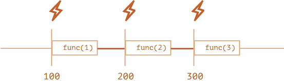

从上图中可以看出，**使用 `setInterval` 时，`func` 函数的实际调用间隔要比代码中设定的时间间隔要短**，因为 `func` 的执行所花费的时间 “消耗” 了一部分间隔时间。

如果 `func` 的执行所花费的时间比我们预期的时间更长，并且超出了 100 毫秒，这种情况下，JavaScript 引擎会等待 `func` 执行完成，然后检查调度程序，如果时间到了，则**立即再次执行它**。

所以在极端情况下，如果函数每次执行时间都超过 `delay` 设置的时间，那么**每次调用之间将完全没有停顿**。


而对于嵌套的 `setTimeout` **就能确保延时的固定**，以下是嵌套的 `setTimeout` 的示意图：

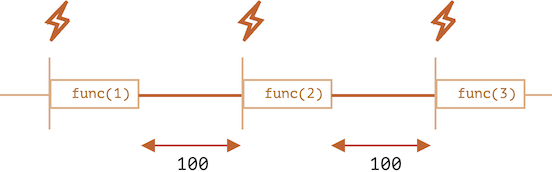

因为**下一次调用是在前一次调用完成时再调度的**。


**垃圾回收和 setInterval/setTimeout 回调（callback）**

当一个函数传入 `setInterval/setTimeout` 时，将**为其创建一个内部引用，并保存在调度程序中**，这样即使这个函数没有其他引用，也能**防止垃圾回收器（GC）将其回收**。

```js
// 在调度程序调用这个函数之前，这个函数将一直存在于内存中
setTimeout(function() {...}, 100);
```

对于 `setInterval`，传入的函数也是一直存在于内存中，**直到 `clearInterval` 被调用**。

**⚠️ 注意：** 函数引用了外部变量（闭包），那么只要这个函数还存在，外部变量也会随之存在，它们可能比函数本身占用更多的内存，因此，当不再需要调度函数时，最好取消它，即使这是个（占用内存）很小的函数。


**零延时的 setTimeout**

有一种特殊的用法：`setTimeout(func, 0)` 或者是 `setTimeout(func)`。

这样调度可以让 `func` 尽快执行，但只有在当前正在执行的脚本执行完成后，调度程序才会调用它，也就是**该函数被调度在当前脚本执行完成“之后” 立即执行**。

```js
setTimeout(() => alert('World'));

alert('Hello');
```

上述代码会显示 `Hello`，然后才是 `World`，之所以会这样，是因为第一行代码 “将调用安排到日程（calendar）0 毫秒处”，但是调度程序只有在当前脚本执行完毕时才会去 “检查日程”，所以先输出 `Hello`，然后才输出 `World`。

**⚠️ 注意：** 零延时实际上不为零，**在浏览器环境下，嵌套定时器的运行频率是受限制的**，根据 [HTML5 标准](https://html.spec.whatwg.org/multipage/timers-and-user-prompts.html#timers) 所讲：**“经过 5 重嵌套定时器之后，时间间隔被强制设定为至少 4 毫秒”**，可以通过 `timers` 数组记录上一次调用的实际时间：

```js
let start = Date.now();
let times = [];

setTimeout(function run() {
  times.push(Date.now() - start); // 保存前一个调用的延时
  
  if(start + 100 < Date.now()) { // 100 毫秒之后，显示延时信息
    alert(times);
  } else {
    setTimeout(run); // 否则重新调度
  }
});
// 输出示例
// 0,0,0,0,0,0,5,10,14,19,23,28,32,37,41,46,50,55,60,64,69,73,78,83,87,92,96,101
```

上述代码中 `timer` 数组里存放的是每次定时器运行的时刻与 `start` 的差值，所以数字只会越来越大，实际上前后调用的延时是数组值的差值。示例中前几次都是 `0`，所以 `0 - 0 = 0` 延时为 `0`。

可以看到前面几次定时器是立即执行的，之后可以看到 `0, 5,10,14,19...`，两次调用之间**必须经过 4 毫秒以上的强制延时**。

**使用 `setInterval` 也会发生类似的情况**，`setInterval(f)` 会以零延时运行几次 `f`，然后以 4 毫秒以上的强制延时运行。

这个限制来源于过去，许多脚本都依赖于此，所以这个机制也就存在至今。

但对于服务端的 JavaScript，就没有这个限制，并且还有其它调度即时异步任务的方式，例如 Node.js 的 `setImmediate`，所以**这个限制只针对浏览器**。


**所有的调度方法都不能保证确切的延时**

例如，浏览器内的计时器可能由于许多原因而变慢：

- CPU 过载
- 浏览器页签处于后台模式
- 笔记本电脑用的是省电模式

这些因素，可能会将定时器的最小计时器分辨率（最小延迟）增加到 300ms 甚至 1000ms，具体以浏览器及其设置为准。


## 装饰器和转发，call/apply

JavaScript 在处理函数时提供了非法的灵活性，它们可以被传递，用作对象，也可以**转发（forward）**调用或者**装饰（decorate）**它们。


**透明缓存**

例如有一个 CPU 重负载的函数 `slow(x)`，但它的结果是稳定的，对于相同的 `x`，它总是返回相同的结果。

这时可能希望将结果缓存（记住）下来，以避免在重新计算上花费额外的时间，可以**创建一个包装器（wrapper）函数来为 `slow(x)` 函数增加缓存功能，而不是直接将这个功能添加到 `slow(x)` 中**。

```js
function slow(x) {
  // 这里可能会有重负载的 CPU 密集型工作
  alert(`Called with ${x}`);
  return x;
}

function cachingDecorator(func) {
  const cache = new Map();
  
  return function(x) {
    if(cache.has(x)) {
      return cache.get(x);
    }
    
    const result = func(x);
    cache.set(x, result);
    
    return result;
  }
}

slow = cachingDecorator(slow);

alert( slow(1) ); // slow(1) 被缓存下来了，并返回结果
alert( 'Again: ' + slow(1) ); // 返回缓存中的 slow(1) 的结果

alert( slow(2) ); // slow(2) 被缓存下来了，并返回结果
alert( 'Again: ' + slow(2) ); // 返回缓存中的 slow(2) 的结果
```

上述代码中 `cachingDecorator` 是一个**装饰器（decorator）**：一个特殊的函数，它接受另一个函数并改变它的行为。

可以为任何函数调用 `cachingDecorator`，它将返回缓存包装器，将缓存代码和函数主代码分开，可以使主函数代码变得更简单。

简单来说使用装饰器有以下几点好处：

- `cachingDecorator` 是可复用的，可以将它应用于其它函数
- 缓存逻辑是独立的，它没有增加 `slow` 本身的复杂性
- 可以组合多个装饰器（其它装饰器将遵循同样的逻辑）


**使用 func.call 设定上下文**

前面的装饰器代码不适用于对象方法，例如：

```js
// 将对 worker.slow 的结果进行缓存
let worker = {
  someMethod() {
    return 1;
  },

  slow(x) {
    // 可怕的 CPU 过载任务
    alert('Called with ' + x);
    return x * this.someMethod();
  }
};

function cachingDecorator(func) {
  const cache = new Map();
  
  return function(x) {
    if (cache.has(x)) {
      return cache.get(x);
    }
    
    const result = func(x);
    cache.set(x, result);
    
    return result;
  }
}

alert( worker.slow(1) ); // 原始方法有效

worker.slow = cachingDecorator(worker.slow); // 现在对其使用装饰器

alert( worker.slow(2) ); // Uncaught TypeError: this.someMethod is not a function
```

上述代码再尝试访问 `this.someMethod` 的时候失败了，因为**在调用 `func(x)` 的时候，这样调用函数将得到 `this = undefined`**，跟像下面这样调用相同：

```js
let func = worker.slow;
func(2);
```

本质原因是：**包装器将调用传递给原始方法，但没有上下文 `this`，所以发生了错误**。

要解决这个问题，可以使用一个特殊的内建函数方法 **`func.call(context, …args)`**，它**可以调用函数并显式设置 `this`**。

语法：

```js
func.call(context, arg1, arg2, ...);
```

它运行 `func`，将第一个参数作为 `this`，后面的作为参数（arguments）。

例如下面两个调用几乎相同：

```js
func(1, 2, 3);
func.call(obj, 1, 2, 3)
```

唯一的区别是 `func.call` 还会将 `this` 设置为 `obj`。

例如可以在不同对象的上下文中调用 `sayHi`：

```js
function sayHi() {
  alert(this.name);
}

let user = { name: 'John' };
let admin = { name: 'Admin' };

// 使用 call 将不同的对象传递为 this
sayHi.call(user); // John
sayHi.call(admin); // Admin
```

所以前面的问题只需要像下面这样修改就可以了：

```js
let worker = {
  someMethod() {
    return 1;
  },

  slow(x) {
    alert('Called with ' + x);
    return x * this.someMethod();
  }
};

function cachingDecorator(func) {
  const cache = new Map();
  
  return function(x) {
    if (cache.has(x)) {
      return cache.get(x);
    }
    
    const result = func.call(this, x); // 现在 this 被正确传递了
    cache.set(x, result);
    
    return result;
  }
}

worker.slow = cachingDecorator(worker.slow); // 现在对其使用装饰器

alert( worker.slow(2) ); // 工作正常
alert( worker.slow(2) ); // 工作正常，没有调用原始函数（使用的缓存）
```


**传递多个参数**

前面的写法只适用于单参数函数，如果要传入多个参数，可以使用如下方式：

```js
let worker = {
  slow(min, max) {
    alert(`Called with ${min},${max}`);
    return min + max;
  }
};

function cachingDecorator(func, hash) {
  let cache = new Map();
  return function() {
    let key = hash(arguments); // 通过多个参数生成 key
    if (cache.has(key)) {
      return cache.get(key);
    }

    let result = func.call(this, ...arguments); // 通过 Spread 将可迭代对象 arguments 拆分为多个参数

    cache.set(key, result);
    return result;
  };
}

function hash(args) {
  return args[0] + ',' + args[1];
}

worker.slow = cachingDecorator(worker.slow, hash);

alert( worker.slow(3, 5) ); // 8
alert( 'Again ' + worker.slow(3, 5) ); // 8 (从缓存中获取)
```

除了上面的方法，也可以**使用 `func.apply(this, arguments)` 代替 `func.call(this, ...arguments)`**。

内建方法 `func.apply` 的语法是：

```js
func.apply(context, args);
```

它运行 `func` 设置 `this=context`，并使用**类数组对象 `args` 作为参数列表**。

`call` 和 `apply` 之间唯一的语法区别：**`call` 期望一个参数列表，而 `apply` 期望一个包含这些参数的类数组对象**。

所以以下两个调用是相同的：

```js
func.call(context, ...args);
func.apply(context, args);
```

两者细微的差别：

- Spread 语法 `...` 允许将**可迭代对象** `args` 作为列表传递给 `call`
- `apply` 只接受**类数组** `args`

**⚠️ 注意：** 对于即可迭代又是类数组的对象（例如：数组），`call` 或 `apply` 都可以，**但是 `apply` 可能会更快些，因为大多数 JavaScript 引擎在内部对其进行了优化**。


**呼叫转移（调用转发）**

将所有参数连同上下文一起传递给另一个函数被称为 “呼叫转移（call forwarding）”。

它的最简形式：

```js
let wrapper = function() {
  return func.apply(this, arguments);
};
```

当在外部代码中调用包装器 `wrapper` 时，它与原始函数 `func` 的调用是无法区分的（几乎一样）。

**⚠️ 注意：** 呼叫转移通常是使用 `apply` 完成的。


**借用方法**

前面代码中哈希函数目前只适用于两个参数，例如：

```js
function hash(args) {
  return args[0] + ',' + args[1];
}
```

如果想让它适用于任何数量的 `args`，使用 `arr.join` 方法是不行的：

```js
function hash(args) {
  return args.join(','); // TypeError: arguments.join is not a function
}
```

因为前面中代码中，调用 `hash(arguments)`，`arguments` 对象虽然既是可迭代对象也是类数组对象，但**它不是真正的数组，没有数组方法 `join`**。

这时可以使用一种简单的方法使用数组的 `join` 方法：

```js
function hash() {
  alert( [].join.call(arguments) ); // 1,2
}

hash(1, 2);
```

上述代码中所使用的技巧被称为**方法借用（method borrowing）**，从常规数组 `[].join` 借用方法 `join`，并使用 `[].join.call` 在 `arguments` 的上下文中运行它。

为什么它有效，原生方法 `arr.join(glue)` 的内部算法非常简单，具体内部算法如下：

1. 让 `glue` 成为第一个参数，如果没有参数，则使用逗号 `','`
2. 让 `result` 为空字符串
3. 将 `this[0]` 添加到 `result` 中
4. 添加 `glue` 和 `this[1]` 到 `result` 中
5. 添加 `glue` 和 `this[2]` 到 `result` 中
6. ...以此类推，直到 `this.length` 项目被粘在一起
7. 返回 `result`

从技术上讲，**这种编写方式允许是故意允许任何类数组的 `this`**，这不是巧合，很多方法都遵循这种做法。


**装饰器和函数属性**

通常来说使用装饰器替换一个函数或者一个方法是安全的，**如果原始函数有属性，则装饰后的函数将不再提供这些属性**，所以使用时需要小心。

一些装饰器会提供自己的属性，例如装饰器会计算一个函数被调用了多少次以及花费了多少时间，并通过包装器属性公开（expose）这些信息。

**也存在一种创建装饰器的方法，可以保留函数属性的访问权限，但需要使用特殊的 `Proxy` 对象来包装函数**。


**防抖装饰器**

防抖（Debounce）是**在 ms 毫秒（如 300ms）后没有再触发动作后才真正执行一次函数**。

- **延迟执行**

  ```js
  function debounce(f, ms) {
    let timer = null;
  
    return function () {
      clearTimeout(timer);
      timer = setTimeout(() => f.apply(this, arguments), ms);
    };
  }
  ```

  每次触发都会清除 timer，只有最后一次生效。

  **使用场景：** 输入框搜索，用户停止输入才触发。

  

- **立即执行**

  ```js
  function debounce(f, ms) {
    let isCooldown = false; // 判断是否处于冷却时间
  
    return function () {
      if (isCooldown) return;
  
      isCooldown = true;
      f.apply(this, arguments);
  
      setTimeout(() => {
        isCooldown = false;
      }, ms);
    };
  }
  ```

  第一次触发立即执行，之后冷却时间内触发无无效。

  **使用场景：** 防止按钮连点，提交重复请求。


**节流装饰器**

节流（Throttle）是**指每 ms 毫秒（如 300ms）执行执行一次**。

```js
function throttle(f, ms) {
  let savedThis = null;
  let savedArgs = null;
  let isThrottle = false;

  function wrapper() {
    if (isThrottle) {
      savedThis = this;
      savedArgs = arguments;
      return;
    }

    isThrottle = true;
    f.apply(this, arguments);

    setTimeout(() => {
      isThrottle = false;

      if (savedArgs) {
        wrapper.apply(savedThis, savedArgs);
        savedThis = savedArgs = null;
      }
    }, ms);
  }

  return wrapper;
}
```

上述代码**每隔给定间隔时间最多调用一次，并且最后一次调用不能忽略**。

**使用场景：** 页面滚动（scroll）事件、窗口大小调整（resize）、拖拽（drag）事件、鼠标移动事件。


## 函数绑定

当对象的方法作为回调进行传递时，经常会出现丢失 `this` 的问题。


**丢失 this**

例如使用 `setTimeout` 时会出现 `this` 丢失的情况：

```js
let user = {
  firstName: 'CodePencil',
  sayHi() {
    alert(`Hello, ${this.firstName}!`);
  },
};

setTimeout(user.sayHi, 1000); // Hello, undefined!
```

上述代码中虽然 `setTimeout` 获取到的函数 `user.sayHi`，但是它与对象分离开了，所以最后一行等价于：

```js
let f = user.sayHi;
setTimeout(f, 1000); // 丢失了 user 上下文
```

**⚠️ 注意：浏览器中 `setTimeout` 有些特殊，它在调用函数时，会设置 `this = window`**（对于 Node.js，`this` 则会变为计时器（timer）对象），所以**上述代码中 `this.firstName` 试图获取的是 `window.firstName`，但这个变量并不存在**，在其它类似的情况下，通常 `this` 会变为 `undefined`。


**包装器**

要解决前面的问题，最简单的方案是可以**使用一个包装函数**：

```js
let user = {
  firstName: 'CodePencil',
  sayHi() {
    alert(`Hello, ${this.firstName}!`);
  }
};

setTimeout(() => user.sayHi(), 1000); //  Hello, CodePencil!
```

上述代码存在一个小漏洞，如果在 `setTimeout` 触发之前，`user` 的值发生了改变，将会调用错误的对象：

```js
let user = {
  firstName: 'CodePencil',
  sayHi() {
    alert(`Hello, ${this.firstName}!`);
  }
};

setTimeout(() => user.sayHi(), 1000); // Another user in setTimeout!

// user 的值在不到 1 秒的时间内发生了改变
user = {
  sayHi() { alert('Another user in setTimeout!'); }
};
```

使用 `bind` 解决方案就不存在这个问题。


**bind**

函数提供一个内建方法 `bind`，可以绑定 `this`。

语法：

```js
let boundFunc = func.bind(context);
```

**`func.bind(context)` 的返回结果是一个类似于函数的 “外来对象”，可以像函数一样被调用，并且透明地（transparently）将调用传递给 `func` 并设定 `this=context`**。

简单来说 `boundFunc` 调用就像绑定了 `this` 的 `func`。

例如：

```js
let user = {
  firstName: 'CodePencil',
};

function func() {
  alert(this.firstName);
}

let funcUser = func.bind(user);
funcUser(); // CodePencil
```

上述代码中 `func.bind(user)` 作为 `func` 的 “绑定的（bound）变体”，绑定了 `this=user`。

**所有的参数（arguments）都被 “原样” 传递给了初始的 `func`**，例如：

```js
let user = {
  firstName: 'CodePencil',
};

function func(phrase) {
  alert(phrase + ', ' + this.firstName);
}

// 将 this 绑定到 user
let funcUser = func.bind(user);

funcUser('Hello'); // Hello, CodePencil
```

在 `setTimeout` 触发之前，`user` 的值发生了改变，**函数上下文依旧是正确**的：

```js
let user = {
  firstName: 'CodePencil',
  sayHi() {
    alert(`Hello, ${this.firstName}!`);
  }
};

let sayHi = user.sayHi.bind(user);

// 可以在与对象分离的情况下运行它
sayHi(); // Hello, CodePencil!

setTimeout(sayHi, 1000); // Hello, CodePencil!

// user 的值在不到 1 秒的时间内发生了改变
user = {
  sayHi() { alert('Another user in setTimeout!'); }
};
```

上述代码中将 `sayHi` 方法绑定到了 `user`，即使 `user` 对象不到 1 秒内发生了改变，**但 `sayHi` 还是会使用预先绑定（pre-bound）的值，该值是对旧的 user 对象的引用**，所以函数上下文还是正确的。

**⚠️ 注意：** 一个函数**不能被重绑定（re-bound）**，例如：

```js
function f() {
  alert(this.name);
}

f = f.bind( {name: 'John'} ).bind( {name: 'Pete'} );

f(); // John
```


**bindAll**

如果一个对象有很多方法，并且打算将它们都传递出去，可以在一个循环中完成所有方法的绑定：

```js
for (let key in user) {
  if (typeof user[key] === 'function') {
    user[key] = user[key].bind(user);
  }
}
```

也可以使用 lodash 中的[_.bindAll(object, methodNames)](http://lodash.com/docs#bindAll)。


**部分（应用）函数（Partial functions）**

不仅可以绑定 `this`，还可以绑定参数（arguments）。

`bind` 完整的语法如下：

```js
let bound = func.bind(context, [arg1], [arg2], ...);
```

它允许将上下文绑定为 `this`，以及绑定函数的部分参数。

例如：

```js
function mul(a, b) {
  return a * b;
}

let double = mul.bind(null, 2);

alert( double(3) ); // 等同于 mul(2, 3) = 6
alert( double(4) ); // 等同于 mul(2, 4) = 8
alert( double(5) ); // 等同于 mul(2, 5) = 10
```

上述代码中对 `mul.bind(null, 2)` 的调用创建了一个新函数 `double`，它将调用传递到 `mul`，将 `null` 绑定为上下文，**并将 `2` 绑定为第一个参数**，并参数均被 “原样” 传值。

这种方式被称为[函数的部分应用（partial function application）](https://en.wikipedia.org/wiki/Partial_application)，**通过绑定现有的函数的一些参数来创建一个新函数**。

为什么需要创建一个部分应用函数？

- 可以创建一个具有可读性高的名字（`double`，`triple`）的独立函数，**不必每次都提供一个固定的参数，因为参数已经绑定了**
- 当有一个非常灵活的函数，并希望有一个不那么灵活的变型时，可以使用部分应用函数

**⚠️ 注意：** 这里实际上没有用到 `this`，但是 `bind` 需要它，所以**必须要传入 `null` 之类的东西**。


**没有上下文情况下的 partial**

有时候就想绑定一些参数（arguments），不想绑定上下文 `this`，**但原生的 `bind` 不允许这种情况，不可以省略上下文直接跳到参数（arguments）**，导致只能使用如下方式绑定：

```js
let user = {
  firstName: 'CodePencil',
  say(time, phrase) {
    alert(`[${time}] ${this.firstName}: ${phrase}!`);
  }
};

// 必须要绑定 user 上下文，无法省略上下文直接绑定参数
user.sayNow = user.say.bind(user, new Date().getHours() + ':' + new Date().getMinutes());
user.sayNow('Hello'); // [8:36] CodePencil: Hello!
```

可以使用如下方式实现一个仅绑定参数（arguments）的函数 `partial`：

```js
function partial(func, ...argsBound) {
  return function(...args) {
    return func.call(this, ...argsBound, ...args);
  }
}
```

具体使用：

```js
let user = {
  firstName: 'CodePencil',
  say(time, phrase) {
    alert(`[${time}] ${this.firstName}: ${phrase}!`);
  }
};

user.sayNow = partial(user.sayNow, new Date().getHours() + ':' + new Date().getMinutes());
user.sayNow('Hello'); // [8:36] CodePencil: Hello!
```

也可以使用来自 lodash 库的[_.partial](https://lodash.com/docs#partial)实现。


## 深入理解箭头函数

箭头函数不仅可以编写简洁的代码，还具有一些非常特殊且有用的特性。


**箭头函数没有 this**

**箭头函数没有自己的 `this`，如果访问 `this` 会从外部获取**，例如：

```js
let group = {
  title: 'Our Group',
  students: ['John', 'Pete', 'Alice'],
  
  showList() {
    this.students.forEach(student => alert(this.title + ': ' + student));
  },
};

group.showList();

// Our Group: John
// Our Group: Pete
// Our Group: Alice
```

上述代码中 `forEach` 中使用的是箭头函数，所以 `this.title` 和外部方法 `showList` 的完全一样，都是 `group.title`，如果使用正常函数，会出现以下错误：

```js
'use strict';

let group = {
  title: 'Our Group',
  students: ['John', 'Pete', 'Alice'],
  
  showList() {
    this.students.forEach(function(student) {
      alert(this.title + ': ' + student);
    });
  },
};

group.showList(); // Uncaught TypeError: Cannot read properties of undefined (reading 'title')
```

因为 `forEach` 中运行的函数的 `this` 为默认值 `this=undefined`，所以出现 `undefined.title` 的情况导致报错。


**不能对箭头函数进行 `new` 操作**

因为箭头函数不具有 `this`，所以也就意味着箭头函数不能用作构造器，无法通过 `new` 调用。


**箭头函数 VS `bind`**

箭头函数 `=>` 与使用 `.bind(this)` 调用的常规函数有以下区别：

- `.bind(this)` 创建了一个该函数的 “绑定版本”
- 箭头函数 `=>` 没有任何绑定，箭头函数没有自身的 `this`，**`this` 的查找与常规变量的搜索完全相同：在外部词法环境中查找**


**箭头函数没有 arguments**

箭头函数没有 `arugments` 变量。

当需要使用当前的 `this` 和 `arguments` 转发一个调用时，对装饰器（decorators）来说非常有用。

例如：

```js
function defer(f, ms) {
  return function() {
    setTimeout(() => f.apply(this, arguments), ms);
  }
}

function sayHi(who) {
  alert('Hello, ' + who);
}

let sayHiDeferred	= defer(sayHi, 2000);
sayHiDeferred('CodePencil'); // 2 秒后显示：Hello, CodePencil
```

如果不使用箭头函数，可以像下面这样写：

```js
function defer(f, ms) {
  return function(...args) {
    let ctx = this;
    setTimeout(function() {
      return f.apply(ctx, args);
    }, ms);
  }
}

function sayHi(who) {
  alert('Hello, ' + who);
}

let sayHiDeferred	= defer(sayHi, 2000);
sayHiDeferred('CodePencil'); // 2 秒后显示：Hello, CodePencil
```

**⚠️ 注意：** 在上述代码中，**必须创建额外的变量 `args` 和 `ctx`**，以便 `setTimeout` 内部的函数可以获取它们。


## 属性标志和属性描述符

属性描述符是一个完整的对象，可以通过 `Object.getOwnPropertyDescriptor` 获取，而属性标志则是属性描述符对象中的属性，例如：`writable`、`enumerable`、`configurable` 等都是属性标志。


**属性标志**

对象属性（properties），除了 `value` 外，还有三个特殊的特性（attributes），也就是所谓的 **“标志”**：

- **`writable`** — 如果为 `true`，表示属性的值可以被修改，否则它是只可读的
- **`enumerable`** — 如果为 `true`，表示属性会在循环中列出，否则不会被列出
- **`configurable`** — 如果为 `true`，表示属性可以被删除，**其它特性**也可以被修改，否则不可以

**⚠️ 注意：** 平常很少使用它们，当使用 “常用的方式” 创建一个属性时，它们都为 `true`，可以随时更改它们。


可以通过 `Object.getOwnPropertyDescriptor` 方法查询有关属性的**完整**信息。

语法：

```js
let descriptor = Object.getOwnPropertyDescriptor(obj, propertyName);
```

- **`obj`** — 需要从中获取信息的对象
- **`propertyName`** — 属性的名称

返回值是一个 “属性描述符” 对象：它包含值和所有的标志。

例如：

```js
let user = {
  name: 'CodePencil',
};

let descriptor = Object.getOwnPropertyDescriptor(user, 'name');

alert( JSON.stringify(descriptor, null, 2) );
/* 属性描述符：
{
  "value": "CodePencil",
  "writable": true,
  "enumerable": true,
  "configurable": true
}
*/
```


要修改标志，可以使用 `Object.defineProperty`。

语法：

```js
Object.defineProperty(obj, propertyName, descriptor);
```

- **`obj`** — 要应用描述符的对象
- **`propertyName`** — 要应用描述符的属性名称
- **`descriptor`** — 要应用的 “属性描述符” 对象

如果该属性存在，`defineProperty` 会更新其标志，否则它会使用给定的值和标志创建属性，在这种情况下，如果没有提供标志，会默认所有标志全都为 `false`。

例如：

```js
let user = {};

Object.defineProperty(user, 'name', {
  value: 'CodePencil',
})

let descriptor = Object.getOwnPropertyDescriptor(user, 'name');

alert( JSON.stringify(descriptor, null, 2) );
/* 属性描述符：
{
  "value": "CodePencil",
  "writable": false,
  "enumerable": false,
  "configurable": false
}
*/
```

上述代码中创建了一个 `name` 属性，该属性的所有标志都为 `false`，**如果这不是想要的，最好在 `descriptor` 中将它们设置为 `true`**。


**只读属性**

通过修改 `writable` 标志来把 `user.name` 设置为只读（`user.name` 不能被重新赋值）：

```js
let user = {
  name: 'CodePencil',
};

Object.defineProperty(user, 'name', {
  writable: false,
})

user.name = 'Pete'; // Uncaught TypeError: Cannot assign to read only property 'name' of object '#<Object>'
```

上述代码中 `user.name` 属性被设置为只读，没有人可以改变该属性的值，除非使用 `Object.defineProperty` 来修改 `user.name` 的标志。

**⚠️ 注意：** 只有严格模式下才会出现错误，**在非严格模式下，对只读属性赋值不会出现错误，但操作仍不会成功，违法标志行为的操作会被默默忽略**。


**不可枚举**

通常对象中内建的 `toString` 是不可枚举的，不会在 `for..in` 中显示，但是如果是自己添加的 `toString`，默认情况下会显示在 `for..in` 中，例如：

``` js
let user = {
  name: 'CodePencil',
  toString() {
    return this.name;
  },
};

for (let key in user) alert(key); // name, toString
```

如果不想然它出现，可以设置 `enumerable: false`，之后就不会出现在 `for..in` 循环中了，跟内建的 `toString` 一样：

```js
let user = {
  name: 'CodePencil',
  toString() {
    return this.name;
  },
};

Object.defineProperty(user, 'toString', {
  enumerable: false,
});

for (let key in user) alert(key); // name
```

**不可枚举的属性同样也会被 `Object.keys(obj)` 排除**，例如：

```js
alert(Object.keys(user)); // name
```


**不可配置**

不可配置标志（`configurable: false`）有时也会预设在内建的对象和属性中。

**不可配置的属性不能被删除，它的特性（attribute）不能被修改**。

例如：`Math.PI` 是只读的，不可枚举和不可配置：

```js
let descriptor = Object.getOwnPropertyDescriptor(Math, 'PI');

alert( JSON.stringify(descriptor, null, 2) );
/* 属性描述符：
{
  "value": 3.141592653589793,
  "writable": false,
  "enumerable": false,
  "configurable": false
}
*/
```

所以开发人员无法修改 `Math.PI` 的值或者覆盖它。

```js
Math.PI = 3; // TypeError: Cannot assign to read only property 'PI' of object '#<Object>'
```

也无法将 `Math.PI` 的 `writable` 标志改为 `true`。

```js
Object.defineProperty(Math, 'PI', { writable: true }); // Uncaught TypeError: Cannot redefine property: PI
```

**⚠️ 注意：** 

- **使属性变为不可配置是一条单行道，无法通过 `defineProperty` 再把它改回来**

- **`configurable: false` 防止更改和删除属性标志，但是允许更改对象的值**

  ```js
  let user = {
    name: 'CodePencil',
  };
  
  Object.defineProperty(user, 'name', {
    configurable: false,
  });
  
  user.name = 'Pete'; // 正常工作
  delete user.name; // Uncaught TypeError: Cannot delete property 'name' of #<Object>
  ```

  也可以将 `user.name` 设置为一个 “永不可改” 的常量，就像内建的 `Math.PI`：

  ```js
  let user = {
    name: 'CodePencil',
  };
  
  Object.defineProperty(user, 'name', {
    writable: false,
    configurable: false
  });
  
  // 不能修改 user.name 或它的标志
  // 下面的所有操作都不起作用：
  user.name = 'Pete';
  delete user.name;
  Object.defineProperty(user, 'name', { value: 'Pete' });
  ```

  **⚠️ 注意：对于不可配置的属性，唯一可行的标志更改就是将 `writable: true` 改成 `writable: false`**，这是一个小例外，可以防止其值被修改，但无法反向行之（`writable: false` 改成 `writable: true`）。


**Object.defineProperties**

`Object.defineProperties` 允许一次定义多个属性。

语法：

```js
Object.defineProperties(obj, {
  prop1: descriptor1,
  prop2: descriptor2
  // ...
});
```

例如：

```js
Object.defineProperties(user, {
  name: { value: 'John', writable: false },
  surname: { value: 'Smith', writable: false },
  // ...
});
```

可以一次性设置多个属性。


**Object.getOwnPropertyDescriptors**

要一次获取所有属性描述符，可以使用 `Object.getOwnPropertyDescriptors(obj)` 方法。

它与 `Object.defineProperties` 一起可以用作克隆对象的 “标志感知” 方式：

```js
let clone = Object.defineProperties({}, Object.getOwnPropertyDescriptors(obj));
```

通常我们使用如下方式克隆对象：

```js
for (let key in obj) {
  clone[key] = obj[key];
}
```

但是这不能复制属性的标志，**如果需要一个 “更好” 的克隆，`Object.defineProperties` 是首选**。

另外一个区别是 `for..in` 会忽略 symbol 类型和不可枚举属性，但是 **`Object.getOwnPropertyDescriptors(obj)` 返回包含 symbol 类型的和不可枚举的属性在内的所有属性描述符**。


**设定一个全局的密封对象**

属性描述符在单个属性上工作，也有一些限制访问整个对象的方法：

- [**Object.preventExtensions(obj)**](https://developer.mozilla.org/zh-CN/docs/Web/JavaScript/Reference/Global_Objects/Object/preventExtensions) — 禁止向对象**添加属性**
- [**Object.seal(obj)**](https://developer.mozilla.org/zh-CN/docs/Web/JavaScript/Reference/Global_Objects/Object/seal) — 禁止向对象**添加/删除属性**，为现有的所有属性设置 `configurable: false`
- [**Object.freeze(obj)**](https://developer.mozilla.org/zh-CN/docs/Web/JavaScript/Reference/Global_Objects/Object/freeze) — 禁止向对象**添加/删除/更改属性**，为现有的所有属性设置 `configurable: false, writable: false`

还有针对它们的测试：

- [**Object.isExtensible(obj)**](https://developer.mozilla.org/zh-CN/docs/Web/JavaScript/Reference/Global_Objects/Object/isExtensible) — 如果对象**添加属性**被禁止，则返回 `false`，否则返回 `true`
- [**Object.isSealed(obj)**](https://developer.mozilla.org/zh-CN/docs/Web/JavaScript/Reference/Global_Objects/Object/isSealed) — 如果对象**添加/删除属性**被禁止，**并且所有的属性都具有 `configurable: false` 时返回 `true`**
- [**Object.isFrozen(obj)**](https://developer.mozilla.org/zh-CN/docs/Web/JavaScript/Reference/Global_Objects/Object/isExtensible) — 如果对象**添加/删除/更改属性**被禁止，**并且所有的属性都具有 `configurable: false, writable: false` 时返回 `true`**


## 属性的 getter 和 setter

有两种类型的对象属性：

- **数据属性** — 就是对象的常规属性和方法
- **访问器属性（accessor property）** — 用于获取和设置值的函数，从外部代码看就像是常规属性


**getter 和 setter**

访问器属性由 getter 和 setter 方法表示，在对象字面量中，分别使用 `get` 和 `set` 表示：

```js
const obj = {
  get propName() {
    // 当读取 obj.propName 时，getter 起作用
  },
  
  set propName() {
    // 当执行 obj.propName = value 操作时，setter 起作用
  }
};
```

上述代码中，**当读取 `obj.propName` 时，getter 起作用，当 `obj.propName` 被赋值时，setter 起作用**。


例如给一个对象添加一个 `fullName` 属性，但不想复制粘贴已有的信息，可以使用访问器来实现：

```js
const user = {
  name: 'John',
  surname: 'Smith',
  
  get fullName() {
    return `${this.name} ${this.surname}`;
  }
};

alert(user.fullName); // John Smith
```

从外表来看，访问器属性看起来像一个普通属性，这就是访问器属性的设计思想，不以函数的方式**调用** `user.fullName`，正常**读取**它 getter 在幕后运行。

目前 `fullName` 只有一个 getter，如果尝试赋值操作 `user.fullName = ` 将会出现错误：

```js
const user = {
  name: 'John',
  surname: 'Smith',
  
  get fullName() {
    return `${this.name} ${this.surname}`;
  }
};

user.fullName = 'Test'; // Uncaught TypeError: Cannot set property fullName of #<Object> which has only a getter
```

上述代码**在严格模式下会出现错误，在非严格模式下错误会被静默忽略，但赋值操作不会生效**。

通过给 `fullName` 添加一个 setter 来修复它：

```js
const user = {
  name: 'John',
  surname: 'Smith',
  
  get fullName() {
    return `${this.name} ${this.surname}`;
  },
  
  set fullName(value) {
    [this.name, this.surname] = value.split(' ')
  }
};

// set fullName 将以给定值运行
user.fullName = 'Alice Cooper';

alert(user.name); // Alice
alert(user.surname); // Cooper
```


**访问器描述符**

访问器属性的描述符与数据属性不同。

**对于访问器属性，没有 `value` 和 `writable`，但是有 `get` 和 `set` 函数**。

所以访问器描述符可能有：

- **`get`** — 一个没有参数的函数，在读取属性时工作
- **`set`** — 带有一个参数的函数，当属性被设置时调用
- **`enumerable`** — 与数据属性的相同
- **`configurable`** — 与数据属性的相同

例如：

```js
const user = {
  name: 'John',
  surname: 'Smith',
};

Object.defineProperty(user, 'fullName', {
  get() {
    return `${this.name} ${this.surname}`;
  },
  
  set(value) {
    [this.name, this.surname] = value.split(' ');
  }
});

alert(user.fullName); // John Smith

for(let key in user) alert(key); // name, surname
```

**⚠️ 注意：** 一个属性要么是访问器属性（具有 `get/set` 方法），要么是数据属性（具有 `value`），但**不能两者都是**。

例如尝试在同一个描述符中同时提供 `get` 和 `value`，会出现以下错误：

```js
// Uncaught TypeError: Invalid property descriptor. Cannot both specify accessors and a value or writable attribute, #<Object>
Object.defineProperty({}, 'prop', {
  get() {
    return 1;
  },
  value: 2,
});
```


**更聪明的 getter 和 setter**

gettet/setter 可以用作 “真实” 属性值的包装器，便于对它们进行更多的控制。

例如想要禁止太短的 `user` 的 `name`，可以创建一个 setter `name`，并将值存储在一个单独的属性 `_name` 中：

```js
const user = {
  get name() {
    return this._name;
  },
  
  set name(value) {
    if(value.length < 4) {
      alert('名称太短，至少需要 4 个字符');
      return;
    }
    
    this._name = value;
  }
};

user.name = 'CodePencil';
alert(user.name); // CodePencil

user.name = ''; // 名称太短，至少需要 4 个字符
```

上述代码中 `name` 被存储在 `_name` 属性中，通过 setter 和 getter 进行访问。

**⚠️ 注意：** 从技术上讲，外部代码是可以通过 `user._name` 直接访问 `name`，但是**有一个众所周知的约定，下划线开头的属性通常是内部属性，不应该从对象外部进行访问**。
