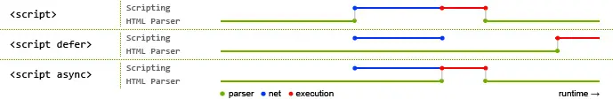
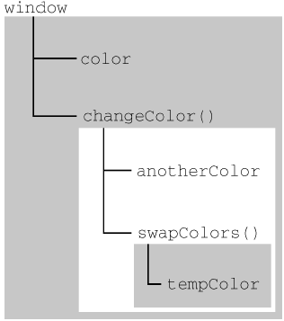
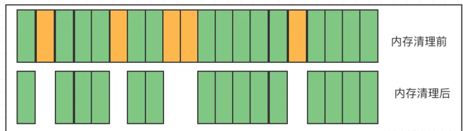
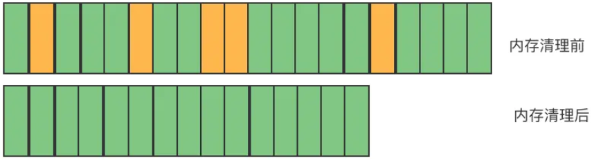
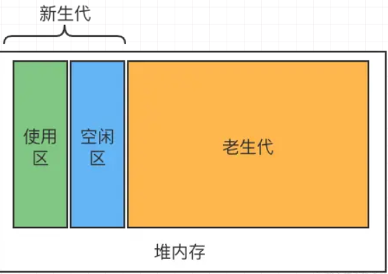

# JavaScript高级程序设计(第四版)读书笔记

## 第一章 什么是JavaScript
- JavaScript是由ECMAScript、DOM和BOM组成
- ECMAScript由ECMA-262定义并提供核心功能
- ECMAScript只是一种规范标准，而非具体实现，浏览器厂商根据ECMAScript做具体实现
- 文档对象模型(DOM)提供访问和操作网页的接口
- 浏览器对象模型(BOM)提供与浏览器交互的接口

## 第二章 HTML中的JavaScript
- `defer` 属性让**外部的JS文件**在页面渲染完成时执行
- `async` 属性让**外部的JS文件**在JS网络请求结束后立即执行(不能保证脚本加载的先后顺序)

参考文章：https://segmentfault.com/q/1010000000640869


- `<script>` 表中的 `src` 属性允许跨域请求外部的JS文件，但JS文件运行时内部如果有网络请求或资源获取依旧受跨域的限制

**同步**：类似打电话，必须一个人说完话后才能另一个说话

**异步**：类似发邮件，一个人发完邮件无需等待另一个回信，可以做别的事情

- `script` 最佳实践(在页面渲染完成后执行脚本)
```html
<!DOCTYPE html>
<html>
  <head>
    <title></title>
  </head>
  <body>
    <script></script>
  </body>
</html>
```
参考文章：https://www.zhihu.com/question/20027966

## 第三章 语言基础
语法
- 第一个字符必须是字母、下划线(_)或美元符号($)，其余的可以有数字
- 区分大小写
- 变量推荐使用驼峰大小写形式(camelCase)
- 推荐语句的末尾加分号(;)
- 推荐单行 `if` 判断也加上 `{}`

变量
- 不使用 `var` 操作符会创建一个全局变量
- `var` 存在变量提升
- 块级作用域是函数作用域的子集
- `var` 定义的变量可以直接在 `window` 对象上访问

ECMAScript中的类型共有8种
- String: 字符串类型
- Number: 数字类型
- Boolean: 布尔值类型
- undefined: 表示未定义的值
- null: 表示空值或不存在的对象
- Symbol: 表示唯一不可变的符号类型
- Object: 对象类型，一组无序键值对的集合
- BigInt: 表示任意长度的整数

typeof 操作符返回给定变量的数据类型，小写字符串表示
- 其中 `typeof null` 返回的是 object 类型
- 函数会返回 function 类型
> 注意：对未声明的变量使用 `typeof` 返回的依旧是 undefined，声明的变量若未赋值返回的也是 undefined，所以在声明变量的时候同时赋值是个明智的选择

声明了一个变量并马上赋值最佳实践如下
- Boolean 类型赋值为 true / false
- Number 类型赋值为 0
- String 类型赋值为空字符串('')
- Object 类型赋值为空对象 null

声明(最佳实践)
- 不使用 var
- 优先使用 const，如果需要改变值再使用 let

Boolean 类型
- Boolean() 转型函数，根据特定规则将其它类型转化为 `true` 和 `false`

Number 类型
- 不要使用某个特定的浮点数值。如 0.1 + 0.2 打印输出为 0.30000000000000004
- 八进制写法 `let num1 = 0o70;` 也可以写成 `let num1 = 070;`(不推荐，严格模式下报错)
- 十六进制写法 `let num2 = 0xA;`
- 进制超出时范围时会忽略前面的 0，把后面的数字序列当做**十进制**
- 在所有数学操作中，无论什么进制都会被转化为**十进制**来进行计算
- 判断一个数是否在正无穷大和负无穷大之间，可以使用 isFinite() 函数，如果在返回 true，反之返回 false
- 正或负的 Infinity 值不能进一步进行计算
- NaN全称(Not a Number)不是一个数字，需要使用 isNaN() 才能判断，NaN 与任何值都不相等，包括它本身，isNaN() 内的参数会尝试使用 Number() 转化为 Number 类型
- 0/0 返回 NaN，除了0以外的数字/0 返回 Infinity
- Number() 函数可以把任何类型转化为 Number 类型，不接受任何非数字字符串(返回NaN)，**推荐使用** parseInt() 和 parseFloat() 函数将字符串转化为数值
  - parseInt() 只要第一个非空字符为数字则直接返回数字，忽略后面的字符串
  - parseInt('') 返回 NaN，而 Number('') 返回 0
  - parseInt() 忽略字符串中的 `.`
  - parseInt() 可以指定底数(进制数)作为第二个参数，如何 `parseInt("AF", 16);` 返回 175
  - 不传底数 parseInt() 可能存在解析出错的问题，多数情况下解析的应该都是十进制数，此时第二个参数就要传入10
  - parseFloat() 忽略字符串中的第二次出现的 `.`
  - parseFloat() 只能解析十进制，不能指定底数，如果字符串内是整数(没有小数点)则直接返回整数
  - parseFloat() 只能解析十进制，十六进制直接返回0

BigInt 类型
- 将 n 添加到整数字段的末尾来创建 BigInt 值

  ```js
  const bigInt =  1234567890123456789012345678901234567890n;
  ```

String 类型
- 要把一个值转化为字符串，几乎所有类型都有 toString() 方法，但 null 和 undefined 没有这个方法
- toString() 可以不传参数，也可以接收指定底数(进制数)

  ```js
  let num1 = 10;
  console.log(num1.toString(2)); // 返回值为 '1010'
  ```
- 在不知道值是否是 null 和 undefined 的情况下，使用 String() 转型函数可以转化为相应的字符串，`String(null)` 返回 `'null'`，`String(undefined)` 返回 `'undefined'`
- 模版字面量标签函数，用法如下：
  ```js
  let a = 6;
  let b = 9;
  function tagFunction(strings,...args) {
    // strings 是数组，此时值为 ['','+','=','']
    // ...args 是数组，此时值为 ['6','9','15']
    return strings[0] + args.map((item,index) => {
      return `${item}${strings[index + 1]}`
    }).join('');
  }
  let result1 = `${a} + ${b} = ${a + b}`;
  let result2 = tagFunction`${a} + ${b} = ${a + b}`;

  console.log(result1); // '6 + 9 = 15'
  console.log(result2); // '6 + 9 = 15'
  ```

Object 类型
- 对象通过 new 操作符后跟要创建的对象类型的名称来创建

  ```js
  let obj = new Object();
  ```
- ECMAScript中的 Object 类型也是所有对象的父类(基类)，所以任何对象都有以下这些属性和方法
- Object 的每个实例都具有下列属性和方法
  - constructor: 保存用于创建对象的函数，构造函数，前面的例子就是 Object()
  - hasOwnProperty(propertyName): 用于检查给定的属性是否在对象实例中存在，propertyName 必须为字符串类型
  - isPropertypeOf(Object)：用于检查当前对象实例身上是否有传入对象的原型
  - propertyIsEnumerable(propertyName): 用于检查给定的属性能否使用 `for-in` 语句来枚举
  - toLocaleString(): 返回对象的字符串表示，该字符串与执行环境相对应，此处的执行环境指的是浏览器的语言环境，例如浏览器的时间格式
  - valueOf(): 用于将对象转换为其原始值，返回对象的字符串、数值或布尔值的表示，通常与 toString() 方法的返回值相同

Symbol 类型
  - 符号: ES6新增类型，符号是**唯一、不可变**的，主要用于确保对象不会发生属性冲突的风险
  - 基本使用: 创建符号实例时无需 new 关键字

    ```js
    let sign = Symbol(); // 创建一个符号
    console.log(typeof sign); // 'symbol'
    console.log(sign); // Symbol()
    ```
  - Symbol() 接收一个字符串参数作为符号的描述，用于调试代码
    ```js
    let sign1 = Symbol('description');
    let sign2 = Symbol('description');
    console.log(sign1); // Symbol(description)
    console.log(sign1 === sign2); // false
    ```
  - 符号包装成对象使用方式
    ```js
    let sign1 = Symbol();
    let sign2 = Object(sign1);
    console.log(typeof sign); // 'symbol'
    console.log(typeof sign2); // 'object'
    ```
  - 使用全局符号注册表
    - 代码运行时需要共享和复用符号实例，可以使用字符串作为键，在全局符号注册表中创建符号

      ```js
      let sign = Symbol.for('foo');
      console.log(typeof sign); // 'symbol'
      console.log(sign); // Symbol(foo)

      // 复用已有符号
      let sign2 = Symbol.for('foo');
      let sign3 = Symbol('foo');
      console.log(sign === sign2); // true
      console.log(sign === sign3); // false
      ```
      - 查找过程: 在 Symbol.for('foo') 创建符号时，会通过 'foo' 作为键去查找，如果有则返回该符号的实例，没有则创建
    - 使用 keyFor() 查询全局注册表，接收一个符号实例，如果是全局符号返回对应的键(字符串描述)，反之返回 undefined
      ```js
      let sign = Symbol('sign1');
      let sign2 = Symbol('sign2');
      console.log(Symbol.keyFor(sign)); // undefined
      console.log(Symbol.keyFor(sign2)); // 'sign2'
      ```
    - 使用符号作为对象属性
      ```js
      let s1 = Symbol('name');
      let s2 = Symbol('age');
      const obj = {
        [s1]: 'CodePencil',
        [age]: 21
      }

      // 如果没有显式保存符号，则只能变量对象符号属性才能获取
      const obj2 = {
        [Symbol('name2')]: 'JavaScript'
      }

      let sign = Object.getOwnPropertySymbols(obj2).find(item => {
        return item.toString().match(/name2/);
      });

      console.log(sign); // Symbol(name2)
      ```
    - 常用 Symbol 内置符号参考 P47

操作符
  - 最佳实践是函数要么返回值，要么不返回值。只在某个条件下返回值的函数会带来麻烦，尤其是调试时

    ```js
    // 不推荐
    function fun(a,b) {
      if(a > b) {
        return true;
      }
    }

    // 推荐
    function fun2(a,b) {
      if(a > b) {
        return true;
      } else {
        return false;
      }
    }

    let result = fun(1,2);
    ```
## 第四章 变量、作用域与内存
1. ECMAScript中的所有参数传递都是值，不可能通过引用传递参数
2. String、Number、Boolean、undefined、null、BigInt、Symbol 等基本类型都是按值访问
3. Object 引用类型的值是保存在内存中的对象，JavaScript不允许直接访问内存中的位置，实际上是在操作对象的引用而不是实际的对象，但是在为对象添加属性时，操作的是实际对象
4. 引用类型可以动态的添加或删除属性和方法，但基本类型不行
5. ECMAScript中所有的参数都是按值传递的，Object类型传递的是地址值，而非具体的对象

    ```js
    function setName(obj) {
      obj.name = 'CodePencil';
      obj = new Object();
      obj.name = 'JavaScript';
    }

    const person = new Object();
    setName(person);
    console.log(person.name); // 'CodePencil'
    ```
    具体参考：https://www.zhihu.com/question/51018162/answer/3236020946
6. 值是对象或 null 无法通过 `typeof` 判断是什么类型，因为都返回 object，需要使用 `instanceof` 来判断引用类型，如果变量是给定的引用类型的实例则返回 true
    ```js
    console.log(person instanceof Object); // 变量person是Object吗？
    console.log(colors instanceof Array); // 变量colors是Array吗？
    console.log(pattern instanceof RegExp); // 变量pattern是RegExp吗？
    ```
7. 在Web浏览器中，全局执行环境被认为是window对象，因此所有全局变量和函数都是window对象的属性和方法创造的

8. 每个上下文都有一个变量对象(variable object)，当前上下文中的变量都在这个对象上。每个函数调用都有自己的上下文，在代码执行流进入函数时，函数的上下文会被推入一个上下文栈中，函数执行完会从上下文栈中弹出

9. 上下文代码执行过程中，会创建变量对象的作用域链(scope chain)，作用域链决定上下文的执行顺序。如果当前上下文的变量对象中没有查找到指定的标识符，则通过作用域链到上一个上下文的变量对象中查找，直到找到为止，如果没有找到则报错，全局上下文的变量对象始终是最后一个变量对象

    

10. 可以通过 `try/catch` 的 `catch` 块或者 `with` 语句来增强作用域链，通过前面两种情况，都会在作用域链最前面添加一个变量对象，catch 抛出的错误对象则作为作用域链最前面的一个变量对象
    ```js
    function func() {
      let test = 'test';
      // 此时作用域链前添加了一个obj对象作为上下文
      with(obj) {
        let url = obj.href + test;
      }
      return url;
    }
    ```
11. JavaScript是使用垃圾回收的语言，垃圾回收是周期性(某个时机自动执行)的，回收时会影响性能，JavaScript垃圾回收策略有两种
  - 标记清理
    1. 首先垃圾收集器运行时给内存中所有变量加上一个标记
    2. 从各个根对象开始遍历，还在被上下文变量引用的变量去除标记
    3. 清理所有带有标记的变量，销毁并回收它们所占用的内存空间
    4. 垃圾回收程序做一个内存清理
  
    > 缺点：存在内存碎片化，分配速度慢的问题

    
  - 标记整理: 与标记清理类似，不过在标记接收后，将所有活着的对象向内存的一端移动，清理边界的内存

    

  - 引用计数(不常见)
    1. 当变量声明并赋值后，值引用数+1
    2. 当同一个值被赋值给另一个变量后，值引用数+1
    3. 当保存该值引用的变量被其它值覆盖时，值引用数-1
    4. 当值引用数为0时，清理并回收内存
    > 缺点：变量循环引用时会造成大量内存无法释放，这就是放弃引用计数的原因
    
    ```js
    let a = new Object(); // 此对象引用计数为1 a引用
    let b = a; // 此对象引用计数为2 a,b引用
    // 循环引用解决方案
    a = null; // 此对象的引用计数为 1（b引用）
    b = null; // 此对象的引用计数为 0（无引用）
    ```
  - V8 对垃圾回收机制和优化
    * V8 的整个堆内存的大小就等于 `新生代内存 + 老生代内存`

      

    * 新生代一般是指新产生的对象，老生代指经历过新时代垃圾回收后存活下来的对象，老生代的内存容量一般比新生代的大
    * 新生代内存空间一分为二为使用区和空闲区，刚创建的对象会放入使用区，当使用区快满了进行一次垃圾清理操作，新生代回收期对使用区的对象进行标记，标记完后将使用区的活动对象拷贝到空闲区进行排序，然后清理使用区，最后将空闲区和使用区进行交换，使用区->空闲区，空闲区->使用区
    * 新生代中经历过回收之后依旧一直存在，则会放入老生代
    * 老生代则是采用标记整理策略进行垃圾回收
12. 内存泄漏，指在JS中已经分配内存地址的对象由于长时间未进行内存释放或无法清除，造成了长期占用内存，使得内存资源浪费，最终导致运行的应用响应速度变慢以及最终崩溃的情况

    * 常见的原因有
      - 过多的缓存
      - 滥用闭包
      - 定时器或回调太多
      - 太多无效的DOM引用
      - 反复重写同一个数据造成内存大量的占用
      - 程序逻辑死循环
      - DOM对象和JS对象相互引用

    参考文章：https://juejin.cn/post/7038593947995734030#heading-11

13. 优化内存占用的最佳方式，就是为执行中的代码只保留必要的数据。一旦全局对象属性以及循环引用变量的引用不再有用，最好通过将其值设置为null来释放引用

    ```js
    function createPerson(name) {
        let localPerson = new Object();
        localPerson.name = name;
        return localPerson;
    }
    let globalPerson = createPerson('CodePencil');
    globalPerson = null;  // 在不使用它的时候手动释放它
    ```

14. 隐藏类和删除操作，详见 P98，V8会将创建的对象与隐藏类关联起来，以追踪它们的属性特征，能够共享相同隐藏类的对象性能会更好
    ```js
    function Article() {
      this.title = 'Inauguration Ceremony Features Kazoo Band';
    }
    // a1 与 a2 共享一个隐藏类
    let a1 = new Article();
    let a2 = new Article();

    // 如果添加了以下的代码则不再共享一个隐藏类
    // a2 引用另外一个隐藏类
    a2.author = 'Jake';
    ```
    解决方案：
      - 避免JavaScript中对象的“先创建再补充”式的动态属性赋值

        ```js
          function Article(opt_author) {
            this.title = 'Inauguration Ceremony Features Kazoo Band';
            this.author = opt_author;
          }
          // a1 与 a2 共享一个隐藏类
          let a1 = new Article();
          let a2 = new Article('Jake');
        ```
      - 如果要动态删除属性也会导致跟前者一样的后果
        ```js
          function Article(opt_author) {
            this.title = 'Inauguration Ceremony Features Kazoo Band';
            this.author = opt_author;
          }
          // a1 与 a2 共享一个隐藏类
          let a1 = new Article();
          let a2 = new Article('Jake');

          // 如果添加了以下的代码则不再共享一个隐藏类
          // a1 引用另外一个隐藏类
          delete a1.author;
        ```
        解决方案
        ```js
          function Article(opt_author) {
            this.title = 'Inauguration Ceremony Features Kazoo Band';
            this.author = opt_author;
          }
          // a1 与 a2 共享一个隐藏类
          let a1 = new Article();
          let a2 = new Article('Jake');

          // 最佳实践：不想要的属性设置为 null
          a1.author = null;
        ```

15. 静态分配与对象池，详见P100，属于过早优化，一般不用考虑
