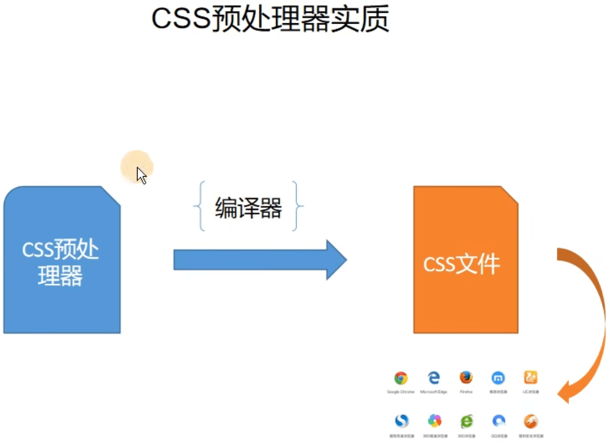

# Sass 学习笔记

视频地址：https://www.bilibili.com/video/BV1Ci4y1d74K


## 为什么会出现 CSS 预处理器

主要有以下两个原因：

1. CSS 没有其它编程语言的变量(新版本 CSS 已有变量，但旧版本浏览器不支持)、函数、循环等编程语法
2. 随着项目复杂， CSS 代码会变得臃肿和难以维护


## 什么是 CSS 预处理器

通过使用预处理器进行编程，然后再通过对应的编译器编译为浏览器支持识别的 CSS 代码



目前常见的 CSS 预处理器有 Sass(Scss)、Less、Stylus、PostCSS 等，其中目前最主流的是 Sass(Scss)


## Sass 简介

> 全称为 Syntactically Awesome Stylesheets，可翻译为 “语法上很棒的样式表”
>
> 官网：https://sass-lang.com

Sass 是一种动态语言，最早开始是用 Ruby 语言设计的，Sass 的语法没有 `{}` 和 `;`，使用缩进排版语法

```scss
// index.sass
.box
	width: 30%
	background-color: #fff
```

Sass 的缩进排版语法对于前端不太友好，所以 Sass 从第三代(3.x)开始放弃了缩进排版语法，并完全向下兼容普通的 CSS 代码，这一代的 Sass 也被称为 Scss

```scss
// index.scss
.box {
  width: 30%;
	background-color: #fff;
}
```

**输出风格**

默认风格为 `nested`

- `nested`：嵌套缩进的 CSS 代码
- `expanded`：展开的多行 CSS 代码
- `compact`: 简洁格式的 CSS 代码
- `compressed`: 压缩后的 CSS 代码


## Sass 语法功能扩展

**层叠**

- Sass 写法

  ```scss
  .container {
    width: 1200px;
    .header {
      height: 90px;
    }
  }
  ```

- 最终编译后的 CSS 结果

  ```css
  .container {
    width: 1200px;
  }
  .container .header {
    height: 90px;
  }
  ```


**父选择器(&)**

- Sass 写法

  ```scss
  .section {
    background: blue;
    a {
    	font-size: 18px;
    	&:hover {
      	color: red;
    	}
  	}
    &-left {
      float: left;
    }
  }
  ```

- 最终编译后的 CSS 结果

  ```css
  .section {
    background: blue;
  }
  .section a {
    font-size: 18px;
  }
  .section a:hover {
    color: red;
  }
  .section-left {
    float: left;
  }
  ```
  


**属性嵌套**

- Sass 写法

  ```scss
  .container {
    a {
      color: #333;
      font: {
        size: 14px;
        family: sans-serif;
        weight: bold;
      }
    }
  }
  ```

- 最终编译后的 CSS 结果

  ```css
  .container a {
    color: #333;
    font-size: 14px;
    font-family: sans-serif;
    font-weight: bold;
  }
  ```

  

**占位符选择器(%)**

使用 `%` 定义占位符选择器，只能通过使用 `@extend` 命令使用占位符选择器，如果没有使用 `@extend`，占位符选择器的样式不会编译生成

- Sass 写法

  ```scss
  .button%base {
    display: inline-block;
    font-weight: normal;
    text-align: center;
    user-select: none;
  }
  .btn-default {
    @extend %base;
    background-color: blue;
  }
  .btn-success {
    @extend %base;
    background-color: green;
  }
  ```

- 最终编译后的 CSS 结果

  ```css
  .button.btn-success,
  .button.btn-default {
    display: inline-block;
    font-weight: normal;
    text-align: center;
    user-select: none;
  }
  .btn-default {
    background-color: blue;
  }
  .btn-success {
    background-color: green;
  }
  ```


## Sass 注释

在 Sass 中可以使用两种注释，**单行注释不会被编译到最终的 CSS 结果中**

- Sass 写法

  ```scss
  // 单行注释
  /* 多行注释 */
  ```

- 最终编译后的 CSS 结果

  ```css
  /* 多行注释 */
  ```


## Sass 变量

**定义规则**

1. 变量以美元符号( `$` )开头，后面跟变量名
2. 变量名不能以数字开头，可以包含字母、数字、下划线( `_` )、连接符( `-` )
3. 变量名和值之间使用 `:` 分隔，以 `;` 结尾
4. 变量一定要先定义，后使用
5. 重复定义的变量，最后定义的变量的值会覆盖之前定义的


**变量定义**

Sass 变量名如果包含有多个单词时推荐使用连接符( `-` )分隔单词，例如：**推荐** `$font-size: 18px;` 而非 `$fontSize: 18px;`，在 Sass 中 `_` 和 `-` 分隔的同名变量表示同一个变量，例如：`$font-size: 16px;` 等价于 `$font_size: 16px;`，具体原因参考 [Sass文档](https://sass-lang.com/documentation/variables/)

变量不会被编译到最终的 CSS 结果中

- Sass 语法

  ```scss
  $font-size: 14px;
  
  .container {
    font-size: $font-size;
  }
  ```

- 最终编译后的 CSS 结果

  ```css
  .container {
    font-size: 14px;
  }
  ```

  

**变量作用域**

定义在文件最顶层以及使用 `!global` 的变量为全局变量

- Sass 语法

  ```scss
  // 全局变量
  $font-size: 16px;
  $color: green;
  // 为了避免使用 !global 警告而定义的变量
  $border-color: null;
  
  .container {
    // 局部变量
    $color: red;
    // 通过使用 !global 给已有的全局变量赋值
    $border-color: blue !global;
    font-size: $font-size;
    .content {
      // 可以访问到 .container 里的 $color 变量
      color: $color;
    }
  }
  .footer {
    // 无法访问到 .container 里的 $color 变量
    color: $color;
    // 可以访问到 .container 里的 $border-color 变量
    border-color: $border-color;
  }
  ```

- 最终编译后的 CSS 结果

  ```css
  .container {
    font-size: 16px;
  }
  .container .content {
    color: red;
  }
  .footer {
    color: green;
    border-color: blue;
  }
  ```

**注意：** 使用 `!global` 时需要提前在文件最顶层定义值为 `null` 的相同的变量名，不然会出现 `As of Dart Sass 2.0.0, !global assignments won't be able to declare new variables.` 的警告信息


**变量类型**

Sass 支持 7 种主要的数据类型

- 数字，例如：`1`、`2px`、`30%` 等
- 字符串，分为有引号字符串与无引号字符串，例如：`"foo"`、`'foo'`、`foo` 等
- 颜色，例如：`blue`、`#f00`、`rgba(255,0,0,0.5)`、`rgb(255,0,0,0)` 等
- 布尔型，例如：`true`、`false`
- 空值，例如：`null`
- 数组，使用空格或逗号作为分隔符，例如：`1.5rem 1em 0 2em` 或 `1.5rem,1em,0,2em`
- maps，类似 Javascript 中的对象，例如： `(key: value1,key2: value2)`

```scss
$layer-index: 10;
$border-width: 3px;
$font-base-family: 'Open Sans', Helvetica, Sans-Serif;
$top-bg-color: rgba(255, 147, 29, 0.6);
$block-base-padding: 6px 10px 6px 10px;
$blank-mode: true;
$var: null;
$color-map: (
  color1: #f00,
  color2: #0f0,
  color3: #00f,
);
```


**变量默认值**

通过使用 `!default` 定义变量的默认值

- Sass 语法

  ```scss
  $color: #333;
  
  // 如果 $color 之前没定义就使用如下默认值
  $color: #666 !default;
  .container {
    border-color: $color;
  }
  ```

- 最终编译后的 CSS 结果

  ```css
  .container {
    border-color: #333;
  }
  ```


## Sass 导入 @import

允许导入其他的 Scss 文件，被导入的文件将合并编译到同一个 CSS 文件中，被导入的文件中的所包含的变量或者混合指令(mixin)都可以在导入的文件中使用

- Sass 语法

  ```scss
  // public.scss
  $font-base-color: #333;
  ```

  ```scss
  // index.scss
  // .scss 单位可以省略
  @import './public';
  $color: #666;
  .container {
    border-color: $color;
    color: $font-base-color;
  }
  ```

- 最终编译后的 CSS 结果

  - public.css 文件，内容为空，Sass 变量不会被编译到 CSS 文件中

    ```css
    
    ```

  - index.css 文件

    ```css
    .container {
      border-color: #666;
      color: #333;
    }
    ```

**注意：** 以下几种方式，都将作为普通的 CSS 语句，不会导入任何 Sass 文件

1. 导入的文件扩展名是 `.css`
2. 文件名以 `http://` 开头
3. 文件名是 `url()`
4. `@import` 包含媒体查询

```scss
@import "./public.css";
@import url(./public.scss);
@import "http://xxx.com/xxx";
@import 'landscape' screen and (orientation: landscape);
```


导入的 `.scss` 文件默认会自行编译生成 CSS 文件，如果不想导入的文件自行编译生成 CSS 文件，可以在文件名前加上 `_` 表示文件是**局部文件**，不需要编辑生成 CSS 文件，在使用 `@import` 导入时可以省略文件名中的 `_`

- Sass 语法

  ```scss
  // _public.scss
  $font-base-color: #333;
  ```

  ```scss
  // index.scss
  // .scss 单位可以省略,_也可以省略
  @import './public';
  $color: #666;
  .container {
    border-color: $color;
    color: $font-base-color;
  }
  ```

- 最终编译后的 CSS 结果

  ```css
  .container {
    border-color: #666;
    color: #333;
  }
  ```

**注意：** Sass 团队不鼓励继续使用 `@import` 规则，将在未来几年逐步淘汰，推荐后续新项目中使用 `@use` 规则，具体原因参考 [Sass文档](https://sass-lang.com/documentation/at-rules/import/)


## Sass 混入 @mixin

混入通过使用 `@mixin 混入变量名 {}` 定义在整个样式表中重复使用的样式，再使用 `@include 混入变量名` 使用定义的混入样式

混入是可以重复使用的一组 CSS 声明

混入指令有助于减少重复代码，只需要声明一次，就可以在文件中引用

混入指令可以包含所有的 CSS 规则和绝大部分的 Sass 规则，可以通过参数功能引入变量，输出多样化的样式

**混入指令使用场景：** 很多地方都会用到却能根据不同场景下灵活使用的样式

**注意：** 混入由于是将样式编译写入到使用的地方，而非引用，存在代码冗余，所以会导致 CSS 文件体积变大，推荐优先使用继承 `@extend` 如果继承不能实现再考虑使用 `@mixin`


**基本语法**

- Sass 语法

  ```scss
  @mixin block {
    width: 96%;
    margin-left: 2%;
    border-radius: 8px;
    border: 1px #f6f6f6 solid;
  }
  
  .container {
    @include block;
  }
  ```

- 最终编译后的 CSS 结果

  ```css
  .container {
    width: 96%;
    margin-left: 2%;
    border-radius: 8px;
    border: 1px #f6f6f6 solid;
  }
  ```


**混入中包含类**

- Sass 语法

  ```scss
  @mixin warning-text {
    .warn-text {
      font-size: 12px;
      color: rgb(255, 253, 123);
      line-height: 180%;
    }
  }
  
  .container2 {
    @include warning-text;
  }
  ```

- 最终编译后的 CSS 结果

  ```css
  .container2 .warn-text {
    font-size: 12px;
    color: rgb(255, 253, 123);
    line-height: 180%;
  }
  ```


**混入接收参数**

- Sass 语法

  ```scss
  @mixin flex-align($aitem) {
    align-items: $aitem;
  }
  
  .container3 {
    // @include flex-align(center);
    // 也可以指定对应的参数名的值
    @include flex-align($aitem: center);
  }
  ```

- 最终编译后的 CSS 结果

  ```css
  .container3 {
  	align-items: center;
  }
  ```


**混入接收多个参数并设置默认值**

- Sass 语法

  ```scss
  @mixin block-padding($top: 0, $right: 0, $bottom: 0, $left: 0) {
    padding-top: $top;
    padding-right: $right;
    padding-bottom: $bottom;
    padding-left: $left;
  }
  
  .container4 {
    @include block-padding(20px,16px);
    // 也可以使用 @include block-padding($left: 20px,$top: 16px);
  }
  ```

- 最终编译后的 CSS 结果

  ```css
  .container4 {
    padding-top: 20px;
    padding-right: 16px;
    padding-bottom: 0;
    padding-left: 0;
  }
  ```

**注意：** 使用参数时，**建议加上参数默认值**，如果没有默认值且使用混入时缺少参数传递会导致 Sass 编译失败


**混合参数不固定的情况**

通过在**最后一个参数名**后面使用 `...` 表示参数的个数不固定，接收多个参数作为一个数组，类似于 Javascript ES6 中的参数聚合

- Sass 语法

  ```scss
  // $gradients... 表示参数的个数不固定，接收多个参数作为一个数组
  @mixin linear-gradient($direction, $gradients...) {
    // nth() 可以选择数组中的指定位置的值，默认下标从1开始而非常规中的0
    // 此处 nth($gradients, 1) 表示选择 $gradients... 数组中的第一个值
    background-color: nth($gradients, 1);
    background-image: linear-gradient($direction, $gradients);
  }
  
  .container5 {
    @include linear-gradient(to right, #f00, orange, yellow);
  }
  ```

- 最终编译后的 CSS 结果

  ```css
  .container5 {
    background-color: #f00;
    background-image: linear-gradient(to right, #f00, orange, yellow);
  }
  ```

  

## Sass 继承 @extend

可以让一个选择器继承另一个选择器的样式

**注意：** 使用 `@mixin` 也可以现实和 `@extend` 相同的页面效果，但是 CSS 的文件体积会变大，这种情况下建议还是使用 `@extend`


**基本语法**

- Sass  语法

  ```scss
  .alert {
    padding: 15px;
    margin-bottom: 20px;
    border: 1px solid transparent;
    border-radius: 4px;
    font-size: 12px;
    &-info {
    	@extend .alert;
    	color: #31708f;
    	background-color: #d9edf7;
    	border-color: #bce8f1;
  	}
    &-success {
    	@extend .alert;
    	color: #3c763d;
    	background-color: #dff0d8;
    	border-color: #d6e9c6;
  	}
  }
  ```

- 最终编译后的 CSS 结果

  ```css
  .alert, .alert-success, .alert-info {
    padding: 15px;
    margin-bottom: 20px;
    border: 1px solid transparent;
    border-radius: 4px;
    font-size: 12px;
  }
  .alert-info {
    color: #31708f;
    background-color: #d9edf7;
    border-color: #bce8f1;
  }
  .alert-success {
    color: #3c763d;
    background-color: #dff0d8;
    border-color: #d6e9c6;
  }
  ```

  

**占位选择符写法**

相比前面一种用法，可以减少公共类名 `.alert` 样式的定义

- Sass  语法

  ```scss
  %alert {
  	padding: 15px;
  	margin-bottom: 20px;
  	border: 1px solid transparent;
  	border-radius: 4px;
  	font-size: 12px;
  }
  
  .alert-info {
    @extend %alert;
    color: #31708f;
    background-color: #d9edf7;
    border-color: #bce8f1;
  }
  
  .alert-success {
  	@extend %alert;
  	color: #3c763d;
    background-color: #dff0d8;
    border-color: #d6e9c6;
  }
  ```

- 最终编译后的 CSS 结果

  ```css
  /* 此处减少了公共类名 .alert 类的定义 */
  .alert-success, .alert-info {
    padding: 15px;
    margin-bottom: 20px;
    border: 1px solid transparent;
    border-radius: 4px;
    font-size: 12px;
  }
  .alert-info {
    color: #31708f;
    background-color: #d9edf7;
    border-color: #bce8f1;
  }
  .alert-success {
    color: #3c763d;
    background-color: #dff0d8;
    border-color: #d6e9c6;
  }
  ```


## Sass 运算符

**等号运算符**

所有的数据类型都支持等号运算符

| 符号 | 说明   |
| ---- | ------ |
| `==` | 等于   |
| `!=` | 不等于 |

- Sass  语法

  ```scss
  $theme: 1;
  .container {
    @if $theme == 1 {
      background-color: red;
    } @else {
      background-color: blue;
    }
  }
  ```

- 最终编译后的 CSS 结果

  ```css
  .container {
    background-color: red;
  }
  ```


**关系(比较)运算符**

只能整数之间进行比较

| 符号  | 说明     |
| ----- | -------- |
| `<`   | 小于     |
| `>`   | 大于     |
| `<=`  | 小于等于 |
| `>= ` | 大于等于 |

- Sass 语法

  ```scss
  $theme: 3;
  .container {
    @if $theme >= 5 {
      background-color: red;
    } @else {
      background-color: blue;
    }
  }
  ```

- 最终编译后的 CSS 结果

  ```css
  .container {
    background-color: blue;
  }
  ```

  

**逻辑运算符**

| 符号  | 说明   |
| ----- | ------ |
| `and` | 逻辑与 |
| `or`  | 逻辑或 |
| `not` | 逻辑非 |

- Sass 语法

  ```scss
  $width: 100;
  $height: 200;
  $last: false;
  $index: 10;
  
  div {
    @if $width > 50 and $height < 300 {
      font-size: 16px;
    } @else {
      font-size: 14px;
    }
  
    @if $width > 200 or $height < 300 {
      font-weight: 700;
    } @else {
      font-weight: 400;
    }
  
    @if not($index > 5) {
      border-color: red;
    } @else {
      border-color: blue;
    }
  }
  ```

- 最终编译后的 CSS 结果

  ```css
  div {
    font-size: 16px;
    font-weight: 700;
    border-color: blue;
  }
  ```

  

**数字操作符**

只是用于数字，**纯数字和其它单位运算时会自动进行单位转换**

| 符号                | 说明 |
| ------------------- | ---- |
| `+`                 | 加   |
| `-`                 | 减   |
| `*`                 | 乘   |
| `/` 或 `math.div()` | 除   |
| `%`                 | 取余 |

- 加运算

  - Sass语法	

    ```scss
    .container {
      width: 50 + 20;
      width: 50 + 20%;
      width: 50% + 20%;
      width: 20 + 10px;
      // width: 20% + 10px; 报错：% 无法和其他单位进行加运算
    }
    ```

  - 最终编译后的 CSS 结果

    ```css
    .container {
    	width: 70;
      width: 70%;
      width: 70%;
      width: 30px;
    }
    ```

  **注意：** 不兼容的单位之间无法进行运算

  

- 减运算

  - Sass 语法

    ```scss
    .container {
      width: 50 - 30;
      width: 50- 30%;
      width: 60% - 30%;
      width: 20px - 10px;
      width: 50px - 20pt; // pt被转换为px单位
      // width: 20% - 10px; 报错：% 无法和其他单位进行减运算
    }
    ```

  - 最终编译后的 CSS 结果

    ```css
    .container {
    	width: 20;
      width: 20%;
      width: 30%;
      width: 10px;
      width: 23.3333333333px;
    }
    ```

  **注意：**不兼容的单位之间无法进行运算

  

- 乘运算

  - Sass语法

    ```scss
    .container {
    	width: 10 * 20;
      width: 5 * 10%;
      // width: 50% * 10%; 报错：相同单位之间无法进行乘运算
      // width: 10px * 20px; 报错：相同单位之间无法进行乘运算
      // width: 5px * 10%; 报错：% 无法和其他单位进行乘运算
    }
    ```

  - 最终编译后的 CSS 结果

    ```css
    .container {
      width: 200;
      width: 50%;
    }
    ```

  **注意：** 不兼容的单位之间无法进行运算，并且相同单位之间也无法进行乘运算


- 除运算( `/` 运算符将在 Sass 2.0 版本之后被删除，新项目中推荐使用 `math.div()`，参考 [Sass文档 ](https://sass-lang.com/documentation/breaking-changes/slash-div/))

  - Sass 语法

    ```scss
    $width: 100px;
    
    .container {
      width: 10 / 5; // 此处不会被当做除号进行运算
      width: (10 / 5);
      width: $width / 10;
      width: round($number: 50) / 2;
      width: 10px / 2 + 3px;
    }
    ```

  - 最终编译后的 CSS 结果

    ```css
    .container {
      width: 10/5;
      width: 2;
      width: 10px;
      width: 25;
      width: 8px;
    }
    ```

  **注意：**不兼容的单位之间无法进行运算，以下三种情况 `/` 符号将被视为除法运算符号

  1. 如果值或值的一部分，是变量或者函数的返回值
  2. 如果值被 `()` 包裹
  3. 如果值是算数表达式的一部分

  ```scss
  $width: 1000px;
  
  div {
    font: 16px / 30px Arial; // 不会进行运算
    width: ($width / 2); // 使用了变量和括号包裹，会进行运算
    z-index: round(10) / 2; // 值的一部分是函数的返回值，会进行运算
    height: (500px / 2); // 使用了括号包裹，会进行运算
    margin-left: 5px + 8px / 2px; // 使用了 + 表达式
  }
  ```

​	

- 取模运算

  - Sass 语法

    ```scss
    .container {
      width: 10 % 3;
      width: 50 % 3px;
      width: 50px % 3px;
      width: 50% % 7;
      width: 50% % 9%;
      width: 50px % 13.3333px;
      width: 50px % 10pt;  // 此处输出10px是因为这里结果进行了小数位的省略
    }
    ```

  - 最终编译后的 CSS 结果

    ```css
    .container {
      width: 1;
      width: 2px;
      width: 2px;
      width: 1%;
      width: 5%;
      width: 10.0001px;
      width: 10px;
    }
    ```

    

**字符串运算**

`+` 操作符可用于连接两个字符串

- Sass 语法

  ```scss
  .container {
    content: 'foo' + bar;
    content: bar + 'foo';
    content: foo + bar;
    content: 'foo' + 'bar';
  }
  ```

- 最终编译后的 CSS 结果

  ```css
  .container {
    content: "foobar";
    content: barfoo;
    content: foobar;
    content: "foobar";
  }
  ```

**注意：** 有引号字符串在 `+` 操作符的左边时，最终的结果为有引号字符串，反之为无引号字符串，如果有一个值是函数返回的，则无论字符串在 `+` 操作符的左边还是右边最终结果都是为有引号的字符串


## Sass 插值语句

使用 `#{}` 可以在选择器、属性名、属性值、注释等中使用

- Sass 语法

  ```scss
  $class-name: danger;
  $attr: color;
  $author: 'CodePencil';
  
  /*
    文件说明部分
    @author: #{$author}
  */
  a.#{$class-name} {
    border-#{$attr}: #f00;
  }
  ```

- 最终编译后的 CSS 结果

  ```css
  /*
    文件说明部分
    @author: CodePencil
  */
  a.danger {
    border-color: #f00;
  }
  ```

**注意：** 在遇到只想把 `/` 作为分隔符时，可以使用插值语法来避免因为变量导致的计算

- Sass 语法

  ```scss
  $font-size: 12px;
  $line-height: 30px;
  
  p {
    // 此处因为使用了插值，所以不会因为值是变量所以导致计算
    font: #{$font-size}/#{$line-height} Helvetica;
  }
  ```

- 最终编译后的 CSS 结果

  ```css
  p {
    font: 12px/30px Helvetica;
  }
  ```


## Sass 常见函数基本使用

更多函数参考 [Sass文档](https://sass-lang.com/documentation/modules/)


**颜色函数**

`lighten()` 用于调亮颜色、`darken()` 用于调暗颜色、`opacify()` 用于减少颜色的透明度、`transparent()` 用于增加颜色的透明度、`mix()` 用于混合两种颜色

- Sass 语法

  ```scss
  // 颜色函数
  p {
    height: 30px;
  }
  
  .p0 {
    background-color: #5c7a29;
  }
  
  .p1 {
    /* 让颜色变亮 */
    background-color: lighten(#5c7a29, 30%);
  }
  
  .p2 {
    /* 让颜色变暗,通常使用 color.scale() 代替该方案 */
    background-color: darken(#5c7a29, 15%);
  }
  
  .p3 {
    /* 降低颜色的透明度,通常使用 color.scale() 代替该方案 */
    background-color: opacify(rgba(#5c7a29, 0.1), 0.5);
  }
  ```

- 最终编译后的 CSS 结果

  ```css
  p {
    height: 30px;
  }
  
  .p0 {
    background-color: #5c7a29;
  }
  
  .p1 {
    /* 让颜色变亮 */
    background-color: #aace6e;
  }
  
  .p2 {
    /* 让颜色变暗,通常使用 color.scale() 代替该方案 */
    background-color: #314116;
  }
  
  .p3 {
    /* 降低颜色的透明度,通常使用 color.scale() 代替该方案 */
    background-color: rgba(92, 122, 41, 0.6);
  }
  ```


**字符串函数**

- Sass 语法

  ```scss
  // 字符串函数
  p {
    &::after {
      /* quote() 是给文本加引号 */
      content: quote(这是里面的内容);
      /* unquote() 给文本取消引号 */
      background-color: unquote($string: '#F00');
      /* str-length() 获取文本字符串的长度 */
      z-index: str-length($string: 'sass学习');
    }
  }
  ```

- 最终编译后的 CSS 结果

  ```css
  p::after {
    /* quote() 是给文本加引号 */
    content: "这是里面的内容";
    /* unquote() 给文本取消引号 */
    background-color: #F00;
    /* str-length() 获取文本字符串的长度 */
    z-index: 6;
  }
  ```


**数值函数**

- Sass 语法

  ```scss
  p {
    z-index: abs($number: -15); // abs() 返回绝对值
    z-index: ceil(5.8); // ceil() 向上取整
    z-index: max(5, 1, 6, 8, 3); // max() 返回数组中的最大值
    opacity: random(); // random() 随机 0-1
  }
  ```

- 最终编译后的 CSS 结果

  ```css
  p {
    z-index: 15;
    z-index: 6;
    z-index: 8;
    opacity: 0.8937001598;
  }
  ```


**list 函数**

`length()` 返回列表的长度，`index()` 返回指定元素在列表中的位置，`append()` 可以往列表末尾插入一个元素，`nth()` 可以获取列表中指定位置的元素

- Sass 语法

  ```scss
  p {
    z-index: length(12px);
    z-index: length(12px 5px 8px);
    z-index: index(a b c d, c);
    padding: append(10px 20px, 30px);
    color: nth($list: red blue green, $n: 2);
  }
  ```

- 最终编译后的 CSS 结果

  ```css
  p {
    z-index: 1;
    z-index: 3;
    z-index: 3;
    padding: 10px 20px 30px;
    color: blue;
  }
  ```

  

**map 函数**

`map-get()` 用于获取指定 map 中的指定属性的值，`map-has-key()` 用于判断指定 map 中是否包含指定的属性，`map-keys()` 返回指定 map 中所有的属性名，`map-values()` 返回指定 map 中所有的属性值

- Sass 语法

  ```scss
  $font-sizes: (
    'small': 12px,
    'normal': 18px,
    'large': 24px,
  );
  $padding: (
    top: 10px,
    right: 20px,
    bottom: 10px,
    left: 30px,
  );
  p {
    font-size: map-get($font-sizes, 'normal');
    @if map-has-key($padding, 'right') {
      padding-right: map-get($padding, 'right');
    }
    &::after {
      content: map-keys($font-sizes) + ' ' + map-values($padding);
    }
  }
  ```

- 最终编译后的 CSS 结果

  ```css
  p {
    font-size: 18px;
    padding-right: 20px;
  }
  p::after {
    content: '"small", "normal", "large" 10px, 20px, 10px, 30px';
  }
  ```

  

**selector 选择器函数**

`selector-append()` 可以将一个选择器作为后台选择器添加到另一个选择器末尾，`selector-unify()` 可以合并两个选择器，使得新选择器匹配两个选择器的所有元素


- Sass 语法

  ```scss
  .header {
    background-color: #000;
    content: selector-append('.a', '.b', '.c') + '';
    content: selector-unify('a', '.disable') + '';
  }
  ```

- 最终编译后的 CSS 结果

  ```css
  .header {
    background-color: #000;
    content: ".a.b.c";
    content: "a.disable";
  }
  ```


**自检函数**

- Sass 语法

  ```scss
  $color: #f00;
  @mixin padding($left: 0, $top: 0, $right: 0, $bottom: 0) {
    padding: $top $right $bottom $left;
  }
  
  .container {
    // 判断变量在当前作用域是否存在
    @if variable-exists(color) {
      color: $color;
    } @else {
      content: '$color不存在';
    }
  
    // 判断混入在当前作用域是否存在
    @if mixin-exists(padding) {
      @include padding($left: 10px, $right: 10px);
    }
  }
  ```

- 最终编译后的 CSS 结果

  ```css
  .container {
    color: #f00;
    padding: 0 10px 0 10px;
  }
  ```

  

## Sass 流程控制指令


**@if 指令**

- Sass 语法

  ```scss
  $theme: 'green';
  .container {
    @if $theme == 'red' {
      color: red;
    } @else if $theme == 'blue' {
      color: blue;
    } @else if $theme == 'green' {
      color: green;
    } @else {
      color: darkgray;
    }
  }
  ```

- 最终编译后的 CSS 结果

  ```css
  .container {
    color: green;
  }
  ```

  

**@for 指令**

总共有两种格式：`@for $var from <start> through <end>` 和 `@for $var from <start> to <end>`

当使用 `through` 时，条件范围包含开始和结束的值，当使用 `to` 时，条件范围只包含开始的值，不包含结束的值

`$var` 可以是任何变量，例如：`$i`，条件范围开始的值和结束的值必须是整数值


- Sass 语法

  ```scss
  @for $i from 1 to 4 {
    .p#{$i} {
      width: 10px * $i;
      height: 30px;
      background-color: red;
    }
  }
  
  /* through写法 */
  @for $i from 1 through 4 {
    .p#{$i} {
      width: 10px * $i;
      height: 30px;
      background-color: red;
    }
  }
  ```

- 最终编译后的 CSS 结果

  ```css
  .p1 {
    width: 10px;
    height: 30px;
    background-color: red;
  }
  
  .p2 {
    width: 20px;
    height: 30px;
    background-color: red;
  }
  
  .p3 {
    width: 30px;
    height: 30px;
    background-color: red;
  }
  
  /* through写法 */
  .p1 {
    width: 10px;
    height: 30px;
    background-color: red;
  }
  
  .p2 {
    width: 20px;
    height: 30px;
    background-color: red;
  }
  
  .p3 {
    width: 30px;
    height: 30px;
    background-color: red;
  }
  
  .p4 {
    width: 40px;
    height: 30px;
    background-color: red;
  }
  ```


**@each 指令**

- Sass 语法

  ```scss
  p {
    width: 10px;
    height: 10px;
    display: inline-block;
    margin: 10px;
  }
  
  $color-list: red green blue turquoise darkmagenta;
  
  @each $color in $color-list {
    // 使用index() 获取元素在列表中的位置
    $index: index($color-list, $color);
    .p#{$index - 1} {
      background-color: $color;
    }
  }
  ```

- 最终编译后的 CSS 结果

  ```css
  p {
    width: 10px;
    height: 10px;
    display: inline-block;
    margin: 10px;
  }
  
  .p0 {
    background-color: red;
  }
  
  .p1 {
    background-color: green;
  }
  
  .p2 {
    background-color: blue;
  }
  
  .p3 {
    background-color: turquoise;
  }
  
  .p4 {
    background-color: darkmagenta;
  }
  ```

  

**@while 指令**

**注意：** 使用 `@while` 指令一定要先满足退出循环条件，不然编译会死循环

- Sass 语法

  ```scss
  $column: 12;
  
  @while $column > 0 {
    .col-sm-#{$column} {
      width: ($column / 12) * 100%;
    }
    // 此处不要放在 .col-sm-#{$column} 中，放在此处表示对全局变量的值进行修改
    $column: $column - 1;
  }
  ```

- 最终编译后的 CSS 结果

  ```css
  d.col-sm-12 {
    width: 100%;
  }
  
  .col-sm-11 {
    width: 91.6666666667%;
  }
  
  .col-sm-10 {
    width: 83.3333333333%;
  }
  
  .col-sm-9 {
    width: 75%;
  }
  
  .col-sm-8 {
    width: 66.6666666667%;
  }
  
  .col-sm-7 {
    width: 58.3333333333%;
  }
  
  .col-sm-6 {
    width: 50%;
  }
  
  .col-sm-5 {
    width: 41.6666666667%;
  }
  
  .col-sm-4 {
    width: 33.3333333333%;
  }
  
  .col-sm-3 {
    width: 25%;
  }
  
  .col-sm-2 {
    width: 16.6666666667%;
  }
  
  .col-sm-1 {
    width: 8.3333333333%;
  }
  ```

  

**@function**

把一些复杂或常用的内容的进行封装，以便重复使用

- Sass 语法

  ```scss
  @function function-name([$params,$param,...]) {
    ...
    @return $value;
  }
  ```

  **注意：** 函数名 `function-name` 与 `function_name` 是相同的，`@return` 只允许在 `@function` 的内部使用，每个 `@function` 内部必须以 `@return` 结束

`@function` 的参数使用与 `@mixin` 类似

在使用 `@min()` 函数时直接传数组是不行的( 报 *`can't be used in a calculation.`* 错误 )，此时需要使用 `...` 运算符进行任意参数的传递

- Sass 语法

  ```scss
  $widths: 50px,30px,80px;
  
  .top {
    // width: min(50px,30px,80px); // width: 30px;
    // width: min($widths); // Error: Value 50px, 30px, 80px can't be used in a calculation.
    width: min($widths...); // width: 30px;
  }
  ```

  

**`@mixin` 和 `@function` 的区别：**

- `@mixin` 主要作用是通过传递参数的方式输出多样化的样式，为了实现代码的复用
- `@function` 主要作用是通过传递参数后，经过函数内部的计算，最后 `@return` 输出一个值


**三元条件if函数**

- Sass 语法

  ```scss
  $theme: 'light';
  
  .container {
    color: if($theme == 'light', #000, #fff);
  }
  ```

  - 等价的 `@if` 语法

    ```scss
    $theme: 'light';
    
    .container {
      @if $theme == 'light' {
        color: #000;
      } @else {
        color: #fff;
      }
    }
    ```

- 最终编译后的 CSS 结果

  ```css
  .container {
    color: #000;
  }
  ```

  

## Sass @use 的使用

`@use` 可以从其他样式表中加载 `@mixin`、`@function` 和变量，并将多个样式表的 CSS 组合在一起，使用 `@use` 加载的样式表被称为模块，多次引入只包含一次，`@use` 可以看做 `@import` 的增强

- 语法

  ```scss
  @use '<url>' [as alias | namespace]
  ```


**加载普通的 Scss、css**

- _common.scss

  ```scss
  $font-size: 14px !default;
  
  * {
    margin: 0;
    padding: 0;
    font-size: $font-size;
    color: #333;
  }
  
  @function column-width($col, $total) {
    @return percentage($col/$total);
  }
  
  @mixin bgColor($bg-color: #f2f2f2) {
    background-color: $bg-color;
  }
  ```

- about.css

  ```css
  h1 {
    font-size: 24px;
  }
  ```

- index.scss

  ```scss
  @use 'common';
  @use 'about'
  ```

- 最终编译后的 CSS 结果

  ```css
  * {
    margin: 0;
    padding: 0;
    font-size: 14px;
    color: #333;
  }
  
  h1 {
    font-size: 24px;
  }
  ```


**加载模块**

- _global.scss

  ```scss
  // 通过在变量名前加上-或者_可以标识当前变量为模块内私有变量
  $-font-size: 28px;
  
  @mixin base($color: #f00) {
    color: $color;
    font-size: $-font-size;
  }
  
  .gclass {
    background-color: #f00;
  }
  ```

  

- Sass 语法

  ```scss
  // 加载模块通过使用 width 修改模块中变量的默认值
  @use 'common' with($font-size: 30px);
  // 重复调用模块如果不使用命名空间(别名)会导致模块冲突报错，默认情况下使用文件名作为模块名
  @use 'global' as g1;
  @use 'global' as g2;
  // @use 'global' as *; // 使用 * 可以取消命名空间，不推荐这么使用
  
  body {
    // 通过命名空间获取模块中指定的变量
    font-size: common.$font-size;
    width: common.column-width(3, 12);
    // 通过命名空间使用模块中指定的混入(mixin)
    @include g1.base('#fff');
    @include g1.base('#000');
  }
  ```

- 最终编译后的 CSS 结果

  ```css
  * {
    margin: 0;
    padding: 0;
    font-size: 30px;
    color: #333;
  }
  
  .gclass {
    background-color: #f00;
  }
  
  body {
    font-size: 30px;
    width: 25%;
    background-color: #f00;
    color: #fff;
    font-size: 28px;
    color: #000;
    font-size: 28px;
  }
  ```

  

**总结**

- `@use` 引入同一个文件多次，不会重复引入，但 `@import` 会重复引入
- `@use` 引入的文件都是一个模块，默认以文件名作为模块名，可以通过使用 `as` 设置命名空间(别名)
- `@use` 引入多个文件时，每个文件都是单独的模块，相同变量名不会覆盖，通过命名空间(别名)访问，而 `@import` 变量会被覆盖
- `@use` 方式可通过 `@use 'xxx' as *` 来取消命名空间，建议不要这么做
- `@use` 模块内可通过 `$-` 或 `$_` 开头来定义私有成员，以 `_` 或 `-` 开头的变量、函数、混入都不会被引入
- `@use` 模块内变量可以通过 `!default` 来定义默认值，引入时可使用 `with(...)` 的方式来修改默认值
- 可以定义 `-index.scss` 或者 `_index.scss` 来合并多个 css 文件，它是 `@use` 默认加载文件


## Sass @forward 的使用

通过 `@forward` 加载一个模块的成员，并将这些成员对外暴露出去，通常用于跨多个文件组织 Sass 库


**转发 Scss**

- 创建 forward/_common.scss

  ```scss
  $font-size: 14px !default;
  
  * {
    margin: 0;
    padding: 0;
    font-size: $font-size;
    color: #333;
  }
  
  @function column-width($col, $total) {
    @return percentage($col/$total);
  }
  
  @mixin bgColor($bg-color: #f2f2f2) {
    background-color: $bg-color;
  }
  ```

- 创建启动合并 _bootstrap.scss

  ```scss
  @forward 'uses/common';
  ```

- 使用

  ```scss
  @use './bootstrap';
  
  body {
    font-size: bootstrap.font-size;
    width: bootstrap.column-width(3, 12);
    @include bootstrap.bgColor(#f00);
    @include bootstrap.base(#f00);
  }
  ```

  

**同时转发多个模块中相同的变量**

-  forward/_global.scss

  ```scss
  $font-size: 28px;
  
  @mixin base($color: #f00) {
    color: $color;
    font-size: $font-size;
  }
  
  .gclass {
    background-color: #f00;
  }
  ```

- _bootstrap.scss

  ```scss
  @forward 'uses/common' as c-*;
  @forward 'uses/global' as g-*;
  ```

  当多个模块中都包含相同的变量时，如果直接使用会发生报错，通过使用 `as` 指定模块转发的成员前缀，建议是当有一个 `@forward` 加上前缀时，所有模块最好都加上前缀

- 使用

  ```scss
  @use './bootstrap';
  
  body {
    font-size: bootstrap.$c-font-size; // 使用了 _common.scss 中的 $font-size 变量
    width: bootstrap.c-column-width(3, 12); // 使用了 _common.scss 中的 column-width 函数
    @include bootstrap.c-bgColor(#f00); // 使用了 _common.scss 中的 bgColor 函数
    @include bootstrap.g-base(#f00); // 使用了 _global.scss 中的 base 函数
  }
  ```

  

**使用 show 指定模块中部分成员进行转发**

- _bootstrap.scss

  ```scss
  @forward 'uses/common' as c-* show $c-font-size, c-column-width;
  @forward 'uses/global' as g-*;
  ```

  通过使用 `show <...,...>` 语法指定模块中要进行转发的成员

  **注意：** 此处因为使用了前缀，所以 `show` 之后的成员名称也要加上前缀

- 使用

  ```scss
  @use './bootstrap';
  
  body {
    font-size: bootstrap.$c-font-size; // 使用了 _common.scss 中的 $font-size 变量
    width: bootstrap.c-column-width(3, 12); // 使用了 _common.scss 中的 column-width 函数
    // @include bootstrap.c-bgColor(#f00); // 报错，提示c-bgColor未定义
    @include bootstrap.g-base(#f00); // 使用了 _global.scss 中的 base 函数
  }
  ```


**使用 hide 指定模块中部分成员不进行转发**

- _bootstrap.scss

  ```scss
  @forward 'uses/common' as c-* hide c-bgColor;
  @forward 'uses/global' as g-*;
  ```

  通过使用 `hide <...,...>` 语法指定模块中不进行转发的成员

  **注意：** 此处因为使用了前缀，所以 `hide` 之后的成员名称也要加上前缀

- 使用

  ```scss
  @use './bootstrap';
  
  body {
    font-size: bootstrap.$c-font-size; // 使用了 _common.scss 中的 $font-size 变量
    width: bootstrap.c-column-width(3, 12); // 使用了 _common.scss 中的 column-width 函数
    // @include bootstrap.c-bgColor(#f00); // 报错，提示c-bgColor未定义
    @include bootstrap.g-base(#f00); // 使用了 _global.scss 中的 base 函数
  }
  ```

  

**设置指定模块转发时的默认值**

- _bootstrap.scss

  ```scss
  @forward 'uses/common' as c-* hide c-bgColor with (
    $font-size: 30px !default // 此处设置 !default 便于外部使用对默认值进行二次修改
  );
  @forward 'uses/global' as g-*;
  ```

  通过使用 `with()` 指定转发模块成员变量的默认值

  **注意：** 此处的 `$font-size` 不需要加前缀，此处是设置模块源头变量的默认值，不是转发时使用的，所以不用加前缀

- 使用

  ```scss
  @use './bootstrap' with(!c-font-size: 80px); // 可以对 bootstrap 中的默认值进行修改，此处使用时必须加上前缀
  
  body {
    font-size: bootstrap.$c-font-size; // 使用了 _common.scss 中的 $font-size 变量
    width: bootstrap.c-column-width(3, 12); // 使用了 _common.scss 中的 column-width 函数
    // @include bootstrap.c-bgColor(#f00); // 报错，提示c-bgColor未定义
    @include bootstrap.g-base(#f00); // 使用了 _global.scss 中的 base 函数
  }
  ```

  

**在转发合并模块中定义其他样式**

- uses/_code.scss

  ```scss
  $color: red;
  ```

- _bootstrap.scss

  ```scss
  @use 'uses/code';
  @use 'uses/common'; // 虽然使用@forword 引入了，但是无法使用变量，需要使用@use使用
  
  @forward 'uses/common' as c-* hide c-bgColor with (
    $font-size: 30px !default // 此处设置 !default 便于外部使用对默认值进行二次修改
  );
  @forward 'uses/global' as g-*;
  
  .block {
    background-color: code.$color;
    background-color: common.base(#fff);
  }
  ```

​	**注意：** 以上代码在实际运行时会报错，会提示模块已被加载，无法使用 `!default` 指定默认值

如果既要在 `@forward` 中使用 `!default` 有要使用对应模块中的成员，此时应该调整 `@forward` 和 `@use` 的顺序

```scss
@forward 'uses/common' as c-* hide c-bgColor with (
  $font-size: 30px !default // 此处设置 !default 便于外部使用对默认值进行二次修改
);
@forward 'uses/global' as g-*;

@use 'uses/code';
@use 'uses/common'; // 虽然使用@forword 引入了，但是无法使用变量，需要使用@use使用

.block {
  background-color: code.$color;
  @include common.bgColor(#fff);
}
```

**推荐做法：** 在同一个文件中使用 `@forward` 和 `@use`，应当把 `@forward` 放在 `@use` 的前面


**总结**

- `@forward` 相比 `@use` 可以使用转发模块的内部成员变量
- `@forward` 可以进行多次合并转发
- 可以使用 `hide` 和 `show` 来进行选择性的转发
- 使用 `@forward` 转发时可以使用 `with` 配置默认值
- 使用 `@forward` 转发时可以为模块定义前缀，避免转发多个样式的时候里面有重复的成员
- `@forward` 和 `@use` 同时使用时建议把 `@use` 放在 `@forward` 的后面


## Sass @at-root 的使用

`@at-root` 可以使得嵌套的选择器或属性跳出嵌套


**设置单个选择器跳出嵌套**

- Sass 语法
  ```scss
  .parent {
    font-size: 12px;
    @at-root .child {
      font-size: 14px;
      .son {
        font-size: 16px;
      }
    }
  }
  ```

- 最终编译后的 CSS 结果

  ```css
  .parent {
    font-size: 12px;
  }
  .child {
    font-size: 14px;
  }
  .child .son {
    font-size: 16px;
  }
  ```


**同时跳出多个选择器嵌套**

- Sass 语法

  ```scss
  .parent2 {
    font-size: 12px;
    @at-root {
      .child-1 {
        font-size: 14px;
      }
      .child-2 {
        font-size: 14px;
      }
      .child-3 {
        font-size: 14px;
      }
    }
  }
  ```

- 最终编译后的 CSS 结果

  ```css
  .parent2 {
    font-size: 12px;
  }
  .child-1 {
    font-size: 14px;
  }
  
  .child-2 {
    font-size: 14px;
  }
  
  .child-3 {
    font-size: 14px;
  }
  ```

  

**使用 & 跟 @at-root 类似的效果**

- Sass 语法

  ```scss
  .foo {
    & {
      font-size: 12px;
    }
  }
  ```

- 最终编译后的 CSS 结果

  ```css
  .foo {
    font-size: 12px;
  }
  ```

  **注意：** `.foo &` 嵌套，不会生成 `.foo .foo`


- Sass 语法

  ```scss
  .foo {
    & .bar {
      font-size: 12px;
    }
  }
  ```

- 最终编译后的 CSS 结果

  ```css
  .foo .bar {
    font-size: 12px;
  }
  ```


- Sass 语法

  ```scss
  .foo {
    .bar & {
      font-size: 12px;
    }
  }
  ```

- 最终编译后的 CSS 结果

  ```css
  .bar .foo {
    font-size: 12px;
  } 
  ```


默认情况下，`@at-root` 只会跳出选择器嵌套，不能跳出 `@media` 或 `@supports`，如果要跳出这两种，需要使用 `@at-root(without: media)` 和 `@at-root(without: support)`，这个语法的关键字有四个：

1. all (表示所有)

2. rule (表示常规 CSS)
3. media (表示跳出 @media)
4. supports (表示跳出 @supports)

**注意：** `with`  表示包括什么，`without` 表示不包括什么


**直接使用 @at-root 的情况**

- Sass 语法

  ```scss
  // 直接使用@at-root
  @media screen {
    .parent {
      font-size: 12px;
      @at-root {
        .child {
          font-size: 14px;
          .son {
            font-size: 16px;
          }
        }
      }
    }
  }
  ```

- 最终编译后的 CSS 结果

  ```css
  @media screen {
    .parent {
      font-size: 12px;
    }
    .child {
      font-size: 14px;
    }
    .child .son {
      font-size: 16px;
    }
  }
  ```

  **注意：** 默认情况下 `@at-root` 使用的是 `@at-root(without: rule)`，`rule` 表示常规 CSS


**跳出 @media**

- Sass 语法

  ```scss
  @media screen {
    .parent {
      font-size: 12px;
      @at-root (without: media) {
        .child {
          font-size: 14px;
          .son {
            font-size: 16px;
          }
        }
      }
    }
  }
  ```

- 最终编译后的 CSS 结果

  ```css
  @media screen {
    .parent {
      font-size: 12px;
    }
  }
  .parent .child {
    font-size: 14px;
  }
  .parent .child .son {
    font-size: 16px;
  }
  ```


**跳出 @supports**

- Sass 语法

  ```scss
  @supports (display: flex) {
    .parent {
      font-size: 12px;
      @at-root (without: supports) {
        .child {
          font-size: 14px;
          .son {
            font-size: 16px;
          }
        }
      }
    }
  }
  ```

- 最终编译后的 CSS 结果

  ```css
  @supports (display: flex) {
    .parent {
      font-size: 12px;
    }
  }
  .parent .child {
    font-size: 14px;
  }
  .parent .child .son {
    font-size: 16px;
  }
  ```

  

