# Shadowrocket 使用指北

Shadowrocket 只能用于 IOS(苹果) 系统， Android(安卓) 系统需要使用 Clash for Android

## 前言

因为 IOS 的封闭性，软件安装只能通过 App Store，但是由于 Shadowrocket 软件的特殊性，所以在**App Store 中国区无法上架**

这个时候需要**使用 App Store 美区账号**进行换区下载

**注意：** Shadowrocket 是**付费软件**

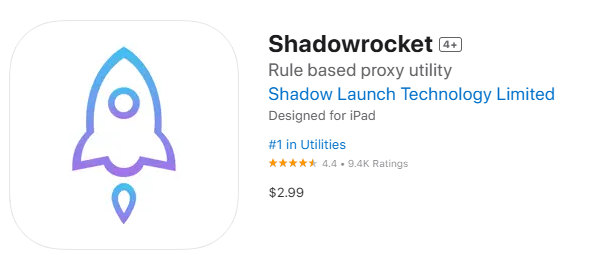

所以要下载 Shadowrocket，**需要登录已经购买了 Shadowrocket 的美区账号才能下载**，获取这类账号的渠道有很多，例如：淘宝上代购、自行创建美区账号购买、机场服务提供商有提供等等...

## 安装

Shadowrocket 官网：https://apps.apple.com/us/app/shadowrocket/id932747118

安装步骤因为涉及账号这里就简单的描述一下步骤，就不放截图了

1. 退出自己 App Store 登录的账号，**注意不是手机设置里的账号**，是退出如下图软件里的账号

   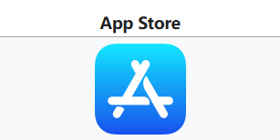

2. 登录 App Store 美区账号

3. 在 App Store 中搜索 `Shadowrocket`，并点击安装

4. 退出 App Store 美区账号，登录回自己的 App Store 账号

## 配置

1. 点击右上角的加号

   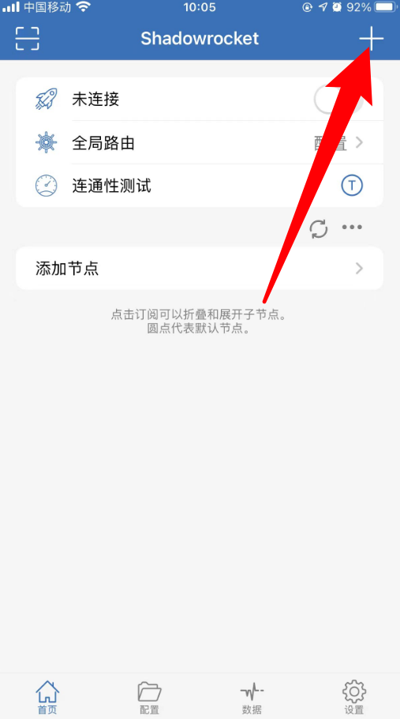

2. 在添加节点页面点击类型

   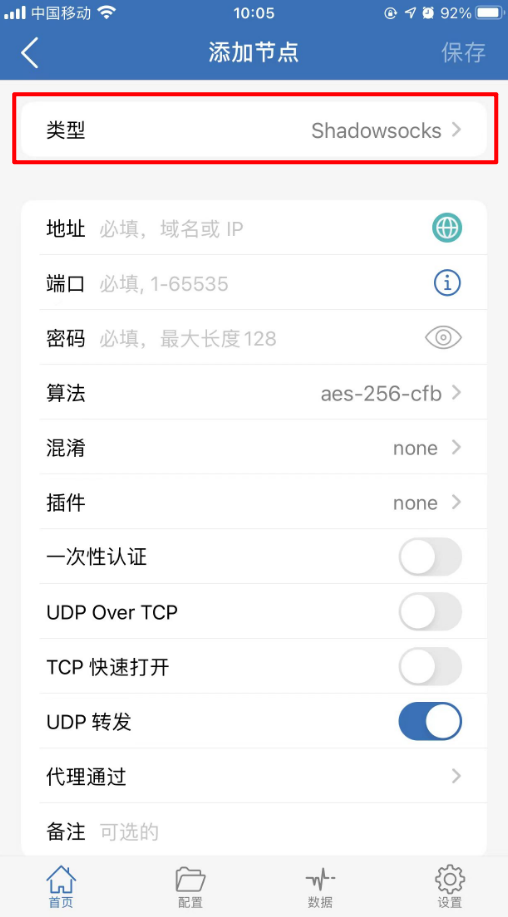

3. 选择 `Subscribe` 类型

   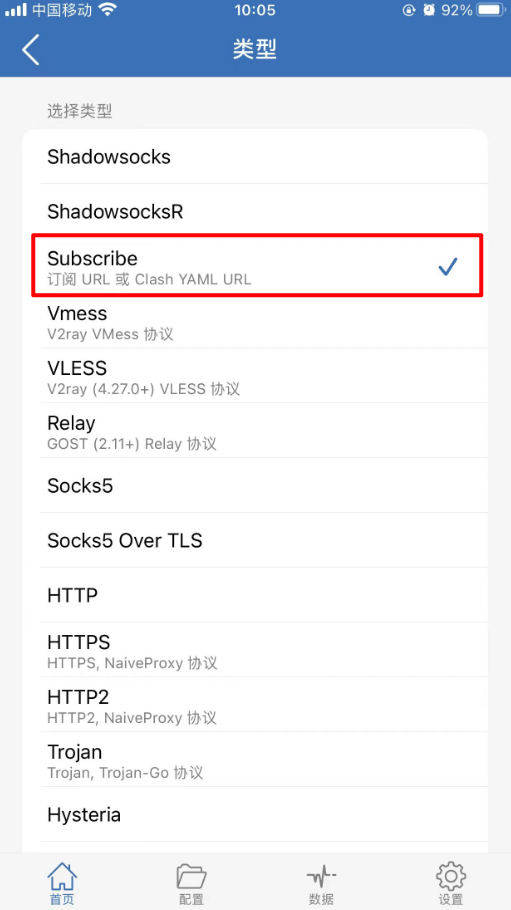

4. 将复制的订阅地址粘贴

   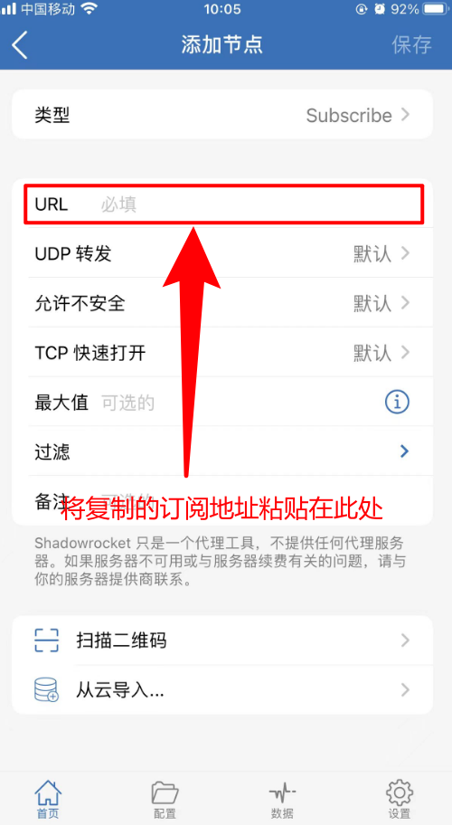

5. 点击右上角的保存

   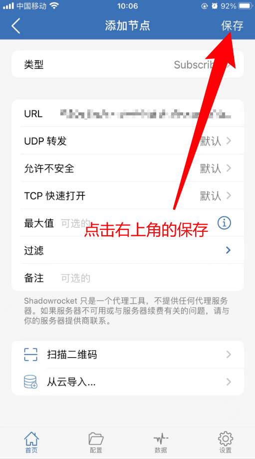

6. 启用后台自动更新

   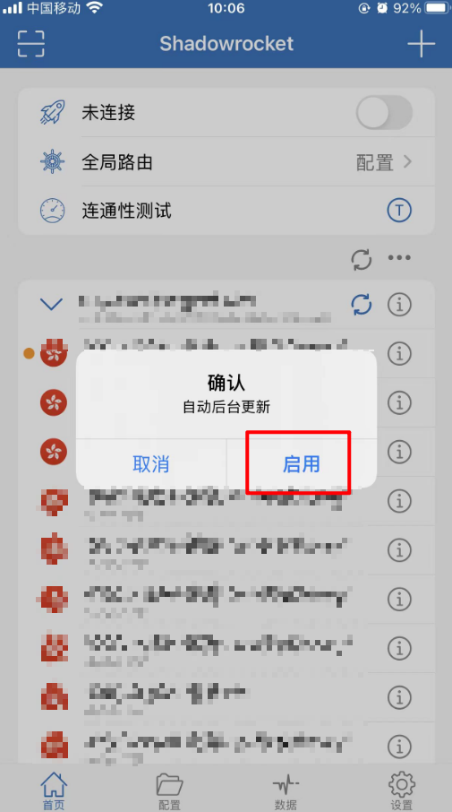

7. 点击开关，打开连接

   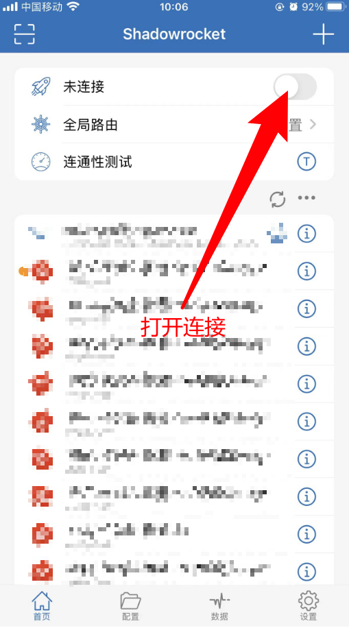

8. 此处点击好

   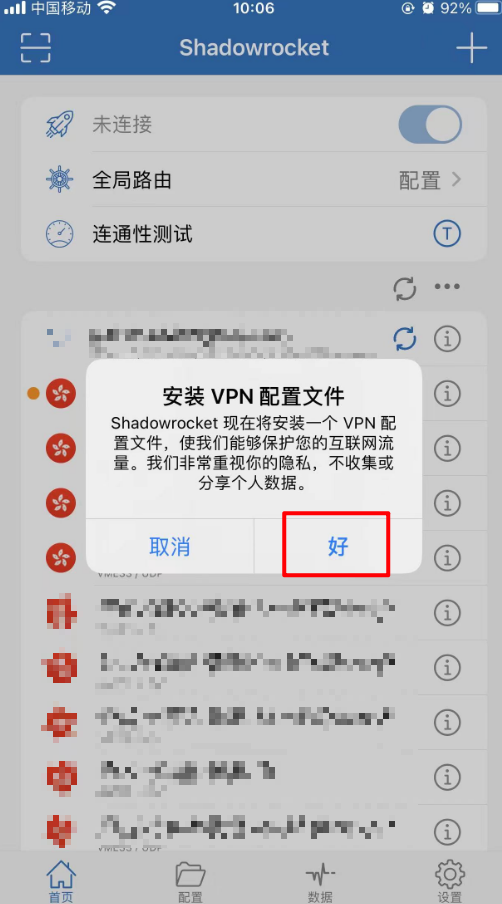

9. 点击允许添加配置，之后应该会要求输入手机解锁密码或者指纹解锁等，一律正常操作即可

   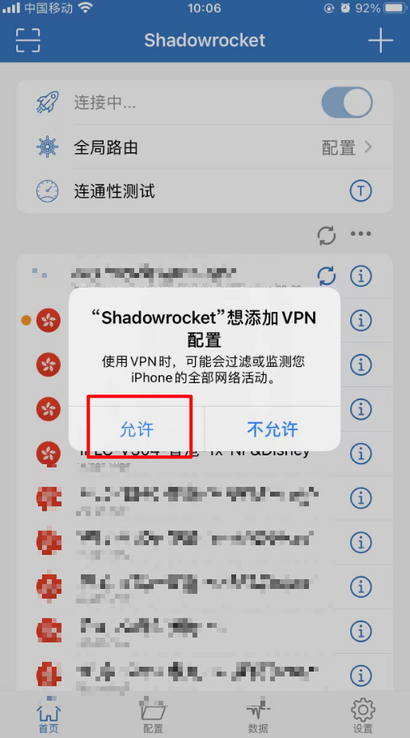

10. 最后，尝试在手机浏览器中访问 www.google.com 测试代理是否正常
