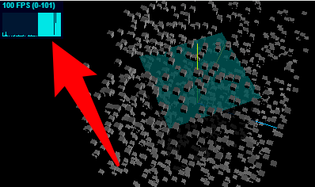

#  Three.js 笔记

视频地址：https://www.bilibili.com/video/BV14r4y1G7h4


## 下载

Three.js 所有版本：https://github.com/mrdoob/three.js/releases

下载后大致的目录如下:

```
three.js
├─ build
├─ docs
│  └─ index.html
├─ editor
│  └─ index.html
├─ examples
│  └─ jsm
└─ src
```

- build 中包含 Three.js 相关的库
- docs 中包含 Three.js API 文档文件
  - index.html 打开文件可以本地预览 Three.js 文档
- editor 中包含 Three.js 可视化编辑器，可以编辑 3D 场景
  - index.html 打开可视化编辑器
- examples 中包含大量 3D 案例
  - jsm 中包含了各种 Three.js 扩展库
- src 中包含 Three.js 引擎的源码


## 安装

具体可以参考[安装 – three.js docs](https://threejs.org/docs/index.html#manual/zh/introduction/Installation)

- index.html

  ```html
  <!DOCTYPE html>
  <html lang="en">
    <head>
      <meta charset="UTF-8" />
      <meta name="viewport" content="width=device-width, initial-scale=1.0" />
      <title>Document</title>
      <style>
        body {
          margin: 0;
        }
      </style>
      <!-- 配置import映射 -->
      <script type="importmap">
        {
          "imports": {
            "three": "https://cdn.jsdelivr.net/npm/three@latest/build/three.module.js",
            "three/addons/": "https://cdn.jsdelivr.net/npm/three@latest/examples/jsm/"
          }
        }
      </script>
    </head>
    <body>
      <script type="module" src="./main.js"></script>
    </body>
  </html>
  ```

- main.js

  ```js
  import * as THREE from 'three';
  
  console.log(THREE.Scene);
  ```

若无报错正常打印，则表示引入成功


## Three.js 三要素

- 场景(scene)
- 相机(camera)
- 渲染器(renderer)

三者结合起来就是最终的渲染结果


## 创建虚拟场景

用于模拟生活中真实的三维场景

1. 使用 `Scene` 创建虚拟场景

   ```js
   const scene = new THREE.Scene();
   ```

2. 创建物体

   1. 定义几何体

      ```js
      // 定义一个长方体，长宽高都是 100
      const geometry = new THREE.BoxGeometry(100, 100, 100);
      ```

   2. 定义材质

      ```js
      // 定义网格材质
      const material = new THREE.MeshBasicMaterial({
        color: 0xff0000, // 红色材质
      });
      ```

      具体可以配置的参数如下：

      - `color` 配置材质的颜色
      - `side` 适用于矩形平面、圆形平面等非三维的模型，可以配置的值如下：
        - `THREE.FrontSide`：只有正面可见，**默认值**
        - `THREE.DoubleSide`：两面都可见

   3. 使用几何体和材质创建网格模型，Three.js 中的物体可以使用 `Mesh` 网格模型来表示

      ```js
      const mesh = new THREE.Mesh(geometry, material);
      ```

3. 定义物体的位置

   ```js
   mesh.position.set(0, 10, 0);
   ```

4. 将物体添加到三维场景中

   ```js
   scene.add(mesh);
   ```


## 创建虚拟相机

用于模拟观察场景的视角


1. 定义相机

   Three.js 中提供两种相机：

   - 正投影相机 [OrthographicCamera](https://threejs.org/docs/index.html?q=Camera#api/zh/cameras/OrthographicCamera) 

   - 透视投影相机 [PerspectiveCamera](https://threejs.org/docs/index.html?q=PerspectiveCamera#api/zh/cameras/PerspectiveCamera)
     **特点：** 透视投影相机中的物体近大远小，随着相机视角 `fov` 的增大，渲染范围更大，近大远小的视觉效果更明显
     
     ```js
     const width = 800;
     const height = 500;
     
     const camera = new THREE.PerspectiveCamera(30, width / height, 0.1, 3000); // 创建一个透视投影相机对象
     ```
     
     `PerspectiveCamera` 构造函数参数如下：
     
     | 参数   | 含义                                                         | 默认值 |
     | :----- | :----------------------------------------------------------- | :----- |
     | fov    | 相机视锥体竖直方向视野角度                                   | 50     |
     | aspect | 相机视锥体水平方向和竖直方向长度比，一般设置为 Canvas 画布宽高比 width / height | 1      |
     | near   | 相机视锥体近裁截面相对相机距离                               | 0.1    |
     | far    | 相机视锥体远裁截面相对相机距离，far-near 构成了视锥体高度方向 | 2000   |
     
     
     
     **⚠️ 注意：** 视锥体外的模型是不可见的

2. 定义相机的位置

   ```js
   camera.position.set(200, 200, 200);
   ```

3. 定义相机的视线

   ```js
   camera.lookAt(0, 0, 0); // 指向坐标原点
   camera.lookAt(0, 10, 0);   // 指向y轴上的坐标一点
   camera.lookAt(mesh.position); // 指向网格模型的位置
   ```


## 创建渲染器

用于指定虚拟相机和虚拟场景进行渲染

1. 创建一个渲染器

   ```js
   // 创建一个WebGL渲染器对象
   const renderer = new THREE.WebGLRenderer();
   ```

2. 设置渲染器输出的 Canvas 画布的大小

   ```js
   renderer.setSize(width, height);
   ```

3. 执行渲染操作，生成 Canvas 画布

   ```js
   renderer.render(scene, camera); // 指定相机和场景进行渲染
   ```

4. 将 Canvas 画布添加到页面中

   ```js
   document.body.appendChild(renderer.domElement);
   ```


## 三维坐标系

用于显示辅助观察坐标系的参考线，便于观察和调试，如下图：


- 红色代表 X 轴
- 绿色代表 Y 轴
- 蓝色代表 Z 轴

顺序与 R G B 一致，其中三个轴相交的点为坐标原点 `(0, 0, 0)`

**⚠️ 注意：** Three.js 的三维坐标系中默认 Y 轴朝上

1. 通过 `AxesHelper` 创建辅助观察坐标系

   ```js
   const axesHelper = new THREE.AxesHelper(150);
   ```

   `AxesHelper` 构造函数的参数为线段的长度，默认值为 `1`，通常数值定义大于物体的大小即可

2. 将辅助观察坐标系添加到场景中

   ```js
   scene.add(axesHelper);
   ```

3. 通过将物体的材质设置为半透明，这样才能看到坐标原点

   ```js
   const material = new THREE.MeshBasicMaterial({
       color: 0x0000ff,  // 设置材质颜色
       transparent:true, // 开启透明
       opacity:0.5,      // 设置透明度
   });
   ```


## Three.js 光源

生活中的物体表面的**明暗效果**受到光照的影响，Three.js 中的通过模拟光照 `Light` 对网格模型 `Mesh` 表面影响

Three.js 中不是所有的材质都是受光照的


基础网格材质(不受光照影响)

```js
const material = new THREE.MeshBasicMaterial({
  color: 0x00ffff, // 设置材质颜色
});
```


漫反射材质(受光照影响)

```js
// 定义网格材质
const material = new THREE.MeshLambertMaterial({
  color: 0x00ffff, // 设置材质颜色
});
```


**⚠️ 注意：** 如果使用受光照影响材质，未设置光源则物体全黑不可见


Three.js 中提供以下四种光源：


各种光源光线的方向如下：


### 环境光

没有特定的方向，用于改变整体场景的光照亮暗

1. 创建光源对象

   ```js
   const ambientLight = new THREE.AmbientLight(0xffffff, 0.4);
   ```

2. 将光源添加到场景中

   ```js
   scene.add(ambientLight);
   ```
   
   

**特点：**

- **无方向性：** 环境光没有特定的方向，照亮所有物体的所有面
- **无阴影：** 环境光不产生阴影，它是均匀的、全局的光
- **全局光照：** 在场景中均匀的影响所有物体，确保没有区域是黑暗的
- **无法模拟光源的特定效果：** 无法模拟关照的衰减、反射或投射阴影，因此通常需要与其他类型的光源结合使用


### 点光源

确定一个点的坐标，由这个点出发向四周散发光线

1. 创建光源对象

   ```js
   const pointLight = new THREE.PointLight(0xffffff, 1.0); // 创建一个点光源
   ```

   `PointLight` 构造函数第一个参数为光源的颜色，默认值 `0xffffff` 白色，第二个参数为光照强度，默认值为 `1.0`，也可以通过修改光源对象的 `intensity` 属性值来配置光照强度

   ```js
   pointLight.intensity = 10.0; // 设置光照强度为10.0
   ```

2. 配置光源的衰减度

   ```js
   pointLight.decay = 0.0;
   ```

   默认情况下点光源随着距离的改变会逐渐衰减，`decay` 可以配置衰减值，默认是 2.0，**不希望衰减可以设置 0.0**

3. 配置光源的位置

   ```js
   pointLight.position.set(400, 200, 300);
   ```

4. 将光源添加到场景中

   ```js
   scene.add(pointLight);
   ```

可以使用 `PointLightHelper` 点光源辅助观察，用于参考点光源的位置

```js
const pointLightHelper = new THREE.PointLightHelper(pointLight, 10);
scene.add(pointLightHelper);
```

`PointLightHelper` 构造函数第一个参数为点光源对象，第二个参数为点光源辅助观察大小，下图中白色区域就是点光源辅助观察


**特点：**

- **光源位置：** 点光源从一个特定的位置向四周均匀的发射光线
- **光照衰减：** 点光源的光照强度会随着距离光源的距离的增加而衰减
- **产生阴影：** 点光源可以产生阴影，通过配置 `castShadow` 属性控制是否启用阴影
- **全向光照：** 点光源向四周发射光线，适用于局部小范围的光源


### 平行光

确定光源的起始坐标以及目标指向对象的坐标，两点确定一个方向，光线沿着方向发射

1. 创建光源对象

   ```js
   const directionalLight = new THREE.DirectionalLight(0xffffff, 1.0); // 创建一个平行光
   ```

2. 配置光源的位置

   ```js
   directionalLight.position.set(100, 100, 100);
   ```

3. 配置目标的位置

   ```js
   directionalLight.target = mesh; // 指定网格模型为目标的位置
   ```

   **⚠️ 注意：** 如果省略这行代码，目标位置默认为坐标原点

4. 将光源添加到场景中

   ```js
   scene.add(directionalLight);
   ```

可以使用 `DirectionalLightHelper` 平行光辅助观察，用于参考点光源的位置

```js
const directionalLightHelper = new THREE.DirectionalLightHelper(directionalLight, 5, 0xff0000);
scene.add(directionalLightHelper);
```

`DirectionalLightHelper` 构造函数第一个参数为平行光对象，第二个参数为平行光辅助观察大小，第三个参数为平行光辅助观察的颜色，下图中的红色区域就是平行光辅助观察


**特点：**

- **方向性：** 平行光具有固定的方向，所有物体接收到的光线都是平行的，用于模拟太阳光等远离物体的光源
- **没有衰减：** 平行光光照强度始终是均匀的，没有衰减
- **产生阴影：** 平行光可以产生阴影，可以控制阴影的质量、透明度和偏移量等参数
- **用于模拟自然光：**  平行光常常用于模拟太阳光、月光或任何远处的恒定光源


## 相机轨道控件

开发调试或者展示模型时，需要通过使用相机轨道控件 OrbitControls 实现旋转缩放的预览效果

 OrbitControls 的使用

- 旋转：拖动鼠标左键
- 缩放：滚动鼠标中键
- 平移：拖动鼠标右键


1. 引入扩展库 OrbitControls.js

   ```js
   import { OrbitControls } from 'three/addons/controls/OrbitControls.js';
   ```

2. 创建相机控件轨道控制器对象

   ```js
   const controls = new OrbitControls(camera, renderer.domElement);
   ```

   `OrbitControls` 构造函数接收两个参数，第一个参数为要控制的相机对象，第二个参数为用于绑定监听事件的元素

3. 通过 `change` 事件监听相机位置的改变，当相机位置发送改变时重新渲染

   ```js
   controls.addEventListener('change', function () {
       renderer.render(scene, camera); // 执行渲染操作
   });
   ```


**⚠️ 注意：** `OrbitControls` 会影响相机 ` lookAt` 设置，导致不生效，因为 `OrbitControls` 默认会设置为 `(0, 0, 0)`，此时需要使用手动设置`OrbitControls` 的目标参数

```js
controls.target.set(1000, 0, 1000); // 设置观察目标点
controls.update(); // 更新
```


## 动画循环渲染

通过使用 `window.requestAnimationFrame` API 实现动画的渲染

`window.requestAnimationFrame` API 用于向浏览器请求下个动画帧时执行回调

```js
let i = 0;
function render() {
  i += 1;
  console.log('执行次数' + i);
  requestAnimationFrame(render);// 请求再次执行函数 render
}
render();
```

**⚠️ 注意：** `window.requestAnimationFrame` 每秒调用函数执行的次数可能会超过 60 次，例如电脑显卡、显示器支持 144 hz 的刷新率，`window.requestAnimationFrame` 每秒执行的上限可能会接近 144 次


**模型旋转动画**

```js
// 渲染函数
function render() {
  renderer.render(scene, camera); // 执行渲染操作
  mesh.rotateY(0.01);// 每次绕y轴旋转0.01弧度
  requestAnimationFrame(render);// 请求再次执行渲染函数render，渲染下一帧
}
render();
```

**⚠️ 注意：** `mesh.rotateY(0.01);` 中的 `0.01` 是弧度而非度数


**计算两帧渲染时间间隔和帧率**

```js
const clock = new THREE.Clock();
// 渲染循环
function render() {
  const spt = clock.getDelta() * 1000; // 毫秒，clock.getDelta() 返回时间间隔为秒
  console.log('两帧渲染时间间隔(毫秒)', spt);
  console.log('帧率FPS', 1000 / spt);
  // 渲染
  renderer.render(scene, camera);
  // 绕Y轴旋转的弧度值(非度数)
  mesh.rotateY(0.01);
  // 向浏览器请求再次执行渲染函数 render，在下一帧时渲染
  requestAnimationFrame(render);
}
render();
```


**渲染循环和相机轨道控件**

当使用了渲染循环之后，**不需要**再监听相机轨道控件的 `change` 事件来执行 `renderer.render(scene, camera);`

```js
// 渲染循环
function render() {
  // 渲染
  renderer.render(scene, camera);
  // 绕Y轴旋转的弧度值(非度数)
  mesh.rotateY(0.01);
  // 向浏览器请求再次执行渲染函数 render，在下一帧时渲染
  requestAnimationFrame(render);
}
render();

new OrbitControls(camera, renderer.domElement);
```

因为 ` renderer.render(scene, camera);` 一直在执行，就不需要再监听 `change` 事件来执行了


## Canvas画布全屏

想要全屏渲染模型需要执行以下几个步骤：

1. 调整渲染器输出 Canvas 画布的大小以及相机观察范围长宽比

   ```js
   const width = window.innerWidth;   // 文档区域宽度
   const height = window.innerHeight; // 文档区域高度
   
   const camera = new THREE.PerspectiveCamera(30, width / height, 1, 3000);
   const renderer = new THREE.WebGLRenderer();
   renderer.setSize(width, height); // 设置Canvas画布的大小
   ```

2. 配置布局的 CSS

   ```css
   body {
     overflow: hidden; /* 隐藏滚动条 */
     margin: 0; /* 去除body标签默认的外边距 */
   }
   ```

3. 监听窗口的 `onresize` 事件，当窗口大小发生变化时更新相机和画布的参数

   ```js
   // 窗口大小发生改变时触发
   window.onresize = function () {
     // 更新canvas画布的尺寸
     renderer.setSize(window.innerWidth, window.innerHeight);
     // 更新相机的观察范围长宽比
     camera.aspect = window.innerWidth / window.innerHeight;
     // 通知Three.js更新相机投影矩阵
     camera.updateProjectionMatrix();
   };
   ```

   

## Stats 查看渲染帧率

通过使用 `stats.js` 库可以查看 Three.js 当前的渲染性能



1. 引入 Stats

   ```js
   import Stats from 'three/addons/libs/stats.module.js';
   ```

2. 创建性能监视器

   ```js
   const stats = new Stats();
   ```

3. 设置性能监视器模式

   ```js
   stats.setMode(0);
   ```

   参数如下：

   - `0` 表示显示渲染帧率，一秒渲染次数，**默认模式**
   - `1` 表示显示渲染周期，渲染一帧多长时间(单位：毫秒 ms)

4. 将性能监视器添加到页面中

   ```js
   document.body.appendChild(stats.domElement);
   ```

5. 在渲染函数中调用 `update` 方法来刷新时间

   ```js
   // 渲染函数
   function render() {
   	// 来刷新时间
   	stats.update();
   	renderer.render(scene, camera);
   	requestAnimationFrame(render);
   }
   render();
   ```

**⚠️ 注意：** 性能监视器默认位置在页面的左上角，可以通过 CSS 改变位置，点击性能监视器可以切换模式


**压力测试**

可以通过创建多个模型，通过观察性能监视器来测试设备性能

```js
// 批量创建长方体
const num = 1000;
for (let i = 0; i < num; i++) {
  const geometry = new THREE.BoxGeometry(5, 5, 5);
  const material = new THREE.MeshLambertMaterial({
    color: '0x00ffff',
  });
  // 使用几何体和材质创建网格模型
  const mesh = new THREE.Mesh(geometry, material);
  
  // 生成随机位置
  const x = (Math.random() - 0.5) * 200;
  const y = (Math.random() - 0.5) * 200;
  const z = (Math.random() - 0.5) * 200;

  mesh.position.set(x, y, z);
  scene.add(mesh);
}
```

通过调整 `num` 个数来测试设备性能的极限
