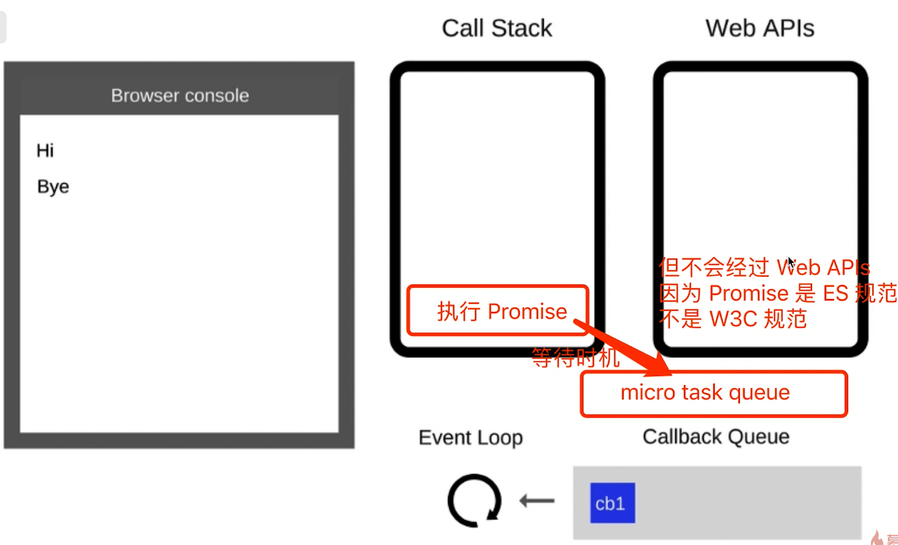
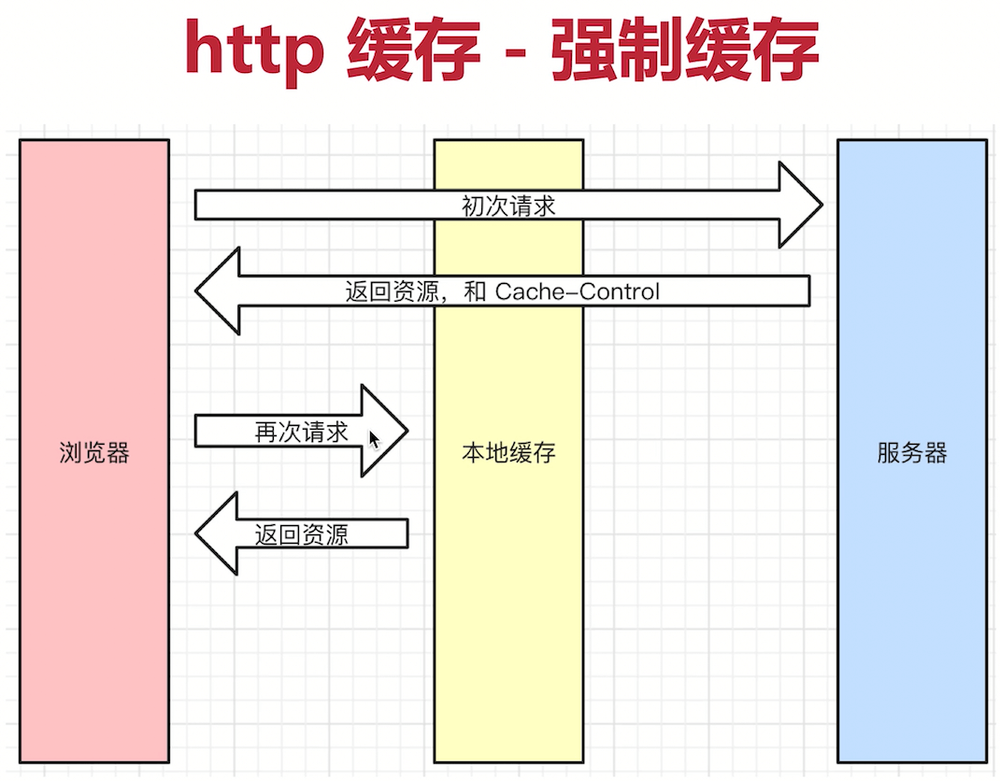
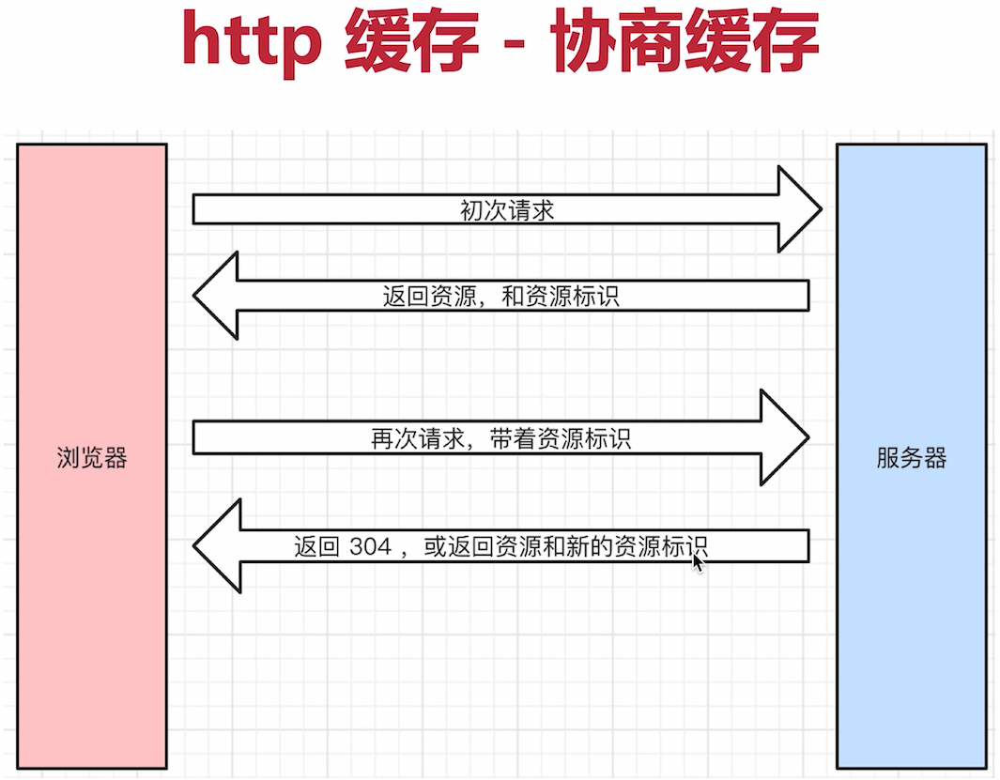
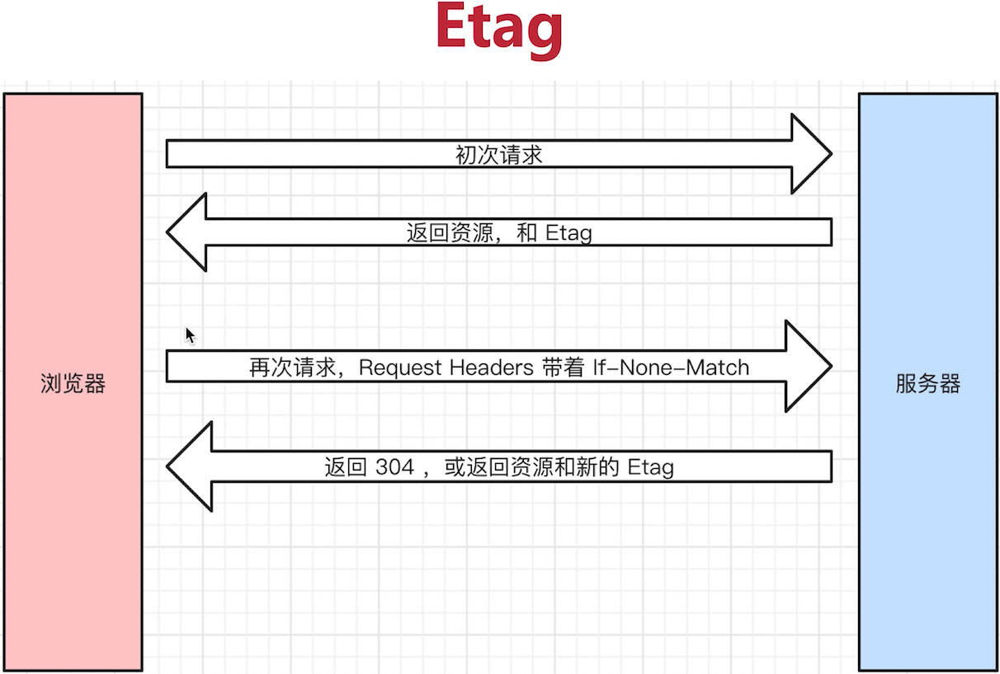
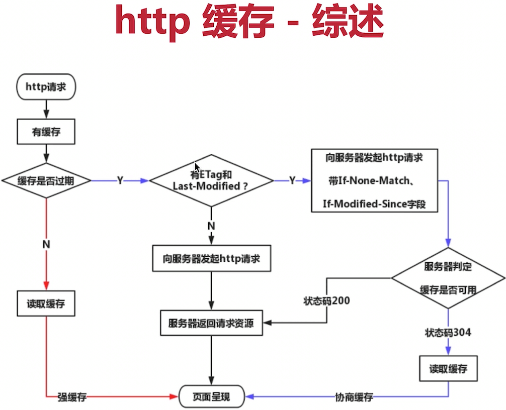
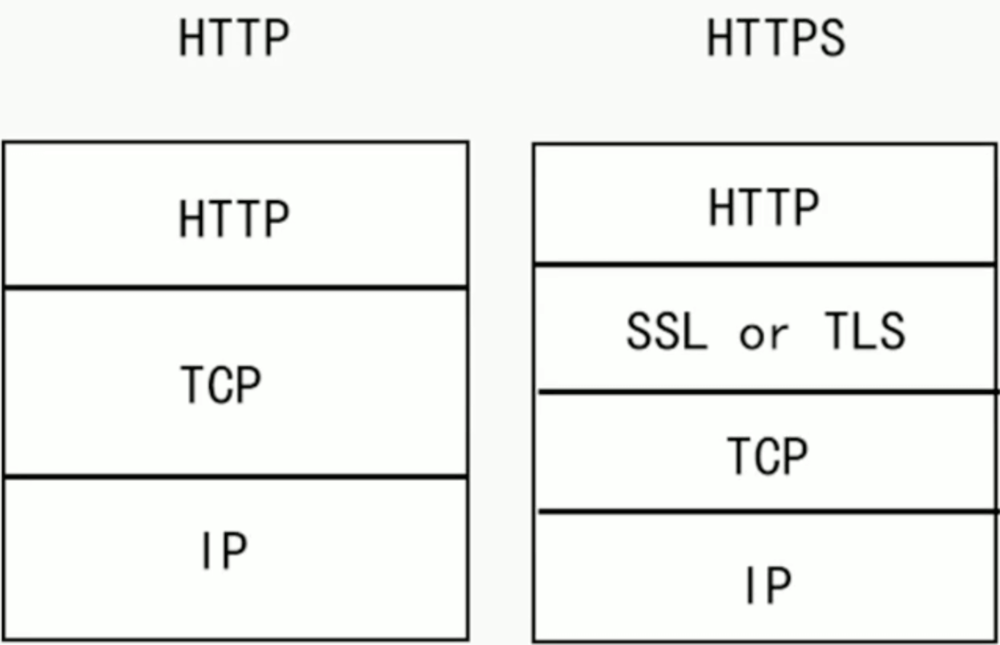
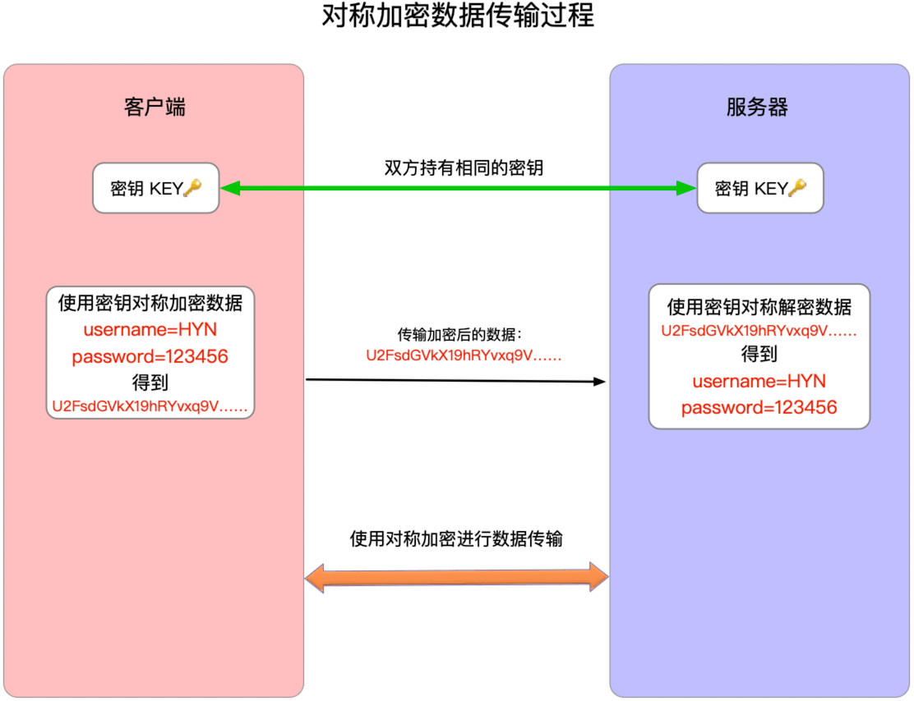
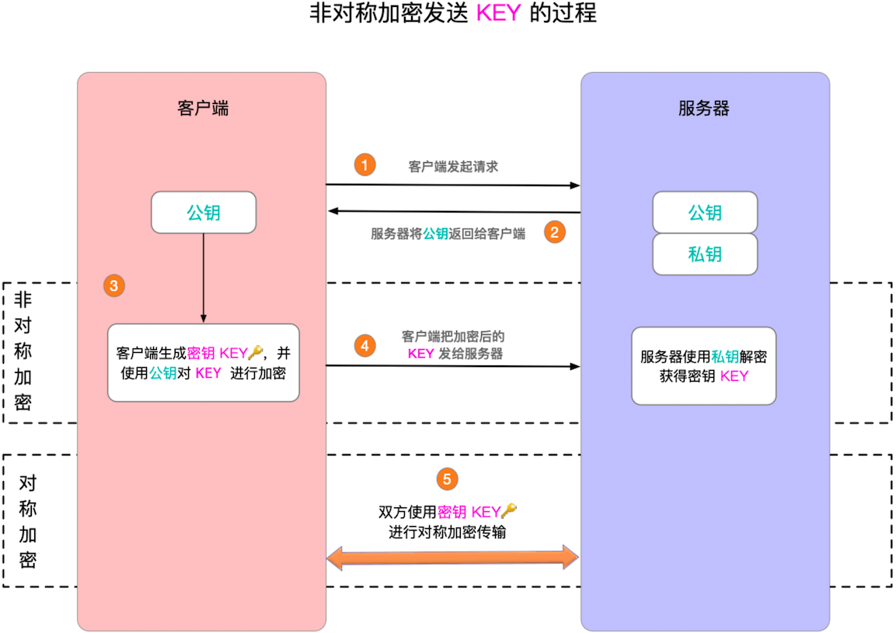

# 前端基础面试题

对于做不完的题目，要学会从题目看到**对应的知识点**，然后学习相关的知识点。

## JD 分析

1. 从 JD 中分析大致的工作内容、技术栈，**存在 JQuery 可能是要维护老项目，如果要求抗压能力可能是要加班**
2. **不要太较真工作经验**（例如要求 3 年工作经验，只有 2 年半也可以去尝试），只是一个大概的范围，如果是 5 年工作经验的（3、4 年的也都可以去尝试，1年去尝试胜任概率不是很高），**也可以根据年限和薪资来判断**，例如（3 年以上经验，只给 10K），基本上是存在虚数（1、2、3 年都可以去，不要被 3 年吓到）
3. **不要过于在意 JD**，因为 JD 大多数是 HR 写的，可能是从别处复制，**不要完全相信 JD 的要求**，如果有些技术栈短时间满足不了的，可以大胆去尝试面试
4. **薪资范围一般情况下看最小数**，例如（10K - 18K），基本上就是 10K 作为基线
5. 社招不用太过度在意学历，可以尝试去投一投

## 准备简历

要包含以下内容：

1. 个人信息：**姓名、性别、电话、邮箱、籍贯（可选）、年龄（可选，用人单位可以从教育经历评估出来）**

2. 工作经历：公司、岗位、岗位职责（可选）、入职时间、离职时间（**有空窗期如实写明即可**）

3. 教育经历：学校、专业、入学和毕业时间（**写最高学历即可**）

4. 项目经历：项目描述、技术栈、个人角色（根据工作时间长短写 2 ~ 4 个**具有说服力的项目，不要写太多项目，可以写别人的项目，前提是自己可以自圆其说**）

5. 专业技能：表现出自己的核心竞争力（**满足用人单位要求，3 ~ 5 条即可，太基础的不要写，例如会使用 vscode**）

6. 播客和开源项目（可选）：**不可临时抱佛脚**

**⚠️ 注意：**

- **界面白纸黑字即可，不要太花哨**
- **注意用词，“精通”、“熟练” 等慎用**
- **项目经历不要造假，可能会被公司拉入黑名单中**

## 面试准备

- 看 JD，判断是否需要临时准备一下
- 打印纸质简历，带着纸和笔（可选）
- 带着自己的电脑，现场可能手写代码（可选）
- **要有时间观念，不要迟到，如果要推迟需要提前说**
- 衣着适当，不用正装，也不要太随意
- 问到为何离职，**不要吐槽前东家，说自己的原因**
- 如果问到加班，基本上就说能
- **不要挑战面试官，即便他错了**
- **遇到不会的问题，也要表现出自己积极的一面**，不要直接说我不会，最好思考一两分钟，问一下面试官能不能给个引导，实在想不出来可以放弃，**但需要问一下面试官这个问题的答案，或者说自己回去再研究一下，承认是自己知识的一个盲区**

更多内容可以参考：https://www.imooc.com/article/300475

## HTML

### 如何理解语义化？

1. 让人更容易读懂代码，增加代码可读性
2. 让搜索引擎更容易读懂（SEO 优化）

例如 `<h1>` 标签中的中的内容通常是比较重要的。

### 默认情况下，哪些 HTML 标签是块状元素，哪些是内联元素？

- 块状元素：`display: block/table`，独占一行，有 `div`、`h1~h6`、`p`、`table`、`ul`、`ol` 等
- 内联元素：`display: inline/inline-block`，不会独占一行，直到浏览器的边缘自动换行，有 `span`、`img`、`input`、`button` 等

## CSS

### 盒子模型的宽度如何计算？

```html
<!-- 请问 div1 的 offsetWidth 是多大？ -->
<style>
  #div1 {
    width: 100px;
    padding: 10px;
    border: 1px solid #ccc;
    margin: 10px;
  }
</style>
```

- **`offsetWidth` = （内容宽度 + 内边距 + 边框），没有外边距，所以为 `122px`**

如果要让 `offsetWidth = 100px`，可以使用 `box-sizing: border-box`。

### `margin` 纵向重叠的问题

```html
<!-- AAA 和 BBB 之间的距离是多少？ -->
<style>
  p {
    font-size: 16px;
    line-height: 1;
    margin-top: 10px;
    margin-bottom: 15px;
  }
</style>

<p>AAA</p>
<p></p>
<p></p>
<p></p>
<p>BBB</p>
```

它们两者之间的距离为 `15px`，**垂直方向的外边距重叠，空的 `<p>` 标签也会重叠，优先使用大的外边距**。

### `margin` 负值的问题

- `margin-top` 和 `margin-left` 负值元素会向上、向左移动
- `margin-right` 负值，**元素自身不受影响，右侧元素左移**
- `margin-bottom` 负值，**元素自身不受影响，下方元素上移**

### BFC 的理解和运用

BFC 全称 Block Format Context，**块级格式化上下文**。

- **是一个独立的渲染区域，内部元素的渲染不会影响边界以外的元素**
- 区域的高度计算会包含内部浮动元素的高度，所以可以用来清除浮动

如何创建 BFC：

- **`overflow` 不为 `visible` 的块级元素**
- **`float` 不为 `none`**
- **`display` 为`flex`、`inline-block`、`grid` 的元素**
- **`position` 为 `absolute` 或 `fixed` 的元素**

### 如何实现圣杯布局和双飞翼布局

两者的实现目的：

1. **三栏布局，中间一栏最先加载和渲染（内容最重要）**
2. **两侧内容宽度固定，中间内容宽度自适应**
3. **一般用于 PC 网页**

- 圣杯布局实现

  ```html
  <style>
    body {
      min-width: 550px;
    }

    #header {
      text-align: center;
      background-color: #f1f1f1;
    }

    .container {
      /* 为容器添加内边距为左右两侧内容提前占位 */
      padding-left: 200px;
      padding-right: 150px;
    }

    .container .cloumn {
      /* 使用 float 布局 */
      float: left;
    }

    #footer {
      clear: both;
      text-align: center;
      background-color: #f1f1f1;
    }

    #center {
      background-color: #cccf;
      width: 100%;
    }

    #left {
      background-color: yellow;
      width: 200px;
      /* 向左移动整个容器宽度，与 center 容器左边边框对齐 */
      margin-left: -100%;
      /* 使用相对定位，将自身向左偏移 200px */
      position: relative;
      right: 200px;
    }

    #right {
      background-color: red;
      width: 150px;
      /* margin-right 负值，在外界看来自身没有宽度，所以就不会再换行，浮动到容器的右侧 */
      margin-right: -150px;
    }
  </style>

  <div id="header">this is header</div>
  <div class="container">
    <!-- 中间容器优先渲染 -->
    <div id="center" class="cloumn">this is center</div>
    <div id="left" class="cloumn">this is left</div>
    <div id="right" class="cloumn">this is right</div>
  </div>
  <div id="footer">this is footer</div>
  ```

- 双飞翼布局

  ```html
  <style>
    body {
      min-width: 550px;
    }
  
    .col {
      float: left;
    }
  
    #main {
      width: 100%;
      height: 200px;
      background-color: #ccc;
    }
  
    #main-wrap {
      margin: 0 190px;
    }
  
    #left {
      width: 190px;
      height: 200px;
      background-color: #0000ff;
      margin-left: -100%;
    }
  
    #right {
      width: 190px;
      height: 200px;
      background-color: #ff0000;
      margin-left: -190px;
    }
  </style>
  
  <!-- 中间容器优先渲染，比圣杯布局多嵌套了一层 -->
  <div id="main" class="col">
    <div id="main-wrap">this is main</div>
  </div>
  <div id="left" class="col">this is left</div>
  <div id="right" class="col">this is right</div>
  ```

### 手写 `clearfix`

```css
.clearfix::after {
  content: '';
  /* 对 IE6/7/8 以及老旧浏览器来说，table 的清浮动效果比 block 更可靠 */
  display: table;
  /* 元素被向下移动以清除左右浮动 */
  clear: both;
}
.clearfix {
  zoom: 1; /* 兼容 IE 低版本 */
}
```

### 使用 `flex` 画骰子

```html
<style>
  .box {
    display: flex;
    justify-content: space-between;
    width: 150px;
    height: 150px;
    border: 2px solid #000;
    padding: 15px;
    box-sizing: border-box;
  }

  .item {
    background-color: #000;
    width: 15px;
    height: 15px;
    border-radius: 50%;
  }

  .item:nth-child(2) {
    align-self: center;
  }
  .item:nth-child(3) {
    align-self: flex-end;
  }
</style>

<div class="box">
  <div class="item"></div>
  <div class="item"></div>
  <div class="item"></div>
</div>
```

### `absolute` 和 `relative` 分别依据什么定位？

- **`relative` 依据自身定位**，不会影响外界元素
- **`absolute` 依据最近一层的定位元素定位**

定位元素有 `absolute`、`relative`、`fixed`，如果这些都没找到，就会找到最外层的 `body`。

### 居中对齐有哪些实现方式？

- 水平居中
  - `inline/inline-block` 元素可以**在其父元素上使用 `text-align: center` 实现水平居中**
  - `block` 元素可以**使用 `margin: 0 auto` 在其自身上实现水平居中**
  - `absolute` 元素可以**使用 `left: 50%` + `margin-left: 自身宽度一半的负值`**
  - `absolute` 元素可以**使用 `left: 50%` + `transform: translateX(-50%)`**

- 垂直居中
  - `inline/inline-block` 元素可以**在其父元素上设置 `line-height` 的值等于 `height` 的值来实现垂直居中**
  - `absolute` 元素可以**使用 `top: 50%` + `margin-top: 自身高度一半的负值`**
  - `absolute` 元素可以**使用 `top: 50%` + `transform: translateY(-50%)`**
  - `absolute` 元素可以**使用 `top`、`left`、`bottom`、`right` 都为 `0` + `margin: 0 auto` 来实现**

### `line-height` 的继承问题

```html
<!-- p 标签的行高将会是多少？ -->
<style>
  body {
    font-size: 20px;
    line-height: 200%;
  }
  p {
    font-size: 16px;
  }
</style>

<p>AAA</p>
```

`p` 标签的行高将会是 `40px`

`line-height` 继承规则：

- 如果父元素上的 `line-height` 写了具体值，例如 `30px`，则子元素直接继承该值
- 如果父元素上的 `line-height` 写了比例，例如 `2` 或 ` 1.5`，则子元素直接继承该比例，最终值根据子元素的 `font-size` 值进行计算
- **如果父元素上的 `line-height` 写了百分比，例如 `200%`，则继承父元素的 `font-size` 和 `line-height` 百分比最终计算出来的值**

### `rem` 是什么？

`rem` 是一个长度单位，还有其它的长度单位：

- `px`，绝对长度单位，最常用
- `em`，相对长度单位，相对于父元素，不常用
- **`rem`，相对长度单位，相对于根元素，常用用于响应式布局**

### 如何实现响应式？

**rem 方案**

- 通过 JS 或者媒体查询，根据不同的屏幕宽度调整根元素的 `font-size`
- 然后使用 `rem` 单位来进行布局

`rem` 方案存在以下缺点：

1. **使用媒体查询实现存在适应阶梯性**，例如想在 375、376 宽度的屏幕下显示都有所不同，只适用于跨度大的场景
2. 如果使用 JS 实现则可以避免适应阶梯性问题，但**需要依赖 JS**

**vw/vh 方案**

- `vh` 网页视口高度的 `1 / 100`
- `vw` 网页视口宽度的 `1 / 100`
- `vmax`：取两者的最大值
- `vmin`：取两者的最小值

使用 `vw` 或者 `vh` 单位进行网页布局，**可以避免适应阶梯性，也不依赖 JS**。

**缺点：存在兼容问题，低版本浏览器不支持**。

## JavaScript

### `typeof` 能判断哪些类型

- **可以识别除了 `null` 以外的基本类型**
- **可以识别 `function` 类型**

### 何时使用 `===` 何时使用 `==`

**除了以下这种情况外，其它地方一律使用 `===`：**

```js
const obj = { x: 100 }
if (obj.a == null) {
}

// 相当于
// if(obj.a === null || obj.a === undefined) {}
```

常见的类型转换：

- 字符串拼接

  ```js
  const a = 100 + 10 // 110
  const b = 100 + '10' // '10010'
  const c= true + '10' 'true10'
  ```

- `==` 运算符

  ```js
  100 == '100' // true
  0 == '' // true
  0 == false // true
  false == '' // true
  null == undefined // true
  ```

- `if` 语句和逻辑运算

  ```js
  // 以下是 falsely 变量，除此之外都是 truly 变量
  !!0 === false
  !!NaN === false
  !!'' === false
  !!null === false
  !!undefined === false
  !!false == false
  ```

### 值类型和引用类型的区别

- 值类型

  ```js
  let a = 100
  let b = a
  a = 200
  console.log(b) // 100
  ```

  **值类型的值通常存在栈中**。

- 引用类型

  ```js
  let a = { age: 20 }
  let b = a
  b.age = 21
  console.log(a.age) // 21
  ```

  **引用类型的对象存在堆中，变量本身在栈中保存对堆对象的引用**。

之所以这样设计，是因为值类型的占用通常都比较小，而引用类型占用可能会很大，直接将对象赋值给变量速度可能会很慢，所以引用类型是在变量中存储的是对堆对象的引用而非对象本身。

**常见的值类型：`number`、`string`、`boolean`、`symbol`、`null`、`undefined`、`bigint`**

**常见的引用类型：`object`、`array`、`function`**

### 手写深拷贝

```js
function deepClone(obj = {}, map = new WeakMap()) {
  // 判断传入的值是否是对象类型，如果不是则直接返回
  if (typeof obj !== 'object' || obj === null) return obj

  // 避免循环引用
  if (map.has(obj)) return map.get(obj)

  // 判断传入的值是否是数组并初始化结果
  let result = Array.isArray(obj) ? [] : {}
  map.set(obj, result)

  for (let key in obj) {
    // 排除原型对象上的key
    if (obj.hasOwnProperty(key)) {
      result[key] = deepClone(obj[key], map)
    }
  }

  return result
}
```

### 如何准确判断一个变量是不是数组

有以下三种方式可以判断：

```js
a instanceof Array
Array.prototype.isPrototypeOf(a)({}).toString.call(a) === '[object Array]'
```

### 手写一个简易的 jQuery，考虑插件和扩展性

```js
class jQuery {
  constructor(selector) {
    // 根据传入的选择器获取 DOM
    const result = document.querySelectorAll(selector)

    // 将 DOM 存储在实例上
    const length = result.length
    for (let i = 0; i < length; i++) {
      this[i] = result[i]
    }
    // 并记录长度（类数组）
    this.length = length
    // 记录选择器
    this.selector = selector
  }

  /** 获取指定下标的 DOM 元素
   * @param {number} index 下标
   */
  get(index) {
    return this[index]
  }
  /** 变量 DOM 元素
   * @param {function} callback 回调函数
   */
  each(callback) {
    for (let i = 0; i < this.length; i++) {
      const elem = this[i]
      // 在回调中返回对应的元素
      callback(elem)
    }
  }
  /** 监听方法
   * @param {string} type 方法类型
   * @param {function} callback 回调函数
   */
  on(type, callback) {
    // 遍历元素，为每个元素绑定方法
    return this.each((elem) => {
      elem.addEventListener(type, callback, false)
    })
  }
}

// 插件形式扩展
jQuery.prototype.dialog = function (info) {
  alert(info)
}

// 增强
class MyJQuery extends jQuery {
  constructor(selector) {
    super(selector)
  }
  // 扩展自己的方法
  addClass(className) {
    // ...
  }
}
```

### `class` 的原型本质，怎么理解

- 描述或者绘制原型链
- 属性和方法的执行规则

### `this` 的不同应用场景，如何取值？

- 当做普通函数被调用，`this` 就是 `window`，严格模式下是 `undefined`
- 通过 `call`、`apply`、`bind` 传入的对象作为 `this`
- 作为对象方法调用 `this` 就是对象本身
- 在 `class` 的方法中调用 `this` 是当前实例对象本身
- 箭头函数的 `this` 会找它上级作用域的 `this` 值

### 手写 `bind` 函数

```js
Function.prototype.bind1 = function () {
  // 将参数拆解为数组
  const args = Array.prototype.slice.call(arguments)

  // 获取 this（数组第一项）
  const t = args.shift()

  // 保存 fn1.bind(...) 中的 fn1
  const self = this

  // 返回一个函数
  return function () {
    return self.apply(t, args)
  }
}

function fn1(a, b, c) {
  console.log('this', this)
  console.log(a, b, c)
  return `this is fn1`
}

const fn2 = fn1.bind1({ x: 100 }, 10, 20, 30)
const res = fn2()
console.log(res)
```

### 实际开发中闭包的应用场景，举例说明

**闭包：就是函数可以访问它定义时作用域里的变量，即使这个函数在外部执行**。

可以使用闭包隐藏数据，只提供 API。

```js
function createCache() {
  const data = {} // 闭包中的数据，被隐藏，不被外界访问
  return {
    set: function (key, value) {
      data[key] = value
    },
    get: function (key) {
      return data[key]
    },
  }
}
```

### 【场景题】创建 10 个 `<a>` 标签，点击的时为什么弹出来的都是 10？

```js
let i, a
for (let i = 0; i < 10; i++) {
  a = document.createElement('a')
  a.innerHTML = i + '<br>'
  a.addEventListener('click', function (event) {
    event.preventDefault()
    alert(i)
  })
  document.body.appendChild(a)
}
```

### 同步和异步的区别是什么？

**异步：执行一段时间后才自行完成的行为**。

因为 JS 是单线程语言，异步不会阻塞代码执行执行，同步会阻塞代码执行。

- **JS 是一门单线程语言**，只能同时做一件事情
- 浏览器和 node.js 已支持 JS 启动进程，如 Web Worker
- **JS 和 DOM 渲染共用同一个进程，因为 JS 可以修改 DOM 结构**
- **JS 执行的时候，得留一些时机供 DOM 渲染**
- **如果只有同步的话，遇到等待（网络请求、定时任务）就会导致进程等待，近而页面卡住**
- 异步就是来解决单线程等待的问题
- 异步是基于 `callback` 函数形式来调用的
- 异步不会阻塞代码执行
- 同步会阻塞代码执行

### 手写用 Promise 加载一张图片

```js
function loadImg(src) {
  return new Promise((resolve, reject) => {
    const img = document.createElement('img')
    img.onload = () => {
      resolve(img)
    }
    img.onerror = () => {
      const error = new Error(`图片加载失败 ${src}`)
      reject(error)
    }
    img.src = src
  })
}
```

### 手写 Promise

```js
class MyPromise {
  state = 'pending' // 状态，'pending' 'fulfilled' 'rejected'
  value = undefined // 成功后的值
  reason = undefined // 失败后的原因

  resolveCallbacks = [] // 当 pending 状态下存储成功的回调
  rejectCallbacks = [] // 当 pending 状态下存储失败的回调

  constructor(fn) {
    const resolveHandler = (value) => {
      if (this.state === 'pending') {
        this.state = 'fulfilled'
        this.value = value
        this.resolveCallbacks.forEach((fn) => fn(this.value))
      }
    }

    const rejectHandler = (reason) => {
      if (this.state === 'pending') {
        this.state = 'rejected'
        this.reason = reason
        this.rejectCallbacks.forEach((fn) => fn(this.reason))
      }
    }

    try {
      fn(resolveHandler, rejectHandler)
    } catch (error) {
      rejectHandler(error)
    }
  }

  then(onFulfilled, onRejected) {
    onFulfilled =
      typeof onFulfilled === 'function' ? onFulfilled : (value) => value
    onRejected =
      typeof onRejected === 'function' ? onRejected : (reason) => reason

    // 当 pending 状态下，onFulfilled 和 onRejected 会被存储到 callbacks 中
    if (this.state === 'pending') {
      return new MyPromise((resolve, reject) => {
        this.resolveCallbacks.push((value) => {
          setTimeout(() => {
            try {
              const newValue = onFulfilled(value)
              resolve(newValue)
            } catch (error) {
              reject(error)
            }
          })
        })
        this.rejectCallbacks.push((reason) => {
          setTimeout(() => {
            try {
              const newReason = onRejected(reason)
              reject(newReason)
            } catch (error) {
              reject(error)
            }
          })
        })
      })
    }

    if (this.state === 'fulfilled') {
      return new MyPromise((resolve, reject) => {
        setTimeout(() => {
          try {
            const newValue = onFulfilled(this.value)
            resolve(newValue)
          } catch (error) {
            reject(error)
          }
        })
      })
    }

    if (this.state === 'rejected') {
      return new MyPromise((resolve, reject) => {
        setTimeout(() => {
          try {
            const newReason = onRejected(this.reason)
            reject(newReason)
          } catch (error) {
            reject(error)
          }
        })
      })
    }
  }

  // then 的一个语法糖，简单模式
  catch(onRejected) {
    return this.then(null, onRejected)
  }
}

MyPromise.resolve = function (value) {
  return new MyPromise((resolve) => resolve(value))
}

MyPromise.reject = function (reason) {
  return new MyPromise((resolve, reject) => reject(reason))
}

MyPromise.all = function (promiseList = []) {
  return new MyPromise((resolve, reject) => {
    const result = [] // 存储 promiseList 所有的结果
    const length = promiseList.length
    let resolvedCount = 0

    promiseList.forEach((promise) => {
      promise.then(
        (value) => {
          result.push(value)
          resolvedCount++
          length === resolvedCount && resolve(result)
        },
        (reason) => {
          reject(reason)
        },
      )
    })
  })
}

MyPromise.race = function (promiseList = []) {
  let resolved = false // 标记是否有已经完成的 promise

  return new MyPromise((resolve, reject) => {
    promiseList.forEach((promise) => {
      promise.then(
        (value) => {
          if (!resolved) {
            resolve(value)
            resolved = true
          }
        },
        (reason) => {
          reject(reason)
        },
      )
    })
  })
}
```

### 前端使用异步的场景有哪些？

- 网络请求
- 图片加载
- 定时任务，如 `setTimeout`

### 【场景题】以下代码是以什么顺序打印的？

```js
console.log(1)
setTimeout(function () {
  console.log(2)
}, 1000)
console.log(3)
setTimeout(function () {
  console.log(4)
}, 0)
console.log(5)
```

答案：1、3、5、4、2

### 描述 event loop 的机制，可画图


1. **执行同步代码，一行一行放在 Call Stack 执行**
2. **遇到异步代码，会先记录下，等待时机（定时、网络请求等）**
3. **时机到了，就移动到 Callback Queue 中**
4. **如果此时 Call Stack 为空（即同步代码执行完）尝试 DOM 渲染（如果有修改 DOM）**
5. **DOM 渲染完成后 Event Loop 开始工作**
6. **轮询查找 Callback Queue，如过有移动到 Call Stack 中执行**
7. **然后继续轮询查找**

**event loop 机制**

- JS 是单线程运行
- 异步要基于回调来实现
- event loop 就是异步回调的实现原理

**JS 是如何执行的**

- 从前到后，一行一行执行
- 如果某一行执行报错，则停止后面代码的执行
- 先把同步代码执行完，再执行异步

**DOM 事件和 event loop**

```js
console.log('Hi')

setTimeout(function cb1() {
  console.log('cb1')
}, 5000)

console.log('Bye')
```

```html
<button id="btn1">提交</button>

<script>
  console.log('Hi')

  $('#btn1').click(function () {
    console.log('button clicked')
  })

  console.log('Bye')
</script>
```

**DOM 事件回调与异步回调过程类似**

- **异步（`setTimeout`、`ajax` 等）使用回调，基于 event loop**

- **DOM 事件也使用回调，基于 event loop**

**⚠️ 注意：DOM 事件虽然是基于 event loop 实现，但不是异步。**

### 什么是宏任务和微任务，两者有什么区别？

- **宏任务：`setTimeout`、`setInterval`、`ajax`、`DOM` 事件**
- **微任务：`Promise`、`async/await`**
- **微任务执行时机比宏任务早**
  - 宏任务在 **DOM 渲染后**触发，如 `setTimeout`
  - 微任务在 **DOM 渲染前**触发，如 `Promise`

渲染过程：同步代码执行 -> 清空所有微任务 -> 渲染 DOM（如果修改了 DOM 的话） -> 执行一个宏任务



### Promise 有哪三种状态？如何变化？

- `pending`、`fulfilled`、`rejected`
- `pending -> fulfilled` 或 `pending -> rejected`
- 变化不可逆

### 【场景题】promise then 和 catch 的连接

1. 第一题

   ```js
   Promise.resolve()
     .then(() => {
       console.log(1)
     })
     .catch(() => {
       console.log(2)
     })
     .then(() => {
       console.log(3)
     })
   ```

2. 第二题

   ```js
   Promise.resolve()
     .then(() => {
       console.log(1)
       throw new Error('error1')
     })
     .catch(() => {
       console.log(2)
     })
     .then(() => {
       console.log(3)
     })
   ```

3. 第三题

   ```js
   Promise.resolve()
     .then(() => {
       console.log(1)
       throw new Error('error1')
     })
     .catch(() => {
       console.log(2)
     })
     .catch(() => {
       console.log(3)
     })
   ```

- **`then` 正常返回 `fulfilled`，如果里面报错则返回 `rejected`**
- **`catch` 正常返回 `fulfilled`，如果里面报错则返回 `rejected`**

### 【场景题】async/await 语法

1. 第一题

   ```js
   async function fn() {
     return 100
   }
   ;(async function () {
     const a = fn() // a 的值是什么？
     const b = await fn() // b 的值是什么？
   })()
   ```

2. 第二题

   ```js
   ;(async function () {
     console.log('start')
     const a = await 100
     console.log('a', a)
     const b = await Promise.resolve(200)
     console.log('b', b)
     const c = await Promise.reject(300)
     console.log('c', c)
     console.log('end')
   })() // 执行完毕，打印出哪些内容？
   ```

- **`for...of` 可以使用 `await` 异步执行，其它的循环不行**
- **`async/await` 是个语法糖，解决了异步回调，可以用同步的写法执行异步的代码**

### 【场景题】promise 和 setTimeout 的顺序

```js
console.log(100)
setTimeout(() => {
  console.log(200)
})
Promise.resolve().then(() => {
  console.log(300)
})
console.log(400)
```

### 【场景题】外加 async/await 的顺序问题

```js
async function async1() {
  console.log('async1 start')
  await async2()
  console.log('async1 end')
}
async function async2() {
  console.log('async2')
}
console.log('script start')
setTimeout(function () {
  console.log('setTimeout')
})
async1()
new Promise(function (resolve) {
  console.log('promise1')
  resolve()
}).then(function () {
  console.log('promise2')
})

console.log('script end')
```

### DOM 是哪种数据结构

**DOM 是树结构**。

DOM 结构本质是从 `html` 文件中解析出来的一棵树。

### DOM 操作的常用 API

主要有以下三类：

- DOM 节点操作

  ```js
  // getElementsBy* → HTMLCollection（动态）
  document.getElementById('id')
  document.getElementsByClassName('class')
  document.getElementsByTagName('div')

  // querySelectorAll → NodeList（静态）
  document.querySelector('.box')
  document.querySelectorAll('.item')

  node.parentNode
  node.parentElement

  node.childNodes // 包含文本、注释
  node.children // 只包含元素节点

  node.firstChild
  node.firstElementChild

  node.lastChild
  node.lastElementChild

  node.previousSibling
  node.previousElementSibling

  node.nextSibling
  node.nextElementSibling

  // 节点信息判断
  node.nodeType // 1: 元素节点, 3: 文本节点
  node.nodeName // DIV / #text
  node.nodeValue // 文本内容（文本节点）
  ```

- DOM 结构操作

  ```js
  document.createElement('div')
  document.createTextNode('hello')
  document.createDocumentFragment() // 创建文档片段

  // 插入节点
  parent.appendChild(child)
  parent.insertBefore(newNode, referenceNode)

  parent.append(node)
  parent.prepend(node)

  node.before(newNode)
  node.after(newNode)

  // 删除节点
  parent.removeChild(child)
  node.remove()

  // 替换 / 克隆
  parent.replaceChild(newNode, oldNode)
  node.cloneNode() // false：浅拷贝
  node.cloneNode(true) // true：深拷贝

  // HTML / 文本内容操作（很常用）
  element.innerHTML
  element.outerHTML

  element.textContent
  element.innerText
  ```

- `attribute` 和 `property` 操作

  ```js
  // Attribute 操作
  element.getAttribute('id')
  element.setAttribute('title', 'hello')
  element.removeAttribute('disabled')
  element.hasAttribute('class')
  
  // Property 操作
  element.id
  element.className
  element.classList
  element.value
  element.checked
  element.disabled
  
  // class 操作
  element.classList.add('active')
  element.classList.remove('active')
  element.classList.toggle('active')
  element.classList.contains('active')
  
  // 自定义属性
  element.dataset.id // '123'
  element.dataset.userId
  ```

### attribute 和 property 的区别

- `attribute` 是写在 HTML 中的内容，大小写不敏感
- `property` 是写在 DOM 中的内容，大小写敏感

**当一个标准的 `attribute` 被改变，对应的 `property` 也会自动更新，（除了几个特例，如 `input.value`）反之亦然**。

在大多数情况下，最好使用 DOM 属性，只有当 DOM 属性无法满足开发需求，才使用 `attribute`。

### 一次性插入多个 DOM 节点，考虑性能

```js
const listNode = document.getElementsById('list')

// 创建一个文档片段，此时还没有插入到 DOM 树中
const frag = document.createDocumentFragment()

// 执行插入
for (let x = 0; x < 10; x++) {
  const li = document.createElement('li')
  li.innerHTML = 'List item ' + x
  frag.appendChild(li)
}

// 都完成之后，再插入到 DOM 树中
listNode.appendChild(frag)
```

- **DOM 操作非常 “昂贵”，避免频繁的 DOM 操作**

- **对 DOM 查询做缓存**

  ```js
  // 不缓存 DOM 查询结果
  for (let i = 0; i < document.getElementsByTagName('p').length; i++) {
    // 每次循环，都会计算 length，频繁进行 DOM 查询
  }

  // 缓存 DOM 查询结果
  const pList = document.getElementsByTagName('p')
  const length = pList.length
  for (let i = 0; i < i.length; i++) {
    // 缓存 length，只进行一次 DOM 查询
  }
  ```

- **将频繁操作改为一次性操作**

  ```js
  const listNode = document.getElementsById('list')
  
  // 创建一个文档片段，此时还没有插入到 DOM 树中
  const frag = document.createDocumentFragment()
  
  // 执行插入
  for (let x = 0; x < 10; x++) {
    const li = document.createElement('li')
    li.innerHTML = 'List item ' + x
    frag.appendChild(li)
  }
  
  // 都完成之后，再插入到 DOM 树中
  listNode.appendChild(frag)
  ```

### 如何识别浏览器的类型

```js
const ua = navigator.userAgent
```

### 分析拆解 URL 各个部分

```js
console.log(location.href) // 输出当前页面的完整 URL（包含协议、域名、路径、参数和 hash）
console.log(location.protocol) // 输出当前 URL 使用的协议，如 "http:" 或 "https:"
console.log(location.pathname) // 输出 URL 中的路径部分，如 "/pages/index.html"
console.log(location.search) // 输出 URL 中的查询字符串（? 后面的参数），如 "?id=1&name=abc"
console.log(location.hash) // 输出 URL 中的哈希值（# 后面的部分），如 "#section1"
```

### 编写一个通用的事件监听函数

```js
function bindEvent(elem, type, selector, fn) {
  // 判断是否只传递了三个参数
  if (fn == null) {
    // 交换 selector 和 fn 的位置
    fn = selector
    selector = null
  }

  elem.addEventListener(type, (event) => {
    const target = event.target
    // 判断是否是代理绑定情况
    if (selector) {
      // 代理绑定
      // 判断 DOM 元素是否符合对应的 CSS 选择器
      if (target.matches(selector)) {
        fn.call(target, event)
      }
    } else {
      // 普通绑定
      fn.call(target, event)
    }
  })
}

// 下面是使用的示例
// 普通绑定
const btn1 = document.getElementById('btn1')
bindEvent(btn1, 'click', function (event) {
  event.preventDefault()
  alert(this.innerHTML)
})

// 代理绑定
const div3 = document.getElementById('div3')
bindEvent(div3, 'click', 'a', function (event) {
  event.preventDefault()
  alert(this.innerHTML)
})
```

### 描述事件冒泡的流程

- 事件冒泡基于 DOM 树形结构
- 事件会顺着触发元素往上冒泡
- 应用场景：代理

### 无限下拉的图片列表，如何监听每个图片的点击？

- 使用事件代理
- 用 `event.target` 获取触发元素
- 判断是否是触发元素来触发点击回调

事件代理：

- 代码简洁
- 减少浏览器内存占用
- 不要滥用，可能会增加事件的复杂度

### 手写一个简易的 ajax

```js
function ajax(url) {
  return new Promise((resolve, reject) => {
    const xhr = new XMLHttpRequest()
    xhr.open('GET', url)
    xhr.onreadystatechange = function () {
      if (xhr.readyState === 4) {
        if (xhr.status === 200) {
          resolve(JSON.parse(xhr.responseText))
        } else if (xhr.status === 404) {
          reject(new Error('404 Not Found'))
        }
      }
    }
    xhr.send(null)
  })
}
```

- `GET` 请求

  ```js
  // GET 请求
  // 1.创建一个 xhr 对象
  const xhr = new XMLHttpRequest()
  // 2.初始化它
  xhr.open('GET', '/test.json')
  // 3.监听 xhr 状态变化
  xhr.onreadystatechange = function () {
    // 判断是否请求完成
    if (xhr.readyState === 4) {
      // 判断请求状态码是否为 200
      if (xhr.status === 200) {
        alert(xhr.responseText)
      }
    }
  }
  // 4.发送请求
  xhr.send(null)
  ```

- `POST` 请求

  ```js
  // POST 请求
  // 1.创建一个 xhr 对象
  const xhr = new XMLHttpRequest()
  // 2.初始化它
  xhr.open('POST', '/login')
  // 3.监听 xhr 状态变化
  xhr.onreadystatechange = function () {
    // 判断是否请求完成
    if (xhr.readyState === 4) {
      // 判断请求状态码是否为 200
      if (xhr.status === 200) {
        alert(xhr.responseText)
      }
    }
  }
  // 请求体参数
  const postData = {
    username: 'zhangsan',
    password: 'xxx',
  }
  // 4.发送请求
  xhr.send(JSON.stringify(postData))
  ```

### 跨域的常用实现方式

- JSONP
- CORS（需要服务端去处理，在响应头上增加）

**⚠️ 注意：加载图片、CSS、JS 可无视同源策略**。

```html

<link href="跨域的 CSS 地址" />
<script src="跨域的 JS 地址"></script>
```

- `` 可用于统计打点，可使用第三方统计服务
- `<link />`、`<script />` 可使用 CDN，CDN 一般都是外域
- `<script>` 可实现 JSONP

**所有的跨域都必须经过 server 端的允许和配合**。

未经 server 端允许就实现跨域，说明浏览器有漏洞。

JSONP 基本实现原理

- **`<script>` 可以绕过跨域限制**

- **服务器可以任意动态拼接数据返回**

- **所以 `<script>` 就可以获得跨域的数据，只要服务端愿意返回**

  ```html
  <script>
    window.callback = function (data) {
      // 打印跨域得到的信息
      console.log(data)
    }
  </script>
  <!-- 将返回 callback({ name: 'zhangsan'}) -->
  <script src="http://127.0.0.1:5500/jsonp.js"></script>
  ```

  以上代码只是 JSONP 的简单实现，**请求的地址后可以携带任意参数，服务端可以读取参数来动态拼接响应内容以及 `callback` 函数名**。

  ```js
  // jQuery 实现 JSONP
  $.ajax({
    url: 'http://localhost:8882/x-origin.json',
    dataType: 'jsonp',
    jsonpCallback: 'callback',
    success: function (data) {
      console.log(data)
    },
  })
  ```

### 描述 cookie、localStorage、sessionStorage 的区别

- **容量区别：cookie 只有 4KB 的容量，`localStorage` 和 `sessionStorage` 有 5MB 的容量**
- **cookie 使用 `document.cookie`，`localStorage` 和 `sessionStorage` 则使用 `getItem` 和 `setItem`**
- **浏览器会自动添加 cookie 到每个对相同域的请求的请求头中**

- **cookie**
  - 本身用于浏览器和 server 通讯
  - 早期被 “借用” 到本地存储来，**因为 HTML5 规范出现以前，只有 cookie 这一种本地存储的方式**
  - 可以使用 `document.cookie = '...'` 来修改
  - **存储大小，最大为 4KB**
  - **每次 http 请求时会自动放入请求头中并发送到服务端，会增加请求数据量**
- **localStorage 和 sessionStorage**
  - **最大可以存储 5MB**
  - API 相比 cookie 更简单易用
  - **不会随着 http 请求被发送出去**
  - 两者的区别：
    - **`localStorage` 数据会永久存储，除非代码或者手动删除**
    - **`sessionStorage` 数据只存在于当前会话，浏览器或者标签页关闭则清空**

### http 常见的状态码有哪些？

- 状态码分类
  - **`1xx` 服务器收到请求**
  - **`2xx` 请求成功，如 `200`**
  - **`3xx` 重定向，如 `302`**
  - **`4xx` 客户端错误，如 `404`**
  - **`5xx` 服务端错误，如 `500`**
- 常见状态码
  - **`200` 请求成功**
  - **`301` 永久重定向（配合响应头中的 `location`，浏览器自动处理）**
  - **`302` 临时重定向（配合响应头中的 `location`，浏览器自动处理）**
  - **`304` 资源未被修改**
  - **`404` 资源未找到**
  - **`403` 没有权限**
  - **`500` 服务器错误**
  - **`504` 网关超时**

以上状态码是协议和规范

- 就是一个约定
- 要求大家都跟着执行
- 不要违法规范，例如 IE 浏览器 违法约定被淘汰

### http 常见的 header 有哪些？

- 常见的 Request Headers
  - **`Accept` 浏览器可接收的数据格式**
  - **`Accept-Encoding` 浏览器可接收的压缩算法，如 `gzip`**
  - **`Accept-Languange` 浏览器可接收的语言，如 `zh-CN`**
  - **`Connection: keep-alive` 一次 TCP 连接重复使用**
  - **`Cookie`**
  - **`Host` 请求的域名**
  - **`User-Agent` 浏览器信息**
  - **`Content-type` 发送数据的格式**，如 `application/json`
- 常见的 Response Headers
  - **`Content-type` 返回数据的格式**，如 `application/json`
  - **`Content-length` 返回数据的大小**，多少字节
  - **`Content-Encoding` 返回数据的压缩算法**，如 `gzip`
  - **`Set-Cookie` 服务端向客户端设置 Cookie**
- 缓存相关的 Headers

### 什么是 Restful API

- 传统的 `methods`（http 刚开始的时候）
  - **`GET` 获取服务器的数据**
  - **`POST` 向服务器提交数据**
  - 简单的网页功能，就这两个操作
- 现代的 `methods`
  - **`GET` 获取服务器的数据**
  - **`POST` 向服务器新增数据**
  - **`PATCH/PUT` 向服务器修改（更新）数据**
  - **`DELETE` 向服务器删除数据**

- Restful API 是一种新的 API 设计方法（早已推广使用）
  - **传统的 API 设计：把每个 URL 当做一个功能**
    - 使用 URL 参数，例如：`/api/list?pageIndex=2`
    - 例如：
      - 创建一个博客，`POST` 请求，`/api/create-blog`
      - 更新一个博客，`POST` 请求，`/api/update-blog?id=100`
      - 获取一个博客，`GET` 请求，`/api/get-blog?id=100`
  - **Restful API 设计：把每个 URL 当做一个唯一的资源（标识）**
    - **不使用 URL 参数**，例如：`/api/list/2`
    - **使用 method 表示操作类型**，例如：
      - 创建一个博客，`POST` 请求，`/api/blog`
      - 更新一个博客，`PATCH` 请求，`/api/blog/100`
      - 获取一个博客，`GET` 请求，`/api/blog/100`

### 描述一下 http 的缓存机制（重要）

**缓存：把一些没有必要重新获取一遍的东西不再重新获取**。

**缓存的作用：减少网络请求，让页面加载速度更快**。

**哪些资源可以被缓存：静态资源，如：js、css、img 文件**。

- 强制缓存

  

  **如果服务端觉得这个资源可以被缓存，会在响应头中添加 `Cache-Control`**。

  **`Cache-Control` 可以控制强制缓存的逻辑**，例如： `Cache-Control: max-age=31536000`（单位是秒）

  **再次请求会先在本地缓存中寻找资源，如果没有再向服务器获取**。

  `Cache-Control` 的值：
  - `max-age`：指定资源在 `max-age` 时间内为**强制缓存**，浏览器直接使用本地缓存，不会向服务器发送请求
  - `no-cache`：资源可以被缓存，**但每次使用前必须向服务器进行缓存校验（协商缓存），由服务器决定是否使用缓存**
  - `no-store`：**禁止任何缓存，浏览器和中间代理都不能存储该资源，每次都必须向服务器重新请求**

**⚠️ 注意：`Expires` 同为控制缓存过期，已被 `Cache-Control` 代替**。

**协商缓存（对比缓存）：**

- **是服务器端缓存策略（指服务端判断资源能否用缓存的内容，资源本身还是缓存在浏览器本地的）**
- 服务器判断客户端的资源，是否和服务端资源一样
- **如果一致则返回 304，否则返回 200 和最新的资源**



**资源标识：在 Response Headers 中，有两种：**

- **`Last-Modififed` 资源的最后修改时间**

  

  图中的 `If-Modified-Since` 的值就是初次请求时获得的 `Last-Modified`，服务器通过它来判断 `Last-Modified` 是否一致。

- **`Etag` 资源的唯一标识（一个字符串，类似于人类的指纹），根据内容来生成的，内容不变，`Etag` 就始终保持不变**

  

**⚠️ 注意：**

- **`Last-Modified` 和 `Etag` 两个共存的话，会优先使用 `Etag`**
- **`Last-Modified` 只能精确到秒级**
- **如果资源被重复生成，而内容不变，则 `Etag` 会更精准**



**三种刷新操作对缓存的影响**

- 正常操作：地址栏输入 URL，跳转链接，浏览器的前进后退按钮等
  - **使用强制缓存，使用协商缓存**
- 手动刷新：F5，点击刷新按钮，右键菜单刷新
  - **不使用强制缓存，使用协商缓存**
- 强制刷新：Ctrl + F5，或者 MAC 上的 Shift + Command + R
  - **不使用强制缓存，不使用协商缓存**

**https**

http 和 https 的区别：

- **http 是明文传输，敏感信息容易被中间劫持**

- **https = http + 加密（SSL / TLS），在 http 的基础上进行了加密，就算被劫持了也无法解密**

  

**⚠️ 注意：现代浏览器已开始强制使用 https 协议。**

**加密方式**

- **对称加密：服务端和客户端使用同一个 key 来对数据传输进行加密和解密**
  - 缺点：双方要使用相同的密钥，那就必然要在传输数据之前先由一方把密钥传给另一方，那么在此过程中密钥就很有可能被截获

  

- **非对称加密：使用一对 key，A 加密之后，只能用 B 来解密，反之同理**
  - 计算量比较大，加密和解密速度相比对称加密慢很多

  

**⚠️ 注意：https 同时用到了以上两种加密方式，具体过程如下：**

1. 客户端先使用非对称加密从服务端获取公钥，客户端在生成一个 **key** 传给服务端（通过公钥加密）
2. 之后的请求都通过对称加密的方式，因为非对称加密影响性能

**https 证书**

- **在技术上存在中间人攻击的问题**

- **需要使用第三方证书（慎用免费、不合规的证书）**

- **浏览器校验证书**

  


## 运行环境


### 输入 URL 到渲染出页面的整个过程

1. **DNS 解析：域名解析出对应的 IP 地址**
2. **浏览器根据 IP 地址向服务器发起网络请求**
3. **服务器处理网络请求，并返回结果给浏览器**
4. **浏览器根据 HTML 代码生成 DOM 树**
5. **浏览器根据 CSS 代码生成 CSSOM**
6. **浏览器将 DOM 树和 CSSOM 整合为一个 Render 树**
7. **浏览器根据 Render 树渲染页面**
8. **如果遇到 `<script>` 则暂停渲染，优先加载并执行 JS 代码，完成后再继续渲染**
9. **直至把 Render 树渲染完成**


### 为什么建议把 CSS 放在 head 标签中？

1. **保证 CSSOM 尽早生成**，当 CSS 在 `<head>` 中时，**浏览器会一边解析 HTML，一边并行下载并解析 CSS 来构建 DOM 数（不会阻塞 DOM 树构建）**
2. **避免无样式内容闪烁**，如果 CSS 放在 `<body>` 中时，会导致 DOM 已经生成，**Render Tree 先按默认样式生成**，发现 CSS 然后构建 CSSOM，会导致重新计算 Render 树

CSS 放在 head 中是为了让 CSSOM 尽早构建，避免页面多次生成 Render Tree，减少回流与重绘，提升首屏渲染体验。

**⚠️ 注意：JS 文件之所以放在底部，是因为 JS 会阻塞 DOM 解析**


### window.onload 和 DOMContentLoaded 的区别

- **`window.onload` 会在页面的全部资源加载完之后才会执行，包括图片、视频等**
- **`DOMContentLoaded` 会在 DOM 树构建完之后执行，此时图片、视频可能没有加载完**


## 性能优化

原则（空间换时间）：

- **多使用内存、缓存或其它方法**
- **减少 CPU 计算量，减少网络加载耗时**


### 让页面加载更快

- 减少资源体积，压缩代码
- 减少访问次数，合并代码、SSR 服务端渲染、缓存（打包的静态资源加 hash 后缀，根据文件内容计算 hash）
- 使用跟快的网络，CDN


### 让页面渲染更快

- CSS 引入放在 `<head>` 标签中，JS 放在 `<body>` 最下面
- 尽早开始执行 JS，用 `DOMContentLoaded` 触发
- 图片懒加载（图片懒加载，上滑加载更多）
- 对 DOM 查询进行缓存
- 对于频繁 DOM 操作，合并到一起插入 DOM 结构
- 节流 throttle、防抖 debounce


### 手写 debounce

```js
function debounce(func, delay = 300, immediate = false) {
  let timer = null

  return function (...args) {
    if (timer) clearTimeout(timer)

    if (immediate && !timer) {
      func.apply(this, args)
    }

    timer = setTimeout(() => {
      if (!immediate) {
        func.apply(this, args)
      }
      timer = null
    }, delay)
  }
}
```


### 手写 throttle

```js
function throttle(func, delay = 300) {
  let isThrottle = false
  let lastThis = null
  let lastArgs = null

  return function wrapper(...args) {
    if (isThrottle) {
      lastThis = this
      lastArgs = args
      return
    }

    isThrottle = true
    func.apply(this, args)

    setTimeout(() => {
      isThrottle = false

      if (lastArgs) {
        wrapper.apply(lastThis, lastArgs)
        lastThis = lastArgs = null
      }
    }, delay)
  }
}
```


## 安全


### 常见的 web 前端攻击方式有哪些？

- XSS 跨站请求攻击

  - **问题描述**
    - 例如在一个博客中嵌入一段 `<script>` 脚本，脚本内容是获取 cookie，发送到我的服务器（服务器配合跨域）
    - 发布了这篇博客，有人查看它就可以轻松获取访问者的 cookie
  - **如何预防**
    - **对用户的输入进行特殊字符替换**，如 `<` 变为 `&lt;`，`>` 变为 `&gt;`
    - **前端要替换，后端也要替换，都做就不会有错**

- XSRF 跨站请求伪造

   - **问题描述**
     - 如购物网站，看中一个商品，商品 id 是 100，假如付费接口是 `xxx.com/pay?id=100`，但没有任何验证
     - 如果攻击者看中了一个商品，id 是 200，向你发送了一封邮件，标题很吸引人
     - 电子邮件的正文中隐藏着 ``
     - 此时如果在登录过购物网站的浏览器中查看邮件，就会自动进行购买

   - **如何预防**
     - **使用 `POST` 接口**，就无法使用 `script` 和 `img` 进行跨域攻击
     - **增加验证，例如：密码、短信验证码、指纹等**
