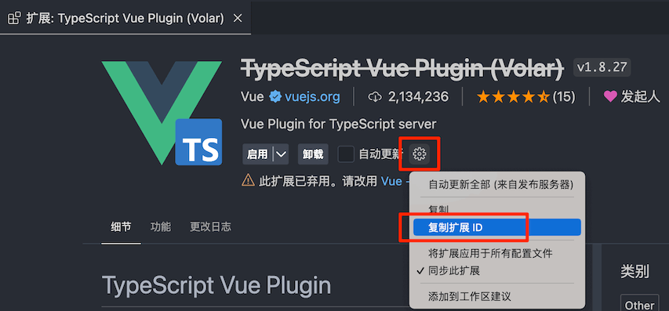
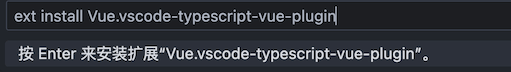

# 如何安装 VScode 已弃用的插件

1. 在 VScode 中复制要安装扩展的 ID，例如此处复制的扩展 ID 为 `Vue.vscode-typescript-vue-plugin`

   

2. Windows 用户使用 `Ctrl + P`，Mac 用户使用 `Command + P`

3. 在出现的对话框中输入如下命令

   ```
   ext install 粘贴第一步复制的内容
   ```

   

4. 按 `Enter` 即可安装完成