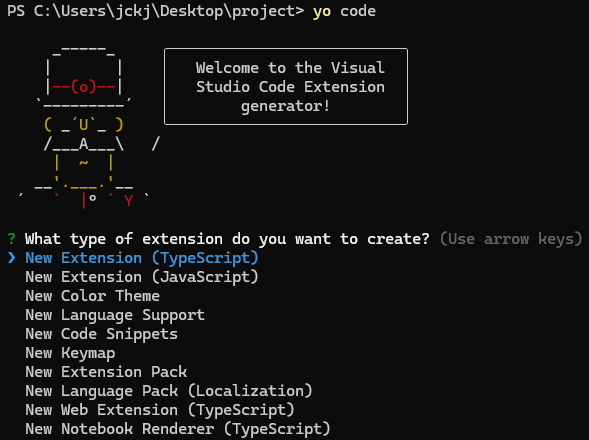
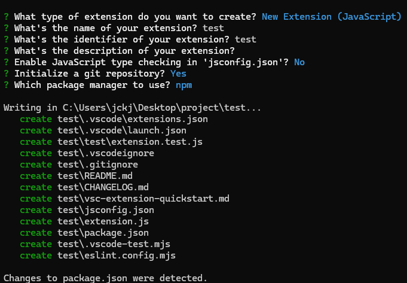
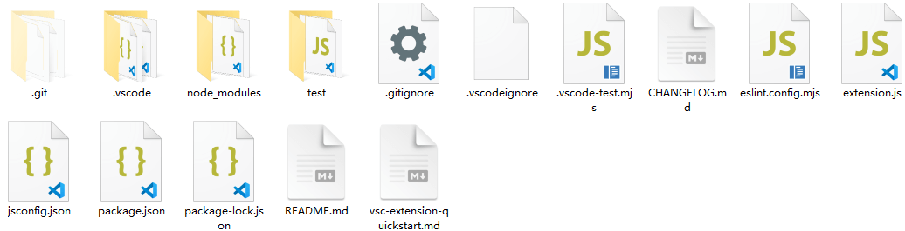
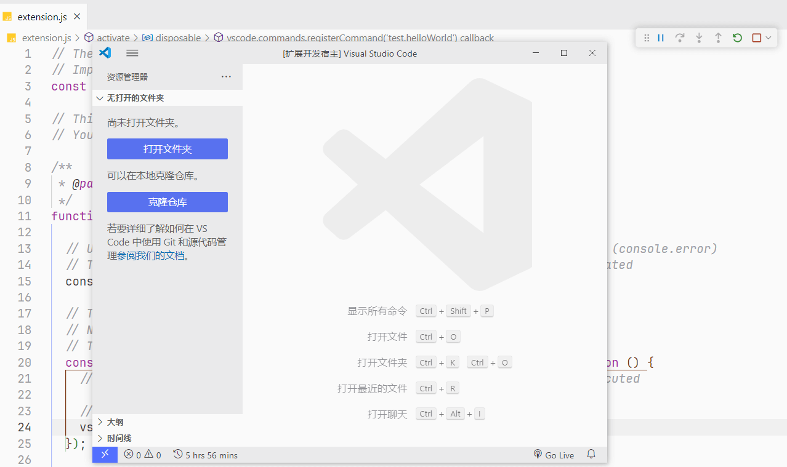
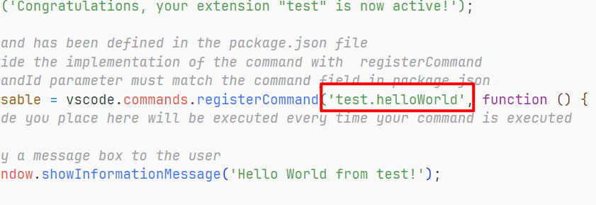
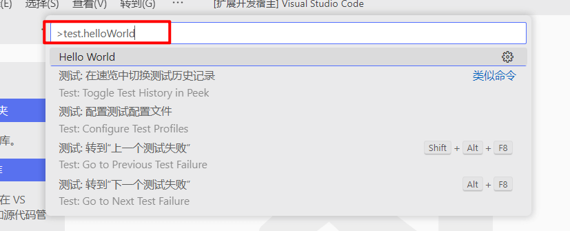
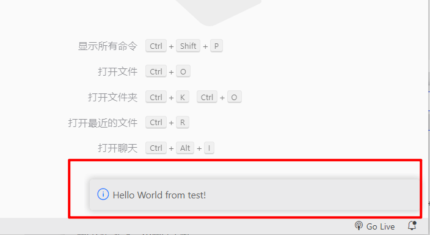
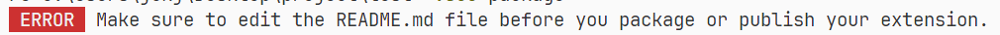
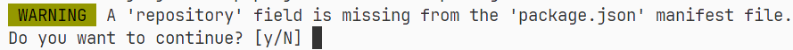
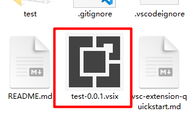

# 如何开发一个 VScode 插件


## 环境准备

- Node.js（版本 `>=20.5.X` ）


## 创建项目

1. 全局安装代码生成脚手架

   ```bash
   npm install -g yo generator-code
   ```

   - `yo` 是 Yeoman 的命令行工具，它用于生成项目结构
   - `generator-code` 是 Yeoman 上的一个生成器，VScode 官方维护的模版

2. 初始化项目目录，选择一个目录打开终端，执行以下命令

   ```bash
   yo code
   ```

   执行该命令后会出现一个引导界面，通过 `上下方向键` 来选择想要的配置，使用 `Enter` 键来确定

   

   **⚠️ 注意：** 这步**包管理器不要选择 pnpm**，因为后面打包扩展用的 `vsce` 不支持 pnpm，具体的可以参考 [Issue #1125](https://github.com/microsoft/vscode-vsce/issues/1125)

   选择完成后大概是这样

   

   生成的目录结构如下

   
   ```
   test                         # 项目的根目录                
   ├─ CHANGELOG.md              # 项目的版本更新日志
   ├─ eslint.config.mjs         
   ├─ extension.js              # 插件入口，包含插件主要逻辑
   ├─ jsconfig.json             
   ├─ package.json              
   ├─ package-lock.json         
   ├─ README.md                 
   ├─ test                      # 测试文件夹，包含测试相关文件
   │  └─ extension.test.js      # 扩展的单元测试文件，确保扩展功能的正确性
   └─ vsc-extension-quickstart.md


## 运行插件

1. **使用 VScode 打开刚刚创建的项目**，按 `F5` 后 VScode 会自动打开一个新的调试窗口

   

2. 在新打开的调试窗口中，按 `Ctrl + Shift + P`，打开命令面板，输入在 `extension.js` 文件中注册的命令，该命令默认是 `test.helloWorld`，可以自行修改

   

   

   3. 按 `Enter` 键即可执行命令

      

      
      

## 打包扩展

1. 安装打包工具

   ```bash
   npm install -g vsce
   ```

2. 编辑项目中的 `README.md` 中的内容，否则会出现错误提示（是 vsce 的限制，要求一定要修改 `README.md` 中的内容）

   

3. 在项目的根目录下执行执行以下命令

   ```bash
   vsce package
   ```

   可能会出现很多类似下面的警告，提示你确实某种字段或者文件，如果你不打算发布 VScode 扩展市场，按 `y` 继续即可，不然还是建议补全对应的文件和字段值

   

4. 执行成功后，会在项目根目录下生成 `.vsix` 文件

   


## `extension.js` 文件代码分析

```js
// 'vscode' 模块包含了 VS Code 扩展性 API
const vscode = require('vscode');

// 当扩展激活时调用此方法
/**
 * @param {vscode.ExtensionContext} context
 */
function activate(context) {
  // 这行代码仅在扩展激活时执行
  console.log('Congratulations, your extension "test" is now active!');

  // 该命令在 package.json 文件中已定义
  // 现在通过 registerCommand 提供命令的实现
  // commandId 参数必须与 package.json 中的 command 字段匹配
  const disposable = vscode.commands.registerCommand(
    'test.helloWorld',
    function () {
      // 调用 'vscode' 模块中的 showInformationMessage 方法
      vscode.window.showInformationMessage('Hello World from test!');
    }
  );

  // 将 disposable 注册事件对象添加到扩展的订阅列表中，以便在扩展被停用时正确清理和释放资源
  context.subscriptions.push(disposable);
}

// 当扩展被停用时调用此方法
function deactivate() {}

module.exports = {
  activate,
  deactivate,
};
```


## 参考文章

- [vscode插件开发（从创建到发布）vscode插件开发方法，包含项目创建、项目文件结构介绍、功能实现方式、项目发布方式 - 掘金](https://juejin.cn/post/7375041782780706842)