# 如何编译VScode源码


## 环境准备

- Git
- Node.js（版本 `>=20.x`  **x64** 或 **ARM64**）
- Python（需要安装 `node-gyp` 支持的版本，可以查看 [node-gyp readme](https://github.com/nodejs/node-gyp#installation)）


## 安装 AC/C++ 编译器工具链

1. 安装 [Visual Studio 构建工具](https://visualstudio.microsoft.com/thank-you-downloading-visual-studio/?sku=BuildTools)

2. 勾选 `使用 C++ 的桌面开发`

   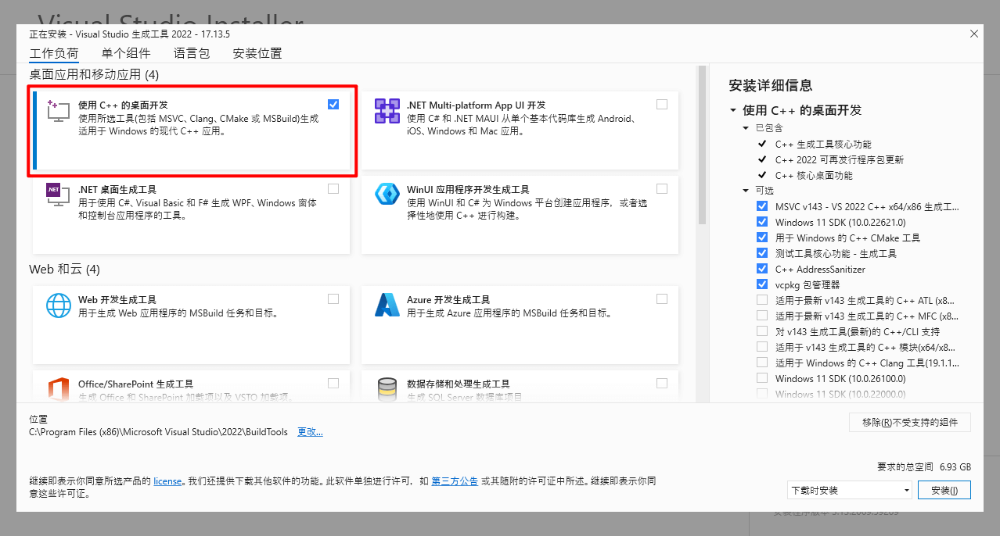

3. 点击单个组件菜单

   

4. 搜索 `Spectre 缓解库`，选择适合操作系统的最新版本

   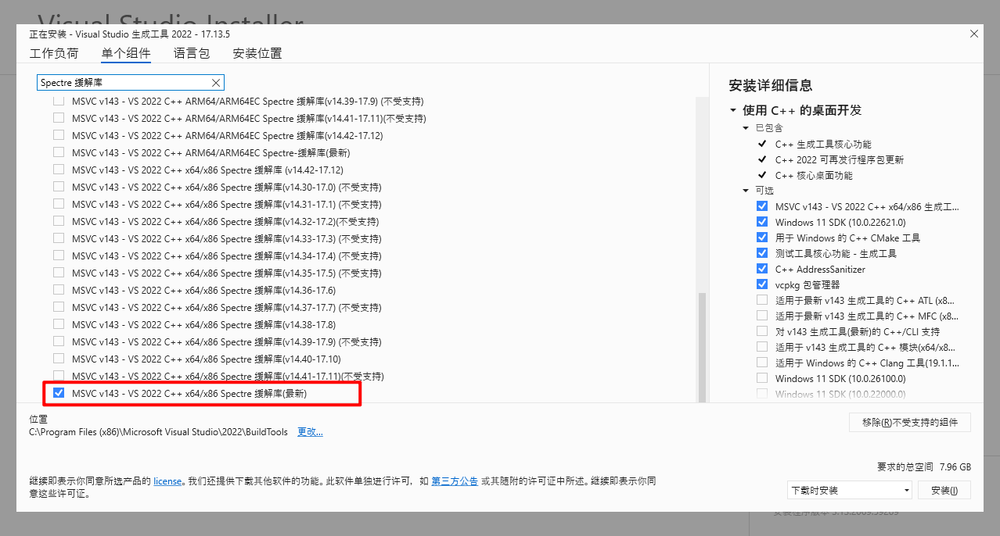

5. 搜索 `带有 Spectre 缓解`，选择适合操作系统的 `C++ ATL` 和 `C++ MFC`

   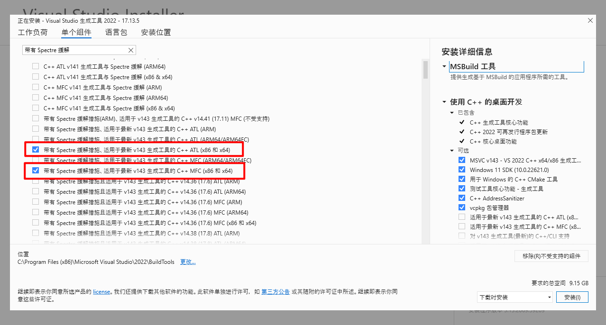

6. 点击右下角的安装按钮

   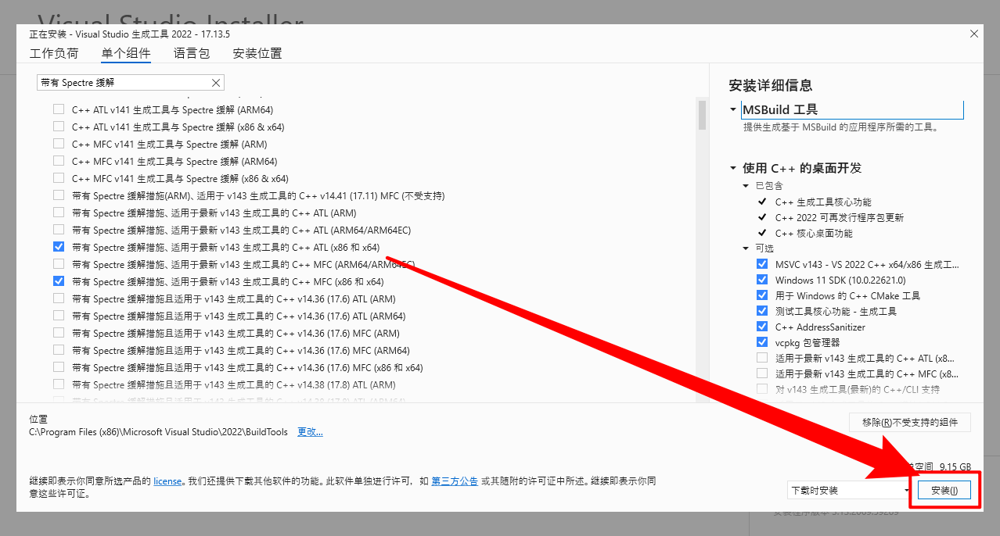

7. 安装完成后点击启动按钮，会弹出一个命令行终端

   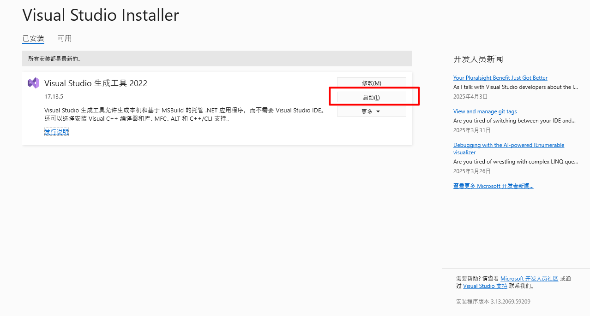

8. 在命令行终端中输入 `npm config edit` 命令，会打开一个记事本，添加或修改与 Visual Studio 生成工具版本相同的 `msvs_version` 设置（例如，对于 Visual Studio 生成工具 2022， `msvs_version=2022`）

   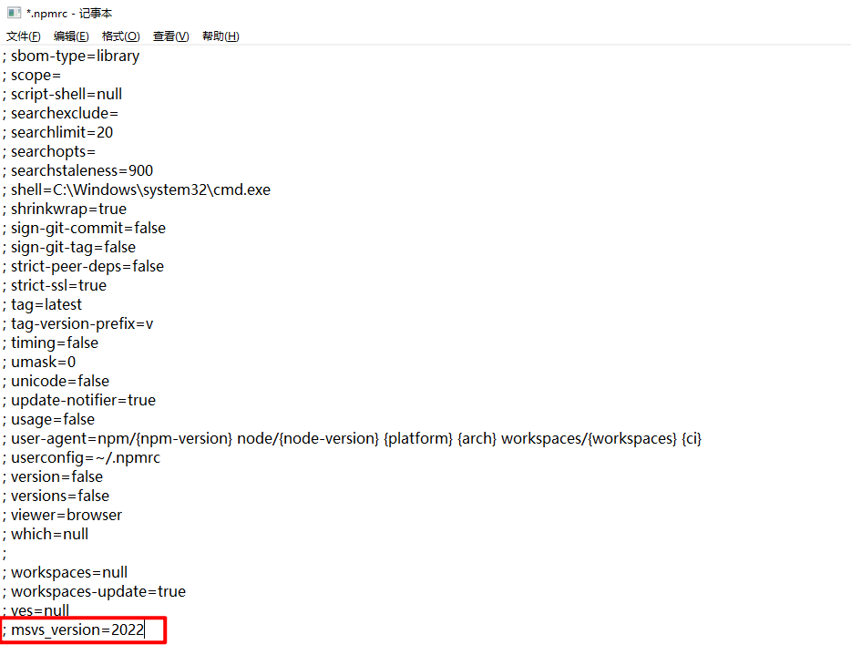


## 克隆 VScode 源码

```
git clone https://github.com/microsoft/vscode.git
```

**⚠️ 注意：** 确保将 `vscode` 克隆到路径层次结构中没有任何空格的文件夹中


## 构建编译 VScode

1. 进入 `vscode` 项目目录

2. 执行 `git checkout main` 命令切换到 `main` 分支

3. 执行 `npm install -g node-gyp` 命令全局安装 `node-gyp`

4. 设置终端网络代理，涉及下载 Github 上的扩展以及 npm 依赖下载，以下命令可以在对应终端**临时设置网络代理**

   - PowerShell

     ```powershell
     $env:http_proxy="http://127.0.0.1:7890";$env:https_proxy="http://127.0.0.1:7890"
     ```

   - CMD（Command）

     ```cmd
     set http_proxy=http://127.0.0.1:7890 && set https_proxy=http://127.0.0.1:7890
     ```

5. 执行 `npm install` 命令下载项目依赖

6. 执行 `npm run gulp vscode-win32-x64-min` 构建 Windows 平台（64 位）下的主程序并生成运行目录，构建成功后结果如下

   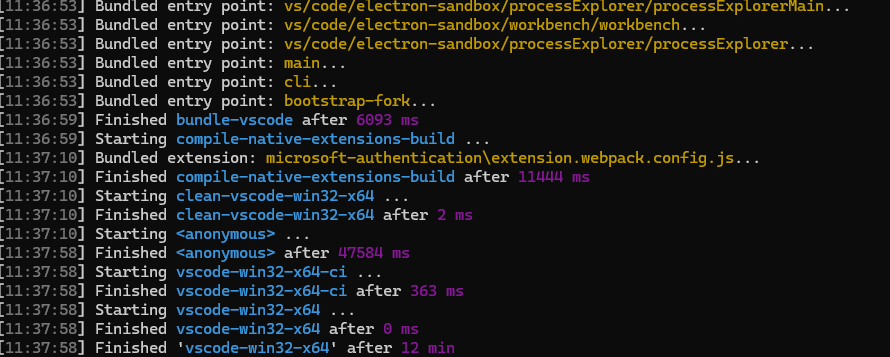

   **⚠️ 注意：** 此时构建的出来的是一个文件夹（绿色免安装版），出现在 vscode 同级目录中

   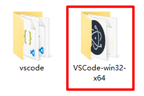

   双击 `Code - OSS.exe` 即可运行

   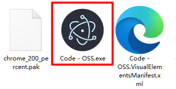

7. 在第六步的基础上构建可安装文件

   1. 下载 [Inno Setup](https://jrsoftware.org/isdl.php#stable) 并安装，用于构建安装程序

      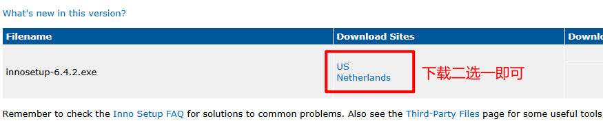

   2. 找到 `ISCC.exe`，默认位置在 `C:\Program Files (x86)\Inno Setup 6` 目录下
   
      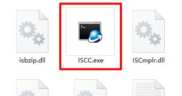
   
   3. 将两个 `ISCC.exe` 复制到第六步生成的目录 `VSCode-win32-x64` 的 `tools` 文件夹中，**如果没有 `tools` 文件夹手动创建即可**
   
   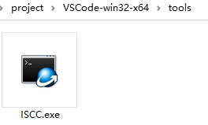
   
   
   4. 在终端中输入 `npm run gulp vscode-win32-x64-system-setup` 执行构建操作，出现下述情况则为构建成功
   
      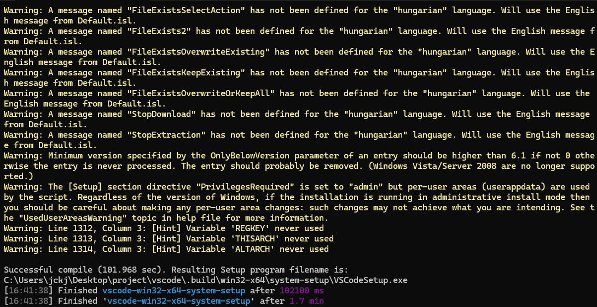
   
   5. 构建的安装程序在 `vscode\.build\win32-x64\system-setup` 目录下可以找到，双击即可安装
   
      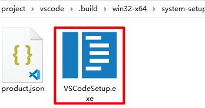

      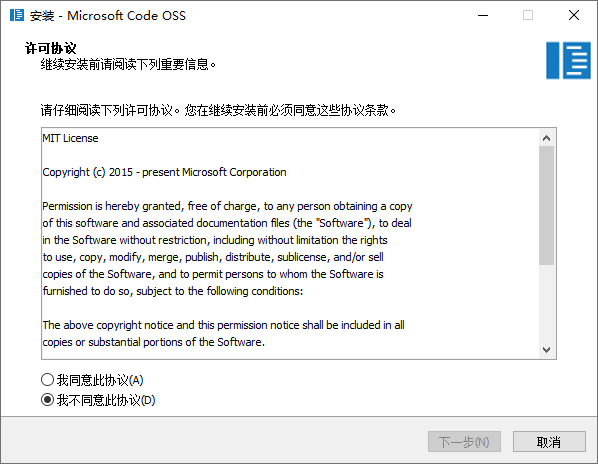
   
