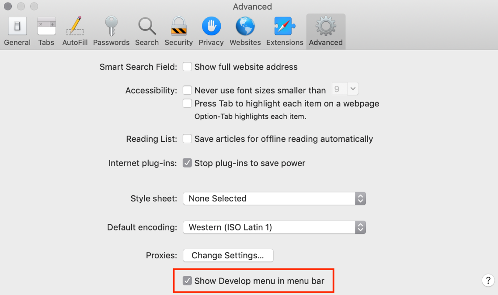

# 现代 JavaScript 教程笔记
教程地址：https://zh.javascript.info

## 简介

### JavaScript 简介

JavaScript 的语言规范为 ECMAScript

浏览器中嵌入了 JavaScript 引擎，每个引擎有自己的代号，例如：V8、SpiderMonkey 等

JavaScript 引擎基本工作流程：

1. 读取 JavaScript 脚本
2. 将 JavaScript 脚本编译（转化）为机器语言
3. 执行机器语言

JavaScript 的能力取决于运行它的环境，例如：在浏览器环境中无法支持直接访问操作系统，但在 Node.js 环境中却支持读写任意文件

有很多第三方的语言可以编译（转化）为 JavaScript 语言，例如：TypeScript、Flow、Dart 等

### 手册与规范

**规范**

**ECMA-262 规范**明确定义了 JavaScript 这门语言的规范，保持每年发布一个版本的频率更新

规范最新草案：https://tc39.es/ecma262

即将纳入规范的提案（stage 3）：https://github.com/tc39/proposals

**手册**

MDN JavaScript 参考：https://developer.mozilla.org/zh-CN/docs/Web/JavaScript/Reference

使用搜索引擎搜索时使用 **"MDN [关键字]"** 来进行查找

**兼容性表**

功能支持表：https://caniuse.com

引擎是否支持语言功能表：https://kangax.github.io/compat-table/es6/

### 代码编辑器

代码编辑器主要分为 IDE（集成开发环境）和轻量编辑器

比较主流的有：

- VScode（免费，跨平台）
- WebStorm（付费，跨平台）

轻量编辑器也可以通过安装插件实现跟 IDE 一样的语法分析和代码补全的功能，所以两者之间没有严格的界限

### 开发者控制台

Chrome 和 Firefox 等浏览器打开开发者控制台的快捷键

- Winodws 平台 `F12`
- Mac 平台 `Command` + `option` + `J`

Safari 浏览器（ Mac 平台专有）

1. 需要先在浏览器的 “Advanced” 选项中勾选 “Show Develp menu in menu bar” 选项

   

2. 通过使用 `Command` + `option` + `C` 控制打开或关闭控制台
