# 现代 JavaScript 教程笔记

教程地址：https://zh.javascript.info


## JavaScript 简介

浏览器中嵌入了 JavaScript 引擎，有时也被称作 “JavaScript 虚拟机”，不同的引擎有不同的代号

- [V8](https://en.wikipedia.org/wiki/V8_(JavaScript_engine)) —— Chrome、Opera 和 Edge 中的 JavaScript 引擎
- [SpiderMonkey](https://en.wikipedia.org/wiki/SpiderMonkey) —— Firefox 中的 JavaScript 引擎
- ……还有其他一些代号，像 “Chakra” 用于 IE，“JavaScriptCore”、“Nitro” 和 “SquirrelFish” 用于 Safari，等等


**引擎工作的基本原理**

1. 引擎（如果是浏览器，则引擎被嵌入在其中）读取（“解析”）脚本
2. 引擎将脚本转化（“编译”）为机器语言
3. 机器代码快速地执行

引擎会对流程中的每个阶段都进行优化。它甚至可以在编译的脚本运行时监视它，分析流经该脚本的数据，并根据获得的信息进一步优化机器代码

​	

**开发者控制台**

Google Chrome 中按下 `F12` 键，如果你使用 Mac，使用 `Command+option+J`

在浏览器控制台中按 `Enter`，这行代码会立即执行，如果要插入多行代码，需要按 `Shift+Enter` 进行换行


## Javascript 基础知识

**Script 标签**

`script` 标签几乎可以将 Javascript 程序插入到 HTML 文档的任何位置


**现代的标记**

`script` 标签有一些现在很少用到的特性(attribute)，但是我们可以在老代码中找到它们

- `type` 特性： `<script type=…>`

  在老的 HTML4 标准中，要求  ` script` 标签有 `type` 特性。通常是 `type="text/javascript"`，目前已经不再需要了

- `language` 特性：`<script language=…>`

  这个特性是为了显示脚本使用的语言，这个特性现在已经没有任何意义，因为语言默认就是 JavaScript，目前已经不再需要了


**脚本前后的注释**

```html
<script type="text/javascript"><!--
    ...
//--></script>
```

现代 JavaScript 中已经不这样使用了。这些注释是用于不支持 `<script>` 标签的古老的浏览器隐藏 JavaScript 代码的


**外部脚本**

一般来说，只有最简单的脚本才嵌入到 HTML 中，复杂的脚本放在单独的文件中，使用独立文件的好处是浏览器会下载它，然后将它保存到浏览器的缓存中

如果设置了 `src` 特性，`script` 标签内容将会忽略

```html
<script src="file.js">
  alert(1); // 此内容会被忽略，因为设定了 src
</script>
```


**代码结构**

通常，每条语句独占一行，以提高代码的可读性

```js
alert('Hello');
alert('World');
```


**分号**

当存在换行符时，在大多数情况下可以省略分号

```js
alert('Hello');
alert('World');
```

但存在 JavaScript 无法确定是否真的需要自动插入分号的情况

```js
alert("Hello")

[1, 2].forEach(alert);
```

对于引擎来说会被解析为如下代码

```js
alert("Hello")[1, 2].forEach(alert);
```

以上代码回先输出 `Hello`，随后报错

**注意：** 即使语句被换行符分隔了，但还是推荐在语句的末尾加上分号


**注释**

多行注释 `/*  */` 不支持注释嵌套

```js
/*
  /* 嵌套注释 ?!? */
*/
alert( 'World' );
```

以上代码运行报错

注释虽然会增加代码总量，但这一点也不是什么问题。有很多工具可以帮你在把代码部署到服务器之前缩减代码


**现代模式，"use strict"**

2009 年 ECMAScript 5 (ES5) 的出现，ES5 规范增加了新的语言特性并且修改了一些已经存在的特性，为了保证旧的功能能够使用，大部分的修改是默认不生效的。需要使用特殊指令 `'use strict'` 来明确激活这些特性

- 放在脚本文件的顶部

  ```js
  'use strict';
  // 代码以现代模式工作
  ...
  ```

- 放在函数体的开头

  ```js
  // 严格模式没有激活
  ...
  
  function demo() {
    'use strict';
    // 代码以现代模式工作
  	...
  }
  
  // 严格模式没有激活
  ...
  ```


**注意：** 必须确保 `'use strict'` 出现在最顶部，否则现代模式可能无法启用

```js
alert('some code');
// 下面的 "use strict" 会被忽略，必须在最顶部

'use strict';
// 严格模式没有被激活
```

**注意：** 没有类似 `'no use strict'` 这样的指令，一旦进入现代模式，就没有办法回退

在使用浏览器控制台运行代码时，它默认是不启动 `'use strict'` 的，需要先输入 `'use strict'` 再使用 `Shift+Enter`  换行输入代码以启用现代模式

现代 Javascript 支持 `class` 和 `module` 高级语言结构，使用它们会自动启动 `'use strict'`，无需手动添加 `'use strict'` 命令

一般来说推荐在文件头部加上 `'use strict'`，当代码都写在了 `class` 和 `module` 中时，可以将 `'use strict'` 代码忽略掉


**变量**

为了更好的可读性，推荐一行只声明一个变量

```js
let user = 'John';
let age = 25;
let message = 'Hello';
```

或者对一行声明的多个变量换行

```js
let user = 'John',
  age = 25,
  message = 'Hello';
```

在老的脚本中可能会遇到声明变量使用的关键字是 `var` 而不是 `let`，`var` 与 `let` 大体相同，但是也存在一些差异，推荐使用 `let` 来定义变量


**变量命名限制**

Javascript 变量命名有如下两个限制：

1. 变量名称必须仅包含字母、数字、符号 `$` 和 `_`
2. 首字符必须非数字

如果变量名包含多个单词，推荐采用驼峰命名法，单词一个接着一个，除了第一个单词，其它单词都以大写字母开头

在 Javascript 中是**区分变量单词大小写**的，`apple` 和 `Apple` 表示不同的两个变量


**允许非英文字母，但不推荐**

可以使用任何语言，包括西里尔字母（cyrillic letters）甚至是象形文字

```js
let имя = '...';
let 我 = '...';
```

这样的命名虽然完全允许，但是英文进行变量命名是国际惯例


**保留字**

有一张 [保留字列表](https://developer.mozilla.org/en-US/docs/Web/JavaScript/Reference/Lexical_grammar#Keywords)，这张表中的保留字无法用作变量命名，因为它们被用于编程语言本身了


**常量**

声明一个常数（不变）变量，可以使用 `const` 而非 `let`，当尝试修改 `const` 声明的变量，就会发现报错

当确定这个变量永远不会改变的时候，就可以使用 `const` 来确保这种行为


**大写形式的常数**

普遍的做法是将常数用作别名，以便记住这些执行之前就已知的难以记住的值

使用大写字母和下划线来命名这些常量

```js
const COLOR_RED = '#F00';
const COLOR_GREEN = '#0F0';
const COLOR_BLUE = '#00F';
const COLOR_ORANGE = '#FF7F00';

// 当我们需要选择一个颜色
let color = COLOR_ORANGE;
alert(color); // #FF7F00
```

好处：

- `COLOR_ORANGE` 比 `'#FF7F00'` 更容易记忆
- 比起 `COLOR_ORANGE` 而言，`'#FF7F00'` 更容易输错
- 阅读代码时，`COLOR_ORANGE` 比 `'#FF7F00'` 更易懂


**什么时候为常数使用大写命名，什么时候进行常规命名？**

- 大写命名：在常数执行之前就已知了

  ```js
  const COLOR_RED = '#F00';
  ```

- 常规命名：和变量命名一样，多个单词采样驼峰命名，在执行期间被计算出来的，但是赋值之后就不会改变

  ```js
  const pageLoadTime = /* 网页加载所需的时间 */;
  ```

  `pageLoadTime` 的值在页面加载之前是未知的，所以采用常规命名。但是它仍然是个常量，因为赋值之后不会改变

大写命名的常量仅用作“硬编码（hard-coded）”值的别名


**正确命名变量**

一个变量名应该有一个清晰、明显的含义，对其存储的数据进行描述

命名变量最好遵循以下规则

- 使用易读的命名，比如 `userName` 或者 `shoppingCart`
- 远离 `a`、`b`、`c` 这种缩写和短名称，除非真的知道在做什么
- 变量名在能够准确描述变量的同时要足够简洁，不好的例子是 `data` 和 `value`，如果可以非常明显的从上下文中知道数据和值所表达的含义，这样使用也是可以的
- 脑海中术语要和团队保持一致，如如果网站的访客称为“用户”，则我们采用相关的变量命名，比如 `currentUser` 或者 `newUser`，而不要使用 `currentVisitor` 或者一个 `newManInTown`


**重用变量还是新建变量？**

如果重用现有的变量而不是新建变量，会导致变量像被扔进不同东西的盒子，这样会在调试代码的时候损失数十倍时间

额外声明变量是利大于弊的，现代的 JavaScript 压缩器和浏览器都会对代码进行很好的优化，所以不会产生性能问题，为不同的值使用不同的变量可以帮助引擎对代码进行优化


**数据类型**

JavaScript 中有 8 种基本的数据类型，其中 7 种是原始类型，另外一种是引用类型

JavaScript 是动态类型的语言，在定义变量之后不会被限制为某一数据类型


**Number 类型**

*number* 类型表示整数和浮点数，除了常规的数字，还包含三个特殊值 `Infinity`、`-Infinity` 和 `NaN`

- `Infinity` 在数学概念中代表无穷大，是一个比任何数字都大的特殊值，可以通过除以 0 来得到它

  ```js
  alert(1 / 0); // Infinity
  ```

  或者在源码中直接使用

  ```js
  alert(Infinity); // Infinity
  ```

- `NaN` 代表一个计算错误，它是一个不正确或者未定义的数据操作所得到的结果

  ```js
  alert('not a number'/ 2); // NaN
  ```

  `NaN` 是粘性的，任何对 `NaN` 的进一步数学运算都会返回 `NaN`

  ```js
  alert( NaN + 1 ); // NaN
  alert( 3 * NaN ); // NaN
  alert( "not a number" / 2 - 1 ); // NaN
  ```

  **注意：** 在数学表达式中有一个 `NaN`，会被传播到最终结果，除了 `NaN ** 0` 的结果为 `1`


**BigInt 类型**

在 JavaScript 中，*number* 类型无法安全地表示大于 `(2^53-1)`（即 `9007199254740991`），或小于 `-(2^53-1)` 的整数

更准确来说，*number* 类型可以存储更大的整数（最多 `1.7976931348623157 * 10^308`），但超出安全整数范围 `±(2^53-1)` 会出现**精度问题**，因为并非所有数字都适合固定的 64 位存储，因此，**可能存储的是“近似值”**

```js
console.log(9007199254740991 + 1); // 9007199254740992
console.log(9007199254740991 + 2); // 9007199254740992
```

也就是说，所有大于 `(2^53-1)` 的奇数都不能用 *number* 类型存储

*BigInt* 类型表示任意长度的整数，通过将 `n` 附加到整数字段的末尾来创建 `Bigint` 值

```js
// 尾部的 "n" 表示这是一个 BigInt 类型
const bigInt = 1234567890123456789012345678901234567890n;
```

**注意：** 目前主流的浏览器已经支持了 `BigInt` 类型，但是 IE 还没有


**String 类型**

  在 JavaScript 中，有三种包含字符串的方式

  1. 双引号：`"Hello"`
  2. 单引号：`'Hello'`
  3. 反引号：```Hello` ``

双引号和单引号都是简单的引用，在 JavaScript 中两者几乎没有什么差别

反引号是扩展功能引号，允许我们将变量和表达式包装在 `${...}` 中，来把它们嵌入到字符串中

```js
let name = 'CodePencil';

// 嵌入一个变量
alert( `Hello, ${name}!` ); // Hello, John!

// 嵌入一个表达式
alert( `the result is ${1 + 2}` ); // the result is 3
```

`${...}` 表示式会被计算，计算结果会成为字符串的一部分

**注意：** 在  JavaScript 中没有 *character* 类型，只有一种 *string* 类型，一个字符串可以包含零个(为空)、一个或多个字符串


**Boolean 类型（逻辑类型）**

*boolean* 类型只包含两个值：`true` 和 `false`


**null 值**

特殊的 `null` 值不属于上述的任何一种类型，它构成了一个独立的类型，只包含 `null` 值

```js
let age = null;
```

在 JavaScript 中的 `null` 不是一个对不存在的 `object` 的引用或者空指针

JavaScript 中的 `null` 仅仅是一个代表 "无"、"空" 或 "值未知的" 特殊值


**undefined 值**

特殊值 `undefined` 和 `null` 一样都是自成类型，`undefined` 含义是未被赋值

如果一个变量已被声明，但是未被赋值，那么它的值就是 `undefined`

```js
let age;

alert(age); // 弹出 "undefined"
```

也可以将显式地将 `undefined` 赋值给变量

```js
let age = 100;

// 将值修改为 undefined
age = undefined;

alert(age); // "undefined"
```

**注意：** 不建议这样做，通常使用 `null` 将一个空或者未知的值写入变量中，而 `undefined` 则保留作为未进行初始化的事物默认初始值


**Object 类型和 Symbol 类型**

*object* 类型是一个特殊的类型

其它所有的数据类型都被称为 "原始类型"，因为它们的值值包含一个单独的内容，相反，*object* 类型则用于存储数据集合和更复杂的实体

*symbol* 类型用于创建对象的唯一标识符


**typeof 运算符**

typeof 运算符返回参数的类型

```js
typeof undefined; // "undefined"

typeof 0; // "number"

typeof 10n; // "bigint"

typeof true; // "boolean"

typeof "foo"; // "string"

typeof Symbol('id'); // "symbol"

typeof Math; // "object"

typeof null; // "object"

typeof alert; // "function"
```

**注意：**

1. `Math` 是一个提供数学运算的内建 `object`
2. `typeof null` 的结果为 `object`，这是官方承认的 `typeof` 的错误，这个问题来自于 JavaScript 语言的早期阶段，并为了兼容保留了下来，`null` 绝对不是一个 `object`，`null` 有自己的类型，它是一个特殊值，`typeof` 的行为在这里是错误的
3. `typeof alert` 的结果是 `"function"`，因为 `alert` 在 JavaScript 语言中是一个函数，因为 JavaScript 语言中没有一个特别的 *function* 类型，函数隶属于 *object* 类型，但 `typeof` 对函数区分对待，并返回 `"function"`，这也是来自于 JavaScript 语言早期的问题，虽然这种行为不正确，但在实际编程中却非常方便

`typeof(x)` 语法

`typeof(x)` 与 `typeof x` 相同，`typeof` 是一个操作符，不是一个函数，这里的括号不是 `typeof` 的一部分，它是数学运算分组的括号

```js
typeof(2 + 2);
```

这样写允许 `typeof` 运算符和其他参数之间不打空格，`typeof(x)` 和 `typeof x` 两种功能相同，但 `typeof x` 语法更常见


**alert**

会显示一条消息，并等待用户按下 OK

```js
alert('Hello');
```

弹出带有信息的小窗口被称为模态窗，"modal" 意味着用户不能与页面的其它部分进行交互，直到他们处理完模态窗，以上情况只有当用户点击确定按钮才算处理完模态窗


**prompt**

prompt 函数接收两个参数

```js
const result = prompt(title,[default]);
```

`title` 显式给用户的文本

`default` 可选的第二个参数，指定 input 框的初始值

访问者可以在提示输入栏中输入一些内容，然后按确定键之后可以在 `result` 中获得该文本，或者他们可以按 `Esc` 键取消输入，然后可以得到 `null` 作为 `result`

**注意：** 在 IE 浏览器中会提供默认值 `"undefined"`，如果不提供第二个参数，IE 浏览器会把 `"undefined"` 插入到 prompt，为了 prompt 在 IE 浏览器中有好的效果，**建议始终提供第二个参数**

```js
const result = prompt('Hello','');
```


**confirm**

```js
const result = confirm(question);
```

`question` 用于显示确认模态窗口的问题文本

`confirm` 函数会显示一个带有 `question` 以及确定和取消两个按钮的模态窗口，点击确定时会返回 `true`，点击取消时会返回 `false`

```js
const result = confirm('请问你是否满18岁？');
alert(result);
```


**alert、prompt、confirm 的限制**

1. 模态窗口的确切位置由浏览器决定，通常在页面中心
2. 窗口的外观也取决于浏览器，我们不能修改它


**类型转换**

大多数情况下，运算符和函数会自动将赋予它们的值转换为正确的类型

例如在 `alert` 中，任何值都会转化为字符串以进行显示

算数运算符会将值转换为数字


**字符串转换**

`alert(value)` 会将 value 转换为 *string* 类型，然后显示这个值

也可以使用 `String(value)` 来将 `value` 转化为字符串类型

```js
let value = true;
alert(type of value); // boolean

value = String(value);
alert(typeof value); // string
```


**数字型转换**

在算数函数和表达式中，会自动进行 *number* 类型转换

```js
console.log('6' / '2'); // 3
```

也可以使用 `Number(value)` 显式地将 `value` 转换为 *number* 类型

```js
let str = '123';

alert(typeof str); // string

let num = Number(str);
alert(typeof num); // number
```

如果当字符串不是一个有效的数字，转换结果会是 `NaN`

```js
let age = Number('Hello World');
alert(age); // NaN，转换结果失败
```

*number* 类型的转换规则：

| 值                | 转换结果                                                     |
| ----------------- | ------------------------------------------------------------ |
| `undefined`       | `NaN`                                                        |
| `null`            | `0`                                                          |
| `true` 和 `false` | `1` 和 `0`                                                   |
| `string`          | 去掉首尾空白字符(空格、换行符 \n、制表符 \t 等) 后的纯数字字符串中含有的数字。如果剩余字符串为空，则结果为 `0`，否则就会从剩余字符串中读取数字，当类型转换出现 error 时返回 `NaN` |

```js
alert(Number('   123   ')); // 123
alert(Number('123z')); // NaN(从字符串中读取数字，读到'z'时出现错误)
alert(Number(true)); // 1
alert(Number(false)); // 0
```


**布尔型转换**

它发生在逻辑运算中，也可以通过 `Boolean(value)` 显式地进行转换

`boolean` 型的转换规则

- 直观上为空的值(如 `0`、空字符串、`null`、`undefined` 和 `NaN`) 都将变为 `false`
- 其他值变为 `true`

```js
alert(Boolean(1)); // true
alert(Boolean(0)); // false

alert(Boolean('Hello')); // true
alert(Boolean('')); // false
```

**注意：** 包含 0 的字符串 `'0'` 是 `true`

在一些其它的编程语言例如 `PHP` 中视 `'0'` 为`false`

```js
alert(Boolean('0')); // true
alert(Boolean('   ')); // true(任何非空字符串都是)
```


**术语：“一元运算符”，“二元运算符”，“运算元”**

- **运算元：** 运算符应用的对象，例如：`5 * 2`，有两个运算元：左运算元 `5` 和 右运算元 `2`，有时也叫运算元为 “参数”

- 如果一个运算符对应的只有一个运算元，那么它是**一元运算符**

  ```js
  let x = 1;
  x = -x;
  alert(x); // -1，一元负号运算符生效
  ```

- 如果一个运算符拥有两个运算元，那么它是**二元运算符**，减号存在二元运算符形式

  ```js
  let x = 1, y = 3;
  alert(y - x); // 2，二元运算符减号做减法运算
  ```


**数学运算**

支持以下数学运算

- 加法 `+`
- 减法 `-`
- 乘法 `*`
- 除法 `/`
- 取余 `%`
- 求幂 `**`


**取余 %**

取余运算符是 `%`，`a % b` 的结果是 `a` 整除 `b` 的余数

```js
alert(5 % 2); // 1
alert(8 % 3); // 2
```


**求幂 ****

求幂运算 `a ** b` 将 `a` 提升至 `a` 的 `b` 次幂

```js
alert(2 ** 2); // 4
alert(2 ** 3); // 8
alert(2 ** 4); // 16
```

像数学运算中一样，幂等运算也适用于非整数

```js
alert(4 ** (1 / 2)); // 2 (4 的 1/2 次方)
alert(8 ** (1 / 2)); // 3 (8 的 1/3 次方)
```


**用二元运算符 + 连接字符串**

在 JavaScript 中 `+` 可以用来连接两个字符串

```js
const s = 'Hellow' + 'World';
alert(s);
```

只有有一个运算元是字符串，另一个运算元也会被转换为字符串

```js
alert('1' + 2); // '12'
alert('2' + 1); // '21'
```

运算符是按顺序工作的，第一个 `+` 将两个数字相加，然后再跟后面的字符串 `1` 连接成一个字符串

```js
alert(2 + 2 + '1'); // '41'
```

**注意：** 二元 `+` 是唯一一个以这种方式支持字符串的运算符，其它运算符只对数字起作用，并且总是将其运算元转换为数字

```js
alert(6 - '2'); // 4，将 '2' 转换为数字
alert('6' / '2'); // 3 将两个运算元都转化为数字
```


**数字转化，一元运算符 + **

一元运算符 `+` 应用于单个值，但是对数字没任何作用，如果运算元不是数字，加号 `+` 会将其转换为数字

```js
const x = 1;
alert(+x); // 1，对数字无效

const y = -2;
alert(+y); // -2

// 转化非数字
alert(+true); // 1
alert(+''); // 0
```

它的效果和 `Number(...)` 相同，但是更加简短


**运算符优先级**

如果表达式拥有超过一个运算符，执行顺序则由**优先级**决定，具体可以参考 MDN 的[优先级表](https://developer.mozilla.org/en-US/docs/Web/JavaScript/Reference/Operators/Operator_precedence#table)

| 优先级 | 名称     | 符号 |
| :----- | :------- | :--- |
| …      | …        | …    |
| 15     | 一元加号 | `+`  |
| 15     | 一元负号 | `-`  |
| 14     | 求幂     | `**` |
| 13     | 乘号     | `*`  |
| 13     | 除号     | `/`  |
| 12     | 加号     | `+`  |
| 12     | 减号     | `-`  |
| …      | …        | …    |
| 2      | 赋值符   | `=`  |
| …      | …        | …    |


**赋值运算符**

赋值运算符的优先级非常的低，所有的计算先执行，然后 `=` 才执行

```js
let x = 2 * 2 + 1;
alert(x); // 5
```


**赋值 = 返回一个值**

在 JavaScript 中，所有运算符都会返回一个值，对于运算符 `=` 也是如此

```js
let a = 1;
let b = 2;

let c = 3 - (a = b + 1);

alert(a); // 3
alert(c); // 0
```

上述例子中 `a = b + 1` 先把计算结果 `3` 赋值给了 `a`，然后再返回 `a` 的值参与计算

**注意：** 不推荐写这样的代码，因为这样写不会使代码变得更清晰或可读


**链式赋值**

```js
let a, b, c;
a = b = c = 2 + 2;

alert(a); // 4
alert(b); // 4
alert(3); // 4
```

链式赋值是从右到左进行计算的，首先是对最右边的表达式 `2 + 2` 求值，然后再将其赋值给左边的变量 `c`、`b` 和 `a`，使得最后虽有变量共享一个值

为了可读性，建议把上述代码分成几行

```js
let a, b, c;
c = 2 + 2;
b = c;
a = c;

alert(a); // 4
alert(b); // 4
alert(3); // 4
```


**原地修改**

对一个变量做运算，并将新的结果存储在同一个变量中

```js
let n = 2;
n = n + 5;
n = n * 2;
```

可以使用 `+=` 和 `*=` 来缩写这种表示

```js
let n = 2;
n += 5; // n = 7
n *= 2; // n = 14

alert(n); // 14
```

这类运算符的优先级与普通赋值运算符的优先级相同，它们在大多数其他运算之后执行

```js
let n = 2;

n *= 3 + 5;

alert(n); // 16 (右边部分先计算，等同于 n *= 8)
```


**自增/自减**

- 自增 `++` 将变量与 1 相加

  ```js
  let counter = 2;
  counter++; // 效果跟 counter += 1 一样，但是更简洁
  alert(counter); // 3
  ```

- 自减 `--` 将变量与 1 相减

  ```js
  let counter = 2;
  counter--; // 效果跟 counter -= 1 一样，但是更简洁
  alert(counter); // 1
  ```

**注意：** 自增/自减只能应用于变量，应用于数值(例如 `5++` ) 会报错


运算符 `++` 和 `--` 可以置于变量前，也可以置于变量之后

- 当运算符置于变量后，被称为 “后置形式”：`counter++`
- 当运算符置于变量前，被称为 “前置形式”：`++counter`

两者都做同一件事情，将变量 `counter` 与 `1` 相加，但两者也有区别，只有当使用 `++/--` 的返回值时才有区别

- 前置形式会返回一个新值

  ```js
  let counter = 1;
  let a = ++counter;
  
  alert(a); // 2
  ```

- 后置形式会返回原来的值

  ```js
  let counter = 1;
  let a = counter++;
  
  alert(a); // 1
  ```


**自增/自减和其它运算符的对比**

`++/--` 的优先级比绝大部分的算数运算符要高

```js
let counter = 1;
alert(2 * ++counter); // 4
```

从技术层面上来说是可行的，但是这样的写法会降低代码的可阅读性，建议采用 “一行一个行为” 的模式

```js
let counter = 1;
counter++;
alert(2 * counter); // 4
```


**位运算符**

位运算符把运算元当做 32 位整数，并在它们的二进制表现形式上操作

有以下几个的位运算符：

- 按位与 ( `&` )
- 按位或 ( `|` )
- 按位异或 ( `^` )
- 按位非 ( `~` )
- 左移 ( `<<` )
- 右移 ( `>>` )
- 无符号右移 ( `>>>` )

以上运算符很少被使用，一般是在需要对最低级别（位）上操作数字时才使用，在 Web 开发中很少使用，但在一些特殊领域例如密码学，很有用，可以阅读 MDN 上的 [位操作符](https://developer.mozilla.org/en-US/docs/Web/JavaScript/Guide/Expressions_and_operators#bitwise_operators)


**逗号运算符**

逗号运算符 `,` 是最少见最不常使用的运算符之一，有时候它会被用来写更简短的代码

逗号运算符能让我们处理多个表达式，使用 `,` 将它们分开，每个表达式都运行了，但是只有最后一个结果被返回

```js
let a = (1 + 2, 3 + 4);

alert(a); // 7 (3 + 4 的结果)
```

**注意：** `,` 运算符的优先级非常低，比 `=` 还低，所以上面例子中的圆括号非常重要，上面的例子如果不加括号，`let a = 1 + 2, 3 + 4` 就会先执行 `+`，将数值相加得到 `a = 3, 7`，然后赋值运算符 `=` 执行 `a = 3`，然后逗号之后的数值 `7` 不会再执行，它被忽略掉了

为什么需要一个这样的运算符，它只返回最后一个值呢？

有时候，会有使用它把几个行为放在一行上来进行复杂运算

```js
// 一行上有三个运算符
for(a = 1, b = 3, c = a * b; a < 10; a++) {
  ...
}
```


**值的比较**

在 JavaScript 中，值的比较编写方式如下

- 大于/小于：`a > b`，`a < b`
- 大于等于/小于等于：`a >= b`，`a <= b`
- 检查两个值的相等：`a == b`
- 检查两个值不相等：`a != b`


**字符串比较**

比较字符串大小时，Javascript 会使用 “字典” 或 “词典” 顺序进行判定，字符串是按字符(母)逐个进行比较的

```js
alert('Z' > 'A'); // true
alert('Glow' > 'Glee'); // true
alert('Bee' > 'Be'); // true
```

字符串的比较算法

1. 首先比较两个字符串的首字符大小
2. 如果一方字符较大(或较小)，则该字符串大于(或小于)另一个字符串，算法结束
3. 否则，如果两个字符串的首位字符相等，则继续取出两个字符串各自的后一位字符进行比较
4. 重复上述步骤进行比较，直到比较完成某字符串的所有字符为止
5. 如果两个字符串的字符同时用完，那么则判断它们相等，否则未结束(还有未比较的字符)的字符串更大

**注意：** 字符串比较并非真正的字典顺序，而是 Unicode 编码顺序


**不同类型间的比较**

当不同类型的值进行比较时，Javascript 会首先将其转换为数字(number)再判定大小

```js
alert('2' > 1); // true，字符串 '2' 会被转化为数字 2
alert('01' == 1);  // true，字符串 '01' 会被转化为数字 1
```


对于布尔类型值来说，`true` 会被转化为 `1`，`false` 会被转化为 `0`

```js
alert(true == 1); // true
alert(false ==	0); // true
```


**严格相等**

普通相等性检查 `==` 存在一个问题，就是它不能区分出 `0` 和 `false`

```js
alert(0 == false); // true
```

也无法区分空字符串和 `false`

```js
alert('' == false); // true
```

因为在比较不同类型的值时，处于相等判断符号 `==` 两侧的值会被优先转化为数字。空字符串和 `false` 也是如此，转化后它们都为数字 `0`


**严格相等运算符 `===` 在进行比较时不会做任何的类型转换**

如果 `a` 和 `b` 属于不同的数据类型，那么 `a === b` 不会做任何的类型转换而是立即返回 `false`

```js
alert(0 === false); // false，因为比较值的类型不同
```

同样的，与 “不相等” 符号 `!=` 类似，“严格不相等” 表示为 `!==`


**对 null 和 undefined 进行比较**

当使用严格相等 `===` 比较两者时，不相等，因为它们属于不同的类型

```js
alert(null === undefined); // false
```

当使用非严格相等 `==` 比较两者时

```js
alert(null === undefined); // true
```

在 JavaScript 中存在一个特殊的规则，会判定它们相等，只会等于对方为不会等于其他任何的值

当使用数字式或其他比较方法 `< > <= >=` 时

`null/undefined` 会被转换为数字：`null` 会被转化为 `0`，`undefined` 被转化为 `NaN`


**当 null 和 0 进行比较时**

```js
alert(null > 0); // false
alert(null == 0); // false
alert(null >= 0); // true
```

会出现这样的原因是，在进行值的比较时，会先把 `null` 转换为数字，所以它被转化为了 `0`，所以第三行的结果是 `true`，而第一行的结果是 `false`，因为 `undefined` 和 `null` 在相等性检查中 `==` 不会进行任何的类型转换，它们有自己独立的比较规则，所以第二行返回的是 `false`


**特立独行的 undefined**

`undefined` 不应该被用于与其他值进行比较

```js
alert(undefined > 0); // false
alert(undefined < 0); // false
alert(undefined == 0); // false
```

第一行和第二行都返回 `false` 是因为 `undefined` 被转换为了 `NaN`，而 `NaN` 与任何值进行比较都会返回 `false`

第三行返回 `false` 是因为这是一个相等性检查，而 `undefined` 只与 `null` 相等，不会与其他值相等


**避免问题**

- 除了严格相等 `===` 外，但凡涉及 `undefined/null` 参与的比较，需要格外的小心
- 除非清楚自己在做什么，否则永远也不要使用 `>= < > <=` 去比较一个可能为 `null/undefined` 的变量，按需要分别检查它的取值情况


**if 语句**

建议每次使用 `if` 语句都使用大括号 `{}` 来包装代码块，即使只有一条语句，这样可以提高代码可读性


**布尔转换**

`if` 语句会计算括号内的表达式，并将计算结果转换为布尔型

计算规则按照类型转换中的规则

- 数字 `0`、空字符串 `''`、`null`、`undefined` 和 `NaN` 都会被转换为 `false`，它们都被称为 “假值(falsy)”
- 其他值都会被转化为 `true`，所以它们被称为 “真值（truthy)”

```js
if(0) { // 0 是假值 (falsy)
	...
}
```

```js
if(1) { // 1 是真值 (truthy)
  ...
}
```


**else 语句**

`if` 语句会包含一个可选的 `else` 块，如果判断条件不成立，就会执行它内部的代码

```js
const year = prompt('ECMAScript-2015发布于哪一年?','');

if(year == 2015) {
  alert('回答正确');
} else {
  alert('回答错误');
}
```


**多个条件 else if**

当测试一个条件的几个变体时，可以通过 `else if` 子句实现

```js
const year = prompt('ECMAScript-2015发布于哪一年?','');

if(year < 2015) {
  alert('太早了');
} else if(year > 2015) {
  alert('太晚了');
} else {
  alert('正确!');
}
```


**条件运算符 ?**

有时需要根据一个条件去赋值一个变量

使用 `if` 语句

```js
let accessAllowed;
let age = prompt('你几岁了？','');

if(age > 18) {
  accessAllowed = true;
} else {
  accessAllowed = false;
}

alert(accessAllowed)
```

使用三元运算符 `?`

```js
let age = prompt('你几岁了？','');
let accessAllowed = (age > 18) ? true : false;

alert(accessAllowed);
```

**注意：** 此处括号不是必须的，但是使用括号可以使代码的可读性更强，建议使用

上面的例子也可以不使用问号运算符，比较本身就会返回 `true/false`

```js
let accessAllowed = age > 18;
```


**多个 ?**

使用一系列问号 `?` 运算符可以返回一个取决于多个条件的值

```js
const age = prompt('age?', 18);

const message = (age < 3) ? '你好，宝宝!':
	(age < 18) ? '你好，孩子!':
	(age < 100) ? '你好!':
	'多么不寻常的年龄!';

alert(message);
```


**逻辑运算符**

在 JavaScript 中有四个逻辑运算符 `||` (或)、`&&` (与)、`!` (非)、`??` (空值合并运算符)

虽然它们被称为 “逻辑” 运算符，但是这些运算符却可以被应用于任意类型的值，而不仅仅是布尔值，它们的结果也可以是任意类型


**||（或）**

两个竖线符号表示 “或” 运算符

```js
const result = a || b;
```

在传统的编程中，逻辑或仅能够操作布尔值，如果参与运算的任意一个参数为 `true`，返回的结果就为 `true`，否则返回 `false`

在 JavaScript 中，逻辑运算符更加灵活强大

- 操作数是布尔值的时候

  ```js
  alert(true || true); // true
  alert(false || true); // true
  alert(true || false); // true
  alert(false || false); // false
  ```

  除了两个操作数都是 `false` 的情况，结果都是 `true`

- 如果操作数不是布尔值，那么它将会转化为布尔值参与运算

  数字 `1` 被作为 `true` 处理，数字 `0` 被作为 `false` 处理

  ```js
  if(1 || 0) { // 工作原理相当于 if(true || false)
    alert('truthy!');
  }
  ```


**或运算寻找第一个真值**

给定多个参与或运算的值

```js
const result = value1 || value2 || value3;
```

或运算 `||` 做了如下的事情

- 从左到右依次计算操作数
- 处理每一个操作数时，都将其转化为布尔值，如何结果是 `true`，就停止计算，返回这个操作数的初始值
- 如果所有的操作数都被计算过（也就是，转换结果为 `false`），则返回最后一个操作数

返回的值是操作数的初始形式，不会做布尔转换

**简单来说就是一个或 `||` 的链，将会返回第一个真值，如果不存在真值就会返回该链的最后一个值 **

```js
alert(1 || 0); // 1（1 是真值）

alert(null || 1); // 1（1 是第一个真值）
alert(null || 0 || 1); // 1（1 是第一个真值）

alert(undefined || null || 0); // 0（都是假值，返回最后一个值）
```

- 获取变量列表或表达式中第一个真值
  ```js
  let firstName = '';
  let lastName = '';
  let nickName = 'SuperCoder';
  
  alert(firstName || lastName || nickName || 'Anonymous'); // SuperCoder
  ```

- 短路求值

  如果操作数不仅仅是一个值，而是一个有副作用的表达式，例如变量复制或函数调用

  ```js
  true || alert('你好世界');
  false || alert('你好世界');
  ```

  第一行运算符 `||` 在遇到了 `true` 时，立即停止运算，所以 ` alert` 没有运行，利用该特性在左侧的条件为假时才执行命令


**&&（与）**

两个 `&` 符号表示 `&&` 与运算符

```js
const result = a && b;
```

在传统的编程中，当两个操作数都是真值时，与运算返回 `true`，否则返回 `false`

- 操作数是布尔值的时候

  ```js
  alert(true && true); // true
  alert(false && true); // false
  alert(true && false); // false
  alert(false && false); // false
  ```

- 如果操作数不是布尔值，那么它将会转化为布尔值参与运算

  数字 `1` 被作为 `true` 处理，数字 `0` 被作为 `false` 处理

  ```js
  if(1 && 0) { // 作为 true && false 来执行
    alert('结果是假值');
  }
  ```


**与运算寻找第一个假值**

给定多个参与与运算的值

```js
const result = value1 && value2 && value3;
```

与运算  `&&` 做了如下的事情

- 从左到右依次计算操作数
- 在处理每一个操作数时，都将其转化为布尔值，如果结果是 `false`，就停止计算，并返回这个操作数的初始值
- 如果所有操作数都被计算过（例如都是真值)，则返回最后一个操作数

**简单来说就是一个或 `&&` 的链，将会返回第一个假值，如果不存在假值就会返回该链的最后一个值** 

```js
alert(1 && 0); // 0（返回第一个假值）
alert(1 && 5); // 5（返回最后一个值）

alert(null && 5); // null（返回第一个假值）
alert(0 && '你好世界'); // 0
```


**注意：** 与运算 `&&` 在 或运算 `||` 之前进行，与运算 `&&` 的优先级比或运算 `||` 要高

所以代码 `a && b || c && d` 等价于 `(a && b) || (c && d)`


**不要使用 `||` 或 `&&` 来取代 `if`**

```js
let x = 1;

(x > 0) && alert('大于0');
```

`&&` 右边的代码只有运算抵达到那里才能被执行。也就是只有当 `(x > 0)` 为真

可以等价于

```js
let x = 1;

if(x > 0) alert('大于0');
```


**!（非）**

感叹符号 `!` 表示布尔非运算符

```js
let result = !value;
```

逻辑非运算符接收一个参数，并按照如下运作

1. 将操作数转化为布尔类型：`true/false`
2. 返回相反的值

```js
alert(!true); // false
alert(!0); // true
```

可以用两个非运算符 `!!` 来将某个值转化为布尔类型

```js
alert(!!'non-empty string'); // true
alert(!!null); // false
```

**注意：** 非运算符 `!` 的优先级在所有逻辑运算符里最高，所以它总是在 `&&` 和 `||` 之前执行


**空值合并运算符  ??**

空值合并运算符的写法为两个问号 `??`

由于它对待 `null` 和 `undefined` 的方式类似，为了简洁起，可以说当一个值既不是 `null` 也不是 `undefined` 时，我们将其称为 “已定义的（defined）”

`a ?? b` 的结果是

- 如果 `a` 是已定义的，则结果是 `a`
- 如果 `a` 不会已定义的，则结果是 `b`

可以使用三元运算符实现一个等价的效果

```js
const result = (a !== null && a !== undefined) ? a : b;
```

`??` 常见的使用场景是提供默认值

```js
let user;

alert(user ?? '匿名'); // 匿名（user 未定义）
```

当 `user` 定义时

```js
let user = 'John';

alert(user ?? '匿名'); // John（user 已定义）
```

想使用这些变量之一显示用户名时，如果这些变量的值都是 `null/undefined`，则显示匿名

```js
let firstName = null;
let lastName = null;
let nickName = 'Supercoder';

alert(firstName ?? lastName ?? nickName ?? '匿名'); // Supercoder
```


**与 || 比较**

或运算符 `||` 可以与 `??` 运算符相同的方式使用

```js
let firstName = null;
let lastName = null;
let nickName = 'Supercoder';

alert(firstName || lastName || nickName || '匿名'); // Supercoder
```

在 JavaScript 的发展史中，或 `||` 运算符是先于 `??` 出现的，它在 JavaScript 诞生时就存在了

它们直接的重要区别是：

- `||` 返回第一个真值
- `??` 返回第一个已定义的值

也就是说，`||` 无法区分 `false`、`0`、空字符串 `''` 和 `null/undefined`，它们都是假值

不过在实际中，只想在变量的值为 `null/undefined` 时使用默认值

```js
let height = 0;

alert(height || 100); // 100
alert(height ?? 100); // 0
```


**优先级**

`??` 运算符的优先级和 `||` 相同，这意味着空值合并运算符在 `=` 和 `?` 运算前计算，但在大多数其他运算（例如 `+` 和 `*`）之后计算，所以可能需要再这样的表达式中添加括号

```js
let heigth = null;
let width = null;

let area = (height ?? 100) * (width ?? 50);

alert(area); // 5000
```


**?? 与 && 或 || 一起使用**

出于安全原因，JavaScript 禁止将 `??` 运算符与 `&&` 和 `||` 运算符一起使用，除非使用了括号明确指定了优先级

下面的代码会触发一个语法错误

```js
let x = 1 && 2 ?? 3; // Syntax error
```

可以明确使用括号来解决这个问题

```js
let x = (1 && 2) ?? 3;

alert(x); // 2
```


**while 循环**

```js
while(condition) {
  // 循环体代码
}
```

例子：以下循环输出 `i < 3` 的 `i` 值

```js
let i = 0;
while(i < 3) { // 依次显示 0、1 和 2
  alert(i);
  i++;
}
```

循环的单次执行叫做**一次迭代**，上面示例中的循环进行了三次迭代

如果上述示例中没有 `i++`，那么循环理论上会永远重复执行下去。实际上，浏览器提供了阻止种循环的方法，我们可以通过终止进程，来停掉服务器端的 JavaScript

任何表达式或变量都可以是循环条件，而不仅仅是比较，在 `while` 中的循环条件会被计算，计算结果会被转化为布尔值

例如，`while(i != 0)` 可简写为 `while(i)`

```js
let i = 3;
while(i) { // 当 i 变成 0 时，条件为假，循环终止
  alert(i);
  i++;
}
```

**注意：** 如果循环体只有一条语句，可以省略大括号 `{...}`

```js
let i = 3;
while(i) alert(i--);
```


**do...while 循环**

使用 `do...while` 语法可以将条件检查移至循环体下面

```js
do {
  // 循环体
} while(condition);
```

循环先执行循环体，然后检查条件，当条件为真时，重复执行循环体

例如：

```js
let i = 0;
do {
  alert(i);
  i++;
} while(i < 3);
```

这种形式的语法很少使用，不管条件是否为真，循环体都至少执行一次


**for 循环**

```js
for(begin; condition; step) {
  // 循环体
}
```

示例：

```js
for(let i = 0; i < 3; i++) { // 结果为 0、1、2
  alert(i);
}
```

1. `let i = 0;` 进入循环时执行一次
2. `i < 3;` 每次循环迭代之前检查，如果为 `false`，则停止循环
3. `alert(i);` 执行循环体中的语句
4. `i++` 每次循环体迭代后执行

**注意：** 计数变量 `i` 是在循环中声明的，这叫做 “内联” 声明变量，这样的变量只在循环中可见

```js
for(let i = 0; i < 3; i++) {
  alert(i); // 0, 1, 2
}
alert(i); // 错误，没有这个变量
```

除了定义一个变量，还可以使用现有的变量

```js
let i = 0;

for(i = 0; i < 3; i++) {
  alert(i); // 0, 1, 2
}

alert(i); // 3 可见，因为是在循环体之外声明的
```


**省略语句段**

`for` 循环的任何语句段都可以被省略

- 在循环开始是不需要做任何事，就可以省略 `begin` 语句段

  ```js
  let i = 0;
  
  for(; i < 3; i++) {
    alert(i); // 0, 1, 2
  }
  ```

- 也可以移除 `step` 语句段

  ```js
  let i = 0;
  for(; i < 3;) {
    alert(i++);
  }
  ```

实际上可以删除所有内容，从而创建一个无限循环

```js
for(;;) {
  // 无限循环
}
```

**注意：** `for` 中的两个 `;` 必须存在，否则会出现语法错误


**跳出循环**

通常条件为假时，循环会终止

但可以随时使用 `break` 指令强制退出

```js
let sum = 0;

while(true) {
  const value = +prompt('输入一个数字', '');
  
  if(!value) break; // 只有当用户输入空行或取消输入时，才会激活 break命令，它会立即终止循环，将控制权传递给循环后的第一行，即 alert
  
  sum +=value;
}

alert('总和：' + sum);
```


**继续下一次迭代**

`continue` 指令是 `break` 的 “轻量版”，它不会停掉整个循环，停止当前这一次的迭代，并强制启动新一轮循环（如果条件允许的话)

```js
for(let i = 0; i < 10; i++) {
  // 如果为真，跳过循环体的剩余部分
  if(i % 2 === 0) continue;
  
  alert(i); // 1,3,5,7,9
}
```

以上代码利用 `continue` 来只输出奇数


**禁止 `break/continue` 在 ? 的右边**

非表达式的语法结构不能与三运运算符 `?` 一起使用，特别是 `break/continue` 这样的指令是不允许这样使用的

```js
if(i > 5) {
  alert(i);
} else {
  continue;
}
```

使用问号重写

```js
(i > 5) ? alert(i) : continue; // continue 不允许在这个位置
```

代码会停止运行，并显示有语法错误

这是不（建议）使用问号 `?` 运算符替代 `if` 语句的另一个原因


**break/continue 标签**

有时候需要从一次多层嵌套的循环中跳出来

```js
for(let i = 0; i < 3; i++) {
  for(let j = 0; i < 3; j++) {
    const input = prompt(`坐标的值 (${i},${j})`,'');
    // 如果想从这里退出并直接执行 alert('Done!')
  }
}

alert('Done!');
```

如果只是使用 `break` 只会打破内部的循环，但这还不够，这时标签可以实现这一功能

标签是在循环之前带有冒号的标识符

```js
labelName: for(...) {
  ...
}
```

通过使用 `break <labelName>` 语句跳出循环至标签处

```js
outer: for(let i = 0; i < 3; i++) {
  for(let j = 0; i < 3; j++) {
    const input = prompt(`坐标的值 (${i},${j})`,'');
    // 如果想从这里退出并直接执行 alert('Done!')
    if(!input) break outer;
  }
}

alert('Done!');
```

上述代码中，`break outer` 向上寻找名为 `outer` 的标签并跳出当前循环

因此控制权转至了 `alert('Done!')`

也可以将标签移至单独一行

```js
outer:
for(let i = 0; i < 3; i++) {...}
```

`continue` 指令也可以与标签一起使用，在这种情况下，执行跳转到标记循环的下一次迭代


**注意：** 标签不允许 “跳到” 所有位置

标签不允许跳到代码的任意位置

```js
break label; // 跳转至下面的 label 处(无效)
label: for(...)
```

`break` 命令必须在代码块内，从技术上讲，任何被标记的代码块都有效

```js
label: {
  // ... 
  break label; // 有效
	// ...
}
```

99.9% 的情况下 `break` 都是被用在循环内，`continue` 只有在循环内部才可行


**switch 语句**

`switch` 语句可以替代多个 `if` 判断

```js
switch(x) {
  case 'value1': // if(x === 'value1')
    ...
    [break]
  case 'value2': // if(z === 'value2')
    ...
    [break]
  default: 
    ...
    [break]
}
```

- 比较 `x` 值与第一个 `case`（也就是 `value1`) 是否严格相等，然后比较第二个 `case` (`value2`) 以此类推
- 如果相等，`switch` 语句就执行相应 `case` 下的代码块，直到遇到最近的 `break` 语句（或者直到 `switch` 语句末尾）
- 如果没有符合的 `case`，则执行 `default` 代码块（如果 `default` 存在）

**注意：** 如果没有 `break`，程序将不经过任何检查就会继续执行下一个 `case`

无 `break` 的例子

```js
let a = 2 + 2;

switch(a) {
  case 3:
    alert('太小');
  case 4:
    alert('准确的');
  case 5:
    alert('太大');
	default:
		alert('我不知道这样的值');
}
```

上面的例子中会看到连续执行的三个 `alert`

```js
alert('准确的');
alert('太大');
alert('我不知道这样的值');
```


**任何表达式都可以成为 `switch/case` 的参数**

```js
let a = '1';
let b = 0;

switch(+a) {
  case b + 1:
  	alert("this runs, because +a is 1, exactly equals b+1");
    break;
  default:
    alert("this doesn't run");
}
```

这里 `+a` 返回 `1`，这个值跟 `case` 中的 `b + 1` 相比较，然后执行对应的代码


**case 分组**

共享一段代码的几个 `case` 分支可以被分为一组

例如想让 `case3` 和 `case5` 执行相同的代码

```js
let a = 3;

switch(a) {
  case 4:
    alert('Right!');
    break;
  case 3:
  case 5:
    alert('Wrong!');
    alert('Why don't you take a math class?');
    break;
  default:
    alert('The result is strange. Really.');
}
```

这段代码中 `3` 和 `5` 都显示相同的信息


**类型很关键**

在 `switch` 语句中的相等都都是严格相等，被比较的值必须是相同的类型才能进行匹配

相当于 `if` 语句中 `===`


**函数**

函数是程序主要的构建模块，可以使一段代码可以被调用很多次，且不需要写重复的代码

有很多内建的函数，例如 `alert(message)`、`prompt(message,default)` 和 `confirm(question)`，我们也可以创建自己的函数


**函数声明**

使用函数声明创建函数

```js
function name(parameter1, parameter2, ... parameterN) {
  ...body...
}
```

`function` 关键字首先出现，然后是函数名，然后是括号之间的参数列表（用逗号分隔，在上述示例中为空)，最后是花括号之间的代码（即 “函数体”)

函数可以通过名称调用 `name()`

例如：

```js
function showMessage() {
  alert('Hello World!')
}
showMessage(); // 调用 showMessage() 执行函数体中的代码
showMessage();
```

以上代码调用了 `showMessage` 函数两次，演示了函数的目的之一：避免代码重复


**局部变量**

在函数中声明的变量只在该函数内部可见

```js
function showMessage() {
  let message = "Hello, I'm JavaScript!"; // 局部变量
  alert(message);
}
showMessage(); // Hello,I'm JavaScript!
alert(message); // 错误！变量是函数的局部变量
```


**外部变量**

函数可以访问外部变量

```js
let userName = 'John';

function showMessage() {
  let messaghe = 'Hello, ' + userName; // 可以访问外部变量
  alert(message);
}

showMessage(); // Hello, John
```

函数对外部变量拥有全部的访问权限，函数也可以修改外部变量

```js
let userName = 'John';

function showMessage() {
  userName = 'Bob'; // 改变外部变量
  let message = 'Hello, ' + userName;
  alert(message);
}

alert(userName); // John 在函数调用之前

showMessage();

alert(userName); // Bob 值被函数修改了
```

只在没有局部变量的情况下才会使用外部变量

如果在函数内部声明了同名变量，那么函数会遮蔽外部变量，在下面的代码中，函数使用局部的 `userName`，而外部变量被忽略

```js
let userName = 'John';

function showMessage() {
  let userName = 'Bob'; // 声明一个局部变量
  
  let message  = 'Hello, ' + userName; // Bob
  alert(message);
}

// 函数会创建并使用它自己的 userName
showMessage();

alert(userName); // John，未被更改，函数没有访问外部变量
```


**全局变量**

任何函数之前声明的变量，都被称为全局变量

全局变量在任意函数中都是可见的（除非被局部变量遮蔽）

减少全局变量的使用是一种很好的做法，现代的代码有很少甚至没有全局变量，大多数变量存在于它们的函数中，但是有时候，全局变量能够用于存储项目级别的数据


**参数**

可以通过参数将任意数据传递给函数

```js
function showMessage(from, text) {
  alert(from + ': ' + text);
}

showMessage('Ann', 'Hello!'); // Ann: Hello!
showMessage('Ann', "What's up?"); // Ann: What's up?
```

在给函数传递参数调用时，给定值被复制到了局部变量 `from` 和 `text`，然后函数使用它们进行计算

在函数内部修改参数的值，在函数外部是看不到更改的，因为函数修改的是复制的变量值副本

```js
function showMessage(from, text) {
  from = '*' + from + '*'; // 修改了 from 参数的值
  alert(from + ': ' + text);
}

let from = 'Ann';

showMessage(from, 'Hello'); // *Ann*: Hello

// from 值相同，函数只修改了内部的局部副本
alert(from); // Ann
```

当一个值被作为函数参数传递时，它也被称为参数(argument)

- 参数(parameter)是函数声明中括号内列出的变量(它是函数声明时的术语)
- 参数(argument)是调用函数时传递给函数的值(它是函数调用时的术语)


**默认值**

如果一个函数被调用，但有参数(argument)未被提供，那么相应的值就会变为 `undefined`

可以使用 `=` 为函数声明中的参数指定 “默认”(如果对应参数的值未被传递则使用)值

```js
function showMessage(from, text = 'no text given') {
  alert(from + ': ' + text);
}

showMessage('Ann'); // Ann: no text given
```

上述代码中如果 `text` 参数未被传递，它将会得到值 `'no text given'`

参数的默认值可以是更复杂的表达式，并且只在缺少参数时才会进行计算和分配

```js
function showMessage(from, text = anotherFunctionz()) {
  // anotherFunctionz() 只会在没有给定 text 时执行
  // 其运算结果将成为 text 的值
}
```


**在 JavaScript 老代码中的默认参数**

几年前，JavaScript 不支持默认参数的语法，需要使用其它方式来设置默认参数

- 显式地检查 `undefined`

  ```js
  function showMessage(from, text) {
    if(text === undefined) {
      text = 'no text given';
    }
    alert(from + ': ' + text);
  }
  ```

- 使用 `||` 运算符

  ```js
  function showMessage(from, text) {
    text = text || 'no text given';
    alert(from + ': ' + text);
  }
  ```

- 现代 JavaScript 引擎支持空值合并运算符 `??`，它在大多数假值（例如 `0`）应该被视为 “正常值” 时更具优势

  ```js
  function showCount(count) {
    alert(count ?? 'unknown');
  }
  
  showCount(0); // 0
  showCount(null); // unknown
  showCount(); // unknown
  ```


**返回值**

函数可以将一个值返回到调用代码中作为结果

```js
function sum(a, b) {
  return a + b;
}

let result = sum(1, 2);
alert(result); // 3
```

指令 `return` 可以在函数的任意位置，当执行到达时，函数停止，并将值返回给调用代码

一个函数中可能会出现多次 `return`

```js
function checkAge(age) {
  if(age >= 18) {
    return true;
  } else {
    return confirm('Got a permission from the parents?');
  }
}
```

只使用 `return` 但没有返回值也是可行的，但是会导致函数立即退出

```js
function showMovie(age) {
  if(!checkAge(age)) {
    return;
  }
  alert("Showing you the movie");
}
```

上述代码如果 `checkAge(age)` 返回的是 `false`，那么 `showMovie` 将不会运行到 `alert`

**空值的 `return` 或没有 `return` 的函数返回值为 `undefined`**

```js
function doNothing() { /* 没有代码 */ }

alert(doNothing() === undefined); // true
```


**不要在 `return` 与返回值之间添加新行**

```js
return
 (some + long + expression + or + whatever * f(a) + f(b))
```

上述代码等价于：

```js
return;
 (some + long + expression + or + whatever * f(a) + f(b))
```

因此实际上它的返回值变成了空值

如果要将返回的表达式写成跨多行的形式，应该在 `return` 同一行开始写此表达式，或者至少按照如下的方式放上括号

```js
return (some + long + expression
        + or + 
        whatever * f(a) + f(b)
       );
```


**函数命名**

函数就是行为，所以它们的名字通常是动词，它应该是简短其尽可能地描述函数的作用

一种普遍的做法是用动词前缀来开始一个函数，这个前缀模糊地描述了这个行为

函数以 XX 开始...

- `show...` - 显式某些内容
- `get...` - 返回一个值
- `calc...` - 计算某些内容
- `create...` - 创建某些内容
- `check...` - 检查某些内容并返回 `boolean` 值

这类名字的示例

```js
showMessage(...) // 显示信息
getAge(...) // 返回年龄
calcSum(...) // 计算求和并返回结果
createForm(...) // 创建表单（通常会返回它）
checkPermission(...) // 检查权限并返回 true/false
```

有了前缀，只需看一眼函数名就可以了解它的功能是什么，返回什么样的值


**一个函数一个行为**

一个函数应该只包含函数名所指定的功能，而不是做更多与函数名无关的功能

两个独立的行为通常需要两个函数，即使它们通常被一起调用（这种情况下可以创建第三个函数来调用这个两个函数）

以下是几个违反的这一规则的例子

- `getAge` - 如果它通过 `alert` 将 `age` 显示出来，就有问题了（只应该是获取）
- `createForm` - 如果它包含修改文档的操作，那就问题了（只应该创建表单并返回）
- `checkPermission` - 如果它显示 `access granted/denied` 消息，那就有问题了（只应该执行检查并返回结果）


**非常短的函数命名**

常用的函数有时会有非常短的命名

例如，jQuery 框架用 `$` 定义一个函数，LoDash 库的核心函数用 `_` 命名

这些都是例外，一般而言，函数名应该是要简明扼要且具有描述性


**函数 == 注释**

函数应该简短且只有一个功能，如果这个函数功能复杂，那么应该把该函数拆分成几个小的函数是值得的，有时候遵循这个规则并不是那么容易，但这绝对是件好事

一个单独的函数不仅容易测试和调试，它的存在本身就是一个很好的注释


**函数表达式**

- 函数声明

  ```js
  function sayHi() {
    alert('Hello');
  }
  ```

- 函数表达式
  ```js
  const sayHi = function() {
    alert('Hello');
  };
  ```

  **注意：** `function` 关键字后面没有函数名，函数表达式允许省略函数名，函数表达式建议在语句的末尾加上分号 `;`，它不是函数语法的一部分


**函数是一个值**

无论函数是以表达式还是声明创建，函数都是一个值，上面的两个示例就是在 `sayHi` 变量中存储了一个函数

```js
function sayHi() {
  alert('Hello');
}

alert(sayHi); // 显示函数代码
```

**注意：** 最后一行代码并不会运行函数，因为 `sayHi` 后没有括号，某种意义上来说函数是一个特殊值，我们可以像 `sayHi()` 这样调用它


可以复制函数到其它变量

```js
function sayHi() {
  alert('Hello');
}

let func = sayHi;

func(); // Hello
sayHi(); // Hello
```

1. 首先声明创建了函数，并把它放入变量 `sayHi` 中
2. 将 `sayHi` 变量复制到变量 `func` 中，注意 `sayHi` 后面没有括号，如果有括号，`func = sayHi()` 会把 `sayHi()` 的调用结果写进 `func`，而不是 `sayHi` 函数本身
3. 现在函数可以通过 `sayHi()` 和 `func()` 两种方式进行调用


**回调函数**

将函数作为参数进行传递

```js
function ask(question, yes, no) {
  if(confirm(question)) yes();
  else no();
}

function showOk() {
  alert('You agreed.');
}

function showCancel() {
  alert('You canceled the execution.');
}

// 函数 showOk 和 showCancel 被作为参数传入了 ask
ask('Do you agree?',showOk, showCancel);
```

上述代码中 `ask` 的两个参数值 `showOk` 和 `showCancel` 可以被称为 **回调函数** 或简称 **回调**

也可以在 `ask(...)` 调用里进行函数声明，这个两个函数没有名字，所以叫匿名函数，这样的函数 `ask` 外面无法访问（因为没有对它们分配变量）

这样的代码在脚本中非常常见，正符合 JavaScript 语言的思想


**函数表达式和函数声明之间的区别**

- 函数声明

  ```js
  function sum(a, b) {
    return a + b;
  }
  ```

- 函数表达式：在一个表达式中或另一个语法结构中创建的函数

  ```js
  const sum = function(a, b) {
    return a + b;
  };
  ```

两者细微的差别是什么时候创建函数

- **函数表达式是在代码执行到达时被创建，并且仅从那一刻起可用**
- **函数声明被定义之前，它就可以被调用**

一个全局函数声明对于整个脚本来说都是可见的，无论它被写在这个脚本的哪个位置

当 JavaScript 准备运行脚本时，首先会在脚本中寻找全局函数声明，并创建这些函数，可以将其视为 ”初始化阶段“

在处理完所有函数声明之后，代码才会被执行，所以运行时能够使用这些函数

```js
sayHi('John'); // Hello, John

function sayHi(name) {
  alert(`Hello, ${name}`)
}
```

但如果它是一个函数表达式，它就不会工作

```js
sayHi('John'); // error

function sayHi(name) {
  alert(`Hello, ${name}`)
}
```

函数表达式在代码执行到它的时候才会被创建，上述代码执行时，`sayHi` 函数还没有被创建，所以报错

函数声明的另一个特殊的功能是它们的块级作用域

**严格模式下，当一个函数声明在一个代码块内，它在该代码块内的任何位置都是可见的，但在代码块外不可见**

```js
'use strict';

let age = prompt('What is your age?', 18);

if(age < 18) {
	function welcome() {
  	alert('Hello!');
	}
} else {
	function welcome() {
  	alert('Greetings!');
	}
}
welcome(); // Error: welcome is not defined
```

上述代码因为函数调用和函数声明不在同一个代码块中，所以报错

如何让 `welcome` 在 `if` 外可见呢？

```js
'use strict';

let age = prompt('What is your age?', 18);

let welcome;

if(age < 18) {
	welcome = function() {
  	alert('Hello!');
	}
} else {
	welcome = function() {
  	alert('Greetings!');
	}
}
welcome(); // 调用正常
```


**什么时候选择函数声明与函数表达式？**

当需要声明一个函数时，首先考虑使用函数声明语法，它能够为组织代码提供更多的灵活性，因为可以在声明这些函数之前调用这些函数

对代码的可读性也更好，因为在代码中查找 `function f(...) {...}` 比 `let f = function(...) {...}` 更容易，函数声明更加醒目

如果因为某种原因导致函数声明不合适，那应该使用函数表达式


**箭头函数**

创建函数还有另一种非常简单的语法，并且这种方法通常比函数表达式更好

它被叫做箭头函数

```js
const func = (arg1, arg2, ..., argN) => expression;
```

这里创建了一个函数 `func`，它接受参数 `arg1..argN`，然后使用参数对右侧的 `expression` 求值并返回其结果

它是以下代码更短的版本

```js
const func = function(arg1, arg2, ..., argN) {
  return expression;
}
```

- 如果只有一个参数时，可以省略掉参数外的括号，使代码更短

  ```js
  const double = n => n * 2;
  
  alert(double(3)); // 6
  ```

- 如果没有参数时，括号是空的（但括号必须保留）

  ```js
  const sayHi = () => alert("Hello!");
  
  sayHi();
  ```

  

**多行的箭头函数**

带有多行的表达式或语句，需要使用花括号将它们括起来，主要区别在于，用花括号括起来之后，需要包含 `return` 才能返回值

```js
const sum = (a, b) => { // 花括号表示开始一个多行函数
  let result = a + b;
  return result; // 如果使用了花括号，那么需要一个显式的 "return"
}

alert(sum(1, 2)); // 3
```


## 代码质量


**在浏览器中调试**

调试是指在一个脚本中找出并修复错误的过程，所有现代浏览器和大多数其他环境都支持调试工具

浏览器的开发者工具中有一个令调试更加容易的特殊用户界面，可以让我们一步一步地跟踪代码以查看当前实际运行情况


**资源（Sources）面板**

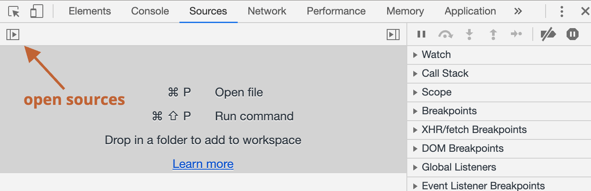

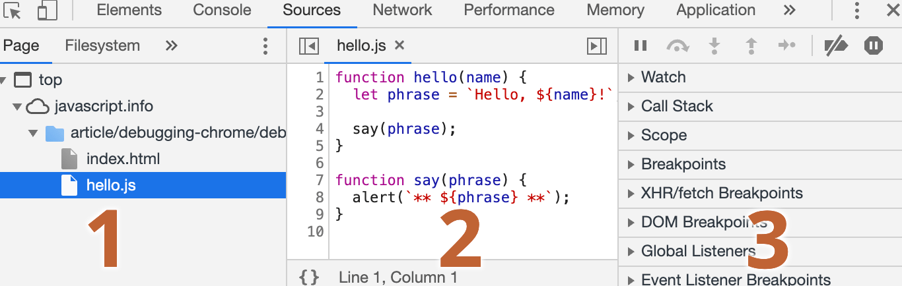

资源面板包含三个部分

1. **文件导航：** 该区域列出了 HTML、JavaScript、CSS 和包含图片在内的其他依附于次页面的文件，Chrome 扩展程序也会在这里显示
2. **代码编辑：** 该区域显示源码
3. **JavaScript 调试：** 该区域用于调试


**控制台（Console)**

在资源面板按下 `Esc` 会出现一个控制台，可以输入一些命令然后按下 `Enter` 来执行

在控制台中，语句执行完毕之后，其执行结果会显示在下面

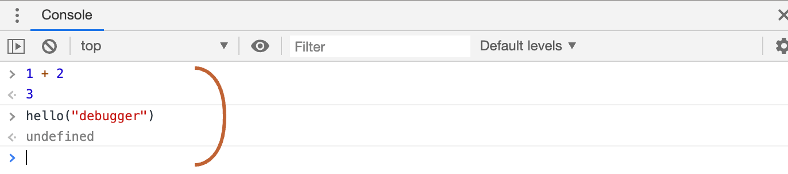


**断点（Breakpoints）**

通过点击在资源面板代码编辑区域的行号数字，可以设置一个断点

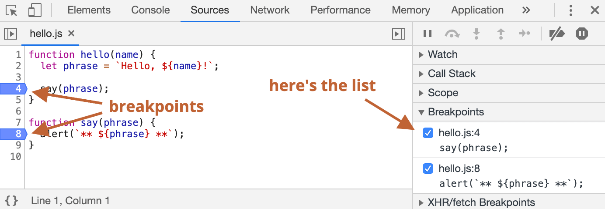

断点是调试器会自动暂停 JavaScript 执行的地方

当代码被暂停时，我们可以检查当前的变量，在控制台执行命令等等

可以在右侧的面板中找到断点的列表，当在数个文件中有许多的断点时，这是非常有用的，它允许我们：

- 快速跳转至代码中的断点（通过点击右侧面板中的对应的断点）
- 通过取消选中断点来临时禁用对应的断点
- 通过右键点击并选择移除来删除一个断点
- ......等等


**条件断点**

在行号上右键点击允许你创建一个条件断点，至于当给定了表达式（创建条件断点时提供的表达式）为真时才会被触发

当需要在特定的变量值或参数的情况下暂停程序的执行时，这种调试方式就很有用


**debugger 命令**

可以使用 `debugger` 命令来暂停代码

```js
function hello(name) {
  let phrase = `Hello, ${name}!`;
  
  debugger; // 调试器会在这里停止
  
  say(phrase);
}
```

**注意：** 这样的命令只有在开发者工具打开时才有效，否则浏览器会忽略它


**暂停并查看**

`hello()` 函数在页面加载期间被调用，因此激活调试器的最简单的方法（在外面已经设置了断电之后）就是重新加载页面，因此我们可以按下 `F5` （Windows, Linux）或 `Cmd+R`（Mac）

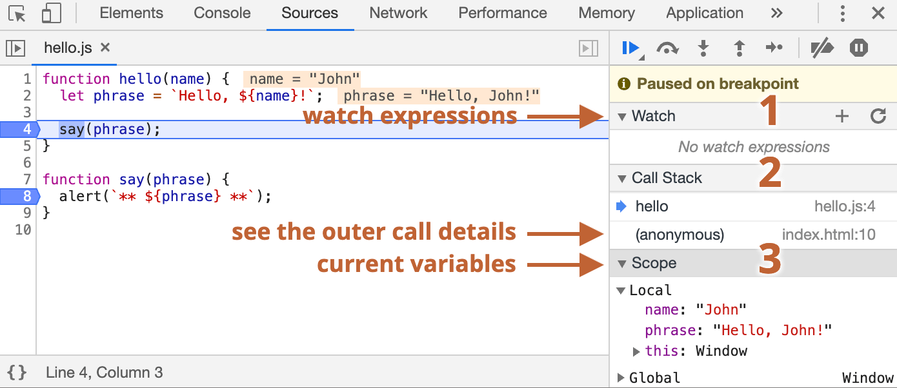

在右侧的信息下拉列表中，可以查看当前的代码状态

1. **监视（Watch）：** 显式任意表达式的当前值，通过点击 `+` 号然后输入一个表达式，调试器就会显示它的值，并在执行过程中自动重新计算表达式

2. **调用堆栈（Call Stack）：** 显示嵌套的调用链，上述图片中的调试器正在 `hello()` 的调用链中，被 `index.html` 中的一个脚本调用（这里没有函数，因此显示匿名(anonymous)，如果点击了其中一个堆栈项，调试器将跳到对应的代码处，并且还可以查看其所有变量

3. **作用域（Scope）：** 显式当前的变量

   `Local` 显式当前函数中的变量，可以在源代码编辑器中看到它们的值高亮显示了出来

   `Global` 显示全局变量（不在任何函数中）

   还有一个 `this` 关键字


**跟踪执行**

在右侧面板的顶部是一些关于追踪脚本的按钮


点击**继续执行按钮**，如果没有其它的断点，那么程序就会继续执行，并且调试器不会再控制程序


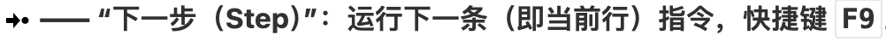

点击**下一步按钮**，运行下一条语句，一次只会执行一行语句


点击**跨步按钮**，与**下一步按钮类似**，如果下一条语句是函数调用则表现不同，这里的函数指的是：不是内建的函数，如 `alert` 函数等，而是我们自己写的函数

对比一下，**下一步命令**会进行嵌套函数调用并在第一行暂停执行，但是**跨步命令**会我们不可见的执行嵌套函数的调用，跳过了函数的内部，执行会在函数调用完成后立即暂停

如果对函数内部的执行不感兴趣，这个命令会很有用


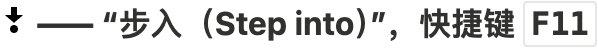

和**下一步命令**类似，但是在异步函数调用情况下表现不同，**下一步命令**会忽略异步行为，例如 `setTimeout`（计划的函数调用），它会过一段时间再执行，而**步入命令**会进入代码中并等待（如果需要）


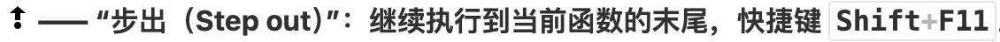

**步出命令**继续执行当前函数内的剩余代码，并暂停在调用当前函数的下一行代码处，当我们使用**下一步命令**偶然进入到一个嵌套调用中，但是有对这个函数不感兴趣时，可以使用**步出命令**会立马执行到函数的最后


这个按钮不会影响程序的执行，只是一个批量操作断点的开关


当启用此功能，如果开发者工具是开着的时候，任何脚本执行错误都会导致该脚本执行自动暂停，然后我们可以在调试器中分析变量来看一下什么出错了

当我们的脚步因为错误挂掉的时候，可以打开调试器，启用这个选项然后重新加载页面来看一下哪里导致它挂掉了和当时的上下文是什么

新版的 Chrome 已经没有了这个按钮，取而代之的是如下图的选项

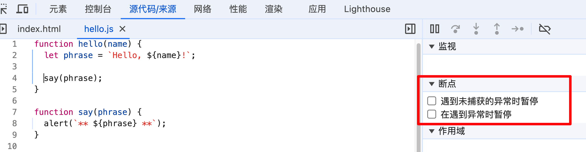


**Continue to here**

在启用调试模式的时候右键代码行才会有这个选项，可以让代码移动很多步到某一行为止，可以偷懒少打一个断点非常方便

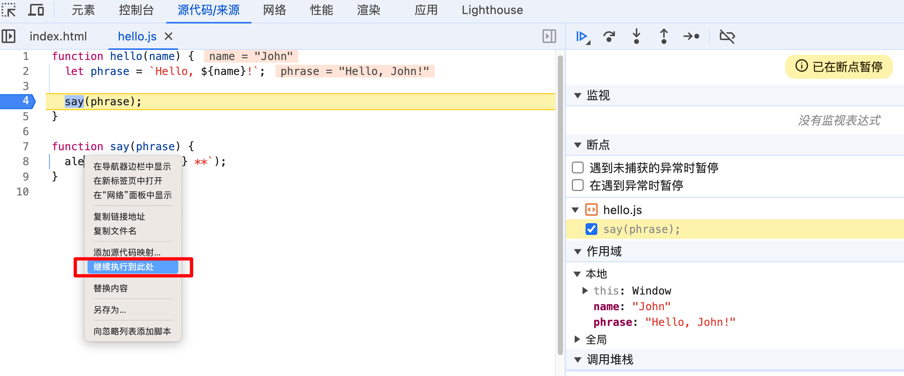


**日志记录**

想要输出一些东西在控制台上，可以使用 `console.log` 函数

```js
console.log('Hello World');
```

普通用户是看不到这个输出的，它在控制台里显示

打开控制台的两种方式

- 打开浏览器的开发者工具中的 Console（控制台）选项卡
- 在浏览器的开发者工具中的任意一个选项卡中按下 `Esc`，会在下方打开一个控制台

如果在代码中有足够的日志记录，那么可以从记录中看到刚才发生了什么，就不需要借助调试器了

Chrome 开发者工具详细的文档可以参考 https://developer.chrome.com/docs/devtools


**代码风格**

代码必须尽可能的清晰和易读

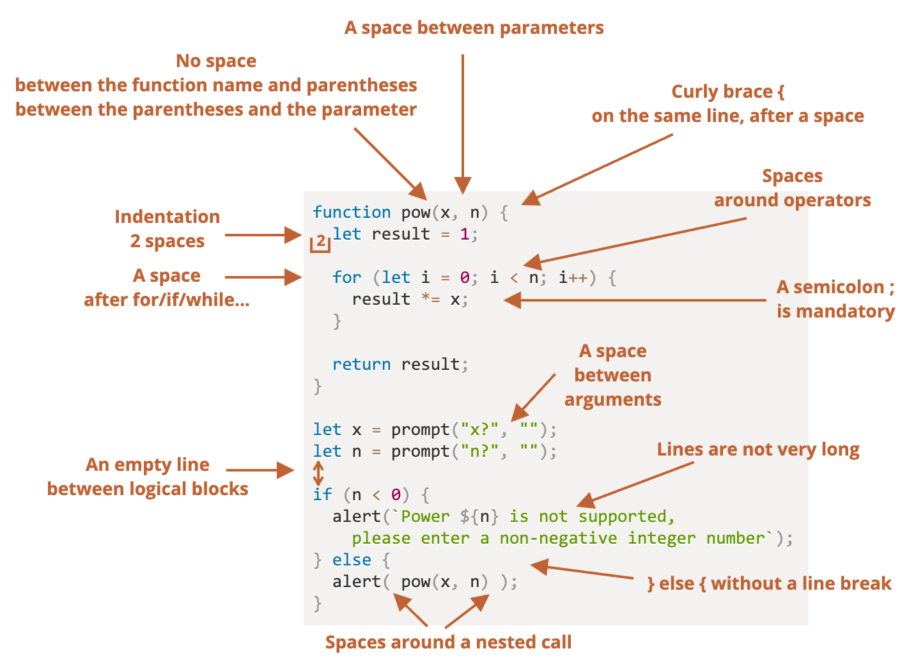


**花括号**

在大多数的 JavaScript 项目中，花括号以 ”Egyptian“ 风格，左花括号与相应的关键字在同一行上，额不是新起一行，左花括号前还应该有一个空格

```js
if (condition) {
  // do this
}
```

对于很短的代码，写成一行的可以接受的，但是代码块的方式通常更具有可读性


**行的长度**

没有人喜欢读一长串代码，最后将代码分割一下

```js
// 使用回勾引号 ` 允许将字符串拆分为多行
let str = `
  ECMA International's TC39 is a group of JavaScript developers,
  implementers, academics, and more, collaborating with the community
  to maintain and evolve the definition of JavaScript.
`;
```

对于 `if` 语句

```js
if(id === 123 &&
  moonPhase === 'Waning Gibbous' &&
  zodiacSign === 'Libra'
) {
  letTheSorceryBegin();
}
```

一行代码的最大长度应该在团队层面上达成一致，通常是 80 或 120 个字符


**缩进**

主要有两种类型的缩进

- 水平方向上的缩进：2 或 4 个空格

  一个水平缩进通常由 2 或 4 个空格或者 ”Tab“ 制表符（`Tab` 键）构成，如今空格更普遍一点

  选择空格而是 tabs 的优点之一是，这允许你做出比 ”Tab“ 制表符更加灵活的缩进配置

- 垂直方向上的缩进：用于将代码拆分为逻辑块的空行

  即使是单个函数通常也被分割为数个逻辑块，下面的示例中，初始化变量、主循环结构和返回值都被垂直分割了

  ```js
  function pow(x, n) {
    let result = 1;
    // <--
    for (let i = 0; i < n; i++) {
      result *= x;
    }
    // <--
    return result;
  }
  ```

  插入一个额外的空行有助于使代码更具可读性，写代码时，不应该出现连续超过 9 行都没有被垂直分割的代码


**分号**

每一个语句后面都应该有一个分号，即使它可以被跳过，但在 JavaScript 中，极少数的情况下，换行符有时不会被解释为分号


**嵌套的层级**

尽量避免代码嵌套层级过深

例如在循环中，有时候使用 `continue` 命令以避免额外的嵌套是一个好主意

不应该像下面这样添加嵌套的 `if` 条件

```js
for (let i = 0; i < 10; i++) {
  if (cond) {
    ...//
  }
}
```

可以写成这样

```js
for (let i = 0; i < 10; i++) {
  if (!cond) continue; 
  ... // 没有额外的嵌套
}
```

使用 `if/else` 和 `return` 也可以做类似的事情

```js
function pow(x, n) {
  if(n < 0) {
    alert('Negative "n" not supported');
  } else {
    let result = 1;
    
    for (let i = 0; i < n; i++) {
      result *= x;
    }
    
    return result;
  }
}
```

可以修改为如下代码，这样的代码更具有可读性，一旦条件通过检查，代码执行就可以进入 ”主“ 代码流，而不需要额外的嵌套了

```js
function pow(x, n) {
	if(n < 0) {
  	alert('Negative "n" not supported');
  	return;
	}
  
  let result = 1;

  for (let i = 0; i < n; i++) {
    result *= x;
  }

  return result;
}
```


**函数位置**

如果正在写几个 ”辅助“ 函数和一些使用它们的代码，那么有三种方式来组织这些函数

1. 在调用这些函数的代码的上方声明这些函数

   ```js
   // 函数声明
   function createElement() {
     ...
   }
   
   function setHandler(elem) {
     ...
   }
   
   function walkAround() {
     ...
   }
   
   // 调用函数的代码
   let elem = createElement();
   setHandler(elem);
   walkAround();
   ```

2. 先写调用代码，再写函数

   ```js
   // 调用函数的代码
   let elem = createElement();
   setHandler(elem);
   walkAround();
   
   // 函数声明
   function createElement() {
     ...
   }
   
   function setHandler(elem) {
     ...
   }
   
   function walkAround() {
     ...
   }
   ```

3. 混合，在第一次使用一个函数时，对该函数进行声明

**大多数情况下，第二种方式更好**，因为阅读代码时，我们首先想知道的是它做了什么，如果函数的定义先行，那么在整个程序的最开始就展示出了这些信息，可能我们不需要阅读这些函数了，尤其是它们的名字清晰地展示出了它们的功能的时候


**风格指南**

风格指南里包含了如何编写代码的通用规则，例如：使用哪个引号，用多少空格来缩进、一行代码最大长度等非常多的细节

当团队中所有的成员都使用相同的风格指南时，代码看起来将是统一的，无论是团队中谁写的，都是一样的风格

一些受欢迎的选择：

- [Google JavaScript 风格指南](https://google.github.io/styleguide/jsguide.html)
- [Airbnb JavaScript 风格指南](https://github.com/airbnb/javascript)
- [Idiomatic.JS](https://github.com/rwaldron/idiomatic.js)
- [StandardJS](https://standardjs.com/)


**自动检查器**

检查器是可以自动检查代码样式，并提出改进建议的工具

它们的妙处在于进行代码风格检查时，可以发现一些代码错误

以下是一些最出名的代码检查工具：

- [JSLint](https://www.jslint.com/) —— 第一批检查器之一
- [JSHint](https://www.jshint.com/) —— 比 JSLint 多了更多设置
- [ESLint](https://eslint.org/) —— 应该是最新的一个

大多数检查器都可以与编辑器集成在一起：只需要在编辑器中启用插件并配置代码风格即可


**注释**

通常通过注释来描述代码怎样工作和为什么这样工作


**糟糕的注释**

```js
// 这里的代码会先做这件事(……)，然后做那件事情(……)
// ……谁知道还有什么……
very;
complex;
code;
```

在好的代码中，这种 ”解释性“ 注释的数量应该是最少的，严格地来说，就算没有它们，代码也应该是很容易理解的

有一个很棒的原则：**如果代码不够清晰，以至于需要一个注释，那么或许它应该被重写**


**分解函数**

有时候用一个函数来代替一个代码片段是更好的

```js
function showPrimes(n) {
  nextPrime:
  for (let i = 2; i < n; i++) {

    // 检测 i 是否是一个质数（素数）
    for (let j = 2; j < i; j++) {
      if (i % j == 0) continue nextPrime;
    }

    alert(i);
  }
}
```

更好的变体，使用一个分解出来的函数 `isPrime`

```js
function showPrimes(n) {
  for (let i = 2; i < n; i++) {
    // 检测 i 是否是一个质数（素数）
    if (!isPrime(i)) continue;

    alert(i);
  }
}

function isPrime(n) {
	for (let j = 2; j < i; j++) {
		if (i % j == 0) return false;
	}
}
```

这样就很容易理解代码了，函数自己就变成了一个注释，这种代码被称为**自描述型**代码


**创建函数**

```js
// 在这里我们添加威士忌（译注：国外的一种酒）
for(let i = 0; i < 10; i++) {
  let drop = getWhiskey();
  smell(drop);
  add(drop, glass);
}

// 在这里我们添加果汁
for(let t = 0; t < 3; t++) {
  let tomato = getTomato();
  examine(tomato);
  let juice = press(tomato);
  add(juice, glass);
}

// ...
```

可以像下面这样，将上面的代码重构为函数

```js
addWhiskey(glass);
addJuice(glass);

function addWhiskey(container) {
  for(let i = 0; i < 10; i++) {
    let drop = getWhiskey();
    //...
  }
}

function addJuice(container) {
  for(let t = 0; t < 3; t++) {
    let tomato = getTomato();
    //...
  }
}
```

函数本身就可以告诉我们发生了什么，没有什么地方需要注释，分割之后代码的结构也更好了，每一个函数做什么，需要什么和返回什么都非常地清晰

实际上，不能完全避免 ”解释型“ 注释，例如在一些复杂的算法中，会有一些出于优化的目的而做的一些巧妙的 ”调整“，通常情况下，我们应该尽可能地保持代码的简单和 ”自我描述“ 性


**好的注释**

解释性注释通常来说都是不好的，哪一种注释才是好的呢？

- **描述架构**

  对组件进行高层次的整体概括，它们如何相互作用、各种情况下的控制流程是怎么什么样......简而言之就是代码的鸟瞰图，有一个专门用于构建代码的高层次架构图，以对代码进行解释的特殊编程语言 UML，值得去学习

- **记录函数的参数和用法**

  有一个专门用于记录函数的语法 JSDoc：用法、参数和返回值

  ```js
  /**
   * 返回 x 的 n 次幂的值。
   *
   * @param {number} x 要改变的值。
   * @param {number} n 幂数，必须是一个自然数。
   * @return {number} x 的 n 次幂的值。
   */
  function pow(x, n) {
    ...
  }
  ```

  这种注释可以帮助我们理解函数的目的，并且不需要研究其内部的实现代码，就可以直接正确地使用它

- **为什么任务以这种方式解决？**

  写了什么代码很重要，但是**为什么不那样写**可能对于理解正在发生什么更重要，为什么任务是通过这种方式解决的？代码并没有给出答案

- **代码有哪些巧妙的特性？它们被用在了什么地方？**

  如果代码存在任何巧妙和显而易见的方法，那绝对需要注释


**使用 Mocha 进行自动化测试**

自动化测试将被用于进一步的任务中，并且还将被广泛应用在实际项目中


**为什么需要测试？**

在写一个函数时，通常可以想象出它应该做什么：哪些参数会给出哪些结果

在开发期间，可以运行程序来检查它比将结果与预期进行比较

如果出了问题，那么我们会修复代码，然后再一次运行并检查结果，直到它工作为止

**当通过手动重新运行来测试代码时，很容易漏掉一些东西**，当我们在开发时，会保留很多可能需要的用例，但是不要想着程序员在每一次代码修改后都去检查所有的案例，这就很容易造成修复了一个问题却造成另一个问题的情况

**自动化测试意味着测试是独立于代码的。它们以各种方式运行我们的函数，并将结果与预期结果进行比较**


**行为驱动开发（BDD）**

BDD 包含了三部分内容：测试、文档和示例


**开发规范**

创建函数之前，想象函数应该做什么并且描述出来，这样的描述被称为规范，包含用例的描述以及针对它们的测试

```js
describe('pow', function() {
  it('raises to n-th power', function() {
    assert.equal(pow(2, 3), 8);
  });
});
```

一个规范包含三个主要的模块

`describe("title", function() { ... })`

表示我们正在描述的功能是什么，例子中我们正在描述函数 `pow`，用于组织 ”工人（workers）“ `it` 代码块

`it('use case description', function() { ... })`

`it` 里面的描述部分，我们以一种易于理解的方式描述特定的用例，第二个参数是用于对其进行测试的函数

`assert.equal(value1, value2)`

`it` 块中的代码，如果实现是正确的，它应该在执行的时候不产生任何错误

`assert.*` 函数用于检查 `pow` 函数是否按照预期工作，在这里使用了其中之一，`assert.equal`，它会对参数进行比较，如果它们不相等则会抛出一个错误，这里它检查了 `pow(2, 3)` 的值是否等于 `8`，还有其它类型的比较和检查

规范可以被执行，它将运行在 `it` 块中指定的测试


**开发流程**

1. 编写初始规范，测试最基本的功能
2. 创建一个最初始的实现
3. 检查它是否工作，运行测试框架来进行测试，当功能未完成时，将显示错误，持续修正直到一切都能工作
4. 现在有一个带有测试的能工作的初步实现
5. 增加更多的用例到规范中，获取目前的程序实现还不支持，无法通过测试
6. 回到第 3 步，更新程序直到测试不会抛出错误
7. 重复第 3 步到第 6 步，直到功能完善

开发就是不断地迭代，写规范，实现它，确保测试通过，然后写更多的测试，确保它们正常工作


**行为规范**

在教程中将使用以下的 JavaScript 库进行测试

- [Mocha](http://mochajs.org/) —— 核心框架：提供了包括通用型测试函数 `describe` 和 `it`，以及用于运行测试的主函数
- [Chai](http://chaijs.com/) —— 提供很多断言（assertion）支持的库。它提供了很多不同的断言，现在我们只需要用 `assert.equal`
- [Sinon](http://sinonjs.org/) —— 用于监视函数、模拟内建函数和其他函数的库，我们在后面才会用到它

这些库都既适用于浏览器端，也适用于服务器端，这里使用浏览器端的变体

```html
<!DOCTYPE html>
<html>
<head>
  <!-- add mocha css, to show results -->
  <link rel="stylesheet" href="https://cdnjs.cloudflare.com/ajax/libs/mocha/3.2.0/mocha.css">
  <!-- add mocha framework code -->
  <script src="https://cdnjs.cloudflare.com/ajax/libs/mocha/3.2.0/mocha.js"></script>
  <script>
    mocha.setup('bdd'); // minimal setup
  </script>
  <!-- add chai -->
  <script src="https://cdnjs.cloudflare.com/ajax/libs/chai/3.5.0/chai.js"></script>
  <script>
    // chai has a lot of stuff, let's make assert global
    let assert = chai.assert;
  </script>
</head>

<body>

  <script>
    function pow(x, n) {
      /* function code is to be written, empty now */
    }
  </script>

  <!-- the script with tests (describe, it...) -->
  <script src="test.js"></script>

  <!-- the element with id="mocha" will contain test results -->
  <div id="mocha"></div>

  <!-- run tests! -->
  <script>
    mocha.run();
  </script>
</body>

</html>
```

该页面可分为五个部分：

1. `<head>` —— 添加用于测试的第三方库和样式文件
2. `<script>` 包含测试函数，在上述例子中就是和 `pow` 相关的代码
3. 测试代码 —— 在上述代码中是名为 `test.js` 的脚本，包含上面 `describe('pow', ...)` 的那些代码
4. HTML 元素 `<div id="mocha">` 将被 Mocha 用来输出结果
5. 可以使用 `mocha.run()` 命令来开始测试


**初始实现**

为了通过测试，写一个简单的 `pow` 实现

```js
fucntion pow() {
  return 8; // 作弊实现
}
```

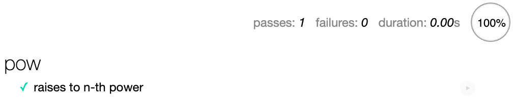


**改进规范**

只靠作弊通过测试，这样的函数是不起作用的，需要给它添加更多的测试用例

这里可以选择任意一种方式来组织测试代码

1. 第一种方式，在同一个 `it` 中再添加一个 `assert`

   ```js
   describe('pow', function () {
     it('raises to n-th power', function () {
       assert.equal(pow(2, 3), 8);
       assert.equal(pow(3, 4), 81);
     });
   });
   ```

   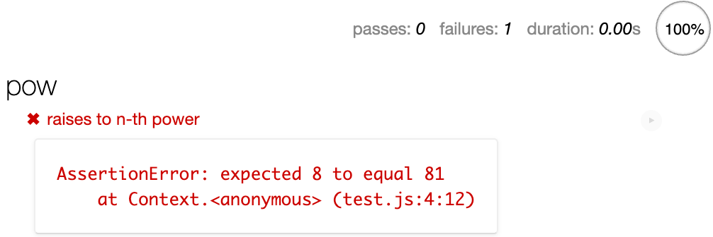

2. 第二种方式，写两个测试

   ```js
   describe("pow", function() {
     it("2 raised to power 3 is 8", function() {
       assert.equal(pow(2, 3), 8);
     });
   
     it("3 raised to power 4 is 81", function() {
       assert.equal(pow(3, 4), 81);
     });
   });
   ```

   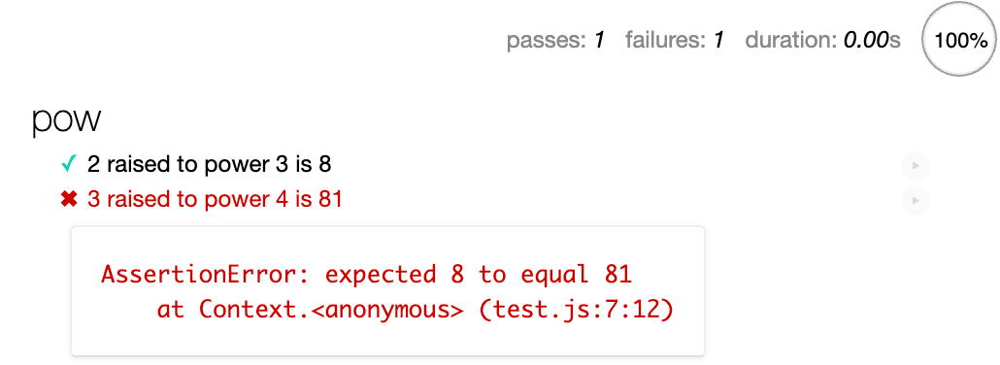

主要区别。当 `assert` 触发一个错误时，`it` 代码块会立即终止，因此在第一种方式中，如果第一个 `assert` 失败了，将永远不会看到第二个 `assert` 的结果

**保持测试之间独立，有助于获知代码中正在发生什么**，因此第二种方式更好一点

除此之外，还有一个规范值得遵循，**一个测试检查一个东西**，如果在看测试代码的时候，发现其中有两个相互独立的检查，那么最好将它拆分成两个更简单的检查


**改进实现**

写一些更加实际的代码来通过测试

```js
function pow(x, n) {
  let result = 1;
  
  for (let i = 0; i < n; i++) {
    result *= x;
  }
  
  return result;
}
```

为了确保函数可以很好地工作，使用更多值来测试它，除了手动编写 `it` 代码块，还可以使用 `for` 循环来生成它们

```js
describe('pow', function () {
  function makeTest(x) {
    let expected = x * x * x;
    it(`${x} in the power 3 is ${expected}`, function () {
      assert.equal(pow(x, 3), expected);
    });
  }

  for (let x = 0; x <= 5; x++) {
    makeTest(x);
  }
});
```

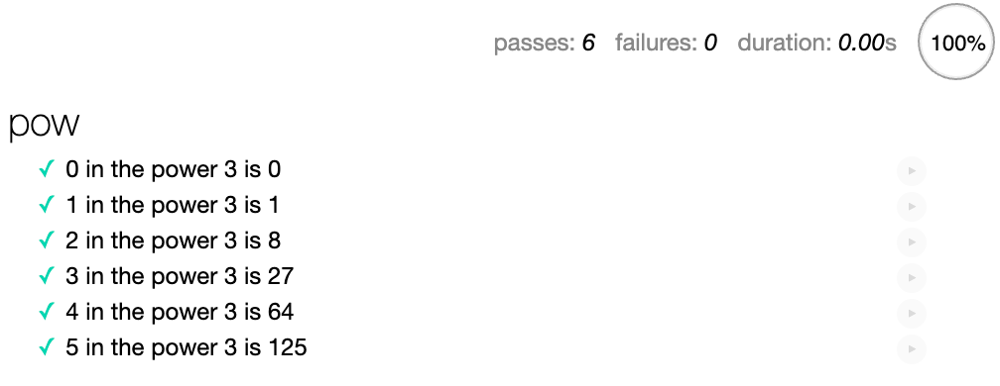


**嵌套描述**

在继续添加更多的测试之前，需要主要辅助函数 `makeTest` 和 `for` 应该被组合在一起，在其它测试中不需要 `makeTest`，只有在 `for` 循环中需要它，它们共同的任务就是检查 `pow` 是如何自乘至给定的幂次方

使用嵌套的 `describe` 来进行分组

```js
describe('pow', function() {
  describe('raises x to power 3', function() {
    function makeTest(x) {
      let expected = x * x * x;
      it(`${x} in the power 3 is ${expected}`, function() {
        assert.equal(pow(x, 3), expected);
      });
    }
    
    for (let x = 1; x <=5; x++) {
      makeTest(x);
    }
  });
  
  // ... 可以在这里写更多的测试代码，describe 和 it 都可以添加在这里
});
```

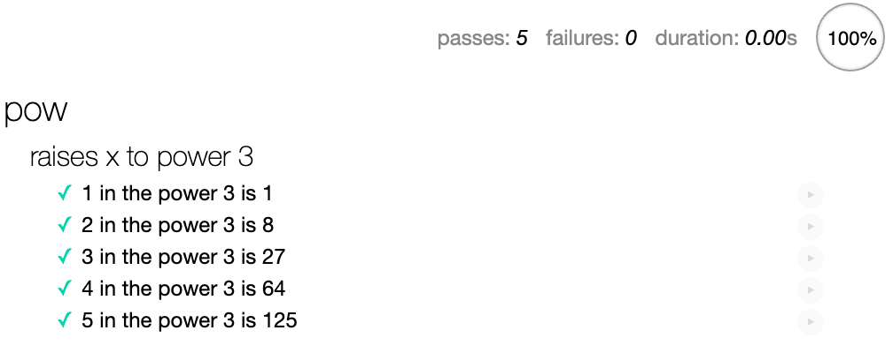

未来可以在顶级域中使用 `it` 和 `describe` 的辅助函数添加更多的 `it` 和 `describe`，它们不会看到 `makeTest`


**`before/after` 和 `beforeEach/afterEach`**

可以设置 `before/after` 函数来在运行测试之前/之后执行，也可以使用 `beforeEach/afterEach` 函数来设置在执行每一个 `it` 之前/之后执行

```js
describe('test', function() {
  before(() => alert('Testing started - before all tests'));
  after(() => alert('Testing finished - after all tests'));
  
  beforeEach(() => alert('Before a test - enter a test'));
  afterEach(() => alert('After a test - exit a test'));
  
  it('test 1', () => alert(1));
  it('test 2', () => alert(2));
})
```

运行顺序为

```
'Testing started - before all tests' (before)
'Before a test - enter a test' (beforeEach)
1
'After a test – exit a test' (afterEach)
'Before a test - enter a test' (beforeEach)
2
'After a test – exit a test' (afterEach)
'Testing finished – after all tests' (after)
```

通常，`before/after` 和 `beforeEach/afterEach` 被用于执行初始化，清零计数器或做一些介于每个测试（或测试组）之间的事情


**延伸规范**

前面的例子的第一次迭代开发完成了，函数 `pow(x, n)` 适用于正整数 `n`

JavaScript 函数通常会返回 `NaN` 以表示一个数学错误，接下对无效的 `n` 值执行相同的操作

```js
describe("pow", function() {
  // ...

  it("for negative n the result is NaN", function() {
    assert.isNaN(pow(2, -1));
  });

  it("for non-integer n the result is NaN", function() {
    assert.isNaN(pow(2, 1.5));
  });
});
```

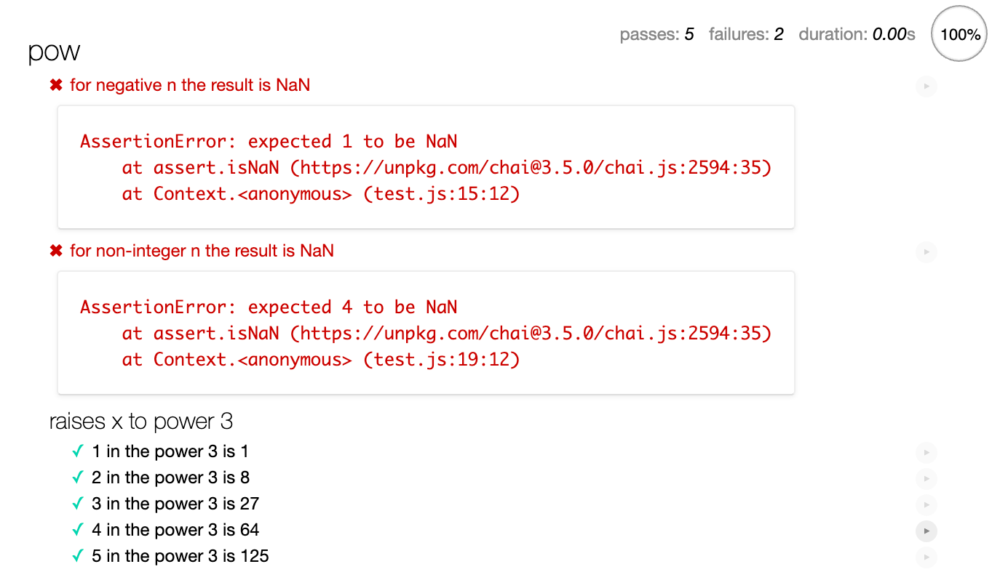

新加的测试失败了，因为目前的实现是不支持它们的，**这就是 BDD 的做法，首先写一些暂时无法通过的测试，然后去实现它们**

给 `pow` 增加几行实现

```js
function pow(x, n) {
  if (n < 0) return NaN;
  if (Math.round(n) != n) return NaN;

  let result = 1;

  for (let i = 0; i < n; i++) {
    result *= x;
  }

  return result;
}
```

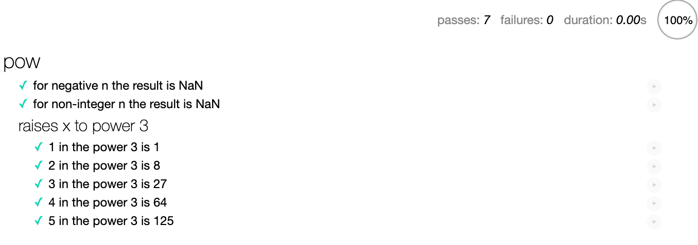


**Polyfill 和转译器**

JavaScript 语言在稳步发展中，会定期出现一些对语言的新提议，它们会被进行分析讨论，如果认为有价值，就会被加入到 https://tc39.github.io/ecma262/  的列表中，然后被加到 [规范](http://www.ecma-international.org/publications/standards/Ecma-262.htm) 中

JavaScript 引擎背后的团队关于首先要实现什么有他们自己的想法，可能会决定执行草案中的建议，并推迟已经在规范中的内容，因为它们不太有趣或者难以实现

一个 JavaScript 引擎只能实现标准中的一部分是很常见的情况

可以通过 https://compat-table.github.io/compat-table/es6/ 查看语言特性当前支持的状态

如果让现代的代码在还不支持最新特性的旧引擎上工作，有两个工作可以做到这一点

1. 转译器（Transpilers）
2. 垫片（Polyfills）


**转译器（Transpilers）**

转译器是一种可以将源码转译成另一种源码的特殊的软件，它可以解析现代代码，并使用旧的语法结构对其进行重写，进而使其在旧的引擎中工作

例如在 ES2020 之前就没有空值合并运算符 `??`，如果访问者使用了过时的浏览器访问页面，浏览器就可能不明白 `height = height ?? 100` 这段代码的含义

转译器会分析我们的代码，并将 `height ?? 100` 重写为 `(height !== undefined && height !== null) ? height : 100`

```js
// 在运行转译器之前
height = height ?? 100;

// 在运行转译器之后
height = (height !== undefined && height !== null) ? height : 100;
```

现在重写了的代码适用于更旧版本的 JavaScript 引擎，通常开发者会在自己的计算机上运行编译器，然后将转译后的代码部署到服务器

[Babel](https://babeljs.io/) 是最著名的转译器之一，现代项目构建系统，例如 [Webpack](https://webpack.js.org/)，提供了在每次代码更改时自动运行转译器的方法，因此很容易将代码转译集成到开发过程中


**垫片（Polyfills）**

新的语言特性可能不仅包括语法结构和运算符，还可能包括内建函数

例如，`Math.trunc(n)` 是一个 “截断” 数字小数部分的函数，例如 `Math.trunc(1.23)` 返回 `1`

在一些非常过时的 JavaScript 引擎中没有 `Math.trunc` 函数，所以这样的代码会执行失败

因为这个讨论的是新函数，而不是语法更改，因此不需要在此转译任何内容，只需要声明缺失的函数

更新/添加新函数的脚步被称为 “polyfill”，它 “填补” 了空白并添加了缺失的实现，以下是 `Math.trunc` 的 polyfill 的一个实现它的脚本

```js
if(!Math.trunc) { // 如果没有这个函数
  Math.trunc = function(number) {
    // Math.ceil 和 Math.floor 甚至存在于上古年代的 JavaScript 引擎中
    return number < 0 ? Math.ceil(number) : Math.floor(number);
  };
}
```

JavaScript 是一种高度动态的语言，脚步可以添加/修改任何函数，甚至包括内建函数

两个有趣的 polyfill 库

- [core js](https://github.com/zloirock/core-js) 支持了很多特性，允许只包含需要的特性
- [polyfill.io](http://polyfill.io/) 提供带有 polyfill 的脚本的服务，具体取决于特性和用户的浏览器