# 现代 JavaScript 教程笔记

教程地址：https://zh.javascript.info


## JavaScript 简介

浏览器中嵌入了 JavaScript 引擎，有时也被称作 “JavaScript 虚拟机”，不同的引擎有不同的代号

- [V8](https://en.wikipedia.org/wiki/V8_(JavaScript_engine)) —— Chrome、Opera 和 Edge 中的 JavaScript 引擎
- [SpiderMonkey](https://en.wikipedia.org/wiki/SpiderMonkey) —— Firefox 中的 JavaScript 引擎
- ……还有其他一些代号，像 “Chakra” 用于 IE，“JavaScriptCore”、“Nitro” 和 “SquirrelFish” 用于 Safari，等等


**引擎工作的基本原理**

1. 引擎（如果是浏览器，则引擎被嵌入在其中）读取（“解析”）脚本
2. 引擎将脚本转化（“编译”）为机器语言
3. 机器代码快速地执行

引擎会对流程中的每个阶段都进行优化。它甚至可以在编译的脚本运行时监视它，分析流经该脚本的数据，并根据获得的信息进一步优化机器代码

​	

**开发者控制台**

Google Chrome 中按下 `F12` 键，如果你使用 Mac，使用 `Command+option+J`

在浏览器控制台中按 `Enter`，这行代码会立即执行，如果要插入多行代码，需要按 `Shift+Enter` 进行换行


## Javascript 基础知识

**script 标签**

`script` 标签几乎可以将 JavaScript 程序插入到 HTML 文档的任何位置


**现代的标记**

`script` 标签有一些现在很少用到的特性(attribute)，但是我们可以在老代码中找到它们

- `type` 特性： `<script type=…>`

  在老的 HTML4 标准中，要求  ` script` 标签有 `type` 特性。通常是 `type="text/javascript"`，目前已经不再需要了

- `language` 特性：`<script language=…>`

  这个特性是为了显示脚本使用的语言，这个特性现在已经没有任何意义，因为语言默认就是 JavaScript，目前已经不再需要了


**脚本前后的注释**

```html
<script type="text/javascript"><!--
    ...
//--></script>
```

现代 JavaScript 中已经不这样使用了。这些注释是用于不支持 `<script>` 标签的古老的浏览器隐藏 JavaScript 代码的


**外部脚本**

一般来说，只有最简单的脚本才嵌入到 HTML 中，复杂的脚本放在单独的文件中，使用独立文件的好处是浏览器会下载它，然后将它保存到浏览器的缓存中

如果设置了 `src` 特性，`script` 标签内容将会忽略

```html
<script src="file.js">
  alert(1); // 此内容会被忽略，因为设定了 src
</script>
```


**代码结构**

通常，每条语句独占一行，以提高代码的可读性

```js
alert('Hello');
alert('World');
```


**分号**

当存在换行符时，在大多数情况下可以省略分号

```js
alert('Hello');
alert('World');
```

但存在 JavaScript 无法确定是否真的需要自动插入分号的情况

```js
alert("Hello")

[1, 2].forEach(alert);
```

对于引擎来说会被解析为如下代码

```js
alert("Hello")[1, 2].forEach(alert);
```

以上代码回先输出 `Hello`，随后报错

**注意：** 即使语句被换行符分隔了，但还是推荐在语句的末尾加上分号


**注释**

多行注释 `/*  */` 不支持注释嵌套

```js
/*
  /* 嵌套注释 ?!? */
*/
alert( 'World' );
```

以上代码运行报错

注释虽然会增加代码总量，但这一点也不是什么问题。有很多工具可以帮你在把代码部署到服务器之前缩减代码


**现代模式，"use strict"**

2009 年 ECMAScript 5 (ES5) 的出现，ES5 规范增加了新的语言特性并且修改了一些已经存在的特性，为了保证旧的功能能够使用，大部分的修改是默认不生效的。需要使用特殊指令 `'use strict'` 来明确激活这些特性

- 放在脚本文件的顶部

  ```js
  'use strict';
  // 代码以现代模式工作
  ...
  ```

- 放在函数体的开头

  ```js
  // 严格模式没有激活
  ...
  
  function demo() {
    'use strict';
    // 代码以现代模式工作
  	...
  }
  
  // 严格模式没有激活
  ...
  ```


**注意：** 必须确保 `'use strict'` 出现在最顶部，否则现代模式可能无法启用

```js
alert('some code');
// 下面的 "use strict" 会被忽略，必须在最顶部

'use strict';
// 严格模式没有被激活
```

**注意：** 没有类似 `'no use strict'` 这样的指令，一旦进入现代模式，就没有办法回退

在使用浏览器控制台运行代码时，它默认是不启动 `'use strict'` 的，需要先输入 `'use strict'` 再使用 `Shift+Enter`  换行输入代码以启用现代模式

现代 Javascript 支持 `class` 和 `module` 高级语言结构，使用它们会自动启动 `'use strict'`，无需手动添加 `'use strict'` 命令

一般来说推荐在文件头部加上 `'use strict'`，当代码都写在了 `class` 和 `module` 中时，可以将 `'use strict'` 代码忽略掉


**变量**

为了更好的可读性，推荐一行只声明一个变量

```js
let user = 'John';
let age = 25;
let message = 'Hello';
```

或者对一行声明的多个变量换行

```js
let user = 'John',
  age = 25,
  message = 'Hello';
```

在老的脚本中可能会遇到声明变量使用的关键字是 `var` 而不是 `let`，`var` 与 `let` 大体相同，但是也存在一些差异，推荐使用 `let` 来定义变量


**变量命名限制**

Javascript 变量命名有如下两个限制：

1. 变量名称必须仅包含字母、数字、符号 `$` 和 `_`
2. 首字符必须非数字

如果变量名包含多个单词，推荐采用驼峰命名法，单词一个接着一个，除了第一个单词，其它单词都以大写字母开头

在 Javascript 中是**区分变量单词大小写**的，`apple` 和 `Apple` 表示不同的两个变量


**允许非英文字母，但不推荐**

可以使用任何语言，包括西里尔字母（cyrillic letters）甚至是象形文字

```js
let имя = '...';
let 我 = '...';
```

这样的命名虽然完全允许，但是英文进行变量命名是国际惯例


**保留字**

有一张 [保留字列表](https://developer.mozilla.org/en-US/docs/Web/JavaScript/Reference/Lexical_grammar#Keywords)，这张表中的保留字无法用作变量命名，因为它们被用于编程语言本身了


**常量**

声明一个常数（不变）变量，可以使用 `const` 而非 `let`，当尝试修改 `const` 声明的变量，就会发现报错

当确定这个变量永远不会改变的时候，就可以使用 `const` 来确保这种行为


**大写形式的常数**

普遍的做法是将常数用作别名，以便记住这些执行之前就已知的难以记住的值

使用大写字母和下划线来命名这些常量

```js
const COLOR_RED = '#F00';
const COLOR_GREEN = '#0F0';
const COLOR_BLUE = '#00F';
const COLOR_ORANGE = '#FF7F00';

// 当我们需要选择一个颜色
let color = COLOR_ORANGE;
alert(color); // #FF7F00
```

好处：

- `COLOR_ORANGE` 比 `'#FF7F00'` 更容易记忆
- 比起 `COLOR_ORANGE` 而言，`'#FF7F00'` 更容易输错
- 阅读代码时，`COLOR_ORANGE` 比 `'#FF7F00'` 更易懂


**什么时候为常数使用大写命名，什么时候进行常规命名？**

- 大写命名：在常数执行之前就已知了

  ```js
  const COLOR_RED = '#F00';
  ```

- 常规命名：和变量命名一样，多个单词采样驼峰命名，在执行期间被计算出来的，但是赋值之后就不会改变

  ```js
  const pageLoadTime = /* 网页加载所需的时间 */;
  ```

  `pageLoadTime` 的值在页面加载之前是未知的，所以采用常规命名。但是它仍然是个常量，因为赋值之后不会改变

大写命名的常量仅用作“硬编码（hard-coded）”值的别名


**正确命名变量**

一个变量名应该有一个清晰、明显的含义，对其存储的数据进行描述

命名变量最好遵循以下规则

- 使用易读的命名，比如 `userName` 或者 `shoppingCart`
- 远离 `a`、`b`、`c` 这种缩写和短名称，除非真的知道在做什么
- 变量名在能够准确描述变量的同时要足够简洁，不好的例子是 `data` 和 `value`，如果可以非常明显的从上下文中知道数据和值所表达的含义，这样使用也是可以的
- 脑海中术语要和团队保持一致，如如果网站的访客称为“用户”，则我们采用相关的变量命名，比如 `currentUser` 或者 `newUser`，而不要使用 `currentVisitor` 或者一个 `newManInTown`


**重用变量还是新建变量？**

如果重用现有的变量而不是新建变量，会导致变量像被扔进不同东西的盒子，这样会在调试代码的时候损失数十倍时间

额外声明变量是利大于弊的，现代的 JavaScript 压缩器和浏览器都会对代码进行很好的优化，所以不会产生性能问题，为不同的值使用不同的变量可以帮助引擎对代码进行优化


**数据类型**

JavaScript 中有 8 种基本的数据类型，其中 7 种是原始类型，另外一种是引用类型

JavaScript 是动态类型的语言，在定义变量之后不会被限制为某一数据类型


**Number 类型**

*number* 类型表示整数和浮点数，除了常规的数字，还包含三个特殊值 `Infinity`、`-Infinity` 和 `NaN`

- `Infinity` 在数学概念中代表无穷大，是一个比任何数字都大的特殊值，可以通过除以 0 来得到它

  ```js
  alert(1 / 0); // Infinity
  ```

  或者在源码中直接使用

  ```js
  alert(Infinity); // Infinity
  ```

- `NaN` 代表一个计算错误，它是一个不正确或者未定义的数据操作所得到的结果

  ```js
  alert('not a number'/ 2); // NaN
  ```

  `NaN` 是粘性的，任何对 `NaN` 的进一步数学运算都会返回 `NaN`

  ```js
  alert( NaN + 1 ); // NaN
  alert( 3 * NaN ); // NaN
  alert( "not a number" / 2 - 1 ); // NaN
  ```

  **注意：** 在数学表达式中有一个 `NaN`，会被传播到最终结果，除了 `NaN ** 0` 的结果为 `1`


**BigInt 类型**

在 JavaScript 中，*number* 类型无法安全地表示大于 `(2^53-1)`（即 `9007199254740991`），或小于 `-(2^53-1)` 的整数

更准确来说，*number* 类型可以存储更大的整数（最多 `1.7976931348623157 * 10^308`），但超出安全整数范围 `±(2^53-1)` 会出现**精度问题**，因为并非所有数字都适合固定的 64 位存储，因此，**可能存储的是“近似值”**

```js
console.log(9007199254740991 + 1); // 9007199254740992
console.log(9007199254740991 + 2); // 9007199254740992
```

也就是说，所有大于 `(2^53-1)` 的奇数都不能用 *number* 类型存储

*BigInt* 类型表示任意长度的整数，通过将 `n` 附加到整数字段的末尾来创建 `Bigint` 值

```js
// 尾部的 "n" 表示这是一个 BigInt 类型
const bigInt = 1234567890123456789012345678901234567890n;
```

**注意：** 目前主流的浏览器已经支持了 `BigInt` 类型，但是 IE 还没有


**String 类型**

  在 JavaScript 中，有三种包含字符串的方式

  1. 双引号：`"Hello"`
  2. 单引号：`'Hello'`
  3. 反引号：```Hello` ``

双引号和单引号都是简单的引用，在 JavaScript 中两者几乎没有什么差别

反引号是扩展功能引号，允许我们将变量和表达式包装在 `${...}` 中，来把它们嵌入到字符串中

```js
let name = 'CodePencil';

// 嵌入一个变量
alert( `Hello, ${name}!` ); // Hello, John!

// 嵌入一个表达式
alert( `the result is ${1 + 2}` ); // the result is 3
```

`${...}` 表示式会被计算，计算结果会成为字符串的一部分

**注意：** 在  JavaScript 中没有 *character* 类型，只有一种 *string* 类型，一个字符串可以包含零个(为空)、一个或多个字符串


**Boolean 类型（逻辑类型）**

*boolean* 类型只包含两个值：`true` 和 `false`


**null 值**

特殊的 `null` 值不属于上述的任何一种类型，它构成了一个独立的类型，只包含 `null` 值

```js
let age = null;
```

在 JavaScript 中的 `null` 不是一个对不存在的 `object` 的引用或者空指针

JavaScript 中的 `null` 仅仅是一个代表 "无"、"空" 或 "值未知的" 特殊值


**undefined 值**

特殊值 `undefined` 和 `null` 一样都是自成类型，`undefined` 含义是未被赋值

如果一个变量已被声明，但是未被赋值，那么它的值就是 `undefined`

```js
let age;

alert(age); // 弹出 "undefined"
```

也可以将显式地将 `undefined` 赋值给变量

```js
let age = 100;

// 将值修改为 undefined
age = undefined;

alert(age); // "undefined"
```

**注意：** 不建议这样做，通常使用 `null` 将一个空或者未知的值写入变量中，而 `undefined` 则保留作为未进行初始化的事物默认初始值


**Object 类型和 Symbol 类型**

*object* 类型是一个特殊的类型

其它所有的数据类型都被称为 "原始类型"，因为它们的值值包含一个单独的内容，相反，*object* 类型则用于存储数据集合和更复杂的实体

*symbol* 类型用于创建对象的唯一标识符


**typeof 运算符**

typeof 运算符返回参数的类型

```js
typeof undefined; // "undefined"

typeof 0; // "number"

typeof 10n; // "bigint"

typeof true; // "boolean"

typeof "foo"; // "string"

typeof Symbol('id'); // "symbol"

typeof Math; // "object"

typeof null; // "object"

typeof alert; // "function"
```

**注意：**

1. `Math` 是一个提供数学运算的内建 `object`
2. `typeof null` 的结果为 `object`，这是官方承认的 `typeof` 的错误，这个问题来自于 JavaScript 语言的早期阶段，并为了兼容保留了下来，`null` 绝对不是一个 `object`，`null` 有自己的类型，它是一个特殊值，`typeof` 的行为在这里是错误的
3. `typeof alert` 的结果是 `"function"`，因为 `alert` 在 JavaScript 语言中是一个函数，因为 JavaScript 语言中没有一个特别的 *function* 类型，函数隶属于 *object* 类型，但 `typeof` 对函数区分对待，并返回 `"function"`，这也是来自于 JavaScript 语言早期的问题，虽然这种行为不正确，但在实际编程中却非常方便

`typeof(x)` 语法

`typeof(x)` 与 `typeof x` 相同，`typeof` 是一个操作符，不是一个函数，这里的括号不是 `typeof` 的一部分，它是数学运算分组的括号

```js
typeof(2 + 2);
```

这样写允许 `typeof` 运算符和其他参数之间不打空格，`typeof(x)` 和 `typeof x` 两种功能相同，但 `typeof x` 语法更常见


**alert**

会显示一条消息，并等待用户按下 OK

```js
alert('Hello');
```

弹出带有信息的小窗口被称为模态窗，"modal" 意味着用户不能与页面的其它部分进行交互，直到他们处理完模态窗，以上情况只有当用户点击确定按钮才算处理完模态窗


**prompt**

prompt 函数接收两个参数

```js
const result = prompt(title,[default]);
```

`title` 显式给用户的文本

`default` 可选的第二个参数，指定 input 框的初始值

访问者可以在提示输入栏中输入一些内容，然后按确定键之后可以在 `result` 中获得该文本，或者他们可以按 `Esc` 键取消输入，然后可以得到 `null` 作为 `result`

**注意：** 在 IE 浏览器中会提供默认值 `"undefined"`，如果不提供第二个参数，IE 浏览器会把 `"undefined"` 插入到 prompt，为了 prompt 在 IE 浏览器中有好的效果，**建议始终提供第二个参数**

```js
const result = prompt('Hello','');
```


**confirm**

```js
const result = confirm(question);
```

`question` 用于显示确认模态窗口的问题文本

`confirm` 函数会显示一个带有 `question` 以及确定和取消两个按钮的模态窗口，点击确定时会返回 `true`，点击取消时会返回 `false`

```js
const result = confirm('请问你是否满18岁？');
alert(result);
```


**alert、prompt、confirm 的限制**

1. 模态窗口的确切位置由浏览器决定，通常在页面中心
2. 窗口的外观也取决于浏览器，我们不能修改它


**类型转换**

大多数情况下，运算符和函数会自动将赋予它们的值转换为正确的类型

例如在 `alert` 中，任何值都会转化为字符串以进行显示

算数运算符会将值转换为数字


**字符串转换**

`alert(value)` 会将 value 转换为 *string* 类型，然后显示这个值

也可以使用 `String(value)` 来将 `value` 转化为字符串类型

```js
let value = true;
alert(type of value); // boolean

value = String(value);
alert(typeof value); // string
```


**数字型转换**

在算数函数和表达式中，会自动进行 *number* 类型转换

```js
console.log('6' / '2'); // 3
```

也可以使用 `Number(value)` 显式地将 `value` 转换为 *number* 类型

```js
let str = '123';

alert(typeof str); // string

let num = Number(str);
alert(typeof num); // number
```

如果当字符串不是一个有效的数字，转换结果会是 `NaN`

```js
let age = Number('Hello World');
alert(age); // NaN，转换结果失败
```

*number* 类型的转换规则：

| 值                | 转换结果                                                     |
| ----------------- | ------------------------------------------------------------ |
| `undefined`       | `NaN`                                                        |
| `null`            | `0`                                                          |
| `true` 和 `false` | `1` 和 `0`                                                   |
| `string`          | 去掉首尾空白字符(空格、换行符 \n、制表符 \t 等) 后的纯数字字符串中含有的数字。如果剩余字符串为空，则结果为 `0`，否则就会从剩余字符串中读取数字，当类型转换出现 error 时返回 `NaN` |

```js
alert(Number('   123   ')); // 123
alert(Number('123z')); // NaN(从字符串中读取数字，读到'z'时出现错误)
alert(Number(true)); // 1
alert(Number(false)); // 0
```


**布尔型转换**

它发生在逻辑运算中，也可以通过 `Boolean(value)` 显式地进行转换

`boolean` 型的转换规则

- 直观上为空的值(如 `0`、空字符串、`null`、`undefined` 和 `NaN`) 都将变为 `false`
- 其他值变为 `true`

```js
alert(Boolean(1)); // true
alert(Boolean(0)); // false

alert(Boolean('Hello')); // true
alert(Boolean('')); // false
```

**注意：** 包含 0 的字符串 `'0'` 是 `true`

在一些其它的编程语言例如 `PHP` 中视 `'0'` 为`false`

```js
alert(Boolean('0')); // true
alert(Boolean('   ')); // true(任何非空字符串都是)
```


**术语：“一元运算符”，“二元运算符”，“运算元”**

- **运算元：** 运算符应用的对象，例如：`5 * 2`，有两个运算元：左运算元 `5` 和 右运算元 `2`，有时也叫运算元为 “参数”

- 如果一个运算符对应的只有一个运算元，那么它是**一元运算符**

  ```js
  let x = 1;
  x = -x;
  alert(x); // -1，一元负号运算符生效
  ```

- 如果一个运算符拥有两个运算元，那么它是**二元运算符**，减号存在二元运算符形式

  ```js
  let x = 1, y = 3;
  alert(y - x); // 2，二元运算符减号做减法运算
  ```


**数学运算**

支持以下数学运算

- 加法 `+`
- 减法 `-`
- 乘法 `*`
- 除法 `/`
- 取余 `%`
- 求幂 `**`


**取余 %**

取余运算符是 `%`，`a % b` 的结果是 `a` 整除 `b` 的余数

```js
alert(5 % 2); // 1
alert(8 % 3); // 2
```


**求幂 ****

求幂运算 `a ** b` 将 `a` 提升至 `a` 的 `b` 次幂

```js
alert(2 ** 2); // 4
alert(2 ** 3); // 8
alert(2 ** 4); // 16
```

像数学运算中一样，幂等运算也适用于非整数

```js
alert(4 ** (1 / 2)); // 2 (4 的 1/2 次方)
alert(8 ** (1 / 2)); // 3 (8 的 1/3 次方)
```


**用二元运算符 + 连接字符串**

在 JavaScript 中 `+` 可以用来连接两个字符串

```js
const s = 'Hellow' + 'World';
alert(s);
```

只有有一个运算元是字符串，另一个运算元也会被转换为字符串

```js
alert('1' + 2); // '12'
alert('2' + 1); // '21'
```

运算符是按顺序工作的，第一个 `+` 将两个数字相加，然后再跟后面的字符串 `1` 连接成一个字符串

```js
alert(2 + 2 + '1'); // '41'
```

**注意：** 二元 `+` 是唯一一个以这种方式支持字符串的运算符，其它运算符只对数字起作用，并且总是将其运算元转换为数字

```js
alert(6 - '2'); // 4，将 '2' 转换为数字
alert('6' / '2'); // 3 将两个运算元都转化为数字
```


**数字转化，一元运算符 + **

一元运算符 `+` 应用于单个值，但是对数字没任何作用，如果运算元不是数字，加号 `+` 会将其转换为数字

```js
const x = 1;
alert(+x); // 1，对数字无效

const y = -2;
alert(+y); // -2

// 转化非数字
alert(+true); // 1
alert(+''); // 0
```

它的效果和 `Number(...)` 相同，但是更加简短


**运算符优先级**

如果表达式拥有超过一个运算符，执行顺序则由**优先级**决定，具体可以参考 MDN 的[优先级表](https://developer.mozilla.org/en-US/docs/Web/JavaScript/Reference/Operators/Operator_precedence#table)

| 优先级 | 名称     | 符号 |
| :----- | :------- | :--- |
| …      | …        | …    |
| 15     | 一元加号 | `+`  |
| 15     | 一元负号 | `-`  |
| 14     | 求幂     | `**` |
| 13     | 乘号     | `*`  |
| 13     | 除号     | `/`  |
| 12     | 加号     | `+`  |
| 12     | 减号     | `-`  |
| …      | …        | …    |
| 2      | 赋值符   | `=`  |
| …      | …        | …    |


**赋值运算符**

赋值运算符的优先级非常的低，所有的计算先执行，然后 `=` 才执行

```js
let x = 2 * 2 + 1;
alert(x); // 5
```


**赋值 = 返回一个值**

在 JavaScript 中，所有运算符都会返回一个值，对于运算符 `=` 也是如此

```js
let a = 1;
let b = 2;

let c = 3 - (a = b + 1);

alert(a); // 3
alert(c); // 0
```

上述例子中 `a = b + 1` 先把计算结果 `3` 赋值给了 `a`，然后再返回 `a` 的值参与计算

**注意：** 不推荐写这样的代码，因为这样写不会使代码变得更清晰或可读


**链式赋值**

```js
let a, b, c;
a = b = c = 2 + 2;

alert(a); // 4
alert(b); // 4
alert(3); // 4
```

链式赋值是从右到左进行计算的，首先是对最右边的表达式 `2 + 2` 求值，然后再将其赋值给左边的变量 `c`、`b` 和 `a`，使得最后虽有变量共享一个值

为了可读性，建议把上述代码分成几行

```js
let a, b, c;
c = 2 + 2;
b = c;
a = c;

alert(a); // 4
alert(b); // 4
alert(3); // 4
```


**原地修改**

对一个变量做运算，并将新的结果存储在同一个变量中

```js
let n = 2;
n = n + 5;
n = n * 2;
```

可以使用 `+=` 和 `*=` 来缩写这种表示

```js
let n = 2;
n += 5; // n = 7
n *= 2; // n = 14

alert(n); // 14
```

这类运算符的优先级与普通赋值运算符的优先级相同，它们在大多数其他运算之后执行

```js
let n = 2;

n *= 3 + 5;

alert(n); // 16 (右边部分先计算，等同于 n *= 8)
```


**自增/自减**

- 自增 `++` 将变量与 1 相加

  ```js
  let counter = 2;
  counter++; // 效果跟 counter += 1 一样，但是更简洁
  alert(counter); // 3
  ```

- 自减 `--` 将变量与 1 相减

  ```js
  let counter = 2;
  counter--; // 效果跟 counter -= 1 一样，但是更简洁
  alert(counter); // 1
  ```

**注意：** 自增/自减只能应用于变量，应用于数值(例如 `5++` ) 会报错


运算符 `++` 和 `--` 可以置于变量前，也可以置于变量之后

- 当运算符置于变量后，被称为 “后置形式”：`counter++`
- 当运算符置于变量前，被称为 “前置形式”：`++counter`

两者都做同一件事情，将变量 `counter` 与 `1` 相加，但两者也有区别，只有当使用 `++/--` 的返回值时才有区别

- 前置形式会返回一个新值

  ```js
  let counter = 1;
  let a = ++counter;
  
  alert(a); // 2
  ```

- 后置形式会返回原来的值

  ```js
  let counter = 1;
  let a = counter++;
  
  alert(a); // 1
  ```


**自增/自减和其它运算符的对比**

`++/--` 的优先级比绝大部分的算数运算符要高

```js
let counter = 1;
alert(2 * ++counter); // 4
```

从技术层面上来说是可行的，但是这样的写法会降低代码的可阅读性，建议采用 “一行一个行为” 的模式

```js
let counter = 1;
counter++;
alert(2 * counter); // 4
```


**位运算符**

位运算符把运算元当做 32 位整数，并在它们的二进制表现形式上操作

有以下几个的位运算符：

- 按位与 ( `&` )
- 按位或 ( `|` )
- 按位异或 ( `^` )
- 按位非 ( `~` )
- 左移 ( `<<` )
- 右移 ( `>>` )
- 无符号右移 ( `>>>` )

以上运算符很少被使用，一般是在需要对最低级别（位）上操作数字时才使用，在 Web 开发中很少使用，但在一些特殊领域例如密码学，很有用，可以阅读 MDN 上的 [位操作符](https://developer.mozilla.org/en-US/docs/Web/JavaScript/Guide/Expressions_and_operators#bitwise_operators)


**逗号运算符**

逗号运算符 `,` 是最少见最不常使用的运算符之一，有时候它会被用来写更简短的代码

逗号运算符能让我们处理多个表达式，使用 `,` 将它们分开，每个表达式都运行了，但是只有最后一个结果被返回

```js
let a = (1 + 2, 3 + 4);

alert(a); // 7 (3 + 4 的结果)
```

**注意：** `,` 运算符的优先级非常低，比 `=` 还低，所以上面例子中的圆括号非常重要，上面的例子如果不加括号，`let a = 1 + 2, 3 + 4` 就会先执行 `+`，将数值相加得到 `a = 3, 7`，然后赋值运算符 `=` 执行 `a = 3`，然后逗号之后的数值 `7` 不会再执行，它被忽略掉了

为什么需要一个这样的运算符，它只返回最后一个值呢？

有时候，会有使用它把几个行为放在一行上来进行复杂运算

```js
// 一行上有三个运算符
for(a = 1, b = 3, c = a * b; a < 10; a++) {
  ...
}
```


**值的比较**

在 JavaScript 中，值的比较编写方式如下

- 大于/小于：`a > b`，`a < b`
- 大于等于/小于等于：`a >= b`，`a <= b`
- 检查两个值的相等：`a == b`
- 检查两个值不相等：`a != b`


**字符串比较**

比较字符串大小时，Javascript 会使用 “字典” 或 “词典” 顺序进行判定，字符串是按字符(母)逐个进行比较的

```js
alert('Z' > 'A'); // true
alert('Glow' > 'Glee'); // true
alert('Bee' > 'Be'); // true
```

字符串的比较算法

1. 首先比较两个字符串的首字符大小
2. 如果一方字符较大(或较小)，则该字符串大于(或小于)另一个字符串，算法结束
3. 否则，如果两个字符串的首位字符相等，则继续取出两个字符串各自的后一位字符进行比较
4. 重复上述步骤进行比较，直到比较完成某字符串的所有字符为止
5. 如果两个字符串的字符同时用完，那么则判断它们相等，否则未结束(还有未比较的字符)的字符串更大

**注意：** 字符串比较并非真正的字典顺序，而是 Unicode 编码顺序


**不同类型间的比较**

当不同类型的值进行比较时，Javascript 会首先将其转换为数字(number)再判定大小

```js
alert('2' > 1); // true，字符串 '2' 会被转化为数字 2
alert('01' == 1);  // true，字符串 '01' 会被转化为数字 1
```


对于布尔类型值来说，`true` 会被转化为 `1`，`false` 会被转化为 `0`

```js
alert(true == 1); // true
alert(false ==	0); // true
```


**严格相等**

普通相等性检查 `==` 存在一个问题，就是它不能区分出 `0` 和 `false`

```js
alert(0 == false); // true
```

也无法区分空字符串和 `false`

```js
alert('' == false); // true
```

因为在比较不同类型的值时，处于相等判断符号 `==` 两侧的值会被优先转化为数字。空字符串和 `false` 也是如此，转化后它们都为数字 `0`


**严格相等运算符 `===` 在进行比较时不会做任何的类型转换**

如果 `a` 和 `b` 属于不同的数据类型，那么 `a === b` 不会做任何的类型转换而是立即返回 `false`

```js
alert(0 === false); // false，因为比较值的类型不同
```

同样的，与 “不相等” 符号 `!=` 类似，“严格不相等” 表示为 `!==`


**对 null 和 undefined 进行比较**

当使用严格相等 `===` 比较两者时，不相等，因为它们属于不同的类型

```js
alert(null === undefined); // false
```

当使用非严格相等 `==` 比较两者时

```js
alert(null === undefined); // true
```

在 JavaScript 中存在一个特殊的规则，会判定它们相等，只会等于对方为不会等于其他任何的值

当使用数字式或其他比较方法 `< > <= >=` 时

`null/undefined` 会被转换为数字：`null` 会被转化为 `0`，`undefined` 被转化为 `NaN`


**当 null 和 0 进行比较时**

```js
alert(null > 0); // false
alert(null == 0); // false
alert(null >= 0); // true
```

会出现这样的原因是，在进行值的比较时，会先把 `null` 转换为数字，所以它被转化为了 `0`，所以第三行的结果是 `true`，而第一行的结果是 `false`，因为 `undefined` 和 `null` 在相等性检查中 `==` 不会进行任何的类型转换，它们有自己独立的比较规则，所以第二行返回的是 `false`


**特立独行的 undefined**

`undefined` 不应该被用于与其他值进行比较

```js
alert(undefined > 0); // false
alert(undefined < 0); // false
alert(undefined == 0); // false
```

第一行和第二行都返回 `false` 是因为 `undefined` 被转换为了 `NaN`，而 `NaN` 与任何值进行比较都会返回 `false`

第三行返回 `false` 是因为这是一个相等性检查，而 `undefined` 只与 `null` 相等，不会与其他值相等


**避免问题**

- 除了严格相等 `===` 外，但凡涉及 `undefined/null` 参与的比较，需要格外的小心
- 除非清楚自己在做什么，否则永远也不要使用 `>= < > <=` 去比较一个可能为 `null/undefined` 的变量，按需要分别检查它的取值情况


**if 语句**

建议每次使用 `if` 语句都使用大括号 `{}` 来包装代码块，即使只有一条语句，这样可以提高代码可读性


**布尔转换**

`if` 语句会计算括号内的表达式，并将计算结果转换为布尔型

计算规则按照类型转换中的规则

- 数字 `0`、空字符串 `''`、`null`、`undefined` 和 `NaN` 都会被转换为 `false`，它们都被称为 “假值(falsy)”
- 其他值都会被转化为 `true`，所以它们被称为 “真值（truthy)”

```js
if(0) { // 0 是假值 (falsy)
	...
}
```

```js
if(1) { // 1 是真值 (truthy)
  ...
}
```


**else 语句**

`if` 语句会包含一个可选的 `else` 块，如果判断条件不成立，就会执行它内部的代码

```js
const year = prompt('ECMAScript-2015发布于哪一年?','');

if(year == 2015) {
  alert('回答正确');
} else {
  alert('回答错误');
}
```


**多个条件 else if**

当测试一个条件的几个变体时，可以通过 `else if` 子句实现

```js
const year = prompt('ECMAScript-2015发布于哪一年?','');

if(year < 2015) {
  alert('太早了');
} else if(year > 2015) {
  alert('太晚了');
} else {
  alert('正确!');
}
```


**条件运算符 ?**

有时需要根据一个条件去赋值一个变量

使用 `if` 语句

```js
let accessAllowed;
let age = prompt('你几岁了？','');

if(age > 18) {
  accessAllowed = true;
} else {
  accessAllowed = false;
}

alert(accessAllowed)
```

使用三元运算符 `?`

```js
let age = prompt('你几岁了？','');
let accessAllowed = (age > 18) ? true : false;

alert(accessAllowed);
```

**注意：** 此处括号不是必须的，但是使用括号可以使代码的可读性更强，建议使用

上面的例子也可以不使用问号运算符，比较本身就会返回 `true/false`

```js
let accessAllowed = age > 18;
```


**多个 ?**

使用一系列问号 `?` 运算符可以返回一个取决于多个条件的值

```js
const age = prompt('age?', 18);

const message = (age < 3) ? '你好，宝宝!':
	(age < 18) ? '你好，孩子!':
	(age < 100) ? '你好!':
	'多么不寻常的年龄!';

alert(message);
```


**逻辑运算符**

在 JavaScript 中有四个逻辑运算符 `||` (或)、`&&` (与)、`!` (非)、`??` (空值合并运算符)

虽然它们被称为 “逻辑” 运算符，但是这些运算符却可以被应用于任意类型的值，而不仅仅是布尔值，它们的结果也可以是任意类型


**||（或）**

两个竖线符号表示 “或” 运算符

```js
const result = a || b;
```

在传统的编程中，逻辑或仅能够操作布尔值，如果参与运算的任意一个参数为 `true`，返回的结果就为 `true`，否则返回 `false`

在 JavaScript 中，逻辑运算符更加灵活强大

- 操作数是布尔值的时候

  ```js
  alert(true || true); // true
  alert(false || true); // true
  alert(true || false); // true
  alert(false || false); // false
  ```

  除了两个操作数都是 `false` 的情况，结果都是 `true`

- 如果操作数不是布尔值，那么它将会转化为布尔值参与运算

  数字 `1` 被作为 `true` 处理，数字 `0` 被作为 `false` 处理

  ```js
  if(1 || 0) { // 工作原理相当于 if(true || false)
    alert('truthy!');
  }
  ```


**或运算寻找第一个真值**

给定多个参与或运算的值

```js
const result = value1 || value2 || value3;
```

或运算 `||` 做了如下的事情

- 从左到右依次计算操作数
- 处理每一个操作数时，都将其转化为布尔值，如何结果是 `true`，就停止计算，返回这个操作数的初始值
- 如果所有的操作数都被计算过（也就是，转换结果为 `false`），则返回最后一个操作数

返回的值是操作数的初始形式，不会做布尔转换

**简单来说就是一个或 `||` 的链，将会返回第一个真值，如果不存在真值就会返回该链的最后一个值 **

```js
alert(1 || 0); // 1（1 是真值）

alert(null || 1); // 1（1 是第一个真值）
alert(null || 0 || 1); // 1（1 是第一个真值）

alert(undefined || null || 0); // 0（都是假值，返回最后一个值）
```

- 获取变量列表或表达式中第一个真值
  ```js
  let firstName = '';
  let lastName = '';
  let nickName = 'SuperCoder';
  
  alert(firstName || lastName || nickName || 'Anonymous'); // SuperCoder
  ```

- 短路求值

  如果操作数不仅仅是一个值，而是一个有副作用的表达式，例如变量复制或函数调用

  ```js
  true || alert('你好世界');
  false || alert('你好世界');
  ```

  第一行运算符 `||` 在遇到了 `true` 时，立即停止运算，所以 ` alert` 没有运行，利用该特性在左侧的条件为假时才执行命令


**&&（与）**

两个 `&` 符号表示 `&&` 与运算符

```js
const result = a && b;
```

在传统的编程中，当两个操作数都是真值时，与运算返回 `true`，否则返回 `false`

- 操作数是布尔值的时候

  ```js
  alert(true && true); // true
  alert(false && true); // false
  alert(true && false); // false
  alert(false && false); // false
  ```

- 如果操作数不是布尔值，那么它将会转化为布尔值参与运算

  数字 `1` 被作为 `true` 处理，数字 `0` 被作为 `false` 处理

  ```js
  if(1 && 0) { // 作为 true && false 来执行
    alert('结果是假值');
  }
  ```


**与运算寻找第一个假值**

给定多个参与与运算的值

```js
const result = value1 && value2 && value3;
```

与运算  `&&` 做了如下的事情

- 从左到右依次计算操作数
- 在处理每一个操作数时，都将其转化为布尔值，如果结果是 `false`，就停止计算，并返回这个操作数的初始值
- 如果所有操作数都被计算过（例如都是真值)，则返回最后一个操作数

**简单来说就是一个或 `&&` 的链，将会返回第一个假值，如果不存在假值就会返回该链的最后一个值** 

```js
alert(1 && 0); // 0（返回第一个假值）
alert(1 && 5); // 5（返回最后一个值）

alert(null && 5); // null（返回第一个假值）
alert(0 && '你好世界'); // 0
```


**注意：** 与运算 `&&` 在 或运算 `||` 之前进行，与运算 `&&` 的优先级比或运算 `||` 要高

所以代码 `a && b || c && d` 等价于 `(a && b) || (c && d)`


**不要使用 `||` 或 `&&` 来取代 `if`**

```js
let x = 1;

(x > 0) && alert('大于0');
```

`&&` 右边的代码只有运算抵达到那里才能被执行。也就是只有当 `(x > 0)` 为真

可以等价于

```js
let x = 1;

if(x > 0) alert('大于0');
```


**!（非）**

感叹符号 `!` 表示布尔非运算符

```js
let result = !value;
```

逻辑非运算符接收一个参数，并按照如下运作

1. 将操作数转化为布尔类型：`true/false`
2. 返回相反的值

```js
alert(!true); // false
alert(!0); // true
```

可以用两个非运算符 `!!` 来将某个值转化为布尔类型

```js
alert(!!'non-empty string'); // true
alert(!!null); // false
```

**注意：** 非运算符 `!` 的优先级在所有逻辑运算符里最高，所以它总是在 `&&` 和 `||` 之前执行


**空值合并运算符  ??**

空值合并运算符的写法为两个问号 `??`

由于它对待 `null` 和 `undefined` 的方式类似，为了简洁起，可以说当一个值既不是 `null` 也不是 `undefined` 时，我们将其称为 “已定义的（defined）”

`a ?? b` 的结果是

- 如果 `a` 是已定义的，则结果是 `a`
- 如果 `a` 不会已定义的，则结果是 `b`

可以使用三元运算符实现一个等价的效果

```js
const result = (a !== null && a !== undefined) ? a : b;
```

`??` 常见的使用场景是提供默认值

```js
let user;

alert(user ?? '匿名'); // 匿名（user 未定义）
```

当 `user` 定义时

```js
let user = 'John';

alert(user ?? '匿名'); // John（user 已定义）
```

想使用这些变量之一显示用户名时，如果这些变量的值都是 `null/undefined`，则显示匿名

```js
let firstName = null;
let lastName = null;
let nickName = 'Supercoder';

alert(firstName ?? lastName ?? nickName ?? '匿名'); // Supercoder
```


**与 || 比较**

或运算符 `||` 可以与 `??` 运算符相同的方式使用

```js
let firstName = null;
let lastName = null;
let nickName = 'Supercoder';

alert(firstName || lastName || nickName || '匿名'); // Supercoder
```

在 JavaScript 的发展史中，或 `||` 运算符是先于 `??` 出现的，它在 JavaScript 诞生时就存在了

它们直接的重要区别是：

- `||` 返回第一个真值
- `??` 返回第一个已定义的值

也就是说，`||` 无法区分 `false`、`0`、空字符串 `''` 和 `null/undefined`，它们都是假值

不过在实际中，只想在变量的值为 `null/undefined` 时使用默认值

```js
let height = 0;

alert(height || 100); // 100
alert(height ?? 100); // 0
```


**优先级**

`??` 运算符的优先级和 `||` 相同，这意味着空值合并运算符在 `=` 和 `?` 运算前计算，但在大多数其他运算（例如 `+` 和 `*`）之后计算，所以可能需要再这样的表达式中添加括号

```js
let heigth = null;
let width = null;

let area = (height ?? 100) * (width ?? 50);

alert(area); // 5000
```


**?? 与 && 或 || 一起使用**

出于安全原因，JavaScript 禁止将 `??` 运算符与 `&&` 和 `||` 运算符一起使用，除非使用了括号明确指定了优先级

下面的代码会触发一个语法错误

```js
let x = 1 && 2 ?? 3; // Syntax error
```

可以明确使用括号来解决这个问题

```js
let x = (1 && 2) ?? 3;

alert(x); // 2
```


**while 循环**

```js
while(condition) {
  // 循环体代码
}
```

例子：以下循环输出 `i < 3` 的 `i` 值

```js
let i = 0;
while(i < 3) { // 依次显示 0、1 和 2
  alert(i);
  i++;
}
```

循环的单次执行叫做**一次迭代**，上面示例中的循环进行了三次迭代

如果上述示例中没有 `i++`，那么循环理论上会永远重复执行下去。实际上，浏览器提供了阻止种循环的方法，我们可以通过终止进程，来停掉服务器端的 JavaScript

任何表达式或变量都可以是循环条件，而不仅仅是比较，在 `while` 中的循环条件会被计算，计算结果会被转化为布尔值

例如，`while(i != 0)` 可简写为 `while(i)`

```js
let i = 3;
while(i) { // 当 i 变成 0 时，条件为假，循环终止
  alert(i);
  i++;
}
```

**注意：** 如果循环体只有一条语句，可以省略大括号 `{...}`

```js
let i = 3;
while(i) alert(i--);
```


**do...while 循环**

使用 `do...while` 语法可以将条件检查移至循环体下面

```js
do {
  // 循环体
} while(condition);
```

循环先执行循环体，然后检查条件，当条件为真时，重复执行循环体

例如：

```js
let i = 0;
do {
  alert(i);
  i++;
} while(i < 3);
```

这种形式的语法很少使用，不管条件是否为真，循环体都至少执行一次


**for 循环**

```js
for(begin; condition; step) {
  // 循环体
}
```

示例：

```js
for(let i = 0; i < 3; i++) { // 结果为 0、1、2
  alert(i);
}
```

1. `let i = 0;` 进入循环时执行一次
2. `i < 3;` 每次循环迭代之前检查，如果为 `false`，则停止循环
3. `alert(i);` 执行循环体中的语句
4. `i++` 每次循环体迭代后执行

**注意：** 计数变量 `i` 是在循环中声明的，这叫做 “内联” 声明变量，这样的变量只在循环中可见

```js
for(let i = 0; i < 3; i++) {
  alert(i); // 0, 1, 2
}
alert(i); // 错误，没有这个变量
```

除了定义一个变量，还可以使用现有的变量

```js
let i = 0;

for(i = 0; i < 3; i++) {
  alert(i); // 0, 1, 2
}

alert(i); // 3 可见，因为是在循环体之外声明的
```


**省略语句段**

`for` 循环的任何语句段都可以被省略

- 在循环开始是不需要做任何事，就可以省略 `begin` 语句段

  ```js
  let i = 0;
  
  for(; i < 3; i++) {
    alert(i); // 0, 1, 2
  }
  ```

- 也可以移除 `step` 语句段

  ```js
  let i = 0;
  for(; i < 3;) {
    alert(i++);
  }
  ```

实际上可以删除所有内容，从而创建一个无限循环

```js
for(;;) {
  // 无限循环
}
```

**注意：** `for` 中的两个 `;` 必须存在，否则会出现语法错误


**跳出循环**

通常条件为假时，循环会终止

但可以随时使用 `break` 指令强制退出

```js
let sum = 0;

while(true) {
  const value = +prompt('输入一个数字', '');
  
  if(!value) break; // 只有当用户输入空行或取消输入时，才会激活 break命令，它会立即终止循环，将控制权传递给循环后的第一行，即 alert
  
  sum +=value;
}

alert('总和：' + sum);
```


**继续下一次迭代**

`continue` 指令是 `break` 的 “轻量版”，它不会停掉整个循环，停止当前这一次的迭代，并强制启动新一轮循环（如果条件允许的话)

```js
for(let i = 0; i < 10; i++) {
  // 如果为真，跳过循环体的剩余部分
  if(i % 2 === 0) continue;
  
  alert(i); // 1,3,5,7,9
}
```

以上代码利用 `continue` 来只输出奇数


**禁止 `break/continue` 在 ? 的右边**

非表达式的语法结构不能与三运运算符 `?` 一起使用，特别是 `break/continue` 这样的指令是不允许这样使用的

```js
if(i > 5) {
  alert(i);
} else {
  continue;
}
```

使用问号重写

```js
(i > 5) ? alert(i) : continue; // continue 不允许在这个位置
```

代码会停止运行，并显示有语法错误

这是不（建议）使用问号 `?` 运算符替代 `if` 语句的另一个原因


**break/continue 标签**

有时候需要从一次多层嵌套的循环中跳出来

```js
for(let i = 0; i < 3; i++) {
  for(let j = 0; i < 3; j++) {
    const input = prompt(`坐标的值 (${i},${j})`,'');
    // 如果想从这里退出并直接执行 alert('Done!')
  }
}

alert('Done!');
```

如果只是使用 `break` 只会打破内部的循环，但这还不够，这时标签可以实现这一功能

标签是在循环之前带有冒号的标识符

```js
labelName: for(...) {
  ...
}
```

通过使用 `break <labelName>` 语句跳出循环至标签处

```js
outer: for(let i = 0; i < 3; i++) {
  for(let j = 0; i < 3; j++) {
    const input = prompt(`坐标的值 (${i},${j})`,'');
    // 如果想从这里退出并直接执行 alert('Done!')
    if(!input) break outer;
  }
}

alert('Done!');
```

上述代码中，`break outer` 向上寻找名为 `outer` 的标签并跳出当前循环

因此控制权转至了 `alert('Done!')`

也可以将标签移至单独一行

```js
outer:
for(let i = 0; i < 3; i++) {...}
```

`continue` 指令也可以与标签一起使用，在这种情况下，执行跳转到标记循环的下一次迭代


**注意：** 标签不允许 “跳到” 所有位置

标签不允许跳到代码的任意位置

```js
break label; // 跳转至下面的 label 处(无效)
label: for(...)
```

`break` 命令必须在代码块内，从技术上讲，任何被标记的代码块都有效

```js
label: {
  // ... 
  break label; // 有效
	// ...
}
```

99.9% 的情况下 `break` 都是被用在循环内，`continue` 只有在循环内部才可行


**switch 语句**

`switch` 语句可以替代多个 `if` 判断

```js
switch(x) {
  case 'value1': // if(x === 'value1')
    ...
    [break]
  case 'value2': // if(z === 'value2')
    ...
    [break]
  default: 
    ...
    [break]
}
```

- 比较 `x` 值与第一个 `case`（也就是 `value1`) 是否严格相等，然后比较第二个 `case` (`value2`) 以此类推
- 如果相等，`switch` 语句就执行相应 `case` 下的代码块，直到遇到最近的 `break` 语句（或者直到 `switch` 语句末尾）
- 如果没有符合的 `case`，则执行 `default` 代码块（如果 `default` 存在）

**注意：** 如果没有 `break`，程序将不经过任何检查就会继续执行下一个 `case`

无 `break` 的例子

```js
let a = 2 + 2;

switch(a) {
  case 3:
    alert('太小');
  case 4:
    alert('准确的');
  case 5:
    alert('太大');
	default:
		alert('我不知道这样的值');
}
```

上面的例子中会看到连续执行的三个 `alert`

```js
alert('准确的');
alert('太大');
alert('我不知道这样的值');
```


**任何表达式都可以成为 `switch/case` 的参数**

```js
let a = '1';
let b = 0;

switch(+a) {
  case b + 1:
  	alert("this runs, because +a is 1, exactly equals b+1");
    break;
  default:
    alert("this doesn't run");
}
```

这里 `+a` 返回 `1`，这个值跟 `case` 中的 `b + 1` 相比较，然后执行对应的代码


**case 分组**

共享一段代码的几个 `case` 分支可以被分为一组

例如想让 `case3` 和 `case5` 执行相同的代码

```js
let a = 3;

switch(a) {
  case 4:
    alert('Right!');
    break;
  case 3:
  case 5:
    alert('Wrong!');
    alert('Why don't you take a math class?');
    break;
  default:
    alert('The result is strange. Really.');
}
```

这段代码中 `3` 和 `5` 都显示相同的信息


**类型很关键**

在 `switch` 语句中的相等都都是严格相等，被比较的值必须是相同的类型才能进行匹配

相当于 `if` 语句中 `===`


**函数**

函数是程序主要的构建模块，可以使一段代码可以被调用很多次，且不需要写重复的代码

有很多内建的函数，例如 `alert(message)`、`prompt(message,default)` 和 `confirm(question)`，我们也可以创建自己的函数


**函数声明**

使用函数声明创建函数

```js
function name(parameter1, parameter2, ... parameterN) {
  ...body...
}
```

`function` 关键字首先出现，然后是函数名，然后是括号之间的参数列表（用逗号分隔，在上述示例中为空)，最后是花括号之间的代码（即 “函数体”)

函数可以通过名称调用 `name()`

例如：

```js
function showMessage() {
  alert('Hello World!')
}
showMessage(); // 调用 showMessage() 执行函数体中的代码
showMessage();
```

以上代码调用了 `showMessage` 函数两次，演示了函数的目的之一：避免代码重复


**局部变量**

在函数中声明的变量只在该函数内部可见

```js
function showMessage() {
  let message = "Hello, I'm JavaScript!"; // 局部变量
  alert(message);
}
showMessage(); // Hello,I'm JavaScript!
alert(message); // 错误！变量是函数的局部变量
```


**外部变量**

函数可以访问外部变量

```js
let userName = 'John';

function showMessage() {
  let messaghe = 'Hello, ' + userName; // 可以访问外部变量
  alert(message);
}

showMessage(); // Hello, John
```

函数对外部变量拥有全部的访问权限，函数也可以修改外部变量

```js
let userName = 'John';

function showMessage() {
  userName = 'Bob'; // 改变外部变量
  let message = 'Hello, ' + userName;
  alert(message);
}

alert(userName); // John 在函数调用之前

showMessage();

alert(userName); // Bob 值被函数修改了
```

只在没有局部变量的情况下才会使用外部变量

如果在函数内部声明了同名变量，那么函数会遮蔽外部变量，在下面的代码中，函数使用局部的 `userName`，而外部变量被忽略

```js
let userName = 'John';

function showMessage() {
  let userName = 'Bob'; // 声明一个局部变量
  
  let message  = 'Hello, ' + userName; // Bob
  alert(message);
}

// 函数会创建并使用它自己的 userName
showMessage();

alert(userName); // John，未被更改，函数没有访问外部变量
```


**全局变量**

任何函数之前声明的变量，都被称为全局变量

全局变量在任意函数中都是可见的（除非被局部变量遮蔽）

减少全局变量的使用是一种很好的做法，现代的代码有很少甚至没有全局变量，大多数变量存在于它们的函数中，但是有时候，全局变量能够用于存储项目级别的数据


**参数**

可以通过参数将任意数据传递给函数

```js
function showMessage(from, text) {
  alert(from + ': ' + text);
}

showMessage('Ann', 'Hello!'); // Ann: Hello!
showMessage('Ann', "What's up?"); // Ann: What's up?
```

在给函数传递参数调用时，给定值被复制到了局部变量 `from` 和 `text`，然后函数使用它们进行计算

在函数内部修改参数的值，在函数外部是看不到更改的，因为函数修改的是复制的变量值副本

```js
function showMessage(from, text) {
  from = '*' + from + '*'; // 修改了 from 参数的值
  alert(from + ': ' + text);
}

let from = 'Ann';

showMessage(from, 'Hello'); // *Ann*: Hello

// from 值相同，函数只修改了内部的局部副本
alert(from); // Ann
```

当一个值被作为函数参数传递时，它也被称为参数(argument)

- 参数(parameter)是函数声明中括号内列出的变量(它是函数声明时的术语)
- 参数(argument)是调用函数时传递给函数的值(它是函数调用时的术语)


**默认值**

如果一个函数被调用，但有参数(argument)未被提供，那么相应的值就会变为 `undefined`

可以使用 `=` 为函数声明中的参数指定 “默认”(如果对应参数的值未被传递则使用)值

```js
function showMessage(from, text = 'no text given') {
  alert(from + ': ' + text);
}

showMessage('Ann'); // Ann: no text given
```

上述代码中如果 `text` 参数未被传递，它将会得到值 `'no text given'`

参数的默认值可以是更复杂的表达式，并且只在缺少参数时才会进行计算和分配

```js
function showMessage(from, text = anotherFunctionz()) {
  // anotherFunctionz() 只会在没有给定 text 时执行
  // 其运算结果将成为 text 的值
}
```


**在 JavaScript 老代码中的默认参数**

几年前，JavaScript 不支持默认参数的语法，需要使用其它方式来设置默认参数

- 显式地检查 `undefined`

  ```js
  function showMessage(from, text) {
    if(text === undefined) {
      text = 'no text given';
    }
    alert(from + ': ' + text);
  }
  ```

- 使用 `||` 运算符

  ```js
  function showMessage(from, text) {
    text = text || 'no text given';
    alert(from + ': ' + text);
  }
  ```

- 现代 JavaScript 引擎支持空值合并运算符 `??`，它在大多数假值（例如 `0`）应该被视为 “正常值” 时更具优势

  ```js
  function showCount(count) {
    alert(count ?? 'unknown');
  }
  
  showCount(0); // 0
  showCount(null); // unknown
  showCount(); // unknown
  ```


**返回值**

函数可以将一个值返回到调用代码中作为结果

```js
function sum(a, b) {
  return a + b;
}

let result = sum(1, 2);
alert(result); // 3
```

指令 `return` 可以在函数的任意位置，当执行到达时，函数停止，并将值返回给调用代码

一个函数中可能会出现多次 `return`

```js
function checkAge(age) {
  if(age >= 18) {
    return true;
  } else {
    return confirm('Got a permission from the parents?');
  }
}
```

只使用 `return` 但没有返回值也是可行的，但是会导致函数立即退出

```js
function showMovie(age) {
  if(!checkAge(age)) {
    return;
  }
  alert("Showing you the movie");
}
```

上述代码如果 `checkAge(age)` 返回的是 `false`，那么 `showMovie` 将不会运行到 `alert`

**空值的 `return` 或没有 `return` 的函数返回值为 `undefined`**

```js
function doNothing() { /* 没有代码 */ }

alert(doNothing() === undefined); // true
```


**不要在 `return` 与返回值之间添加新行**

```js
return
 (some + long + expression + or + whatever * f(a) + f(b))
```

上述代码等价于：

```js
return;
 (some + long + expression + or + whatever * f(a) + f(b))
```

因此实际上它的返回值变成了空值

如果要将返回的表达式写成跨多行的形式，应该在 `return` 同一行开始写此表达式，或者至少按照如下的方式放上括号

```js
return (some + long + expression
        + or + 
        whatever * f(a) + f(b)
       );
```


**函数命名**

函数就是行为，所以它们的名字通常是动词，它应该是简短其尽可能地描述函数的作用

一种普遍的做法是用动词前缀来开始一个函数，这个前缀模糊地描述了这个行为

函数以 XX 开始...

- `show...` - 显式某些内容
- `get...` - 返回一个值
- `calc...` - 计算某些内容
- `create...` - 创建某些内容
- `check...` - 检查某些内容并返回 `boolean` 值

这类名字的示例

```js
showMessage(...) // 显示信息
getAge(...) // 返回年龄
calcSum(...) // 计算求和并返回结果
createForm(...) // 创建表单（通常会返回它）
checkPermission(...) // 检查权限并返回 true/false
```

有了前缀，只需看一眼函数名就可以了解它的功能是什么，返回什么样的值


**一个函数一个行为**

一个函数应该只包含函数名所指定的功能，而不是做更多与函数名无关的功能

两个独立的行为通常需要两个函数，即使它们通常被一起调用（这种情况下可以创建第三个函数来调用这个两个函数）

以下是几个违反的这一规则的例子

- `getAge` - 如果它通过 `alert` 将 `age` 显示出来，就有问题了（只应该是获取）
- `createForm` - 如果它包含修改文档的操作，那就问题了（只应该创建表单并返回）
- `checkPermission` - 如果它显示 `access granted/denied` 消息，那就有问题了（只应该执行检查并返回结果）


**非常短的函数命名**

常用的函数有时会有非常短的命名

例如，jQuery 框架用 `$` 定义一个函数，LoDash 库的核心函数用 `_` 命名

这些都是例外，一般而言，函数名应该是要简明扼要且具有描述性


**函数 == 注释**

函数应该简短且只有一个功能，如果这个函数功能复杂，那么应该把该函数拆分成几个小的函数是值得的，有时候遵循这个规则并不是那么容易，但这绝对是件好事

一个单独的函数不仅容易测试和调试，它的存在本身就是一个很好的注释


**函数表达式**

- 函数声明

  ```js
  function sayHi() {
    alert('Hello');
  }
  ```

- 函数表达式
  ```js
  const sayHi = function() {
    alert('Hello');
  };
  ```

  **注意：** `function` 关键字后面没有函数名，函数表达式允许省略函数名，函数表达式建议在语句的末尾加上分号 `;`，它不是函数语法的一部分


**函数是一个值**

无论函数是以表达式还是声明创建，函数都是一个值，上面的两个示例就是在 `sayHi` 变量中存储了一个函数

```js
function sayHi() {
  alert('Hello');
}

alert(sayHi); // 显示函数代码
```

**注意：** 最后一行代码并不会运行函数，因为 `sayHi` 后没有括号，某种意义上来说函数是一个特殊值，我们可以像 `sayHi()` 这样调用它


可以复制函数到其它变量

```js
function sayHi() {
  alert('Hello');
}

let func = sayHi;

func(); // Hello
sayHi(); // Hello
```

1. 首先声明创建了函数，并把它放入变量 `sayHi` 中
2. 将 `sayHi` 变量复制到变量 `func` 中，注意 `sayHi` 后面没有括号，如果有括号，`func = sayHi()` 会把 `sayHi()` 的调用结果写进 `func`，而不是 `sayHi` 函数本身
3. 现在函数可以通过 `sayHi()` 和 `func()` 两种方式进行调用


**回调函数**

将函数作为参数进行传递

```js
function ask(question, yes, no) {
  if(confirm(question)) yes();
  else no();
}

function showOk() {
  alert('You agreed.');
}

function showCancel() {
  alert('You canceled the execution.');
}

// 函数 showOk 和 showCancel 被作为参数传入了 ask
ask('Do you agree?',showOk, showCancel);
```

上述代码中 `ask` 的两个参数值 `showOk` 和 `showCancel` 可以被称为 **回调函数** 或简称 **回调**

也可以在 `ask(...)` 调用里进行函数声明，这个两个函数没有名字，所以叫匿名函数，这样的函数 `ask` 外面无法访问（因为没有对它们分配变量）

这样的代码在脚本中非常常见，正符合 JavaScript 语言的思想


**函数表达式和函数声明之间的区别**

- 函数声明

  ```js
  function sum(a, b) {
    return a + b;
  }
  ```

- 函数表达式：在一个表达式中或另一个语法结构中创建的函数

  ```js
  const sum = function(a, b) {
    return a + b;
  };
  ```

两者细微的差别是什么时候创建函数

- **函数表达式是在代码执行到达时被创建，并且仅从那一刻起可用**
- **函数声明被定义之前，它就可以被调用**

一个全局函数声明对于整个脚本来说都是可见的，无论它被写在这个脚本的哪个位置

当 JavaScript 准备运行脚本时，首先会在脚本中寻找全局函数声明，并创建这些函数，可以将其视为 ”初始化阶段“

在处理完所有函数声明之后，代码才会被执行，所以运行时能够使用这些函数

```js
sayHi('John'); // Hello, John

function sayHi(name) {
  alert(`Hello, ${name}`)
}
```

但如果它是一个函数表达式，它就不会工作

```js
sayHi('John'); // error

function sayHi(name) {
  alert(`Hello, ${name}`)
}
```

函数表达式在代码执行到它的时候才会被创建，上述代码执行时，`sayHi` 函数还没有被创建，所以报错

函数声明的另一个特殊的功能是它们的块级作用域

**严格模式下，当一个函数声明在一个代码块内，它在该代码块内的任何位置都是可见的，但在代码块外不可见**

```js
'use strict';

let age = prompt('What is your age?', 18);

if(age < 18) {
	function welcome() {
  	alert('Hello!');
	}
} else {
	function welcome() {
  	alert('Greetings!');
	}
}
welcome(); // Error: welcome is not defined
```

上述代码因为函数调用和函数声明不在同一个代码块中，所以报错

如何让 `welcome` 在 `if` 外可见呢？

```js
'use strict';

let age = prompt('What is your age?', 18);

let welcome;

if(age < 18) {
	welcome = function() {
  	alert('Hello!');
	}
} else {
	welcome = function() {
  	alert('Greetings!');
	}
}
welcome(); // 调用正常
```


**什么时候选择函数声明与函数表达式？**

当需要声明一个函数时，首先考虑使用函数声明语法，它能够为组织代码提供更多的灵活性，因为可以在声明这些函数之前调用这些函数

对代码的可读性也更好，因为在代码中查找 `function f(...) {...}` 比 `let f = function(...) {...}` 更容易，函数声明更加醒目

如果因为某种原因导致函数声明不合适，那应该使用函数表达式


**箭头函数**

创建函数还有另一种非常简单的语法，并且这种方法通常比函数表达式更好

它被叫做箭头函数

```js
const func = (arg1, arg2, ..., argN) => expression;
```

这里创建了一个函数 `func`，它接受参数 `arg1..argN`，然后使用参数对右侧的 `expression` 求值并返回其结果

它是以下代码更短的版本

```js
const func = function(arg1, arg2, ..., argN) {
  return expression;
}
```

- 如果只有一个参数时，可以省略掉参数外的括号，使代码更短

  ```js
  const double = n => n * 2;
  
  alert(double(3)); // 6
  ```

- 如果没有参数时，括号是空的（但括号必须保留）

  ```js
  const sayHi = () => alert("Hello!");
  
  sayHi();
  ```

  

**多行的箭头函数**

带有多行的表达式或语句，需要使用花括号将它们括起来，主要区别在于，用花括号括起来之后，需要包含 `return` 才能返回值

```js
const sum = (a, b) => { // 花括号表示开始一个多行函数
  let result = a + b;
  return result; // 如果使用了花括号，那么需要一个显式的 "return"
}

alert(sum(1, 2)); // 3
```


## 代码质量


**在浏览器中调试**

调试是指在一个脚本中找出并修复错误的过程，所有现代浏览器和大多数其他环境都支持调试工具

浏览器的开发者工具中有一个令调试更加容易的特殊用户界面，可以让我们一步一步地跟踪代码以查看当前实际运行情况


**资源（Sources）面板**

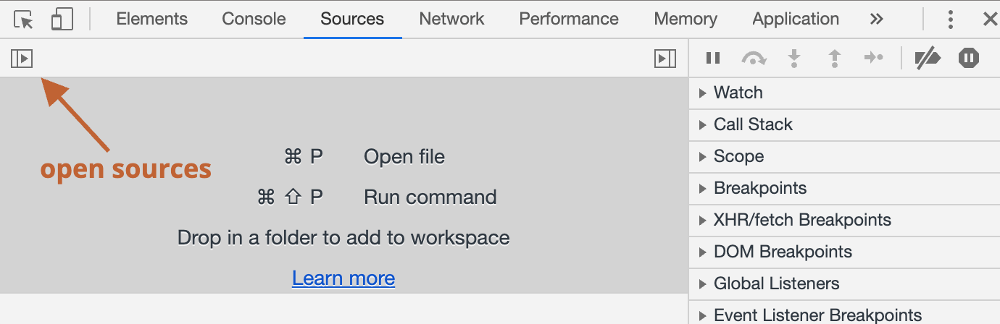

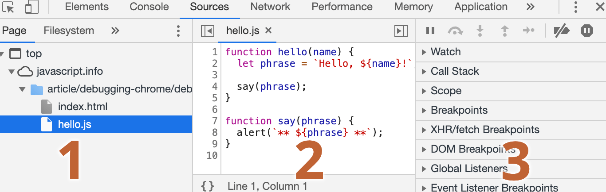

资源面板包含三个部分

1. **文件导航：** 该区域列出了 HTML、JavaScript、CSS 和包含图片在内的其他依附于次页面的文件，Chrome 扩展程序也会在这里显示
2. **代码编辑：** 该区域显示源码
3. **JavaScript 调试：** 该区域用于调试


**控制台（Console)**

在资源面板按下 `Esc` 会出现一个控制台，可以输入一些命令然后按下 `Enter` 来执行

在控制台中，语句执行完毕之后，其执行结果会显示在下面

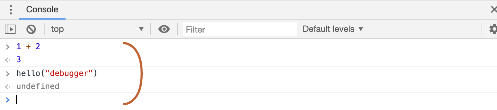


**断点（Breakpoints）**

通过点击在资源面板代码编辑区域的行号数字，可以设置一个断点

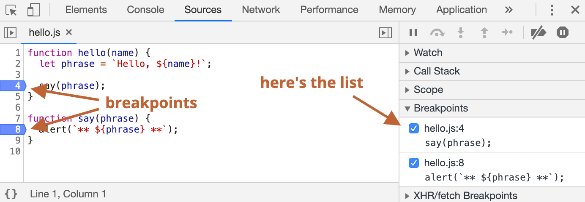

断点是调试器会自动暂停 JavaScript 执行的地方

当代码被暂停时，我们可以检查当前的变量，在控制台执行命令等等

可以在右侧的面板中找到断点的列表，当在数个文件中有许多的断点时，这是非常有用的，它允许我们：

- 快速跳转至代码中的断点（通过点击右侧面板中的对应的断点）
- 通过取消选中断点来临时禁用对应的断点
- 通过右键点击并选择移除来删除一个断点
- ......等等


**条件断点**

在行号上右键点击允许你创建一个条件断点，至于当给定了表达式（创建条件断点时提供的表达式）为真时才会被触发

当需要在特定的变量值或参数的情况下暂停程序的执行时，这种调试方式就很有用


**debugger 命令**

可以使用 `debugger` 命令来暂停代码

```js
function hello(name) {
  let phrase = `Hello, ${name}!`;
  
  debugger; // 调试器会在这里停止
  
  say(phrase);
}
```

**注意：** 这样的命令只有在开发者工具打开时才有效，否则浏览器会忽略它


**暂停并查看**

`hello()` 函数在页面加载期间被调用，因此激活调试器的最简单的方法（在外面已经设置了断电之后）就是重新加载页面，因此我们可以按下 `F5` （Windows, Linux）或 `Cmd+R`（Mac）

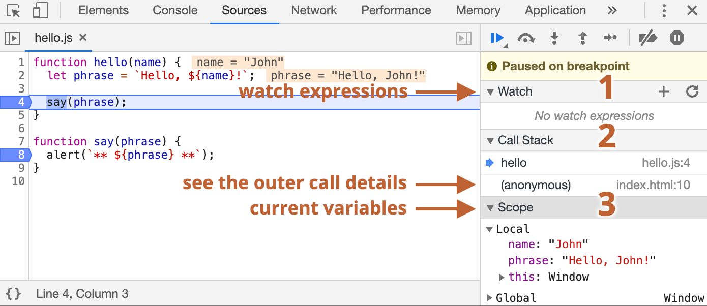

在右侧的信息下拉列表中，可以查看当前的代码状态

1. **监视（Watch）：** 显式任意表达式的当前值，通过点击 `+` 号然后输入一个表达式，调试器就会显示它的值，并在执行过程中自动重新计算表达式

2. **调用堆栈（Call Stack）：** 显示嵌套的调用链，上述图片中的调试器正在 `hello()` 的调用链中，被 `index.html` 中的一个脚本调用（这里没有函数，因此显示匿名(anonymous)，如果点击了其中一个堆栈项，调试器将跳到对应的代码处，并且还可以查看其所有变量

3. **作用域（Scope）：** 显式当前的变量

   `Local` 显式当前函数中的变量，可以在源代码编辑器中看到它们的值高亮显示了出来

   `Global` 显示全局变量（不在任何函数中）

   还有一个 `this` 关键字


**跟踪执行**

在右侧面板的顶部是一些关于追踪脚本的按钮


点击**继续执行按钮**，如果没有其它的断点，那么程序就会继续执行，并且调试器不会再控制程序


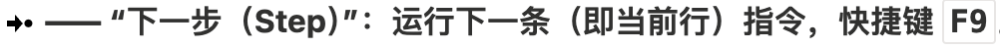

点击**下一步按钮**，运行下一条语句，一次只会执行一行语句


点击**跨步按钮**，与**下一步按钮类似**，如果下一条语句是函数调用则表现不同，这里的函数指的是：不是内建的函数，如 `alert` 函数等，而是我们自己写的函数

对比一下，**下一步命令**会进行嵌套函数调用并在第一行暂停执行，但是**跨步命令**会我们不可见的执行嵌套函数的调用，跳过了函数的内部，执行会在函数调用完成后立即暂停

如果对函数内部的执行不感兴趣，这个命令会很有用


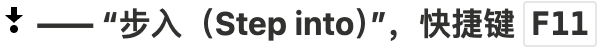

和**下一步命令**类似，但是在异步函数调用情况下表现不同，**下一步命令**会忽略异步行为，例如 `setTimeout`（计划的函数调用），它会过一段时间再执行，而**步入命令**会进入代码中并等待（如果需要）


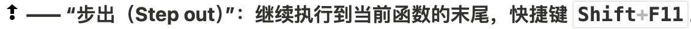

**步出命令**继续执行当前函数内的剩余代码，并暂停在调用当前函数的下一行代码处，当我们使用**下一步命令**偶然进入到一个嵌套调用中，但是有对这个函数不感兴趣时，可以使用**步出命令**会立马执行到函数的最后


这个按钮不会影响程序的执行，只是一个批量操作断点的开关


当启用此功能，如果开发者工具是开着的时候，任何脚本执行错误都会导致该脚本执行自动暂停，然后我们可以在调试器中分析变量来看一下什么出错了

当我们的脚步因为错误挂掉的时候，可以打开调试器，启用这个选项然后重新加载页面来看一下哪里导致它挂掉了和当时的上下文是什么

新版的 Chrome 已经没有了这个按钮，取而代之的是如下图的选项

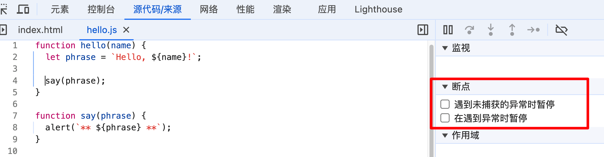


**Continue to here**

在启用调试模式的时候右键代码行才会有这个选项，可以让代码移动很多步到某一行为止，可以偷懒少打一个断点非常方便

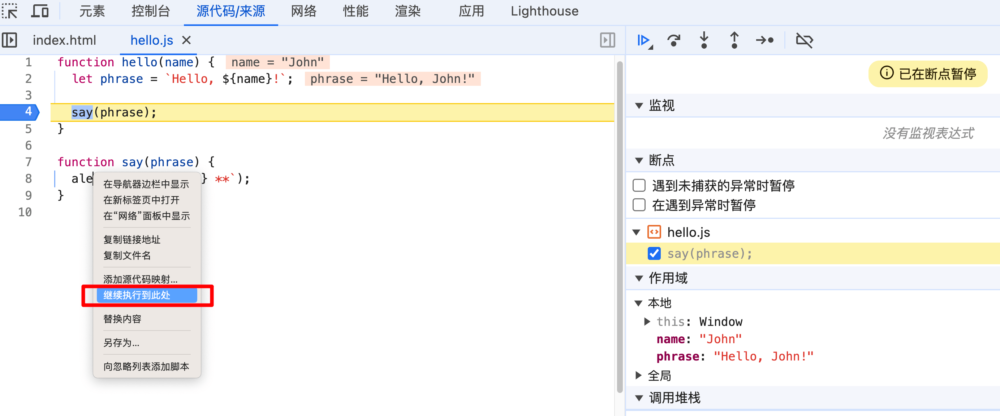


**日志记录**

想要输出一些东西在控制台上，可以使用 `console.log` 函数

```js
console.log('Hello World');
```

普通用户是看不到这个输出的，它在控制台里显示

打开控制台的两种方式

- 打开浏览器的开发者工具中的 Console（控制台）选项卡
- 在浏览器的开发者工具中的任意一个选项卡中按下 `Esc`，会在下方打开一个控制台

如果在代码中有足够的日志记录，那么可以从记录中看到刚才发生了什么，就不需要借助调试器了

Chrome 开发者工具详细的文档可以参考 https://developer.chrome.com/docs/devtools


**代码风格**

代码必须尽可能的清晰和易读

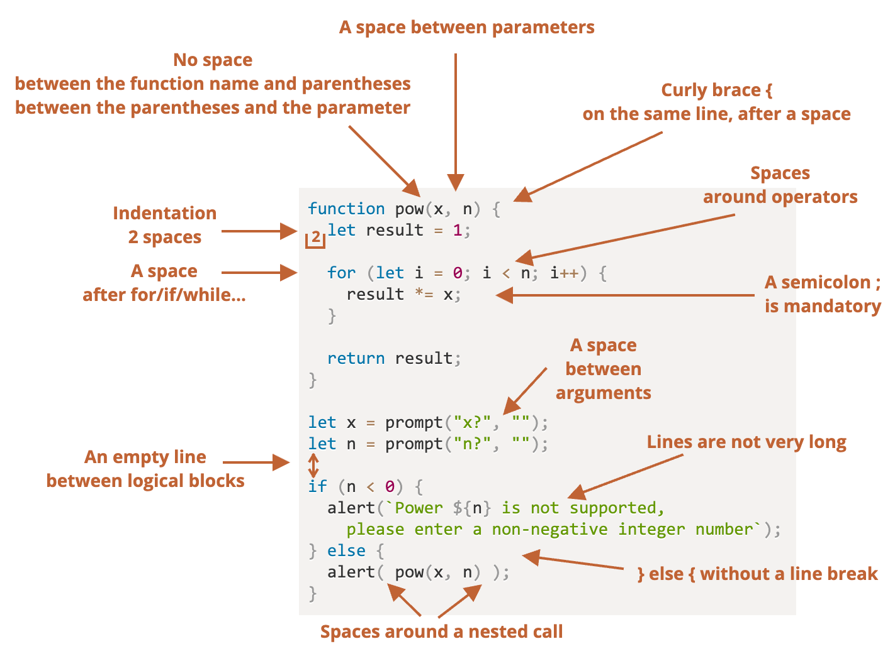


**花括号**

在大多数的 JavaScript 项目中，花括号以 ”Egyptian“ 风格，左花括号与相应的关键字在同一行上，额不是新起一行，左花括号前还应该有一个空格

```js
if (condition) {
  // do this
}
```

对于很短的代码，写成一行的可以接受的，但是代码块的方式通常更具有可读性


**行的长度**

没有人喜欢读一长串代码，最后将代码分割一下

```js
// 使用回勾引号 ` 允许将字符串拆分为多行
let str = `
  ECMA International's TC39 is a group of JavaScript developers,
  implementers, academics, and more, collaborating with the community
  to maintain and evolve the definition of JavaScript.
`;
```

对于 `if` 语句

```js
if(id === 123 &&
  moonPhase === 'Waning Gibbous' &&
  zodiacSign === 'Libra'
) {
  letTheSorceryBegin();
}
```

一行代码的最大长度应该在团队层面上达成一致，通常是 80 或 120 个字符


**缩进**

主要有两种类型的缩进

- 水平方向上的缩进：2 或 4 个空格

  一个水平缩进通常由 2 或 4 个空格或者 ”Tab“ 制表符（`Tab` 键）构成，如今空格更普遍一点

  选择空格而是 tabs 的优点之一是，这允许你做出比 ”Tab“ 制表符更加灵活的缩进配置

- 垂直方向上的缩进：用于将代码拆分为逻辑块的空行

  即使是单个函数通常也被分割为数个逻辑块，下面的示例中，初始化变量、主循环结构和返回值都被垂直分割了

  ```js
  function pow(x, n) {
    let result = 1;
    // <--
    for (let i = 0; i < n; i++) {
      result *= x;
    }
    // <--
    return result;
  }
  ```

  插入一个额外的空行有助于使代码更具可读性，写代码时，不应该出现连续超过 9 行都没有被垂直分割的代码


**分号**

每一个语句后面都应该有一个分号，即使它可以被跳过，但在 JavaScript 中，极少数的情况下，换行符有时不会被解释为分号


**嵌套的层级**

尽量避免代码嵌套层级过深

例如在循环中，有时候使用 `continue` 命令以避免额外的嵌套是一个好主意

不应该像下面这样添加嵌套的 `if` 条件

```js
for (let i = 0; i < 10; i++) {
  if (cond) {
    ...//
  }
}
```

可以写成这样

```js
for (let i = 0; i < 10; i++) {
  if (!cond) continue; 
  ... // 没有额外的嵌套
}
```

使用 `if/else` 和 `return` 也可以做类似的事情

```js
function pow(x, n) {
  if(n < 0) {
    alert('Negative "n" not supported');
  } else {
    let result = 1;
    
    for (let i = 0; i < n; i++) {
      result *= x;
    }
    
    return result;
  }
}
```

可以修改为如下代码，这样的代码更具有可读性，一旦条件通过检查，代码执行就可以进入 ”主“ 代码流，而不需要额外的嵌套了

```js
function pow(x, n) {
	if(n < 0) {
  	alert('Negative "n" not supported');
  	return;
	}
  
  let result = 1;

  for (let i = 0; i < n; i++) {
    result *= x;
  }

  return result;
}
```


**函数位置**

如果正在写几个 ”辅助“ 函数和一些使用它们的代码，那么有三种方式来组织这些函数

1. 在调用这些函数的代码的上方声明这些函数

   ```js
   // 函数声明
   function createElement() {
     ...
   }
   
   function setHandler(elem) {
     ...
   }
   
   function walkAround() {
     ...
   }
   
   // 调用函数的代码
   let elem = createElement();
   setHandler(elem);
   walkAround();
   ```

2. 先写调用代码，再写函数

   ```js
   // 调用函数的代码
   let elem = createElement();
   setHandler(elem);
   walkAround();
   
   // 函数声明
   function createElement() {
     ...
   }
   
   function setHandler(elem) {
     ...
   }
   
   function walkAround() {
     ...
   }
   ```

3. 混合，在第一次使用一个函数时，对该函数进行声明

**大多数情况下，第二种方式更好**，因为阅读代码时，我们首先想知道的是它做了什么，如果函数的定义先行，那么在整个程序的最开始就展示出了这些信息，可能我们不需要阅读这些函数了，尤其是它们的名字清晰地展示出了它们的功能的时候


**风格指南**

风格指南里包含了如何编写代码的通用规则，例如：使用哪个引号，用多少空格来缩进、一行代码最大长度等非常多的细节

当团队中所有的成员都使用相同的风格指南时，代码看起来将是统一的，无论是团队中谁写的，都是一样的风格

一些受欢迎的选择：

- [Google JavaScript 风格指南](https://google.github.io/styleguide/jsguide.html)
- [Airbnb JavaScript 风格指南](https://github.com/airbnb/javascript)
- [Idiomatic.JS](https://github.com/rwaldron/idiomatic.js)
- [StandardJS](https://standardjs.com/)


**自动检查器**

检查器是可以自动检查代码样式，并提出改进建议的工具

它们的妙处在于进行代码风格检查时，可以发现一些代码错误

以下是一些最出名的代码检查工具：

- [JSLint](https://www.jslint.com/) —— 第一批检查器之一
- [JSHint](https://www.jshint.com/) —— 比 JSLint 多了更多设置
- [ESLint](https://eslint.org/) —— 应该是最新的一个

大多数检查器都可以与编辑器集成在一起：只需要在编辑器中启用插件并配置代码风格即可


**注释**

通常通过注释来描述代码怎样工作和为什么这样工作


**糟糕的注释**

```js
// 这里的代码会先做这件事(……)，然后做那件事情(……)
// ……谁知道还有什么……
very;
complex;
code;
```

在好的代码中，这种 ”解释性“ 注释的数量应该是最少的，严格地来说，就算没有它们，代码也应该是很容易理解的

有一个很棒的原则：**如果代码不够清晰，以至于需要一个注释，那么或许它应该被重写**


**分解函数**

有时候用一个函数来代替一个代码片段是更好的

```js
function showPrimes(n) {
  nextPrime:
  for (let i = 2; i < n; i++) {

    // 检测 i 是否是一个质数（素数）
    for (let j = 2; j < i; j++) {
      if (i % j == 0) continue nextPrime;
    }

    alert(i);
  }
}
```

更好的变体，使用一个分解出来的函数 `isPrime`

```js
function showPrimes(n) {
  for (let i = 2; i < n; i++) {
    // 检测 i 是否是一个质数（素数）
    if (!isPrime(i)) continue;

    alert(i);
  }
}

function isPrime(n) {
	for (let j = 2; j < i; j++) {
		if (i % j == 0) return false;
	}
}
```

这样就很容易理解代码了，函数自己就变成了一个注释，这种代码被称为**自描述型**代码


**创建函数**

```js
// 在这里我们添加威士忌（译注：国外的一种酒）
for(let i = 0; i < 10; i++) {
  let drop = getWhiskey();
  smell(drop);
  add(drop, glass);
}

// 在这里我们添加果汁
for(let t = 0; t < 3; t++) {
  let tomato = getTomato();
  examine(tomato);
  let juice = press(tomato);
  add(juice, glass);
}

// ...
```

可以像下面这样，将上面的代码重构为函数

```js
addWhiskey(glass);
addJuice(glass);

function addWhiskey(container) {
  for(let i = 0; i < 10; i++) {
    let drop = getWhiskey();
    //...
  }
}

function addJuice(container) {
  for(let t = 0; t < 3; t++) {
    let tomato = getTomato();
    //...
  }
}
```

函数本身就可以告诉我们发生了什么，没有什么地方需要注释，分割之后代码的结构也更好了，每一个函数做什么，需要什么和返回什么都非常地清晰

实际上，不能完全避免 ”解释型“ 注释，例如在一些复杂的算法中，会有一些出于优化的目的而做的一些巧妙的 ”调整“，通常情况下，我们应该尽可能地保持代码的简单和 ”自我描述“ 性


**好的注释**

解释性注释通常来说都是不好的，哪一种注释才是好的呢？

- **描述架构**

  对组件进行高层次的整体概括，它们如何相互作用、各种情况下的控制流程是怎么什么样......简而言之就是代码的鸟瞰图，有一个专门用于构建代码的高层次架构图，以对代码进行解释的特殊编程语言 UML，值得去学习

- **记录函数的参数和用法**

  有一个专门用于记录函数的语法 JSDoc：用法、参数和返回值

  ```js
  /**
   * 返回 x 的 n 次幂的值。
   *
   * @param {number} x 要改变的值。
   * @param {number} n 幂数，必须是一个自然数。
   * @return {number} x 的 n 次幂的值。
   */
  function pow(x, n) {
    ...
  }
  ```

  这种注释可以帮助我们理解函数的目的，并且不需要研究其内部的实现代码，就可以直接正确地使用它

- **为什么任务以这种方式解决？**

  写了什么代码很重要，但是**为什么不那样写**可能对于理解正在发生什么更重要，为什么任务是通过这种方式解决的？代码并没有给出答案

- **代码有哪些巧妙的特性？它们被用在了什么地方？**

  如果代码存在任何巧妙和显而易见的方法，那绝对需要注释


**使用 Mocha 进行自动化测试**

自动化测试将被用于进一步的任务中，并且还将被广泛应用在实际项目中


**为什么需要测试？**

在写一个函数时，通常可以想象出它应该做什么：哪些参数会给出哪些结果

在开发期间，可以运行程序来检查它比将结果与预期进行比较

如果出了问题，那么我们会修复代码，然后再一次运行并检查结果，直到它工作为止

**当通过手动重新运行来测试代码时，很容易漏掉一些东西**，当我们在开发时，会保留很多可能需要的用例，但是不要想着程序员在每一次代码修改后都去检查所有的案例，这就很容易造成修复了一个问题却造成另一个问题的情况

**自动化测试意味着测试是独立于代码的。它们以各种方式运行我们的函数，并将结果与预期结果进行比较**


**行为驱动开发（BDD）**

BDD 包含了三部分内容：测试、文档和示例


**开发规范**

创建函数之前，想象函数应该做什么并且描述出来，这样的描述被称为规范，包含用例的描述以及针对它们的测试

```js
describe('pow', function() {
  it('raises to n-th power', function() {
    assert.equal(pow(2, 3), 8);
  });
});
```

一个规范包含三个主要的模块

`describe("title", function() { ... })`

表示我们正在描述的功能是什么，例子中我们正在描述函数 `pow`，用于组织 ”工人（workers）“ `it` 代码块

`it('use case description', function() { ... })`

`it` 里面的描述部分，我们以一种易于理解的方式描述特定的用例，第二个参数是用于对其进行测试的函数

`assert.equal(value1, value2)`

`it` 块中的代码，如果实现是正确的，它应该在执行的时候不产生任何错误

`assert.*` 函数用于检查 `pow` 函数是否按照预期工作，在这里使用了其中之一，`assert.equal`，它会对参数进行比较，如果它们不相等则会抛出一个错误，这里它检查了 `pow(2, 3)` 的值是否等于 `8`，还有其它类型的比较和检查

规范可以被执行，它将运行在 `it` 块中指定的测试


**开发流程**

1. 编写初始规范，测试最基本的功能
2. 创建一个最初始的实现
3. 检查它是否工作，运行测试框架来进行测试，当功能未完成时，将显示错误，持续修正直到一切都能工作
4. 现在有一个带有测试的能工作的初步实现
5. 增加更多的用例到规范中，获取目前的程序实现还不支持，无法通过测试
6. 回到第 3 步，更新程序直到测试不会抛出错误
7. 重复第 3 步到第 6 步，直到功能完善

开发就是不断地迭代，写规范，实现它，确保测试通过，然后写更多的测试，确保它们正常工作


**行为规范**

在教程中将使用以下的 JavaScript 库进行测试

- [Mocha](http://mochajs.org/) —— 核心框架：提供了包括通用型测试函数 `describe` 和 `it`，以及用于运行测试的主函数
- [Chai](http://chaijs.com/) —— 提供很多断言（assertion）支持的库。它提供了很多不同的断言，现在我们只需要用 `assert.equal`
- [Sinon](http://sinonjs.org/) —— 用于监视函数、模拟内建函数和其他函数的库，我们在后面才会用到它

这些库都既适用于浏览器端，也适用于服务器端，这里使用浏览器端的变体

```html
<!DOCTYPE html>
<html>
<head>
  <!-- add mocha css, to show results -->
  <link rel="stylesheet" href="https://cdnjs.cloudflare.com/ajax/libs/mocha/3.2.0/mocha.css">
  <!-- add mocha framework code -->
  <script src="https://cdnjs.cloudflare.com/ajax/libs/mocha/3.2.0/mocha.js"></script>
  <script>
    mocha.setup('bdd'); // minimal setup
  </script>
  <!-- add chai -->
  <script src="https://cdnjs.cloudflare.com/ajax/libs/chai/3.5.0/chai.js"></script>
  <script>
    // chai has a lot of stuff, let's make assert global
    let assert = chai.assert;
  </script>
</head>

<body>

  <script>
    function pow(x, n) {
      /* function code is to be written, empty now */
    }
  </script>

  <!-- the script with tests (describe, it...) -->
  <script src="test.js"></script>

  <!-- the element with id="mocha" will contain test results -->
  <div id="mocha"></div>

  <!-- run tests! -->
  <script>
    mocha.run();
  </script>
</body>

</html>
```

该页面可分为五个部分：

1. `<head>` —— 添加用于测试的第三方库和样式文件
2. `<script>` 包含测试函数，在上述例子中就是和 `pow` 相关的代码
3. 测试代码 —— 在上述代码中是名为 `test.js` 的脚本，包含上面 `describe('pow', ...)` 的那些代码
4. HTML 元素 `<div id="mocha">` 将被 Mocha 用来输出结果
5. 可以使用 `mocha.run()` 命令来开始测试


**初始实现**

为了通过测试，写一个简单的 `pow` 实现

```js
fucntion pow() {
  return 8; // 作弊实现
}
```

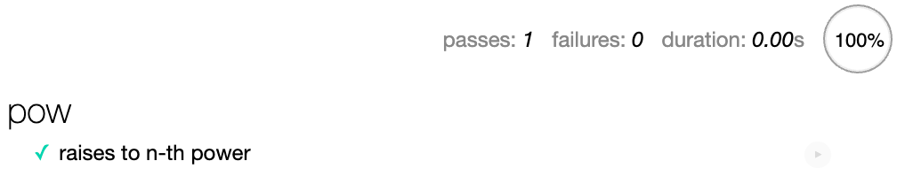


**改进规范**

只靠作弊通过测试，这样的函数是不起作用的，需要给它添加更多的测试用例

这里可以选择任意一种方式来组织测试代码

1. 第一种方式，在同一个 `it` 中再添加一个 `assert`

   ```js
   describe('pow', function () {
     it('raises to n-th power', function () {
       assert.equal(pow(2, 3), 8);
       assert.equal(pow(3, 4), 81);
     });
   });
   ```

   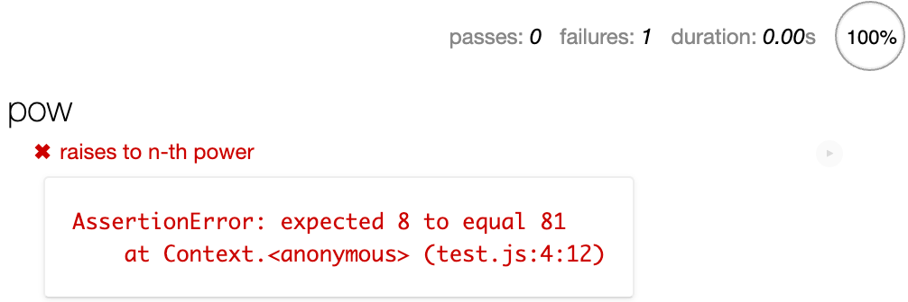

2. 第二种方式，写两个测试

   ```js
   describe("pow", function() {
     it("2 raised to power 3 is 8", function() {
       assert.equal(pow(2, 3), 8);
     });
   
     it("3 raised to power 4 is 81", function() {
       assert.equal(pow(3, 4), 81);
     });
   });
   ```

   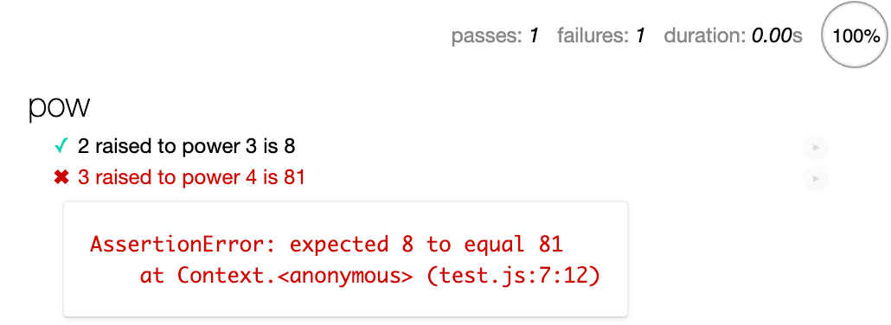

主要区别。当 `assert` 触发一个错误时，`it` 代码块会立即终止，因此在第一种方式中，如果第一个 `assert` 失败了，将永远不会看到第二个 `assert` 的结果

**保持测试之间独立，有助于获知代码中正在发生什么**，因此第二种方式更好一点

除此之外，还有一个规范值得遵循，**一个测试检查一个东西**，如果在看测试代码的时候，发现其中有两个相互独立的检查，那么最好将它拆分成两个更简单的检查


**改进实现**

写一些更加实际的代码来通过测试

```js
function pow(x, n) {
  let result = 1;
  
  for (let i = 0; i < n; i++) {
    result *= x;
  }
  
  return result;
}
```

为了确保函数可以很好地工作，使用更多值来测试它，除了手动编写 `it` 代码块，还可以使用 `for` 循环来生成它们

```js
describe('pow', function () {
  function makeTest(x) {
    let expected = x * x * x;
    it(`${x} in the power 3 is ${expected}`, function () {
      assert.equal(pow(x, 3), expected);
    });
  }

  for (let x = 0; x <= 5; x++) {
    makeTest(x);
  }
});
```

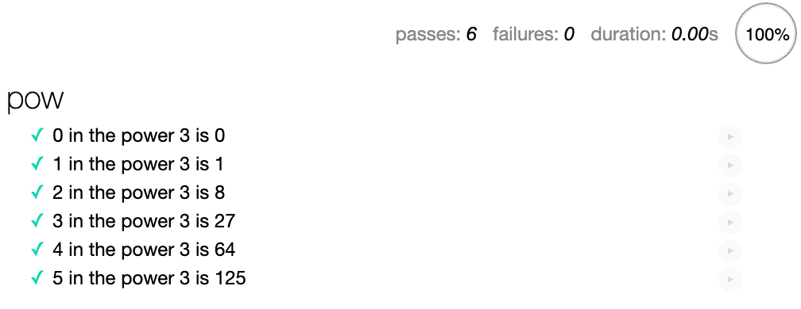


**嵌套描述**

在继续添加更多的测试之前，需要主要辅助函数 `makeTest` 和 `for` 应该被组合在一起，在其它测试中不需要 `makeTest`，只有在 `for` 循环中需要它，它们共同的任务就是检查 `pow` 是如何自乘至给定的幂次方

使用嵌套的 `describe` 来进行分组

```js
describe('pow', function() {
  describe('raises x to power 3', function() {
    function makeTest(x) {
      let expected = x * x * x;
      it(`${x} in the power 3 is ${expected}`, function() {
        assert.equal(pow(x, 3), expected);
      });
    }
    
    for (let x = 1; x <=5; x++) {
      makeTest(x);
    }
  });
  
  // ... 可以在这里写更多的测试代码，describe 和 it 都可以添加在这里
});
```

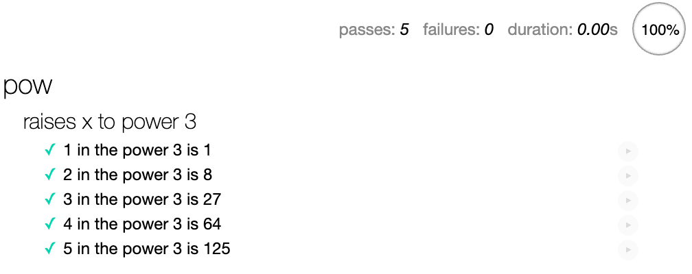

未来可以在顶级域中使用 `it` 和 `describe` 的辅助函数添加更多的 `it` 和 `describe`，它们不会看到 `makeTest`


**`before/after` 和 `beforeEach/afterEach`**

可以设置 `before/after` 函数来在运行测试之前/之后执行，也可以使用 `beforeEach/afterEach` 函数来设置在执行每一个 `it` 之前/之后执行

```js
describe('test', function() {
  before(() => alert('Testing started - before all tests'));
  after(() => alert('Testing finished - after all tests'));
  
  beforeEach(() => alert('Before a test - enter a test'));
  afterEach(() => alert('After a test - exit a test'));
  
  it('test 1', () => alert(1));
  it('test 2', () => alert(2));
})
```

运行顺序为

```
'Testing started - before all tests' (before)
'Before a test - enter a test' (beforeEach)
1
'After a test – exit a test' (afterEach)
'Before a test - enter a test' (beforeEach)
2
'After a test – exit a test' (afterEach)
'Testing finished – after all tests' (after)
```

通常，`before/after` 和 `beforeEach/afterEach` 被用于执行初始化，清零计数器或做一些介于每个测试（或测试组）之间的事情


**延伸规范**

前面的例子的第一次迭代开发完成了，函数 `pow(x, n)` 适用于正整数 `n`

JavaScript 函数通常会返回 `NaN` 以表示一个数学错误，接下对无效的 `n` 值执行相同的操作

```js
describe("pow", function() {
  // ...

  it("for negative n the result is NaN", function() {
    assert.isNaN(pow(2, -1));
  });

  it("for non-integer n the result is NaN", function() {
    assert.isNaN(pow(2, 1.5));
  });
});
```

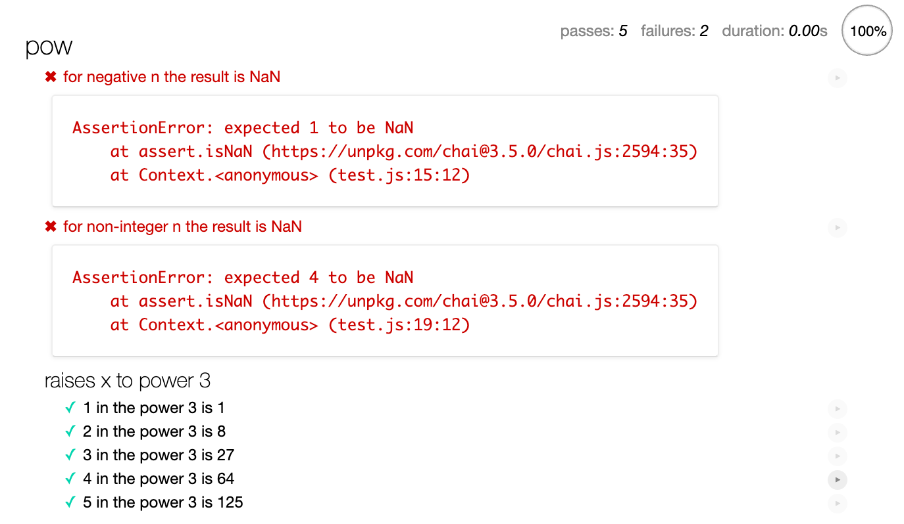

新加的测试失败了，因为目前的实现是不支持它们的，**这就是 BDD 的做法，首先写一些暂时无法通过的测试，然后去实现它们**

给 `pow` 增加几行实现

```js
function pow(x, n) {
  if (n < 0) return NaN;
  if (Math.round(n) != n) return NaN;

  let result = 1;

  for (let i = 0; i < n; i++) {
    result *= x;
  }

  return result;
}
```

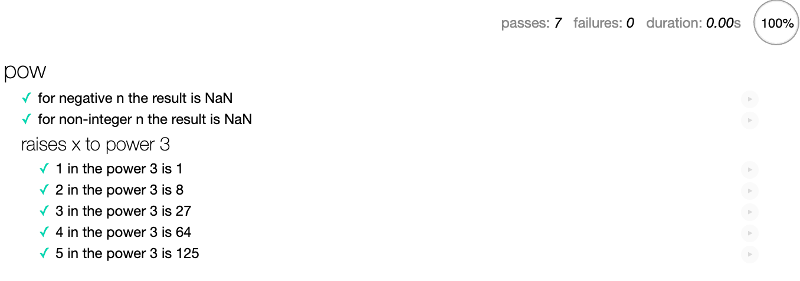


**Polyfill 和转译器**

JavaScript 语言在稳步发展中，会定期出现一些对语言的新提议，它们会被进行分析讨论，如果认为有价值，就会被加入到 https://tc39.github.io/ecma262/  的列表中，然后被加到 [规范](http://www.ecma-international.org/publications/standards/Ecma-262.htm) 中

JavaScript 引擎背后的团队关于首先要实现什么有他们自己的想法，可能会决定执行草案中的建议，并推迟已经在规范中的内容，因为它们不太有趣或者难以实现

一个 JavaScript 引擎只能实现标准中的一部分是很常见的情况

可以通过 https://compat-table.github.io/compat-table/es6/ 查看语言特性当前支持的状态

如果让现代的代码在还不支持最新特性的旧引擎上工作，有两个工作可以做到这一点

1. 转译器（Transpilers）
2. 垫片（Polyfills）


**转译器（Transpilers）**

转译器是一种可以将源码转译成另一种源码的特殊的软件，它可以解析现代代码，并使用旧的语法结构对其进行重写，进而使其在旧的引擎中工作

例如在 ES2020 之前就没有空值合并运算符 `??`，如果访问者使用了过时的浏览器访问页面，浏览器就可能不明白 `height = height ?? 100` 这段代码的含义

转译器会分析我们的代码，并将 `height ?? 100` 重写为 `(height !== undefined && height !== null) ? height : 100`

```js
// 在运行转译器之前
height = height ?? 100;

// 在运行转译器之后
height = (height !== undefined && height !== null) ? height : 100;
```

现在重写了的代码适用于更旧版本的 JavaScript 引擎，通常开发者会在自己的计算机上运行编译器，然后将转译后的代码部署到服务器

[Babel](https://babeljs.io/) 是最著名的转译器之一，现代项目构建系统，例如 [Webpack](https://webpack.js.org/)，提供了在每次代码更改时自动运行转译器的方法，因此很容易将代码转译集成到开发过程中


**垫片（Polyfills）**

新的语言特性可能不仅包括语法结构和运算符，还可能包括内建函数

例如，`Math.trunc(n)` 是一个 “截断” 数字小数部分的函数，例如 `Math.trunc(1.23)` 返回 `1`

在一些非常过时的 JavaScript 引擎中没有 `Math.trunc` 函数，所以这样的代码会执行失败

因为这个讨论的是新函数，而不是语法更改，因此不需要在此转译任何内容，只需要声明缺失的函数

更新/添加新函数的脚步被称为 “polyfill”，它 “填补” 了空白并添加了缺失的实现，以下是 `Math.trunc` 的 polyfill 的一个实现它的脚本

```js
if(!Math.trunc) { // 如果没有这个函数
  Math.trunc = function(number) {
    // Math.ceil 和 Math.floor 甚至存在于上古年代的 JavaScript 引擎中
    return number < 0 ? Math.ceil(number) : Math.floor(number);
  };
}
```

JavaScript 是一种高度动态的语言，脚步可以添加/修改任何函数，甚至包括内建函数

两个有趣的 polyfill 库

- [core js](https://github.com/zloirock/core-js) 支持了很多特性，允许只包含需要的特性
- [polyfill.io](http://polyfill.io/) 提供带有 polyfill 的脚本的服务，具体取决于特性和用户的浏览器


## Object（对象）：基础知识

在 JavaScript 中总共有八种数据类型，有七种原始类型，因为它们的值只包含一种东西（字符串、数字或其他）

相反，对象则可以用来存储键值对和更加复杂的实体，在 JavaScript 中，对象几乎渗透了这门编程语言的方方面面，要深入理解这门语言之前，必须先理解对象

可以通过使用带有可选 **属性列表** 的花括号 `{...}` 来创建对象，一个属性就是一个键值对（“key: value”），其中键 （`key`） 是一个字符串（也叫做属性名）值（`value`）可以是任何值

可以用下面两种语法中的任一种来创建一个空的对象

```js
let user = new Object(); // “构造函数” 的语法
let user = {}; // “字面量” 的语法
```

通常使用花括号，这种方式被叫做**字面量**


**文本和属性**

在创建对象的时候，可以立即将一些属性以键值对的形式放到 `{...}` 中

```js
let user = { // 一个对象
  name: 'John',
  age: 30,
};
```

可以随时添加、删除和读取文件

可以使用点符号访问属性值

```js
// 读取对象属性的值
alert( user.name ); // John
alert( user.age ); // 30
```

属性的值可以是任意类型，这里加个布尔类型

```js
user.isAdmin = true;
```

可以使用 `delete` 操作符移除属性

```js
delete user.age;
```

可以用多字词语来作为属性名，但是必须给它们加上引号

```js
let user = {
  name: 'John',
  age: 30,
  'likes birds': true, // 多词属性名必须加引号
};
```

列表中的最后一个属性应以逗号结尾

```js
let user = {
  name: 'John',
  age: 30,
}
```

这叫尾随或悬挂逗号，这样便于之后添加、删除和移动属性，因为所有的行都是相似的


**方括号**

对于多词属性，点操作就不能用了

```js
// 提示语法错误
user.likes birds = true;
```

JavaScript 理解不了，认为我们在处理 `user.likes`，然后在遇到意外的 `birds` 时给出语法错误

点符号读取属性时，要求 `key` 是有效的变量标识符，意味着：不包含空格，不以数字开头，也不包含特殊字符（允许使用 `$` 和 `_`）

使用方括号，就可以使用任何字符串了

```js
let user = {};

// 设置
user['likes birds'] = true;

// 读取
alert(user['likes birds']); // true

// 删除
delete user['likes birds'];
```

方括号同样提供了一种可以通过任意表达式来获取属性名的方式

```js
let key = 'likes birds';

// 跟 user['likes birds'] = true; 一样
user[key] = true;
```

这里的变量 `key` 可以是在程序运行时计算得到的，也可以是根据用户的输入得到的，然后可以用它来访问属性，这给了很大的灵活性

```js
let user = {
  name: 'John',
  age: 30,
};

let key = prompt('What do you want to know about the user?', 'name');

// 访问变量
alert(user[key]); // John(如果输入的是 'name')
```

但点符号不能以类似的方式使用

```js
let user = {
  name: 'John',
  age: 30,
}

let key = 'name';
alert(user.key); // undefined
```


**计算属性**

当创建一个对象时，可以在对象字面量中使用方括号，这叫做计算属性

```js
let fruit = prompt('Which fruit to buy?', 'apple');

let bag = {
  [fruit]: 5,
}

alert(bag.apple); // 5 如果 fruit='apple'
```

可以在方括号中使用复杂的表达式

```js
let fruit = 'apple';
let bag = {
  [fruit + 'Computers']: 5 // bag.appleCompuers = 5
}
```

大部分时间里，当属性名是已知且简单的时候，就使用点符号，如果需要使用一些更复杂的内容，那么就用方括号


**属性值简写**

在实际开发中，通常会用已存在的变量当做属性名

```js
function makeUser(name, age) {
  return {
    name: name,
    age: age,
    // ...其他的属性
  };
}

let user = makeUser('John', 30);
alert(user.name); // 'John'
```

在上述代码中，属性名和变量名是一样的，在这可以使用一种特殊的属性值缩写的方法，使属性名变得更短

可以用 `name` 来代替 `name: name`

```js
function makeUser(name, age) {
  return {
    name,
    age,
    // ...其他的属性
  };
}
```


**属性名称限制**

变量名不能是编程语言的某个保留字，如：`for`、`let`、`return` 等...

但对象的属性名并不受此限制

```js
let obj = {
  for: 1,
  let: 2,
  return: 3,
}

alert( obj.for + obj.let + obj.return ); // 6
```

对象的属性名没有限制，属性名可以是任何字符或者 symbol（一种特殊的标识符类型）

其他类型作为对象属性时会被自动转换为字符串，例如数学：

```js
let obj = {
  0: 'test', // 等同于 '0': 'test'
};

// 都会输出相同的属性（数字 0 被转为字符串 '0'）
alert( obj['0'] ); // test
alert( obj[0] ); // test (相同的属性)
```

**注意：** 有一个名为 `__proto__` 的属性，不能将它设置为一个非对象的值

```js
let obj = {};
obj.__proto__ = 5; // 分配一个数字
alert(obj.__proto__); // [object Object] -- 值为对象，与预期结果不同
```

可以从代码中看出，把它赋值为 `5` 的操作被忽略了


**属性存在性测试，”in“ 操作符**

相比其他语言，JavaScript 的对象有一个需要注意的特性，能够被访问任何属性，即使属性不存在也不会报错

读取不存在的属性只会得到 `undefined`，所以很容易判断一个属性是否存在

```js
let user = {};

alert( user.noSuchProperty === undefined ); // true 意思是没有这个属性
```

有一个特别的，检查属性是否存在的操作符 `in`

```js
'key' in object
```

例如：

```js
let user = { name: 'John', age: 30 };

alert( 'age' in user); // true, user.age 存在
alert( 'blabla' in user ); // false user.blabla 不存在
```

**注意：** `in` 的左边必须是**属性名**，通常是一个带有引号的字符串

如果省略引号，就意味着左边是一个变量，它应该包含要判断的实际属性名

```js
let user = { age: 30 };

let key = 'age';
alert( key in user); // true，属性 'age' 存在
```


**使用 `in` 运算符和使用 `undefined` 进行比较的区别**

大部分情况下与 `undefined` 进行比较判断就可以了，但是有一个例外情况，会导致判断出问题

```js
let obj = {
  test: undefined
};

alert( obj.test ); // 显式 undefined，所以属性不存在？

alert( 'test' in obj); // true，属性存在
```

在上述代码中，属性 `obj.test` 事实上是存在的，所以 `in` 操作符检查通过

这种情况很少发生，通常情况下应该给对象赋值 `undefined`，通常会使用 `null` 来表示未知或者空的值


**for...in 循环**

为了遍历一个对象的所有键（key），可以使用一个特殊形式的循环：`for...in`

```js
for (key in object) {
  // 对此对象属性中的每个键执行的代码
}
```

例如，列出 `user` 所有的属性

```js
let user = {
  name: 'John',
  age: 30,
  isAdmin: true
};

for (let key in user) {
  // keys
  alert( key ); // name, age, isAdmin
  // 属性键的值
  alert( user[key] ); // John, 30, true
}
```

**注意：** 所有的 `for` 结构体都允许在循环中定义变量，类似这里的 `let key`

也可以使用其它属性名来替代 `key`，例如 `for(let prop in obj)` 也很常用


**像对象一样排序**

对象的属性有顺序吗？如果遍历一个对象，获取属性的顺序是和属性添加的顺序相同吗？

回答是：**”有特别的顺序“ 整数属性**会被进行排序，其它属性则按照创建的顺序显示，如：带有电话号码的对象

```js
let codes = {
  '49': 'Germany',
  '41': 'Switzerland',
  '44': 'Great Britain',
  // ...,
  '1': 'USA'
}

for(let code in codes) {
  alert(code); // 1, 41, 44, 49
}
```

因为这些电话号码是整数的，所以它们以升序排列，所以我们看到的是 `1, 41, 44, 49`


**整数属性**

一个可以在不做任何更改的情况下与一个整数进行互换的字符串

```js
// Number(...) 显式转换为数字
// Math.trunc 是内建的去除小数部分的方法
alert( String(Math.trunc(Number('49'))) ); // '49' 相同，整数属性
alert( String(Math.trunc(Number("+49"))) ); // "49"，不同于 "+49" ⇒ 不是整数属性
alert( String(Math.trunc(Number("1.2"))) ); // "1"，不同于 "1.2" ⇒ 不是整数属性
```

如果属性名不是整数，就会按照创建时的顺序来排序

```js
let user = {
  name: 'John',
  surname: 'Smith',
};
user.age = 25; // 增加一个

// 非整数属性是按照创建的顺序来排列的
for (let prop in user) {
  alert( prop ); // name, surname, age
}
```

所以为了解决电话号码问题，可以使用非整数属性来调整程序，只需要给每个键名加上一个加号 `'+'` 前缀就可以了

```js
let codes = {
  '+49': 'Germany',
  '+41': 'Switzerland',
  '+44': 'Great Britain',
  // ...,
  '+1': 'USA'
}


for (let code in codes) {
  alert( +code ); // 49, 41, 44, 1
}
```


**对象引用和复制**

对象与原始类型的根本区别之一是，对象是 **“通过引用”** 存储和复制的，而原始类型：字符串、数字、布尔值等总是 **”作为一个整体 “** 复制

**赋值了对象的变量存储的不是对象本身，而是该对象 “在内存中的地址”，换句话说就是该对象的 “引用”**

```js
let user = {
  name: 'John',
};
```

实际存储在内存中的方式

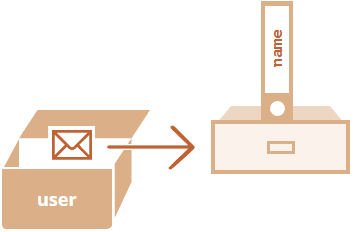

改对象被存储在内存中的某个位置（在图片的右侧），而变量 `user` （在左侧）保存的是对其的引用

当我们对对象执行操作时，例如获取一个属性 `user.name`，JavaScript 引擎会查看该地址中的内容，并在实际对象上执行操作

**当一个对象变量被复制 —— 只是引用被复制，而该对象自身并没有被复制**

```js
let user = { name: 'John' };

let admin = user; // 复制引用
```

上述代码中有两个变量，此时它们保存的都是对同一个对象的引用

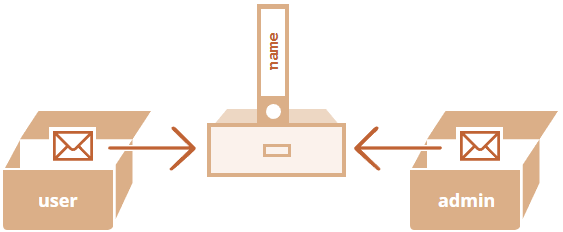

可以通过任意一个变量来访问该对象并修改它的内容

```js
let user = { name: 'John' };

let admin = user;

admin.name = 'Pete'; // 通过 "admin" 引用来修改

alert(user.name); // 'Pete'，修改能通过 "user" 引用看到
```


**通过引用来比较**

只有当两个对象为同一个对象时，两者才相等

```js
let a = {};
let b = a; // 复制引用

alert( a == b ); // true，都引用同一对象
alert( a === b); // true
```

两个独立的对象并不相等，即使它们都是空对象

```js
let a = {};
let b = {};

alert( a == b ); // false，两个独立的对象不相等
```

对于类似 `obj1 > obj2` 的比较，或者跟一个原始类型值的比较 `obj == 5`，对象都会被转换为原始值，实际上很少需要这样的比较，通常是编程错误的时候才会出现这种情况


**克隆与合并，Object.assign**

拷贝一个对象变量会又创建一个对相同对象的引用，如果想复制一个对象，有很多种方法

- 创建一个新对象，通过遍历已有对象的属性，并在原始类型值的层面复制它们

  ```js
  let user = {
    name: 'John',
    age: 30
  };
  
  let clone = {}; // 新的空对象
  
  // 将 user 中所有的属性拷贝其中
  for (let key in user) {
    clone[key] = user[key];
  }
  
  clone.name = 'Pete'; // 改变了其中的数据
  
  alert( user.name ); // 原来对象中的 name 属性依然是 John
  ```

- 使用 `Object.assign` 方法来达成同样的效果

  ```js
  Object.assign(dest, [src1, src2, src3, ...])
  ```

  - 第一个参数 `dest` 是指目标对象
  - 更后面的参数 `src1, ..., srcN`（可按需传递多个参数）是源对象
  - 该方法将所有源对象的属性拷贝到目标对象 `dest` 中，换句话说，从第二个开始的所有参数的属性都被拷贝到第一个参数的对象中
  - 调用结果返回 `dest`

可以用它来合并多个对象

```js
let user = { name: 'John' };

let permissions1 = { canView: true };
let permissions2 = { canEdit: true };

// permissions1 和 permissions2 中所有属性都拷贝到 user 中
Object.assign(user, permissions1, permissions2);

// 现在 user = { name: "John", canView: true, canEdit: true }
```

如果被拷贝的属性的属性名已经存在，那么它会被覆盖

```js
let user = { name: 'John' };

Object.assign(user, { name: 'Pete' });

alert(user.name); // 现在 user = { name: 'Pete' }
```

也可以使用 `Object.assign` 代替 `for..in` 循环来进行简单克隆

```js
let user = {
  name: 'John',
  age: 30
};

let clone = Object.assign({}, user);
```

它将 `user` 中的所有属性都拷贝到了一个空对象中，并返回这个新对象


**深度克隆**

对象的属性也可以是其他对象的引用

```js
let user = {
  name: 'John',
  sizes: {
    height: 182,
    width: 50,
  }
};

alert( user.sizes.height ); // 182
```

如果使用 `clone.sizes = user.sizes` 拷贝是不行的，因为 `user.sizes` 是一个对象，它会以引用的方式被拷贝，所以 `clone` 和 `user` 会公用一个 `sizes`

```js
let user ={
  name: 'John',
  sizes: {
    height: 182,
    width: 50,
  },
};

let clone = Object.assign({}, user);

alert( user.sizes === clone.sizes ); // true, 同一个对象

user.sizes.width++; // 通过其中一个引用改变属性值
alert(clone.sizes.width); // 51，能从另外一个引用获取到变更后的结果
```

为了解决这个问题，让 `user` 和  `clone` 成为两个真正独立的对象，应该使用一个拷贝循环来检查 `user[key]` 的每个值，如果它是一个对象，那么也复制它的结构，而不是引用，这就是所谓的 “深拷贝”

可以使用递归来实现它，也可以采用现有的实现，例如 [lodash](https://lodash.com/) 库的 [_.cloneDeep(obj)](https://lodash.com/docs#cloneDeep)


**注意：** 使用 `const` 声明的对象也是可以修改的

```js
const user = {
  name: 'John',
};

user.name = 'Pete';

alert(user.name); // Pete
```

上述代码不会发生错误，`user` 的值是一个常量，它必须始终引用同一个对象，但是该对象的属性可以被自由修改

只有当尝试使用 `user = ...` 进行一个整体赋值时，`const user` 才会报错


**垃圾回收**

JavaScript 内存管理是自动的、无形的，创建的函数、对象、原始值... 这一切都会占用内存


**可达性（Reachability）**

JavaScript 中主要的内存管理概念是**可达性**

“可达” 值是指那些可以以某种方式可访问或可用的值，它们会被存储在内存中

1. 以下是固有的可达值的基本集合，这些值明显不能被释放

   - 当前执行的函数，它的局部变量和参数
   - 当前嵌套调用链上的其他函数、它们的局部变量和参数
   - 全局变量
   - （还有一些其他的，内部实现）

   这些值都被称作为**根（roots）**

2. 如果一个值可以从根通过引用或者引用链进行访问，则认为该值是可达的

   例如说全部变量中有一个对象，并且该对象有一个属性引用了另一个对象，则该对象被认为的是可达的，而且它引用的内容也是可达的

在 JavaScript 引擎中有一个被称作**垃圾回收器**的东西在后台执行，它监控着所有对象的状态，并删除掉那些已经不可达的


**一个引用**

```js
// 全局变量 user 具有对这个对象的引用
let user = {
	name: 'John',
};
```

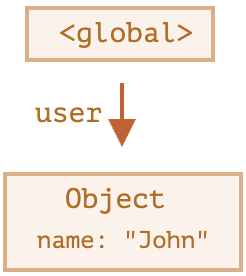

全局变量 `user` 的值被重写了，这个引用就没了

```js
user = null;
```

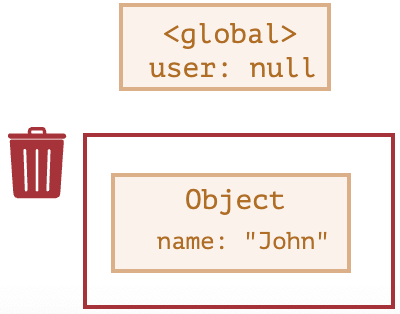

变量所引用的对象变得不可达的了，因为没有引用了，就不能访问到它，垃圾回收器会认为它是垃圾数据进行回收，然后释放内存


**两个引用**

把 `user` 的引用复制给 `admin`

```js
let user = {
  name: 'John',
};

let admin = user;
```

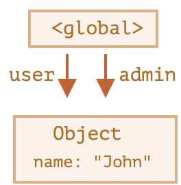

执行之前的操作

```js
user = null;
```

因为对象仍然可以通过全局变量 `admin` 变量访问到，因此它依旧保留在内存中，如果重写了 `admin`，对象就会被删除


**相互关联的对象**

```js
function marry(man, woman) {
  woman.husband = man;
  man.wife = woman;
  
  return {
    father: man,
    mother: woman,
  }
}

let family = marry({
  name: 'John',
}, {
  name: 'Ann',
})
```

通过使用 `marry` 函数使得两个对象相互引用，并且返回一个包含这两个对象的新对象

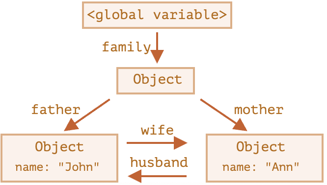

所有对象都是可达的

如果移除两个引用

```js
delete family.father;
delete family.mother.husband;
```

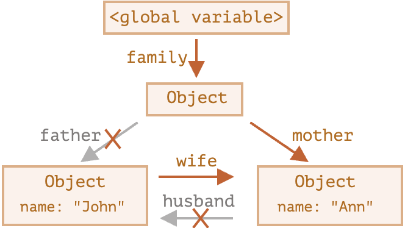

仅删除这两个引用中的一个是不够的，因为所有对象仍然是可达的，如果这两个都被删除，那么就没有对 `John` 对象的引用

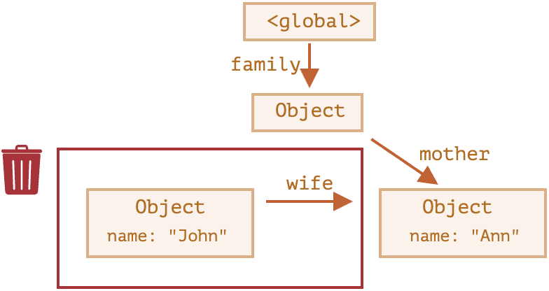

对外的引用不重要，只有传入引用才可以使对象可达，`John` 对象现在是不可达的，并且将从内存中删除，同时 `John` 的所有数据都将变得不可达

经过垃圾回收后：

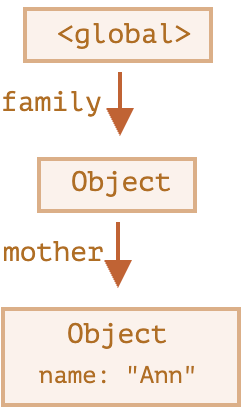


**无法到达的岛屿**

几个对象相互引用，但是外部没有对其任意对象的引用，这些对象也可能是不可达的，并被从内存中删除

```js
family = null;
```

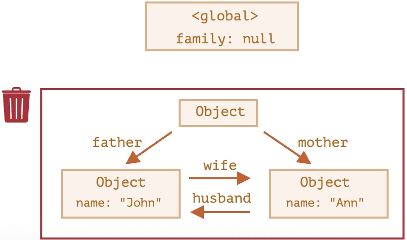

虽然图中 `John` 和 `Ann` 依旧相互连着，都有传入的引用，但是这样还不够，`family` 对象不再与根相连，没有了外部对其的引用，变成了一个座 “孤岛”


**内部算法**

垃圾回收的基本算法被称为 “mark-and-sweep”

定期执行以下 ”垃圾回收“ 步骤

- 垃圾收集器找到所有根，并 ”标记“（记住）它们
- 然后遍历并 ”标记“ 来自它们的所有引用
- 然后遍历标记的对象并标记**它们的**引用，所有被遍历的对象都会被记住，以免将来再次遍历到同一个对象
- 如此操作，直到可达的（从根部）引用都被访问到
- 没有被标记的对象都会被删除

具体的步骤示意图，假如有以下对象结构：

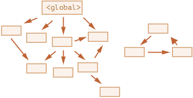

1. 第一步标记所有的根

   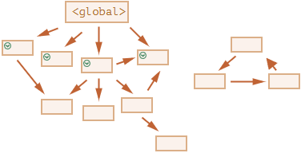

2. 标记它们所引用的对象

   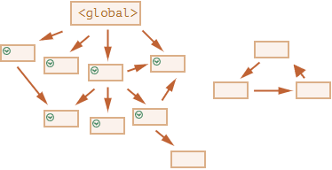

3. 如果标记对象还有引用的话，继续标记

   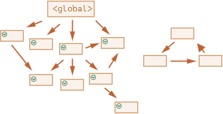

4. 无法通过这个过程被访问到的对象被认为是不可达的，会被删除

   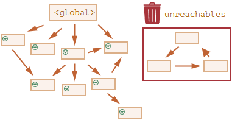

以上是垃圾收集工作的概念，JavaScript 引擎做了许多的优化，使垃圾回收运行速度更快，并且不会对代码执行引入任何延迟

优化建议：

- **分代收集（Generational collection）：** 对象被分成两组：”新的“ 和 ”旧的“，许多对象的生命周期很短，它们出现、完成它们的工作并很快死去，因此在这种情况下跟踪新对象并将其从内存中清除是有意义的，长期存活的对象会变得 ”老旧“，并且被检查的频次会降低
- **增量收集（Incremental collection）：** 如果有许多对象，试图一次遍历并标记整个对象集，则可能需要一些时间，并在执行过程中带来明显的延迟，因此，引擎将现有的整个对象集拆分为多个部分，然后将这些部分逐一清除，这样就会有很多小型的垃圾收集，而不是一个大型的，这需要它们之间有额外的标记来追踪变化，但是这样会带来许多微小的延迟而不是一个大的延迟
- **闲时收集（Idle-time collection）：** 垃圾收集器只会在 CPU 空闲时尝试运行，以减少可能对代码执行的影响

还有很多其他垃圾回收算法的优化和风格


**对象方法，"this"**

```js
let user = {
  name: 'John',
  age: 30,
};

user.sayHi = function() {
  alert('Hello!');
}

user.sayHi(); // Hello!
```

通过函数表达式创建了一个函数，并将其指定给对象的 `user.sayHi` 属性

随后就可以使用 `user.sayHi()` 调用它

作为对象的属性的函数被称为**方法**

也可以使用预先声明的函数作为方法

```js
let user = {
  name: 'John',
  age: 30,
};

// 首先，声明函数
function sayHi() {
  alert('Hello!');
}

// 然后将其作为一个方法添加
user.sayHi = sayHi;

user.sayHi(); // Hello!
```


**方法简写**

在对象字面量中，可以使用更短的（声明）方法的语法

```js
let user1 = {
  sayHi: function() {
    alert('Hello');
  }
}

let user2 = {
  sayHi() {
    // 与使用 sayHi: function() {...} 一样
    alert('Hello');
  }
}
```

可以省略 `'function'`，只写 `sayHi()`


**方法中的 “this”**

通常对象方法需要访问对象中存储的信息才能完成工作

例如，`user.sayHi()` 中的代码可能需要用到 `user` 的 `name` 属性

为了访问该对象，方法中可以使用 `this` 关键字

`this` 的值就是在点之前的这个对象，即调用该方法对象

```js
let user = {
  name: 'John',
  age: 30,
  
  sayHi() {
    // this 指的是当前对象 user
    alert(this.name);
  }
};

user.sayHi(); // John
```

在技术上讲，也可以在不使用 `this` 的情况下，通过外部变量名来引用它

```js
let user = {
  name: 'John',
  age: 30,
  
  sayHi() {
    // 使用 user 替代 this
    alert(user.name);
  }
};

user.sayHi(); // John
```

但这样的代码是不可靠的，假如决定将 `user` 复制给另一个变量，例如 `admin = user`，并赋另外的值给 `user`，它将访问到错误的对象

```js
let user = {
  name: 'John',
  age: 30,
  
  sayHi() {
    alert( user.name ); // 没使用 this 导致错误
  }
};

let admin = user;
user = null;

admin.sayHi(); // TypeError: Cannot read property 'name' of null
```


**“this” 不受限制**

在 JavaScript 中，`this` 关键字与其他大多数编程语言中的不同，JavaScript 中的 `this` 可以用于任何函数，即使它不是对象的方法

```js
function sayHi() {
  alert( this.name );
}
```

上述代码没有语法错误，`this` 的值是在代码运行时计算出来的，它取决于代码上下文

这里相同的函数被分配给两个不同的对象，在调用中有着不同的 `this` 值

```js
let user = { name: 'John' };
let admin = { name: 'Admin' };

function sayHi() {
  alert( this.name );
}

// 在两个对象中使用相同的函数
user.f = sayHi;
admin.f = sayHi;

// 两个调用有不同的 this 值
user.f(); // John (this == user)
admin.f(); // Admin (this == admin)
```

规则很简单，如果 `obj.f()` 被调用了，则 `this` 在 `f` 函数调用期间是 `obj`，在上面的例子中 `this` 先是 `user`，之后是 `admin`


**在没有对象的情况下调用：`this == undefined`**

```js
function sayHi() {
  alert(this);
}

sayHi(); // undefined
```

在这种情况下，**严格模式**下 `this` 值为 `undefined`，如果尝试访问 `this.name`，将会报错

在非严格模式下，`this` 将会是**全局对象**（浏览器中的 `window`，这是一个历史行为，`'use strict'` 已经将其修复了

通常这种调用是程序出错了，如果函数内部有 `this`，那么通常意味着它是在对象上下文环境中被调用的

**注意：** 在 JavaScript 中，不存在类似其他编程语言 “绑定 `this`” 的概念，即在对象中定义的方法总是有指向该对象的 `this`，在 JavaScript 中，`this` 是自由的，它的值是在调用时计算出来的，它的值并不取决于方法声明的位置，而是取决于在 “点符号前” 的是什么对象（谁调用，`this` 就指向谁）


**箭头函数没有自己的 “this”**

箭头函数有些特别，它们没有自己的 `this`，`this` 值取决于外部 “正常的” 函数

```js
let user = {
  firstName: 'Ilya',
  sayHi() {
    let arrow = () => alert(this.firstName);
    arrow();
  }
};

user.sayHi(); // Ilya
```

这是箭头函数的一个特性，当不想要一个独立的 `this`，反而想从外部上下文中获取时，可以使用它


**构造器和操作符 “new”**

常规的对象字面量 `{...}` 语法允许创建一个对象，但是经常需要创建很多类似的对象，这时可以使用构造函数和 `new` 操作符来实现


**构造函数**

构造函数在技术上是常规函数，不过有两个约定

1. 它们的命名以大写字母开头
2. 它们只能由 `new` 操作符来执行

```js
function User(name) {
  this.name = name;
  this.isAdmin = false;
}

let user = new User('Jack');

alert(user.name); // Jack
alert(user.isAdmin); // false
```

当一个函数被使用 `new` 操作符执行时，它将按照以下步骤

1. 一个新的空对象被创建并分配给 `this`
2. 函数体执行，通常它会修改 `this`，为其添加新的属性
3. 返回 `this` 的值

换句话说 `new User(...)` 做的就是类似的事情

```js
function User(name) {
  // this = {};(隐式创建)
  
  // 添加属性到 this
  this.name = name;
  this.isAdmin = false;
  
  // return this;(隐式返回)
}
```

现在如果想创建其他用户，可以调用 `new User('Ann')`、`new User('Alice')` 等，每次都比使用字面量创建要短很多，而且更易于阅读

**构造器的主要目的 —— 实现可重用的对象创建代码**

从技术上讲，任何函数（除了箭头函数，因为它没有自己的 `this`）都可以用作构造器，即可以通过 `new` 来运行，它会执行上面的算法，“首字母大写” 是一个共同的约定，以明确表示一个函数将被 `new` 来运行


**new function() {...}**

如果有许多行用于创建单个复杂对象的代码，可以将它们封装在一个立即调用的构造函数中，类似如下代码

``` js
// 创建一个函数并立即使用 new 调用它
let user = new function() {
  this.name = 'John';
  this.isAdmin = false;
  
  // ...用于用户创建的其他代码
  // 局部变量等
}
```

这个构造函数不能被再次调用，因为它不保存在任何地方，只是被创建和调用，这个技巧旨在封装构建单个对象的代码，而无需将来重用


**构造器模式测试：new.target**

在一个函数内部，可以使用 `new.target` 属性来检查它是否被使用 `new` 进行调用了

对于常规调用，`new.target` 的值为 `undefined`，对于使用 `new` 的调用，则等于该函数

```js
function User() {
  alert(new.target);
}

User(); // undefined

new User(); // function User() {...}
```

它可以被用在函数内部，来判断该函数是被通过 `new` 调用的 “构造器模式”，还是没被通过 `new` 调用的 “常规模式”

也可以让 `new` 调用和常规调用做相同的工作，例如这样

```js
function User(name) {
  if(!new.target) {
    return new User(name); // 手动添加 new
  }
  this.name = name;
}

let john = User('John'); // 将调用重定向到新用户
alert(john.name); // John
```

这种方法有时被用在库中以使语法更加灵活。这样人们在调用函数时，无论是否使用了 `new`，程序都能工作

不过到处使用它并不是一件好事，因为省略了 `new` 使得很难观察到代码中正在发生什么，通过 `new` 我们都可以知道这创建了一个新对象


**构造器的 return**

通常，构造器没有 `return` 语句，它们的任务就是将所有必要的东西写入 `this`，并自动转换结果

但是如果有一个 `return` 语句，那规则就简单了：

- 如果 `return` 返回的是一个对象，则返回这个对象，而不是 `this`
- 如果 `return` 返回的是一个原始类型，则忽略

换句话说就是，带有对象的 `return` 返回该对象，在所有其他情况下返回 `this`

- 带有对象的 `return` 的情况

  ```js
  function BigUser() {
    this.name = 'John';
    
    return {
      name: 'Godzilla',
    };
  }
  
  alert( new BigUser().name ); // Godzilla，得到了那个对象
  ```

- `return` 为空的情况

  ```js
  function BigUser() {
    this.name = 'John';
    
    return; // 返回 this
  }
  
  alert( new SmallUser().name ); // John
  ```

通常构造器没有 `return` 语句

**注意：** `new User()` 中的括号是可以省略的，例如：`new User`，调用效果相同，但是不是一种 ”好风格“，但是规范允许使用该语法


**构造器中的方法**

使用构造函数来创建对象会带来很大的灵活性，不仅可以将属性添加到 `this` 中，还可以添加方法

```js
function User(name) {
  this.name = name;
  
  this.sayHi = function() {
    alert('我的名字是: ' + this.name);
  }
}

let john = new User('john');

john.sayHi(); // 我的名字是: john

/*
john = {
   name: "John",
   sayHi: function() { ... }
}
*/
```


**可选链 ?.**

可选链是一种访问嵌套对象属性的安全的方式，即使中间的属性不存在，也不会出现错误

例如大多数用户的地址都存储在 `user.address` 中，街道地址存储在 `user.address.street` 中，但是有些用户没有提供这些信息

这种情况下去读取 `user.address.street` 会收到一个错误

```js
let user = {}; // 一个没有 "address" 属性的 user 对象

alert(user.address.street); // Error
```

出现这个原因是因为 `user.address` 为 `undefined`，尝试读取 `user.address.street` 会失败，并收到一个错误

但在很多实际场景中，更希望得到的是 `undefined` 而不是一个错误

另一种情况是，在 Web 开发中，会使用特殊的方法调用（例如 `document.querySelector('.elem')`）以对象的形式获取一个网页元素，如果没有这种对象，则返回 `null`

```js
let html = document.querySelector('.elem').innerHTML;
```

上述代码如果 `document.querySelector('.elem')` 为 `null`，则使用 `.innerHTML` 会发生错误


- 使用 `if` 或  运算符 `?` 对该值进行检查

  ```js
  let user = {};
  
  alert(user.address ? user.address.street : undefined);
  ```

  这样就不会出现错误，但是不够优雅，`user.address` 在代码中出现了两次

  同样以相同方式来获取 `document.querySelector`

  ```js
  let html = document.querySelector('.elem') ? document.querySelector('.elem').innerHTML : null;
  ```

  `document.querySelector('.elem')` 在这里被调用了两次，这样不优雅

  对于嵌套层次更深的属性，代码会变得更丑，因为需要更多的重复

  例如，以相同的方式尝试获取 `user.address.street.name`

  ```js
  let user = {};
  
  alert(user.address ? user.address.street ? user.address.street.name : null : null)
  ```

  但这可能导致写出来的代码很难让别人理解

- 使用 `&&` 运算符

  ```js
  let user = {};
  
  alert(user.address && user.address.street && user.address.street.name)
  ```

  上述方法虽然简短了一些，但是依旧不够优雅，`user.address` 被重复写了三遍

这就是为什么可选链 `?.` 被加入到了 JavaScript 这门编程语言中，为了彻底地解决以上所有问题


**可选链**

如果可选链 `?.` 前面的值为 `undefined` 或者 `null`，它会停止运算并返回 `undefined`

当一个属性既不是 `null` 也不是 `undefined`，那么它就存在

例如 `value?.prop`

- 如果 `value` 存在，那结果与 `value.prop` 相同
- 否则（当 `value` 为 `undefined/null` 时）则返回 `undefined`


使用 `?.` 改写前面的例子

```js
let user = {}; // user 没有 address 属性

alert(user?.address?.street); // undefined (不报错)
```

代码简洁明了，不用重复写好几遍属性名

结合了 `document.querySelector` 示例

```js
let html = document.querySelector('.elem')?.innerHTML; // 如果没有符合的元素，则为 undefined
```

即使对象 `user` 不存在，使用 `user?.address` 来读取地址也没问题

```js
let user = null;

alert( user?.address ); // undefined
alert( user?.address.street ); // undefined
```

**注意：** `?.` 语法使其前面的值成为可选值，但不会对其后面的起作用

`user?.address.street` 中 `?.` 允许 `user` 为 `null/undefined`（这种情况下会返回 `undefined`）也不会报错，但这仅对于 `user` 更深层次的属性是通过常规方式访问的，如果希望它们中的一些也是可选的，就需要使用更多的 `?.` 来替换 `.`


**不要过度使用可选链**

应该只将 `?.` 使用在一些东西可以不存在的地方

例如 `user` 对象必须存在，但是 `address` 是可选的，所以应该这样写 `user.address?.street`，而不是这样 `user?.address?.street`

如果 `user` 恰巧为 `undefined`，那么会看到一个编程错误并修复它，否则如果滥用了 `?.` 会导致代码中的错误在不应该被消除的地方消除了，会导致调试更加困难


**`?.` 前的变量必须已声明**

如果未声明变量 `user`，那么 `user?.anything` 会触发一个错误

```js
// ReferenceError: user is not defined
user?.address;
```

`?.` 前的变量必须已声明（例如 `let/const/var user` 或作为一个函数参数）可选链仅适用于已声明的变量


**短路效应**

如果 `?.` 左边部分不存在，就会立即停止运算（“短路效应”）

因此，如果在 `?.` 的右侧有任何进一步的函数调用或操作，它们均不会执行

```js
let user = null;
let x = 0;

user?.sayHi(x++); // 没有 user，因此代码执行没有到达 sayHi 调用和 x++

alert(x); // 0，值没有增加
```


**其它变体：?.()，?.[]**

可选链 `?.` 不是一个运算符，而是一个特殊的语法结构，它可以与函数和方括号一起使用

例如，`?.()` 用于调用一个可能不存在的函数

```js
let userAmin = {
  admin() {
    alert('I am admin');
  },
};

let userGuest = {};

userAdmin.admin?.(); // I am admin

userGuest.admin?.(); // 啥都没发生（没有这样的方法）
```

首先使用点符号（`userAdmin.admin`）来获取 `admin` 属性，因此假定对象 `userAdmin` 存在，因此可以安全地读取它

然后 `?.()` 会检查它左边的部分：如果 `admin` 函数存在，那么就调用运行它 （对与 `userAdmin`），否则（对于 `userGuest`）运算停止，没有报错

使用方括号 `[]` 而不是点符号 `.` 来访问属性，语法 `?.[]` 也可以使用，允许从一个可能不存在的对象上安全地读取属性

```js
let key = 'firstName';

let user1 = {
  firstName: 'John',
};

let user2 = null;

alert( user1?.[key] ); // John
alert( user2?.[key] ); // undefined
```

还可以将 `?.` 跟 `delete` 一起使用

```js
delete user?.name; // 如果 user 存在，则删除 user.name
```


**可以使用 `?.` 来安全的读取或删除，但不能写入**

可选链 `?.` 不能用在赋值语句的左侧

```js
let user = null;

user?.name = 'John'; // Error，不起作用
// 因为它在计算的是：undefined = 'John'
```


**symbol 类型**

根据规范，只有两种原始类型可以用作对象属性键

- 字符串类型
- `symbol` 类型


**symbol**

`symbol` 值表示唯一的标识符

可以使用 `Symbol()` 来创建这种类型的值

```js
let id = Symbol();
```

创建时，可以给 `symbol` 一个描述（也被称为 `symbol` 名），这在代码调试时非常有用

```js
// id 是描述为 'id' 的 symbol
let id = Symbol('id');
```

`symbol` 保证是唯一的，即使我们创建了许多具有相同描述的 `symbol`，它们的值也是不同的，描述只是一个标签，不影响任何东西

```js
let id1 = Symbol('id');
let id2 = Symbol('id');

alert(id1 == id2); // false
```


**symbol 不会被自动转换为字符串**

在 JavaScript 中的大多数值都支持字符串的隐式转换，例如，可以 `alert` 任何值，都可以生效

`symbol` 比较特殊，它不会自动转换

```js
let id = Symbol('id');
alert(id); // TypeError: Cannot convert a Symbol value to a string
```

这是一种防止混乱的 ”语言保护“，因为字符串和 `symbol` 有本质上的不同，不应该意外地将它们转换成另一个

如果真需要显示一个 `symbol`，需要在它上面调用 `.toString()`

```js
let id = Symbol('id');
alert(id.toString()); // Symbol(id)
```

获取获取 `symbol.description` 属性，只显示描述（description）

```js
let id = Symbol('id');
alert(id.description); // id
```


**隐藏属性**

`symbol` 允许我们创建对象的 ”隐藏“ 属性，代码的任何其他部分都不能以意外访问或重写这些属性

例如。这是第三方代码的 `user` 对象，像给它添加一些标识符

```js
let user = {
  name: 'John',
};

let id = Symbol('id');

user[id] = 1;

alert( user[id] ); // 1，可以使用 symbol 作为键来访问数据
```

使用 `Symbol('id')` 作为键，比起用字符串 `'id'` 有什么好处呢？

由于 `user` 对象属于另一个代码库，所以向它添加字段是不安全的，可能会影响代码库中其他定义行为，但是 `symbol` 属性不会被意外访问到，第三方代码不会知道定义的 `symbol`，所以将 `symbol` 添加到 `user` 对象是安全的

另外，假如你在另一个脚本希望 `user` 中有自己的标识符，以实现自己的目的

可以创建自己的 `Symbol('id')`

```js
let id = Symbol('id');

user[id] = '他们的ID值';
```

我们的标识符和它们的标识符之间不会有冲突，因为 `symbol` 总是不同，即使它们有相同的名字

如果是处于相同的目的，使用字符串 `'id'` 而不是 `symbol`，就会出现冲突

```js
let user = { name: 'John' };

user.id = 'Our id value';

// 当另一个脚本也想将 'id' 重写，用于它的目的

user.id = 'Their id value'; // 无用中被另一个脚本重写了 id
```


**对象字面量中的 symbol**

在对象字面量 `{...}` 中使用 `symbol`，需要使用方括号把它括起来

```js
let id = Symbol('id');

let user = {
  name: 'John',
  [id]: 123, // 不是 "id": 123
};
```

因为我们需要变量 `id` 的值作为键，而不是字符串 `'id'`


**symbol 在 for...in 中会被跳过**

`symbol` 属性不参与 `for...in` 循环

```js
let id = Symbol('id');
let user = {
  name: 'John',
  age: 30,
  [id]: 123,
};

for (let key in user) alert(key); // name, age(没有 symbol)

// 使用 symbol 直接访问
alert('Direct: ' + user[id]); // Direct: 123
```

`Object.keys(user)` 也会忽略它们，这是一般 “隐藏符号属性” 原则的一部分，如果另一个脚本或库遍历我们的对象，它不会意外地访问到符号属性

但是 `Object.assign` 会同时复制字符串和 `symbol` 属性

```js
let id = Symbol('id');
let user = {
  [id]: 123,
};

let clone = Object.assign({}, user);

alert( clone[id] ); // 123
```

这样设计，通常是希望所有属性都被复制（包括像 `id` 这样的 `symbol`）


**全局 symbol**

通常所有的 `symbol` 都是不同的，即使它们有相同的名字，但是有时想要名字相同的 `symbol` 具有相同的实体，例如：应用程序的不同部分想要访问的 `symbol` 的 `id` 指的是完全相同的属性

为了实现这一点，有一个**全局 `symbol` 注册表 **，可以在其中创建 `symbol` 并稍后访问它们，它可以确保每次访问相同名字的 `symbol` 时，返回的都是相同的 `symbol`

要从注册表中读取（不存在则创建）`symbol`，使用 `Symbol.for(key)`

该调用会检查全局注册表，如果有一个描述为 `key` 的 `symbol`，则返回该 `symbol`，否则将创建一个新 `symbol`( `Symbol(key)` )，并通过给定的 `key` 将其存储在注册表中

```js
// 从全局注册表中读取
let id = Symbol.for('id'); // 如果该 symbol 不存在，则创建它

// 再次读取（可能是在代码的另一个位置）
let idAgain = Symbol.for('id');

// 相同的 symbol
alert( id === idAgain ); // true
```

注册表内的 `symbol` 被称为**全局 `symbol`**，如果我们想要一个应用程序范围内的 `symbol`，可以在代码中随处访问 —— 这就是它们的用途


**Symbol.keyFor**

对于全局 `symbol`，`Symbol.for(key)` 按名字返回一个 `symbol`，相反，通过全局 `symbol` 返回一个名字，可以使用 `Symbol.keyFor(sym)`

```js
// 通过 name 获取 symbol
let sym = Symbol.for('name');
let sym2 = Symbol.for('id');

// 通过 symbol 获取 name
alert( Symbol.keyFor(sym) ); // name
alert( Symbol.keyFor(sym2) ); // id
```

`Symbol.keyFor` 内部使用全局 `symbol` 注册表来查找 `symbol` 的键，所以它不适用于非全局 `symbol`，如果 `symbol` 不是全局的，它将无法找到它并返回 `undefined`

但是，所有 `symbol` 都具有 `description` 属性

```js
let globalSymbol = Symbol.for('name');
let localSymbol = Symbol('name');

alert( Symbol.keyFor(globalSymbol) ); // name，全局 symbol
alert( Symbol.keyFor(localSymbol) ); // undefined，非全局
```


**系统 symbol**

JavaScript 内部有很多 “系统” `symbol`，我们可以使用它们来微调对象的各个方面

它们都被列在了 [众所周知的 symbol](https://tc39.github.io/ecma262/#sec-well-known-symbols) 表的规范中：

- `Symbol.hasInstance`
- `Symbol.isConcatSpreadable`
- `Symbol.iterator`
- `Symbol.toPrimitive`
- ……等等

例如，`Symbol.toPrimitive` 允许我们将对象描述为原始值转换


**对象 —— 原始值转换**

JavaScript 不允许自定义运算符对对象的处理方式，在此类运算符的情况下，对象会被自动转换为原始值，然后对这些原始值进行运算，并得到运算结果

重要的限制：`obj1 + obj2`（或者其他数学运算）的结果不能是另一个对象

从技术上无法实现此类运算，实际项目中不存在对对象的数学运算

学习对象如何转换为原始值的目的：

1. 在遇到类似的对对象进行数学运算的编程错误时，能够理解到底发生了什么
2. 也有例外，这些操作也可以是可行的，例如日期对象 `Date` 之间的相减或比较


**转换规则**

1. 没有转换为布尔值，所有的对象在布尔上下文（context）中均为 `true`，只有字符串和数字转换
2. 数字转换发生在对象相减或应用数据函数时，例如 `Date` 对象可以相减，`date1 - date2` 的结果是两个日期之间的差值
3. 至于字符串转换 —— 通常发生在像 `alert(obj)` 这样输出一个对象和类似的上下文中

可以使用特殊的对象方法，自己实现字符串和数字的转换


**hint**

类型转换在各种情况下有三种变体，它们被称为 ”hint“

- `'string'`，对象到字符串的转换，当对期望一个字符串的对象执行操作时，例如：`alert`

  ```js
  // 输出
  alert(obj);
  
  // 将对象作为属性键
  anotherObj[obj] = 123;
  ```

- `'number'`，对象到数字的转换，当我们继续数学运算时

  ```js
  // 显示转换
  let num = Number(obj);
  
  // 数学运算 (除了二元加法)
  let n = +obj; // 一元加法
  let delta = date1 - date2;
  
  // 小于/大于的比较
  let greater = user1 > user2;
  ```

  大多数内建的数学函数也包括这种转换

- `'default'`，在少数情况下发生，当运算符 “不确定” 期望值的类型时，例如，二元加法 `+` 可用于字符串（连接），也可以用于数字（相加），所以当二元加法得到对象类型的参数时，它将依据 `'default'` 的 hint 来进对其进行转换

  如果对象被用于与字符串、数字或 symbol 进行 `==` 比较，这时到底应该进行那种转换也不是很明确，因此需要使用 `'default'` hint

  ```js
  // 二元加法使用默认 hint
  let total = obj1 + obj2;
  
  // obj == number 使用默认 hint
  if (user == 1) { ... };
  ```

  像 `<` 和 `>` 这样的小于/大于比较运算符，也可以同时用于字符串和数字，不过它们使用 `'number'` hint，而不是 `'default'`，这是历史原因

  除了一种情况（`Date` 对象）之外，所有内建对象都以和 `'number'` 相同的方式实现 `'default'` 转换


**为了进行转换，JavaScript 尝试查找并调用三个对象方法**

1. 调用 `obj[Symbol.toPrimitive](hint)` —— 带有 `symbol` 键 `Symbol.toPrimitive`（系统 `symbol`）的方法，如果这个方法存在的话，
2. 否则，如果 hint 是 `'string'` —— 尝试调用 `obj.toString()` 或 `obj.valueOf()`，无论哪个存在
3. 否则，如果 hint 是 `'number'` 或 `'default'` —— 尝试调用 `obj.valueOf()` 或 `obj.toString()`，无论哪个存在


**Symbol.toPrimitive**

它被用来给转换方法命名，像这样

```js
obj[Symbol.toPrimitive] = function(hint) {
  // 这里是将对象转换为原始值的代码
  // 它必须返回一个原始值
  // hint = string、number 或 default 中的一个
}
```

如果 `Symbol.toPrimitive` 方法存在，则它会被用于所有 hint，无需更多其它方法

例如，这里 `user` 对象实现了它

```js
let user = {
  name: 'John',
  money: 1000,
  
  [Symbol.toPrimitive](hint) {
    alert(`hint: ${hint}`);
    return hine == 'string' ? `{name: '${this.name}'}` : this.money;
  },
};

alert(user); // hint: string -> {name: 'John'}
alert(+user); // hint: number -> 1000
alert(user + 500); // hint: number -> 1500
```

可以从代码中看到，根据转换的不同，`user` 变量了一个自描述字符串或者一个金额

`user[Symbol.toPrimitive]` 方法处理了所有的转换情况


**toString/valueOf**

如果没有 `Symbol.toPrimitive`，那么 JavaScript 将尝试寻找 `toString` 和 `valueOf` 方法：

- 对于 `'string'` hint：调用 `toString` 方法，如果它不存在，则调用 `valueOf` 方法（因此，对于字符串转换，优先调用 `toString`）
- 对于其他 hint：调用 `valueOf` 方法，如果它不存在，则调用 `toString` 方法（因此，对于数学运算，优先调用 `valueOf` 方法）

`toString` 和 `valueOf` 方法很早就有了，它们不是 `symbol` (那时候还没有 `symbol` 这个概念)，而是   “常规的” 字符串命名的方法

这些方法必须返回一个原始值，如果 `toString` 或 `valueOf` 返回了一个对象，那么返回值就会被忽略（和这里没有方法的时候相同）

默认情况下，普通对象具有 `toString` 和 `valueOf` 方法

- `toString` 方法返回一个字符串 `'[object Object]'`
- `valueOf` 方法返回对象自身

```js
let user = {name: 'John'};

alert(user); // [object Object]
alert(user.valueOf() === user); // true
```

默认的 `valueOf` 只是为了完整起见，避免混淆，它返回对象本身，**因此被忽略，这是历史原因，可以假设它根本就不存在**

例如，使用跟前面例子一样的 `user` 的操作

```js
let user = {
  name: 'John',
  money: 1000,
  
  // 对于 hint为 'string'
  toString() {
    return `{name: '${this.name}}'`;
  }，
  
  // 对于 hint为 'number' 或 'default'
  valueOf() {
    return this.money;
  }
};

alert(user); // toString -> {name: 'John'}
alert(+user); // valueOf -> 1000
alert(user + 500); // valueOf -> 1500
```

通常希望能有一个 “全能” 的地方来处理所有原始转换，这种情况下可以只实现 `toString`

```js
let user = {
  name: 'John',
  
  toString() {
    return this.name;
  },
};

alert(user); // toString -> John
alert(user + 500); // toString -> John500
```

如果没有 `Symbol.toPrimitive` 和 `valueOf`，`toString` 将处理所有原始转换


**转换可以返回任何原始类型**

所有原始转换方法，都不一定会返回 hint 的原始值

没有限制 `toString()` 是否返回字符串，或 `Symbol.toPrimitive` 方法是否为 `'number'` hint 返回数字

唯一强调的事情是：**这些方法必须返回一个原始值，而不是对象**
由于历史原因，如果 `toString` 或 `valueOf` 返回一个对象，不会出现 error，但是这种值会被忽略（就像这种方法根本不存在）这是因为在 JavaScript 语言发展初期，没有很好的 error 的概念

相反，`Symbol.toPrimitive` 更严格，它必须返回一个原始值，否则就会出现 error


**进一步的转换**

如果将对象作为参数传递，进行运算，会出现两个运算阶段：

1. 对象被转换为原始值（通过前面我们描述的规则）
2. 如果还需要进一步计算，则生成的原始值会被进一步转换

```js
let obj = {
  // toString 在没有其他方法的情况下处理所有转换
  toString() {
    return '2';
  },
};

alert(obj * 2); // 4，对象先被转换为原始值字符串 '2'，之后它被乘法转换为数字 2
```


## 数据类型


**原始类型的方法**

JavaScript 允许使用对象一样使用原始类型（字符串、数字等），JavaScript 还提供了这样的调用方法

原始类型和对象之间的区别：

一个原始值：

- 是原始类型中一种值
- 在 JavaScript 中有 7 种原始类型：`string`、`number`、`bigint`、`boolean`、`symbol`、`null` 和 `undefined`

一个对象：

- 能否存储多个值作为属性
- 可以使用大括号 `{}` 创建对象，JavaScript 中还有其他种类的对象，例如函数就是对象

可以把一个函数作为对象的属性存储在对象中

```js
let john = {
  name: 'John',
  sayHi: function() {
    alert('Hi buddy!');
  },
};

john.sayHi(); // hi buddy;
```

许多的内建对象已经存在，例如处理日期、错误、HTML 元素等的内建对象，它们具有不同的属性和方法

但是这些特性（feature）都是有代价的，就是对象比原始类型 ”更重“，它们需要额外的资源来支持运作


**当做对象的原始类型**

JavaScript 创建者面临的悖论：

- 人们可能想到对诸如字符串或数字之类的原始类型执行很多操作，最好使用方法来访问它们
- 原始类型必须尽可能的简单轻量

解决方法有点尴尬：

1. 原始类型仍然是原始的，与预期相同，提供单个值
2. JavaScript 允许访问字符串、数字、布尔值和 symbol 的方法和属性
3. 为了使它们起作用，创建了提供额外功能的特殊 ”对象包装器“，使用后立即被销毁

”对象包装器“ 对于每种原始类型都是不同的，它们被称为 `String`、`Number`、`Boolean`、`Symb ol` 和 `BigInt`，因此，它们提供了不同的方法

例如：字符串方法 `str.toUpperCase()` 返回一个大写化处理的字符串

```js
let str = 'Hello';

alert( str.toUpperCase() ); // HELLO
```

以下是 `str.toUpperCase()` 中实际发生的情况：

1. 字符串 `str` 是一个原始值，因此，在访问其属性时，会创建一个包含字符串字面量的特殊对象，并且具有可用的方法，例如：`toUpperCase()`
2. 该方法运行并返回一个新的字符串（由 `alert` 显示）
3. 特殊对象被销毁，只留下原始值 `str`

所以原始类型可以提供方法，但它们依然是轻量的

JavaScript 引擎高度优化了这个过程，它们甚至可以跳过创建额外的对象，但是它仍然必须遵守规范，并且表现得好像它创建了一样

数字有其自己的方法，例如：`toFixed(n)` 将数字舍入到给定的精度

```js
let n = 1.23456;

alert( n.toFixed(2) ); // 1.23
```


**构造器 String/Number/Boolean 仅供内部使用**

像 Java 这样的一些语言允许我们使用 `new Number(1)` 或 `new Boolean(false)` 等语法，明确地为原始类型创建 ”对象包装器“

在 JavaScript 中，由于历史原因，这样也是可以，但非常**不推荐**，因为这样会出问题

例如：

```js
alert( typeof 0 ); // 'number'

alert( typeof new Number(0) ); // 'object'
```

对象在 `if` 中始终为真，所以此处的 `alert` 将显示：

```js
let zero = new Number(0);

if(zero) { // zero 为 true，因为它是一个对象
  alert('zeroo is truthy?!?');
}
```


**null/undefined 没有任何方法**

特殊的原始类型 `null` 和 `undefined` 是例外，它们**没有对应的 ”对象包装器“**，也没有提供任何方法，从某种意义上来说，它们是 ”最原始的“

尝试访问这种值的属性会导致错误

```js
alert(null.test); // TypeError: Cannot read properties of null (reading 'test')
```


**数字类型**

在现代 JavaScript 中，数字（number）有两种类型：

1. JavaScript 中的常规数字以 64 位的格式 IEEE-754 存储，也被称为 ”双精度浮点数“，这是我们大多数时候所使用的数字
2. Bigint 用于表示任意长度的整数，有时会需要它们，因为常规整数不能安全地超过 `2^53 - 1` 或小于 `-(2^53 - 1)`，只有在少数领域才会用到 Bigint


**编写数字的更多方法**

如果需要表示 10 亿

```js
let billion = 1000000000;
```

也可以使用下划线 `_` 作为分隔符

```js
let billion = 1_000_000_000;
```

这里的下划线 `_` 扮演了 “语法糖” 的角色，使得数字具有更强的可读性，JavaScript 引擎会直接忽略数字之间的 `_`，所以上面两个例子其实是一样的

在 JavaScript 中，可以通过在数字后面附加字面 `e` 并指定零的个数来缩短数字

```js
let billion = 1e9; // 10 亿，字面意思，数字 1 后面跟 9 个 0

alert( 7.3e9 ); // 73 亿
```

换句话说，`e` 把数字乘以 `1` 后面跟着给定数量的 0 的数字

```js
1e3 === 1 * 1000;
1.23e6 === 1.23 * 1000000;
```

非常小的数字也可以使用 `e` 来完成，如果我们想避免显式地写零，可以这样写

```js
let msc = 1e-6; // 1 的左边有 6 个 0，等价于 0.000001;
```

换句话说， `e` 后面的负数表示除以 1 后面跟着给定数量的 0 的数字

```js
1e-3 === 1 / 1000; // 0.001

1.23e-6 === 1.23 / 1000000; // 0.00000123

1234e-2 === 1234 / 100; // 12.34
```


**十六进制、二进制和八进制数字**

十六进制数字在 JavaScript 中广泛的用于表示颜色，编码字符以及其他许多东西，有一种较短的写法 `0x`，然后是数字

```js
alert( 0xff ); // 255
alert( 0xFF ); // 255（一样，大小写没影响）
```

二进制和八进制数字系统很少使用，但也支持使用 `0b` 和 `0o` 前缀

```js
let a = 0b11111111; // 二进制形式的 255
let b = 0o377; // 八进制形式的 255

alert( a == b ); // true, 两边都是相同的数字，都是 255
```

只有这三种进制支持这种写法，对于其他进制，应该使用函数 `parseInt`


**toString(base)**

方法 `num.toString(base)` 返回在给定 `base` 进制数字系统中 `num` 的字符串表示形式

```js
let num = 255;

alert( num.toString(16) ); // ff
alert( num.toString(2) ); // 11111111
```

`base` 的范围可以从 `2` 到 `36`，默认情况下是 `10`

常见的用例如下：

- `base=16` 用于十六进制颜色，字符编码等，数字可以是 `0..9` 或 `A..F`

- `base=2` 主要用于调试按位操作，数字可以是 `0` 或 `1`

- `base=36` 是最大进制，数字可以是 `0..9` 或 `A..Z`，所有拉丁字母都被用于了表示数字，对于 `36` 进制来说，一个有趣且有用的例子是，当我们需要将一个较长的数字标识符转换为较短的时候，例如做一个短的 URL，可以简单地使用基数为 `36` 的数字系统表示：

  ```js
  alert( 123456..toString(36) ); // 2n9c
  ```

  **注意：** 此处的 `123456..toString(36)` 中的两个点不是打错了，如果想直接在一个数字上调用一个方法，比如上面例子的 `toString`，需要在它后面放置两个点 `..`

  如果只放置一个点：`123456.toString(36)`，那么就会出现一个 error，因为 JavaScript 语法隐含了第一个点之后的部分为小数部分，如果再放一个点，那么 JavaScript 就知道小数部分为空，现在使用该方法

  也可以写成 `(123456).toString(36)`


**舍入**

舍入（rounding）是使用数字时最常用的操作之一

有个几个对数字进行舍入的内建函数

- `Math.floor`

  向下舍入：`3.1` 变成 `3`，`-1.1` 变成 `-2`

- `Math.ceil`

  向上舍入：`3.1` 变成 `4`，`-1.1` 变成 `-1`

- `Math.round`

  向最近的整数舍入： `3.1` 变成 `3`，`3.6` 变成 `4`，`3.5` 变成 `4`

- `Math.trunc`**（IE 浏览器不支持该方法）**

  移动小数点后所有内容而没有舍入：`3.1` 变成 `3`，`-1.1` 变成 `-1`

以上函数涵盖了处理数字小数部分的所有可能方法

如果想将数字舍入到小数点后 `n` 位，有两种方式可以实现这个需求

1. 乘除法，将数字舍入到小数点后两位，然后再将数字乘以 `100`，调用输入函数，再将其除回

   ```js
   let num = 1.23456;
   
   alert( Math.round(num * 100) / 100 ); // 1.23456 -> 123.456 -> 123 -> 1.23
   ```

2. 函数 `toFixed(n)` 将数字舍入到小数点后 `n` 位，并以字符串形式返回结果

   ```js
   let num = 12.34;
   
   alert( num.toFixed(1) ); // '12.3'
   ```

   这会向上或向下舍入到最接近的值，类似于 `Math.round`

   ```js
   let num = 12.36;
   
   alert( num.toFixed(1) ); // '12.4'
   ```

   **注意：** `toFixed` 的结果是一个字符串，如果小数部分比所需要的短，则会在结尾添加零：

   ```js
   let num = 12.34;
   
   alert( num.toFixed(5) ); // '12.34000'
   ```

   可以使用一元加号或 `Number()` 调用，将其转换为数字，例如 `+num.toFixed(5)`


**不精确的计算**

在内部，数字是以 64 位格式 IEEE-754 表示的，所以正好有 64 位可以存储一个数字，其中 52 位被用于存储这些数字，其中 11 位用于存储小数点的位置，而 1 位用于符号

如果一个数字真的很大，则可能会溢出 64 位存储，变成一个特殊的数值 `Infinity`：

```js
alert( 1e500 ); // Infinity
```

这可能不那么明显，但经常会发生的是，精度的损失

```js
alert( 0.1 + 0.2 == 0.3 ); // false
```

上述代码之所以会得到 `false` 是因为 `0.1 + 0.2` 的值为 `0.30000000000000004`

之所以会这样是因为一个数字以其二进制的形式存储在内存中，一个 `1` 和 `0` 的序列，但是在十进制数字系统中看起来简单的 `0.1`，`0.2` 这样的小数，实际上在二进制形式中是无限循环小数

什么是 `0.1`？`0.1` 就是 `1` 除以 `10`，`1/10`，即十分之一，在十进制数字系统中，这样的数字表示起来很容。将其与三分之一进行比较：`1/3`，三分之一变成了无限循环小数 `0.33333(3)`

在十进制数字系统中，可以保证以 `10` 的整数次幂作为除数能够正常工作，但是以 `3` 作为除数则不能，也是同样的原因，在二进制数字系统中，可以保证以 `2` 的整数次幂作为除数时能够正常工作，但 `1/10` 就变成了一个无限循环的二进制小数

使用二进制数字系统无法精确存储 `0.1` 或 `0.2`，就像没有办法将三分之一存储为十进制小数一样

IEEE-754 数字格式通过将数字舍入到最接近的可能数字来解决此问题，这些舍入规则通常不允许我们看到 “极小的精度损失”，但是它确实存在

```js
alert( 0.1.toFixed(20) ); // 0.10000000000000000555
```

当我们对两个数字进行求和时，它们的 “精度损失” 会叠加起来

这就是为什么 `0.1 + 0.2` 不等于 `0.3`

如何解决这个问题，最可靠的方法是借助方法 `toFixed(n)` 对结果进行舍入

``` js
let sum = 0.1 + 0.2;

alert( +sum.toFixed(2) ); // 0.3
```

我们也可以将数字乘以 100（或更大的数字），将起转换为整数，进行数学运算，然后再除回，当我们使用整数进行数学运算时，误差会有所减少，但仍然可以在除法中得到

```js
alert( (0.1 * 10 + 0.2 * 10) / 10 ); 0.3
alert( (0.28 * 100 + 0.14 * 100) / 100 ); // 0.4200000000000001
```

因此，乘/除法可以减少误差，但不能完全消除误差

有时候可以尝试完全避免小数，当然实际上完全避免小数处理几乎是不可能的，只需要在必要时剪掉其 “尾巴” 来对其进行输入即可


**有趣的例子**

```js
// Hello！我是一个会自我增加的数字！
alert( 9999999999999999 ); // 显示 10000000000000000
```

出现了同样的问题：精度损失，有 64 位来表示该数字，其中 52 位可用于存储数字，但这还不够，所以最不重要的数字就消失了

JavaScript 不会在此类事件中触发 error，它会尽最大努力使数字符合所需的格式，但不幸的是，这种格式不够大到满足需求


**两个零**

数字内部表示的另一个有趣结果是存在两个零：`0` 和 `-0`

因为在存储时，使用一位来存储符号，因此对于包括零在内的任何数字，可以设置这一位或者不设置

在大多数情况下，这种区别并不明显，因为运算符将它们视为相同的值


**测试：isFinite 和 isNaN**

- `Infinity`（和 `-Infinity`）是一个特殊的数值，比任何数值都大（小）
- `NaN` 代表一个 error

它们属于 `number` 类型，但不是 “普通” 数字，因此，这里有用于检查它们的特殊函数：

- `isNaN(value)` 将其参数转换为数字，然后测试它是否为 `NaN`：

  ```js
  alert( isNaN(NaN) ); // true
  alert( isNaN('str') ); // true
  ```

  `isNaN(value)` 函数用于判断值是否是 `NaN`，因为 `NaN` 是独一无二的，不等于任何东西，包括它自身

  ```js 
  alert( NaN === NaN ); // false
  ```

- `isFinite(value)` 将其参数转换为数字，如果是常规数字而不是 `NaN/Infinity/-Infinity`，则返回 `true`

  ```js
  alert( isFinite('15') ); // true
  alert( isFinite('str') ); // false，因为是一个特殊的值：NaN
  alert( isFinite(Infinity) ); // false，因为是一个特殊的值：Infinity
  ```

  有时利用 `isFinite` 被用于验证字符串值是否为常规数字

  ```js
  let num = +prompt('Enter a number', '');
  
  // 结果会是 true，除非输入的是 Infinity、-Infinity 或不是数字
  alert( isFinite(num) );
  ```

  **注意：** 在所有数字函数中，包括 `isFinite`，空字符串或仅有空格的字符串被视为 `0`


**与 `Object.is`** 进行比较

有一个特殊的内建方法 `Object.is`，它类似于 `===` 一样对值进行比较，但它对两种边缘情况更可靠：

1. 它适用于 `NaN`：`Object.is(NaN, NaN) === true`，这是件好事
2. 值 `0` 和 `-0` 是不同的：`Object.is(0, -0) === false`，从技术上讲这是对的，因为在内部，数字的符号位可能会不同，即使其他地方所有位均为零

在所有其他情况下，`Object.is(a, b)` 与 `a === b` 相同

这种比较方式经常被用在 JavaScript 规范中，当内部算法需要比较两个值是否完全相同时，它使用 `Object.is`


**parseInt 和 parseFloat**

使用加号 `+` 或 `Number()` 的数字转换是严格的，如果一个值不完全是一个数字，就会失败

```js
alert( +'100px' ); // NaN
```

唯一的例外是字符串开头或结尾的空格，因为它们会忽略

但实际情况中，我们经常会遇到，例如：CSS 中的 `'100px'` 或者其它国家的货币 `19€`，并希望从中提取出一个数值

这就是 `parseInt` 和 `parseFloat` 的作用

它们可以从字符串中 “读取” 数字，直到无法读取为止，如果发生 error，则返回收集到的数字，函数 `parseInt` 返回一个整数，而 `parseFloat` 返回一个浮点数

```js
alert( parseInt('100px') ); // 100
alert( parseFloat('12.5em') ); // 12.5

alert( parseInt('12.3') ); // 12，只有整数部分被返回了
alert( parseFloat('12.3.4') ); // 12.3，在第二个点停止了读取
```

在某些情况下，`parseInt/parseFloat` 会返回 `NaN`，当没有数字可读时会发生这种情况

```js
alert( parseInt('a123') ); // NaN，在第一个符号停止了读取
```


**parseInt(str, radix) 的第二个参数**

`parseInt()` 函数具有可选的第二个参数，它指定了数字系统的基数，因此 `parseInt` 还可以解析十六进制、二进制数字等的字符串

```js
alert( parseInt('0xff', 16) ); // 255
alert( parseInt('ff', 16) ); // 255，没有 0x 仍然有效

alert( parseInt('2n9c', 36) ); // 123456
```


**其它数学函数**

JavaScript 有一个内建的 Math 对象，它包含了一个小型的数学函数和常量库

- `Math.random()`：返回一个从 0 到 1 的随机数（不包括 1）

  ```js
  alert( Math.random() ); // 0.1234567894322
  alert( Math.random() ); // 0.5435252343232
  alert( Math.random() ); // ... (任何随机数)
  ```

- `Math.max(a, b, c...)` 和 `Math.min(a, b, c...)`

  从任意数量的参数中返回最大值和最小值

  ```js
  alert( Math.max(3, 5, -10, 0, 1) ); // 5
  alert( Math.min(1, 2) ); // 1
  ```

- `Math.pow(n, power)`：返回 `n` 的给定（power）次幂

  ```js
  alert( Math.pow(2, 10) ); // 2 的 10 次幂 = 1024
  ```

`Math` 对象中还有更多函数和常量，包括三角函数等


**字符串**

在 JavaScript 中，文本数据被以字符串形式存储，单个字符没有单独的类型

字符串的内部格式始终是 UTF-16，它不依赖于页面编码


**引号（Quotes）**

字符串中可以包含在单引号、双引号或反引号中

反引号还允许在第一个反引号之前指定一个 “模版函数”，语法是：func`string`，函数 `func` 被自动调用，接收字符串和嵌入式表达式，并处理它们，这叫做 “tagged templates”，这功能可以更轻松地将字符串包装到自定义模版或其他函数中，但很少使用


**特殊字符**

可以使用 `\n` 支持对单引号和双引号创建跨行字符串

```js
let guestList = 'Guests:\n * John\n * Pete\n * Mary';

alert(guestList); // 一个多行客人列表
```

还有其他不常见的 “特殊” 字符

| 字符                                    | 描述                                                         |
| :-------------------------------------- | :----------------------------------------------------------- |
| `\n`                                    | 换行                                                         |
| `\r`                                    | 在 Windows 文本文件中，两个字符 `\r\n` 的组合代表一个换行。而在非 Windows 操作系统上，它就是 `\n`。这是历史原因造成的，大多数的 Windows 软件也理解 `\n` |
| `\'`, `\"`                              | 引号                                                         |
| `\\`                                    | 反斜线                                                       |
| `\t`                                    | 制表符                                                       |
| `\b`, `\f`, `\v`                        | 退格，换页，垂直标签 —— 为了兼容性，现在已经不使用了         |
| `\xXX`                                  | 具有给定十六进制 Unicode `XX` 的 Unicode 字符，例如：`'\x7A'` 和 `'z'` 相同 |
| `\uXXXX`                                | 以 UTF-16 编码的十六进制代码 `XXXX` 的 Unicode 字符，例如 `\u00A9` —— 是版权符号 `©` 的 Unicode。它必须正好是 4 个十六进制数字 |
| `\u{X…XXXXXX}`（1 到 6 个十六进制字符） | 具有给定 UTF-32 编码的 Unicode 符号。一些罕见的字符用两个 Unicode 符号编码，占用 4 个字节。这样我们就可以插入长代码了 |

Unicode 示例：

```js
alert( '\u00A9' ); // ©
alert( '\u{20331}' ); // 佫，罕见的中国象形文字（长 Unicode）
alert( '\u{1F60D}' ); // 😍，笑脸符号（另一个长 Unicode）
```

所有的特殊字符都要以反斜杠字符 `\` 开始，它也被称为 “转义字符”

如果想要在字符串中插入一个引号，就可以使用它

```js
alert('I\'m the Warlrus!'); // I'm the Walrus!
```

反斜杠 `\` 在 JavaScript 中用于正确读取字符串，然后小时，内存中的字符串没有 `\`

如果需要在字符串中显示一个实际的反斜杠 `\`

```js
alert( `The backslash: \\` ); // The backslash: \
```


**访问字符**

要获取在 `pos` 位置的一个字符，可以使用方括号 `[pos]` 或者调用 `str.charAt(pos)` 方法，第一个字符从零位置开始

```js
let str = `Hello`;

// 第一个字符
alert( str[0] ); // H

// 最后一个字符
alert( str[str.length - 1] ); // o
```

方括号是获取字符的一种现代化方式，而 `chatAt` 是历史原因才存在的

它们之间的唯一区别是，如果没有找到字符，`[]` 返回 `undefined`，而 `charAt` 返回一个空字符串

```js
let str = 'Hello';

alert( str[1000] ); // undefined
alert( str.charAt(1000) ); // ''（空字符串）
```

也可以使用  `for..of` 遍历字符

```js
for (let char of 'Hello') {
  alert( char ); // H,e,l,l,o
}
```


**字符串是不变的**

在 JavaScript 中，字符串不可更改，改变字符是不可能的

```js
let str = 'Hi';

str[0] = 'h'; // error
alert( str[0] ); // H
```

通常的解决方法是创建一个新的字符串，并将其分配给 `str` 而不是以前的字符串

```js
let str = 'Hi';

str = 'h' + str[i];

alert( str ); // hi
```


**改变大小写**

`toLowerCase()` 和 `toUpperCase()` 方法可以改变大小写

```js
alert( 'Interface'.toUpperCase() ); // INTERFACE
alert( 'Interface'.toLowerCase() ); // interface
```

使一个字符变成小写

```js
alert( 'Interface'[0].toLowerCase() ); // i
```


**查找子字符串**

- str.indexOf：从给定位置 `pos` 开始，在 `str` 中查找 `substr`，如果没有找到，则返回 `-1`，否则返回匹配成功的位置

  ```js
  let str = 'Widget with id';
  
  alert( str.indexOf('Widget') ); // 0, 因为 'Widget' 一开始就被找到
  alert( str.indexOf('widget') ); // -1，没有找到，检索是大小写敏感的
   
  alert( str.indexOf('id') ); // 1, id 在位置 1 处
  ```

  可选的第二个参数允许我们从一个给定的位置开始检索

  ```js
  let str = 'Widget with id';
  
  alert( str.indexOf('id', 2) ); // 12
  ```

  如果对所有存在位置都感兴趣，可以在一个循环中使用 `indexOf`，每一次新的调用都发生在上一匹配位置之后

  ```js
  let str = 'As sly as a fox, as strong as an ox';
  
  let target = 'as'; // 要查找的目标
  
  let pos = 0;
  while (true) {
    let foundPos = str.indexOf(target, pos);
    if(foundPos === -1) break;
    
    alert( `Found at ${ foundPos }` );
    pos = foundPos + 1; // 继续从下一个位置查找
  }
  ```

  相同的算法可以简写

  ``` js
  let str = 'As sly as a fox, as strong as an ox';
  let target = 'as';
  
  let pos = -1;
  while ((pos = str.indexOf(target, pos + 1)) !== -1) {
    alert( pos );
  }
  ```

- 按位 NOT 技巧

  使用 `~` 运算符，它将数字转换为 32-bit 整数（如果存在小数部分，则删除小数部分），然后对其二进制表示形式中的所有位取反

  简单来说就是：对于 32-bit 整数，`~n` 等于 `~(n+1)`

  ```js
  alert( ~2 ); // -3
  alert( ~1 ); // -2
  alert( ~0 ); // -1
  alert( ~-1 ); // 0
  ```

  可以看到只有当 `n === -1` 时，`~n` 才为零（适用于任何 32-bit 带符号的整数 `n`)

  因此，只有当 `indexOf` 的结果不是 `-1` 时，检查 `if( ~str.indexOf('...') )` 才为真

  可以使用它来简化 `indexOf` 检查

  ```js
  let str = 'Widget';
  
  if( ~str.indexOf('Widget') ) {
    alert( 'Found it!' ); // 正常运行
  }
  ```

  通常不建议使用这种非显而易见的方式，但这种特殊的技巧在旧代码中仍然广泛使用，所以还是需要理解它，推荐在现代 JavaScript 中使用 `.includes` 方法


**includes, startsWith, endsWith**

现代的方法 `str.includes(substr,pos)` 根据 `str` 中是否包含 `substr` 来返回 `true/false`

```js
alert( "Widget with id".includes("Widget") ); // true
```

`str.includes` 的第二个可选参数是开始搜索的起始位置

```js
alert( 'Widget'.includes('id') ); // true
alert( 'Widget'.includes('id', 3) ); // false，从位置 3 开始没有 id
```

方法 `str.startsWith` 和 `str.endsWith` 与 `str.includes` 有相同的功能

```js
alert( 'Widget'.startsWith('Wid') ); // true, 'Widget' 以 'Wid' 开始
alert( 'Widget'.endsWith('get') ); // true，'Widget' 以 'get' 结束
```


**获取子字符串**

JavaScript 中有三种获取字符串的方法：`substring`、`substr` 和 `slice`

- `str.slice(start [, end])`

  返回字符串从 `start` 到（但不包括）`end` 的部分

  ```js
  let str = 'stringify';
  alert( str.slice(0, 5) ); // 'strin'
  alert( str.slice(0, 1) ); // 's'
  ```

  如果没有第二个参数，`slice` 会一直运行到字符串末尾

  ```js
  let str = 'stringify';
  alert( str.slice(2) ); // 'ringify'
  ```

  `start/end` 也可能是负值，它们的意思是起始位置从字符串结尾计算

  ```js
  let str = 'stringify';
  
  // 从右边的第四个字符开始，从右边的第一个字符（不包括）结束
  alert( str.slice(-4, -1) ); // 'gif'
  ```

- `str.substring(start [, end])`

  返回字符串从 `start` 到（但不包括）`end` 大部分

  这与 `slice` 几乎相同，但允许 `start` 大于 `end`

  ```js
  let str = "stringify";
  
  // 这些对于 substring 是相同的
  alert( str.substring(2, 6) ); // 'ring'
  alert( str.substring(6, 2) ); // 'ring'
  
  // 但对于 slice 是不同的
  alert( str.slice(2, 6) ); // 'ring'
  alert( str.slice(6, 2) ); // ''（空字符串）
  ```

  不支持负参数（不像 `slice`），它们被视为 `0`
  
- `str.substr(start [, length])`

  返回字符串从 `start` 开始的给定 `length` 的部分

  ```js
  let str = 'stringify';
  alert( str.substr(2, 4) ); // 'ring'，从位置 2 开始，获取 4 个字符
  ```

  第一个参数可能是负数，从结尾算起

  ```js
  let str = 'stringify';
  alert( str.substr(-4, -2) ); // 'gi'，从第 4 位获取 2 个字符
  ```

  **注意：** `substr` 有一个小缺点，它不是在 JavaScript 核心规范中描述的，它是因为历史原因而遗留下来的仅浏览器特性，因此，理论上非浏览器环境可能无法支持 `substr`，但它实际上在别的地方都能用

| 方法                    | 选择方式                                    | 负值参数            |
| ----------------------- | ------------------------------------------- | ------------------- |
| `slice(start, end)`     | 从 `start` 到 `end`（不包含 `end`）         | 允许                |
| `substring(start, end)` | 从 `start` 到 `end` (不包含 `end`)          | 负值视为 `0`        |
| `substr(start, length)` | 从 `start` 开始获取长度为 `length` 的字符串 | 允许 `start` 为负数 |

通常来说 `slice` 稍微灵活一些，并且它允许以负值作为参数并且写法更简短


**比较字符串**

字符串按照字母顺序逐字比较

不过存在一些奇怪的地方

1. 小写字母总是大于大写字母

   ```js
   alert( 'a' > 'Z' ); // true
   ```

2. 带变音符号的字母存在 “乱序” 的情况

   ```js
   alert( 'Österreich' > 'Zealand' ); // true
   ```

   对这些国家名进行排序，可能会导致奇怪的结果，通常，人们会期望 `Zealand` 在名单中的 `Österreich` 之后出现

所有字符串都是用 UTF-16 编码，每个字符都有对应的数字代码，有特殊的方法可以获取代码表示的字符，以及字符对应的数字代码

- `str.codePointAt(pos)`

  返回在 `pos` 位置的字符代码

  ```js
  // 不同的字母有不同的代码
  alert( 'z'.codePointAt(0) ); // 122
  alert( 'Z'.codePointAt(0) ); // 90
  ```

- `String.fromCodePoint(code)`

  通过数字 `code` 创建字符

  ```js
  alert( String.fromCodePoint(90) ); // Z
  ```

  还可以用 `\u` 后跟十六进制代码，通过这些代码添加 Unicode 字符

  ```js
  // 在十六进制系统中 90 为 5a
  alert( '\u005a' ); // Z
  ```


**正确的比较**

执行字符串比较的 “正确” 算法比看起来更复杂，因为不同语言的字母的不相同

因此浏览器需要知道要比较的语言

幸运的是，所有现代浏览器（IE10 - 需要额外的库 [Intl.JS](https://github.com/andyearnshaw/Intl.js/)）都支持国际化标准 ECMA-402

它提供了一种特殊的方法来比较不同语言的字符串，遵循它们的规则

调用 `str.localeCompare(str2)` 会根据语言规则返回一个整数，这个整数能指示字符串 `str` 在排序顺序中排在字符串 `str2` 前面、后面、还是相同

- 如果 `str` 排在 `str2` 前面，则返回负数
- 如果 `str` 排在 `str` 后面，则返回正数
- 如果它们再相同位置，则返回 `0`

```js
alert( 'Österreich'.localeCompare('Zealand') ); // -1
```

这个方法实际上在 [文档](https://developer.mozilla.org/zh/docs/Web/JavaScript/Reference/Global_Objects/String/localeCompare) 中指定了两个额外的参数，这两个参数允许它指定语言（默认语言从环境中获取，字符顺序视语言不同而不同）并设置诸如区分大小写，或应该将 `"a"` 和 `"á"` 作相同处理等附加的规则


**内部，Unicode**

这部分知识用于计划处理 emoji、罕见的数学或象形文字或其他罕见的符号


**代理对**

所有常用的字符都是一个 2 字节的代码，大多数欧洲语言，数字甚至大多数象形文字中的字母都有 2 字节的表示形式

但 2 字节值允许 65536 个组合，这对于表示每个可能的符号是不够的，所以稀有的符号被称为 “代理对” 的一对 2 字节的符号编码

这些符号的长度为 `2`

```js
alert( 'X'alert( '𝒳'.length ); // 2，大写数学符号 X
alert( '😂'.length ); // 2，笑哭表情
alert( '𩷶'.length ); // 2，罕见的中国象形文字 )
```

**注意：** 代理对在 JavaScript 被创建的时候并不存在，因此无法被编程语言正确处理

实际上在上面的每个字符串中都只有一个符号，但 `length` 显示长度为 `2`

`String.fromCodePoint` 和 `String.codePointAt` 是几种处理代理对的少数方法，它们最近才出现在编程语言中，之前只有 `String.fromCharCode` 和 `str.charCodeAt`，这些反复噶实际上与 `fromCodeCoint/codePointAt` 相同，但是不适用于代理对

获取符号可能会非常麻烦，因为代理对被认为是两个字符

```js
alert( '𝒳'[0] ); // 奇怪的符号...
alert( '𝒳'[1] ); // 奇怪的符号...
```

**注意：** 对代理对的各部分没有任何意义，上述代码中的 `alert` 显示的实际上是垃圾信息

从技术角度来说，代理对也可以通过它们的代码检测到：如果一个字符的代码在 `0xd800..0xdbff` 范围内，那么它是代理对的一部分，下一个字符（第二部分）必须在 `0xdc00..0xdfff` 范围中，这些范围是按照标准专门为代理对保留的

```js
// charCodeAt 不理解代理对，所以它给出了代理对的代码

alert( '𝒳'.charCodeAt(0).toString(16) ); // d835，在 0xd800 和 0xdbff 之间
alert( '𝒳'.charCodeAt(1).toString(16) ); // dcb3, 在 0xdc00 和 0xdfff 之间
```


**变音符号与规范化**

在许多语言中，都是一些由基本字符组成的符号，在其上方/下方有一个标记

例如：字母 `a` 可以是 `àáâäãåā` 的基本字符，最常见的 “复合” 字符在 UTF-16 表中都有自己的代码，但不是全部，因为可能的组合太多

为了支持任意组合，UTF-16 允许使用多个 Unicode 字符：基本字符紧跟 “装饰” 它的一个或多个 “标记” 字符

例如，在 `S` 后跟有特殊的 dot above 字符（代码 `\u0307`），则显示 Ṡ

```js
alert( 'S\u0307' ); // Ṡ
```

如果需要再字母上方（或下方）添加额外的标记，只需要添加必要的标记字符即可

```js
alert( 'S\u0307\u0323' ); // Ṩ
```

这在提供良好灵活性的同时，也存在一个有趣的问题：两个视觉上看起来相同的字符，可以用不同的 Unicode 组合表示

```js
let s1 = 'S\u0307\u0323'; // Ṩ，S + 上点 + 下点
let s2 = 'S\u0323\u0307'; // Ṩ，S + 下点 + 上点

alert( `s1: ${s1}, s2: ${s2}` );

alert( s1 == s2 ); // false，尽管字符看起来相同（?!）
```

为了解决这个问题，有一个 “Unicode 规范化” 算法，它将每个字符串都转化为单个 “通用” 格式

它由 `str.normalize()` 实现

```js
alert( "S\u0307\u0323".normalize() == "S\u0323\u0307".normalize() ); // true
```

有趣的是，在实际情况下，`normalize()` 实际上将一个由 3 个字符组成的序列合并为一个：`\u1e68`（S 有两个点）

```js
alert( "S\u0307\u0323".normalize().length ); // 1
alert( "S\u0307\u0323".normalize() == "\u1e68" ); // true
```

事实上，情况并非总是如此，因为符号 `Ṩ` 是 “常用” 的，所以 UTF-16 创建者把它包含在主表中并给了它对应的代码


**数组**

创建一个空数组有两种语法

```js
let arr = new Array();
let arr = [];
```

绝大多数情况下使用的都是第二种语法


**以逗号结尾**

数组就像对象一样，可以以逗号结尾

```js
let fruits = [
  "Apple",
  "Orange",
  "Plum",
];
```

“逗号结尾” 的方式使得插入/移除项变得更加简单


**使用 “at” 获取最后一个元素**

假如需要获取数组中最后一个元素，可以显式地计算最后一个元素的索引，然后访问它

```js
let fruits = ["Apple", "Orange", "Plum"];

alert( fruits[fruits.length-1] ); // Plum
```

可以使用一个更简短的语法

```js
alert( fruits.at(-1) ); // Plum
```

换句话说，`arr.at(i)`

- 如果 `i >= 0`，则与 `arr[i]` 完全相同
- 如果 `i` 为负数的情况，它则从数组的尾部向前数


**pop/push,shift/unshift 方法**

队列是最常见的使用数组的方法之一

- `push` 在数组末端添加一个元素

- `shift` 取出队列首端的一个元素，整个队列往前移，使得原先排第二的元素排在了第一

  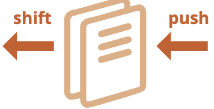

数组还有另一个用例，就是数据结构栈

- `push` 在末端添加一个元素
- `pop` 在末端取出一个元素

所有新元素的添加和取出都是从 “末端” 开始的

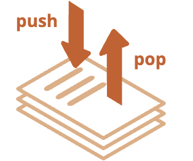


JavaScript 中的数组既可以用作队列，也可以用作栈，它们允许你从首端/末端来添加/删除元素

允许这样操作的数据结构被称为双端队列


**作用于数组末端的方法**

- `pop` 取出并返回数组的最后一个元素

  ```js
  let fruits = ["Apple", "Orange", "Pear"];
  
  alert( fruits.pop() ); // 移除 "Pear" 然后 alert 显示出来
  
  alert( fruits ); // Apple, Orange
  ```

  `fruits.pop()` 和 `fruits.at(-1)` 都返回数组的最后一个元素，但是 `furits.pop()` 同时也删除了数组的最后一个元素，进而修改了原数组

- `push` 在数组末端添加元素

  ```js
  let fruits = ['Apple', 'Orange'];
  
  fruits.push('Pear');
  
  alert( fruits ); // Apple, Orange, Pear
  ```


**作用于数组首端的方法**

- `shift`

  取出数组的第一个元素并返回它

  ```js
  let fruits = ["Apple", "Orange", "Pear"];
  
  alert( fruits.shift() ); // 移除 Apple 然后 alert 显示出来
  
  alert( fruits ); // Orange, Pear
  ```

- `unshift`

  在数组的首端添加元素

  ```js
  let fruits = ["Orange", "Pear"];
  
  fruits.unshift('Apple');
  
  alert( fruits ); // Apple, Orange, Pear
  ```

  `push` 和 `unshift` 方法都可以一次添加多个元素

  ```js
  let fruits = ['Apple'];
  
  fruits.push("Orange", "Peach");
  fruits.unshift("Pineapple", "Lemon");
  
  // ["Pineapple", "Lemon", "Apple", "Orange", "Peach"]
  alert( fruits );
  ```


**内部**

数组是一种特殊的对象，使用方括号来访问属性 `arr[0]` 实际上是来自于对象的语法，与 `obj[key]` 相同，其实 `arr` 是对象，而数字作为键（key）

数组扩展了对象，提供了特殊的方法来处理有序的数据集合以及 `length` 属性，但从本质上来讲它依旧是一个对象

数组也是通过引用来复制的

```js
let fruits = ["Banana"];

let arr = fruits; // 通过引用复制 (两个变量引用的是相同的数组)

alert( arr === fruits ); // true

arr.push("Pear"); // 通过引用修改数组

alert( fruits ); // Banana, Pear — 现在有 2 项了
```

数组真正特殊的是它们的内部实现，JavaScript 引擎尝试把这些元素一个接着一个地存储阿紫连续的内存区域，而且还有一些其它的优化，使得数组运行得非常块

但是如果不像 “有序集合” 那样使用数组，而是像常规对象那样使用数组，这些就不生效了

```js
let fruits = []; // 创建一个数组

fruits[99999] = 5; // 分配索引远大于数组长度的属性

fruits.age = 25; // 创建一个具有任意名称的属性
```

上述代码都是可以的，因为数组是基于对象的，可以给它们添加任何属性

**但这样使用 JavaScript 引擎会关闭针对数组的优化**

请将数组视作用于有序数据的特殊结构，如果需要使用任意键值，推荐使用常规对象 `{}`


**性能**

`push/pop` 方法运行的比较快，而 `shift/unshift` 比较慢

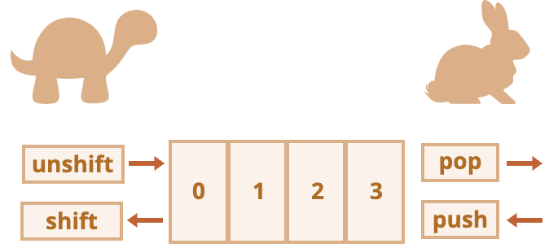

为什么作用于数组的末端会比首端快呢？

```js
fruits.shift(); // 从首端取出一个元素
```

值获取并移除索引 `0` 对应的元素是不够的，其它元素也需要重新被编号

`shift` 操作必须做三件事：

1. 移除索引为 `0` 的元素
2. 把所有的元素向左移动，把索引 `1` 改为 `0`，`2` 改为 `1` 以此类推，对其重新编号
3. 更新 `length` 属性

**数组里的元素越多，移动它们要花的时间就越多，意味占用更多的内存操作**

`unshift` 也是同样的，为了在数组的首端添加元素，首先需要将现有的元素向右移动，增加它们的索引值

`push/pop` 操作不需要移动任何元素，所以会特别快


**循环**

遍历数组最古老的方式就是使用 `for` 循环

```js
let arr = ["Apple", "Orange", "Pear"];

for (let i = 0; i < arr.length; i++) {
  alert( arr[i] );
}
```

但还有另外一种 `for..of`

```js
let fruits = ["Apple", "Orange", "Plum"];

// 遍历数组元素
for (let fruit of fruits) {
  alert( fruit );
}
```

`for..of` 不能获取当前元素的索引，只是获取元素值，但大多数情况下是够用的

技术上来讲也可以使用 `for..in`，因为数组也是对象

```js
let arr = ["Apple", "Orange", "Pear"];

for (let key in arr) {
  alert( arr[key] ); // Apple, Orange, Pear
}
```

但是这存在一些潜在的问题

1. `for..in` 会循环遍历所有属性，不仅仅是这是数字属性

   在浏览器和其它环境中有一种称为 “类数组” 的对象，它们看似是数组，它们有 `length` 和索引属性，但是也可能有其它非数字的属性和方法，但是通常是我们不需要的， `for..in` 循环会把它们都列出来

2. `for..in` 循环适用于普通对象，并做了对应的优化，但是不适用于数组，因此速度要慢 10-100 倍，当然即使这样也依然非常快，只有在遇到瓶颈时可能会有问题

通常来说，不应该使用 `for..in` 来处理数组


**关于 length**

在修改数组的时候，`length` 属性会自动更新，它实际上不是数组里元素的个数，而是最大数字索引值加一

例如：一个数组里只有一个元素，但这个元素的索引值很大，那么这个数组的 `length` 也会很大

```js
let fruits = [];
fruits[123] = 'Apple';

alert( fruits.length ); // 124
```

但通常不会这样使用数组

`length` 属性是可写的，如果手动增加它，不会发生任何事情，但是如果减少它，数据就会被截断，且该过程不可逆

```js
let arr = [1, 2, 3, 4, 5];

arr.length = 2; // 截断到只剩 2 个元素
alert( arr ); // [1, 2]

arr.length = 5; // 又把 length 加回来
alert( arr[3] ); // undefined：被截断的那些数值并没有回来
```

所以清空数组最简单的方法就是 `arr.length = 0;`


**new Array()**

这是创建数组的另一种语法

```js
let arr = new Array('Apple', 'Pear', 'etc');
```

它很少被使用，因为方括号 `[]` 更短更简洁，而且这种语法存在一个棘手的特性

如果使用了单个参数（即数字）调用了 `new Array`，那么它会创建一个指定了长度，但是没有任何项的数组

```js
let arr = new Array(2); // 创建一个 length 为 2 的数组

alert( arr[0] ); // undefined 没有元素

alert( arr.length ); // 2
```

为了避免这种意外情况，通常应该使用方括号创建数组


**多维数组**

数组里的项也可以是数组，可以将其用于多维数组，例如存储矩阵

```js
let matrix = [
  [1, 2, 3],
  [4, 5, 6],
  [7, 8, 9]
];

alert( matrix[1][1] ); // 最中间的那个数 5
```


**toString**

数组有自己的 `toString` 方法的实现，会返回以逗号隔开的元素列表

```js
let arr = [1, 2, 3];

alert( arr ); // 1,2,3
alert( String(arr) === '1,2,3' ); // true
alert( [] + 1 ); // 1
alert( [1] + 1 ); // 11
alert( [1,2] + 1 ); // 1,21
```

数组没有 `Symbol.toPrimitive`，也没有 `valueOf`，它们只能执行 `toString` 进行转换，所以这里 `[]` 就变成了一个空字符串，`[1]` 变成了 `1`，`[1,2]` 变成了 `1,2`


**不要使用 == 比较数组**

JavaScript 中的数组去其它的一些编程语言不同，不应该使用 `==` 运算符比较 JavaScript 中的数组

该运算符不会对数组进行特殊处理，它会像处理任意对象那样处理数组

如果使用 `==` 来比较数组，除非比较的两个引用是同一数组的变量，否则它们永远不相等

```js
alert( [] == [] ); // false
alert( [0] == [0] ); // false
```

与原始类型的比较也可能会产生奇怪的结果

```js
alert( 0 == [] ); // true
alert( '0' == [] ); // false
```

实际上转换为了如下代码进行比较

```js
// 在 [] 被转换为 '' 后
alert( 0 == '' ); // true，因为 '' 被转换成了数字 0

alert('0' == '' ); // false，没有进一步的类型转换，是不同的字符串
```


**数组方法**

从数组中删除元素，数组是对象，可以尝试使用 `delete`

```js
let arr = ['I', 'go', 'home'];

delete arr[1]; 删除了 'go'

alert( arr[1] ); // undefined

alert( arr.length ); // 3
```

通过使用 `delete` 删除数组元素但它有依然有 3 个元素

因为 `delete obj.key` 是通过 `key` 来移除对应的值，对于对象来说是可以，但是对于数组来说，通常希望剩下的元素能够移动都占据被释放的位置就应该使用特殊的方法


**splice**

它可以添加，删除和插入元素

```js
arr.splice(start[, deleteCount, elem1, ..., elemN]);
```

它从索引 `start` 开始修改 `arr` ，删除 `deleteCount` 个元素并在当前位置插入 `elem1, ..., elemN`，最后返回被删除的元素所组成的数组


负向索引是被允许的，它们从数组的末尾计算位置

```js
let arr = [1, 2, 5];

arr.splice(-1, 0, 3, 4);

alert( arr ); // 1,2,3,4,5
```


**slice**

```js
arr.slice([start], [end]);
```

它会返回一个新数组，将所有从索引 `start` 到 `end` (不包括 `end`) 的数组复制到一个新的数组，`start` 和 `end` 都可以是负数，这种情况下，从末尾计算索引

```js
let arr = ['t', 'e', 's', 't'];

alert( arr.slice(1, 3) ); // e,s （复制到位置 1 到位置 3 的元素）

alert( arr.slice(-2) ); // s,t (复制到位置 -2 到尾端的元素)
```

也可以不带参数地调用它：`arr.slice()` 会创建一个 `arr` 的副本，通常用于获取副本，以进行不影响原始数组的进一步转换


**concat**

`arr.concat` 创建一个新数组，其中包含来自于其他数组和其他项的值

语法

```js
arr.concat(arg1, arg2...);
```

它接受任意数量的参数，数组或值都可以

结果是一个包含来自于 `arr`，然后是 `arg1`，`arg` 的元素的新数组

如果参数 `argN` 是一个数组，那么其中的所有元素都会被复制，否则复制参数本身

```js
let arr = [1, 2];

alert( arr.concat([3, 4]) ); // 1,2,3,4

alert( arr.concat([3, 4], [5, 6]) ); // 1,2,3,4,5,6

alert( arr.concat([3, 4], 5, 6)); // 1,2,3,4,5,6
```

通常它只复制数组中的元素，其它对象，即使看起来跟数组一样，但仍然会被作为一个整体添加

```js
let arr = [1, 2];

let arrayLike = {
  0: 'something',
  length: 1
};

alert( arr.concat(arrayLike) ); // 1,2,[object Object]
```

但是，如果类数组对象具有 `Symbol.isConcatSpreadable` 属性，那么它就会被 `concat` 当作一个数组来处理：此对象中的元素将会被添加

```js
let arr = [1, 2];

let arrayLike = {
  0: 'something',
  1: 'else',
  [Symbol.isConcatSpreadable]: true,
  length: 2,
};

alert( arr.concat(arrayLike) ); // 1,2,something,else
```


**遍历：forEach**

`arr.forEach` 方法允许为数组的每个元素都运行一个函数

```js
arr.forEach(function(item, index, array)) {
// ...     
}
```

这段代码更详细地介绍了它们在目标数组中的位置

```js
['Bilbo', 'Gandalf', 'Nazgul'].forEach((item, index, array)) => {
  alert(`${item} is at index ${index} in ${array}`);
}
```

**注意：** 该函数的结果（如果它有返回）会被抛弃和忽略


**indexOf/lastIndexOf 和 includes**

- `arr.indexOf(item, from)` 从索引 `from` 开始搜索 `item`，如果找到则返回索引，否则返回 `-1`
- `arr.lastIndexOf(item, from)` 与 `indexOf(item, from)` 相同，但是从右向左找
- `arr.includes(item, from)` 从索引 `from` 开始搜索 `item`，如果找到则返回 `true`，反之返回 `false`

通常使用这另个方法只会传一个参数，传入 `item` 开始搜索，默认情况下，搜索是从头开始的

**注意：** `indexOf` 和 `includes` 使用严格相等 `===` 进行比较的


**方法 `includes` 可以正确处理 `NaN`**

方法 `includes` 可以正确处理 `NaN`，这与 `indexOf` 不同

```js
const arr = [NaN];

alert( arr.indexOf(NaN) ); // -1（错误，应该为 0）
alert( arr.includes(NaN) ); // true（正确）
```

这是因为 `includes` 比较晚的时候才被添加到 JavaScript 中的，并且在内部使用了更新了的比较算法


**find 和 findIndex/findLastIndex**

在对象数组中找到具有特定条件的对象，可以使用 `arr.find` 方法

```js
const result = arr.find(function(item, index, array)) {
	// 如果返回 true，则返回 item 并停止迭代
  // 对于假值（fasly）的情况，则返回 undefined
}
```

`arr.findIndex` 方法与 `arr.find` 具有相同的语法，但是它返回找到的元素的索引，而不是元素本身，如果没找到则返回 `-1`

`arr.findLastIndex` 方法类似于 `findIndex`，但是从右向左搜索


**filter**

`find` 方法是使函数返回 `true` 第一个（单个）元素

如果需要匹配的有很多，可以使用 `arr.filter(fn)`

```js
const results = arr.filter(function(item, index, array)) {
	// 如果返回 true, item 被 push 到 results 中，迭代继续
  // 如果什么都没找到，则返回空数组
}
```


**map**

对数组的每个元素都调用函数，并返回结果数组

```js
const result = arr.map(function(item, index, array) {
  // 返回新值而不是当前元素
})
```


**sort(fn)**

`arr.sort` 方法对象数组进行 **原位( in - place)** 排序，更改元素的顺序，原位是指在此数组中，而非生成一个新的数组

它会返回排序后的数组，但是返回值通常会被忽略，因为修改了 `arr` 本身

```js
const arr = [1, 2, 15];

// 该方法重新排列 arr 的内容
arr.sort();

alert( arr ); // 1, 15 ,2
```

上述代码的顺序不对，是因为这些元素默认情况下按字符串进行排序，所有的元素都被转换为字符串，然后按照字典顺序进行比较，要使用自己的顺序排序，需要提供一个函数作为 `arr.sort()` 的参数

```js
function compare(a, b) {
  if( a > b ) return 1; // 如果第一个值比第二个值大
  if( a == b ) return 0; // 如果两个值相等
  if( a < b ) return -1; // 如果第一个值比第二个值小
}

const arr = [ 1, 15, 2 ];

arr.sort(compare);

alert(arr); // 1, 2, 15
```

`arr.sort(fn)` 方法实现了通用的排序算法，它将遍历数组，使用提供的函数比较其元素并对其重新排序

比较函数可以返回任何数字，实际上比较函数只需要返回一个数字

- 正数表示 “大于”，表示当 a 应该排在 b 的后面
- 负数表示 “小于”，表示当 a 应该排在 b 的前面


使用箭头函数会更加简洁

```js
arr.sort( (a, b) => a - b );
```


使用 `localeCompare` for strings

字符串的比较算法默认通过字母的代码比较字母，对于许多字母，最好使用 `str.localeCompare` 方法正确地对字母进行排序，例如 `Ö`，使用德语对几个国家/地区进行排序

```js
const countries = ['Österreich', 'Andorra', 'Vietnam'];

alert( countries.sort( (a, b) => a > b ? 1 : -1 ) );  // Andorra, Vietnam, Österreich（错的）

alert( countries.sort( (a, b) => a.localeCompare(b) ) ); // Andorra,Österreich,Vietnam (对的)
```


**reverse**

`arr.reverse` 方法用于颠倒 `arr` 中元素的顺序，跟 `sort` 一样会改变原始数组元素的顺序，也会返回颠倒后的数组

```js
const arr = [1, 2, 3, 4, 5];
arr.reverse();

alert( arr ); // 5, 4, 3, 2, 1
```


**split 和 join**

`str.split(delim)` 通过给定的分隔符 `delim` 将字符串分割成一个数组

```js
const names = 'Bilbo, Gandalf, Nazgul';

const arr = names.split(', ');

for (const name of arr) {
  alert( `A message to ${name}.` ); // A message to Bilbo（和其他名字）
}
```

`split` 方法有一个可选的第二个数字参数 —— 对数组的长度的限制，如果提供了，额外的元素会被忽略

```js
const names = 'Bilbo, Gandalf, Nazgul';

alert( names.split(', ', 2) ); // Bilbo,Gandalf
```

调用带有空参数 `s` 的 `split(s)`，会将字符串拆分为字母数组

```js
const str = 'test';

alert( str.split('') ); // t,e,s,t
```


`arr.join(glue)` 与 `split` 相反，它会在它们之间创建一串由 `glue` 粘合的 `arr` 项

```js
const arr = ['Bilbo', 'Gandalf', 'Nazgul'];

const str = arr.join(';'); // 使用分号 ; 将数组粘合成字符串

alert( str ); // Bilbo;Gandalf;Nazgul
```


**reduct/reductRight**

用于根据数组计算单个值、

语法：

```js
const value = arr.reduce(function(accumulator, item, index, array) {
	// ...
}, [initial]);
```

该函数一个接一个地应用于所有数组元素，并将其结果搬运到下一个调用

参数：

- `accumulator` —— 是上一个函数调用的结果，第一次等于 `initial`（如果提供了 `initial` 的话）
- `item` —— 当前的数组元素
- `index` —— 当前索引
- `arr` —— 数组本身

应用函数时，上一个函数调用的结果将作为第一个参数传递给下一个函数

因此，第一个参数本质上是累加器，用于存储所有先前执行的组合结果，最后它成为 `reduce` 的结果

```js
const arr = [1, 2, 3, 4, 5];

const result = arr.reduce((sum, current) => 5, 0);

alert(result); // 15
```

传给 `reduce` 的函数仅使用了 2 个参数，通常这就足够了

运行过程：

1. 在第一次运行时，`sum` 的值为初始值 `initial`，等于 `0`，`current` 是第一个数组元素，等于 `1`，所以函数运行的结果是 `1`
2. 在第二次运行时，`sum = 1`，将第二个数组元素 `2` 与其相加并返回
3. 第三次运行时中，`sum = 3`，继续把下一个元素与其相加，以此类推......

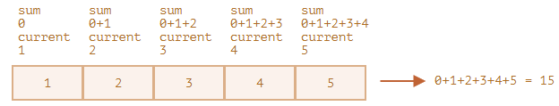

|             | `sum` | `current` | `result` |
| :---------- | :---- | :-------- | :------- |
| 第 1 次调用 | `0`   | `1`       | `1`      |
| 第 2 次调用 | `1`   | `2`       | `3`      |
| 第 3 次调用 | `3`   | `3`       | `6`      |
| 第 4 次调用 | `6`   | `4`       | `10`     |
| 第 5 次调用 | `10`  | `5`       | `15`     |


也可以省略初始值

```js
let arr = [1, 2, 3, 4, 5];

// 删除 reduce 的初始值（没有 0）
let result = arr.reduce((sum, current) => sum + current);

alert( result ); // 15
```

如果没有初始值，那么 `reduce` 会将数组的第一个元素作为初始值，并从第二个元素开始迭代

计算过程

|             | `sum` | `current` | `result` |
| :---------- | :---- | :-------- | :------- |
| 第 1 次调用 | `1`   | `2`       | `3`      |
| 第 2 次调用 | `3`   | `3`       | `6`      |
| 第 3 次调用 | `6`   | `4`       | `10`     |
| 第 4 次调用 | `10`  | `5`       | `15`     |

但是如果不指定初始值使用需要非常小心，如果数组为空，那么在没有初始值的情况下调用 `reduce` 会导致错误

```js
let arr = [];

// Error: Reduce of empty array with no initial value
// 如果初始值存在，则 reduce 将为空 arr 返回它（即这个初始值）
arr.reduce((sum, current) => sum + current);
```

**建议始终指定初始值**

`arr.reduceRight` 和 `arr.reduce` 方法的功能一样，只是遍历从右到左


**Array.isArray**

数组是基于对象的，不构成单独的语言类型

所以借助 `typeof` 不能帮助从数组中区分出普通对象

```js
alert( typeof {} ); // object
alert( typeof [] ); // object
```

所以需要使用 `Array.isArray(value)` 来判断，如果 `value` 是一个数组，则返回 `true`，否则返回 `false`

```js
alert(Array.isArray({})); // false

alert(Array.isArray([])); // true
```


**大多数方法都支持 thisArg**

几乎所有调用函数的数组方法 —— 例如 `find`、`filter`、`map`，除了 `sort`，都接受一个可选的附加参数 `thisArg`

该参数很少使用

```js
arr.find(func, thisArg);
arr.filter(func, thisArg);
arr.map(func, thisArg);
// ...
// thisArg 是可选的最后一个参数
```

`thisArg` 参数的值在 `func` 中变为 `this`

例子：使用 `army` 对象方法作为过滤器，`thisArg` 用于传递上下文

```js
const army = {
  minAge: 18,
  maxAge: 27,
  canJoin(user) {
    return user.age >= this.minAge && user.age < this.maxAge;
  }
};

const users = [
  {age: 16},
  {age: 20},
  {age: 23},
  {age: 30}
];

// 找到 army.canJoin 返回 true 的 user
const soldiers = users.filter(army.conJoin, army);

console.log(soldiers.length); // 2
console.log(soldiers[0].age); // 20
console.log(soldiers[1].age); // 23
```

可以使用 `users.filter(user => army.canJoin(user))` 替换 `users.filter(army.canJoin, army)` 的调用
