# 精通 CSS：高级 Web 标准解决方案（第 3 版）

## 第一章 基础知识

**渐进增强：** 保证低版本浏览器基本功能实现的前提下再去增加效果、交互以及功能

**优雅降级：** 优先对最新的浏览器来设计网站，再对低版本浏览器修复较大的错误

可以通过以下两种方式进行渐进增强

1. 使用浏览器厂商前缀

   ```css
   .demo {
     -webkit-transform: translate(0, 10px);
     -moz-transform: translate(0, 10px);
     -ms-transform: translate(0, 10px);
     /* 标准属性不要忘记加了，一定要放在厂商前缀声明的后面 */
     transform: translate(0, 10px);
   }
   ```

2. 使用条件规则与检测脚本

   ```css
   @supports (display: grid) {
     /* 在支持网格布局的浏览器中要应用的规则 */
   }
   ```

**语义化标签和类名结合**

问题 1：如果只使用 `div` 对文档没有任何语义作用，只是借助类名添加样式

```html
<div class="article">
  <div class="header">
    <h1>我是标题</h1>
  </div>
  <p>我是文本</p>
</div>
```

问题 2：如果只使用语义化标签则存在标签(除 `main` 标签外)重复，导致样式重复

```html
<article>
  <header>
    <h1>我是标题</h1>
  </header>
  <p>我是文本</p>
</article>
```

解决以上两个问题可以将语义标签和类名结合起来

```html
<article class="post">
  <header class="post-header">
    <h1>我是标题</h1>
  </header>
  <p>我是文本</p>
</article>
```

**语义化扩展**

1. ARIA 的 `role` 属性，用于无障碍优化，针对辅助访问设备添加更多的语义

   `role` 属性相关的值：https://www.w3.org/TR/wai-aria-1.1/#role_definitions

   `aria-*` 相关属性和值：https://developer.mozilla.org/zh-CN/docs/Web/Accessibility/ARIA/Attributes

   ```html
   <a
     href="#"
     role="slider"
     aria-labelledby="volume-label"
     aria-valuemin="1"
     aria-valuemax="100"
     aria-valuenow="67"
   ></a>
   ```

   `aria-labelledby`、`aria-valuemin`、`aria-valuemax`、`aria-valuenow` 属性也提供了额外的滑动条信息

   要使用 `<button>` 而不是使用 `<div role="button">`，**优先使用语义化标签**

2. 微格式，通过一组标准的类名定义来表示数据类型，便于开发者编写工具从中提取数据

   ```html
   <section class="h-card">
     <p>
       <a class="u-url p-name" href="https://github.com/wjw020206"
         >CodePencil</a
       >
       <span class="p-org">Enterprises</span>
       <a class="u-email" href="mailto:info@mail.com">Email</a>
     </p>
     <p class="p-adr">
       <span class="p-locality">China</span>
       <span class="p-country-name">China</span>
     </p>
   </section>
   ```

3. 微数据，与语义化标签一起使用，把定义格式的事情交给了第三方，http://schema.org 是由 Bing、Google、Yahoo! 等搜索引擎共同创建的词汇表

   ```html
   <section itemscope itemtype="http://schema.org/Person">
     <p>
       <a itemprop="name" href="https://github.com/wjw020206">CodePencil</a>
       <span
         itemprop="affiliation"
         itemscope
         itemtype="http://schema.org/Organization"
       >
         <span itemprop="name">Enterprises</span>
       </span>
       <a itemprop="email" href="mailto:info@mail.com">Email</a>
     </p>
     <p itemprop="address" itemscope itemtype="http://schema.org/PostalAddress">
       <span class="addressLocality">China</span>
       <span class="addressCountry">China</span>
     </p>
   </section>
   ```

## 第二章 添加样式

```html
<h2>我是h2标签</h2>
<p>我是p标签</p>
<span>我是span标签</span>
<p>我是p标签</p>
<p>我是p标签</p>
```

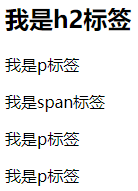

**相邻同辈选择符**

```css
h2 + p {
  color: blue;
  font-weight: 700;
  font-style: italic;
}
```

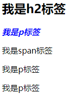

**一般同辈选择符**

```css
h2 ~ p {
  color: blue;
  font-weight: 700;
  font-style: italic;
}
```

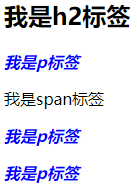

**通用选择符**

```html
<div class="box1">
  <div>我的div标签</div>
  <span>我是span标签</span>
  <h2>我是h2标签</h2>
</div>
```

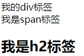

```css
.box > * {
  color: blue;
  font-weight: 700;
  font-style: italic;
}
```

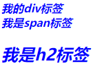

**属性选择符**

- 匹配以某些字符开头的属性值

  ```html
  <a href="https://www.google.com">google</a>
  ```

  ```css
  a[href^='https:'] {
    /* 要设置的样式 */
  }
  ```

- 匹配以某些字符结尾的属性值

  ```html
  
  ```

  ```css
  img[src$='.jpg'] {
    /* 要设置的样式 */
  }
  ```

- 匹配包含某些字符的属性值

  ```html
  <a href="https://www.google.com">google</a>
  ```

  ```css
  a[href*='google'] {
    /* 要设置的样式 */
  }
  ```

- 匹配以空格分隔的字符串的属性值

  ```html
  <a href="https://www.google.com" class="link active">google</a>
  ```

  ```css
  /* a[class~="active"] 也可以 */
  a[class~='link'] {
    /* 要设置的样式 */
  }
  ```

- 匹配指定值后连着一个短划线的属性值

  ```html
  <a href="https://www.google.com" class="web-link">google</a>
  ```

  ```css
  a[class|='web'] {
    /* 要设置的样式 */
  }
  ```

**伪元素**

- 选择一段文本的第一个字符

  ```css
  p::first-letter {
    font-size: 30px;
  }
  ```

- 选择一段文本的第一行

  ```css
  p::first-line {
    font-size: 30px;
  }
  ```

**伪类**

```html
<p class="comment" id="comment">我是一段文本</p>
```

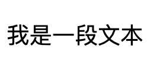

- 选中目标(目标上必须同时要有 `class` 和 `id` 属性且值相同)

  ```css
  .comment:target {
    color: red;
  }
  ```

  但在页面的 URL 尾部加上 `#comment` 即可使样式被应用，例如：`http://example.com/index.html#comment`

  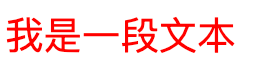

- 反选目标(伪元素和它自身(`:` 前面的选择器)不能被反选)

  ```html
  <p class="comment">我是p标签里的一段文本</p>
  <div class="comment">我是div标签里的一段文本</div>
  ```

  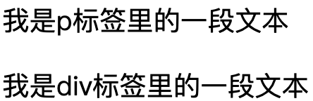

  ```css
  /* 排除了p标签 */
  .comment:not(p) {
    color: red;
  }
  ```

  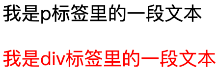

**层叠**

- 作者样式表：网页开发者所编写的样式
- 用户样式表：用户通过浏览器设置为网站应用自己的样式
- 浏览器的默认样式表：一般都会比作者样式表覆盖

**优先级（从高到低排序）**

1. 标记了 `!important` 的用户样式(方便使用高对比度的无障碍模式)
2. 标记了 `!important` 的作者样式
3. 作者样式
4. 用户样式
5. 浏览器的默认样式

**超链接伪类的层叠次序**

1. `a:link`
2. `a:visited`
3. `a:hover`
4. `a:focus`
5. `a:active`

**继承**

任何直接应用给元素的样式都会覆盖掉继承的样式，继承的样式没有特殊性

- 字体属性：`font`、`font-family`、`font-size`、`font-style`、`font-weight`
- 文本属性：`text-align`、`text-indent`、`text-transform`、`text-decoration`、`word-spacing`、`letter-spacing`、`line-height`
- 颜色属性：`color`
- 列表属性：`list-style`

**为文档应用样式表**

- 直接把样式放在 `style` 标签中

- 使用 `link` 标签导入外部的样式表 **(推荐)**

  ```html
  <link href="/c/modules.css" rel="stylesheet" />
  ```

- 使用 `@import` 指令加载外部的样式表

  ```html
  <style>
    @import url('/c/modules.css');
  </style>
  ```

声明次序就是在源码中出现的次序

```html
<head>
  <link ref="stylesheet" href="css/sheet1.css" />
  <style>
    @import 'css/sheet3.css';
    h1 {
      color: red;
    }
  </style>
  <link ref="stylesheet" href="css/sheet2.css" />
</head>
```

若都使用相同特殊性的选择符，声明次序如下：

1. `sheet1.css` 中的样式
2. 导入 `style` 标签中 `sheet3.css` 中的样式
3. `style` 标签中的样式
4. `sheet2.css` 中的样式

最终应用的样式是 `sheet2.css` 中的样式，因为是最后声明的

**性能**

度量 Web 性能的一个重要指标就是网页的内容实际显示在屏幕上需要多久(**渲染时间**)

渲染一个网页至少需要两样东西：HTML 和 CSS

- 减少 HTTP 请求：因为每个文件都需要单独发送一次 HTTP 请求，需要花费一定的时间下载，因此在生产环境中把 CSS 文件数量控制在 1 或 2 个，并尽量不要使用 `@import` ，因为 `@import` 会发送额外的请求获取导入文件

- 压缩和缓存内容：使用 GZIP 压缩线上资源，通过 Web 服务器设置一定的 CSS 文件缓存时间

- 不要让浏览器渲染阻塞 JavaScript：如果在文档的 `head` 标签中加入了 `script` 标签，浏览器就必须先下载脚本再向用户显示网页内容，导致页面渲染被阻塞了

  - 主流做法是将 `script` 标签放入 `</body>` 标签结束之前加载 JavaScript

    ```html
    <body>
      ...
      <!-- 最后加载JavaScript -->
      <script src="script/index.js"></script>
    </body>
    ```

  - 现代做法是在 `head` 标签中放入 `script` 标签，但是要加上 `async` 和 `defer` 属性，具体使用哪个属性要看脚本中具体的内容

    ```html
    <head>
      <!-- 异步加载JavaScript，但下载后立即执行 -->
      <script src="script/index.js" async></script>
      <!-- 异步加载JavaScript，但在HTML解析后执行 -->
      <script src="script/core.js" defer></script>
    </head>
    ```

## 第三章 可见格式化模型

**盒模型**

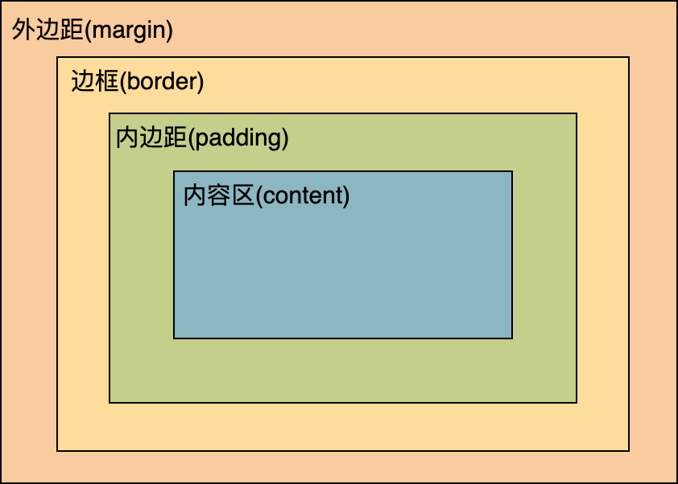

**内边距：** 内边距是内容区周围的空间，**给元素应用背景会作用于元素的内容区和内边距**

```html
<div class="box"></div>
```

```css
.box {
  width: 100px;
  height: 100px;
  background: url(./demo.jpg);
  /* 内边距 */
  padding: 50px;
}
```

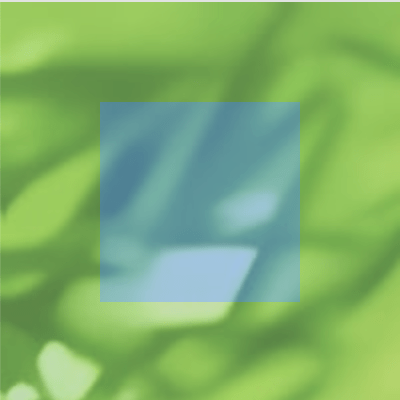

**边框：** 边框是在内边距的外侧增加的一条框线

```css
.box {
  width: 100px;
  height: 100px;
  background: url(./demo.jpg);
  padding: 50px;
  /* 边框 */
  border: 10px solid #000;
}
```

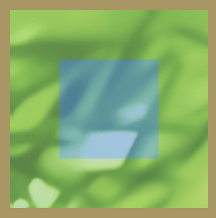

**外边距：** 边框外侧的是外边距，围绕在盒子可见区域之外的透明区域

```css
.box {
  width: 100px;
  height: 100px;
  background: url(./demo.jpg);
  padding: 50px;
  border: 10px solid #000;
  /* 外边距 */
  margin: 50px;
}
```

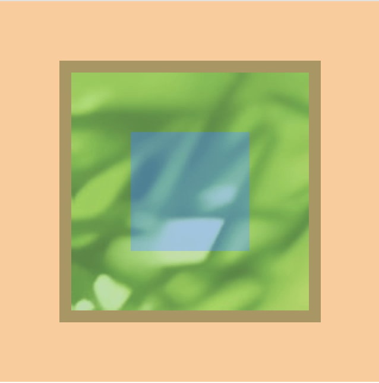

**轮廓线：** 在边框的外围画出一条线，**不会影响盒子的大小**，常用语调试和演示布局效果

```css
.box {
  width: 100px;
  height: 100px;
  background: url(./demo.jpg);
  padding: 50px;
  border: 10px solid #000;
  margin: 50px;
  /* 轮廓线 */
  outline: 10px solid red;
}
```

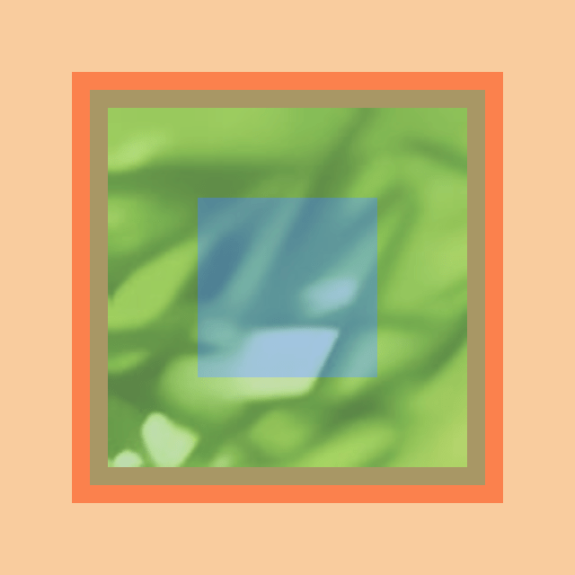

**盒子大小：** 通过修改 `box-sizing` 属性可以改变计算盒子大小的方式

- **content-box：** `box-sizing` 属性的**默认值**，此时盒子的大小不包含内边距和边框
- **border-box：** 此时盒子的大小包含了内边距和边框

**包含块：** 大部分情况下，包含块**指向一个元素最近的块级长辈元素(不仅指祖先元素也指父元素)**的内容区域

**包含块的作用：** 一个元素的尺寸和位置经常被它的包含块所影响，应用在 `width`、`height`、`padding`、`margin` 上的**百分比单位**以及 `absolute` 定位的元素偏移属性都是根据元素的包含块计算出来的，包含块就是计算的基准

```html
<div class="box">
  <!-- block是p标签的包含块,因为我是p标签从里到外找到的第一个块级长辈元素 -->
  <div class="block">
    <span>
      <p></p>
    </span>
  </div>
</div>
```

**标识一个包含块：** 取决于元素的 `position` 属性

1. 如果属性值是 `static`、`relative`、`sticky`，包含块通过最近**长辈元素**的**内容区域(content)**的边界来形成，长辈元素可以是一个块级容器(例如：`inline-block` 容器、`block` 容器、`list-item` 容器或者块级容器本身)，也可以是建立了格式化上下文(例如：`flex` 容器、`table` 容器、`grid` 容器或者块级容器本身)
2. 如果属性值是 `absolute`，包含块变成了最近的长辈元素的**内边距区域(padding)**，这个最近的长辈元素是指它的 `position` 的属性值不是 `static` (可以是 `fixed`，`absolute`、`relative` 或者 `sticky`)的元素，**忽略了内边距，体现了绝对定位的效果**
3. 如果属性值是 `fixed`，包含块由窗口(在连续媒体情况下)或者页面区域(在页面媒体情况下)所确定
   - **连续媒体**一般指音频或者运动视频
4. 如果属性值是 `absolute` 或者 `fixed`，包含块同样会变成最近的长辈元素的内边距区域，这个最近的长辈元素符合以下的条件
   1. `transform` 或者 `perspective` 的值不是 `none`
   2. `will-change` 属性值是 `transform` 或者 `perspective`
   3. `filter` 的值不是 `none` 或者 `will-change` 的值不是 `filter`(仅在 firefox 有效)
   4. `contain` 的值是 `paint`
5. 包含根元素 `html` 的矩形包含块被称为**初始包含块**，它有视口(对连续媒体)或者页面区域(对于页面媒体)的尺寸

**百分比单位(%)：** 某些属性给定一个百分比值，它的计算结果取决于与元素的包含块

1. `height`、`top` 还有 `bottom` 属性从它的包含块的 `height` 计算它的百分比值
2. `width`、`left`、`right`、`padding`、`margin` 都是从它的包含块的 `width` 计算它的百分比值

```html
<section>
  <p>This is a paragraph</p>
</section>
```

**案例 1：**

```css
body {
  background: beige;
}
section {
  display: block;
  width: 400px;
  height: 160px;
  background: lightgray;
}
p {
  width: 50%; /* 400px * 50% = 200px */
  height: 25%; /* 160px * 25% = 40px */
  margin: 5%; /* 400px * 5% = 20px */
  padding: 5%; /* 400px * 5% = 20px */
  background: cyan;
}
```

**解释：** `p` 元素的 `position` 属性为 `static`，所以它最近的包含块为 `section`，`p` 元素的 `width`、`padding` 、`margin` 百分比值根据 `section` 的**宽度**来计算，`height` 的百分比值根据 `section` 的**高度**来计算

**案例 2：**

```css
body {
  background-color: beige;
}
section {
  display: inline;
  background: lightgray;
}
p {
  width: 50%; /* 值为body宽度的一半 */
  height: 200px;
  background-color: cyan;
}
```

**解释：**因为 `section` 标签是**行内元素**，所以 `p` 标签的包含块为 `body`，`p` 标签的 `width` 是 `body` 的宽度的一半

**案例 3：**

```css
body {
  background-color: beige;
}
section {
  position: absolute;
  left: 30px;
  top: 30px;
  width: 400px;
  height: 160px;
  padding: 30px 20px;
  background: lightgray;
}
p {
  position: absolute;
  width: 50%; /* (400px + 20px * 2) * 50% = 220px */
  height: 25%; /* (160px + 30px * 2) * 25% = 55px */
  margin: 5%; /* (400px + 20px * 2) * 5% = 22px */
  padding: 5%; /* (400px + 20px * 2) * 5% = 22px */
  background-color: cyan;
}
```

**解释：** 因为 `p` 标签的 `position` 属性值为 `absolute`，因此会去寻找 `position` 属性值不是 `static` 的长辈元素作为包含块，`p` 标签的百分比值会受到包含块的 `padding` 的值的影响，因为绝对定位的元素的**包含块是长辈元素的内边距区域**，如果想要消除这个影响可以把长辈元素的 `box-sizing` 属性设置为 `border-box`，此时结果如下：

```css
body {
  background-color: beige;
}
section {
  position: absolute;
  left: 30px;
  top: 30px;
  width: 400px;
  height: 160px;
  padding: 30px 20px;
  background: lightgray;
  /* 消除padding的影响 */
  box-sizing: border-box;
}
p {
  position: absolute;
  width: 50%; /* 400px * 50% = 200px */
  height: 25%; /* 160px * 25% = 40px */
  margin: 5%; /* 400px * 5% = 20px */
  padding: 5%; /* 400px * 5% = 20px */
  background-color: cyan;
}
```

**案例 4：**

```css
body {
  background-color: beige;
}
section {
  width: 400px;
  height: 480px;
  margin: 30px;
  padding: 15px;
  background: lightgray;
}
p {
  position: fixed;
  width: 50%; /* 屏幕宽度 * 50% */
  height: 50%; /* 屏幕高度 * 50% */
  margin: 5%; /* 屏幕宽度 * 5% */
  padding: 5%; /* 屏幕宽度 * 5% */
  background-color: cyan;
}
```

**解释：** 因为 `p` 元素的 `position` 值为 `fixed`，此时它的包含块是初始包含块(浏览器视口的大小)

**案例 5：**

```css
body {
  background-color: beige;
}
section {
  transform: rotate(0deg);
  width: 400px;
  height: 160px;
  background: lightgray;
}
p {
  position: absolute;
  left: 80px;
  top: 30px;
  width: 50%; /* 400px * 50% = 200px */
  height: 25%; /* 160px * 25% = 40px */
  margin: 5%; /* 400px * 5% = 20px */
  padding: 5%; /* 400px * 5% = 20px */
  background-color: cyan;
}
```

**解释：** 因为 `p` 元素的 `position` 值为 `absolute`，`section` 的 `transform` 属性值不为 `none`，所以 `p` 元素的包含块为 `section`

在 CSS 中，**任何需要设置高度的时候都应该要谨慎**，元素的高度应该取决于所包含的内容，实在需要明确设定默认高度，**最好使用 `min-height`**，允许盒子的高度随内容扩展

**块级元素：** 显示为内容块或块级盒子的形式

- **沿垂直方向堆叠**，盒子垂直方向的间距由上、下外边距决定

**行内元素：** 内容显示为行内盒子的形式

- **沿文本水平排列**，会随着文本换行而换行

- 明确设置高度和宽度不会起作用

- 高度不受到**垂直方向上**的内边距、边框和外边距的影响

  ```html
  <div>TEST</div>
  <div class="box">
    <span>CodePencil</span>
  </div>
  ```

  ```css
  .box span {
    background-color: red;
    /* 行内元素高度不受垂直方向的内边距影响 外边距、边框同理 */
    padding-top: 10px;
  }
  ```

  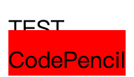

  ```html
  <div>TEST</div>
  <div class="box">
    <div>CodePencil</div>
  </div>
  ```

  ```css
  /* 把行内元素换成块级元素则高度改变 */
  .box div {
    background-color: red;
    padding-top: 10px;
  }
  ```

  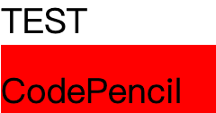

**行盒子(line box 也叫行框)：** 由一行文本形成的水平盒子叫做行盒子，行盒子的高度由所包含的行内盒子决定，**修改行盒子的大小的唯一途径就是修改行高(line-height)或者内部的行内盒子设置水平方向的边框、内边距和外边距**

```html
<body>
  <p>Hello <span>JavaScript</span>!</p>
</body>
```

代码中 `<p>` 标签内部是一个行盒子 `<span>` 标签内部也是一个行盒子，有两个行盒子(嵌套的)

使用 `display: table` 可以让非表格元素采用表格的布局方式

```html
<div class="table">
  <div class="row">
    <div class="cell">列标题1</div>
    <div class="cell">列标题2</div>
    <div class="cell">列标题3</div>
  </div>
  <div class="row">
    <div class="cell">行1，列1</div>
    <div class="cell">行1，列2</div>
    <div class="cell">行1，列3</div>
  </div>
  <div class="row">
    <div class="cell">行2，列1</div>
    <div class="cell">行2，列2</div>
    <div class="cell">行2，列3</div>
  </div>
</div>
```

```css
.table {
  display: table;
  border-collapse: collapse;
  margin-top: 30px;
}
.row {
  display: table-row;
}
.row:first-child {
  font-weight: 700;
}
.cell {
  display: table-cell;
  padding: 10px;
  border: 3px solid #000;
  border-collapse: collapse;
}
```

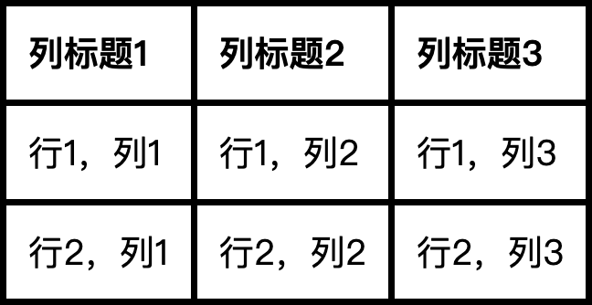

**块级元素：** 当元素的 `display` 属性为 `block`、`list-item`、`table` 时会被标记为块级元素，垂直排列，一行占一个，同时参与块级格式化上下文(BFC)，块级元素内部至少生成一个**块级盒**，也可能是**块级容器盒**

**块级盒：** 描述它与兄弟元素的表现方式

**块级容器盒：** 描述它与它的子元素的表现方式，一个块容器盒只包含其他块级盒，或者生成一个行内格式化上下文来只包含行内盒

**块盒：** 指既是块级盒也是块级容器盒

```html
<div class="blockContainerBox" style="background: red; height: 100px">
  <div
    class="blockLevelBox"
    style="background: blue; height: 20px; width: 20px"
  ></div>
  <div
    class="inlineBlockBox"
    style="
      background: green;
      height: 20px;
      width: 20px;
      display: inline-block;
    "
  ></div>
  <div
    class="inlineBlockBox"
    style="
      background: green;
      height: 20px;
      width: 20px;
      display: inline-block;
    "
  ></div>
</div>
```

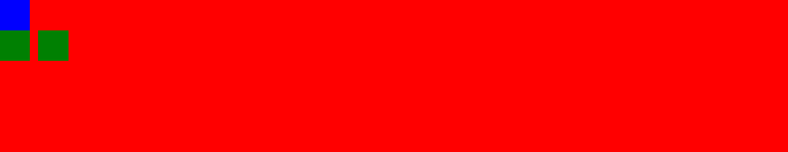

因为 `blockContainerBox` 既块级盒也是块级容器盒，被称为**块盒**，因为块级盒内部只能包含其他块级盒或者生成一个行内格式化上下文来只包含行内盒，但是 `blockContainerBox` 内部既包含了块级盒，也包含了两个行内盒，浏览器会自动生成一个**匿名块盒**来包裹两个行内盒，匿名块盒会生成一个行内格式化上下文来包含两个行内盒

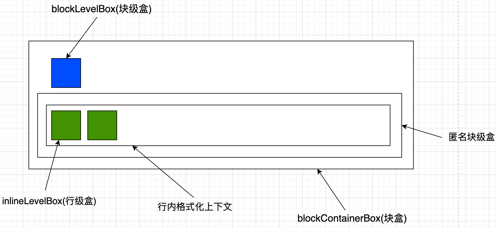

**行内级元素：** 当 `display` 属性设置为 `inline`、`inline-block`、`inline-table` 时，这些盒子会被标记为行内级元素，在水平方向上排列，如果宽度不够会自动换行

**替换元素：** 指具有内在尺寸的元素，如 `img`、`video` 等，它们的尺寸不受到外部样式的影响

**非替换元素：** 指没有内在尺寸的元素，如 `span`、`div` 等，它们的尺寸会受到外部样式的影响

**行内盒(行盒子)：**当**行内级元素参与行内格式化上下文**后被称为行内盒，所有的 `display: inline` 的非替换元素生成的盒都是行内盒

```html
<p>台湾是<strong>中国不可分割的领土</strong></p>
```

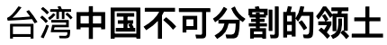

因为 `p` 标签是块盒，内部包含了行内元素所以生成的行内格式化上下文来包含行内元素，此时为**台湾是**这三个字生成的了匿名的行内盒，也为 `strong` 标签本身也是行内盒，所以在水平方向上排列

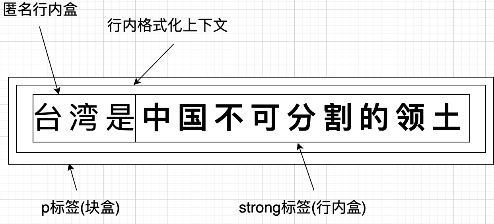

**外边距折叠**

> 行内盒子和浮动盒子以及绝对定位盒子外边距不会发生折叠，外边距折叠只发生在常规文档流中的块级盒子的垂直方向上的外边距

- 上方**块盒子**和下方**块盒子**的上下外边距相互折叠

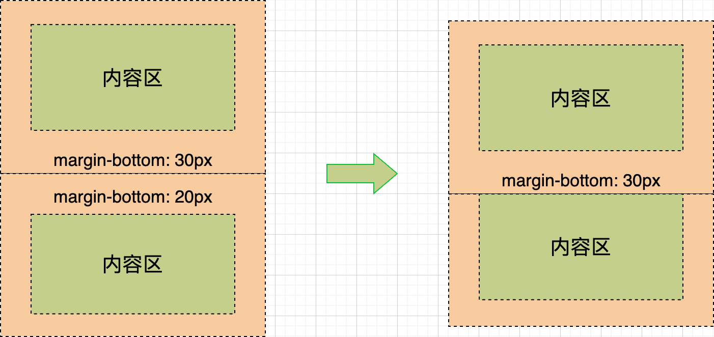

- 一个**块盒子**内部包含另一个**块盒子**，且**没有内边距或边框来分隔外边距**的情况下上下外边距也会发生折叠

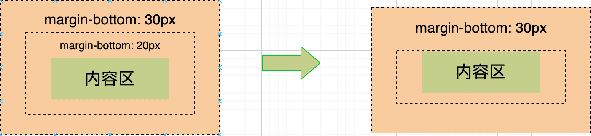

这样设计的好处就是当块盒子的内容区没有高度的时候，盒子的上外边距和下外边距会折叠成一个边距

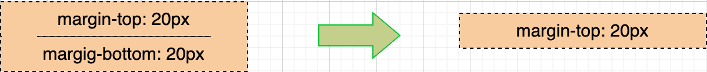

折叠后的外边距又碰到其它块盒子又会继续折叠

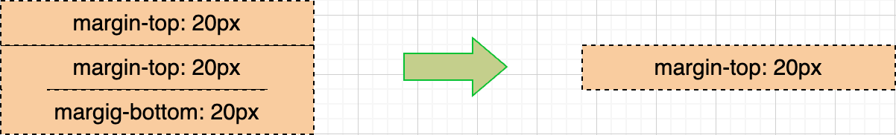

**浮动**

当块级元素浮动时宽度和高度会**收缩为其中内容最小的宽度和高度**，除非明确设定其宽度和高度

```html
<div class="box">box1</div>
<div class="box">box2</div>
<div class="box">box3</div>
```

```css
.box {
  background-color: red;
  float: left;
}
.box:nth-of-type(3) {
  float: right;
}
```

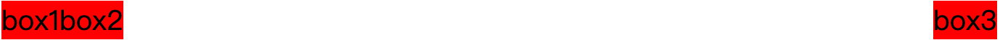

**清除浮动**

> 浮动元素会脱离文档流，影响常规文档流的元素

没有应用浮动的情况下

```html

<p>
  我是文本我是文本我是文本我是文本我是文本我是文本我是文本我是文本我是文本我是文本我是文本我是文本我是文本我是文本我是文本我是文本我是文本我是文本我是文本我是文本我是文本我是文本我是文本我是文本我是文本我是文本我是文本我是文本我是文本我是文本我是文本我是文本我是文本我是文本我是文本我是文本我是文本我是文本
</p>
<p>
  我是文本我是文本我是文本我是文本我是文本我是文本我是文本我是文本我是文本我是文本我是文本我是文本我是文本我是文本我是文本我是文本我是文本我是文本我是文本我是文本我是文本我是文本我是文本我是文本我是文本我是文本我是文本我是文本我是文本我是文本我是文本我是文本我是文本我是文本我是文本我是文本我是文本我是文本
</p>
```

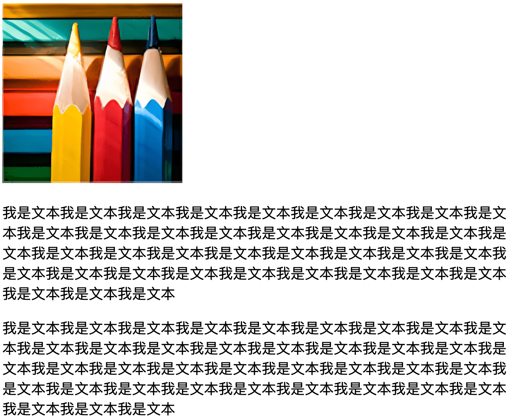

给图片应用浮动，虽然 `p` 标签忽视了浮动元素，但是内部的文本(行盒子)依旧在排布时避开图片，形成了文字环绕图片的效果，**浮动就是为了在网页中显示文字环绕图片效果而引入的**

```css
img {
  width: 200px;
  float: left;
}
```

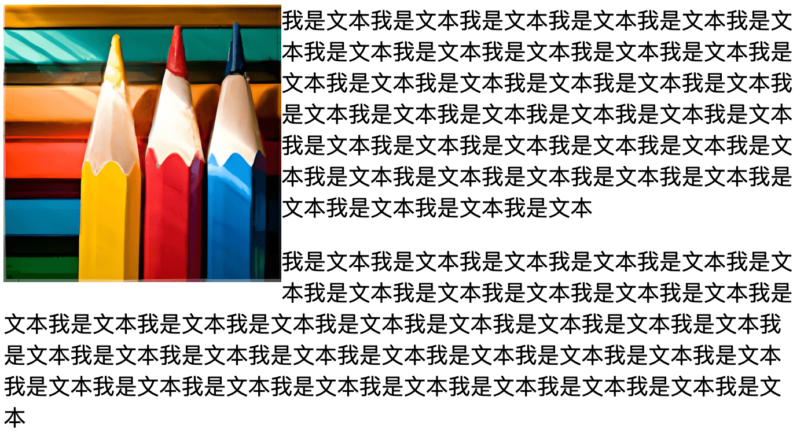

要想阻止行盒子环绕在浮动元素外面的行为，需要给包含行盒子的元素添加 `clear` 属性，用于指定元素哪一侧不挨着浮动元素

```css
p:nth-of-type(2) {
  /* 让第二段文本的左侧不挨着浮动元素 */
  clear: left;
}
```

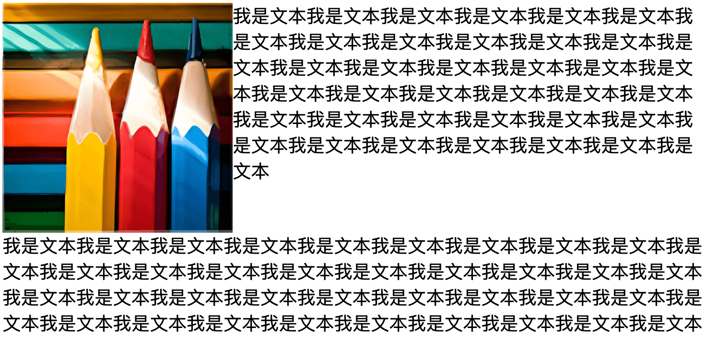

**注意：** 此时浏览器会在这个 **清除浮动的元素的上方添加做够大的外边距**，使得行盒子不紧挨着浮动元素，这个行为通过浏览器的开发者工具是无法查看到的，如果要给这个清除浮动的元素添加外边距需要值大于浏览器添加的外边距才会生效

```css
p:nth-of-type(2) {
  clear: left;
  /* 假设浏览器添加的外边距是42px，此时10px小于42px，因此外边距没有效果 */
  margin-top: 10px;
}
```


```css
p:nth-of-type(2) {
  clear: left;
  /* 假设浏览器添加的外边距是42px，外边距100px大于42px，外边距生效 */
  margin-top: 100px;
}
```

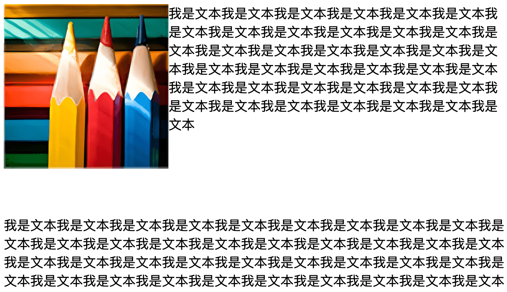

因为浮动元素不会占据文档流，所以导致**包含浮动元素的盒子无法生成高度**，此时可以使用伪元素创建一个空元素来清除浮动，使得包括浮动元素的盒子可以生成高度

```html
<div class="media-block">
  
  <div class="media-body">
    <h3>这是文章的标题</h3>
    <p>简要说明</p>
  </div>
</div>
```

```css
.media-block {
  background-color: gray;
  border: 1px solid black;
}
.media-fig {
  float: left;
  width: 30%;
}
.media-body {
  float: right;
  width: 65%;
}
/* 通过伪元素清除两边的浮动，使得外部容器可以生成高度 */
.media-block::after {
  content: '';
  display: block;
  clear: both;
}
```

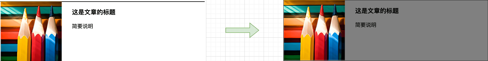

**格式化上下文**

> 浏览器在摆放盒子的时候会通过盒子的类型生成格式化上下文
>
> 分为**块级格式化上下文(Block Formatting Context)** 和**行内格式化上下文(Inline Formatting Context)**

- **块级格式化上下文(Block Formatting Context)**

  创建了块级格式化上下文的元素规定了内部的块级盒如何布局，并使该盒子在页面上形成一个隔离的独立容器，容器里面的子元素不会影响到外面的元素，反之亦然

  _下列情况将创建一个块格式化上下文：_

  - 根元素 ( html )
  - 浮动 (元素的 `float` 属性值不为 `none` )
  - 绝对定位元素 (元素的 `position` 属性值为 `fixed` 或 `absolute` )
  - 行内块 (元素的 `display: inline-block` )
  - 表格单元格 (元素的 `display: table-cell`，HTML 表格单元格默认属性 )
  - 表格标题 (元素的 `display: table-caption`，HTML 表格标题默认属性 )
  - `overflow` 的属性值不为 `visible` 的元素
  - 弹性元素 ( `display: flex` 或 `display: inline-flex` 的元素的**直接子元素** )
  - 网格盒子 ( `display: grid` 或 `display: inline-grid`的元素的**直接子元素** )

  详细参考：https://developer.mozilla.org/zh-CN/docs/Web/CSS/CSS_display/Block_formatting_context

> PS：直接子元素是指一个元素的直接下级子元素，例如 A 元素中包含着 B 和 C，那 B 和 C 就是 A 元素的直接子元素

**作用：**

1. 在一个块级格式化上下文内部的盒子会在垂直方向，从顶部一个接着一个地放置

2. 同一个块级格式化上下文的相邻的两个盒子的垂直外边距会发生折叠

3. 在一个块级格式化上下文中每个元素外边距 (margin) 都会与其父元素左侧边框 (border) 开始，不会超出包含块的边界，即使存在浮动也是如此

4. 块级格式化上下文区域中的内容不会与浮动元素发生遮挡

   ```css
   <div class="media-block">
     
     <div class="media-body">
       <h3>这是文章的标题</h3>
       <p>
         简要说明简要说明简要说明简要说明简要说明简要说明简要说明简要说明简要说明简要说明简要说明简要说明简要说明简要说明简要说明简要说明简要说明简要说明简要说明简要说明简要说明简要说明简要说明简要说明简要说明简要说明简要说明简要说明简要说明简要说明简要说明简要说明简要说明简要说明简要说明简要说明简要说明简要说明
       </p>
     </div>
   </div>
   ```

   ```css
   .media-block {
     background-color: gray;
     border: 1px solid black;
   }
   .media-fig {
     float: left;
     width: 30%;
   }
   .media-body {
     margin-left: 10px;
     background-color: red;
     /* 创建BFC区域，与浮动元素不会发生遮挡 */
     overflow: auto;
   }
   ```

   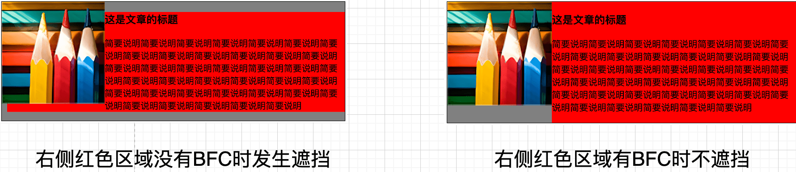

5. 计算块级格式化上下文区域高度时，浮动元素也会参与计算

   ```css
   .media-block {
     background-color: gray;
     border: 1px solid black;
     /* 创建BFC区域，计算高度时包含浮动元素 */
     overflow: auto;
   }
   .media-fig {
     float: left;
     width: 30%;
   }
   .media-body {
     margin-left: 20px;
   }
   ```

   

- **行内格式化上下文(Inline Formatting Context)**

  在行内格式化中，盒子一个接着一个地水平排列，起点是包含块的顶部，**水平方向上的内边距，边框以及外边距可以正常使用**

  - 对于非替换元素，如：`a`、`span` 等没有默认大小的元素**无法在垂直方向上正常使用内边距、边框和外边距**
  - 对于替换元素，如：`input`、`img` 等有默认大小的元素可以**可以在垂直方向上正常使用内边距、边框和外边距**

**内在大小和外在大小**

CSS3 定义了一组应用给 ( `min-` 和 `max-` ) `width` 和 `height` 属性的关键字，要么继承周围上下文的大小(外在大小)要么继承元素自身内容的大小(内在大小)，将某个属性值设置为 `auto` 可以在不设置 `width` 的情况下达到收缩自适应的目的

**CSS 布局模块**

- 弹性盒布局 (flex box)
- 网格布局 (grid layout)：目标是取代浮动和定位元素的布局方式
- 多栏布局 (Multi-column Layout Module)：实现像报纸那样内容的多栏布局，可以指定栏数，也可以指定每一栏的宽度，让浏览器根据宽度自动确定栏数，主要用于控制文字排版

## 第四章 网页排版

**字体族：** 属性值是一个备选列表，按优先级从左到右排版

```css
body {
  font-family: 'Georgia Pro', Georgia, Times, 'Times New Roman', serif;
}
```

**注意：** 字体族名中包含空格或者其它非标准符号时推荐加上双引号，以防浏览器误判

**通用字体族：** 充当没有选择的选择

- `serif` 表示由浏览器选择一种衬线字体
- `sans-serif` 表示由浏览器选择一种无衬线字体
- `monospace` 表示由浏览器选择一种等宽字体，适用于显示代码

**字体大小和行高**

几乎所有的浏览器中 `font-size` 的默认大小为 `16px`

```css
h3 {
  font-size: 1.314em; /* 16px * 1.314 = 21.024px */
}
```

`em` 应用在 `font-size` 属性上时是元素继承的 `font-size` 的缩放因子，设置 `em` 比设置 `px` 更加灵活，使用 `131.4%` 和 `1.314em` 效果是一样的，没有区别

**问题：** 当元素和元素继承的 `font-size` 属性都使用 `em` 单位会出现变成例如：`1.314em` \* `1.314em`，导致与设计稿不符

要解决这个问题可以使用 `rem` ，`rem` 也是缩放因子，始终根据 `html` 元素的 `font-size` 属性值来缩放

**基于比例缩放的字形型大小**

> `font-size` 设置多大，没有固定的标准

可以设置各级标题大小符合 **纯四度** 的数学比例，或者其它比例也可以，尽量维持类似的比例关系，具体可以参考

https://www.modularscale.com

**行间距、对齐及行盒子的构造**

如果行盒子中包含多个行高不一的行内盒子，那行盒子的最终高度至少等于其中的最高的行内盒子

一般来说行高取 **1.2 ~ 1.5** 的范围内，行与行之间不能太密也不能太疏

```css
body {
  font-family: 'Georgia Pro', Georgia, Times, 'Times New Roman', serif;
  line-height: 1.5; /* 16px * 1.5 = 24px */
}
```

可以给 `line-height` 指定 `em`、`px` 或 `%`

**注意：** 上方的代码中 `body` 元素的所有的子元素都会继承 `line-height` 的 **计算值** ，也就是说如果你使用带有单位的值，例如 `em` 或 `%`，子元素继承的是计算后的 `px` 单位的值，如果你 **使用无单位的值就不会导致这个结果** ，子元素继承的是一个系数

**垂直对齐**

除了 `line-height`，行内盒子也会受到 `vertical-align` 属性的影响，默认值是 `baseline`

**注意：** 影响行间距的不只有 `line-height`，还有 `vertical-align` 可能会扩展行盒子的高度，行内块和图片的垂直对齐稍有不同，因为它们不一定有自己的唯一基线

**文本粗细**

`font-weight` 默认值为 `normal` 对应 `400`，加粗 `bold` 对应 `700`，一些字体包含很多粗细的变体，当你使用对应的粗细时就会使用对应的字体的粗细变体，如果字体中没有对应的粗细变体，浏览器会尽量模拟加粗的效果，**但是不能模拟变细的效果**，模拟效果都不太理想

**字体样式**

```css
i {
  font-style: italic;
}
```

与 `font-weight` 类似，会从字形中选择斜体变体显示，如果不存在这个变体则浏览器会尽量模拟，模拟效果不太理想

**大小写变化**

```css
h1 {
  text-transform: uppercase; /* 文字转换为大写字母显示 */
  text-transform: uppercase; /* 文字转换为大写字母显示 */
  text-transform: none; /* 文字根据源码默认大小字母显示(默认) */
}
```

**小型大写变体**

可以把英文文本转换为小型大写变体，**小型大写变体中其它字母都是大写，只有首字母是正常大小**，正确的小型大写变体很大程度上是根据字母的字型来变化的，不过能做到这一点的大多都是付费字体，`font-variant` 会影响行盒子的高度

```css
<p class="normal">Firefox rocks!</p>
<p class="small">Firefox rocks!</p>
```

```css
p.normal {
  font-variant: normal;
}
p.small {
  font-variant: small-caps;
}
```

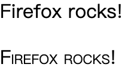

**注意：** 只有当首字母是小写的时候，首字母同样也会变成大写并缩小

```html
<p class="normal">firefox rocks!</p>
<p class="small">firefox rocks!</p>
```

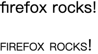

**控制字母和单词间距**

> 人为的改变字母间距不是一件好事，大多数字体设计间距的初衷是让人更容易识别单词

默认词距是由当前字体中空白字符的宽度决定的，以下规则在默认词距上增加 `0.1em`

```css
p {
  word-spacing: 0.1em;
}
```

**注意：** `word-spacing` 用于控制词间距，该属性很少使用

同样的，`letter-spacing` 也可以控制字符间的间距

```css
p {
  letter-spacing: 0.1em;
}
```

**版心宽度**

> 行长(版心宽度)影响阅读体验，过长或过短的文本都会打断人的眼球移动

在大屏幕中的网页主体内容的文本行长通常是 45 ~ 75 个字符，平均值是 66 个字符

对于小屏幕(远距离观看的大屏幕或者投影)而言行长至少也应该有 40 个字符

要控制行长可以通过设定文本的段落、标题等元素的宽度来实现

```css
article {
  /* 例如 Georgia 字体平均每个字符0.5em宽 36em / 0.5em = 72个字符 */
  max-width: 36em;
  margin: 0 auto;
}
```

**注意：** 如果视口宽度小于 `max-width` ，该元素会自动调整宽度

**文本缩进与对齐**

> 默认情况下文本是左对齐的，文本左对齐有助于眼睛找到下一行，保持阅读节奏

对于连续的段落或者相邻的段落可以设置一行外边距或首行缩进

```css
p + p {
  text-indent: 1.25em;
}
```

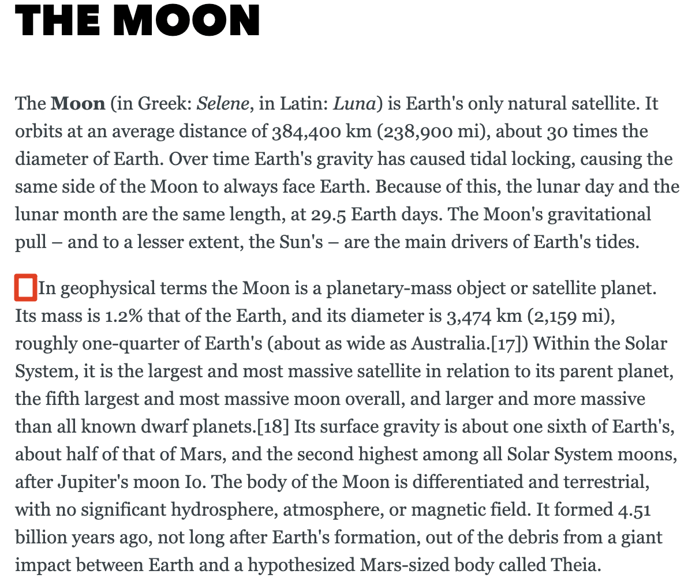

**毛边**

> 如下图，文章的右侧参差不齐，在术语上叫做 **毛边**

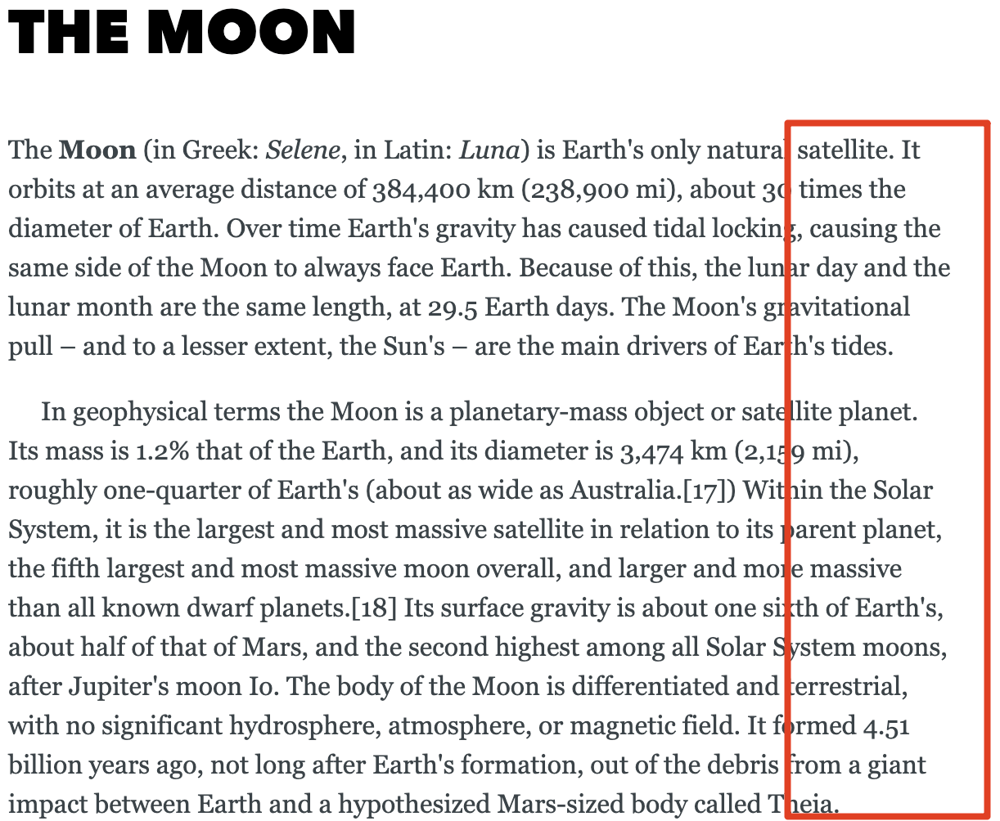

虽然毛边没有什么大的影响，但是当文本水平居中时会导致两边都形成毛边，从而影响可读性

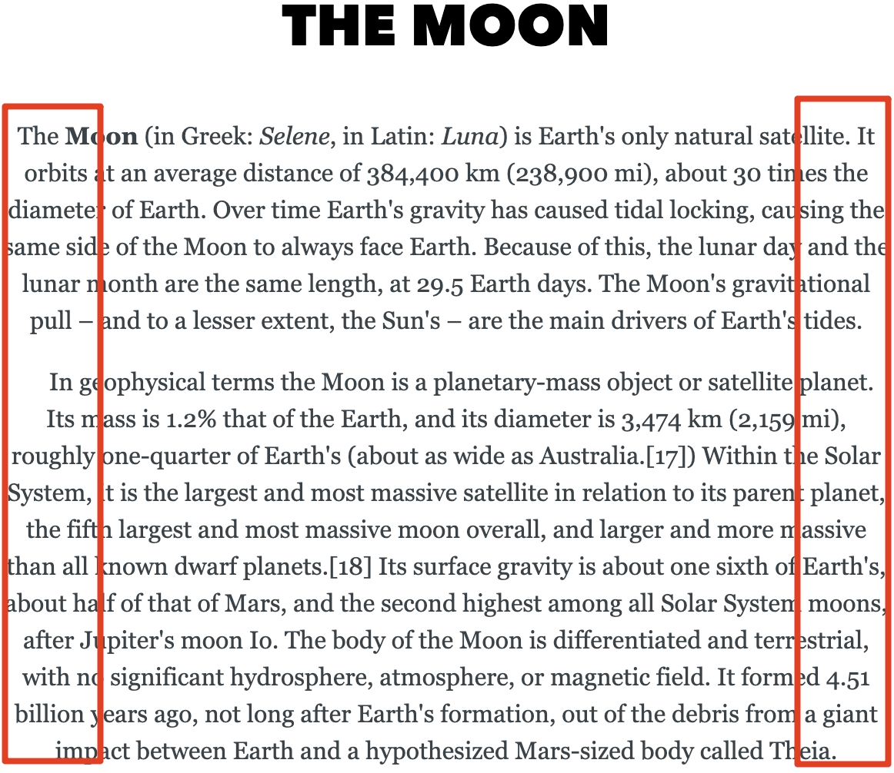

要解决上述这个问题，可以使用 `text-align: justify;` 让单词平分间距，使两边对齐，以此来消除毛边

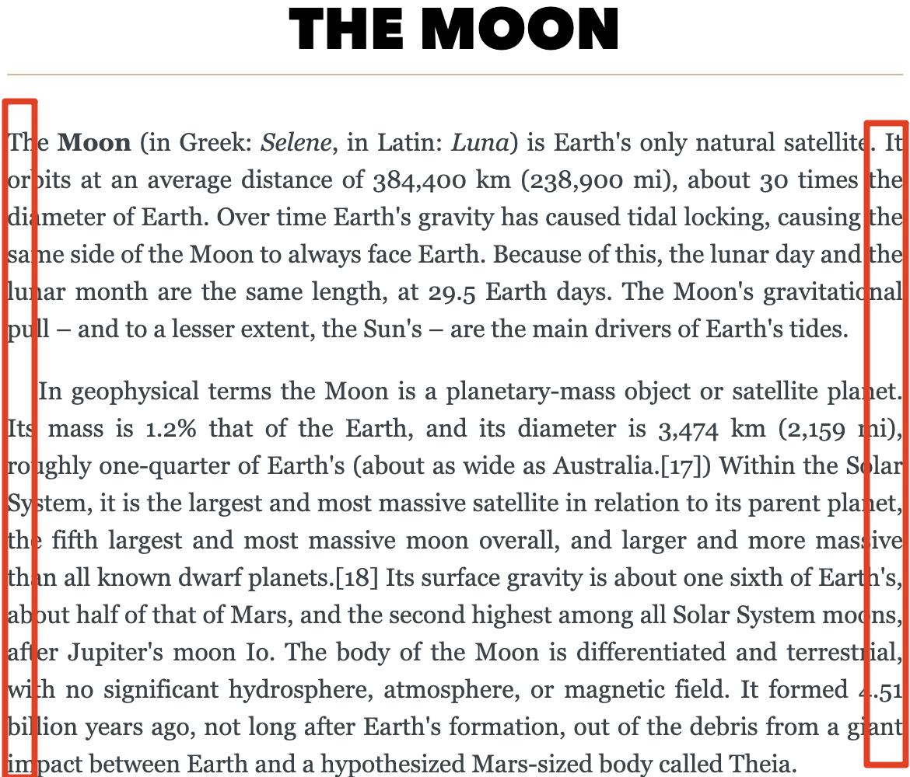

**注意：** 由于屏幕大小的不同，安装字体的不同以及浏览器的引擎不同等原因都会影响用户看到的结果，如果此时使用 `text-align: justify;` 可能会发生文本空白构成的 **串流** ，版心宽度越小越严重

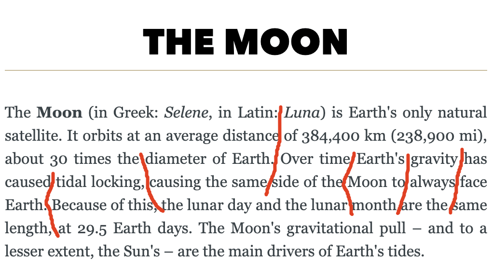

浏览器处理文本两端对齐时使用的算法很 **粗糙** ，不如传统的出版效果好，虽然可以通过修改 `text-justify` 属性来修改所使用的算法，但是浏览器对多个值的支持较弱，基本上 **只涉及调整非西方语言的字形和单词**

但 IE 浏览器中支持 `text-justify` 属性的值中有一个非标准值 `newspaper` ，使用了更聪明的算法，该算法会同时调整字母间距和单词间距

**书写方向**

```html
<!-- 表示文字从右往左书写 -->
<p dir="rtl">我是文本</p>

<!-- 表示文字从左往右书写 -->
<p dir="ltr">我是文本</p>
```

```css
p {
  text-align: start;
}
```

**注意：** 当 `dir` 的值为 `rtl` 时，使用 `text-align: start;` 的方向从原先的右对齐编程了左对齐，浏览器会自动反转默认的文本方向

**连字符**

想要缓解串流的情况可以使用连字符，可以手工在 HTML 中敲入连字符 `&shy;`，连字符会在需要断词换行的时候显示

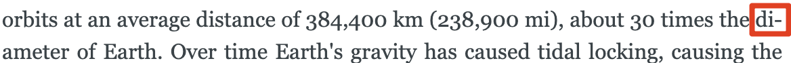

但是手动添加软连字符不现实，可以使用 `hyphens` 属性让浏览器自动插入连字符

1. 首要将 HTML 的语言模式设置为 `en`

   ```html
   <html lang="en"></html>
   ```

2. 在相关元素上添加 `hyphens` 属性

   ```css
   p {
     hyphens: auto;
   }
   ```

   **注意：** 如果要关闭连字符则将 `hyphens` 属性值设置为 `manual`，即手动模式

**多栏文本**

对于大屏幕来说把整篇文章设置版心宽度太浪费空间了，可以把文本分成多栏，限制每栏的宽度

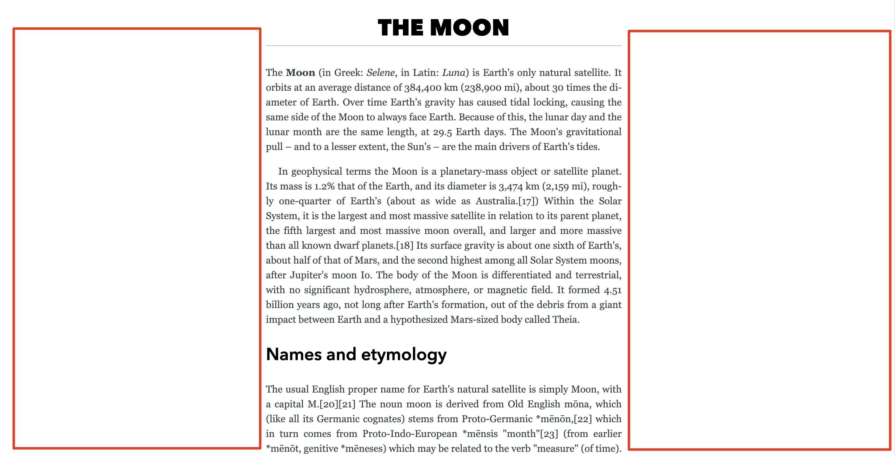

```css
article {
  max-width: 70em;
  columns: 20em; /* 设置每栏最小的宽度 */
  columns-gap: 1.5em; /* 设置每栏之间的间隔 */
  margin: 0 auto;
}
```

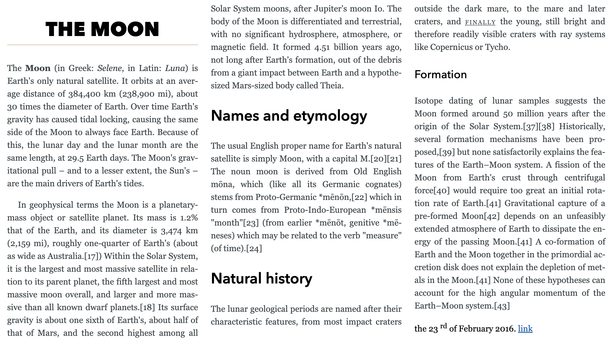

`columns` 属性是 `column-count` 和 `column-width` 属性的简写形式

- 如果只设置 `column-count` 属性则浏览器会严格生成指定数量的栏，不管宽度如何
- 如果同时设置了 `column-count` 和 `column-width` 属性，则前者会作为最大栏数，后者作为最小栏宽

`columns: 20em;` 等同于在保证最小宽度 `20em` 的前提下自动设置栏数，等同于 `column-width: 20em;`

`columns: 3;` 等同于保证三栏，自动设置宽度，等同于 `column-count: 3;`

`columns: 3 20em;` 至少三栏，每栏栏宽至少 `20em` ，等同于 `column-count: 3;` 和 `column-width: 20em;` 同时使用

在不支持多栏属性的浏览器中可以在段落元素上设置 `max-width` ，旧版浏览器只会显示一栏，但可以确保可读性

```css
article > p {
  max-width: 36em;
}
```

**跨栏**

可以让某些元素排在栏内文本流之外，强制伸长它们来达到跨行的效果

```css
h1 {
  /* 拉长标题横跨所有行 */
  column-span: all;
}
```

`column-span: none;` 可以关闭跨栏特性

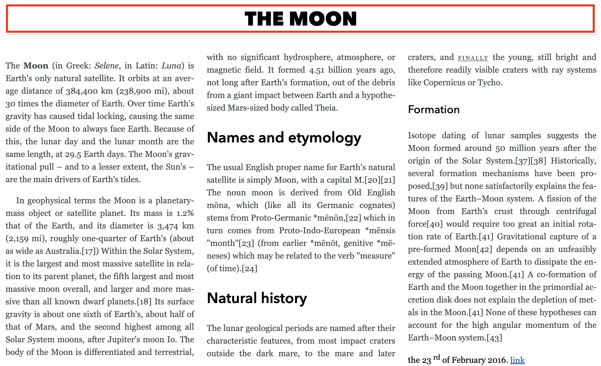

如果给分栏中的元素设置 `column-span: all;` ，效果如下

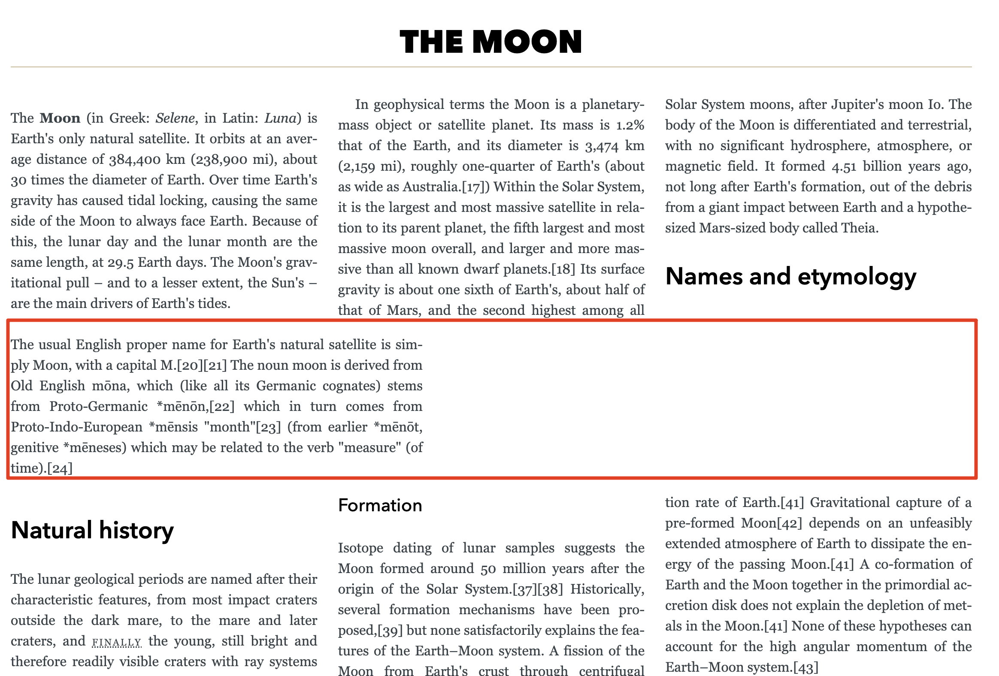

**垂直律动与基线网格**

在网页设计中要保证基线准确比较麻烦，例如在多栏文本中因为标题的存在导致各栏文本没有严格对齐

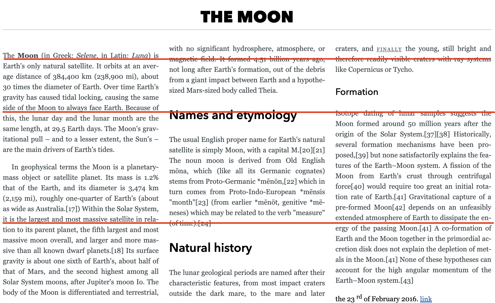

要解决这个问题可以**让标题的上外边距、行高和下外边距加起来等于正文行高值的整数倍**

**Web 字体**

使用 Web 字体有一个问题，就是 **许可** ，目前多数字体的设计者都施加了安全限制，例如只允许从指定的域名下载字体或者要求定期修改字体名以防止盗链

使用字体最简单的方式可以使用 **Web 字体托管服务**，许可问题交给它们处理，只需要关心如何使用这些字体

- 收费的
  1. https://fonts.adobe.com
  2. https://www.typography.com/user-guide/included
  3. https://www.fonts.com
- 免费的
  1. https://fonts.google.com

**@font-face 规则**

嵌入 Web 字体的关键是使用 `@font-face` 规则

```css
@font-face {
  font-family: Vollkorn;
  font-weight: bold;
  src: url('fonts/vollkorn/Vollkorn-Bold.woff') format('woff');
}
h1,
h2,
h3,
h4,
h5,
h6 {
  font-family: Vollkorn;
  font-weight: bold;
}
```

在 `font-family` 的值为 `Vollkorn` 并且 `font-weight` 的值为 `bold` 时才会应用这个规则，之后通过 `url()` 提供浏览器下载包含粗体字体的字体格式，字体格式每个浏览器支持程度都不一样，好在所有浏览器都支持标准的 WOFF 格式，有的支持较新的 WOFF2 格式

对于 IE8 之前的浏览器需要使用以下的兼容性写法来解决对字体格式支持不一致的问题

```css
@font-face {
  font-family: Vollkorn;
  src: url('fonts/Vollkorn-Regular.eot#?ie') format('embedded-opentype'), url('fonts/Vollkorn-Regular.woff2')
      format('woff2'), url('fonts/Vollkorn-Regular.woff') format('woff'), url('fonts/Vollkorn-Regular.ttf')
      format('truetype'), url('fonts/Vollkorn-Regular.svg') format('svg');
}
```

**字体描述符**

- `font-family` 必需，字体族的名称
- `src` 必需，URL 或 URL 列表，用以下载字体
- `font-weight` 可选的字体粗细，默认值为 `normal`
- `font-style` 可选的字体样式，默认值为 `normal`

**注意：** 这些属性在 `@font-face` 中的意义和通常规则中的不一样，**它们不会改变字体** ，只是为了告诉浏览器什么样的情况用特定的字体

如果不小心把 `font-weight` 设置为字体族名称，其它粗细的依旧可以使用这里的字体，因为浏览器加载选择字体的原则是：正确的 `font-family` 优先于正确的粗细值

在使用时容易的犯的错误是在 `@font-face` 块中把 `font-weight` 属性设置为 `normal` ，而在使用时却把 `font-weight` 属性设置为 `bold`，导致浏览器以为这个字体没有相应的加粗变体，会在原来字体粗细的基础上进行**模拟加粗**

**Web 字体浏览器性能**

在网页是实践应用中存在一些麻烦

- 浏览器需要下载额外的字体文件，会延长用户的等待时间，所以要注意不要加载过多的字体文件，自己托管的自定义字体要确保设置适当的缓存首部

- 浏览器在渲染字体时也存在问题，浏览器在下载 Web 字体时有两种处理方式
  1. 在字体下载完成前暂缓显示文本，这种方式的术语是 **FOIT(flash of invisible text)** ，Safari、Chrome 和 IE 浏览器默认使用这种方式，**缺点是如果网络速度很慢，用户必需等待字体下载完成才能看到内容**
  1. 在字体下载完成前使用备用的字体显示内容，**缺点是会带来字体切换闪动的问题，特别是备用字体和 Web 字体大小相差很多的情况下，存在网页内容跳跃过大，用户会失去焦点**

想要更好的处理 Web 字体和备用字体之间的切换，可以使用 JavaScript 加载字体

[CSS Font Loading 规范](https://developer.mozilla.org/zh-CN/docs/Web/API/CSS_Font_Loading_API) 定义了一个用来加载字体的实验性 JavaScript API，但不是所有的浏览器都支持，需要借助第三方库来实现一致的字体加载体验

Web Font Loader：https://github.com/typekit/webfontloader

这个库在浏览器支持的情况下会用原生的字体加载 API，在浏览器不支持的情况下会模拟相同的功能，也支持 Web 字体服务

## 第五章 漂亮的盒子

**背景颜色**

`background` 与 `background-color` 属性有什么区别？

前者是一个简写属性，可以一次性设置多个与背景相关的属性，后者只能设置背景颜色

```css
body {
  background: #bada55;
}
```

**注意：** `body` 没有设置高度依旧可以显示出全屏的背景颜色，是因为单独给 `body` 设置背景颜色的时候实际上是给浏览器画布设置了背景颜色，当 `html` 和 `body` 分别设置不同的背景颜色，浏览器会优先拿 `html` 的背景颜色往浏览器画布上设置背景颜色

为什么写页面的时候要写如下代码？

```css
html,
body {
  height: 100%;
}
```

**原因：** 因为 `html` 、`body` 元素默认高度为 0，导致内容无法正常使用百分比撑满全屏，如果只设置 `body` 标签的高度为 `100%` 也还是不行的，因为 `body` 的高度百分比是以 `html` 的高度为准的，高度依旧是 0，所以要同时给 `html`、`body` 设置高度为 `100%`

使用 `rgba()` 与 `opacity` 有什么区别？

前者只是元素的背景发生了透明，而后者是整个元素变得透明，包括里面的子元素

什么时候使用 `img` 元素作为内容图片，什么时候应该使用 CSS 使用背景图片？

如果图片从网页中去掉后，网站本身仍然有意义的，则应该当做背景图片，反之使用内容图片

**图片格式**

前端常用的图片格式有如下：

- **JPEG：** 一种位图格式，有损压缩，压缩率高，不支持透明度，**适合照片**

- **PNG：** 一种位图格式，无损压缩，不适合照片(文件体积会很大)，支持透明度，**适合图标、插图等小尺寸的图片**
- **GIF：** 早期的位图格式，与 PNG 类似，主要用于动图，除了动图外已被 PNG 取代，**PNG 实际也支持动图但浏览器支持落后**，支持透明度，但是不支持阿尔法分级，存在边缘锯齿
- **SVG：** 一种矢量图片格式，支持无损放大，本身也是一种标记语言，可以直接嵌入网页，也可以作为资源引用
- **WebP：** Google 开发的一种新的图片格式，结合了 JPEG 高压缩率 和 PNG 阿尔法透明特性，**但浏览器的支持还参差不齐**

**背景位置**

使用 `background-position` 属性调整位置

```css
.box {
  background-position: 20% 20%;
}
```

当使用百分比单位时实际上是使用定位图片中对应位置的点和元素中对应位置的点重合

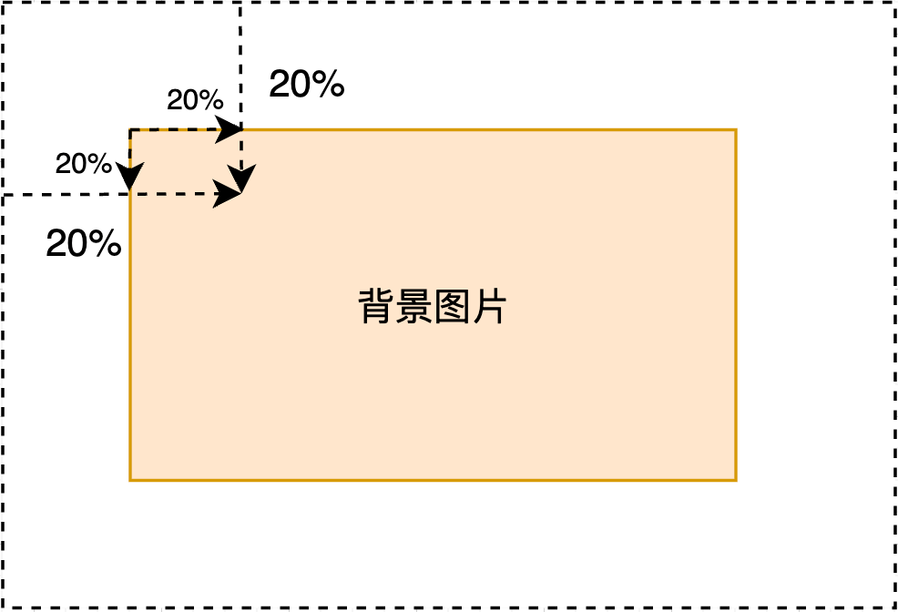

```css
.box {
  background-position: 20px 20px;
}
```

当使用像素单位时是用图片左上角的点偏移

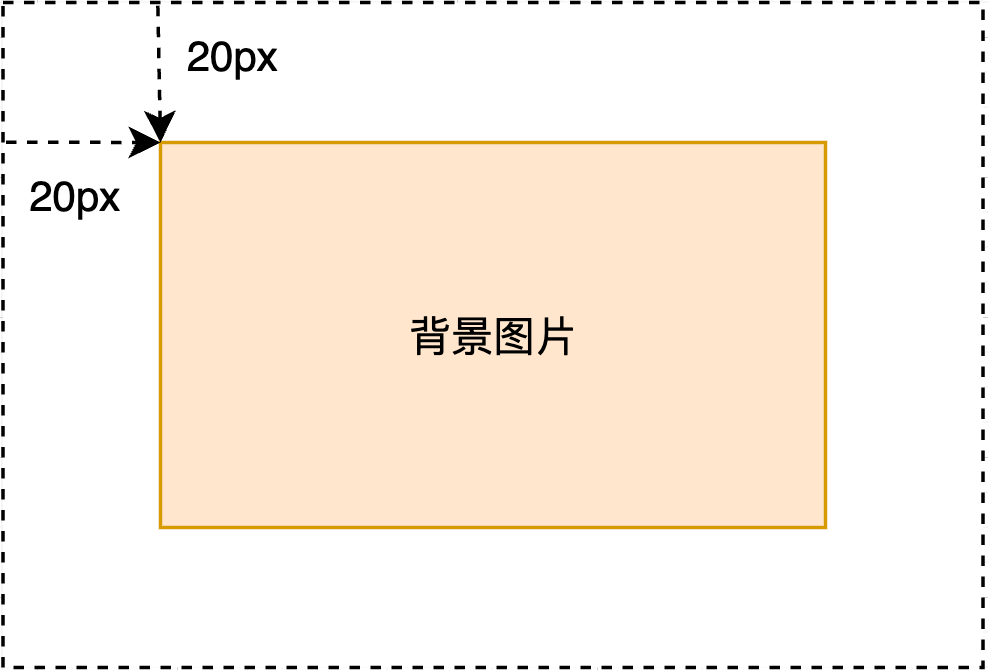

```css
.box {
  background-position: right 1em top 50%;
}
```

**注意：** 该写法是 CSS3 中新加入的语法，例子中是把图片定位在距离右边缘 1em，距离上边缘 50% 的位置，用于控制背景图片产生空白区(间距)，**但该写法无法优雅降级**，低版本浏览器不支持

**背景的裁切和原点**

默认情况下，背景图片是被限制在元素的边框以内的(包括边框)，**若把边框设置为半透明色，那图片边缘就会出现半透明的边框**

```css
.box {
  width: 200px;
  height: 200px;
  background: url(./demo.jpg);
  border: 10px solid rgba(220, 220, 160, 0.5);
  background-repeat: no-repeat;
}
```

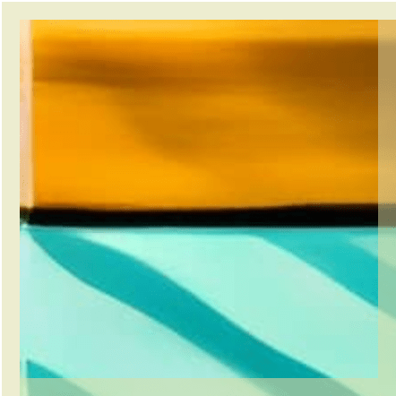

要想解决这个问题，可以使用 `background-clip` 属性改变这个行为，默认值为 `border-box`，把它设置为 `padding-box`，将图片裁剪到内边距盒子以内

```css
.box {
  width: 200px;
  height: 200px;
  background: url(./demo.jpg);
  border: 10px solid rgba(220, 220, 160, 0.5);
  background-repeat: no-repeat;
  background-clip: padding-box;
}
```

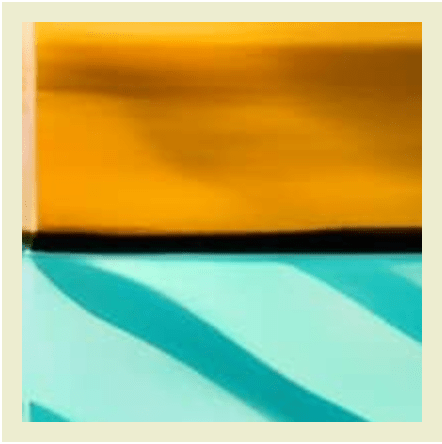

此时图片的定位偏移的参照点变成了内边距的左上角(原来的是元素边框的左上角)，此时如果不想参照点在内边距的左上角，但是还想保持裁切，可以使用 `background-clip` 来调整的参照点(原点)的位置

```css
.box {
  width: 200px;
  height: 200px;
  background: url(./demo.jpg);
  border: 10px solid rgba(220, 220, 160, 0.5);
  background-repeat: no-repeat;
  /* 将背景图片的参照点设置为边框而非内边距 */
  background-origin: border-box;
  background-clip: padding-box;
}
```

**背景大小**

如果要背景图片随着元素的缩放而缩放，则需要使用百分比

```css
.box {
  background-size: 100px auto;
}
```

**注意：** 不要给图片的宽度和高度都设置为百分比，可能会元素的高度变化导致图片变形，给一个维度(宽度或高度)设置为百分比，另一个维度设置为 `auto`，可以保持固有的宽高比，但是存在背景图片一边被裁切的情况

```css
.box {
  background-size: contain;
}
```

使用 `contain` 浏览器会自行决定哪一边使用 `auto`，会尽可能的保证背景图片的最大化，同时保证图片的宽高比，避免图片被裁切

- 在元素高度比宽度高的情况下，浏览器会给宽度设置为 `100%`，高度设置为 `auto`，高度留白
- 在元素宽度比高度高的情况下，浏览器会给宽度设置为 `auto`，高度设置为 `100%`，宽度留白

```css
.box {
  background-size: cover;
}
```

使用 `cover` 图片会被缩放以确保覆盖元素的每一个像素，同时不会变形，超出元素的部分会被裁切

- 在元素高度比宽度高的情况下，元素高度会被填满，左右会被裁切
- 在元素宽度比高度高的情况下，元素宽度会被填满，高度会被裁切

**背景属性简写**

背景属性值的顺序可以随意，但是有两个注意点

1. 因为两个长度值既可以给 `background-position` 使用也可以给 `background-size` 使用，所以**两个都需要声明**，要先声明 `background-position`，后声明 `background-size`，中间用 `/` 分隔

   ``` css
   .box {
     background: 50% 50% / cover;
   }
   ```

2. 因为 `*-box` 关键字( `border-box`、`padding-box`、`content-box` )既可以给 `background-origin` 使用，也可以给 `background-clip` 使用所以有如下规则：

   - 如果存在一个 `*-box` 关键字则 `background-origin` 和 `background-clip` 都取这个值
   - 如果存在两个 `*-box` 关键字则第一个为 `background-origin` 的值，第二个为 `background-clip` 的值

**注意：** 因为背景属性简写会把没有使用过的属性都重置为默认值，所以应该把它放在第一位，然后再覆盖特定的属性，**最好还是使用明确的属性，跟容易让人理解**

**边框圆角**

在给 `border-radius` 指定百分比时，没有必要给任何一个角设置超过 50% 的值，元素被设置为圆角后，只会改变触摸范围，不会改布局的盒子大小

**可伸缩图片模式**

如果想让图片随着容器的缩小而缩小，但是在容器放大时又不会大到超过图片自身的大小

```css
img {
  width: auto;
  height: auto;
  max-width: 100%;
}
```

**注意：** 此处加上的 `width: auto` 和 `height: auto` 是为了覆盖之前的声明(如果有的话)，同时可以解决 IE8 不声明 `width` 无法正确缩放图片的问题

## 第六章 内容布局

**CSS 中负外部距的行为**

- 左边或上边的负外边距会把元素向左或向上拉，盖住旁边的元素

  ```html
  <div class="box">
    <div class="top"></div>
    <div class="bottom"></div>
  </div>
  ```

  ```css
  .top,
  .bottom {
    width: 30px;
    height: 30px;
    background-color: red;
  }
  .bottom {
    /* 负上外边距 */
    margin-top: -10px;
    background-color: blue;
  }
  ```

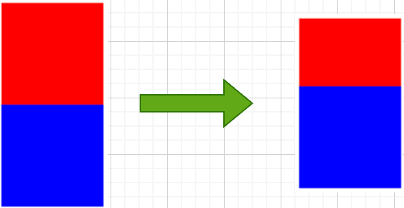

- **右边或下边** 的负外边距会把相邻元素向左或向上拉，盖住设置了负外边距的元素

  ```html
  <div class="box">
    <div class="left"></div>
    <div class="right"></div>
  </div>
  ```

  ```css
  .box {
    display: flex;
  }
  .left,
  .right {
    width: 30px;
    height: 30px;
    background-color: red;
  }
  .right {
    background-color: blue;
  }
  .left {
    margin-right: -10px;
  }
  ```

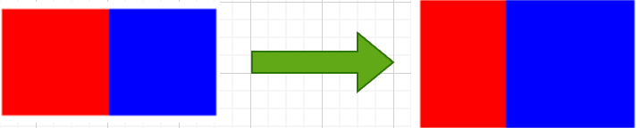

- 在浮动元素上，与浮动方向相反的负外边距会导致浮动区域缩小，使得相邻元素盖住浮动的元素。而与浮动方向相同的负外边距会在该方向上把浮动元素向外拉

  ```html
  <div class="box">
    <div class="left"></div>
    <div class="right"></div>
  </div>
  ```

  - 当浮动方向和负外边距方向相反时

    ```css
    .left,
    .right {
      width: 30px;
      height: 30px;
      background-color: red;
      float: left;
    }
    .right {
      background-color: blue;
    }
    .left {
      /* 负外边距和浮动方向相反 */
      margin-right: -10px;
    }
    ```

    

  - 当浮动方向和负外边距方向相同时，向外拉

    ```css
    .left,
    .right {
      width: 30px;
      height: 30px;
      background-color: red;
      float: left;
    }
    .right {
      background-color: blue;
    }
    .left {
      /* 负外边距和浮动方向相同 */
      margin-left: -10px;
    }
    ```

- 给未声明宽度的非浮动元素应用负外边距时，左、右负外边距会向外拉伸元素，导致元素扩张，有可能盖住相邻元素

**定位与 z-index 的堆叠内容的陷阱**

**堆叠上下文：** 就像是一盒扑克牌，每张牌本身也是一个上下文(牌盒)，牌只能相对当前的牌盒排定次序，任何一个设定了 `position: absolute` 及值不是 `auto` 的 `z-index` 属性的元素，都会创建一个自己后代元素的堆叠上下文，**一个堆叠上下文的内部不会影响其他堆叠上下文**

**根堆叠上下文：** 所有 `z-index` 不是 `auto` 的定位元素都会在这个上下文中排序，随着其它上下文的建立，就会出现堆叠层级

**注意：** 设置小于 `1` 的 `opacity` 的值也可以触发新的堆叠上下文，`transform` 和 `filter` 属性也可以触发新的堆叠上下文

**水平布局不同技术的优缺点**

- 浮动布局

  **优点：** 与行内块一样可以包含多行文本，并且会基于自己的内容来 ”收缩适应“，元素排列不依赖元素在代码中的次序

  **缺点：** 需清除浮动，存在被之前更高的浮动元素卡住的问题

- 行内块布局

  **优点：** 可以包含多行文本，并且会基于自己的内容来 ”收缩适应“，支持控制垂直对齐

  **缺点：** 存在空白符占用导致元素换行的问题

- 表格显示布局 `display: table`

  **优点：** 水平布局很便捷，实现表格内容的垂直居中很容易

  **缺点：** 仅支持不会发生折行的内容，使用 `table` 标签布局的问题表格也同样存在，无法给内部元素重写排序以及应用外边距

**Flexbox 中自动外边距**

一般情况下，使用 `margin: 0 auto` 可以使元素水平居中，但是使用 `margin: auto 0` 却无法使元素垂直居中

```html
<div class="box">
  <div></div>
</div>
```

```css
.box {
  width: 300px;
  height: 300px;
  background-color: red;
}
.box > div {
  width: 150px;
  height: 150px;
  background-color: blue;
  /* 无法使元素垂直居中 */
  margin: auto 0;
}
```

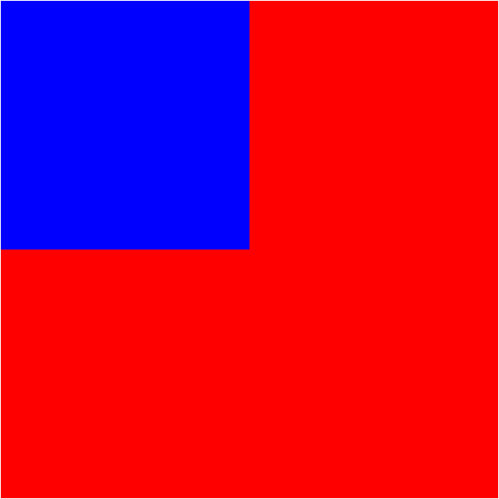

**原因：** 在块级格式化上下文中，如果 `margin-left` 和 `margin-right` 的值都是 `auto`，则它们表达值相等，从而使元素可以水平居中，但是如果 `margin-top` 和 `margin-bottom` 的值都是 `auto`，则它们的值都为 `0`，也就无法造成垂直上的居中

在 Flexbox 中，使用 `marin: auto` 可以使元素水平垂直居中

```css
.box {
  display: flex;
  width: 300px;
  height: 300px;
  background-color: red;
}
.box > div {
  width: 150px;
  height: 150px;
  background-color: blue;
  /* 使元素水平垂直居中 */
  margin: auto;
}
```

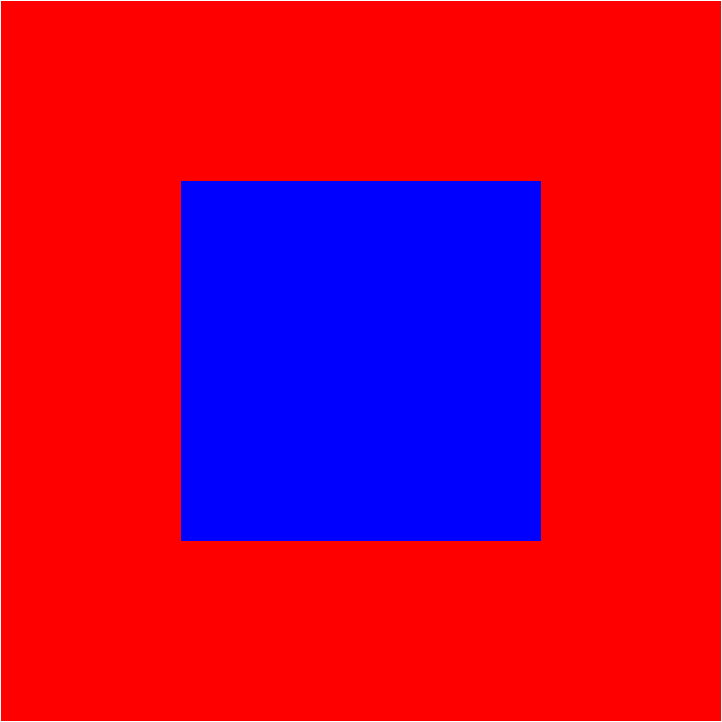

**原因：** 在 `flex` 格式化上下文中，设置了 `margin: auto` 的元素，在通过 `justify-content` 和 `align-self` 对齐之前，任何处于空闲的空间都会被分配到该方向的 `margin` 中去，不仅是水平方向会被分配，垂直方向也会分配

在 `flex` 格式化上下文中，`margin: auto` 可以模拟 `space-between` 和 `space-around`

```html
<ul class="g-flex">
  <li>liA</li>
  <li>liB</li>
  <li>liC</li>
  <li>liD</li>
  <li>liE</li>
</ul>
```

```css
.g-flex {
  display: flex;
  list-style: none;
  padding: 0;
  margin: 0;
  background-color: blue;
}
```

- `marign: auto` 实现 `space-around`

  ```css
  li {
    width: 18%;
    height: 80px;
    background-color: green;
    box-sizing: border-box;
    /* 模拟 space-around 效果 */
    margin: auto;
  }
  ```

  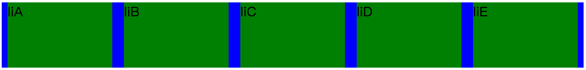

- `margin: auto` 实现 `space-between`

  ```css
  li {
    width: 18%;
    height: 80px;
    background-color: green;
    box-sizing: border-box;
    /* 模拟 space-between 效果 */
    margin: auto;
  }
  li:first-child {
    /* 清除左边元素的外边距 */
    margin-left: 0;
  }
  li:last-child {
    /** 清除右边元素的外边距 */
    margin-right: 0;
  }
  ```

  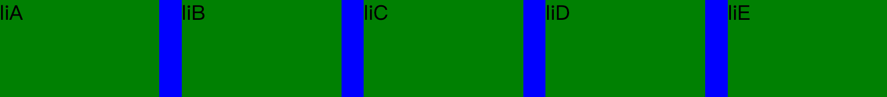

**flex 可伸缩尺寸**

- `flex-basis` ：控制 flex 元素(指 flex 容器 **内部** 的元素)在**主轴方向**上、经过修正之前的 "首选" 大小 ( `width` 或 `height` )，可以使用长度单位( 如：`px`、`em` 等)、也可以使用百分比(相对于容器的主轴而言)，默认值为 `auto`，`auto` 的意思在 flex 元素设置了宽度或者高度的情况下 flex 元素可以从对应的属性 (`width` 或 `height`) 获得主尺寸，如果 flex 元素没有设置高度或者宽度则根据其内容来确定大小，可以直接指定 `content` 值，会自动忽略 flex 元素的高度或者宽度值，按照内容来确定大小，但是这个值是新出的，存在兼容性问题
- `flex-grow`：一个弹性系数，在通过 `flex-basis` 为每一项设置了首选大小之后，如果还有剩余空间，该数值表示剩余空间扩展的比值，默认值为 `0` 表示不扩展，弹性系数表示占剩余空间的几份

  - 例如一个 flex 容器中有两个元素，没有占用完容器的所有空间，给两个元素都指定 `flex-grow: 1` ，则表示将剩余空间分成两份，两个元素各占一份
  - 如果第一个元素设置为 `flex-grow: 3` ，第二个元素设置为 `flex-grow: 1` 表示把剩余空间分成四份，第一个元素占三份，第二个元素占一份
  - 如果把两个元素的 `flex-basis` 的值设置为 `0` 并把 `flex-grow` 设置为 `1` 表示容器**全部的空间**分为两部分，每个元素各占一部分

  **注意：** 在 `flex: 1 0 0%` 简写中，`flex-basis` 必须加单位，可以加 `%` 或者 `px`

- `flex-shrink`：一个弹性系数，与 `flex-grow` 的作用相反，在空间不足时收缩的比值，默认值为 `1` 表示以自己首选尺寸(通过 `flex-basis` 设置的)为比例收缩，收缩的计算方式是元素自己的 `flex-shrink` 的值乘以自己的 `flex-basis`，再用乘积除以每一项的 `flex-shrink` 与 `flex-basis` 的乘积之和，最后再拿得到的比例系数乘以超出的宽度(负空间)，从而得到元素要收缩的空间

  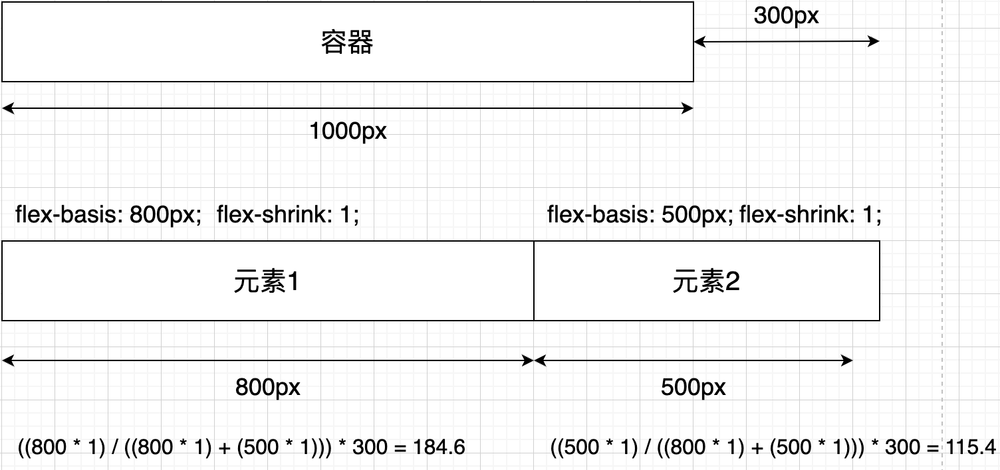


## 第七章 页面布局和网格

flex 和 grid

## 第八章 响应式Web设计与CSS

**浏览器视口：** 视口就是浏览器显示网页的矩形区域，在桌面浏览器上通过CSS像素来合理利用视口的空间

**CSS 像素：** CSS 像素不是物理像素，CSS像素是像素与屏幕物理像素之间存在的一种灵活的对应关系，取决于硬件、操作系统和浏览器以及用户是否缩放了页面，例如在 iPhone 5 中物理像素的宽度为 640 像素，但在 CSS 中的视口像素为 320 像素，这里每个 CSS 像素相当于 2 X 2 个物理像素

**默认视口：** 在智能手机刚出现的时候，还没有多少网站针对小屏幕做优化，通常的做法是移动设备的浏览器会模拟一个大约 1000 像素宽的视口，在其中显示缩小后的页面，这是实现响应式设计的第一道关卡

**理想视口：** 与设备尺寸自身尺寸接近的视口，因操作系统、设备和浏览器而异，例如：iPhone 5 的理想视口的宽度就是 320 像素

**可见视口(视觉视口)：** 显示网页的矩形区域，这个视口等于浏览器窗口减去所有按钮、滚动条、工作条等组件之后，实际包含网页内容的空间

**布局视口：** 放大网页时，网页的某些区域会跑到可见视口之外，约束整个页面的矩形区域就是布局视口

可见视口和布局视口在桌面浏览器和移动浏览器的工作机制是一样的

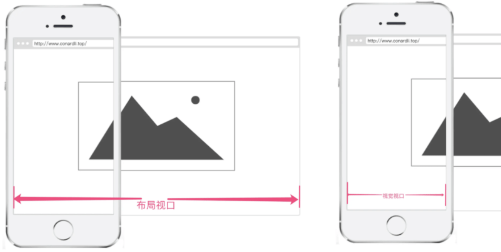


对于响应式Web设计而言，只会基于设备的 “理想视口” 来适配页面，桌面端浏览器不需要任何特殊对待，因为桌面端浏览器的理想视口就是其默认视口，但平板和智能手机需要拆解模拟的默认视口，令其等于理想视口，需要通过 HTML 中的 meta 元素来做到


在页面的头部元素中添加一个 `meta` 标签即可

```html
<meta name="viewport" content="width=device-width, initial-scale=1.0" />
```

- `width=device-width` 作用是设置当前设备的理想视口(device-width)作为视口宽度的基准
- `initial-scale=1` 作用是设置与理想视口匹配的缩放级别，可以避免 ios 中一些奇怪的缩放行为，值大于1，表示放大布局，实际会导致布局视口缩小，反之小于1的值会缩小布局，实际会导致布局视口中可容纳的 CSS 像素增多


**媒体查询**

可以同过给 `link` 元素添加 `media` 属性来指定哪些设备上应用相关样式

```css
<link rel="stylesheet" href="demo.css" media="screen, print" />
```

`print` 表示打印设备，`screen` 表示屏幕设备，如果不关心设备可以使用 `all` 关键字或者不写 `media` 属性


最常见的方法就是在 CSS 文件中指定

```css
@media print {
  /* 针对打印设备的选择符和规则 */
}
```

能用的上的类型有 `print` 、`screen` 和 `all`


该媒体查询条件要求视口至少 600 CSS 像素

```html
<link rel="stylesheet" href="demo.css" media="screen and (min-width: 600px)" />
```

**注意：** 在媒体查询不匹配的情况下，很多浏览器仍然会下载 CSS 文件，因此不要过度使用带媒体查询的 `link` 标签


同样的声明可以在 CSS 文件中通过 `@meida` 使用

```css
@media screen and (min-width: 600px) {
  /* 样式规则 */
}

/* 多个条件通过使用 and 关键字连接起来 */
@media screen (min-width: 600px) and (max-width: 1000px) {
	/* 样式规则 */
}

/* 多个媒体查询用逗号分隔 */
@media screen, print and (min-width: 600px) {
  /* 样式规则 */
}

/* 相当于 @media all and (min-width: 30em) */
@media (min-width: 30em) {
  /* 样式规则 */
}

@media not screen {
  /* 针对非屏幕的样式 */
}

/* only 关键字可以避免旧版本浏览器误解媒体查询 */
@media only screen and (min-width: 30em) {
  /* 样式规则 */
}

@media (orientation: portrait) {
  /* 竖向屏幕时的样式 */
}

@media (min-aspect-ratio: 16/9) {
  /* 宽高比至少为16:9时应用的样式 */
}
```


在响应式设计中与 **宽度** 相关的媒体查询占绝大多数，因为创建网页的默认方式就是和水平布局的视口一样宽，垂直方向上可以让内容自动扩展

IE8 以及更早的浏览器不支持媒体查询，对于这些浏览器可以提供一个固定宽度的布局或者使用腻子脚本，如：[Respond.js](https://github.com/scottjehl/Respond)，这个脚本在不支持媒体查询的浏览器上从所有的 CSS 文件中搜索媒体查询语法，然后根据屏幕大小应用或删除对应的样式

**Respond.js的缺点：**

1. 对直接写在 HTML 文件中的 `style` 标签里的媒体查询无效
2. 存在一些边界情况需要避免，具体参考官方文档


使用条件注释，条件注释只有 IE 浏览器才会识别，非IE浏览器会把它当做正常注释处理

```html
<!-- [if (lt IE 9) & (!IEMobile)] -->
<link rel="stylesheet" href="oldIE.css" media="all" />
<![endif]-->
```

上述的代码表示低于 IE9(不包含IE9) 的浏览器并且不是Windows Phone 中的IE浏览器时才执行条件注释中的样式


**移动优先的CSS**

先针对小屏幕进行设计，在各种浏览器中和设备中测试，通过媒体查询在某些点(断点)上进行样式调整

代码尽可能的少，适用的设备却尽可能多


**媒体查询放在哪里**

- 影响布局的媒体查询(包含一堆类名的)通常放在布局规则的附近
- 影响个别组件的就放在组件样式规则的附近
- 在相同断点下既影响布局也影响组件的样式的媒体查询统一放在样式表的最后

**注意：** 媒体查询不会增加选择符的特殊性，依旧遵循正常的层叠规则


**响应设计模式**

- 响应文本列，依靠 `column-width` 属性来做文本列响应式处理
- 没有媒体查询的响应式 Flexbox，依靠 `flex-wrap` 和 `flex` 属性来做响应式处理
- 网格响应式，使用媒体查询结合 `grid` 来做响应式处理


**响应式背景图片**

通过媒体查询根据 `min-width` 来切换加载对应大小的背景图片

```css
.box {
  height: 300px;
  background-size: cover;
  background-image: url(img/small-demo.jpg);
}
/* 尺寸过大时加载大图 */
@media only screen and (min-width: 600px) {
  .box {
    height: 600px;
    background-image: url(img/big-demo.jpg);
  }
}
```


如果一张 400X400 像素的图片在高分辨率屏幕上也显示为 400X400 CSS 像素会导致图片被放大，导致失真模糊，此时可以通过 CSS 像素比来加载图片，一般高分辨的手机和平板的最低像素比是 1.5

```css
@media (-webkit-min-device-pixel-ratio: 1.5),(min-resolution: 1.5dppx) {
  .box {
    background-image: url(img/medium-demo.jpg);
  }
}
```

**注意：** `-webkit-min-device-pixel-ratio` 的值不需要加单位，主要针对 Safari 浏览器


**响应式嵌入媒体**

```css
img,object,video,emded {
  width: auto;
  max-width: 100%;
  height: auto;
}
```

通过设置 `max-width` 可以使元素变得可伸缩，同时不会超过其固有大小


**响应式图片**

```html

```

**原因：** 由于浏览器会对网页进行预处理，会在构建完整个页面或运行 JavaScript 之前开始下载，所以无法通过 JavaScript 的操作来根据设备或屏幕大小动态加载不同大小的图片，所以诞生了标准的响应式属性 `srcset`

**功能：** `srcset` 属性针对目标分辨率和物理像素与 CSS 像素的比例指定可替换的图片，`1.5x` 表示屏幕分辨率是普通分辨率的 1.5 倍(通常是 Retina 显示屏的情况)，则加载分辨率更高的图片


但是上述语法只能根据分辨率切换显示的图片，不能控制显示图片的尺寸，需要添加 `sizes` 属性

```html

```

`srcset="img/xsmall.png 300w` 在一组 URL 后面添加实际的宽度值，其中的 `300w` 是宽度描述符，`sizes` 属性是告诉浏览器在不同视口大小下应该使用哪个图像的大小，通过使用媒体查询来定义不同视口宽度下图像的大小，依次从前往后执行，所以最后一个大小可以不设置媒体查询


**picture 元素**

```html
<picture>
	<source type="image/webp" 
  	srcset="img/xsmall.webp 300w,
  	img/small.webp 400w,
  	img/medium.webp 600w,
  	img/large.webp 800w,
  	img/xlarge.webp 1200w" 
  	sizes="(min-width: 70em) 28em,
  	(min-width: 50em) calc(50vw * 0.95 - 2.75em),
  	calc(95vw - 1.375em)"
	/>
  
</picture>
```

这段代码中 `picture` 元素中仍然要有 `img`，因为 `picture` 元素和 `source` 元素要选择哪个图片作为 `img` 的最终源文件，其次是作为不支持 `picture` 元素浏览器的后备选项，在 `picture` 中 `source` 元素 **可以有多个**

**执行过程：** 浏览器在碰到包含 `img` 的 `picture` 元素时会先尝试寻找 `source` 元素并从中选出匹配的源文件让 `img` 显示，如果浏览器支持 webp 格式会从中挑选匹配的图片，然后 `source` 元素和 `img` 元素拥有相同的 `sizes` 和 `srcset` 属性，再从中匹配文件显示，如果没有找到匹配的元素会回到 `img` 元素中检查它的属性并进行匹配，如果都没找到则使用 `img` 元素 `src` 属性中的图片

**区别：** 响应式图片只支持根据分辨率加载对应的图片，而 `picture` 元素支持根据分辨率和图片类型加载图片


如果相对文件来源拥有跟多的控制，可以在 `source` 元素上添加 `media` 属性来增加媒体查询

```html
<picture>
  <source meida="(min-width: 70em) and (min-resolution: 3dppx)" srcset="..." />
  
</picture>
```

区别在于浏览器不再替你选择用哪个 `source` 元素，`srcset` 属性的内部选择取决于浏览器，但它必须使用在 `media` 或 `type` 属性上匹配的第一个 `source` 元素


对于不兼容 `srcset` 和 `sizes` 属性的浏览器，可以使用 [picturefill](https://github.com/scottjehl/picturefill) 官方腻子脚本


**响应式排版**

在大屏幕中阅读，一般每行 45 ~ 70 个字符比较舒服，在小屏幕中，一般每行 35 ~ 45 个字符比较合适

随着每行字符的减少，行高通常也可以减小，例如台式机显示器上的行高如果是 1.5，那么移动设备上的行高可以是 1.3

要为网站主体内容设置合适的字体大小，简单的方法是拿一本实体书或杂志，放在通常阅读屏幕的位置，一般来说把字体设置为 20 像素才让人感觉像看书一样

在手机屏幕中，因为拿的会比书更近一些，字体大小差不多在 16~18 像素之间

要判断某种距离关系下屏幕大小和字体大小是否匹配，可以参考 https://trentwalton.com/2012/06/19/fluid-type/ 中提到的方法，在可接受的起始位置各加上一个特殊字符，例如下面的一段文本中加入了 `*`

```html
<p>Lorem ipsum dolor sit amet,consectetur adip *isicing elit,sed do eius mod*j tempor incidid.</p>
```

在移动设备上测试时，如果第一行出现了两个星号，说明这一行太长了，最好是第一行折行的地方在第一个星号之前一点


在上述不同大小的屏幕下找到合适的字体后，接下来就是实现在不同的屏幕下显示对应合适的字体大小了

- 使用弹性字体大小

  通过使用 `em`、`rem`、`vw`、`vh`、`vmin` 和 `vmax` 等相对长度的字体大小来在不同屏幕间进行适配

- 设置基准字体大小，通过媒体查询动态改变基准字体大小

  ```css
  p {
    font-size: 1em;
  }
  h1 {
    font-size: 2.25em;
  }
  h2 {
    font-size: 1.875em;
  }
  @meida only screen and (min-width: 32.5em) {
    body {
      font-size: 1.125em;
    }
  }
  @meida only screen and (min-width: 52em) {
    body {
      font-size: 1.25em;
    }
  }
  ```

  

- 视口相关的单位，视口单位中 1 表示视口宽度的 `1%`

  - `vw` 表示视口宽度
  - `vh` 表示视口高度
  - `vmin` 表示视口宽度和高度中较小的
  - `vmax` 表示视口宽度和高度中较大的

如果直接使用视口单位存在大小过大的情况，需要通过媒体查询通过断点来重新定义 `font-size`


## 第九章 表单与数据表

**高级响应式表格**

- 在屏幕过小时，给表格列引入控制机制，比如第一例固定在一个位置上，其它列表可以滚动，让人知道在看哪一行
- 在屏幕变小时隐藏一些列，只显示最重要的内容
- 如果用户必须放大才能看清，则链接到一个单独的窗口
- 提供切换控件，让用户决定隐藏或显示哪些列

可以参考 https://github.com/filamentgroup/tablesaw


**表单**

- 把表单控件的名称放在相应控件的上方最合适，用户在向下滚动页面时，可以先看到名称，也非常适合在移动端浏览器上显示表单

- `fieldset` 对表单相关信息块分组，使用 `legend` 元素表明每个 `fieldset` 的目的，需要通过 CSS 重置默认的样式，因为不同的浏览器显示样式不同

- `label` 元素非常重要，给表单添加机构，增强可用性和无障碍性

  - 隐式，把表单元素嵌入 `label` 标签中

    ```html
    <label for="comment-email">
      Email<input name="comment-email" type="email" />
    </label>
    ```

  - 显式，通过 `label` 的 `for` 属性和表单元素的 `id` 属性进行关联

    ```html
    <label for="comment-email">Email</label>
    <input name="comment-email" id="comment-email" type="email" />
    ```
    
    虽然 `label` 元素可以离表单元素很远，**但应该尽量避免这么做**，把 `label` 以及相应的表单控件包在 `p` 这样的块级元素中，这样从语义上可以代表表单中的一项

- 无障碍隐藏技术，如果使用 `display: none` 或 `visibility: hidden` 会导致屏幕阅读器跳过该文本，如果想隐藏但不想跳过可以使用如下代码

  ```css
  /* 隐藏但是屏幕阅读器可以读到 */
  .visuallyhidden {
    position: absolute;
    overflow: hidden;
   	width: 1px;
    height: 1px;
    clip: rect(0 0 0 0);
  }
  
  /* 覆盖'隐藏'属性 */
  .visuallyshow {
    position: static;
   	width: auto;
    height: auto;
    clip: none;
  }
  ```

- 在对表单控件应用样式或再造的过程中，无论采取什么路线，一定要保证这些控件原生版本在上线后也能照常工作


## 第十章 变换、过渡与动画

**二维变换**

变换改变就是改变元素所在的坐标系统，也可以理解为变换是一种**畸变场**，任何落在元素渲染空间内的像素都会被畸变场捕获，然后再把它们输出到页面上的新位置或改变大小，**元素本身还在页面原来的位置上**

不管元素在哪里，都可以使用它在视口中的坐标来描述其位置，例如距离顶部 200 像素，距离页面左边 200 像素，这就是**视口坐标系统**

给使用 `transform: rotate(45deg)` 的元素添加外边距，**外边距的位置也会发生旋转，旋转后的矩形不妨碍页面其他部分的布局**


**变换原点**

默认情况下盒子的变换是以盒子的中心为原点的，控制原点位置的属性为 `transform-origin`

```css
.box {
  transform-origin 10px 10px;
  transform: rotate(45deg);
}
```

`transform-origin` 属性可以接收三个值，分别是 x、y 和 z 轴坐标，如果只给一个值，第二个默认关键字为

`center`，第三个值不影响二维变换，可以暂时忽略

**注意：** 在 SVG 元素应用变换时，它的 `transform-origin` 属性默认是在元素的左上角，不在元素的中心点


**平移**

移动元素到新的位置，可以使用 `transform: translateX()` 或者 `transform: translateY()`，也可以使用 `transform: translate()` 同时沿着两个轴平移

使用 `translate()` 函数时，可以接收两个坐标值，分别表示 x 轴 和 y 轴平移的距离，当只有一个值的时候表示的是 x 轴，此时 y 轴浏览器默认设为 0，这个值可以是任何长度，**当使用百分比的时候是相对于元素本身的大小，而不是包含块的大小**，因此，可以不必知道元素本身有多大就可以使用 `tansform: translate(-50%)` 就可以向左移动自身宽度的一半


**多重变换**

可以对一个元素同时应用多重变换，多重变换的形式以空格分隔列表形式给 `transform` 属性, 浏览器会按照声明的顺序依次应用

```css
.box {
  width: 100px;
  height: 100px;
  transform: rotate(45deg) translate(-50%);
}
```

上述代码表示先顺时针旋转 45 度，再沿着 x 轴左移动自身宽度的一半


**缩放和变形**

```css
.box {
  /* 等同于 transform: scaleX(2) scaleY(2); */
  transform: scale(2);
}
```

`scale()` 函数只传一个数的时候表示同时在 x 轴和 y 轴上缩放，**传入数值 1 不会发生改变**


```css
.box {
  transform: skewX(15deg)
}
```

`skew()` 函数只传一个度数的时候表示同时在 x 轴和 y 轴上变形，`skewX()` 表示水平线在元素变形后依旧保持水平，垂直线会发生倾斜，`skewY()` 则反之


**二维变换矩阵**

通过使用 `matrix()` 低级函数直接操作矩阵的值，值一共有 6 个，但是使用需要相当强的数学能力，一般是为 JavaScript 读取变换后的计算样式而服务的


**变换与性能**

浏览器在计算 CSS 效果时，会在例如修改文字大小导致生成的行盒子折行导致元素本身变高的情况下迫使浏览器进一步重新计算布局

使用 CSS 变换时，响应的计算只会影响相关元素的坐标系统，不会改变元素内部的布局，也不会影响外部的元素，多数浏览器都会尽量安排图形处理器来做计算，所以变换的性能是很好的

**注意：** 

- 有些浏览器会为变换的元素切换抗锯齿方法，会导致动态应用了一个变换，文本可能会瞬间变的不一样，要避免这个问题只需**在加载时尝试只使用初始值应用变换**
- 应用给元素的任何变换都会创建一个堆叠上下文，使用时要注意使用 `z-index`，如果子元素使用了变换，子元素上的 `z-index` 的值再大也不会出现在父元素上方
- 固定定位使用变换后元素也会创建一个新的包含块，发生变换的元素中有一个子元素使用了 `position: fixed`，那么它会将发生变化的元素当成自己的视口


**过渡**

过渡是一种动画，指从一种状态过渡到另一种状态

<iframe height="300" style="width: 100%;" scrolling="no" title="transition-btn" src="https://codepen.io/wjw020206/embed/GRLeNdd?default-tab=html%2Cresult" frameborder="no" loading="lazy" allowtransparency="true" allowfullscreen="true">
  See the Pen <a href="https://codepen.io/wjw020206/pen/GRLeNdd">
  transition-btn</a> by CodePencil (<a href="https://codepen.io/wjw020206">@wjw020206</a>)
  on <a href="https://codepen.io">CodePen</a>.
</iframe>

```css
button {
  /* 表示所有受影响的属性花150毫秒的时间来过渡 */
  transition: all 150ms;
}
```

用户界面组件的过渡时间多数都应该在 0.3 秒内完成，否则会人觉得拖泥带水，其他视觉效果可以延长时间


```css
button {
	transition: box-shadow 0.15s, transform 0.15s;
}
```

多个过渡之间使用逗号分隔，**必须指定两个过渡动画重复指定持续时间**


若多个过渡动画持续时间相同，可以简写为如下代码

```css
button {
	transition-property: box-shadow,transform;
  transition-duration: 0.15s;
}
```

如果多个动画持续时间不同，`transition-duration` 可以用逗号分隔，指定多个持续时间

**注意：** 使用带 `-webkit` 前缀的属性时，`transition-property` 本身也要加前缀，例如如下代码

```css
button {
	-webkit-transition-property: -webkit-box-shadow,-webkit-transform;
  -webkit-transition-duration: 0.15s;
}
```


**过渡计时函数**

通过使用 `transition-timing-function` 属性来指定，属性的值有如下

- linear：速度始终恒定
- ease(默认)：开始缓慢加速，后来缓慢减速
- ease-in：开始慢，后来快
- ease-out：开始快，后来慢
- ease-in-out：两头慢，中段快


**三次贝塞尔函数**

可以通过使用 `cubic-bezier()` 作为过渡计时函数，可以通过以下网站在线生成 `cubic-bezier()` 的参数

https://cubic-bezier.com


**步进函数**

除了可以通过预设的关键字和 `cubic-bezier()` 指定缓动效果，还可以指定过渡中每一步的状态，通过使用 `setps()` 来指定

```html
<div class="hello-box"></div>
```

```css
.hello-box {
  width: 200px;
  height: 200px;
  transition: background-position 1s steps(6, start);
  background: url(../images/step-animation.png) no-repeat 0 -1200px;
}

.hello-box:hover {
  background-position: 0 0;
}
```

实现鼠标放上去时显示步进动画，这里使用 `steps(6, start)` 作为的 `transition-timing-function` 属性的值，意思是把过渡过程切分为 6 个步骤，在每一次开始时改变属性，包含起始状态在内就创建了 7 个步骤

默认情况下，第二个参数为 `end`，表示在每一步结束时改变属性，这里希望用户在鼠标悬停时直接看到变化，所以就选择在每一步开始时启动过渡


**使用不同的正向和反向过渡**

上述代码在鼠标离开后，依旧会有 6 个步骤的反向动画，如果要去除鼠标离开后的动画，可以给初始状态下的过渡的持续时间设置为 0

```css
.hello-box {
  width: 200px;
  height: 200px;
  /* 初始状态下过渡时间设置为0 */
  transition: background-position 0s steps(6, start);
  background: url(../images/step-animation.png) no-repeat 0 -1200px;
}

.hello-box:hover {
  background-position: 0 0;
  /* 当鼠标放上时再设置过渡时间 */
  transition-duration: 0.6s;
}
```


**“粘着”过渡**

```css
.hello-box {
  width: 200px;
  height: 200px;
  /* 初始状态下过渡时间设置为9999999999 */
  transition: background-position 9999999999s steps(6, start);
  background: url(../images/step-animation.png) no-repeat 0 -1200px;
}

.hello-box:hover {
  background-position: 0 0;
  /* 当鼠标放上时再设置过渡时间 */
  transition-duration: 0.6s;
}
```

从技术实现的角度来看，依旧会反向，只不过速度**极慢**，需要浏览器标签页保持打开数年时间才能看到一些变化


**延迟过渡**

通过使用 `transition-delay` 属性来推迟过渡的发生，在简写的 `transition` 属性中延迟时间必须是第二个时间值

```css
.hello {
  transition: background-position 0s 1s steps(6);
  /* 等于添加了 transition-delay: 1s; */
}
```

如果将延迟时间设置为负数值，例如在 10 秒的过渡中使用了 `transition-delay: -5s;`，那么过渡一开始就会跳到一半的位置


**过渡的能与不能**

一般来说，计算值存在中间状态就可以实现过渡动画，例如：长度、颜色、边框，字体大小等

虽然有些属性没有明确的中间值，但是却可以实现过渡动画，例如使用 `z-index` 时，不能指定值为 1.5，但是 1 或 999 都没有问题，`column-count` 同样也只接受整数值，浏览器会自动插入整数值进行过渡

也可以给 `visibility` 属性实现过渡动画，但浏览器会在过渡经过中点后突变为两个终点值中的一个

对于有些可以实现动画的属性，例如：`height`，只能在数值之间过渡是，像 `auto` 这样的关键字就**不能**用于表示要过渡到的一个状态


**CSS 关键帧动画**

CSS 过渡是一种**隐式**动画，例如给浏览器指定两个状态，让浏览器在元素从一个状态过渡到另一个状态的过程中，给指定的属性添加动画效果，有时候动画的范围不仅限于两个状态，或者动画属性一开始就不存在，此时需要使用 CSS Animations 关键帧动画来实现

``` css
@keyframes 动画名 {
  from {
    /* 要变换的样式 */
  }
  50% {
    /* 要变换的样式 */
  }
  to {
    /* 要变换的样式 */
  }
}
```

`from` 和 `to` 分别的是 `0%` 和 `100%` 的别名，如果既没指定 `from` (或 `0%`)，也没指定 `to`(或 `100%`)，浏览器会根据元素现有的属性自动创建这两个值，关键帧选择符的值从 1 开始，没有上限。

定义完动画序列后，需要使用 `animation-name` 把它跟标志中的方块连接起来

```css
.box {
  /* 要连接的动画名 */
  animation-name: 动画名;
  /* 动画持续时长 */
  animation-duration: 1.5s;
  /* 动画延迟时间 */
	animation-delay: 1s;
  /* 动画循环次数 设置 infinite 表示无限循环 */
  animation-iteration-count: 3;
  /* 动画计时函数 */
  animation-timing-function: linear;
}
```

可以给一个元素添加多个动画，多个动画之间使用逗号分隔，**如果某一时刻两个动画都要加给同一个属性，则后声明的动画优先**

上述代码可以使用简写属性 `animation`

```css
.box {
  animation: 动画名 1.5s 1s 3 linear;
}
```

`backwards`：该属性值是设置 `animation-fill-mode` 属性的，用来告诉浏览器在动画运行之前或之后如何处理动画。默认情况下，第一个关键帧中的属性在运行之前不会被应用，如果指定了 `backwards`，则表示第一个关键帧中的属性会被立即应用，即使动画有延迟或一开始被暂停。


**曲线动画**

通常元素在两点间的位移动画都是走直线的，但可以通过多添加些关键帧，每一帧改变一点方向就可以实现元素沿曲线运行。


**注意**

- 有些动画会在页面加载后立即开始，也可能稍有延迟。有些浏览器不能保证页面加载后能够平滑流畅的启动动画，最好在页面完全加载完后通过 JavaScript 去触发动画
- 关键帧中的属性没有任何特殊性，那些选择符只会简单地改变元素的属性，但有些浏览器却允许动画中的属性使用 `!important` 覆盖普通规则，会让人困惑，正常情况下关键帧中的属性不允许加 `!important`，加了会被忽略
- Android OS 的第 2 个版本和第 3 个版本都支持 CSS 动画，但是每个关键帧只允许一个属性，如果添加多个属性会导致元素完成消失，这时可以把动画代码拆分成多个关键帧块


**三维变换**

**透视：**在 Z 轴方向上的元素离用户近些的时候看起来大一些，反之小一些

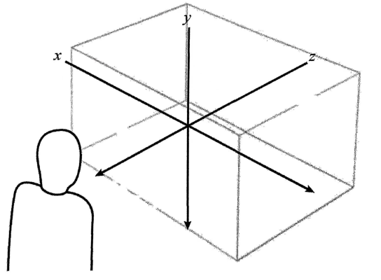

```html
<div class="box"></div>
```

```css
.box {
  width: 100px;
  height: 100px;
  margin: auto;
  border: 2px solid;
  transform: rotateY(60deg);
}
```

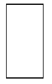

如果直接使用三维变化相关的属性，体验不出任何 3D 效果，因为还没有使用透视

此时需要给添加三维变化元素的父元素添加 `perspective` 透视属性，`perspective` 属性用于设置用户距离元素的距离，离的越近，变化越大，**默认距离是无穷远**

```css
body {
  perspective: 800px;
}
```


**注意：** 这个数值表示观察点位于屏幕前方有多远，恰当的距离一般是 600 ~ 1000 像素


**透视原点**

默认情况下，观察者的视线与应用透视的元素相交于元素的中心，通过使用 `perspective-origin` 属性来修改透视原点的位置，使用上跟 `transform-origin` 类似，可以接受 x、y 坐标值(带关键字 top、right、bottom 和 left)、百分比或者长度值，透视原点默认值为 `50%`

```css
body {
  perspective: 800px;
  transform-origin: 50%;
}
```


**perspective()变换函数**

在父元素上设置 `perspective` 属性可以让其中所有元素的三维变换都共享相同的透视关系

如果要让父元素内的个别元素设置单独的透视，需要使用 `perspective()` 函数

```css
.box {
  /* 为box元素设置单独的透视关系 */
  transform: perspective(800px) rotateY(60deg);
}
```


默认情况下，任何应用给父元素的三维变换都会导致子元素上的三维变换失效，并使其变平。如果不想让子元素上的三维变换失效，需要创建一个三维上下文，让子元素的变换与父元素在同一个三维空间中

```css
body {
  /* 默认值为 flat */
  transform-style: preserve-3d;
}
```


**高级三维变换**

`rotate3d()`：可以围绕穿越三维空间的任意一条线翻转元素

```css
.box {
  /* 假想的围绕的线会穿过变换原点和三维坐标为(1,1,1)的点，两点确定一条直线 */
  transform: rotate3d(1, 1, 1, 45deg);
}
```

前面的是 x、y、z 轴的向量坐标，最后的是角度，其中坐标定义了一条线，作为旋转轴，这里不用指定单位，因为点与点之间的位置是相对的，使用 `transform: rotate3d(100, 100, 100, 45deg);` 结果也与上述代码相同

后面的度数表示元素围绕旋转轴的旋转角度是 45 度


**三维矩阵变换**

与二维矩阵变换类似，也有一个 `matrix3d()` 函数，该函数接收 16 个参数，通常也是用于 JavaScript 和 CSS 组合实现高性能交互体验时才用的，堪称有史以来最复杂的 CSS 属性


## 第十一章 高级特效

使用高级特效就像是做菜添加了调味料，平淡无奇的菜也能浓香四溢。但是使用它们时需要小心谨慎，**必须考虑渐进增强**


**CSS Shapes**

CSS Shapes 是一个新的标准，可以让开发者使用各种形状，**形状元素不仅会影响界面的外观，还会影响页面的内容流**

CSS Shapes 包含两组新属性，一组是设置盒子中内容的形状，另外一组是设置影响形状元素周边内容流的形状

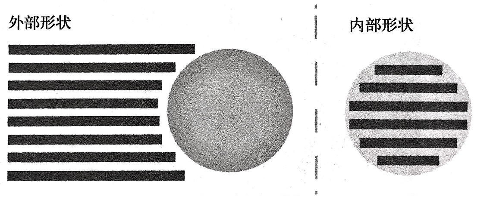

这两种形状分别由不同级别的 CSS Shapes 规范定义，其中 `shape-outside` 属性是唯一相对比较成熟的，`shape-inside` 目前浏览器目前还不支持

```css
.fig-moon {
  float: right;
  max-width: 40%;
  /* 实现文本环绕的效果 */
  shape-outside: circle();
}
```

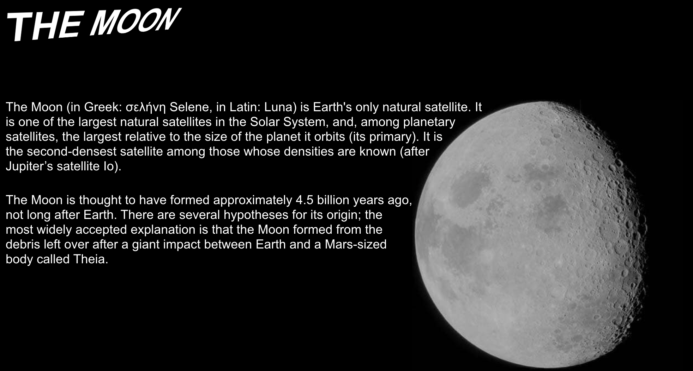

图片本身背景是黑色的，图片本身也是方形的，但文本流会环绕其中的圆形

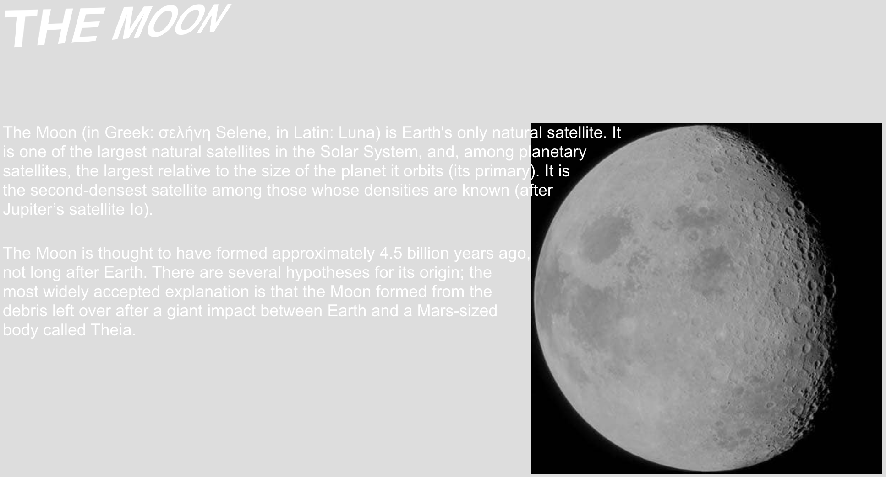

**注意：** 文本流只会绕排在浮动元素的左侧，只能让形状的一侧影响文本的行盒子。即使形状右边有空间文本也不会填进去


**形状函数**

除了上面用到的

`circle()`：圆形函数

`ellipse()`: 椭圆形函数

`polygon()`：多边形函数

`inset()`：嵌入在盒子边界的矩形，也可以指定圆角，算是 `clip` 属性的加强版本

```css
.shape-circle {
  /* 圆形接受一个半径值和一个位置值，具体语法与放射性渐变类似 */
  shape-outside: circle(150px at 50%)；
}
```

```css
.shape-ellipse {
  /* 圆形接受两个半径值和一个位置值 */
  shape-outside: ellipse(150px 40px at 50% 25%)；
}
```

`circle()` 函数没有传入参数时，默认的参数是以元素的中心为圆心，以最近边为半径


```css
.shape-inset {
  /* 距离外部盒子的上、下边各20px */
  /* 距离外部盒子的左、右边各30px */
  /* 还有半径为10px的圆角 */
  shape-outside: inset(20px 30px round 10px);
}
```


相对复杂一些的是 `polygon()` 函数，该函数接收一系列坐标对，用于在盒子表面指定多个点，**坐标相对于盒子的左上角**，最终把各个点连接起来就是要创建的形状

```css
.flg-planet {
  float: right;
  shape-outside: polygon(41.85% 100%,22.75% 92.85%,5.6% 73.3%,0.95% 52.6%,5.6% 35.05%,21.45% 17.15%,37.65% 12.35%,40% 0,100% 0%,100% 100%);
}
```

创建多边形最简单的方式就是使用 [CSS Shapes Editor](https://www.crxsoso.com/webstore/detail/nenndldnbcncjmeacmnondmkkfedmgmp) 插件，它支持 Chrome(**经过测试，疑似目前版本的 Chrome 124.0.6367.156 无法正常使用**)，会在检查形状元素时给出预览

多边形中每个点的坐标可以百分比表示，这样可以保证最大的灵活度，也可以使用 px、em，甚至 `calc()` 表达式

基于复杂图片创建多边形会非常麻烦，可以通过直接在图片的源文件上基于透明度来创建形状，可以使用带透明度的 PNG 格式的图片，通过将 `shape-outside` 函数的值由 `polygon()` 函数修改为指向该图片的 `url()` 函数

```css
.fig-planet {
  float: right;
  shape-outside: url(images/demo.png);
}
```

**注意：** 该写法只通过浏览器打开 HTML 文件是不行的，就算浏览器支持 CSS Shapes 也不行，**必须通过 Web 服务器取得这个页面**，这样引用的图片才会带有合适的 HTTP 首部信息，告诉浏览器该图片与 CSS 文件来自同一个域。这种安全机制是较新的浏览器才有的，为了防止引用的文件对你的计算机造成伤害


默认情况下，形状轮廓会沿图片完全透明的区域的边缘生成，但这个值可以通过 `shape-image-threshold` 属性来修改不透明度的**阈值**，默认值是 `0.0`(完全透明)，较大的值(最大为 `1.0`)，较高的不透明度也可以用来生成形状边界

```css
.fig-planet {
  float: right;
  shape-outside: url(images/demo.png);
  shape-image-threshold: 0.9;
}
```


**形状盒子与边距**

除了使用形状函数或图片，还可以使用元素的参照盒子来生成形状

```css
.fig-planet {
  float: right;
  border-radius: 50%;
  /* 告诉浏览器以 border-box 作为生成形状的依据 */
  shape-outside: border-box;
}
```

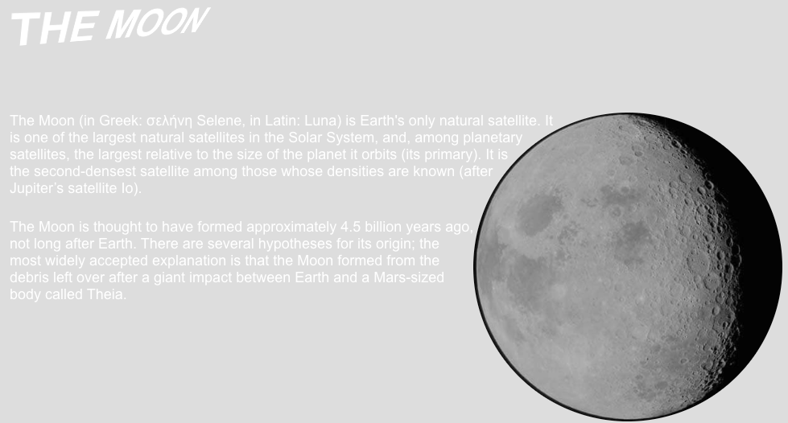

其它能生成形状的参照盒子还有 `content-box`、`padding-box` 和 `margin-box`，之所以这里有 `margin-box` 而没有 `box-sizing: margin-box`，是因为形状是基于浮动区域的，浮动区域也包含了外边距，所以 `margin-box` 是专门为形状定义的

如果要给复杂的形状添加外边距，可以使用 `shape-margin` 属性，这个属性用于给整个形状添加外边距，**与创建形状的方法无关**


**剪切与蒙版**

CSS 形状虽然可以改变周围文本流，但是不能允许改变元素自身的外观，通过添加圆角边框只是视觉上改变元素形状的一种方式，实际上通过把元素的部分区域变透明，可以影响元素自身的形状

剪切：使用路径形状定义硬边界，可以基于该边界完全切换元素的可见性

蒙版：用于将元素的某些区域设置为更透明或更不透明


**剪切**

最早是在 CSS 2.1 中通过 clip 属性引入的，但是该属性**只能给绝对定位的元素**使用，而且**只能把这些元素剪切为矩形**(使用 `rect()` 函数)

不过可以使用 `clip-path` 属性，它可以使用 CSS 形状中的基本形状函数定义如何剪切元素，还可以使用 SVG 文档剪切元素

```css
.stacked {
  clip-path: polygon(0 3vw, 100% 0, 100% calc(100% - 3vw), 0 100%);
}
```

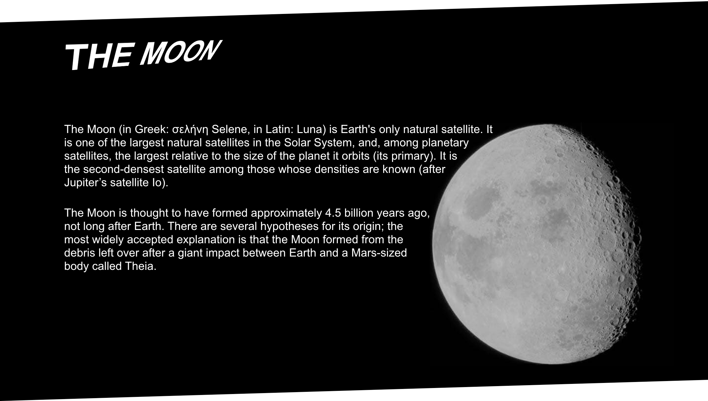

`0 3vw`：表示左上角 X 轴剪切长度为 0，Y 轴剪切长度为 3vw(视口宽度单位)

`100% 0`：表示右上角 X 轴剪切长度为 100%，Y 轴剪切长度为 0

`calc(100% - 3vw)`：表示指距离右下角 3vw，不能使用百分比表示，因为这个 Y 轴坐标是从上方开始计算的

`0 100%`：表示左下角 X 轴剪切长度为 0，Y 轴剪切长度为 100%


剪切后的路径只影响元素渲染后的外观，**不会影响页面流**，所以剪切后会与其它元素之间出现透明间隙

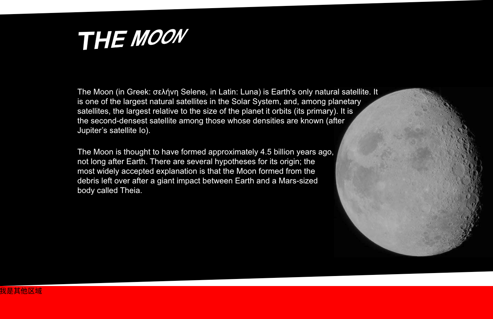

此时可以给每个堆叠的区块应用一个负外边距，要比 3vw 稍大一些，以此来让相邻的区块边缘重叠达到消除透明间隙的效果

```css
.stacked {
  clip-path: polygon(0 3vw, 100% 0, 100% calc(100% - 3vw), 0 100%);
  margin-bottom: -3.4vw;
}
```

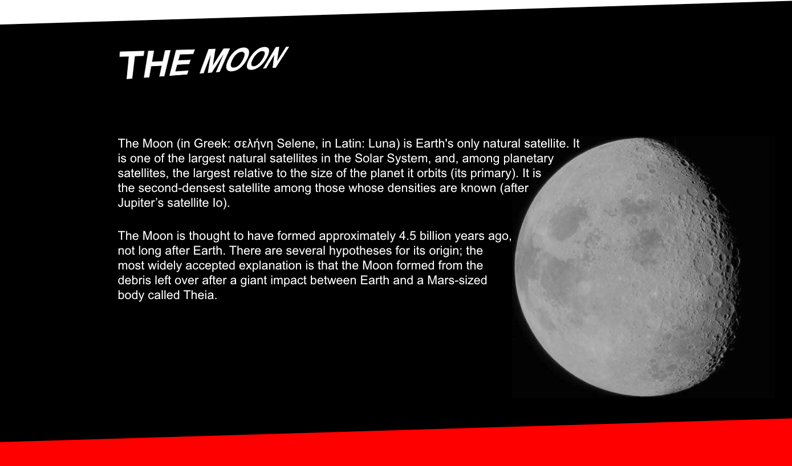

在只希望支持 `clip-path` 的浏览器中应用这个外边距，可以使用 `@supports` 规则

```css
@supports ((clip-path: polygon(0 0)) or (-webkit-clip-path: polygon(0 0))) {
  .stacked {
    margin-bottom: -3.4vw;
  }
}
```

在 `@supports` 规则块中，测试了浏览器是否支持最小的多边形(只有(0, 0)坐标一个点)


**使用 SVG**

虽然可以使用 `polygon()`、`circle()`、`ellipse()` 和 `inset` 函数创建剪切路径，与创建 CSS 形状一样，对于复杂的形状，还是建议使用图形编辑器来创建，将最终的图形作为剪切的源

1. 通过 Adobe Illustrator、Sketch 或 Inkscape 之类的图形编辑器创建自己想要形状，可以得到类似如下的 SVG 文件代码

   ```html
   <svg xmlns="http://www.w3.org/2000/svg" width="100px" height="100px" viewBox="0 0 100 100">
   	<circle cx="50" cy="50" r="40.1"/>
   	<ellipse transform="matrix(0.7084 -0.7058 0.7058 0.7084 -20.7106 49.8733)" cx="50" cy="50" rx="62.9" ry="12.8"/>
   </svg>
   ```

2. 将 SVG 图片转换为剪切路径，需要将其包装在一个 `<clipath>` 元素中，并添加一个 ID 属性

   ```html
   <svg xmlns="http://www.w3.org/2000/svg"
   	 width="100px" height="100px" viewBox="0 0 100 100">
   	<clipPath id="saturnclip">
   		<circle cx="50" cy="50" r="40.1"/>
   		<ellipse transform="matrix(0.7084 -0.7058 0.7058 0.7084 -20.7106 49.8733)" cx="50" cy="50" rx="62.9" ry="12.8"/>
   	</clipPath>
   </svg>
   ```

3. 在 CSS 中引用这个 SVG 文件中的剪切路径

   ```css
   .nav-section[href="#planets"] {
     clip-path: url(img/clip.svg#saturnclip);
   }
   ```

可以把多个剪切源保存在一个 SVG 文件中，然后通过 URL 片段 ID 分别引用

**注意：** SVG 文件中的 `<clipPath>` 的坐标会被解释为像素，所以剪切形状没有伸缩性，不能随着 HTML 内容的缩放而缩放。百分比是有效的，但是浏览器支持不好


**行内 SVG 剪切源**

不支持引用外部剪切源的浏览器其实支持 SVG 剪切路径，只不过 CSS、HTML 和 SVG 都必须在一个文件中

把 CSS 放入 `<style>` 元素中，把 SVG 内容也嵌入同一个文件中，就可以直接通过 ID 引用 `<clipPath>` 元素

```html
<!-- 以下是想要剪切的元素 -->
<li><a href="#planets">Planets</a></li>

<style>
	.nav-section[href="#planets"] {
  	clip-path: url(#saturnclip);
	}
</style>

<!-- 还是在同一个 HTML 文件中，内嵌了 SVG 作为剪切路径 -->
<svg xmlns="http://www.w3.org/2000/svg"
	 width="100px" height="100px" viewBox="0 0 100 100">
	<clipPath id="saturnclip">
		<circle cx="50" cy="50" r="40.1"/>
		<ellipse transform="matrix(0.7084 -0.7058 0.7058 0.7084 -20.7106 49.8733)" cx="50" cy="50" rx="62.9" ry="12.8"/>
	</clipPath>
</svg>
```

该写法具有更好的跨浏览器的兼容性，但是牺牲了 SVG 的复用性，HTML 也会显得乱一些

**注意：** Webkit 内核的浏览器有一个相关的 BUG，它们会认为剪切路径中的点的坐标相对于页面，而不是相对于被剪切的元素。可以对剪切元素使用 `transform: translate(0,0)` 表面上看不出什么，但是可以解决这个问题


**使用对象边界盒子控制剪切路径大小**

剪切路径不会随着项目的缩放而自动缩放，因为它们的大小都硬编码了，为了调整剪切路径的大小，可以使用两个坐标系，默认坐标系为 **当前用户空间坐标系(user space on use)**，就是剪切路径要应用的内容，意味着剪切路径中的一个单位会被解释为剪切的 HTML 元素中的一个像素

另一个坐标系是 **对象边界盒子(object bounding box)**，这个坐标系会使用一个比例尺，动态的将剪切路径中的单位对应到被剪切内容的大小。在这个比例尺中，X 轴的 0 表示这个盒子的最左边，1 表示最右边，Y 轴的 0 表示这个盒子的最上边，1 表示最下边

对于简单的图形，还可以手动修改，例如 50 px，在宽高都为 100 px 的元素中，就会被转换为 0.5，但对于复杂的元素，推荐在图形编辑器中把图形的边长缩小到 1 像素，然后再导出 SVG

```html
<svg xmlns="http://www.w3.org/2000/svg"
	 width="100px" height="100px" viewBox="0 0 100 100">
  <!-- clipPathUnits="objectBoundingBox" 使用对象边界盒子坐标系 -->
	<clipPath id="saturnclip" clipPathUnits="objectBoundingBox">
		<circle cx="0.5" cy="0.5" r="0.45"/>
		<ellipse transform="matrix(-0.7553 0.6554 -0.6554 -0.7553 1.2053 0.5499)" cx="0.5" cy="0.5" rx="0.639" ry="0.125"/>
	</clipPath>
</svg>
```


**蒙版**

使用 `mask-image` 属性，这个属性允许指定一张图片，并以这张图片作为加蒙版元素透明度层次的来源，作为蒙版的图片中，每个像素都有一个阿尔法级别(alpha level)，就是透明度，如果蒙版图片中的像素是透明的，那么加蒙版元素中对应的像素看不见，反之，蒙版图片中完全不透明的区域，对应的蒙版区域也会完全可见，与蒙版图片的颜色无关，所以灰度图常用做蒙版

```css
.header-title {
  mask-image: radial-gradient(
    ellipse 90% 30% at 50% 50%,
    rgba(0, 0, 0, 0) 45%,
    #000 70%
  );
  mask-size: 100% 200%;
}
```

除了图片，也可以使用 CSS 渐变来创建蒙版，`mask-image` 属性的值与 `background-image` 属性的值非常相似，同样也可以声明多个蒙版

与 `clip-path` 一样，SVG 中的蒙版也可以应用给 HTML 内容

```css
.header-title {
  mask: url(#ellipseMask);
}
```

```html
<svg xmlns="http://www.w3.org/2000/svg" height="0" viewBox="0 0 100 100">
  <mask id="ellipseMask" maskUnits="objectBoundingBox" maskContentUnits="objectBoundingBox">
  	<radialGradient id="radialfill" r="0.9" cy="1.1">
    	<stop offset="45%" stop-color="#000"/>
    	<stop offset="70%" stop-color="#fff"/>
  	</radialGradient>
	</mask>
</svg>
```

这里同样使用了 `objectBoundingBox` 坐标系，`maskContentUnits="objectBoundingBox"` 是为了将 SVG 蒙版元素本身设置为与蒙版形状相同的坐标系

SVG 蒙版使用明度而非阿尔法级别来应用蒙版。这意味着蒙版较暗的区域对应的加蒙版元素区域会较透明，而蒙版较亮的区域对应的加蒙版元素会较不透明


**透明 JPEG 与 SVG 蒙版**

渐变与剪切路径的尺寸应用算法不同，它们是默认基于 `objectBoundingBox`

对于复杂的形状，推荐使用 ZorroSVG(该网站截止2024年5月13访问显示页面丢失) 在线服务进行处理，可以上传 PNG 图片，可以得到包含 JPG 格式的 SVG 模版文件，缺点是会把透明数据转换为一个位图蒙版，相比于将其绘制为 SVG 图形，前者占用的空间稍大些，但对 PNG 图片的瘦身效果还是不错的


**混合模式与合成**

类似于 Photoshop 等这类图形编辑软件中的混合模式，总共有 16 种

图层合并的术语是**合成(compositing)**，**混合模式(blending mode)**是在合成过程中最常遇到的场景，混合模式是指合成图片的颜色值时不同的数学算法(合成时上方的图片是**源图片**，下方的图片是**目标图片**)


**正片叠加(multiply)**

计算方法是源像素的每个颜色通道的值乘以目标像素对应颜色通道的值，混合后的图片会变暗，在灰阶中 0 代表黑色，1 代表白色，假设源值为 0.8，目标值为 0.5，那么最终相乘后的值就是 0.8 x 0.5 = 0.4，偏暗了


**明度(luminosity)**

从源像素取得亮度级别，将其应用到目标像素的色相和饱和度

```css
.section-milkyway {
  background-image: url(../images/milkyway.jpg);
  background-color: #202d53;
  background-blend-mode: luminosity;
}
```

通过给这个区块应用偏紫色的背景颜色，再应用 `background-blend-mode: luminosity;`，就会给图片增加色彩，让全图的色调统一

一般来说明度通过与纯色图片进行混合，为图片增添色彩

一个元素可以有多个背景图片，背景会按照它们声明的次序逆序叠加在一起，如果有多个图层，可以声明一个逗号分隔的背景混合模式列表，把它们依次应用到每一层(及下一层)

**注意：** 背景层不会与元素后面的内容混合，无论背景是否透明，如果只有一个背景颜色层，而没有其他图像或图案层，设置 `background-blend-mode` 也没用，因为混合模式需要两个或多个图层才能发挥作用


**混合元素**

与混合背景层类似，你可以混合**元素**与它们的背景，元素的混合可能是静态定位的子元素与其父元素的混合，也可能是绝对定位与页面另一个部分的叠加

**注意：** 不同的堆叠上下文的元素不能相互混合


**滤色模式(screen)**

把两张图片投影到同一个屏幕上，会得到整体偏亮的图像，如果第一张图片不够亮，第二张图片上的光线会透过来，反之亦然，最终的结果都是图片整体变亮

白色的源会完全不透明，黑色的源会变透明，因此很适合作为蒙版使用，利用这一点，就可以实现有趣的镂空效果

```css
.text {
  mix-blend-mode: screen;
}
```


**隔离**

隔离就是创建元素分组，把混合控制在分组内部，不同的堆叠上下文中的元素不会相互混合

可以通过使用 `opacity: 0.999` 或 `isolation: isolation` 创建新的堆叠上下文


**滤镜**

通过滤镜可以给元素(**按序**)应用一种或多种特效，其中一部分滤镜是与颜色有关，可用于调整亮度、对比度和饱和度

```css
.box {
  filter: grayscale(70%) brightness(0.7) contrast(2);
}
```

以上代码是将整个元素的颜色去掉了 70%，又将其亮度(从正常的值 1)调低至 0.7，并将对比度提升为正常值的 2 倍

多数滤镜既可以接受百分比值，有可以接受数值


**色相旋转(滤镜)**

多数情况下都应该使用图形编辑器处理一下图片，为了性能也应该这样做

通过使用 `hue-rotate()` 滤镜传递一个度数值来旋转图片的整体色相，以标准色轮为参照，从顶部开始算，例如明黄色使用 `hue-rotate(40deg)`，但如果对于黑白图像，根本没有色相信息，色相旋转不会有任何效果，此时可以先使用`sepia()` 滤镜给图片上色，同样也是以标准色轮的参照，最后再使用 `hue-rotate()` 滤镜

```css
.box {
  filter: sepia(1) hue-rotate(10deg);
}
```


**阴影(滤镜)**

`box-shadow` 会应用到元素矩形的边框盒子，而 `drop-shadow()` 滤镜会应用到元素透明的轮廓，应用范围包括基于阿尔法透明度给图片应用阴影，保持阴影与轮廓吻合，或者使用 `clip-path` 剪切的元素添加阴影

```css
.box {
  filter: drop-shadow(0 0 0.5em rgba(0,0,0,0.3));
}
```

通过传入 X、Y 轴的偏移量，模糊半径和颜色，在应用 `drop-shadow()` 滤镜效果时，浏览器会优先使用图形芯片(GPU)，这样 `drop-shadow()` 滤镜有了性能优势，如果要给阴影加动画，这个时候最好不要使用 `box-shadow`，而是要使用 `drop-shadow()` 滤镜


**模糊(滤镜)**

通过使用 `blur()` 实现给元素应用高斯模糊，接受一个表示模糊半径范围的长度值

```css
.box {
  filter: blur(20px);
}
```

**注意：** 从性能角度来讲，`blur()` 滤镜不友好，需要小心使用


**背景(滤镜)**

通过使用 `backdrop-filter` 属性给元素应用背景滤镜，原理与 `filter` 属性相似，是给元素背景及其后页面的合成效果滤镜，可以利用它来实现类似毛玻璃效果

```css
.box {
  backdrop-filter: blur(5px);
  background-color: rgba(0,0,0,0.5);
}
```


**通过图片滤镜函数为背景图片应用滤镜**

通过 CSS 加载的图片时候也可以使用滤镜，要给背景图片加滤镜，可以把图片传给 `filter()` 函数，该函数参数与 `filter` 属性类似，可以连缀传递，第一个参数是图片

```css
.box {
  background-image: filter(url(images/demo.png),grayscale(1),opacity(0.4));
}
```

**注意：** `filter()` 函数存在浏览器兼容性问题，需要谨慎使用


**高级滤镜与 SVG**

国外软件 `Instagram` 等图片应用支持给照片应用预合成的滤镜，可以使用 [CSSgram](https://github.com/una/CSSgram) CSS库实现类似的效果，CSS 滤镜最强大的地方是可以使用 SVG 创建自定义滤镜，而且对滤镜效果的复杂度没有限制，CSS 代码量也不大，CSS 版滤镜最初是在 SVG 中出现的，基本上所有的 CSS 滤镜都是以对应的 SVG 滤镜作为范本来实现的

```html
<style>
.box {
	filter: grayscale(100%);
}
</style>

<!-- 上面的声明底层实现是下面的 SVG 滤镜 -->
<filter id="grayscale">
  <feColorMatrix
    type="matrix"
    values="0.213 0.715 0.072 0 0 
            0.213 0.715 0.072 0 0 
            0.213 0.715 0.072 0 0 
            0 0 0 1 0"
  />
</filter>
```

滤镜声明中只包含一个滤镜原语，由一个颜色矩阵滤镜效果元素 `feColorMatrix` 表示

我们可以创建自己的滤镜，并将其应用到 HTML 内容

**注意：** 浏览器还没有对 SVG 效果实现硬件加速，自定义滤镜要尽量少用，有些浏览器会限制使用外部 SVG 片段标识符，目前最好还是考虑把 SVG 写入在同一个 HTML 文件中


**应用特效的次序**

为了保证正确的结果，要遵循应用剪切、蒙版、混合和滤镜的标准次序，所有剪切、蒙版、混合和滤镜都会在其他属性之后应用，包括 `color`、`width`、`height`、`border` 背景属性等设置元素基本外观的属性( `opacity` 除外 )，然后是后处理阶段，即应用特效，此时的元素及其内容会被当成一张图

按声明次序执行滤镜，接着剪切元素，然后应用蒙版，因为先应用滤镜之后才会应用剪切和蒙版，不能直接对剪切后的形状应用 `drop-filter()` 滤镜，解决办法是给项目元素应用 `drop-shadow()`，而把剪切路径放到项目中的链接里

最后一步是合成，应用混合模式，这一步会同时应用 `opacity` 属性，因为它实际上也是一种混合模式
