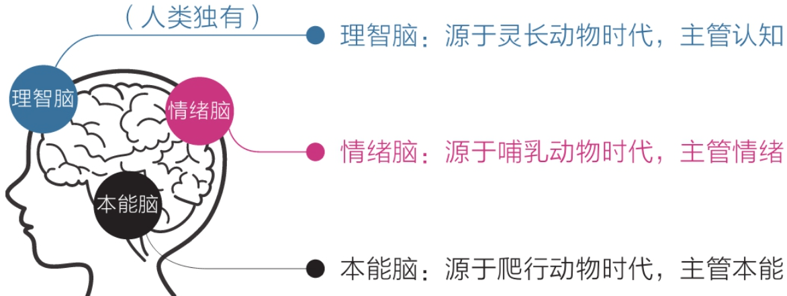

# 认知觉醒读书笔记

## 人类的三重大脑

理智脑虽然高级，但是相比本能脑和情绪脑来说力量太弱。

所以有时候做不成事情就是因为本能脑和情绪脑的力量太强了，压制了理智脑，例如：

- 知道读书很重要，但是却掏出了手机
- 知道锻炼身体有益，但是坚持了两天就没了下文

**最好的方式是：用理智脑制定策略去驱动本能脑和情绪脑去干活，而非对抗**

## 焦虑的根源

**焦虑的几种类型：**

- 完成焦虑：日程安排的太满，同时想学很多的东西，耽误一天就容易喘不过气来
- 定位焦虑：总是拿自己跟别人比较，例如：别人年纪轻轻就取得了专业领域内很高的成就，就觉得自己何年何月才能做到
- 选择焦虑：例如读书方法：有人说阅读要只字不差、也有人说阅读要主题阅读，不用全部读完，方法都对，但方向完全相反，导致难以选择
- 环境焦虑：因为家庭、工作的影响，很多事情想做但却做不到
- 难度焦虑：有些书很难读、有些知识点很难理解，始终在困难周围打转，时间越长越焦虑

**焦虑的主要原因：** 想做很多事情，又想立即看到效果

**人类的天性就是：急于求成，想同时做很多事情，避难趋易，想不怎么努力就看到效果**

**如何克服焦虑：**

- 克制欲望，不要让自己同时做很多事情
- 面对现实，认清自己的真实水平
- 要事优先，想办法只做最重要的事情
- 接受环境，在局限中做力所能及的事情
- 直面核心，狠狠逼自己一把突破困难

## 保持耐心

**缺乏耐心，是人类的天性**

社会中的精英通常是能更好的克服天性的人，他们耐心水平更高，延迟满足能力更强

