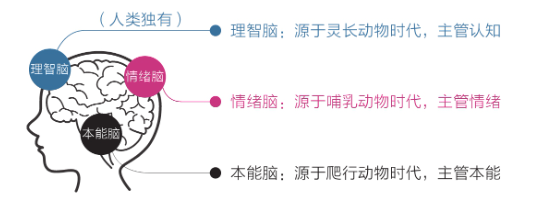
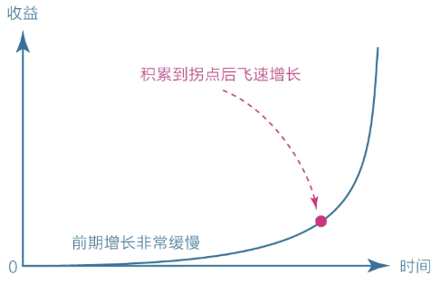
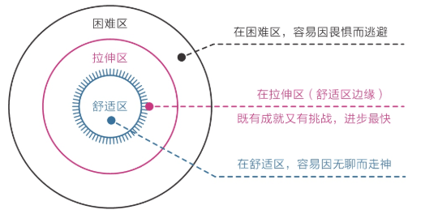
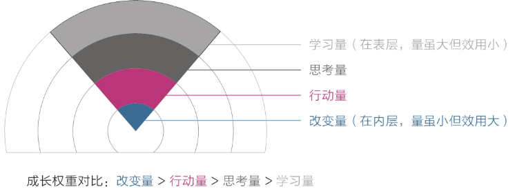
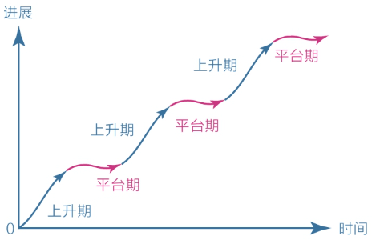
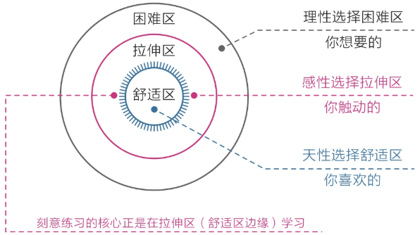
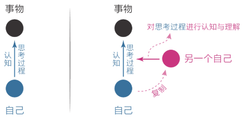
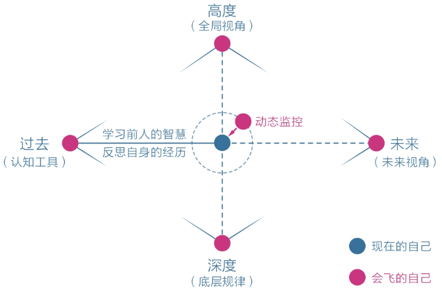

# 认知觉醒读书笔记

## 人类的三重大脑

理智脑虽然高级，但是相比本能脑和情绪脑来说力量太弱

所以有时候做不成事情就是因为本能脑和情绪脑的力量太强了，压制了理智脑，例如：

- 知道读书很重要，但是却掏出了手机
- 知道锻炼身体有益，但是坚持了两天就没了下文

**最好的方式是：用理智脑制定策略去驱动本能脑和情绪脑去干活，而非对抗**

## 焦虑的根源

**焦虑的几种类型：**

- 完成焦虑：日程安排的太满，同时想学很多的东西，耽误一天就容易喘不过气来
- 定位焦虑：总是拿自己跟别人比较，例如：别人年纪轻轻就取得了专业领域内很高的成就，就觉得自己何年何月才能做到
- 选择焦虑：例如读书方法：有人说阅读要只字不差、也有人说阅读要主题阅读，不用全部读完，方法都对，但方向完全相反，导致难以选择
- 环境焦虑：因为家庭、工作的影响，很多事情想做但却做不到
- 难度焦虑：有些书很难读、有些知识点很难理解，始终在困难周围打转，时间越长越焦虑

**焦虑的主要原因：** 想做很多事情，又想立即看到效果

**人类的天性就是：急于求成，想同时做很多事情，避难趋易，想不怎么努力就看到效果**

**如何克服焦虑：**

- 克制欲望，不要让自己同时做很多事情
- 面对现实，认清自己的真实水平
- 要事优先，想办法只做最重要的事情
- 接受环境，在局限中做力所能及的事情
- 直面核心，狠狠逼自己一把突破困难

## 保持耐心

**缺乏耐心，是人类的天性**

社会中的精英通常是能更好的克服天性的人，他们耐心水平更高，延迟满足能力更强

### 复利曲线

复利效应的两个关键点：

1. 努力的方向是正确的
2. 有坚持下去的毅力

**复利效应的真正核心在于时间，复利效应最大的风险就是中途退场**

### 舒适区边缘

舒适区边缘和复利曲线通常组合在一起

**在舒适区边缘耐心的探索，直到达到复利曲线的拐点，进步就会飞速显现出来**

### 成长的权重对比

**学习时不能只盯着表面的学习时长以及学习量，必须要深入思考，并且付诸于实际行动，才能真正带来改变**

多即是少：无效努力，越走方向越偏

少即是多：有效努力，就像滚雪球一样，小球慢慢变成大球

**实践建议：** 读书时不要求记住书中全部的知识，只要有一两个观点促使自己发生了改变就做够了，收获的意义比读了很多书但只停留在知道的层面大得多

### 学习的平台期

学习进展和时间**并非是线性关系**的，是一种波浪式的上升曲线

在平台期里，付出了大量的努力，但**看起来毫无进步甚至可能是退步，这仅仅是一种假象**，大脑中的神经元依旧在发生连接并不断的巩固，到了某一节点后就会进入下一个快速上升阶段

### 如何获得耐心

前面的四个规律揭示了**耐心不是毅力带来的结果，是具有长远目光的结果**

1. 面对天性，放下自己的心理包袱，**接受自己焦虑、不耐烦、缺乏耐心这一事实**

   **具体实践：** 察觉到自己失去耐心了就跟自己对话，理解自己，不苛责自己

2. 面对诱惑，学会延迟满足，变对抗为沟通

   **具体实践：** 告诉自己该享受的一点也不会少，只是现在不享受，而是在完成了重要事情之后再享受，而非放弃享受，如果有高层次的享受可选，就不太会依赖低层次的享受了

3. 面对困难，主动改变自己的视角，赋予行动意义

   **具体实践：** 改变自己的认知视角，例如知道读书和健身的好处和意义，就越有耐心去做这件事情

## 消除模糊

模糊，是人生困扰之源，人生也是一场消除模糊的比赛，谁越模糊，谁就越混沌，谁模糊越轻微，谁就越清醒

**人类天生就不喜欢思考和学习，因为这类事情非常耗能，在漫长的进化过程中，生命的首要任务是生存，因此第一原则是节能，凡是高能耗的事情都会被视作为生存的威胁**

学习和获取知识，本质上都是为了消除模糊

人们总是习惯在模糊区打转，在舒适区兜圈，重复做已经掌握的事情，对真正的困难视而不见，这背后都是潜意识在操控，因为基因认为这样做耗能更低

### 消除烦恼

真正的困难总比想象的要小很多，人们拖延、纠结、畏惧、害怕的根本原因往往不是事情本身有多难，而是内心的想法变得模糊

要想不受其困扰，唯一的办法就是**正视它、看清它、拆解它、化解它**，不给它进入潜意识的机会，不给它变模糊的机会；即使已经进入潜意识，也要想办法将它挖出来，所以，当感到心里有说不清、道不明的难受的感觉时，赶紧坐下来，**向自己问以下几个问题**

- 到底是什么让自己烦躁不安？是上台演讲、会见某人，还是思绪纷乱？
- 具体是什么让自己恐惧担忧？是能力不足、准备不够，还是害怕某事发生？
- 面对困境，我能做什么？不能做什么？如果做不到或搞砸了，最坏的结果是什么？

一层层挖下去，直到挖不动为止

**恐惧就是一个欺软怕硬的货色，你躲避它，它就张牙舞爪，你正视它，它就原形毕露，一旦把它看得清清楚楚，情绪就会慢慢从潜意识中消散，你的生活将会舒畅无比**

### 行动力不足

行动力不足的真正原因是选择模糊

如果有自由可支配的时间，当没有足够清晰的指令或目标时，就很容易在选择享乐，放弃那些本该坚持但比较烧脑的选项

所以**要拥有足够清晰的目标，在诸多的可能性中建立一条单行道，让自己始终处于没得选的状态**，规划好每天要做的事情，并养成习惯

## 潜意识

感觉、感性可以称为**潜意识**，而理性可以称为**意识**

潜意识由以下两部分组成：

- **天性：** 没有思维，只在乎眼前的事物，喜欢即刻、确定、简单、舒适
- **感性：** 处理信息的速度极快，至少可达 11 000 000 次/秒，能极其敏锐地感知很多不易察觉的信息

当第一次见到一个人感到些许不适，就表示潜意识察觉到一些不良信息，凭感觉就是察觉潜意识发出的信息

### 凭感觉学习

**先用感性能力帮助自己选择，再用理性能力帮助自己思考**

例如在读书时，看到有启发的点，先停下来，围绕这个触发点问自己以下三个问题：

1. 为什么刚才这个点让我有启发？
2. 我能够把这个启发点用在3个不同的事情上吗？
3. 这个启发点有没有其他类似的知识？

上述步骤就是先用感性选择自己有启发的点，后用理性分析为什么会有启发以及如何运用

读书时可以只取一个全书最触动自己的点，然后尽可能去实践、改变，这样读书不仅收获更大，而且也不会焦虑

在生活中对某件事动了感情，也可以问自己问题来追问原因，例如如下问题：

- 为什么这个电影桥段会让我感动？发生了什么？

- 为什么这个产品让我这么喜欢？是什么让它与众不同？
- 为什么我不由自主地沉溺于这段剧情了

### 凭感觉寻找人生目标

目标是存放热情和精力的地方，如果没有目标，内心没有喜悦、生活没有激情，甚至会厌恶自己

用心去感受什么事情最让自己触动的，而不是用脑去感受什么事情最有利

对于小事听从你的脑，对于大事听从你的内心，例如在做某项重大决定之前，先去吃一顿你最喜欢吃的美食，如果它还是像之前一样美味，那就去做，如果不如从前，那需要慎重考虑

### 如何捕获感性

1. **“最”字法：** 关注那些最触动自己的点，例如让自己眼前一亮、心中泛起波澜的人和事情，学会捕捉它们，去深入挖掘原因
2. **“总”字法：** 对于内心中总是重复出现的念头，要有意识的审视并消除它
3. **无意识的第一反应：** 关注自己第一次见到某个人、第一次走进某个房间，第一次做某件事时内心的瞬间的念头，第一个念头往往是来着潜意识的真实信息
4. **梦境：** 梦境是潜意识传递信息的一种方式，可能是内心真实想法的展示，也可能是灵感的启发
5. **身体：** 无论是生理上还是心理上的不适，都会通过身体如实地反映出来
6. **直觉：** 给一些来路不明、无法解释的信息开绿灯

## 元认知

元认知就是最高级别的认知，它能对自身的 “思考过程” 进行认知和理解

元认知是反思，但不是普通的反思，而是复盘，梳理事情的经过，吸取经验

人的思维就像是一把锤子，不仅可以锤钉子，还可以复制出另外一把锤子来锤打自己

元认知可以分为以下两种：

- 被动元认知
- 主动元认知

### 被动元认知

指个体受到外部压力或问题时，**被迫启动**自我反思和认知调整的能力

例如：

- 遭受批评或指责时，才开始反思自己的行为
- 面对挫折或失败时，才意识要调整自己的思维方式

在顺境中，被动元认知者往往顺着自己的本能做事，对自身行为缺乏察觉

### 主动元认知

指个体在没有外部压力的情况下，**主动启动**自我反思和认知调整的能力

例如：

- 即使在顺境中，也会主动反思自己的行为和思维方式
- 通过持续的自我监控和反思，主动调整自己的行为和决策
- 主动元认知者能从更高、更远的视角审视自己，避免被短期情绪或本能左右

类似于吾儿三省吾身，具有前瞻性和主动性

### 元认知如何改变命运

人生是由无数个选择组成的，不同选择的累加造就了不同的人生。如果觉得自己的人生不如意，问题十有八九就出在这里

高级的元认知时刻帮你从高处、深处、远处看待现在的自己，让自己保持清醒、不迷失，保持动力、不懈怠，保持平和、不冲动

实践步骤：想象有一个 “灵魂伴侣”，他会动态监控自己，伴随你和指引你

